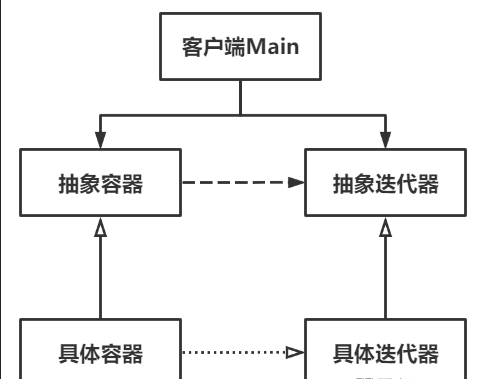

# Iterator迭代器

Owner: -QVQ-

行为型的软件设计模式，提供一种方法能顺序访问聚合对象中的各个元素，而又不暴露其内部。

迭代器的意义就是将这个行为抽离封装起来，这样客户端只需要调用合适的迭代器，来进行对应的遍历，而不用自己去实现这一行为。

优点：

1. **符合单一职责原则**。将遍历行为抽离成单独的类。
2. **符合开闭原则**。添加新集合或者新迭代器，不改变原有代码。
3. **便于扩展多种遍历行为**。
4. **访问数据又不暴露内部**。

缺点：

1. **若对聚合对象只需要进行简单的遍历行为，那使用迭代器模式有些大材小用**。
2. **系统复杂性提高，类数量较多**。


代码：

```cpp
// 定义迭代器接口
class Iterator 
{
public:
	// 下一个
	virtual int next() = 0;
 
	// 是否有下一个
	virtual bool hasNext() = 0;
 
};
 
// 定义具体迭代器
class ConcreteIterator : public Iterator 
{
public:
	// 构造函数
	ConcreteIterator(std::vector<int> data) : m_data(data), index(0) {}
 
	// 下一个
	virtual int next() {
		return m_data[index++];
	}
 
	// 是否有下一个
	virtual bool hasNext() {
		return index < m_data.size();
	}
 
private:
	std::vector<int> m_data;
	int index;
 
};
```

```cpp
// 定义容器接口
class Container 
{
public:
	virtual Iterator* create_iterator() = 0;
};
 
// 定义具体容器
class ConcreteContainer : public Container 
{
public:
	// 构造函数
	ConcreteContainer(std::vector<int> data) : m_data(data) {}
 
	// 创建迭代器
	virtual Iterator* create_iterator() {
		return new ConcreteIterator(m_data);
	}
 
private:
	std::vector<int> m_data;
 
};
```

```cpp
// 创建容器和迭代器
	std::vector<int> data = { 1, 2, 3, 4, 5 };
	Container* container = new ConcreteContainer(data);
	Iterator* iterator = container->create_iterator();
 
	// 迭代器输出
	while (iterator->hasNext()) {
		std::cout << iterator->next() << " ";
	}
```

迭代器模式可以看作是桥接模式的一种特殊情况