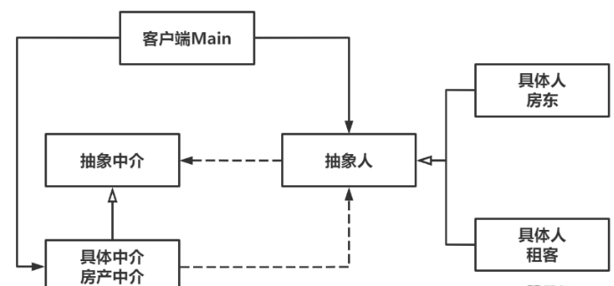

# Mediator中介者模式（仲裁者模式）

Owner: -QVQ-

行为型的软件设计模式

> 如果有10个租客，5个房东，他们各自单线联系，那么他们之间的交流会相对混乱。此时出现了一个房产中介，由中介安排合适的租客和房东交流
> 

优点：

1. **解耦**。中介的存在使得同事对象间的强耦合关系解除，它们可以独立地变化而不会影响到整体，便于被复用。
2. **良好扩展性**。交互行为发生改变，只需要扩展中介即可。
3. **集中交互，便于管理**。

缺点：

1. **中介者的职责很重要，且复杂**。


```cpp
// 抽象类-人
class Person
{
public:
	// 构造函数
	Person(Mediator* mediator) : m_mediator(mediator) {}
 
	// 发出消息
	virtual void sendMessage(std::string message) = 0;
 
	// 获取消息
	virtual void getMessage(std::string message) = 0;
 
protected:
	Mediator* m_mediator;
};
 
// 具体类-租客
class Tenant : public Person
{
public:
	// 构造函数
	Tenant(Mediator* mediator) : Person(mediator) {}
 
	// 发出消息
	virtual void sendMessage(std::string message) {
		m_mediator->sendMessage(message, this);
	}
 
	// 获取消息
	virtual void getMessage(std::string message) {
		std::cout << "租客得到消息：" << message << std::endl;
	}
};
 
// 具体类-房东
class Landlord : public Person 
{
public:
	// 构造函数
	Landlord(Mediator* mediator) : Person(mediator) {}
 
	// 发出消息
	virtual void sendMessage(std::string message) {
		m_mediator->sendMessage(message, this);
	}
 
	// 获取消息
	virtual void getMessage(std::string message) {
		std::cout << "房东得到消息：" << message << std::endl;
	}
};
```

```cpp
// 抽象中介者
class Mediator 
{
public:
	// 发出信息
	virtual void sendMessage(std::string message, Person* colleague) = 0;
 
};
 // 具体中介者-房产中介
class RealEstateMediator : public Mediator
{
public:
	// 设置租客
	void setTenant(Person* tenant) {
		m_tenant = tenant;
	}
 
	// 设置房东
	void setLandlord(Person* landlord) {
		m_landlord = landlord;
	}
 
	// 发出信息
	virtual void sendMessage(std::string message, Person* colleague) {
		if (colleague == m_tenant) {
			m_landlord->getMessage(message);
		}
		else {
			m_tenant->getMessage(message);
		}
	}
 
private:
	Person* m_tenant;
	Person* m_landlord;
 
};
```

主函数

```cpp
// 创建对象
	RealEstateMediator *mediator = new RealEstateMediator();
	Person *tenant = new Tenant(mediator);
	Person *landlord = new Landlord(mediator);
 
	// 中介设置房东和租客
	mediator->setTenant(tenant);
	mediator->setLandlord(landlord);
 
	// 进行租房询问
	tenant->sendMessage("房租多少钱？");
	landlord->sendMessage("房租3000元。");
```

先创建中介，关联中介和通信双方，通信双方也关联中介，然后通过中介实现通信双方的操作