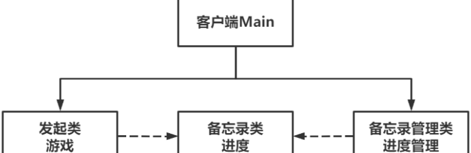

# Memento备忘录模式

Owner: -QVQ-

行为型的软件设计模式，在不破坏封装的前提下，获取一个对象的内部状态，并在对象外保存该状态，当对象需要恢复到该状态时，对其进行恢复

优点：

1. **良好封装性**。发起人对象中的内部状态被保存在备忘录中，也只能由自己读取，对其他对象起到了屏蔽作用。
2. **提供了状态恢复机制**。类似于游戏存档读档。
3. **简化了发起人职责**。发起人状态的存储和获取，被分离出去了。

缺点：

1. **资源消耗较大，对发起人对象不同内部状态的存储，会导致开销增加**。


代码：

```cpp
// 备忘录类-游戏进度
class Memento 
{
public:
	// 构造函数
	Memento(string state) : m_state(state) {}
 
	// 获取状态
	std::string getState() const{ 
		return m_state;
	}
 
private:
	std::string m_state;
};
// 备忘录管理类-进度管理
class CareTaker 
{
public:
	// 添加备忘录
	void addMemento(const Memento& memento) { 
		m_mementos.push_back(memento);
	}
 
	// 获取备忘录
	Memento getMemento(int index) { 
		return m_mementos[index];
	}
 
private:
	std::vector<Memento> m_mementos;
};
```

```cpp
// 发起类-游戏
class Game 
{
public:
	// 设置状态
	void setState(string state) { 
		m_state = state;
	}
 
	// 获取状态
	string getState() { 
		return m_state;
	}
 
	// 保存状态至备忘录
	Memento saveStateToMemento() { 
		return Memento(m_state); 
	}
 
	// 从备忘录获取状态
	void getStateFromMemento(const Memento& memento) { 
		m_state = memento.getState(); 
	}
 
private:
	std::string m_state;
};
```

备忘录管理类通过 容器存放备忘录类，发起类生成备忘录类并通过备忘录管理类放入备忘录管理类中

main

```cpp
	
	Game game;
	CareTaker careTaker;
	// 通关
	game.setState("进度：第一关通过");
	game.setState("进度：第二关通过");
	// 保存进度，进度被管理系统管理
	careTaker.addMemento(game.saveStateToMemento());
	// 继续通关
	game.setState("进度：第三关通过");
	// 保存进度，进度被管理系统管理
	careTaker.addMemento(game.saveStateToMemento());
	// 获取首个进度
	game.getStateFromMemento(careTaker.getMemento(0));
	cout << "1）" << game.getState() << endl;
	// 获取第二个进度
	game.getStateFromMemento(careTaker.getMemento(1));
	cout << "2）" << game.getState() << endl;
```