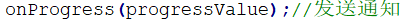

# Observer观察者模式

Owner: -QVQ-

行为型的软件设计模式

**目的：**

在软件构建过程中，我们需要为某些对象建立一种“通知依赖关系” ——**一个对象（目标对象）的状态发生改变，所有的依赖对象（观察者对象）都将得到通知**。如果这样的依赖关系过于紧密，将使软件不能很好地抵御变化。使用面向对象技术，可以将这种依赖关系弱化，并形成一种稳定的依赖关系。从而实现软件体系结构的松耦合。

**定义：**

定义对象间的一种一对多（变化）的依赖关系，以便当**一个对象(Subject)的状态发生改变时，所有依赖于它的对象都得到通知并自动更新。**

优点：

1. 耦合双方依赖于抽象，不需要了解具体。
2. 提供了稳定的信息更新传递机制。
3. 良好扩展性。

缺点：

1. 当观察者过多时，挨个通知观察者消息可能会花费较长时间。
2. 某个观察者出现卡顿，可能影响整个进程，一般采用异步机制解决，但同时也要注意程序安全

**例如：**

这个程序完成实现文件分割，红框内为新增需求


上面的类修改时，下面的类也需要修改


**解决：**

对于新增的需求实际上需要起到一个通知作用

1.从原本的通知控件

变成新增一类（iprogress）作为其他类的父类，也就是这里的接口类来实现通知


对于多继承，一般只有一种是父类，其他都是接口类

2.接口类中实现具体接口（consolenotifier类、mainform类），一个接口一个类

3.目标对象中（filesplitter），通过在队列中插入接口类来实现订阅功能

4.主流程函数（mainform）中，确认在目标对象中订阅哪些类

5.目标对象中，实现循环调用具体接口（onprogress函数）


**结构：**


目标对象类、观察类是稳定的部分，具体的接口实现是变化的部分

总结：

- **使用面向对象的抽象，Observer模式使得我们可以独立地改变目标与观察者，**从而使二者之间的依赖关系达致松耦合。
- 目标发送通知（即调用具体的接口实现）时，无需指定观察者，通知（可以携带通知信息作为参数）会自动传播。


- 观察者（作为主流程类）自己决定是否需要订阅通知，目标对象（相当于主流程的一个子流程）对此一无所知。


- Observer模式是基于事件的UI框架中非常常用的设计模式，也是MVC模式的一个重要组成部分。

代码：

观察者

```cpp
// 抽象观察者
class Observer 
{
public:
	// 构造函数
	Observer(int num):m_number(num){}
 
	// 更新
    virtual void update(bool flag) = 0;
 
protected:
	int m_number;
}
// 具体观察者-汽车
class Car : public Observer 
{
public:
	// 构造函数
	Car(int num) :Observer(num) {}
 
	// 更新
	virtual void update(bool flag) {
		if (flag) {
			cout << m_number << "号汽车：发动。" << endl;
		}
		else {
			cout << m_number << "号汽车：停止。" << endl;
		}
    }
};
```

主题（被观察者），当主题发生改变时，通过传参调用每个观察者来实现通知

内部维持一个指针数组，指向每个观察者

```cpp
// 抽象主题-被观察者
class Subject 
{
public:
	// 连接
    virtual void attach(Observer* observer) = 0;
 
	// 断连
    virtual void detach(Observer* observer) = 0;
 
	// 通知
    virtual void notify(bool flag) = 0;
 
protected:
	vector<Observer*> observers;
};
// 具体主题-红绿灯
class TrafficLight : public Subject
{
public:
	// 连接,加入观察者
	virtual void attach(Observer* observer) {
        observers.push_back(observer);
    }
 
	// 断连，取消观察者
	virtual void detach(Observer* observer) {
		for (auto iter = observers.begin(); iter != observers.end();){
			if (*iter == observer){
				iter = observers.erase(iter);
			}
			else{
				iter++;
			}
		}
    }
 
	// 通知
	virtual void notify(bool flag) {
		if (flag) {
			cout << "绿灯通行。" << endl;
			for (auto observer : observers) {
				observer->update(flag);
			}
		}
		else {
			cout << "红灯停止。" << endl;
			for (auto observer : observers) {
				observer->update(flag);
			}
		}
    }
 
};
```

主函数

```cpp
// 创建主题对象
	Subject *subject = new TrafficLight();
 
	// 创建观察者对象
	Observer *observer1 = new Car(1);
	Observer *observer2 = new Car(2);
	Observer *observer3 = new Car(3);
	Observer *observer4 = new Car(4);
 
	// 连接观察者
	subject->attach(observer1);
	subject->attach(observer2);
	subject->attach(observer3);
	subject->attach(observer4);
 
	// 绿灯行
	subject->notify(true);
 
	// 3号车通过，不需要再观察
	subject->detach(observer3);
	cout << "3号车已通过。" << endl;
 
	// 红灯停
	subject->notify(false);
```