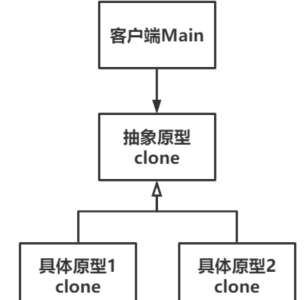

# Prototype原型

Owner: -QVQ-

创建型

通过一个原型对象，快速地创建出多个一致的对象，并对其（复制的对象）进行相关的操作

优点：

1. **便捷、简洁、高效**。不需要考虑对象的复杂程度，只需要复制即可。
2. **无需初始化**。可动态地获取当前原型的状态，并在当前基础上进行拷贝。
3. **允许动态增加或减少产品类**。

缺点：

1. **每个类都需要配备一个clone函数**，若对已有的类进行改造，需要修改其源码，违背了开闭原则。


文件类：

```cpp
class Content
{
public:
	// 显式构造函数
	explicit Content(string input) :m_text(input) {};
	// 析构函数
	~Content() {}
	// 设置内容
	void setText(string input) {
		m_text = input;
	}
	// 获取内容
	string getText() {
		return m_text;
	}
private:
	string m_text;                                       // 文本内容
};
 
// 抽象文件类
class File
{
public:
	// 构造函数
	File(string name) :m_name(name) {
		m_content = nullptr;
	};
	// 析构函数
	virtual ~File() {
		if (m_content != nullptr) {
			cout << "  内容地址:" << m_content << endl;
			delete m_content;
			m_content = nullptr;
		}
	};
	// 添加内容
	void setContent(string input) {
		if (m_content == nullptr) {
			m_content = new Content(input);
		}
		else {
			m_content->setText(input);
		}
	}
	// 输出内容
	string getContent() {
		if (m_content == nullptr) {
			return "";
		}
		else {
			return m_content->getText();
		}
	}
	// 拷贝函数
	virtual File* clone() = 0;
 
protected:
	string m_name;                                       // 文件名字
	Content *m_content;                                  // 内容
 
};
 
// Word文件类（具体）
class WordFile :public File
{
public:
	// 构造函数
	WordFile(string name) :File(name) {
		cout << " Word文件类构造，名为：" << name << endl;
	};
	// 析构函数
	virtual ~WordFile() {
		cout << " Word文件类析构。" << endl;
	};
	// 拷贝构造函数
	WordFile(const WordFile& file) : File(file) {
		m_name = file.m_name;
		cout << " Word文件类拷贝构造，名为：" << m_name << endl;
		if (file.m_content != nullptr) {
			m_content = new Content(file.m_content->getText());
		}
		else {
			m_content = nullptr;
		}	
	}
	// 克隆
	virtual File* clone() {
		return new WordFile(*this);
	}
```

抽象文件类 组合内容类，并提供对内容类的拷贝函数，具体文件类只需调用抽象文件类的拷贝函数实现拷贝

主函数：

```cpp
int main()
{
	cout << "创建文件1。" << endl;
	File* file1 = new WordFile("test");
	file1->setContent("今天天气真好！");
	cout << "克隆文件1，生成文件2。" << endl;
	File* file2 = file1->clone();

	file2->setContent("肚子饿了。。。");
	cout << "删除文件1。" << endl;
	delete file1;
	cout << "克隆文件2，生成文件3。" << endl;
	File* file3 = file2->clone();

	cout << "文件3的内容是：" << file3->getContent() << endl;
	cout << "删除文件3。" << endl;
	delete file3;
	cout << "删除文件2。" << endl;
	delete file2;
	return 0;
}
```

即：在同一个基类下，子类1结合拷贝构造提供clone函数返回一个拷贝，从而生成子类2、子类n……