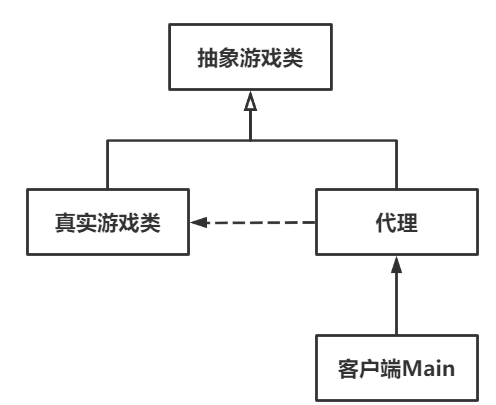

# Proxy代理模式

Owner: -QVQ-

结构型的软件设计模式，在不改变原代码前提下，提供一个代理，以控制对原对象的访问。

优点：

1. **职责清晰**。真实对象专注于自身业务逻辑，不用考虑其他非本职内容，交给代理完成。
2. **高拓展性**。真实对象的改变不影响代理。
3. **解耦**。将客户端与真实对象分离，降低系统耦合度。
4. **提高性能**。虚拟代理可以减少系统资源的消耗。
5. **高安全性和稳定性**。代理能很好地控制访问，提高程序安全。

代理模式的缺点：

1. **增加系统复杂度**。代理的职责往往较冗杂。
2. **请求速度降低**。客户端与真实对象中加入代理，一定程度上会降低整个系统流程的运行效率。


代码：

游戏

```cpp
// 抽象游戏类
class Game 
{
public:
	// 游戏加载
	virtual void load() = 0;
 
	// 游戏退出
	virtual void exit() = 0;
};
 
// 真实游戏类-魔兽世界
class WOW : public Game 
{
public:
	// 游戏加载
	virtual void load() {
		cout << "魔兽世界加载。" << endl;
	}
 
	// 游戏退出
	virtual void exit() {
		cout << "魔兽世界退出。" << endl;
	}
```

代理：以游戏为基础，提供一套附加的功能 —— 充值玩游戏

```cpp
// 代理类-魔兽代理
class ProxyWOW : public Game 
{
public:
	// 构造函数
	ProxyWOW() {
		m_wow = new WOW();
	}
 
	// 析构函数
	virtual ~ProxyWOW() {
		if (m_wow != nullptr) {
			delete m_wow;
			m_wow = nullptr;
		}
	}
 
	// 充值时间
	void recharge(int money) {
		m_time += money / 100;
		cout << "充值：" << money << endl;
		cout << "获得时长：" << m_time << endl;
	}
 
	// 游戏加载
	virtual void load() {
		cout << "代理启动。" << endl;
		if (m_time > 0) {
			m_wow->load();
			cout << "游戏时长1小时。" << endl;
			m_time -= 1;
			cout << "剩余时长：" << m_time << endl;
			flag = true;
		}
		else {
			cout << "剩余游戏时长不足，请充值。" << endl;
			flag = false;
		}
	}
 
	// 游戏退出
	virtual void exit() {
		if (flag) {
			m_wow->exit();
			flag = false;
		}
		cout << "代理关闭。" << endl;
	}
 
private:
	bool flag = false;
	int m_time = 0;
	WOW* m_wow;
};
```

客户

```cpp
// 玩魔兽
	ProxyWOW* proxy = new ProxyWOW();
	// 加载
	proxy->load();
	// 充值
	proxy->recharge(1000);
	// 加载
	proxy->load();
	// 退出
	proxy->exit();
```

代理模式的意图是在不改变原始类的前提下，为其提供一个代理类来控制对原始类的访问。代理类和原始类具有相同的接口，因此客户端无需知道它们之间的区别。代理类可以在调用原始类的方法前后添加额外的逻辑，如权限控制、缓存等。

装饰者模式的意图是动态地为对象添加功能。装饰者模式通过包装原始类的对象来扩展其功能，使得客户端可以在运行时动态地添加或删除功能。由于装饰者和被装饰者都实现了相同的接口，因此客户端也无需知道它们之间的区别。

总的来说，代理模式主要用于控制访问，而装饰者模式主要用于扩展功能。

代理模式和门面模式都是结构型设计模式，但它们解决的问题和应用场景有所不同。以下是它们之间的区别：

- **代理模式**关注于对单个对象的访问控制、延迟加载、权限验证等行为。
- **门面模式**关注于简化客户端与子系统多个对象的交互流程，提供一个更直观和便捷的接口。