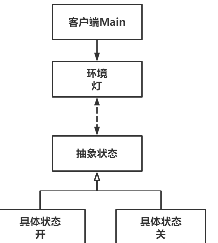

# State状态模式

Owner: -QVQ-

行为型的软件设计模式，当一个对象的内在状态改变时，其行为也随之改变

> 就像玩游戏的时候，不同的buff状态，角色会有不同的伤害、技能等等。
> 

当控制一个对象状态的条件表达式过于复杂时，很适合用该模式，将复杂的判断逻辑转移到表示不同状态的系列类中，能将逻辑大大简化

优点：

1. **良好封装性**。每个状态的行为被封装到对应类中。
2. **便于维护**。减少了if else或switch语句的出现，适用于条件判断复杂的场景。
3. **良好扩展性**。添加状态更便捷。

缺点：

1. **状态数量增加，类数量也会增加，对开发者要求较高**。
2. **状态少时，应用状态模式会显得冗余**。


代码：

```cpp
// 抽象状态类
class State 
{
public:
	// 析构函数
	virtual ~State() {}
 
	// 操作函数
	virtual void handle(Lamp& context) = 0;
 
};
 
// 具体状态类-开
class StateOn : public State 
{
public:
	// 操作函数
	virtual void handle(Lamp& context);
 
};
 
// 具体状态类-关
class StateOff : public State 
{
public:
	// 操作函数
	virtual void handle(Lamp& context);
 
};
// 操作函数
void StateOn::handle(Lamp& context) {
	cout << "当前状态：打开" << endl;
	cout << "执行操作：关闭" << endl;
	context.setState(new StateOff());
}
 
// 操作函数
void StateOff::handle(Lamp& context) {
	cout << "当前状态：关闭" << endl;
	cout << "执行操作：打开" << endl;
	context.setState(new StateOn());
}
```

```cpp
// 灯
class Lamp
{
public:
	// 构造函数，默认状态关闭
	Lamp() : m_state(new StateOff()){}
 
	// 析构函数
	~Lamp();
 
	// 设置状态
	void setState(State* state);
 
	// 请求
	void request();
	
private:
	State* m_state;
};

// 析构函数
Lamp::~Lamp() {
	if (m_state) {
		delete m_state;
		m_state = nullptr;
	}
}
 
// 设置状态
void Lamp::setState(State* state) {
	if (m_state) {
		delete m_state;
		m_state = nullptr;
	}
	m_state = state;
}
 
// 请求
void Lamp::request() {
	m_state->handle(*this);
}
```

将灯的状态作为一个类，实例灯中组合灯的状态即抽象类，调用操作函数时，执行当前灯的状态即实例的操作函数，操作函数能将一个新的灯的状态即实例给灯，从而起到切换状态的效果

```cpp
	//main
	Lamp lamp;
	lamp.request(); // 操作灯
	lamp.request(); // 操作灯
```