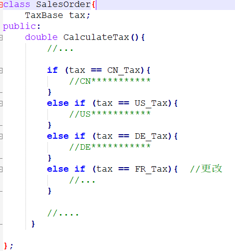
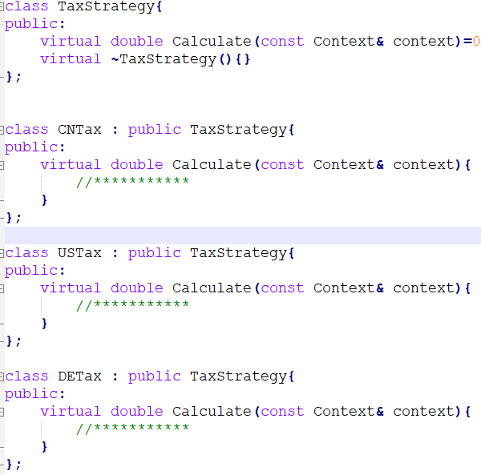

# Strategy战略

Owner: -QVQ-

行为型的软件设计模式，针对某个行为，在不同的应用场景下，有不同的实现算法，并且可以互相替换。

**目的：**

在软件构建过程中，某些算法可能多种多样，经常改变

将这些算法都写入到对象中，将使对象变复杂；

支持不使用的算法产生性能负担。
如何在运行时根据需要透明地更改对象的算法？

在使用if……else if和switch中的代码里经常会需要Strategy模式

优点：

1. **便于管理算法族**。一套策略对应一套算法，该模式可以很好地进行维护和管理。
2. **避免使用多重条件语句，如if else和switch**。庞大的系统中，过多的多重条件语句会让代码显得臃肿和不易维护，提高出错概率。
3. **封装算法**。提高了算法的保密性和安全性。
4. **符合开闭原则**。

缺点：

1. 客户端需要**了解每种策略，**并自行决定何时何地使用何种策略。
2. 随着策略增多，策略**类数量增加**，要注意对类的维护。

将选项封装成枚举，每种选项的操作封装成具体类

**例如**

用if对使用的算法作判断，不利于以后的修改和增加

**改进：**

将每种情况写成一个类

在主类中多态调用

提高了运行性能，降低了使用空间