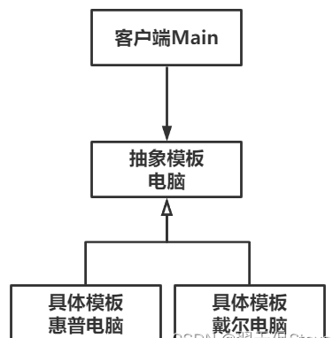
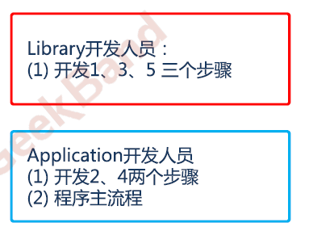
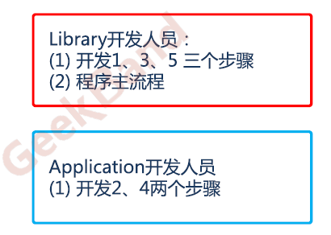
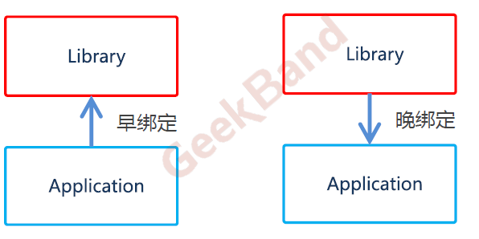

# Template Method模板方法

Owner: -QVQ-

行为型的软件设计模式，在父类中定义了一个模板算法，只实现模板中的公共部分，将可变部分放在子类中实现，不同的子类对同一模板有不同的扩展和实现

**目的**：软件构建过程中，有稳定的整体操作结构，但各个子步骤却有很多改变的需求

结构化软件设计

面向对象软件设计

将程序主流程设定好，对于其他开发人员的函数用纯虚函数定义好，从而讲早绑定变成晚绑定

原本是先写程序再写库，现在是先写库，再绑定程序

**模式定义**：定义一个操作中算法的骨架（稳定），将一些步骤（变化）延迟到子类中，Template Method使得子类可以不改变(复用)一个算法的结构即可重定义(override 重写)该算法的某些特定步骤。

在**具体实现**方面，被Template Method调用的虚方法可以具有实现，也可以没有任何实现（抽象方法、纯虚方法），但一般推荐将它们设置为**protected方法**。

优点：

1. **良好复用性**。父类中公共部分可以多次使用，具备好的环境适应性。
2. **良好扩展性**。子类对父类模板的具体实现作扩展。
3. **符合开闭原则**。基于模板扩展功能，不需要改动原有代码。

缺点：

1. **类个数增加**。基于模板的每个实现，都要定义一个子类，容易使代码量膨胀。
2. **若父类模板有改动，则子类均要同步更改**。