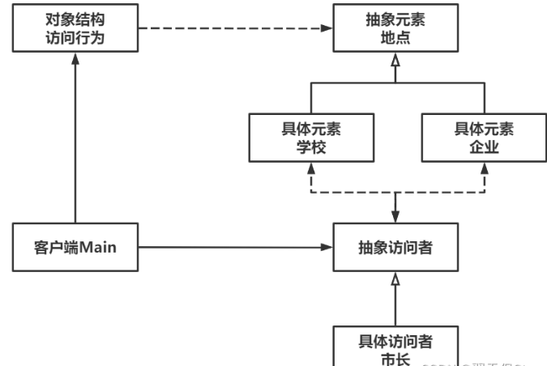

# Visitor访问者模式

Owner: -QVQ-

行为型的软件设计模式，表示一个作用于某对象结构中的各元素的操作。使得在不改变各元素类的前提下，能定义作用于这些元素的操作。

适合数据结构相对稳定且算法又易变化的系统。数据结构是被访问者，算法操作相当于访问者。

优点：

1. **良好扩展性**。扩展对元素的操作，只需要添加访问者。
2. **满足单一职责原则**。相关的操作封装为一个访问者，使得访问者职责单一。
3. **解耦**。数据结构自身和作用于它的操作解耦合。

缺点：

1. **不易增加元素类**。每增加一个元素类，访问者的接口和实现都要进行变化。
2. **违背了依赖倒置原则**。访问者依赖的是具体元素而不是抽象元素。
3. **破坏封装**。访问者可以获取被访问元素的细节


代码：

```cpp
// 抽象元素类-地点(被访问)
class Place 
{
public:
	// 构造函数
	Place(string name) : m_name(name) {}
 
	// 接受访问
	virtual void accept(Visitor* visitor) = 0;
 
	// 获取名字
	string getName() {
		return m_name;
	}
 
private:
	string m_name;
};
 
// 具体元素类-学校
class School : public Place 
{
public:
	// 构造函数
	School(string name) : Place(name) {}
 
	// 接受访问
	virtual void accept(Visitor* visitor){
		visitor->visitSchool(this);
	} 
};
 
// 具体元素类-企业
class Enterprise : public Place 
{
public:
	// 构造函数
	Enterprise(string name) : Place(name) {}
 
	// 接受访问
	virtual void accept(Visitor* visitor){
		visitor->visitEnterprise(this);
	}
};
```

```cpp
// 抽象访问者
class Visitor 
{
public:
	// 访问学校
	virtual void visitSchool(School* school) = 0;
 
	// 访问企业
	virtual void visitEnterprise(Enterprise* enterprise) = 0;
 
};
 
// 具体访问者-市长
class Mayor : public Visitor 
{
public:
	// 访问学校
	virtual void visitSchool(School* school) {
		cout << "市长参观了：" << school->getName() << endl;
		cout << "对老师和学生表达了诚挚的慰问。" << endl;
	}
 
	// 访问企业
	virtual void visitEnterprise(Enterprise* enterprise) {
		cout << "市长参观了：" << enterprise->getName() << endl;
		cout << "对企业的发展表示肯定。" << endl;
	}
 
};
```

```cpp
// 访问行为类
class Visiting
{
public:
	// 添加被访问地点
	void add(Place* place) {
		places.push_back(place);
	}
 
	// 删除被访问地点
	void remove(Place* place) {
		places.erase(std::remove(places.begin(), places.end(), place), places.end());
	}
 
	// 进行访问
	void accept(Visitor* visitor) {
		for (auto place : places) {
			place->accept(visitor);
		}
	}
 
private:
	std::vector<Place*> places;
};
```

抽象访问者、具体访问者、访问行为类、具体元素类、抽象元素类。行为类中用抽象元素类型的一维数组保存元素类的实例，定义好添加和访问，访问时传入参观者，遍历每个元素类的实例，传入 参观者进行访问

main

```cpp
Visiting *visiting = new Visiting();
	Place *school = new School("东华大学");
	Place *enterprise = new Enterprise("华为");
	Visitor *mayor = new Mayor();
 
	// 添加被访问对象
	cout << "首日，";
	visiting->add(school);
	visiting->add(enterprise);
	// 安排市长进行访问
	visiting->accept(mayor);
	// 次日行程，删除某个被访问对象后再次访问
	cout << "次日，";
	visiting->remove(school);
	visiting->accept(mayor);
```

观察者模式和访问者模式的区别如下：

- 观察者模式是一对多的依赖关系，当对象状态改变时，所有依赖它的对象都会收到通知并自动更新。而访问者模式是一组操作，这些操作可以对某个对象结构中的元素进行操作，同时不改变原有元素的结构。
- 观察者模式中，被观察者通过一维数组动态维持观察者，观察者对被观察者的访问接口统一。访问者模式中，访问者知道所有的元素类并有其对应的操作，增加元素类 需要修改所有访问者
- 观察者模式中，目标对象的状态改变会引起观察者的变化，从而更新整个系统，因此适用于系统中部分对象状态发生改变时需要通知其他对象的场景。而访问者模式适用于对象结构中的元素需要执行一些操作，同时不改变原有元素的结构的场景。