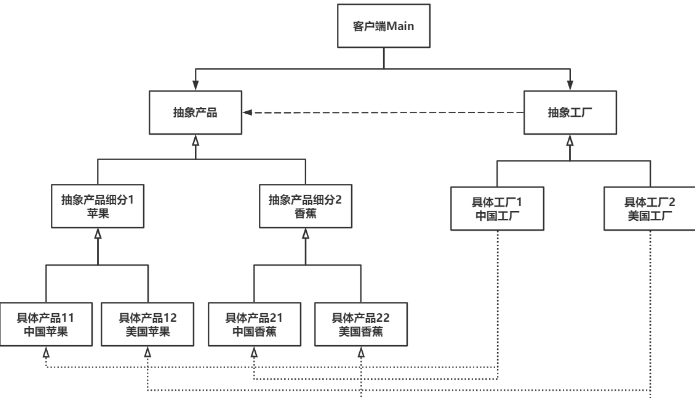

# •Abstract Factory抽象工厂模式

Owner: -QVQ-

创建型，给客户端提供一个接口，可以创建多个产品族中的产品对象 

特点：

- 系统中有多个产品族，而系统一次只可能消费其中一族产品。
- 同属于同一个产品族的产品以其使用。
- 与工厂模式相比，产品更为复杂，

> 如果说工厂模式对应一个产品系列，那抽象工厂就对应了多个产品系列。比如工厂模式中有鞋子、衣服和裤子可以生产，那抽象工厂模式就会衍生出耐克工厂和阿迪工厂，这两个工厂分别生产各自品牌的鞋子、衣服和裤子，客户只需要选择具体工厂和想要的产品即可。如果想要替换产品系列，也只需要将具体工厂切换为别的品牌就行了。
> 

优势：

- 具体类分离。具体产品类在具体工厂的实现中进行了分离和归类。
- 易于交换产品系列。当客户想要改变整个产品族时，只需要切换具体工厂即可。
- 利于产品一致性。当产品族的各个产品需要在一起执行时，抽象工厂可以确保客户只操作同系列产品，而不会进行跨品牌的组合。

缺点：

不利于添加新种类产品。没添加一个新种类，每个具体工厂都要进行代码的扩展

代码：


产品：

```cpp
///////////////////////// 抽象产品类/////////////////////////
class Prodect
{
public:
	// 构造函数
	Prodect(int price) :m_price(price) {};
	// 析构函数
	virtual ~Prodect() {};
	// 获取价格
	int getPrice() {
		return m_price;
	}
protected:
	// 产品价格
	int m_price;
};
 
/////////////////////////抽象产品细分-苹果/////////////////////////
class AppleProdect : public Prodect
{
public:
	// 构造函数
	AppleProdect(int price, string color) :Prodect(price), m_color(color) {};
	// 析构函数
	virtual ~AppleProdect() {};
	// 获取颜色
	string getColor() {
		return m_color;
	}
protected:
	// 颜色
	string m_color;
};
 
/////////////////////////抽象产品细分-香蕉/////////////////////////
class BananaProdect : public Prodect
{
public:
	// 构造函数
	BananaProdect(int price) :Prodect(price) {};
	// 析构函数
	virtual ~BananaProdect() {};
};
 
/////////////////////////具体产品-中国苹果/////////////////////////
class ChineseAppleProdect : public AppleProdect
{
public:
	// 构造函数
	ChineseAppleProdect(int price, string color) :AppleProdect(price, color) {
		cout << "获得了一个中国苹果。" << endl;
	};
	// 析构函数
	virtual ~ChineseAppleProdect() {
		cout << "吃掉了一个中国苹果。" << endl;
	};
};
 
/////////////////////////具体产品-美国苹果/////////////////////////
class AmericanAppleProdect : public AppleProdect
{
public:
	// 构造函数
	AmericanAppleProdect(int price, string color) :AppleProdect(price, color) {
		cout << "获得了一个美国苹果。" << endl;
	};
	// 析构函数
	virtual ~AmericanAppleProdect() {
		cout << "吃掉了一个美国苹果。" << endl;
	};
};
 
/////////////////////////具体产品-中国香蕉/////////////////////////
class ChineseBananaProdect : public BananaProdect
{
public:
	// 构造函数
	ChineseBananaProdect(int price) :BananaProdect(price) {
		cout << "获得了一个中国香蕉。" << endl;
	};
	// 析构函数
	virtual ~ChineseBananaProdect() {
		cout << "吃掉了一个中国香蕉。" << endl;
	};
};
 
/////////////////////////具体产品-美国香蕉/////////////////////////
class AmericanBananaProdect : public BananaProdect
{
public:
	// 构造函数
	AmericanBananaProdect(int price) :BananaProdect(price) {
		cout << "获得了一个美国香蕉。" << endl;
	};
	// 析构函数
	virtual ~AmericanBananaProdect() {
		cout << "吃掉了一个美国香蕉。" << endl;
	};
};
```

工厂：

```cpp
// 抽象工厂类
class Factory
{
public:
	// 获取苹果
	virtual Prodect* getApple() = 0;
	// 获取香蕉
	virtual Prodect* getBanana() = 0;
};
 
// 具体工厂类-中国工厂
class ChineseFactory : public Factory
{
public:
	// 获取苹果
	virtual Prodect* getApple() {
		Prodect* prodect = new ChineseAppleProdect(5, "红");
		return prodect;
	}
	// 获取香蕉
	virtual Prodect* getBanana() {
		Prodect* prodect = new ChineseBananaProdect(3);
		return prodect;
	}
};
 
// 具体工厂类-美国工厂
class AmericanFactory : public Factory
{
public:
	// 获取产品
	virtual Prodect* getApple() {
		Prodect* prodect = new AmericanAppleProdect(4, "黑");
		return prodect;
	}
	// 获取香蕉
	virtual Prodect* getBanana() {
		Prodect* prodect = new AmericanBananaProdect(2);
		return prodect;
	}
};
```

主函数：

```cpp
int main()
{
	cout << "找到中国工厂。" << endl;
	Factory* factoryA = new ChineseFactory();
	Prodect *A = factoryA->getApple();
	Prodect *B = factoryA->getBanana();
	int applePrice = A->getPrice();
	int bananaPrice = B->getPrice();
	int sum = A->getPrice() + B->getPrice();
	cout << "苹果价格：" << applePrice << "元。" << endl;
	cout << "香蕉价格：" << bananaPrice << "元。" << endl;
	cout << "累计消费：" << sum << "元。" << endl;
	cout << "中国苹果" << dynamic_cast<AppleProdect*>(A)->getColor() << "色" << endl;
	delete A;
	delete B;
	delete factoryA;
	cout << "享用完毕。" << endl << endl;
 
	cout << "找到美国工厂。" << endl;
	Factory* factoryB = new AmericanFactory();
	Prodect *C = factoryB->getApple();
	Prodect *D = factoryB->getBanana();
	applePrice = C->getPrice();
	bananaPrice = D->getPrice();
	sum = C->getPrice() + D->getPrice();
	cout << "苹果价格：" << applePrice << "元。" << endl;
	cout << "香蕉价格：" << bananaPrice << "元。" << endl;
	cout << "累计消费：" << sum << "元。" << endl;
	cout << "美国苹果" << dynamic_cast<AppleProdect*>(C)->getColor() << "色" << endl;
	delete C;
	delete D;
	delete factoryB;
	cout << "享用完毕。不如China。" << endl;
 
	return 0;
}
```