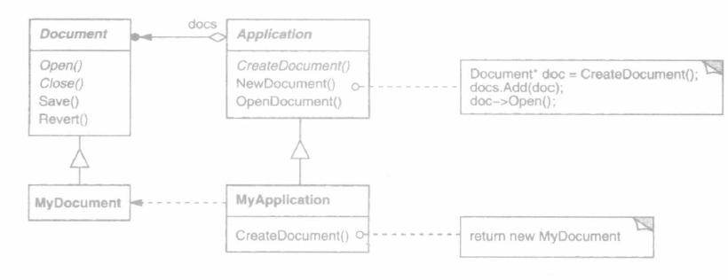
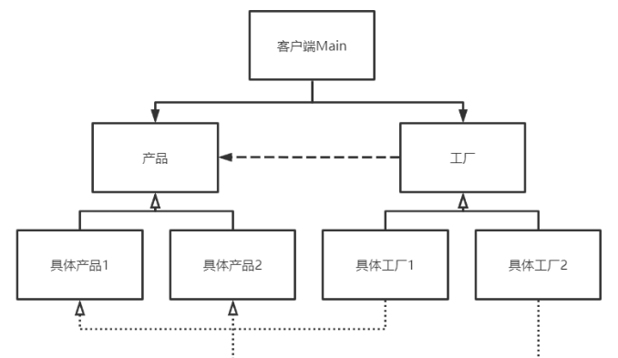

# •Factory Method工厂模式

Owner: -QVQ-

创建型


Application的子类重定义Application的抽象操作CreateDocument以返回适当的Document子类对象。

一旦一个Application子类实例化，它就可以实例化与应用相关的文档，而无须知道这些文档的类。我们称CreateDocument是一个工厂方法(factory method),因为它负责“生产”一个对象。

优点：

1. **良好的封装性**。将产品的实例化封装执行，避免被修改，这样的产品具备良好的一致性。
2. **开闭原则**。增加产品时，同步增加一个工厂子类，不会违反开闭原则。
3. **标准的解耦合框架**。使用者只需要知道自己要什么产品即可，不用去管产品具体的特性等等，降低了模块间的耦合。

缺点

1. **代码量大**。每加一个产品，都要加一个工厂子类，代码会显得臃肿。
2. **不利于扩展复杂的产品结构**。如果你要苹果、香蕉、梨，工厂模式的结构还可以，但如果你要山东的苹果、海南的香蕉、北京的苹果，就显得结构呆呆的。这可以用抽象工厂模式解决，对产品族和产品种类进行区分


# 适用性

- 当一个类不知道它所必须创建的对象的类的时候。
- 当一个类希望由它的子类来指定它所创建的对象的时候。
- 当类将创建对象的职责委托给多个帮助子类中的某一个，并且你希望将哪一个帮助子
类是代理者这一信息局部化的时候。

抽象工厂和具体工厂

```cpp
// 抽象工厂类
class Factory
{
public:
	// 获取产品
	virtual Prodect* getProdect() = 0;
};
 
// 具体工厂类-苹果
class AppleFactory : public Factory
{
public:
	// 获取产品
	virtual Prodect* getProdect() {
		Prodect* prodect = new AppleProdect(5);
		return prodect;
	}
};
 
// 具体工厂类-香蕉
class BananaFactory : public Factory
{
public:
	// 获取产品
	virtual Prodect* getProdect() {
		Prodect* prodect = new BananaProdect(2);
		return prodect;
	}
};
```

抽象产品和具体产品

```cpp
// 抽象产品类
class Prodect
{
public:
	// 构造函数
	Prodect(int price) :m_price(price) {};
	// 析构函数
	virtual ~Prodect() {};
	// 获取价格
	int getPrice() {
		return m_price;
	}
protected:
	// 产品价格
	int m_price;
};
 
// 具体产品类-苹果
class AppleProdect : public Prodect
{
public:
	// 构造函数
	AppleProdect(int price) :Prodect(price) {
		cout << "获得了一个苹果。" << endl;
	};
	// 析构函数
	virtual ~AppleProdect() {
		cout << "吃掉了一个苹果。" << endl;
	};
};
 
// 具体产品类-香蕉
class BananaProdect : public Prodect
{
public:
	// 构造函数
	BananaProdect(int price) :Prodect(price) {
		cout << "获得了一个香蕉。" << endl;
	};
	// 析构函数
	virtual ~BananaProdect() {
		cout << "吃掉了一个香蕉。" << endl;
	};
};
```

主函数

```cpp
int main()
{
	Factory* factoryA = new AppleFactory();
	Factory* factoryB = new BananaFactory();
	cout << "开始生产。" << endl;
	Prodect *A = factoryA->getProdect();
	Prodect *B = factoryB->getProdect();

	int applePrice = A->getPrice();
	int bananaPrice = B->getPrice();
	int sum = A->getPrice() + B->getPrice() + C->getPrice();
	cout << "苹果价格：" << applePrice << "元。" << endl;
	cout << "香蕉价格：" << bananaPrice << "元。" << endl;
	cout << "累计消费：" << sum << "元。" << endl;
	delete A;
	delete B;
    delete factoryA;
    delete factoryB;
	cout << "享用完毕。" << endl;
	return 0;
}
```