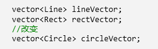
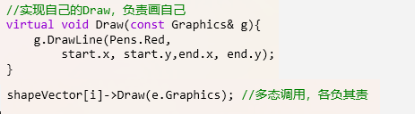

# 概论

Owner: -QVQ-

# 定义：

每一个模式描述了一个在我们周围不断重复发生的问题，
以及该问题的解决方案的核心。这样，你就能一次又一次
地使用该方案而不必做重复劳动

# 意义和目的

向下：深入理解三大面向对象机制
• 封装，隐藏内部实现
• 继承，复用现有代码
• 多态，改写对象行为
向上：深刻把握面向对象机制所带来的抽象意义，理解如何使用
这些机制来表达现实世界，掌握什么是“好的面向对象设计

我们时常会对代码进行功能上的增加，因此需要代码具有可拓展性

# 面向对象设计原则

## 单一职责原则（SRP）

一个类只有一个责任

## Liskov 替换原则（LSP）

子类应当是可以替换父类的，即子类不能多于父类的函数功能

父类更像是抽象的，子类是具体的实现，鸡当然具有动物的特征

## 开放封闭原则（OCP）

- **类模块**应该是**可扩展**的，但是**不可修改**

## 接口隔离原则（ISP）

接口应小而完备，不应该包含客户程序不用的方法

## 依赖倒置原则（DIP)

- 高层模块(稳定)不应该依赖于低层模块(变化)
- 抽象(稳定)不应该依赖于实现细节(变化)

## 封装变化点

使用封装来创建对象之间的分界层，让设计者可以在分界层的一侧进行修改，而不会对另一侧产生不良的影响

## 针对接口编程，而不是针对实现编程

- 不将变量类型声明为某个特定的具体类（左图），而是声明为某个接口（右图）。
    - 客户程序无需获知对象的具体类型，只需要知道对象所具有的接口。
    - 减少系统中各部分的依赖关系，从而实现“高内聚、松耦合”的类型设计方案。

    

## 优先使用对象组合，而不是类继承

- **类继承**通常为“**白箱复用**”，**对象组合**通常为“**黑箱复用**”（实现细节不透明）
    - 继承在某种程度上破坏了封装性，子类父类耦合度高。
    - 而对象组合则只要求被组合的对象具有良好定义的接口，耦合
    度低。

# 模式分类

从**目的**来看

**创建型模式**:讲部分创建工作延迟到子类或其他对象

**结构型模式：**通过类继承、对象组合获得灵活的结构

**行为型（Behavioral）模式**：通过类继承或者对象组合来划分
类与对象间的职责

# 重构获得模式

好的面向对象是找到变化点，在变化点应用设计模式

静态→动态
早绑定→晚绑定
继承→组合
编译时依赖→运行时依赖
紧耦合→松耦合