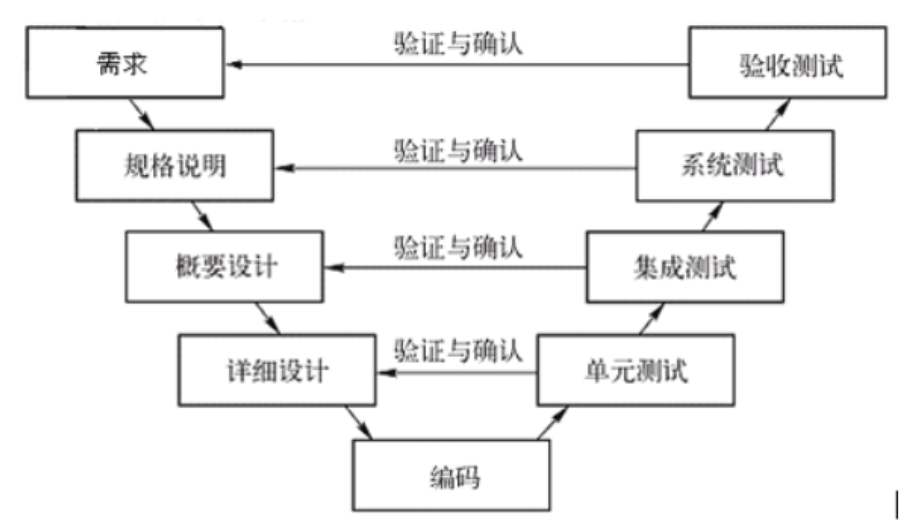
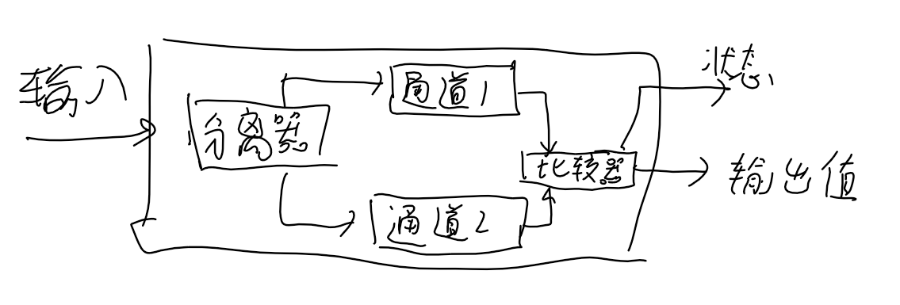
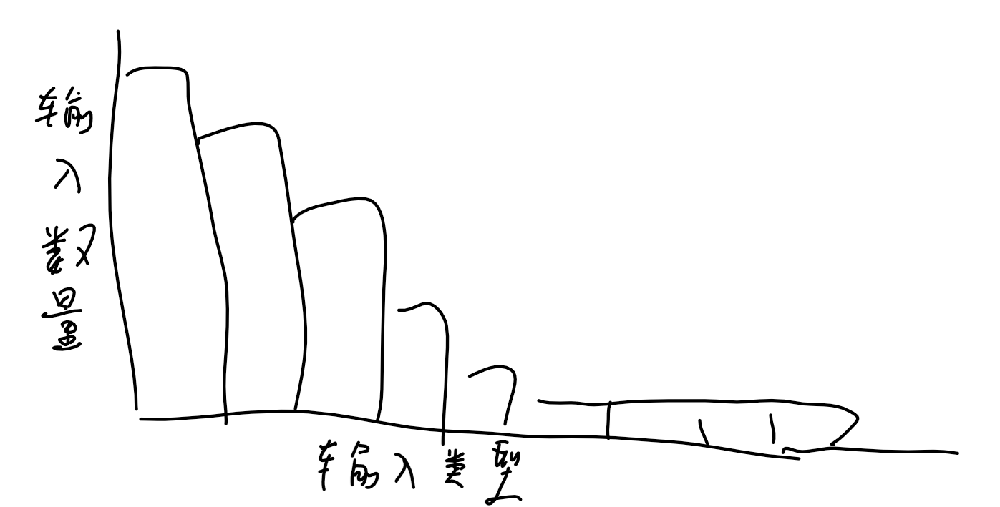
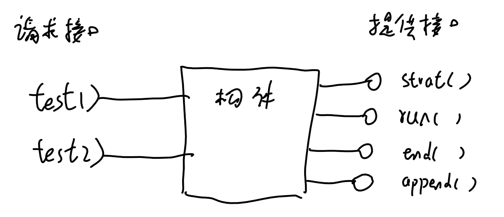

# 概述

当在软件工程中提及软件时，包括程序、相关文档、库、支持网站等

软件工程目的是支持专业化的软件开发，包括程序规格说明，设计和演化的相关技术

软件工程需要的技能：

- 选择性的使用开发理论、方法和工具
- 寻求问题的解决方案
- 在组织和经济约束下工作、控制工程在进度和预算范围

软件工程中使用的系统化的方法称为软件过程，即软件开发的活动过程，包括：

1. 软件规格说明，定义所要开发的软件和其运行的约束
2. 软件开发
3. 软件确认，检查软件是否是客户需要的
4. 软件演化，修改软件以满足市场的变化

不同类型的软件有不同的软件工程方法，主要受到以下几个因素影响：

- 异构性，软件支持的设备不同
- 企业和社会的变革带来新技术和新需求，软件需要适应可能的变化
- 信息安全
- 软件规模

一个好的软件产品应该是高效地开发出来的，可以被开发团队理解接受的，产品是可靠安全的，并且可维护的

# 软件过程

## 软件过程模型

### 瀑布模型/软件生命周期模型(一种计划驱动的模型)

基本流程分为5个阶段，

1. 通过咨询用户详细定义系统的规格说明，
2. 再建立一个总体的系统体系结构分配需求，
3. 进行模块实现和单元测试，
4. 之后做集成和系统测试，
5. 交付用户后做维护

带来的问题是，

- 每个阶段依赖于上一个阶段的完成和文档，阶段间存在重复的文档工作
- 进行到后续阶段前期的内容可能发生变动，如果通过开发上的技巧来回避设计上的缺陷会导致结构和差的系统
- 开发完成后，新功能需求需要重复这些过程

因此只适用于，

- 和硬件相关的系统，硬件不灵活需要提确定
- 关键性系统，需要有规格文档对安全性进行全面分析
- 大型软件系统，规格说明便于不同的子系统可以独立开发

### 增量式开发

例如敏捷开发

先开发出一个初始的实现，进过多个版本的演化得到最终所需的系统。比起计划驱动的模型提前确定好所有的增量，增量式开发只有最初的增量式确定的，后面的增量取决于开发中进度和客户优先级

比起瀑布模型的优势在于：

- 降低了需求变更的成本
- 能及时得到客户反馈

带来的问题：

- **过程不可见**，快速开发中文档少
- 新的增量开发师使最初设计的系统**结构逐渐退化**

### 集成和配置

寻找可服用的代码，按需求对他们修改，并与已有代码集成

主要流程是，

1. 先提出初始需求做简要描述，
2. 再搜索所需要的功能构件和系统并进行评估，
3. 需求精化，修改需求以适应构件
4. 对系统配置后使用
5. 构件适配和集成创建系统

经常被复用的软件包括：

- 在特定环境中使用的独立应用系统
- 与一个构件框架相集成的构件或包
- 可远程调用的web服务

这种方法有更快的软件交付和更低的成本，但可能导致系统不完全满足用户需求，并且因为依赖了现有技术（构件的版本演化不可控）从而失去对系统演化的控制

## 过程活动

### 软件规格说明（需求工程过程）

理解系统需要哪些服务，评估开发成本、技术、财务和市场，识别对于系统开发和运行的约束，最终得到两类需求文档，面向客户的需求文档（面向最终用户的系统需求的抽象陈述），和系统规格说明

需求工程活动有三个主要活动：

- 需求抽取和分析，
- 需求规格说明，包括用户需求，系统需求
- 需求确认

### 软件设计和实现

### 软件确认

确认系统是否符合它的规格说明，包括

- 构件测试（单元测试）
- 系统测试
- 客户测试（β测试），实际客户数据来测试

增量式开发中，每个增量都要做测试，在测试驱动的开发中（敏捷开发），测试在开发前和需求一起被开发出来，在计划驱动的软件过程中，测试由一组测试计划驱动，即V模型

## 应对变化

### 原型

原型是软件的早期版本，用于演示方案，可以帮助探索软件的解决方案，对系统需求进行抽取和确认

原型开发的目的在一开始就应该明确，建立原型目标->定义原型功能->开发原型->评估报告

原型带来的问题是用户可能不会像使用最终系统一样使用原型，原型的测试者不一定是最终用户，原型评估可能时间不够，原型的性能改变了用户的使用方式

### 增量式交互

客户定义服务的优先级，优先级高的服务先实现和交付

优势是，

- 早期的增量可以作为原型交付，客户能立即获得反馈
- 保持了增量式开发的优点，新的增量容易加入进来
- 最重要的部分可以充分测试

关键问题是：

- 用**新系统替换旧系统**时，用户不适应
- 系统开发需要**预设基础设施**，而一开始定义好所有所需的基础设施难度大
- 迭代过程本质上是规格说明和软件一起开发，这和许多组织的**采购方式相冲突**

## 过程改进

企业致力于通过过程改进来提高产品质量，过程需要有方法来评估，包括，

一种方法是过程成熟度方法，将好的软件工程实践引入，关注改进过程和项目管理，起到提高产品质量和过程的可预见性，但引入与程序开发不相关的工作会增加额外开销

另一种方法是敏捷方法，关注迭代化的开发以及降低软件过程中的额外开销，

# 敏捷开发（Agile Development)

敏捷宣言提炼的几个观点：([agilemanifesto.org](agilemanifesto.org))

- **客户紧密参与**高于合同谈判
- 开发**过程保持简洁**，消除系统复杂性
- 优质的**可读可维护代码**大于全面的文档
- 拥抱**变化**，期待变化
- 重视团队成员的技能，少用规定的过程、工具限制他们

敏捷开发是一种思想，它通常具有这些特性

- 开发中设计、规格说明、实现交织在一起，文档被最小化
- 系统按一定的增量开发
- 使用广泛的工具来支持开发过程

一个敏捷过程中不一定都是代码开发，也可能是设计文档。

敏捷开发是一种思想，具体的技术有极限编程（关注代码质量和工程效率）、Scrum方法（关注流程管理和团队协作）、DSDM方法（关注企业管理）

## 敏捷开发技术

极限编程（extreme programming，XP），XP编程中，

- 指定一个现场客户参与整个开发
- 增量开发。需求被记录在**故事卡片**上，被分解成**任务**
- **测试先行的开发**
- **持续集成**。每个增量开发完成就加入系统并需要通过所有测试
- **经常**的进行提高代码质量的**重构**。为了避免多次增量开发退化一开始的系统架构完整性
- **结对编程**。两人一起开发，相当于非正式的评审，也能提高重构的积极性，对于初级程序员来说效率影响低，对于成熟程序员来说不一定
- **代码共同拥有权**。所有人可以看到和修改所有代码，避免各人分部分开发的孤岛效应

敏捷开发定义了一些专有名词，如下，

### 用户故事

XP方法中，需求被表达为**一个系统用户可能经历的使用场景**，即用户故事。客户与团队紧密工作，与团队成员一起讨论场景，开发故事卡片，用于规划迭代。之后开发团队将其**分解为任务**，预计每个任务的优先级、工作量和资源。需求的变化带来的是故事卡片的丢弃或新建

用户故事的**问题**是，

- 难以判断是否开发完了足够的用户故事以覆盖一个系统的所有重要需求，
- 也难以判断一个故事是否正确描述了一个活动（有经验的用户熟悉自己的工作从而经常遗漏一些在他看来的常识），
- 用户故事无法体现非功能性需求

### 测试先行的开发

传统的增量开发时，因没有供外部的测试团队使用的系统规格说明，使得测试过程很不正式

XP编程中测试的关键特性：

- 测试先行的开发
- 基于场景的增量测试开发
- 用户参与测试开发和确认
- 使用自动化测试框架

使用测试先行，编写测试隐式地提供了所开发功能的接口和行为规范，能避免规格说明中的需求歧义和遗漏，也能避免“测试拖后腿”的情况

测试先行的开发带来的问题：

- 导致编写了大量的测试
- 程序员不喜欢编写测试，因此可能编写不完整的测试
- 一些测试很难增量编写
- 难判断测试的完备性，测试集合会给人一种系统很完备的错觉

## 敏捷项目管理

敏捷团队是自组织的，不产生文档从而使企业难以管理，Scrum提出一个组织敏捷项目的框架

> Scrum主管：负责确保scrum流程得到遵循，可能同时承担了项目经理的职责
>
> 冲刺：一个开发迭代，2-4周
>
> 速度：在单个冲刺中可以完成的工作量的预测

scrum过程被称为冲刺周期，

1. scrum过程的起点是产品的代办事项，**定义**各项内容的**优先级**
2. 选取最高优先级的事项，预测时间，创建**冲刺待办事项**
3. 冲刺中，每天**站立会议**，沟通进度和任务，对问题重新规划短期工作
4. 冲刺结束后，**评审会议**，用于改进过程，和开启下一个冲刺

scrum方法带来的优势：

- 产品被分解为可以管理的块
- 不稳定的需求不会影响进度
- 团队一切内容对所有成员可见
- 客户可以看到增量的交付

## 敏捷方法的伸缩

### 敏捷开发的实践

敏捷开发的问题：

- 没有文档的开发，这种非正式性与大型企业通常做法不相符
- 敏捷开发适用于软件开发而不是维护，但现实中大多工作都是维护
- 敏捷开发适用于小规模团队，大型企业开发可能包含全球分布的开发团队

对于软件维护，敏捷方法没有共识，会导致一些问题：

- 缺少产品文档。虽然敏捷开发的思想是高质量的代码代替文档，但实际上不一定。文档中最重要的是系统需求文档，可以告诉用户希望系统做什么
- 无法保持客户参与。对于开发客户可以全程参与，但对于维护客户不会这么认为
- 无法确保开发团队的延续。人员的变更会失去隐形的知识。即使有意的将开发团队保持，被分配做维护任务可能会让人员主动离开

敏捷开发如何充分利用所有人

- 如果开发团队技能水平低，需要高水平的人来开发系统设计，其他人来编程
- 团队如何组织，对不同地域和外包的沟通需要设计文档
- 支持开发的技术，如果没有好的分析工具，那么需要更多的文档

### 面向大型系统的敏捷方法

大型系统的复杂性来源于：

- 通常是系统之系统，每个独立团队开发每个系统，每个团队想了解整个系统会很困难
- 通常是棕地系统，即包含一些现有的系统需要与之交互，有很大一部分工作需要去处理这种交互
- 集成多个系统创建一个系统时，需要关注子系统的配置而不是代码开发，这和频繁的系统集成理念不符
- 大型系统受到更多外部约束，有多个利益相关者

然而，规模化的敏捷方法依然有些共性的东西：

- 完全增量的需求工程是不可能的，需要早期做一些设计工作，确认不同团队开发的不同部分
- 角色重复，不同人参与系统的不同部分，没有哪个人能单独作为产品负责人或客户代表
- 不可能只关注代码，需要进行更多的前期设计和系统的文档化
- 沟通机制
- 持续集成无法实现，至少要有定期的版本发布
- 每个团队选个架构师，这些架构师相互协作对整个系统体系设计和演化

# 需求工程

需求包含用户需求和系统需求，

- 用户需求：指系统被期望向用户提供什么服务，和系统运行必须满足的约束。可以是系统特征的描述，也可以是功能的详细描述
- 系统需求：精确定义系统功能、服务哪些要实现
  - 功能性需求：系统应该做什么，所需信息如何提供和组织
  - 非功能性需求：约束系统的整体特性，例如响应时间、可靠性、输入输出设备能力

非功能需求应该尽量细化定量

## 需求抽取

目的是理解利益相关者做的事情和他们会如何使用系统

### 需求抽取技术

一种是访谈，另一种是人种学调查

先说访谈，访谈总是容易被客户接受的（大家喜欢聊自己的工作），但不应该期望客户能说出太多细节和需求，他们很难描述系统是什么样的，原因在于1️⃣他们会使用专业术语2️⃣一些领域基础知识被他们忽略3️⃣访谈人不愿谈及政治和组织性话题

作为访谈人，需要记住：

- 倾听为主，避免预设需求，对提出的需求愿意改变系统的想法
- 定义好上下文语境来谈论话题，使用跳板性问题、需求建议或一起谈论一个原型等方式来提示受访人

其次是人种学调查，分析人员让自己深入系统使用的工作环境，观察和记录参与者进行的实际任务。通常交付的软件系统没有被使用就是没有考虑社会和组织如何影响系统的运行，人种学调查的价值是可以帮助发现反映人们实际工作方式的隐士需求。人们理解自己的工作，但不一定理解自己的工作和其他工作的关系。

人种学调查能提炼出两类需求：

- 人们的实际工作方式得出的需求而不是业务过程定义所说的工作方式
- 与他人合作以及对其他人的活动的了解中得出的需求

人种学调查有助于了解现有系统，但这种理解不一定有助于创新。例如诺基亚使用人种学调查来理解用户需求，apple忽略当前情况映入iphone颠覆了手机行业

### 故事和场景

需求如何呈现，故事和场景本质上都是对系统的描述，区别在于描述的方式和抽象的层次

故事是叙述性的描述一个用户使用的典型场景，他的好处是每个人都容易建立联系，因为他足够简单容易理解

场景则是对用户交互的详细描述，以结构化的方式呈现，包括

- 系统开始时所期望的条件
- 系统事件流的描述
- 系统运行中可能的出错和如何解决
- 可能同时进行的活动
- 场景结束时系统的状态

## 需求规格说明

用户需求总是用自然语言书写，辅以图形和表格

系统需求说明包含自然语言，结构化语言（表、模版），图形化表示（图形化模型，例如uml），数学规格

一个好的需求应当是可以测试的

### 自然语言规格

自然语言具有二义性和模糊性，一些方式可以减少误解：

- 使用标准格式并确保所有需求定义都遵循格式，这可以使得不出现太多遗漏和容易检查需求
- 避免使用专业术语，目的是让客户容易理解和没有歧义
- 尽量将每个需求与其原因关联起来，这样可以帮助判断需求变化是否合理

### 结构化规格说明

用标准而不是自由的文本方式来书写

有自然语言的优点，但用其完全定义书写需求有时很难，可能需要额外的内容做补充

### 用况（use case）

用图形化模型和结构化文本描述用户与系统间交互的方式，是一种UML的基本特性。

一个用况包括多个参与者，他们的交互类型，交互如何发起的

每个用况表示一组底层交互场景。用况往往颗粒度过细，不适用于讨论需求，更适合系统设计中

### 软件需求文档/软件规格说明（software requirement specification）

首先考虑是否使用需求文档。外包开发和不同团队协作开发时需要文档。对于敏捷开发，不需要需求文档，而是使用用户故事，

其次需求文档有不同的用户，从管理到开发，需要折中

再者需求文档的详细程度取决于系统类型和开发过程。关键系统需要详细需求，由其他公司开发时也要详细

| 章               | 描述                                                         |
| ---------------- | ------------------------------------------------------------ |
| 前言             | 期望的读者，文档的版本历史，新版本的原因，修改总结           |
| 引言             | 系统的功能描述，如何与其他系统工作，总体业务或战略目标       |
| 术语表           |                                                              |
| 用户需求定义     | 为用户提供的服务                                             |
| 系统体系结构     | 系统体系结构的高层概览，各个模块的功能分布                   |
| 系统需求规格说明 | 描述功能性需求和非功能性需求，接口定义                       |
| 系统模型         | 显示系统构件之间，系统与环境之间的关系                       |
| 系统演化         | 预计的用户需求变更导致的变化                                 |
| 附录             | 与应用相关的详细、特定的信息。系统的最小配置和优化配置。数据库使用的数据逻辑和数据的关系 |
| 索引             |                                                              |

## 需求确认

需求确认的内容如下：

面向客户：

- 正确性、完整性
- 一致性，文档的需求不应该冲突

面向研发

- 可实现性，在指定预算成本技术内实现
- 可验证性，如果不能对每个需求编写测试用例则是不合适的

具体的需求确认技术：

- 需求评审
- 原型化
- 生成测试用例

## 需求变更

变更一方面是原始需求存在遗漏和错误，但更多的是业务环境导致的变化，例如新的软硬件，业务优先级，法律法规等。

由于需求在演化，需要对各个需求保持追踪并维护需求间的依赖关系。需要一个正式的过程将其和系统需求联系起来。敏捷开发中，用户提出需求变更不需要正式的过程，只需要提出用户故事和重排序优先级

# 系统建模

## 上下文模型

确定系统的边界，哪些需要自动化完成，哪些是手动化完成，确定新的功能在哪里实现。有时可能需要一个没有边界的，可以适应不同用户需要的可配置系统，通常是因为用户范围很广，不同用户有不同的系统边界

当确定要定义系统的边界时，需要分析系统上下文以及系统对于其环境的依赖，例如产生一个体系结构模型

上下文模型可以和其他模型一起使用。例如在业务过程模型中描述人和自动化的过程中会使用的特定软件

## 交互模型

两个相关的交互建模方法，用况建模、顺序图（时序图）

用况建模中，每个用况表示一个包含与系统的外部交互的离散任务。用况图对于交互给出了简单的概览，通常需要多个用况图显示不同的关联情况，在此基础上还需要更多细节获得完整的交互描述，可以是文本描述，使用表格的结构化描述，顺序图。

顺序图，显示在特定用况或用况实力执行中发生的交互序列

## 结构模型

### 类图

使用类图显示类的关系时，最好不包含书写或操作方式来表示，而是在对象中包含，UML通过扩展表示类的简单矩形来显示书写和操作

UML使用对象及他们的关系来做语义数据建模

### 泛化(generalization)

是一种描述结构关系的技术。生活中学习一个事物时，总是先学习通用的类和其特性，在对具体的事物分类，关注他们和所属类的差异。在开发中常用继承来实现

### 聚集(aggregation)

就是组合。

## 行为模型

指描述系统对来自外界的激励（数据或事件）进行响应时发生什么

### 数据驱动的建模

描述数据输入到生成相关输出过程所涉及的动作序列

一种是使用**数据流图（DFD）**，强调操作或活动。另一种是使用**UML顺序图**，强调系统中的对象

### 事件驱动的建模

描述一个系统如何对外部事件做出反应。使用于状态有限的情况下，事件可以导致状态的转换的基础上。UML通过**状态图**(state diagram)实现

基于状态的建模可能导致状态的数量快速增长，需要用父状态来隐藏细节。即将某个位置单独提出来作为一个状态图。在此基础上还需要更详细的描述，例如使用表格

### 模型驱动的工程

MDE(model-driven engineering),是一种软件开发方法，主要产出物是模型，通过模型平台自动生成程序。但这一技术推广的并不顺利

## 模型驱动的体系结构

模型驱动关注模型的软件设计和实现方法，使用UML模型来描述系统，创建不同层次上的模型，有如下三中类型的抽象系统模型：

- 计算无关模型(computation independent model,CIM)，也称领域模型。对系统中使用的重要领域抽象进行建模，例如信息安全CIM，明确资产等重要的信息安全抽象
- 平台无关模型(platform-independent model,PIM)，在不涉及实现的情况下对系统的运转进行建模。通常使用UML显示静态系统如何响应内外部事件
- 平台相关模型（platform-specific model, PSM），PSM对平台无关模型转换后得到的，每个应用平台都有一个单独的PSM

基于模型的工程允许工程师在较高的抽象层次上考虑系统，借助平台的模型转换器，生成模型或代码。实践中很难做到完全自动化地模型转换代码，需要人为干预。其中PIM到PSM对转换相对容易，已有很多工具可以实现

MDA没能成为主流开发方法的原因：

- 对大公司而言，比起软件开发的复杂度，可靠、安全等因素更重要
- 对讨论有用的抽象对实现而言不一定是正确的抽象
- 追求平台无关性只对大型长生命周期的项目有利，对普通项目，引入MDA方法引入的工具成本超出MDA的收益

MDA适用于开发系统产品的工程，包括软硬件，例如工业产品。MDA对推动复用有很大帮助从而提高了效率

# 体系结构设计

体系结构确定组成他们的主要结构构件以及他们之间的关系，设计过程的输出是体系结构模型。及时是在敏捷开发中，体系结构也是要提前设计好的，关于体系结构通常不能增量开发。体系结构通常有大的体系结构，指关注包括其他系统、程序和程序构件的复杂企业系统体系结构，也有小的体系结构，关注单个程序的体系结构如何分解为构件的，本章指的是小的体系结构的设计

## 体系结构设计决策

不存在公式化的体系结构设计过程，因此最好把体系结构设计作为一系列要做出的决策而不是一个活动序列来考虑。

体系结构的设计应当根据系统的非功能性需求来决定，需要考虑这些：

- 性能。如果性能敏感，则把关键操作局部化到少量部件中
- 信息安全。如果数据安全重要，需要做分层，将安全性操作集中到内层或少量构件中
- 可用性。系统包含冗余的构件，构件可以热替换，当一个构件失效时可以切换到备用构件
- 可维护。

通常在得到完整的需求规格说明前开始系统结构设计的决策，为了能清晰的结构化规范，方便对每个子系统做结构化规范，对系统成本评估

## 体系结构视图

在设计系统时，需要考虑用哪些视图，用哪些表示法来描述

关于需要哪些视图，“4+1”软件体系结构视图模型：

- 逻辑视图。将系统的关键部分抽象为对象。可以很好的体现系统需求
- 进程视图。系统运行时如何进行交互。可以用于判断非功能性系统特性
- 开发视图。软件如何分解为多个构件。用于团队开发
- 物理视图。系统硬件、构件如何分布在处理器上。适用于系统工程师

在描述软件体系结构时，使用UML通常不是好的选择。UML被设计为描述面向对象系统，而体系结构设计需要在更高层次上描述系统，非正式的使用UML的表示法会更好。而专业化的体系结构描述语言对于领域和应用开发者来说难以理解，因此可能不会成为主流软件工程实践

## 体系结构模式

体系结构模式可以理解为对好的实践的一种风格和、抽象化的描述，下面是一些常用的模式

### 分层体系结构

例如操作系统

### 知识库体系结构

系统的所有数据存在在中心知识库，构件之间通过知识库进行交互。知识库可以是一个版本控制环境

当系统以数据驱动，新增数据会出发动作。或者系统生成大量需要长时间保存的信息时使用这个模式。IDE就是一个这样的例子。

优点是构件可以独立，可拓展，所有数据可一致性管理。缺点是存在中心知识库单点故障，组件间通信效率低，知识库不好做分布式

### cs架构

互联网

### 管道和过滤器模式

适用于批处理系统和嵌入式系统。

## 应用体系结构

企业使用的系统间存在共性，应用体系结构封装了这类系统的主要特征，使得共性体系结构可以被复用

使用体系结构的场景

- 作为体系结构设计的起点
- 作为设计检查表，对比你的设计和通用体系结构
- 组织开发团队的方式。对于稳定的结构特征单元可以并行开发
- 评价结构复用的方式。

这里有三种不同类型的应用体系结构

### 事务处理系统

### 信息系统

信息系统基本都是基于web的系统，采用4层通用模型：

- 用户层
- web服务器。负责和用户的通信
- 应用服务器。特定应用逻辑，信息存储，检索请求
- 数据库服务器。读写数据库，处理事务

### 语言处理系统

例如编译器。可以用知识库模型和管道过滤器模型结合起来使用，编译器对输入依次做词法、语法、语义分析再生成代码，每个过程都会向知识库中的语法树和符号表交互。这只使用不需要交互的场景。

# 设计和实现

## 使用UML的面向对象设计

使用UML来设计一个面向对象的系统时大致的内容和过程如下，

1. 设计系统与其环境之间的交互，这通常可以使用用况模型

2. 设计体系结构，按上一章讲到的模型方法
3. 对象类识别，提取面向对象中的对象类
4. 开始设计模型，包括动态模型描述系统间的运行时交互和请求时系统的状态变化，结构模型描述关系类型。可用的3类UML包括，自系统模型、顺序图或协作图、状态机模型
5. 接口规格说明

## 设计模式

一个设计模式有4个基本元素：

- 名字
- 问题域的描述
- 解决方案的各部分和他们的职责描述，得到一个设计解决方案的模板
- 对效果的陈述

## 实现问题

编程书之外的内容，包括如下

### 复用

复用有多个级别

- 抽象级。只复用思想，类似使用设计模式或体系结构模式
- 对象级。复用某个对象或库
- 构件级。构件是对象的合集。通常需要一些代码对构件做适配和拓展
- 系统级。复用整个应用系统

### 配置管理

为了能让多个人参与到项目，团队成员不相互干扰，需要做基本的配置管理活动

- 版本管理。协调多个程序员的开发
- 系统集成。通过编译和链接所需要的构件来提供创建每一个系统版本的支持
- 问题追踪。报告bug和查看处理bug
- 发布管理。

## 开源

开源为公司带来的收益：

- 开源能让广大开发者参与，从而加速软件的开发速度

- 开源能对客户提供保障，及时开源的团队解散了，依然可以获得原始代码做维护

- 开源能吸引更多用户，对特定的专业客户收取定制费用

如果你的软件使用了开源软件，而其中的开源许可证是下面这种，那么你需要

- GPL，开源你的软件
- LGPL，使用可以不开源，但修改了需要开源
- BSD，不能发布对其的修改，但可商用代码，并注明来源
- MIT，随便用

开源许可证可能变动，因此最好建议有一个系统来维护所下载和使用的开源构建的信息

# 软件测试

> 测试只能显示错误的存在，不能显示没有错误的存在

软件需要做验证和确认，测试是验证和确认的一部分

- 确认：是否构造出了正确的产品，确保软件满足了用户的期望
- 验证：是否以正确的方式构造了产品，检查软件是否满足其声明的功能性和非功能性需求

除了测试，验证和确认还包括软件审查(inspection)和评审(review)，这两个属于静态验证确认技术，不需要运行代码。审查关注源代码和其他可读的软件表示，审查比起测试，能不需要额外开发测试代码的成本，还可以考虑更广阔的程序质量属性

## 开发测试

### 单元测试

软件测试按目的分为确认测试，测试系统的期望使用方式下是否正确运行；缺陷测试，用来暴露缺陷，使用异常的输入来确定这些输入得到了处理

两种选择测试用例的策略：

- 划分测试，将具有共同特性并以同样方式处理的输入分组，对分组的每一个都选择测试用例
- 基于指南的测试，使用反映了程序员在开发构件时常见的错误的测试指南

在划分测试中，将输入数据和输出结果可以看作是具有共同特性的集合成员，做出一组划分。之后从每一个划分中选择测试用例，一个有效的经验法则是选取划分边界上的测试用例，加上靠近划分中点的测试用例

### 构件测试

程序构件之间存在不同的接口，因此容易出现接口错误

- 接口参数误用，例如类型错误，传递顺序不对

- 接口使用误解，对接口行为做出了错误假设，导致结果和预期不符合
- 时间性错误，使用共享存储时，消费者和生产者以不同的速度执行，因此访问到了有效期之外的数据

接口测试的通用指南包括：

- 检查测试代码，识别对外部构件的调用
- 对接口中的每个指针，总是测试是否是空指针
- 通过接口调用其他构件时，总是测试构件失效的场景
- 压力测试，生产比实践中出现的更多的消息
- 共享存储中，改变构件被激活的顺序进行测试

### 系统测试

略

## 测试驱动的开发

由XP敏捷开发引入，大致的过程如下

1. 识别功能增量
2. 为其编写自动化测试
3. 运行这个测试和回归测试，起初一定会失败
4. 开发功能，直到通过测试

测试驱动开发的好处包括

- 代码覆盖率高，所编写的每个代码都有测试
- 方便做回归测试，自动化测试降低了回归测试的开销
- 简化调试，易于定位问题
- 系统文档化，测试自身可以作为某种形式的文档来描述代码功能和使用

测试驱动的开发在开发新的软件时最有价值。不适用的场景包括

- 复用大的代码构件或遗留系统时，难以将开发分解为不同的可测试元素，不好做增量的开发
- 对多线程系统的效果可能不好

## 发布测试

发布测试又叫功能测试，是一种黑盒测试。发布测试是一个确认检查的过程，用于表明系统提供了所要的功能。通常开发团队不应该负责发布测试。

有几个典型的发布测试方法，

- **基于需求的测试**中，提前考虑为每个需求创建一组测试，这种测试是一种确认而非缺陷测试

- **场景测试**，设想出典型的使用场景，通常在一个场景中测试多个需求，检查这些需求的组合是否有问题

- **性能测试**

## 用户测试

有3类不同的用户测试，

- α测试，通常在开发中，挑选一些用户与开发团队配合工作
- β测试，用于系统的早期版本，向一组更大规模的用户提供一个软件发布版本
- 验收测试，客户接受产品时用客户的数据做验证

测试验收过程包括6个阶段

1. 定义验收标准
2. 激活验收测试
3. 设计验收测试用例
4. 运行验收测试
5. 协商测试结果
6. 接受或拒绝系统

大多时候，客户可能会在软件还存在问题的情况下就愿意接受改软件，因为为了使用软件客户可能提前付出了硬件、人力、培训等成本。通常是有条件的接受系统，并同意修复紧急的问题

在敏捷开发中，可能没有独立的验收测试活动，客户以用户故事的方式提供系统需求并负责定义测试，这些测试等同于验收测试

# 软件演化

## 演化过程

组织中可能团队和个人对现有系统提出改进意见，之后评估变更的成本和影响，规划一个新的系统发布版本

一些情况下开发和演化被集成到了一起，变更实现是开发过程的一个迭代，初始开发和演化的唯一区别是在规划一个应用的新发布版本时必须进行考虑交付后的客户反馈

一些时候会出现紧急的变更，通常会选择一种快速可行的方案立马上线，二者降低了软件的质量，需要在紧急修补后立马重构

另外，当开发团队和演化团队不同且使用了不同的开发方法时也会出现一些问题，

- 开发团队使用敏捷，演化团队使用计划驱动。此时演化团队没有详细的文档来支持演化工作
- 开发团队使用计划驱动，演化团队使用敏捷。此时演化团队可能从头开发自动化测试，且使用敏捷开发之前，可能需要再工程方法来提升代码质量

## 遗留系统

维护遗留系统困难主要有几点原因：

- 技术上，

  - 过时的技术和编程语言，加剧了理解困难	

  - 文档不充分或过时

- 代码上，
  - 多年的维护使得系统结构退化
  - 为了适配过去的硬件，获得好的空间和执行速度而做了优化，而这些优化会导致代码难以理解
- 数据不准确或分散在不同文件

难以替换遗留系统主要是成本太高且风险太大，开发或使用新系统带来的成本可能高于使用新系统的收益，即使使用了新系统也可能不完全匹配业务需要，这是因为

- 遗留系统很少有完备的规格说明
- 业务过程和遗留系统交织在一起
- 重要的业务规则隐藏在软件中，没有专门的文档描述，而违反约束会有无法预计的后果

需要对一个遗留系统做评估，包括业务评估、环境评估、技术质量评估

业务评估包括：

- 系统的使用量。可能业务改变导致有更有效的方法满足需求，但注意不经常使用的系统也有可能是重要系统
- 系统的可维护。如果遗留系统难以改变，那么随着环境的改变，这个系统可能变得不可用
- 系统的可靠性。
- 系统的输出。系统输出对于业务的重要性，如果这些输出可以从其他地方得到，那么业务价值就低

环境评估包括：

- 供应商的稳定性，
- 软硬件的生命周期
- 失效率？硬件和软件
- 性能
- 支持成本，软硬件的本地支持和维护成本
- 交互性

技术质量的评估包括：

- 代码的可理解性、可维护性
- 文档齐全吗
- 数据，是否数据可视，重复度
- 性能
- 依赖环境，配置管理，使用语言
- 测试系统
- 人员技能，是否有人熟悉这个软件

## 软件维护

软件维护包括修复缺陷、适配不同环境、增加系统功能

原则上，在<u>开发阶段投入力量来降低未来变更的成本是划算</u>的，因为系统投入使用后增加功能通常比开发时实现功能成本高，原因在于：

- 团队成员变更，新团队需要学习，且通常分配给维护工作的人员质量更低
- 糟糕的开发实践。通常开发和维护团队分离导致开发团队不会编写易维护的代码
- 如果软件是早期开发的，有同遗留系统一样的缺点

因此想解决这个问题，需要先接受一个观点：系统很少有确定的生存周期，将系统看成贯穿生命周期的连续开发过程，<u>软件维护和开发应该有同样的地位</u>

然而企业不一定会花费精力来降低长期维护成本，因为

- 公司鼓励人员减少短期成本，投资可维护小增加的短期成本，这是可衡量的，而长期收益不可衡量
- 开发团队通常和维护团队分离

### 维护预测

对系统和环境的关系做出判断，应该评估以下几点：

- 系统接口的数量和接口的复杂度。接口越复杂越可能有新的需求
- 自身具有易变性的系统需求，例如组织政策
- 系统被使用时所处的业务过程，使用系统的业务过程越多，系统变更的请求就越多

通常系统构件越复杂，维护成本越高，因此用简单的构件去替换复杂的构件时划算的

当系统运行后，需要对系统的可维护性做预测时，有用的过程度量有，

- bug的数量。bug增加表明可能维护中有更多的错误引入了
- 影响分析所需的平均时间。构件耦合度过高从而不好分析和维护
- 实现一个变更的平均时间。包括对系统和文档的变更
- 变更请求的数量

### 软件再工程

再工程比起直接替换系统来说，有较小的风险和较低的成本

再工程的活动如下

1. 源代码转换。使用转换工具，将系统从旧的语言转换到这个语言的新版本或新的语言
2. 逆向工程。对于缺失文档的旧系统，使用工具分析代码生成一些文档，包括程序结构信息等
3. 程序结构改进。对程序的控制结构进行修改和分析
4. 程序模块化。对体系结构重构，能消除冗余
5. 数据再工程。改变程序处理的数据以反映程序变更

再工程的缺点是能改善的范围有一定限制

### 软件重构

不增加新的功能，而是改进程序结构性，降低程序复杂度，让程序容易理解

再工程是对于一个遗留系统维护成本不断上涨的场景下，生成一个可维护的新系统。重构是一个连续不断的改进过程，贯穿开发和维护的始终

重构可能设计的场景包括

- 冗余代码，相同的代码重复出现
- 长方法。
- 选择语句。本质上也是重复，常常通过多态性来实现
- 数据聚集。一组数据项在程序的不同地方重复出现。可以通过对象封装数据
- 假设的一般性。开发者为了防止以后会用到，采耳在程序中包含了一般性

# 可依赖系统

系统的可依赖性往往比他们的功能更重要，因为

- 影响面广。如果使用这个软件的这个功能的人数多
- 用户拒绝使用不可靠的系统。不好用就不会不想用
- 失效代价可能很大。例如飞机导航系统
- 信息丢失。信息有时比计算机还贵

设计一个可依赖的系统时，需要系统性的考虑硬件失效、软件失效、操作失效多种情况。

## 可依赖属性

可依赖性包含5个维度：

- 可用性(availability)。指在任何情况下都可以提供服务
- 可靠性(reliabiliyt)。在任何情况下都可以提供正确的服务
- 安全性(safety)。对人和系统的环境不会造成伤害
- 信息安全性(security)。能抵抗意外或入侵的能力
- 韧性(resilience)。对干扰性事件的包容度

一些系统属性会影响系统的可依赖性：

- 系统可维修性。出了故障能快速处理修复
- 可维护性。能以低成本的修改来应对新的需求，且不易引入错误
- 容错。用户的错误操作能反馈出来，使得系统保持可用

为了开发一个可靠的软件，开发时需要做到：

- 设计检验和确认(V&V)过程。对应各种测试、审查评审
- 设计容错机制
- 设计保护机制。防范外部入侵
- 设计恢复机制。保障数据安全

增加可依赖属性意味着会包含溶于水代码用以监视系统，因此总是要在系统性能、开发成本和可依赖性之间做折中。另外测试并证明系统是可靠的也很复杂

## 社会技术系统

系统的基本特性是系统大于各部分相加之和。软件系统不是独立的系统，更多的是含有人、社会或组织目的更广泛的系统的基本部分

社会技术系统可以分为7层，交互并不总是在相邻层上的，

1. 社会层。定义了社会法律和规章
2. 组织层。包含更高层的战略流程以及业务规则、标准
3. 业务过程层。
4. 应用系统层
5. 通信和数据管理层。封装os提供扩展功能交互的接口，例如数据库、远程访问等。有时叫中间件
6. 操作系统层
7. 硬件层

一个可依赖的系统不是光是软件层面的事情，是整个社会系统共同决定

## 冗余和多样性

实现和提高可依赖性的策略依赖于冗余和多样性。冗余意味着系统包含多余的能力可以在系统失效的时候发挥作用。多样性意味着冗余的系统构件是不同种类的，这样他们很难以完全一样的方式失效

一些观点认为多样性和冗余性会对软件引入错误。一方面需要编写更多代码并检查他们，另一方面要有新的功能加入到系统来探测构件的失效并切换构件，额外的复杂性使得更容易犯错

避免软件冗余和多样性的简单方法和使用多样性和冗余的方法对于可依赖性来说都有成功的案例，都是正确的

## 可依赖过程

在一个可依赖的过程中可能包含的活动有这些：

- 开发前
  - 需求评审。检查需求的完备和一致
  - 需求管理。保证需求变更可控，以及需求是被落实了
- 开发中
  - 形式化规格说明。对系统需求添加分析
  - 系统建模。图形化需求和软件模型
- 开发后
  - 设计和程序审查。不同的人做代码检查
  - 静态分析。对代码做自动检查
  - 测试规划和管理。

24章提到的质量管理过程建立了一系列过程和产品标准。25章提到的变更管理孙宇确保变更真正实现

在敏捷开发中，使用正式的变更分析着通常和敏捷中的最小化文档冲突。但只要遵循了敏捷开发过程，变更分析可以使用

## 形式化方法和可依赖性

形式化方法是基于数学的软件开发方法，其中定义软件的形式化模型

> 早期提出使用数学形式化方法进行软件开发，指形式化规格说明和程序可以独立开发，开发一个数学证明来表明程序及其规格说明是一致的。但由于开发定理漫长昂贵，且适用于小系统，证明困难且专业，因此没有广泛使用

形式化方法带来的优势是：

- 精确定义系统，减少误解。
- 细致的需求分析，能发现存在的需求问题
- 可以引入自动化工具来分析系统和需求的一致性，或将需求转为程序
- 程序测试的花费低。

但工业不愿采用形式化的方法，原因是

- 不易理解。目标客户不容易理解说明是否满足自己的需求。软件开发者没受过训练也不会使用
- 成本不容易量化。创建形式化的成本可量化，但带来的好处却不可量化
- 与开发环境不相容。与敏捷开发不相容，对形式化的工具支持有限
- 难以使用到大的系统中。通常只对核心软件做形式规格说明

# 可靠性工程

什么是可靠，故障（fault）-错误（error）-失效（failure）模型定义了一些术语

- 人为错误。
- 系统故障。可以导致系统出错的软件系统
- 系统错误。系统行为超出用户预期
- 系统失效

通常提高可靠性需要不少的成本，可以接受故障的基本原则是，失效造成的损失比在系统发布前发现和消除的开销要小

## 可用性和可靠性

可靠性：系统对特定时间、环境中对特定目的而执行的无失效操作的可能性

可用性：系统在一个时刻是可操作和能执行情况服务的可能性

失效通常是不能客观定义的，因为通常失效是指违反系统规格说明的行为，但系统规格说明通常是不完整或存在不正确部分，且没有系统开发人员希望阅读软件规格说明文档

可用性还包括修复故障所需的时间，发生故障的时间

## 可靠性需求

可靠性不光包含软件本身，还包括系统需求分析全面，及时软件按说明正确运行，但在实际场景中没有考虑到的小概率事件依然可能导致软件不可靠

### 可靠性度量

- 请求失效概率(probability of failture on demand, POFOD)，POFOD=0.001意味着一个请求发生失效的概率是1/1000。

当一个请求失效会导致严重的系统失效时，POFOD应该用作可靠性度量。

- 失效发生率(rate of occurrence of failure, ROCOF)，指一段时间内失效的次数

当处理持续请求而不是断断续续的请求时，使用ROFOD度量

- 它的倒数是平均失效间隔时间(mean time to failture, MTTF),MTTF是系统失效时间的平均值。MTTF为每小时3次失效，表明失效间隔为30min

如果失效的绝对时间很重要，使用MTTF

- 可用性（AVAIL），指请求某一服务时系统可使用的概率，0.999表示运行时间的99.99%是可用的

### 非功能性可靠性需求

对可靠性规格做定量是有意义的：

- 帮助利益相关者确定真正需求。使对方认识到实现高级别的 可靠性需要花费大量成本
- 为测试提供基准
- 用于评估不同设计策略

在刻画可靠性需求时，需要遵循的准则

- 考虑不同类型的失效。严重损失的失效发生概率要更低
- 考虑不同类型的服务。关键系统高可靠
- 考虑是否真的需要高可靠。其他部分可以检测和容纳这一部分的失效

## 容错体系结构

最简单的方式是采用重复服务器，这种方式提供冗余性，但不提供多样性。下面是一些常用的体系结构模式

### 保护性系统

保护性系统的功能是独立监控系统环境，如果检测到系统故障，则触发保护机制，保护性系统只包含最紧要的功能，在紧急情况下将系统带回安全状态

### 自监控系统体系结构

系统监视其自身的操作，对同一个输入在不同通道的计算，对计算结果比较，输出不同则认为发生了失效。

通常每个通道上使用的软硬件都不同。适用于计算的正确性大于系统的可用性的场景。在高可用的场景下，使用多个自监控系统。

### N版本编程

自监控系统体系结构是多版本编程的一个例子

这个系统中硬件单元复制多次，系统比较所有输入，如果多个输入相同的，则值为输出，如果某个单元和大多数单元值不同，则忽略值并尝试修复。

这个系统适用于失效的原因是构件失效而不是设计故障，这些构件是独立失效的，一个故障导致相同的错误的概率是很低的。

### 软件多样性

上诉提到的体系结构都依赖软件多样性。即同一规格说明的不同实现之间是相互独立的。

理想中，多版本之间应该没有依赖性，所以会以不同的方式失效。但实际中，很可能不同组的开发对同一部分都理解错误了。总体而言，三通道系统比单通道系统可靠性高5-9倍

然而要考虑多版本增加可靠性的额外开发费用是否值得

## 可靠性编程

一些编程通用的技术

- 限制程序中信息的可见性
- 检查所有输入的有效
- 提供异常处理
- 不适用容易出错的编程元素
- 提供重启能力。在事务中提供检查点，重启功能使得不用从头开始
- 检查数组边界
- 调用外部构件加入超时处理
- 为常量命名

## 可靠性度量

测量系统可靠性过程有时被称为统计测试，统计测试适用于可靠性测量而不是故障查找。

统计测试过程可以有4个阶段，

1. 从研究同一类型系统开始，**建立运行概况**，找出系统输入的分类
2. 构造一个能反映运行概况的**测试数据集**。通常通过测试数据生成其得到测试数据
3. 使用测试数据对系统进行测试、记录发现的失效和每个失效类型发生的次数
4. 计算出可靠性度量值

这些可靠性测量方法在实际应用中并不那么简单，因为，

- 运行概况可能无法精确反映系统的真实使用情况
- 测试数据生成成本较高
- 识别失效困难。如果规格是自然语言，可能有二义性。系统失效有时并不明显

运行概况指对输入类型的描述以及这些输入发生的可能性

# 安全工程

略

# 信息安全工程

## 信息安全和可依赖性

可能出现的信息安全威胁：

- 拦截威胁。攻击者获得对资产的访问
- 中断威胁。是系统的一部分不可用
- 修改威胁。篡改系统信息
- 伪造威胁。向系统中插入信息

增强系统信息安全性的控制手段有，

- 漏洞规避。加密；不链接公网
- 攻击检测和压制。
- 暴露限制和恢复。限制或恢复漏洞产生的损害

## 信息安全和组织

因为对信息安全失效的成本进行预测是不可能的，而且除非一个信息安全失效已经泄露了个人信息，不然没有法律强制要求系统达到信息安全的某个级别，所以公司可能会认为接受这些风险更合算，而不是建立一个信息安全系统。信息安全风险管理是一种业务问题而不是技术问题

通常组织应该做文档化的信息安全策略，列出哪些是必须要保护的资产，对应不同的保护水平，对用户的使用要求，用户可以从公司得到的备份归档等服务等等

### 信息安全风险评估

专注于识别和理解信息资产的风险，这是一种组织活动，因为一些类型的攻击不是基于技术的，而是针对组织安全的弱点

当开发新的系统时，信息安全分险评估和管理是一个持续的过程，

1. 初步风险评估。目的是识别适用于系统的通用风险，决定是否在合理的成本下能达到适当的信息安全等级。风险凭据侧重是被和分析系统的高层次风险
2. 设计风险评估。在整个系统开发中，改变信息安全需求和增加新的需求，识别已知和潜在的漏洞
3. 运行风险评估。侧重系统使用可能出现的风险

## 信息安全需求

信息安全需求往往是“不应该”需求类型，定义哪些无法接受的系统行为。通常信息安全的成本一定比安全的成本高

一旦初步的风险评估完成就可以提出需求

## 信息安全系统设计

### 设计风险评估

略

### 体系结构设计

一个例子，多层体系结构

- 平台层保护，控制对系统所在平台的访问，设计到设备的注册
- 应用层保护。包括用户对应用的访问，身份认证，增删操作许可
- 记录层保护。加密记录以不被文件系统浏览，完整性检查

如果对数据对保护是关键性需求，cs架构最有效，服务器保护敏感数据，但是这也加重了服务器负载，需要在安全性和性能之间做平衡。如果服务器漏洞的后果很严重，需要采用分布式体系，数据从系统的不同节点中复制

### 设计准则

有一些一般性的准则广泛适用于系统信息安全性的方案设计

- 明确信息安全策略

- 避免单点失效

- 平衡可用性和安全性

- **记录用户行为**。一方面能在失效后重新执行记录来恢复系统，另一方面能跟踪错误行为

- **验证所有输入**。

- **划分资产**。区分信息访问权限

- **部署设计**。

  很多问题都是系统部署时没有正确的配置，在部署中最好加入一些方法

  - 支持在运行时查看生效的配置。
  - 默认权限应该是最小化的
  - 将影响系统的相同部分的所有内容设置在同一位置
  - 提供简单的修复系统的方法

- 通**过冗余性和多样**性降低风险。在系统中维护多个版本的软件和数据

- **可恢复性**设计

## 信息安全测试和保证

信息安全难以评估的原因，一方面是信息安全需求是“不应该”的需求，难以证明系统不能做某事，另一方面是攻击者很积极去发现漏洞

常用的方法有：

- 基于经验的测试。
- 渗透测试。开发团队从外部模拟黑客攻破系统信息安全防线
- 基于工具的测试。
- 形式化验证。

# 韧性工程

韧性工程假设系统失效无法避免，考虑失效后如何降低损失和从失效中恢复。韧性工程中假设系统内部没有问题，关注由外部事件导致的系统失效

系统问题的发现和恢复包含4个韧性活动。系统首先**发现**（recognition）可能的系统失效，其次调用**防御**(resistance）策略减少系统失效发生的可能或失效带来的影响，隔离系统的关键部分，接着对于发生失效的情况，快速**恢复**（recovery）关键性系统的服务，最后**复原**(reinstatement)所有的系统活动

## 网络安全

防范网络攻击的根本手段依赖于冗余和多样性。例如维护多个数据对拷贝，多阶段多样化的身份认证，关键服务器具备冗余能力

为了能在网络攻击后支持灵活的响应策略，考虑一些“应急“功能

> 不要试图预测并处理软件中的所有问题，将一些问题留给负责操作及管理软件系统的人？

## 社会技术韧性

### 人为错误

人总是存在犯错，“瑞士奶酪模型”提出一些策略。

### 运行和管理过程

在系统设计阶段，决定是否将操作人员的职责作为技术系统的一部分。操作人员可能是经过训练的专业人员，也可能是系统用户，虽然没有接受过培训，但可以人为他们会遵循既定的过程

企业为了提高管理过程的效率关注过程改进，带来的问题是它经常使人更难以处理问题，通常过程设计应该具有灵活性和适应性。

自动化系统过程意味着更少的人管理，带来的问题是系统可能出错，其次人少使得制定恢复策略的时间很长，且导致角色专业化，只有少数人懂这个系统，可能没人理解系统之间的交互

## 韧性系统设计

一个通用的韧性工程方法中的工作流：

1. 是被业务韧性需求。明确业务作为一个整体的服务
2. 规划如何复原系统为正常运行状态。包括备份、归档策略
3. 识别网络攻击或系统失效
4. 规划关键性服务的恢复
5. 测试

# 软件复用

## 复用概览

在规划复用时需要考虑：

- 支持软件开发的成本。有多长时间开发
- 期望软件的生命周期
- 开发团队的技术栈
- 关键性和非功能性需求。例如性能需求

- 应用领域、平台

## 应用框架

使用面向对象的好处在于可以在不同系统中复用，但实际上经常出现对象颗粒度太小或对特定应用做了特惠，从而理解和适配对象要花很多时间。而框架能为相似类型的应用中使用的通用特性提供支持，经常是设计模式的实现

典型的框架有：

- web应用框架。
- 基础设施框架。编译器、用户界面等
- 中间件集成框架。通信对象类
- 业务框架

## 软件产品线

应用场景是当企业需要支持多个相似但不完全相同的系统。典型的是硬件系统，例如打印机需要对不同型号的打印家开发不同的打印控制软件。软件产品线通常是在已有应用的基础上涌现出来的，开发多个相似应用中复用之前应用的代码，随着相似应用变多，开发新版本变的困难，从而希望开发一个基准应用，目的是简化复用和重配置

> 实际的例子包括，ipad6和ipad7的系统；基础设施软件在不同的操作系统上

通常这个基准应用包含这些内容：

- 提供基础设施的核心构件
- 封装核心构件而形成的可配置构件
- 一些特征化的应用构件

应用框架和软件产品的区别在于：

- 基于应用框架的开发是对应用框架的拓展，不修改应用框架。软件产品线不限制修改
- 应用框架提供泛化的支持。软件产品线包含详细的领域和平台信息
- 应用框架面向软件。而软件产品线经常是设备的控制应用
- 软件产品线是一系列相关的应用族构成，开发的起点是其中某一个最接近需求的具体的产品成员

通常开发一个软件产品线，使用一个应用框架作为系统基础，对其扩展特定领域的构件来创建产品线核心，再基于此为不同客户创建不同的系统版本

通常基于软件产品线需要特化具体的产品线的内容为：

- 平台特化，例如不同系统适配
- 环境特化，不同的硬件
- 功能特化
- 过程特化，同一功能不同流程

扩展一个软件产品线以创建一个新应用的过程等同于软件过程中的集成和配置流程，即提取需求，选择现有系统，再协商需求，修改后交付

软件产品线往往被设计为可配置的，一方面在开发时可特化具体的一个产品，另一方面部署时提供配置，包括：

- 选取构件
- 制定工作流和规则
- 定义参数

## 应用系统复用

一个应用系统产品可以在不修改系统源代码的情况下通过配置来满足不同的用户，例如桌面业务软件以及许多基于服务器的系统都是应用系统。

优势：

- 更快的部署
- 业务容易接入。业务部门不需要在技术上投入资源，也能方便的知道应用的功能是否合适
- 技术更新得到简化

缺点：

- 无法控制供应商的支持和演化
- 和真实需求存在差异。应用可能会基于一些假设提供服务，通常需要调整需求以适应应用
- 难以选择正确的应用。开发商会倾向于销售他们已有的产品而不是理解客户实际的需求

### 可配置的应用系统

例如企业资源规划（enterprise resource planning, ERP）系统，他的关键结构如下：

1. 底层是维护业务信息的通用数据库
1. 数据库之上封装对所有数据的一组业务规则
1. 最上层是支持不同业务功能的功能模块
1. 与每个模块相关联一组定义好的业务过程模型

ERP系统需要广泛的配置以满足不同功能的使用，包括，

- 选取需要的功能模块
- 建立数据模型，定义业务数据结构
- 定义访问数据的业务规则
- 定义于其他系统的交互
- 设计输入表单和输出报告
- 设置参数

通过配置的系统进行测试很困难，一方面因为测试框架不好访问相关API，从而只能用人工测试代替自动化框架，另一方面系统错误特定于业务过程，发生的很微妙难以识别

## 集成的应用系统

在设计选择上，

- 哪个系统的功能最匹配需求
- 数据和系统如何传输
- 系统的哪些功能会使用

集成的应用系统的问题同上

# 基于构件的软件工程（CBSE）

基于构件的软件工程（component-based software engineering, CBSE)的基本要素有：

- 完全由接口进行规格说明的独立构件
- 提供构件标准使构件容易集成
- 提供中间件为构件集成提供支持。中间件封装底层的操作，使构件使用集中在和应用的交互上
- 开发过程需要适合

## 构件和构件模型

构件的特性：

- 独立性。每个构件可独立部署，如果构件需要提供外部服务支持，需要在接口描述中显式申明
- 标准化。构件需要符合某种标准
- 文档化。构件必须是完全文档化，使用户能判断功能需求和方便接入
- 可部署。构件总是提前编译好的二进制文件，能独立在平台运行。
- 可组装。所有交互通过公开定义的接口

构件有两类接口：

- 提供接口。定义了构件提供的服务，供应用调用。UML中用圆圈表示
- 请求接口。定义了构件运行时需要其他构件提供的服务。UML中用半圆形来表示

一个构件的模型的基本要素有：

- 接口。定义操作名、参数、异常等，对于web服务，接口规格说明使用XML语言
- 使用信息。给构件一个特点的名字或句柄，如果是服务给一个URL；构件元数据，如接口属性信息；配置文档，表明如何配置
- 部署。规格说明指出如何打包构件部署成独立实体

## CBSE过程

分为开发构件（面向复用）和使用构件（基于复用）两种

###  面向复用的CBSE

发生需要开发复用的构件的场景，一种是公司提倡软件复用，需要搭建复用软件库，另外是改善对遗留系统的使用，将遗留系统转化为构件从而方便在新系统使用

在开发可复用构件时，

异常处理会难以处理。原则上异常应该作为构件接口的一部分，构件不应该自己处理异常，但是实际上，发布所有的异常会导致接口膨胀，构件的运行也可能依靠局部异常。因此常见的异常应该被局部处理

另外总是要在可复用性和构建的可理解性做折中。提高可复用性相当于提高了抽象程度，增加复杂度，从而难以理解

当构件开发完成后，必须对构件做一些支持工作以方便未来使用。包括对构件做分类以便于找到它，和维护使用信息，保存不同构件版本记录，做构件认证等工作

### 基于复用的CBSE

同软件过程中的配置和配置，注意的是，首先发现潜在的满足需求的构件进行挑选，其次做检查和测试，验证构件是否同宣传的一样满足功能和非功能性需求

可复用构件常见的问题是，构件最初是正对某个应用环境实现的，嵌入了对使用环境的假设，而这些假设往往没有文档化，因此在新系统中使用构件可能会难以发现内含的环境假设而导致运行异常

> 一个真实的例子是，阿丽亚娜4因只使用较小的参数，设计某构件时假设了处理数据规模的能力，阿丽亚娜5原样复用该构件，因传入了更大的数据而导致构件内部失效，导致服务失败

## 构件组装

组装方法有：

- 顺序组装。调用构件A，处理构件A的结果作为入参给构件B，得到最终结果
- 层次组装。调用构件A，构件A中调用构件B
- 叠加组装。调用构件A和B组合成一个功能，AB不相互依赖和调用

三种方法都需要一定的胶合代码来完成接口的对接功能，同常是因为

- 接口参数类型不一致
- 方法定义不兼容
- 操作不完备，一个接口提供接口是另一个接口请求接口的子集

UML中使用对象约束语言OCL来定义接口使用的前置和后置条件

在接口组装时需要考虑的，

- 从功能性上，哪些构件组合方式有效
- 从拓展性上，那种组合方式易于应对需求变更
- 组装系统需要哪些特性，例如性能、可依赖，
- 使用多个独立的构件还是包含一个多功能的构件。多构件间数据传递可能有性能问题；但更灵活可应对需求变更；多功能构件可能比多个独立构件更便宜

