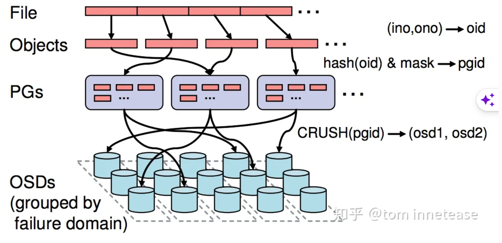
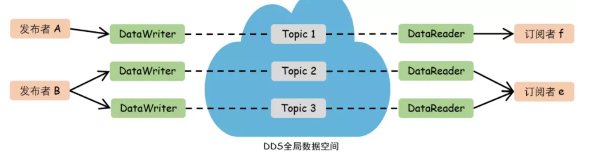
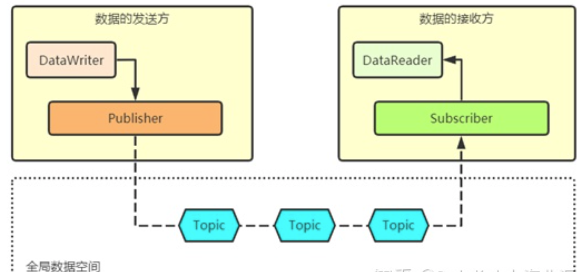
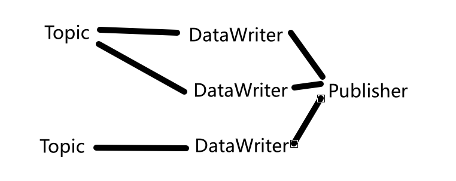

# 一致性

Owner: -QVQ-

# 概念

**网络分区**：在分布式系统中，由于网络问题或者硬件问题导致某些节点无法使用，部分节点可以使用，使得整个系统提供的服务不一致。

**CAP**：

C（一致性）：分布式系统中所有数据备份在同一时刻是否同样的值（等同所有节点访问同一份最新数据）

A（可用性）：一部分节点故障，整体集群是否能响应客户端读写请求（对数据更新具备高可用性）

P（分区容错）：大多分布式系统分布在多个子网络，每个子网络为一个区。区间通信可能失效。分区容错指部分网络通信问题不会导致整个服务器集群瘫痪，故障消除后也要保证数据一致性，是必须要保证的

**AP架构**：当网络分区出现后，系统B可以返回旧值，保证系统的可用性。

那个失去联系的节点依然可以向系统提供服务，不过它的数据就不能保证是同步的了，例如Eureka

**CP**：当网络分区出现后，为了保证一致性，拒绝请求

失去联系的节点不允许对外提供服务的，用户处于等待状态，一直等到数据同步完成

CAP 原则指示3个要素最多只能同时实现两点，

# Raft算法

解决分布式消息一致性问题，例如zookeeper

## 原理

每个节点有三种状态：候选人candidate，领导者leader，跟随者状态follower

如果跟随者没有跟随一个领导者则成为候选人

候选人将接收其他节点的投票，如果获得票最多将称为领导者

所有对于系统的改变都要通过领导者同意，每一个改变的添加都将作为log的一个条目加入到节点，此时条目没有提交所以值不会更新，领导者复制条目到每一个跟随者节点，等待大多数节点都传回了写入信息后，条目提交此时改变生效，领导者通知所有跟随者改变生效（跟随者条目提交），这个集群此时状态一致。这个程序称为log复制

领导者选举

在Raft中，有两个控制选举的超时设置。选举超时是跟随者等待的时间过长（约150-300ms）从而变为候选人，开始新的投票，它向其他节点发出投票需求，如果接收的节点还没有投票那么它会投票给这个节点，这个节点会重置选举超时，当候选人有大多数投票，它将称为领导者，发送信息（append entries）向所有跟随者，这个信息是周期性发送的，即心跳超时，跟随者也会回应每一个append entries，每次跟随着接收append entries都会重置选举超时。如果两个节点同时成为候选人则可能发生分裂投票，那么会等待重新开始下一轮投票，最终将选出一个领导者

在 Raft 算法的 Leader 选举中，

请求报文中的 term 表示候选人的当前任期号，

而 index 表示候选人最后一条日志的索引号。

# Viewstamps 一致性算法

Viewstamps 一致性算法是一种用于分布式系统中实现一致性的算法。它基于时间戳来确保节点之间的操作顺序一致性。

在 Viewstamps 算法中，每个节点都维护一个视图号和一个序列号。视图号用于标识当前的系统视图，序列号用于标识节点执行的操作顺序。

当一个节点想要执行一个操作时，它会向其他节点发送一个请求，并附带当前的视图号和序列号。其他节点会根据接收到的请求和自己的视图号和序列号来判断是否可以执行这个操作。如果节点的视图号小于请求中的视图号，它会更新自己的视图号和序列号，并执行这个操作。否则，它会拒绝执行这个操作，并返回一个错误。

通过使用视图号和序列号来协调节点之间的操作顺序，Viewstamps 算法可以确保分布式系统中的节点在执行操作时是一致的。

# crush算法

系统中所有角色（Clients、Servers）需要有一个统一的数据寻址算法Locator，满足：

 `Locator(ID) -> [Device_1, Device_2, Device_3, ...]`

早期的直观方案是维护一张全局的Key-Value表，随着数据量的增多和集群规模的扩大，维护这么一张不断扩大的表变得越来越困难

**CRUSH**(Controlled Replication Under Scalable Hashing)即为解决此问题而生，她仅需要一份描述集群物理架构的信息和预定义的规则（均包含在**CRUSH map**中），便可实现确定数据存储位置的功能。

**RADOS**（Reliable Autonomic Distributed Object Store）是 Ceph 存储系统的核心组件之一。它是一个可靠的、自主的分布式对象存储系统，用于存储和管理大规模的数据。

RADOS 提供了一种基于对象（Object）的存储模型，其中对象是数据的基本单元，每个对象都有一个唯一的标识符。对象可以是任意大小的二进制数据，可以存储文件、图片、视频、数据库等各种类型的数据。对象存储在 Ceph 集群的多个存储节点上，通过分布式数据复制和故障恢复机制来保证数据的可靠性和高可用性。


Ceph的RADOS中，每个object通过简单的hash算法归到一个PG中，PGID作为入参通过CRUSH计算置入到多个OSD中（PG可视为目录，object可视为文件），

# 一致性算法

Ceph 使用的是 CRUSH（Controlled Replication Under Scalable Hashing）算法来实现数据的分布和复制。

CRUSH 算法是一种可扩展的数据分布算法，用于在 Ceph 存储集群中决定数据的存储位置和复制策略。它通过将数据对象映射到集群中的存储设备位置，并使用一致性哈希函数来确定数据对象在集群中的存储位置。该算法具有高度可扩展性和灵活性，并且能够自动适应存储集群的扩展和收缩。

CRUSH 算法通过将数据对象的名称、位置和其他属性转换为一个稳定的数据块 ID，并使用哈希函数将该 ID 映射到一个虚拟的哈希空间中的位置。然后，它使用一种叫做 CRUSH 算法的分布式哈希算法，将数据块 ID 映射到存储设备的位置。CRUSH 算法在计算数据存储位置时考虑了数据块的复制策略、故障域和设备权重等因素，以实现数据的高可用性和负载均衡。

因此，Ceph 使用 CRUSH 算法来实现数据的一致性和高可用性，确保数据在存储集群中分布均匀，并能够在节点故障时进行自动的数据复制和恢复。

[Raft算法详解](https://zhuanlan.zhihu.com/p/32052223)

# DDS协议

## 概念

DDS（Data Distribution Service）是以数据为中心的中间件协议和API标准

分布式实时通信中间件协议，采用发布/订阅体系架构

位于操作系统和应用程序之间，DDS的核心，以数据为中心的发布-订阅模型DCPS（Data-Centric Publish-Subscribe）

它使开发人员不用在应用程序和系统之间传递信息，将应用层从操作系统网络传输和低级数据格式的详细信息中抽象出来，用不同的编程语言提供了相同的概念和API。（用户不用配置通信节点的地址或其他属性信息，在运行的过程中会自动发现对方并完成配置）

**优点：**

高性能、可扩展、安全且以数据为中心的发布/订阅抽象模型

具有动态发现服务的完全去中心化架构，自动在匹配节点间建立通信

丰富的服务质量特性，用于控制数据分发各个方面，数据可用性，资源使用情况，可靠性和时延控制

可互操作的数据共享，独立于平台的可拓展数据建模、编码表示

最新扩展支持RPC、安全、资源受限设备

- **Domain：**代表一个通信平面，由Domain ID唯一标识，只有在同一个域内的通信实体才可以通信；如果考虑车内通信，可以只划分1个Domain
- **Domain Participant：**代表域内通信的应用程序的本地成员身份，简单来说，就是说明同一数据域内的通信成员；
- **Topic：**是数据的抽象概念，由TopicName标识，关联相应数据的数据类型(DataType)，所有Topic集合在一起，就是一个虚拟的全局数据空间“Global Data Space”
- **DataWriter：**数据写入者，类似缓存，把需要发布的主题数据从应用层写入到DataWriter中；
- **DataReader：**数据读取者，同样可以理解为一种缓存，从订阅者得到主题数据，随之传给应用层；
- **Publisher：**发布者，发布主题数据，至少与1个DataWriter关联，通过调用DataWriter的相关函数将数据发出去；
- **Subscriber：**订阅者，订阅主题数据，至少与1个DataReader关联。当数据到达时，应用程序可能忙于执行其他操作或应用程序只是等待该消息时，这样就会存在两种情况，同步访问和异步通知。


Endpoint：用户订阅主题时，指定接收消息的终端地址，多个Subscription可以指定同一个Endpoint，平台会将消息推送到对应的Endpoint

## 原理

**数据共享**

dds的数据共享可以理解成一个抽象的全局数据空间，任何程序语言操作系统都可以通过相同的方式访问这个全局数据空间，实际上这个全局数据空间分别存储在每个应用的本地空间。系统运行时，数据按需发送

Qos（Quality of Service）策略，满足用户对数据共享方式的不同需求：可靠性、故障处理、细颗粒度的数据安全控制、权限控制等

**DCPS(Data-Centric Publish-Subscribe）模型**

DDS标准中定义的一数据为中心的发布订阅模型

**Publishers**和**DataWriter**为向全局数据空间写入数据的一方，


**数据的发送过程**

调用DataWriter对象提供的write方法把数据传递给Publisher对象，其负责将数据在网络上发送出去


一个DataWrite只能从属一个Publisher，而Publisher可以有多个DataWriter，一个DataWriter绑定一个Topic

Topic：数据的载体，数据打包后的内容，由IDL（Interface Definition Language）表示，对应DataScope.idl文件

```cpp
//一个DataScope.idl文件
module DataComm {//表示idl的范围scope
struct DataCommType {//表示数据内容
    short id;
    float data1;
    float data2;
  };
#pragma keylist DataCommType id 
//#pragma keylist表示DataCommType的键值，每个键值标识一个Topic实例
};
```

有一整套工具用于将IDL生成指定语言的代码，例如：生成c++格式

`idlpp -l isocpp2 -d 【路径】 DataScope.idl`

- 命令解释
    
    ```cpp
    [ -h ]
    [ -b <ORB-template-path> ]
    [ -n <include-suffix> ]
    [ -I <path> ]
    [ -D <macro>[=<definition>] ]
    < -S | -C >
    < -l (c | c++ | cpp | java | cs | isocpp | isoc++ | c99 | simulink) >
    [ -F ]
    [ -j [old]:<new>]
    [ -o <dds-types> | <custom-psm> | <no-equality> | <deprecated-c++11-mapping>]
    [ -d <output-directory> ]
    [ -P <dll_macro_name>[,<header_file>] ]
    [ -N ]
    ```
    

**数据的接收过程**

结构上和发送一样

Subscriber负责从网络上接收数据，并把它储存在对应的DataReader中，应用程序为对应的DataReader注册一个回调函数，或者使用DataReader提供read和take方法来轮询DataReader中的数据

**QoS**

支持服务质量QoS(Quality of Service)，控制数据在应用程序间的共享方式

每个DCPS实体，包括Topic，DataWriter，Publisher，DataReader，Subscriber等，都能够独立配置相应的QoS策略。

举例：

**DEADLINE** topic周期更新（包括发布和更新）

**LIFESPAN** 每个写入的数据都有到期时间，过期销毁

**HISTORY** 写者保存和发送旧的数据，新节点如果订阅了Topic，同时收到新值和旧值，了解数据的变化趋势

**RELIABILITY** 通信异常将重传直到接收

## RTPS协议

为了统一不同DDS消息交互方式，定义了消息格式和各种使用场景下的消息交互方式

# Lease机制（租约机制）

维护分布式系统数据一致性的一种常用工具，使得租约可以容忍机器失效和网络分割。

实际就是服务器对客户端一段时间内控制修改数据的权力，服务器发出lease后数据在有效期内不会删除，客户端可以放心使用

特点：

1. 是发布者是对一段时间内数据一致性的承诺
2. 不论是否接收，发布者在lease有效期内遵循协议
3. lease持有者有效期过后必须重新申请

lease的发布：

1. 服务器修改元数据时，读请求发来时直接返回数据，不颁发lease
2. 服务器生成新的lease后，需要等客户端都过期后才能颁发。
    
    解决方法：服务器主动通知客户端放弃lease，请求新的lease
    

## 使用

双主问题：

主从架构下，Q负责判断A、B、C的状态， 如果A是primary，Q通过心跳机制判断A的状态，但是因为网络异常或者“闪断”导致Q重新选择primary为B并通知A、B、C，因为通知顺序不能确定，如果先到B，此时存在两个primary都接收外部请求并与C同步

解决：

节点A、B、C周期性发送心跳报告，Q收到心跳后发送lease，允许节点在lease有效期内正常工作，节点Q给primary节点一个特殊的lease，表示节点可以为primary工作。一旦Q希望切换primary，需要等前面的lease过期再颁发新的lease

# 主从架构primary-secondary 协议（中心副本控制协议）（primary-backup）

按照指定流程控制副本数据进行读写行为的协议，使副本满足容错性、可用性、一致性（强一致性、会话一致性、最终一致性）

按协议分为“中心化”和“去中心化”两大类

## 中心副本控制协议

由中心节点协调副本数据的更新，维护副本之间的一致性，将分布式并发控制转为单机并发控制问题。中心节点异常系统将整体不可用

副本被分为两大类，一个作为primary副本，其他的为secondary副本

协议需要解决四个问题

### 数据更新流程

外部节点将更新操作发给primary节点，primary节点进行并发控制，将更新操作发给secondary节点，返回更新情况给外部节点

为避免primary节点的宽带成为系统吞吐瓶颈，采用接力的方式，primary将更新发给secondary副本，secondary副本转发下一个secondary副本

### 数据读取方式

最终一致性：系统可以读任意副本

会话一致性：系统为副本设置版本号，每次更新对版本号递增，用户读取副本时验证版本号

强一致性（该架构较难实现）：

**方案一**：只读primary副本，将数据分段，每一段有一个primary副本和多个secondary副本分散到集群里

例：数据分为数据段a、b、c，每段一个primary副本和一个secondary副本，有3台机器XYZ，那么数据段分配可以为：X【a(primary),b】、Y【b(primary),c】、Z【c(primary)、a】

**方案二**：由primary控制secondary节点的可用性，当primary更新secondary副本不成功时，标记这个节点不可用（从而副本节点要么和primary一致要么不可用）。

这种方式依赖于中心元数据管理系统记录副本状态信息

**方案三**：基于Quorum机制选择primary

### Primarily副本的确定和切换

确定primary节点：lease机制

切换primary如何不影响一致性：Quorum机制

primarily的切换需要时间，是这个协议的缺陷

### 数据同步

可能有三种情况

- 网络分化异常
- secondary上的数据可能是脏数据
- secondary是新增加的副本，没有数据

第一种可以回放操作日志实现

第二种设计阶段避免产生，如果存在则丢弃张数据副本

第三种使用检查点或快照的方式较快完成同步