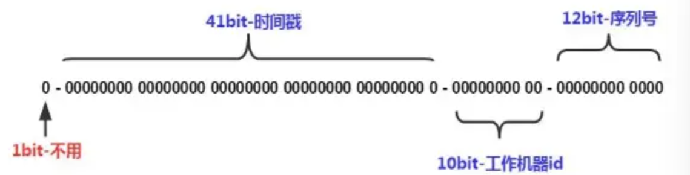

# 分布式ID生成

# 分布式ID特点

- **全局唯一性：**不能出现有重复的ID标识，这是基本要求。
- **递增性：**确保生成ID对于用户或业务是递增的。
- **高可用性：**确保任何时候都能生成正确的ID。
- **高性能性：**在高并发的环境下依然表现良好。

# 常见策略

1. 数据库自增ID。
2. UUID生成。（不支持自增，ID可读性差）
3. Redis的原子自增方式。
4. 数据库水平拆分，设置初始值和相同的自增步长。
5. 批量申请自增ID。
6. 雪花算法。
7. 百度UidGenerator算法(基于雪花算法实现自定义时间戳)。
8. 美团Leaf算法(依赖于数据库，ZK)。

# 雪花算法

在单机上递增，多台机器上大致递增并不是严格递增

## 数据结构

使用64位数字作为全局唯一ID


第一位为0没有作用，

41位时间戳，精确毫秒，可以容纳约69年的时间，

10位工作机器id，高5位为数据中心ID（机房），低5位为工作节点ID（机器），即做多1024台机器

12位序列号ID

在同一毫秒可生成的唯一ID数量=1024*4096

## 时间

项目开始时间为基准时间

获取ID可以使用位运算

**时间回拨问题：**

需要场景：人为改变、不同机器上时间同步，

解决：

回拨时间小的时候，不生成ID，阻塞等待时间点到达

利用拓展位，回拨后在拓展位上加1，但需要提前预留拓展位（序列号或机器ID）

### 计算

计算下一个ID：

判断序列号满了没（与最大序列化作与运算），满了则等到下一个时间戳

对应的值移位，再或运算加到一起

```cpp
////////////////////////////////////////////////////
GhUint64 snowflake_next_id(SnowFlake* snowflake)
{ 
		GhInt64 timeSpan = GetCurrentTimeMS();
		//如果请求时间相同，判断序列化满了没，满了则等到下一个时间戳
    if(snowflake->lastTime_ == timeSpan)
    {   //SEQUENCE_MASK全为1
				//通过这个方式判断序列化满没
        snowflake->sequence_ = (snowflake->sequence_ + 1)&SEQUENCE_MASK;
        //满了等下个时间
				if(snowflake->sequence_ == 0)//LCOV_EXCL_BR_LINE
        {
            timeSpan = Wait_next_MillSec(snowflake->lastTime_);//LCOV_EXCL_BR_LINE
        }
    } else {
				//请求时间不同，初始化为0
        snowflake->sequence_ = 0;
    }
    snowflake->lastTime_ = timeSpan;
    return (timeSpan << TIMESTAMP_LEFT_SHIFT)//移位22
    | (snowflake->host_id_ << HOST_ID_SHIFT)//移动17位
    | (snowflake->worker_id_ << WORKER_ID_SHIFT)//移动12位
    | snowflake->sequence_;//加到一起
}//通过这个移位可以看出确实是5位的机房号，5位的机器号，12位的序列号
```
