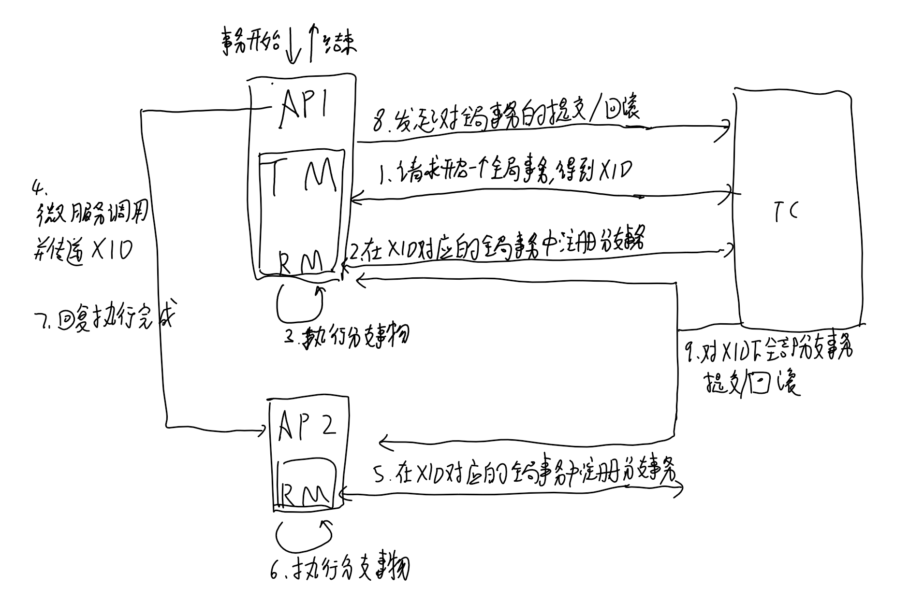
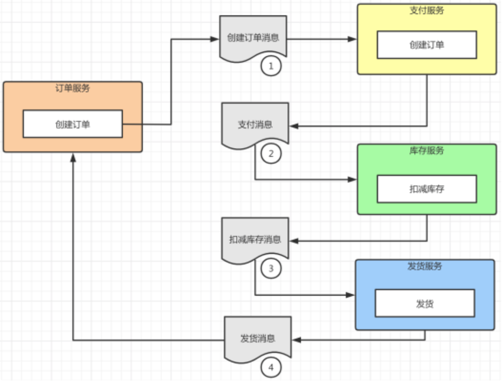
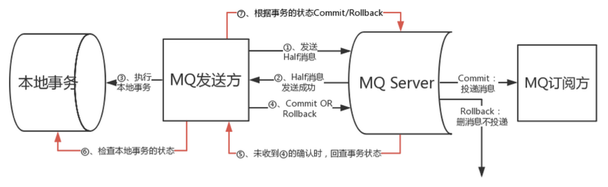
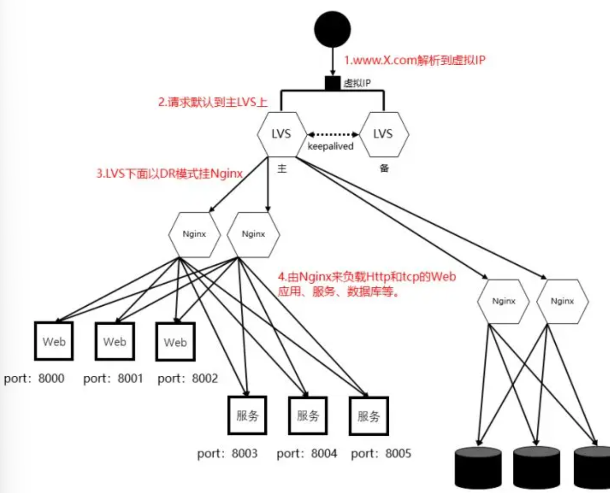
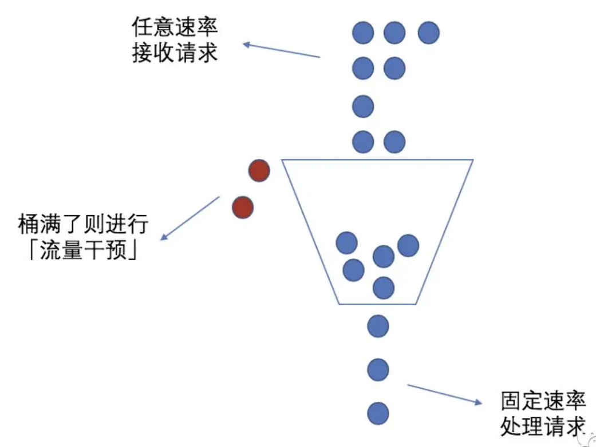
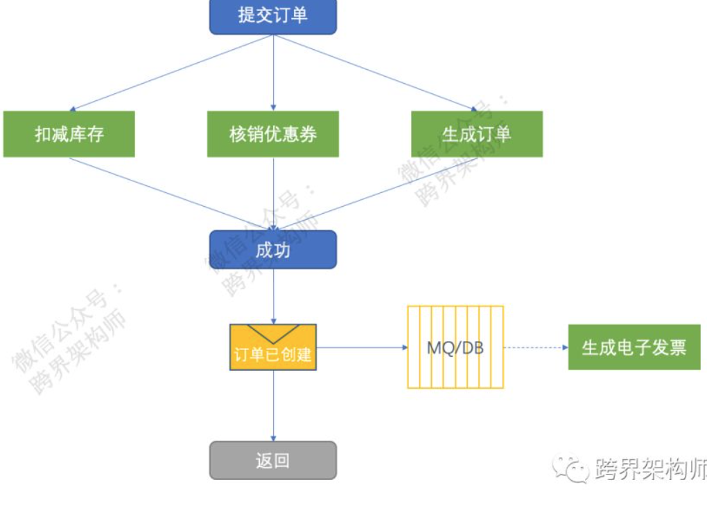

[](https://www.cnblogs.com/Zachary-Fan/p/distributedsystems.html)

# 共识算法

## gossip协议

[gossip协议](https://cloud.tencent.com/developer/article/1662250)

[todo——gossip协议](https://blog.csdn.net/u012422440/article/details/110571640)

# 分布式事务

## 使用场景

1. 跨JVM进程，例如微服务架构
2. 跨数据库实例，一次操作涉及不同数据库
3. 涉及同步互斥的多服务访问同一个数据库

## CAP理论

- C(Consistency) 一致性，在同一时间读取任何一台机器得到的数据是一致的，读写操作是串行化的
- A(Availability)可用性，任何读写操作都可以读到结果，不会超时
- P(partition tolerance)分区容忍，集群中存在两个或多个子网之间不能相互通信，而集群依然可以对外提供服务

在开发中，p通常都会出现，而C和A不能同时满足

AP：业务如果可以接受最终一致性，短时间内查到的数据不是最新的，例如redis，

CP: 追求强一致性同时放弃一部分性能，通常适用于小规模的数据，例如zookeeper,etcd

CA: 不分区的系统不是一个标准的分布式系统

实际开发中，很少有系统是纯粹的AP或CP，需要根据业务权衡

## BASE理论

BASE理论是对AP的拓展的

- BA(basically available) 基本可用,当系统出现故障的时候保证基本功能可用，损失部分可用功能
- S(soft state)软状态，在数据写入成功和失败之间存在一个中间状态，“支付中”，“等待中”
- E(eventually consistent)最终一致性，当前的数据可能不是一致性的，但在有限的时间后，数据会达成一致

## 分布式事务解决方案

2pc、3pc、tcc都引入了事务的决策者这个身份，可靠消息最终一致性，最大努力通知

### 2pc两阶段提交

一阶段，事务管理者给每个参加者发送消息，每个参与者本地上锁执行事务，并回复

二阶段，如果所有事务参与者都回复了成功，则事务管理者发送提交，事务参与者之前写入的数据此时生效使用。如果有事务参与者回复事务执行失败，则事务管理者发送回滚，事务参与者回退之前执行的事务

> 两阶段提交和raft
> raft是一种一致性算法，从底层通过日志复制确保多个节点数据一致，日志只会增加不会有删除
> 两阶段提交是分布式事务，属于业务逻辑，确保多个机器执行同样的增删改查操作
> 两阶段是一种实现分布式事务的方式，分布式事务也可以通过raft来实现，例如etcd

oracle、mysql都支持2pc协议

#### 2pc解决方案——XA方案

2PC是数据库层面实现的，XA方案提供了分布式事务处理模型DTP（Distributed Transaction Processing Reference Model），提供了如下角色

- AP，应用程序
- TM，事务管理器，嵌入AP中，协调各个RM
- RM，资源管理器，事务的参与者

TM向AP提供应用程序编程接口，AP通过TM提交及回滚事务，TM中间件通过XA接口来通知RM事务的执行

执行的逻辑和2pc是一样的，只是定义了TM和RM之间的通讯接口规范XA，基于XA协议来实现的2PC叫XA方案

#### 2pc解决方案——Seata开源项目的AT模式

一个开源的分布式事务框架，提供AT模式（即2pc）和TCC模式的分布式解决方案

组成：
- TC(transaction coordinator):事务协调器，需要独立部署，接收TM发起的事务，向RM协调各分支事务
- TM(transaction manager):事务管理器，嵌入应用程序中，负责开启一个全局事务，向TC发起事务的提交或回滚
- RM(resource manager):控制分支事务，接收TC的指令，驱动本地事务的提交和回滚


**seata的AT模式比起传统的2pc**：将全局事务拆分成了多个子分支事务执行，比起2PC在二阶段提交时才释放锁，seata在一阶段就将本地事务提交并释放锁，提高了效率

> seata中的RM配合数据库通过undo log引入了mvcc的部分机制，分支事务的执行实际上是写入了undo log之中。

### TCC事务

TCC要求每个分支事务提供预处理（Try）、确认（conrm）、撤销（cancel）三个操作，接入时每个分支事务都需要实现这三个接口。要保障这三个接口本身执行不会中断和出错，且具有幂等（因为conrm和cancel失败可能会重试）

- try阶段做业务检查及资源预留
- conrm阶段做确认提交
- cancel阶段是业务执行出错需要回滚时执行

整体依然由TC、TM、RM组成，TM可以是独立的服务，也可以让TC充当TM的角色。首先，TM发起分支的try操作，如果有分支try操作失败则发起cancel操作，如果try操作全部执行成功，则发起所有分支事务的conrm操作，conrm和cancel操作可能执行多次

**Seata的TCC模式，比起AT模式**：
- 接入：AT模式需要数据库支持，TCC模式需要实现TCC三个接口，接入成本更高
- 事务回滚：AT模式通过记录undo log和redo log从而自动在事务回滚时回复数据，TCC模式事务执行失败，需要调用cancel接口来回复数据
- 适用业务：AT模式适用于支持事务的数据库，TCC模式适用更复杂灵活的业务场景，可以精细控制每个服务或操作的补偿逻辑，降低锁冲突，提高吞吐

**几个TCC模式下的异常**

**空回滚**：需要能识别出没有调用try就调用了cancel方法（用全局事务ID记录整个事务的生命周期）

**幂等**：当cancel或conrm操作重试时不会导致数据不一致（在分支事务中增加执行状态）

**悬挂**：二阶段的cancel比try接口先执行，try接口预留了资源此时无法释放和使用（全局事务判断如果有二阶段事务执行了，不执行try）

### 3pc三阶段提交

引入了超时机制和新的询问阶段

- cancommit阶段：询问
- precommit阶段：cancommit阶段所有cohort都回复yes，则锁资源，发送所有cohort预提交，记录undo和redo日志。否则发送事务中断
- docommit阶段：向所有cohort发送提交，cohort执行提交并相应，所有cohort响应后coordinator完成事务。存在cohort回复no响应或超时未响应，发送中断请求

比起2pc：
- 缩小协调者单点故障带来的影响：2pc如果协调者的消息丢失，执行者的资源会一直上锁无法释放。3pc当进行到precommit阶段后，如果协调者的docommit消息或abort消息迟迟未到，执行者可以自行决定是回退还是提交。
- 数据不一致：docommit阶段执行者发送出abort回退，有些执行者收到了并执行，有些没有收到超时主动默认执行commit（）
- 新增一个阶段作为缓冲，cancommit阶段先看能不能执行，不能执行就abort不占用资源

### saga模式

**编排模式：**

发起者调用第一个事务的参与者，其执行子事务后调用事务链的下一个参与者，最后一个参与者完成后再通知事务的发起者，完成整个事务。如果中间某个子事务执行失败，链式回复链路的上一个参与者进行补偿操作。


**控制模式**：

发起者向saga协调器发送请求命令，协调器按照子事务的执行顺序链式调用每个服务，即引入了一个第三方来控制链式调用

**两个模式的区别**：

编排模式实现更简单，但整个链路不可控，也不好查看。

控制模式存在一个saga协调器来管理这个链式调用，可以在协调器里看到这个调用逻辑，实现统一细化控制链式操作，判断是否存在循环调用等等，并且可以对部分场景从链式调用优化为并行调用，是商业上更成熟的方案

**比起TCC模式**：
- 场景：saga适用于业务流程长的场景。TCC需要业务支持，对于无法修改的微服务可以采用saga模式。例如金融系统（需要对接外部系统，流程长）
- 接入：TCC里try阶段预留资源，conrm阶段和cancel阶段都需要单独编写接口，接入相对复杂。saga模式提供执行和补偿操作的接口相对容易实现（订单创建对应删除，修改数据对应删除，都是业务逻辑）
- 一致性：链式执行的saga意味着分布式执行的速度会更慢，且每个节点执行了子事务后数据不一致就出现了，整个系统数据不一致更突出

### 异步消息

事务发起方执行完本地事务并发出后，就认为事务处理成功了。

- 要求发送方本地事务的执行和消息发送共同构成原子性操作，
- 接收方消费消息的幂等性，可以重复接收消息但不会重复执行消息

特点：不同服务间解耦度高，相对执行周期长，将同步的事务操作变成了异步的消息执行。不考虑接收方事务是否执行成功

#### 本地消息表方案

将消息存储在和本地数据同一个数据库中，对本地数据的读写和对消息的读写都经过本地数据库的同一个事务，从而保证对消息和数据的写入的原子性。后台线程定期读取消息文件发送到接收方。

对于接收方：

**可靠消息最终一致性**：

发送方持续发送消息，直到接收方回复ack表示消费了消息

**最大努力通知**：

发送方按照一定策略周期性发送消息（例如1min、2min、4min……），接收方如果要使用这个数据，主动向发送方请求同步数据

特点：解决了发送方消息发送和事务执行的原子性，但接收方需要保证消费消息这个操作是幂等的，适用于实时性要求不高的场景，有比较好的吞吐量

#### 不支持事务的消息队列方案

比起本地消息表方案，发送方只需要将消息交付消息中间件，由消息中间件通知接收方。

不需要发送方轮询发送消息，需要解决发送方事务执行和消息发送的原子性

#### 支持事务的消息队列方案

消息队列提供了收到消息的通知发送方执行事务，发送方执行事务成功后再通知发送的能力



[saga分布式事务]（https://cloud.tencent.com/developer/article/1839642）

[infoQ——支持分布式事务的消息中间件rocketMQ]（https://www.infoq.cn/news/2018/08/rocketmq-4.3-release）

[分布式系统——事务](https://mp.weixin.qq.com/s?__biz=MzU2NzEwMDc4OQ==&mid=2247483888&idx=1&sn=b1d565c57198b98e3ab73a886697bfe0&chksm=fca315eacbd49cfcd06bace206cc73afa31f8421d249fe5cbfc06fa5bbf1d80373c4e5e8c009&scene=21#wechat_redirect)

[百家号——分布式事务](https://baijiahao.baidu.com/s?id=1717325036148461851&wfr=spider&for=pc)

[三阶段提交](https://mp.weixin.qq.com/s?__biz=MzAxMjY5NDU2Ng==&mid=2651851463&idx=1&sn=8d7863f332a9c0e4827413d6959eef47&chksm=80494f8eb73ec69835550663b718664859baaff66de0c40b0ea07f3ce11b06a12f77f86bcdce&scene=27)

# 高可用-负载均衡

## 负载均衡概念

负载均衡的使用场景
- web应用负载均衡，将用户请求分发到不同的web服务器
- 数据库负载均衡，对于大量的数据库查询、事务操作负载均衡
- 应用服务负载均衡
- 云计算负载均衡，服务在云中不同实例之间分发流量

不同的负载均衡
- 7层负载均衡：使用URL（http）或api（quic）接收外部流量
- 4层负载均衡：使用IP+端口（tcp、udp）接收外部流量
- 3层负载均衡：使用虚拟IP地址（公共ip）访问，映射为实际的ip地址（私有ip）
- 2层负载均衡：使用虚拟MAC地址请求实际机器，修改为目的地的mac地址，使真实物理服务器集群所有机器虚拟ip和负载均衡服务器ip地址一样，这种方式为直径路由方式（DR方式）

> 2层和3层负载均衡不会同时使用，通常在硬件确定的局域网中通信时使用2层LVS更高效，3层局域网需要做ip地址的转化有轻微的性能开销

> 3层负载均衡比起4层，性能高但功能单一，只关注ip包的传输，适用于大规模流量调度，4层负载均衡支持更细颗粒度的流量分发，适用于应用服务


## 负载均衡的常用策略

### 轮询

嗯。。

### 最小连接数

嗯。。。

### 加权轮询

**简单的实现**

如果3台机器的权重是2 1 2：
每次请求到来按照机器1，机器1，机器2，机器3，机器3，这样的顺序分配

问题：如果运行时通过配置reload服务来增加机器或修改了当前机器的权重，那么整个负载的过程要重新开始，当前机器已经接收的服务无法作为负载均衡的参考因素

**更成熟的实现方式**

如下的实现，由（当前节点的权重值，已提供服务的历史权重，整个集群的权重）共同决定节点当前的权重

```cpp
int matchedIndex = -1;
int total = 0;
for (int i = 0; i < servers.Length; i++)
{
      servers[i].cur_weight += servers[i].weight;//①每次循环的时候做自增（步长=权重值）
      total += servers[i].weight;//②将每个节点的权重值累加到汇总值中
      if (matchedIndex == -1 || servers[matchedIndex].cur_weight < servers[i].cur_weight) //③如果 当前节点的自增数 > 当前待返回节点的自增数，则覆盖。
      {
            matchedIndex = i;
      }
}

servers[matchedIndex].cur_weight -= total;//④被选取的节点减去②的汇总值，以降低下一次被选举时的初始权重值。
return servers[matchedIndex];
```

### 最快响应

记录最近一段时间的请求耗时的平均值作为权重，结合加权轮询

### hash法

前面都是根据服务端的能力负载均衡，hash是将客户端的请求尽可能打散分摊到不同机器，降低一个机器负载过高的概率，不能完全解决负载均衡，可以和其他方案搭配使用

### 健康探测

通过健康探测判断机器是否可用，不可用可以将节点临时移出服务列表

**http探测**：用get\post请求某个url，通过http状态码来判断

**tcp探测**：三次握手+rst来中断连接

**udp探测**：icmp协议提供的探测能力

## 负载均衡的实现

**域名解析实现负载均衡**

一些公司会搭建DNSHTTP，可以用它用作内网的ip解析，动态返回不同ip起到负载均衡，但DNS工作在网络层，无法对端口均衡

**硬件负载均衡**

如果资金大于时间时，硬件负载均衡（例如F5）能同时支持L2-L7的转发，在服务器和外部网络之间安装负载均衡设备，独立于操作系统，功能强大，这里主要提软件负载均衡

**L7层负载均衡**：

场景：当用户规模扩大后，通常应用比数据库先到达瓶颈，将单应用-单库变成多应用-单库。

解决方案: 
- 反向代理（成熟的产品有用nginx或HAProxy）：公网域名解析解析到反向代理的机器，反向代理负责将请求转发到web应用的IP+端口和做负载均衡策略（nginx默认轮询策略）
- api网关：在微服务架构中，微服务的调用都会经过api网关做统一的路由选择、限流、安全策略等
- 重定向负载均衡：
用户请求到达重定向服务器，返回302状态码和重定向服务器地址，再访问实际服务器，浏览器需要两次请求才能完成访问性能不好，不常用
> 反向代理和api网关是指的不同功能，在成熟的架构中，一个nginx能同时实现这两个功能，对于http类型的请求走反向代理，对于api方式的访问走api网关的路由方式

**L4层负载均衡**

场景：当应用所依赖的服务需要横向拓展时，例如分表、缓存、主从集群等。

通过3层的VIP地址加4层的端口号决定处理哪些流量，对流量进行nat处理转发到后台服务器，并记录，后续的这个连接的流量都转发到同一台机器

解决方案：
1. LVS是一个支持L4的负载均衡软件，位于linux内核，比起nginx做L4在性能上会更优

处理4层IP+端口的流量，底层的实现有NAT模式，TUN模式，DR模式

2. F5：硬件方案，成本高，但功能最好
3. nginx
4. HAProxy，一个高性能的负载均衡器，

原理：客户端的请求首先到达HAProxy，HAProxy通过定期向每个后端nginx节点做健康检查，维持一个可用的负载均衡池

作为L4负载均衡器，适用于后端有大量的nginx节点，需要做更复杂的流量分配策略


**客户端负载均衡**

将服务清单放到客户端中。客户端通过服务注册定期更新每个服务对应的instance清单，访问时直接本地服务发现访问指定实例

优点是可以避免负载均衡器的单点故障

## 负载均衡集群的实现

**如何实现故障转移和高可用：**

Keepalived，一个用于高可用的软件，原理：
- 外部流量始终指向vip，
- 将nginx节点划分为master节点、backup节点，默认行为是只由master节点提供服务，backup不服务（这样的设计是因为Keepalived只用来保证集群的高可用，不负责负载均衡）
- Keepalived随nginx部署，不同节点的后台keepalived协同工作，keepalived通过VRRP感知本地的nginx服务，当主节点故障时，自动将vip切换到备用节点

VRRP是一个3层的协议，通过组播和优先级选举机制实现虚拟ip在多个节点之间漂移。通过4层的网络对不同节点做健康检查

多个节点之间用心跳感知集群状态，节点过多时网络资源消耗增大，因此只适用于小规模的集群


**方案一：Keepalived + HAProxy + Nginx 的组合架构**：将多个HAProxy节点分为若干组，客户端的请求到达先通过DNS、负载均衡硬件或其他手段到达一个HAProxy组，这个组内通过vip访问由Keepalived管理的HAProxy集群中的一个健康节点，HAProxy将流量分发到多个后端nginx节点

**方案二：Keepalived + KVS + Nginx 的组合架构**：

流量到达vip步骤同上，LVS通过keepalived组成集群作4层负载，LVS以DR模式挂nginx做7层负载。如果在同一个局域网内，用DR模式有很好的性能，不在一个局域网用TUN模式进行L3转发。


**方案三：HAProxy配合容器编排工具**：在容器化中运行HAProxy为一个服务，通过k8s自带的负载均衡实现高可用。部署简单，适用于云原生架构

> 其他一个集群服务基本的功能，包括对nginx集群的日志收集、警报机制、性能监控，配置管理（为了让一个集群里不同机器根据自身的硬件能力使用不同的配置，以及实现灰度发布功能）

## 负载均衡的弊端

**session丢失问题**：负载均衡的hash算法决定了当机器不变时，可以让一个用户的请求每次都被同一个机器响应，但是当机器增加后，可能导致大量同一用户的请求被分配到新的机器处理，而新的机器上没有这个用户的缓存，从而直接访问后端数据库，造成缓存穿透

一些解决方案：

1. session保持

当用户流量第一次进入nginx匹配节点时，为其生成一个唯一标识写入到cookie中返回给用户，此后用户每次访问时携带这个cookie，nginx将这个用户的请求转发到对应的节点上去。缺点是需要客户端开启cookie机制

nginx的nginx-sticky-module模块可以实现这个功能

2. session复制

用户的session信息同步给所有服务机器

简单粗暴，数据冗余多，有广播风暴风险，网络带宽消耗大

3. session共享

将session信息放到一个全局共享的存储介质中心化

对这个共享介质作水平拓展就能应对用户的增长，拓展性好。但每次读写都要请求共享介质，性能下降。共享介质的维护带来成本。要应对共享介质的单点故障

> 每个请求的session信息都以最终一致性的方式同步到共享存储，用户的请求到来时先使用本地的session信息，如果找不到再去共享存储查询。共享存储如果还没同步到数据，则发起主动数据更新请求管理session信息的消息中间件。这个链路会不会太长了？


[分布式系统](https://mp.weixin.qq.com/s?__biz=MzU2NzEwMDc4OQ==&mid=2247483998&idx=1&sn=fd7a0790c8199d400f8c73b99bef6392&chksm=fca31644cbd49f52bb857b270ea832bed389689499d714d41b6df694d5b9a98cc5f38936106b&scene=21#wechat_redirect)

[知乎，深入理解负载均衡]（https://zhuanlan.zhihu.com/p/5108202387）

[做了「负载均衡」就可以随便加机器了吗](https://mp.weixin.qq.com/s?__biz=MzU2NzEwMDc4OQ==&mid=2247484012&idx=1&sn=f1d66f74ba91e7743e62ad0fa412d741&chksm=fca31676cbd49f6052b302fd49d59f2208160dfc2d22e92998ad34d77666df9d2ca5b94d61a6&scene=21#wechat_redirect)

# 高可用-熔断

基本功能：识别当前处于不可用状态->切断联系->识别当前处于可用状态->重新恢复服务

为避免瞬发的异常，引入时间窗口，在窗口内，通过请求失败的次数或者请求成功和失败的百分比来判定

```cpp
int success_count=0;//后台线程定时清0
int error_count=0;//后台线程定时清0
bool ser_status=true;
bool is_probe_status=true;

//探测逻辑
if(success){
    if(is_probe_status){
        success_count++;
        if(success_count>MAX_USEALE_VALUE){
            ser_status = true;
        }
    }
}else{
    error_count++;
    if(error_count>= MAX_VALUE){
        ser_status=false;
    }
}

if(ser_status=false){
    return false;
}else{
    return true;
}

```

> 如果所依赖的系统有分区或多副本，个别节点的异常不等于所以节点异常
> 先考虑降级或限流，最后考虑熔断

# 高可用-限流

首先需要通过压测获得系统能力的上限，通常需要得到两个结果，速率（一个时间单位里处理请求的数量），并发数（同一时刻能处理的最大值）

## 固定窗口

将时间划分为多个固定的周期（10s、30s），计数每个进入到流量，淘汰超过阔值的流量，进入下个周期清零计数器

```cpp
int count=0;//后台固定清0

if(count>MAX_VALUE){
    return;//不做处理
}
count++;
```

缺点：一个时间周期里流量进入到速度也是有波动的，周期里前1/3是流量高峰已经将计数器占满了，后2/3流量平缓，但却无法提供服务

## 滑动窗口

为了解决上述问题，将固定窗口划分成更小的多个窗口，统计的时间范围随时间段推动同步后移。如果固定窗口已经很小了，那么不需要使用滑动窗口

```cpp
vector<int> windowsList[MAX_WIDTH];//滑动窗口
int windows_ptr=0;//指向要被淘汰的那个指，同时也是要写入的那个位置
//后台定时器通过windows_ptr将滑动窗口windowsList里对应的指清0

int sum = accumulate(windowsList.begin()，windowsList.end());
if(sum>MAX_VALUE){
    return;
}

int cur_ptr = CUR_TIME % MAX_WIDTH;
windowsList[cur_ptr]++;//当前时间窗口的计数器+1
```

部分程度上解决了上述问题，依然无法物尽其用

## 漏桶算法

当流量速度达到阔值后，先缓存在桶内，桶内按照预先的速度逐渐释放流量，如果流量的速度超过了缓存的能力，则丢弃


```cpp
int unitSpeed;//后台线程定时清0
int waterLevel;//桶内缓冲的数量

//假设底层的网络框架是对每个请求生成一个线程
if(unitSpeed<MAX_SPEED){
    unitSpeed++;
}else{
    if(waterLevel>MAX_WATER_LEVEL){//桶内水位已满
        return;
    }
    waterLevel++;

    while(unitSpeed>=MAX_SPEED){//控制释放流量的速度,直到下一个周期unitSpeed被清0
        sleep();
    }
    unitSpeed++;
    waterLevel--;//桶水位下降
}

//执行业务逻辑处理请求
```

解决了滑动窗口的问题，但是需要提前预估设置阈值，通常只能设置一个相对悲观的值，但系统的处理能力随时在变化，能承载的流量能力在一个窗口内不是恒定的。

## 令牌算法

### 单桶单速

令牌桶存放令牌，定期向令牌桶发放一定令牌，流量从令牌桶拿到令牌的才能提供服务

```cpp
int tokenConut;//独立线程定期增加，同时不大于一个值

if(tokenCount==0){
    return ;
}
tokenCount--;

//执行业务
```

适用于优先级较低的业务，如外网HTTP流量

> 令牌桶和漏桶的区别：漏桶限制的是流出的流量速度，需要业务方提供最低处理能力即速率作为流出的阔值，令牌桶限制的是流入的流量速度，可以屏蔽业务方处理能力的波动，令牌桶的大小是业务方的最大并发数，在相同参数下得到的限流效果是一样的

### 单速双桶

两个令牌桶C、E，使用时先使用C桶的，C桶用完了再用E桶。投放时先投C桶，C桶满了再投E桶

比起单桶单速能允许一定程度的突发流量？？？？？

使用于有突发的业务，如企业邮件

### 双速双桶

P桶表示最多接收多少个流量，C桶表示最多服务多少个流量。流量进来先去P通拿令牌，没拿到抛弃，再去C桶拿令牌，拿到才提供服务，没拿到等待，即P桶起到一个缓冲的作用，一个流量要被服务需要同时拿到PC桶的令牌。

分别以不同速率向P桶、C桶投放令牌

[令牌算法](https://blog.csdn.net/u012451051/article/details/125715218)

[令牌算法](https://www.sohu.com/a/476287790_445400)


固定窗口和滑动窗口适用于作为临时方案，实现简单。漏桶最适合作为通用方案，资源利用上没有那么极致但对保护后端系统有一定的余地。令牌桶用于对后端性能的机制压榨

## 分布式系统中做限流

从系统的纵向考虑。在一个分布式系统中，越靠前越容易做限流。如果有接入层，在接入层做（nginx作为反向代理时，ngx_http_limit_conn_module以及ngx_http_limit_req_module模块来做限流）。如果没有接入层那么要考虑不同的应用下，谁优先做限流。

从效果上来说，在客户端部分做限流会更高效，但客户端做限流难度更大，成本更高

对于多个客户端做限流，或一个服务端集群做限流，每个节点的性能存在差异，且会实时变动，要感知多个节点的能力得到一个策略并在多个节点生效，可以引入一个性能监控平台和配置中心

# 高可用-降级

将有限的资源消息最大化，损失一部分功能，将资源让给核心功能，使得核心功能有更强的服务能力

一些降级方案：
1. 牺牲用户体验：
- 放缓流量速度，增加验证码
- 减少对冷数据的获取，禁止翻页
- 静态化数据代替动态化数据
- 减少计算，提高查询是的筛选要求
2. 牺牲功能完整性
减少日志采集，关闭风控
3. 牺牲时效性
异步执行的操作降低处理效率

降级对象的选择采用定级定序：将每个功能按照重要程度划分为几个级别，每个级别的每个服务排序。主要服务端依赖关系，被依赖的服务优先级不能低于依赖方

# 高可用-补偿

在一个传输链路中，任何一环都有可能出错，一旦某个操作发生了异常，可以通过内部机制将这个异常产生的不一致状态消除掉

> 事务补偿是做回滚操作，重试也是一种补偿

## 回滚

显示回滚：首先确定回滚的范围，在编排服务端时候把有回滚接口的服务放到前面，这样后面的工作服务出错时有机会回滚。回滚中间产生的数据可以做存储

隐式回滚：即这个回滚动作不需要额外处理，例如超时失效机制，预占机制（用户15分钟没有支付账单，释放库存）

## 重试

当下游系统返回临时状态，有恢复预期的时候可以考虑重试

- 立即重试
- 固定间隔重试
- 增量/指数间隔：失败次数越多的重试请求优先级排到越后面
- 全抖动：在递增的基础上，增加随机性。能将某一时刻的大量请求分散。```return random(0, 2^retrycount)```
- 等抖动：全抖动和增量间取平衡```return 2^retrycount + random(0, 2^retrycount)```

重试调用的接口应当具有幂等性：一旦某个功能支持重试，那么整个功能都要考虑幂等性

接口实现幂等性的思路：
- 给请求加版本号
- 给处理加上状态

# 高可用-伸缩性

## 有状态和无状态

一个程序的执行中，对于一些重复的数据获取生成，可以临时记录，形成一种局部的会话状态，目的是为了提高程序的效率，但带来了这次会话对这台机器的依赖问题，导致服务端没法对用户请求进行自由调度，容错性不好，不利于集群的伸缩和维护，这就是有状态。如果想获得好的伸缩性，无状态的处理机制更合适

状态信息前置，利用客户端的cookie，将临时数据发给客户端暂存，需要的数据都通过上游的客户端传过来。带来的代价是网络的数据包更大

在整个请求链路环节中，对于会话状态相关的处理尽可能的在贴合用户的上层去做，这样状态丢失重建状态的成本相对小很多，且下层的DAL(Data Access Layer)和BLL(Business Logic Layer)代码更易于维护，也易于灰度发布（中心化会话信息，灰度发布下会有用不到的信息创建）

通常将IO密集型程序和CPU密集型程序分离才能更好的实现无状态，有状态的部分全部给IO密集型程序，CPU密集型程序从而做到无状态

## 高内聚低耦合

> 内聚度：如果一个模块功能明确单一，组成模块的元素结合的紧密，则内聚度高

分布式系统中对一个问题需要分解成多个子问题治理，再做归并。对每个子问题需要各自独立，不能相互依赖。

首先需要定义好每个模块的职责，其次对模块做功能的归类分层，同时做好每个模块边界的划分。主要依靠codereview和静态代码检测工具，需要关注：
- 检查依赖是否超出规定
- 对类的调用必须通过接口
- 功能是否单一
- 写接口尽可能少的输入参数，读数据返回尽可能多的参数

> 写操作为了确保逻辑的准确性，尽可能清晰处理的逻辑
> 读操作为了应对接收方业务的频繁变动，提前返回尽可能多的数据从而降低改动。更好的方案是通过传入的参数按需返回数据

## 弹性架构

在事件驱动架构中，一个请求需要不同的业务功能配合完成

### 事件驱动架构

#### 中心化模式

存在3类主体：事件生产者、上帝（调停者）、事件处理者

在这个架构下的执行逻辑：事件生产者->队列->上帝（调停者）->队列->事件处理者

对于上帝来说，需要做

**事件转换**：通过一个全局标识表示这个请求，记录事件发起者的入参，通过子标识记录整个事件过程中产生的请求和累积的上下文，例如x.x.x.x格式

**事件发送**：负责事件流转，决定了是串行执行还是并行，是否产生分支，是否需要归并

对于大规模的数据来说，中心化模式能让整个流程更加清晰，也易于监控，复杂度都在调停者这里，事件处理者不需要关系整个流程，易于事件处理的修改，事件流程的变动。但同时也还需要考虑数据一致性，加大实现的复杂度

#### 去中心化模式

这个架构会变的简单，复杂度到了事件处理者这里，不利于事件流程的增加，对于小规模的数据来说实现容易

在这个架构下的执行逻辑：事件生产者->队列->事件处理者->……->其他事件处理者

### 微内核架构

在整个流程中，对于一个模块，有时候只想修改这个模块的一小部分的功能，同时希望热更新，不想影响正在进行的使用这个模块而没有使用这个功能的业务

微内核架构中将这个模块的核心部分作为核心系统，其他部分作为插件可随意替换。

核心系统提供微内核+内置插件+插件模块。微内核负责插件的生命周期管理和控制插件模块，插件模块负责插件的加载、替换和卸载。

适用于：
- 业务逻辑不同，但共同的核心运行逻辑通用明确
- 具有明确的增量开发预期
- 功能的替换上线卸载方便，适用于模块功能可能变动频繁，或希望对模块功能有高度自定义能力

> 这两个架构并没有清晰的界限，只是从不同的功能角度进行的划分，很多时候都是同时存在的。nginx就是一个典型的例子，请求到来通过事件框架接收移入对应队列，
http框架取队列调用不同模块执行11个阶段，这是典型的事件驱动架构。同时事件框架、http框架、配置模块等又构成微内核部分的核心系统，插件模块可以随需求增改

## 拆库

随着用户增长，当瓶颈来到数据库时，硬盘盒内存的扩容相对容易，cpu飙高只能做拆分，将一个数据库的cpu压力分摊到多个 cpu上

### 拆库之前

在编程查询时，尽量将一些关联的查询操作体现在应用层，对多个表的联合查询拆分成一阶段并发查表得到数据，二阶段对数据计算得到结果

首先确认问题，如果只是单表数据过大，导致SQL操作执行的比较慢，可以先拆表拆库

其次可以先使用读写分离之类的方案来应对面临的问题

### 垂直拆分

水平拆分有更高的成本，业务对数据库的访问通常有大量的join、transaction需求：
- 要么舍弃不重要的捆绑逻辑，业务做出调整
- 要么将联合查询相关的逻辑上浮，在业务层体现，会有一定的性能开销，查询更慢

通常优先考虑垂直拆分，以业务为维度，将不同无关业务的数据库拆分

### 水平拆分

通常写请求也涉及了读请求，所以优先找到读请求最高频的字段拆分，根据实际使用时代特点进行拆分

几个拆分方案：
- 范围切分：一种连续式的切分方式

比如按照订单的创建时间划定范围进行切分，地域切分，

- hash切分

将数据映射到不同节点。

缺点：
1. 如果有再次扩容一定有数据迁移。结合一致性哈希，创造多个虚拟节点，映射到不同的物理节点上，一定程度上能缓解数据迁移的压力
2. 同一用户的多条数据映射到不同节点了，同一用户的多条数据查询是概率事件。
通过在生成的唯一haship后追加一个useid，使得同一个用户的数据取模固定，从而固定存放到一个节点。
这个只能解决一部分问题，如果还有其他的关联操作，不能再用这个方法了

- 全局表

维护一张全局表记录每个数据id和对应物理库/表的关系，每次查询时都经过全局表

实现逻辑简单，但全局表有访问压力，且增加了请求链路长度。如果数据越大，越应考虑hash切分

# 高并发-缓存

## 常见的缓存更新策略

### Cache Aside（旁路缓存）策略

实际中redis和mysql都使用这个策略

**对于读**

命中缓存则返回，没命中则从数据库读数据再写入缓存

**对于写**

先更新数据库的数据，再删除缓存的数据

不能反过来，先删缓存再更新数据库会读写并发时出现缓存和数据库不一致

- B读取数据a，缓存没命中，请求查询数据库
- A想更新数据a，删除缓存
- B得到a的旧值加入缓存
- A更新数据库的数据为新值，
- 此时缓存的数据和数据库的数据不一致，将一直保持下去直到缓存失效

而先更新数据库再删除也会出现，但概率不高

- B读取数据a，缓存没命中，请求查询数据库，得到旧值为20
- A想更新数据a，更新数据库为21
- A更新完数据库，删除缓存
- B将旧值写入缓存

对于步骤3和4，通常更新数据库比缓存的写入要慢，所以通常步骤4会先于步骤3发生

如果要彻底解决这个问题：

1. 更新值前加分布式锁，同一时间只允许一个线程更新，这会带来写入性能问题
2. 给缓存上租约，即使出现缓存不一致，也会很快过期，对业务的影响可接收

先写换缓存后DB只适用于对数据写性能要求很高，但数据准确性要求没那么高

**单库写缓存失败**

通常先写DB，在写缓存，如果写缓存失败了，回滚DB，但是回滚DB有可能失败（数据库压力过大），因此将回滚DB换成delete缓存，从而多一次的cache miss来换rollback DB失败的问题

> ？？：
> 对于redis这类数据库，写缓存失败很有可能是网络导致的，如果写缓存失败也意味着删除缓存也有可能失败
> 但是因为删除缓存是幂等操作，可以通过一些方式来保障删除缓存的操作，比如多次重试，延迟双删，异步队列，分布式事务等。即使删除操作延迟到达，删除了新的缓冲，下次读cache miss直接访问库也不会影响数据的一致。用这些方案依然有可能出现一段时间的数据不一致。
> 这些操作都比直接回滚DB更安全，回滚DB意味着数据库要执行一套写入流程，有更大的开销

**多库写缓存失败**

问题：数据库在主从模式下，当数据未同步到从库时，由于cache miss去从库读数据读到旧值

解决：

- 缓存定期访问数据库同步数据。消耗资源，存在一定时间的数据不一致。只适用于少量场景

- 当从库同步主库数据后，再对缓存做一次delete或set。依然是最终一致性方案，但开销小

- 有数据写入的这段时间强制读主库来加载缓存。每次写操作都伴随一个写共享存储数据的操作（带有租约），每次读时判断共享存储里这个值是否存在从而判断是否走主库。
对主库压力增大，适用于对数据一致性容忍度较高的场景

该策略适合读多写少，不适合写多的场景，写入频繁会使得缓存的数据频繁改变，从而缓存命中率低

### Read/Write Through(读穿/写穿)策略

应用程序只和缓存交互，缓存和数据库交互

**对于读**

查询缓存数据是否存在，存在则返回，不存在则由缓存组件从数据库查询，并写入缓存组件，缓存组件将数据返回给应用

**对于写**

先查询数据在缓存中是否存在，如果存在则更新缓存数据并同步更新数据库，然后缓存组件返回更新完成
如果不存在，更新数据库后返回

开发中使用较少，因为常用的分布式缓存组件，例如memcached和redis都不提供和数据库交互的功能，对于我们自己写本地缓存可以使用这种策略

### Write Back（写回）策略

更新数据时只更新缓存，将缓存数据设置为脏并返回，不会更新数据库。对于数据库的更新会通过批量异步的方式进行

这种方式常用于计算机体系结构中的设计，如CPU的缓存、os中文件系统的缓存

适用写多的场景，但数据不是强一致性的，并且如果断电有数据丢失的风险

## 本地缓存和分布式缓存

> 如果本地缓存只是做分布式缓存的缓存，用户请求只读本地缓存，本地缓存没有则从分布式缓存中引入，同时每个数据都有租约。那么没有下面说到这些问题
> 这里提到的本地缓存指本地存放分布式缓存里没有的业务数据

引入分布式缓存，能应对业务的增长，要求我们的程序是无状态的，而引入了本地缓存，变成了有状态，分布式缓存的作用就变小了

本地缓存的使用场景：
- 不经常变动数据
- 需要支持高并发（秒杀场景）
- 对数据准确性能容忍

**本地缓存、分布式缓存、DB之间的数据一致性**

多个本地缓存节点间的数据同步：
1. 同步多个本地缓存，修改的节点通知其他节点变更。只适用于节点少的情况
2. 不同步多个本地缓存，借助一致性hash让请求落到一个节点。可能出现负载不均衡

## 缓存带来的一些问题

### 缓存雪崩

当大量缓存在同一时间过期时，面对大量的用户请求，需要大量直接访问数据库，从而增大数据库压力，进一步会造成数据库宕机

解决：

- 随机打散缓存失效时间：在原有的失效时间上增加一个随机值
- 设置缓存不过期：通过后台服务来更新缓存数据

### 缓存击穿

缓存击穿可以是缓存雪崩的子集

有时有几个数据会被频繁访问，例如秒杀活动，这类数据被称为**热点数据**

如果热点数据过期了，大量的请求访问了该热点数据，无法在缓存中命中，直接访问数据库从而使得数据库很容易被冲垮

解决：

- 互斥锁保证同一时间只有一个业务线程请求数据库
- 不给热点数据设置过期时间，由后台异步更新缓存，在热点数据要过期前，通知后台线程更新缓存即重新设置过期时间

### 缓存穿透

用户访问的数据既不在缓存，也不在数据库中，此时无法构建缓存数据，当大量的这样的请求到来，造成数据库压力增大

**通常原因**：

黑客恶意攻击，故意大量访问读取不存在的数据

业务误操作，将数据库中的数据误删除了

**解决**

1. 非法请求的限制：判断请求参数是否合理
2. 设置空值或者默认值：对查询的数据设置空值或默认值，后续查询从缓存中取到空值
3. l使用布隆过滤器快速判断数据是否存在，避免查询数据库：

# 高并发-异步和同步

异步会产生线程的开销，因此只适用于网络/磁盘IO处理的地方

需要注意：
- 客户端发起请求的线程和收到请求响应的线程可能不是一个，因此上下文不一定连续
- 客户端的请求发起顺序和客户端收到的服务器回应顺序不一定一致

通常可以用请求/响应模型，异步通信中更适合抽象成事件来协作：

客户端发布一个事件，不需要关心谁如何处理他，只需要知道结果。服务端可以在不影响客户端的情况下添加事件的订阅者

通常请求/响应模型和事件是协作完成的：

对于无需关心返回结果的操作可以通过事件的形式进行异步。当主体操作执行完成即返回给客户端，同时发布一个事件到消息队列或者写入DB，其他程序定期去完成执行这个事件

带来的好处是：请求/响应模型下做异步，整个操作是否执行完成由最晚回调的时间决定，有可能去短板，缩短了整个操作的时间。避免了不重要事件的波动影响整个操作（例如记录日志）


- **同步+阻塞：**请求并等待结果
- **同步+非阻塞**：请求并周期性询问结果
- **异步+非阻塞**：请求后，通过回调触发异步获得结果

# 构建易测试的系统

1. 分层

做到高内聚低耦合。越大型的系统进行分层会更有利于单元测试，只测试修改的一部分，不需要从头测起

2. 无状态

便于机器扩容

3. 配置化参数代替硬编码

对于一些不好确定是否正确，人为界定的参数可以通过放到配置中
- 容量类
- 次数类
- 开关类
- 时间类

4. 依赖注入

当希望在生产环境进行故障演练时，不能对正常的业务数据产生影响，只能单独准备数据库和演练数据。
将载入数据源的地方设计成依赖注入，从而能切换到不同的数据源

5. 打日志

为了能更好的观测系统，
- 梳理，按照重要程度/应对方式来分等级
- 归类，按不同模块

6. 接口版本化，向前兼容

在程序往下游系统分发请求时，将自己的版本号在消息头中带给网关或服务治理框架，从而让其路由到指定的服务节点上去

# 监控

监控目标来看
1. 环境指标：监控网络I/O、磁盘、内存、CPU等。成熟的产品有zabbix
2. 程序指标：除了和环境指标一样的，还有应用程序错误数，请求量，平均响应时间

程序的监控要考虑是否无入侵。如果有网关来统一进行流量分发，或rpc框架这样的统一模块，直接在这些模块里增加监控功能

对于采集到底数据，写入到时序数据库中。

如果没有统一框架，考虑通过AOP的方式来降低埋点代码的编写量

3. 业务指标


