# cpu结构

Owner: -QVQ-

# 缓冲

在x86_64架构中，用户地址空间地址范围和内核地址空间地址范围都只用到了低48位，各占128TB，用户空间高16位为0，内核空间高16位都为1，中间的地址并不存在。这是考虑到当前的硬件多少于128TB，没有必要浪费CPU的晶体管去增加引脚以提高地址范围。32位则是高9位。

1. **PGD（Page Global Directory，全局页目录）**
2. **PUD（Page Upper Directory，上级页目录）**
3. **PMD（Page Middle Directory，中间页目录）**
4. **PTE（Page Table Entry，页表项）**

当 CPU 需要访问一个虚拟地址时，会执行以下页表遍历流程：

1. 首先根据虚拟地址的 **GLOBAL DIR（9bit）**，确定在 PGD 中的页表项，开始寻址 PUD。
2. 再根据虚拟地址中的 **UPPER DIR（9bit）**，确定 PUD 中的页表项，开始寻址 PMD。
3. 再根据虚拟地址中的 **MIDDLE DIR（9bit）**，确定 PMD 中的页表项，开始寻址 PTE。
4. 再根据虚拟地址中的 **TABLE ID（9bit）**，确定 PTE 中的页表项，开始寻址 Physical Page（物理内存页框）。
5. 最后根据虚拟地址中的 **OFFSET（12bit）**，确定 Physical Page 中的 Page Lane（页条）。

在页表遍历的过程中，如果找到对应的物理页框，则可以进行对应的内存读写操作。反之，如果遇到了寻址失败的情况，则说明对应的物理页框没有被分配或者被换出到外存了，此时需要进行相应的页表调度和页表交换操作。

### 计算机缓存cache

存储器是分层次的，离CPU越近的存储器，速度越快，每字节的成本越高，同时容量也因此越小。寄存器速度最快，离CPU最近，成本最高，所以个数容量有限，其次是高速缓存（缓存也是分级，有L1，L2等缓存），再次是主存（普通内存），再次是本地磁盘

寄存器的速度最快，可以在一个时钟周期内访问，其次是高速缓存，可以在几个时钟周期内访问，普通内存可以在几十个或几百个时钟周期内访问。

cache，中译名高速缓冲存储器。cache分成多个组，每个组分成多个行，linesize是cache的基本单位，从主存向cache迁移数据都是按照linesize为单位替换的。64位下一个cache line为64B

cache分成三类，

1**直接映射高速缓存**

这个简单，即每个组只有一个line，选中组之后不需要和组中的每个line比对，因为只有一个line。

2**组相联高速缓存**

这个就是我们前面介绍的cache。 S个组，每个组E个line。

3**全相联高速缓存**

这个简单，只有一个组，就是全相联。不用hash来确定组，直接挨个比对高位地址，来确定是否命中。可以想见这种方式不适合大的缓存。想想看，如果4M 的大缓存　linesize为32Byte，采用全相联的话，就意味着4*1024*1024/32 = 128K 个line挨个比较，来确定是否命中，这是多要命的事情。高速缓存立马成了低速缓存了。

每个高速缓存行完全是在一个突发读操作周期中进行填充或者下载的。即使处理器只存取一个字节的存储器，高速缓存控制器也启动整个存取器访问周期并请求整个数据块。缓存行第一个字节的地址总是突发周期尺寸的倍数。缓存行的起始位置总是与突发周期的开头保持一致。

当从内存中取单元到cache中时，会一次取一个cacheline大小的内存区域到cache中，然后存进相应的cacheline中。

现代处理器，一般将cache分为2~3级，L1, L2, L3。L1一般为CPU专有，不在多个CPU中共享。L2 cache一般是多个CPU共享的，也可能装在主板上
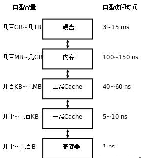

32位的是IA-32架构，也称x86。IA-32e，为x86-64，为64位地址

CPU从逻辑上可以划分成3个模块，分别是控制单元（CU（控制器））、运算单元（ALU（算术逻辑单元））和存储单元(寄存器（PC、IR、PSW、DR、通用寄存器等）），中断系统，外部通过总线与控制总线、数据总线、地址总线进行相连，对数据和程序进行相关的操作。
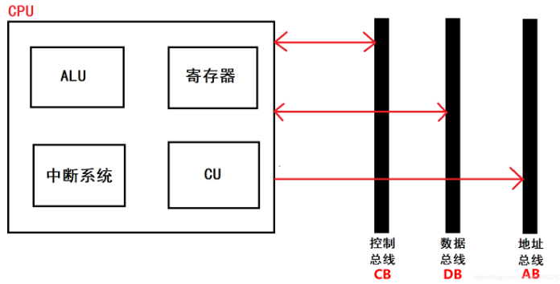

# ALU 算术逻辑单元

# CU（控制器）

## 控制器的功能：

（1）从指令cache中**取一条指令**，并**指出下一条指令**在指令cache中的位置。
（2）对指令进行**译码或测试**，并**产生**相应的**操作控制信号**。例如：一次数据cache的读写操作，一个算术逻辑运算操作，一个输入输出操作。
（3）指挥并**控制CPU**，数据cache和输入输出设备之间**数据流向**的方向。

**程序计数器（PC**）：用来存放**下一条**要执行的**指令的地址**。
**指令寄存器（IR**）：用来存放当前**正在执行的指令**。
**指令译码器（ID**）：对**指令进行“翻译**”，确定指令执行什么操作，以决定操作的性质和方法。
**控制电路**：根据指令译码器的分析，发出控制信号，**完成该指令**的所有操作。

## 分析CPU取指的流程：

CPU的控制器从内存读取一条指令并放入指令寄存器，操作码就是汇编语言里的mov，add，jmp等符号码；操作数地址说明该指令需要的操作数所在的地方，是在内存里还是在程序计数器**PC中**里。

**指令译码**：指令寄存器中的指令经过译码，决定该指令应进行何种操作（就是指令里的操作码）、操作数在哪里（操作数的地址）。

PC先把指令地址**传输到MAR（**存储器地址寄存器），通过MAR把信号**送到地址总线AB**，最后**送到存储器**。
然后由控**制单元CU**向存储器**发出读命令**，读出的数据由存储器通过数据总线**送到MDR**，再由MDR送到==**IR(指令寄存器)**==中。这是程序计数器**PC自动加一**，从而确定了下一条指令的地址。
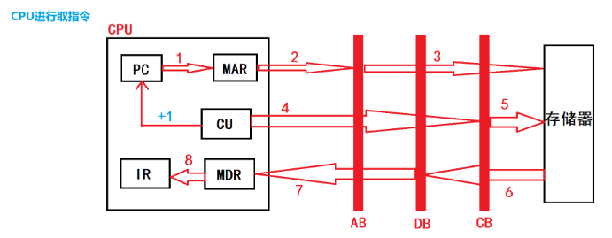

# 运算器（算术逻辑单元ALU）

每一种算术运算，一个相对应的基本硬件配置，其核心部件是加法器和寄存器。

**功能：**

（1）执行所有的算术运算。

（2）执行所有的逻辑运算，并进行逻辑测试。如零值测试或两个数的比较。

# 寄存器

x64时代，参数传递绝大多数都是用寄存器来传了，下面这张图，展示了控制寄存器、描述符寄存器、任务寄存器构成的全貌：
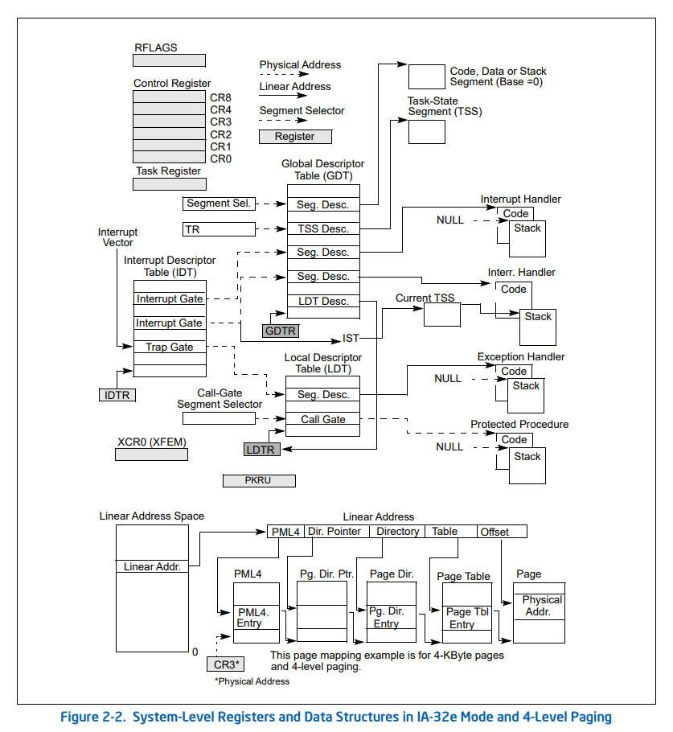

## **通用寄存器**：

存放原始数据和运算结果。当算术逻辑单元ALU执行算数或逻辑运算时，通用寄存器为ALU提供一个**工作区**。

这些寄存器CPU没有特殊的用途，交给应用程序“随意”使用

- eax: 通常用来执行加法，函数调用的返回值一般也放在这里面
- ebx: 数据存取
- ecx: 通常用来作为计数器，比如for循环
- edx: 读写I/O端口时，edx用来存放端口号
- esp: 栈顶指针，指向栈的顶部
- ebp: 栈底指针，指向栈的底部，通常用ebp+偏移量的形式来定位函数存放在栈中的局部变量
- esi: 字符串操作时，用于存放数据源的地址
- edi: 字符串操作时，用于存放目的地址的，和esi两个经常搭配一起使用，执行字符串的复制等操作

对应的64位名：rax rbx rcx rdx rsp rbp rsi rdi    加上**r8-r15**

## 标志寄存器（eflags(32)、rflags(64)）

记录了CPU执行指令过程中的一系列状态，这些标志大都由CPU自动设置和修改：
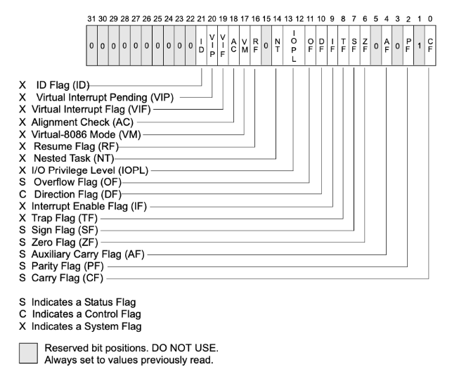

## **指令寄存器（eip(32)、rip(64)）**

指向了下一条要执行的指令所存放的地址

## **段寄存器**

用于CPU的内存寻址

将内存空间划分为不同的区域：分段，CPU通过段基址+段内偏移段方式来寻址。

- **cs**: 代码段Code Segment
- **ds**: 数据段Data Segment
- **ss**: 堆栈段 Stack Segment
- **es**: 扩展段Extra Segment
- **fs**: 数据段   用户态64位
- **gs**: 数据段  内核态

通用寄存器、段寄存器、标志寄存器、指令寄存器，这四组寄存器共同构成了一个基本的指令执行环境（一个线程）

## 控制寄存器（CR0-8）

CPU自身的信息存在这里

32位CPU总共有cr0-cr4共5个控制寄存器，64位增加了cr8
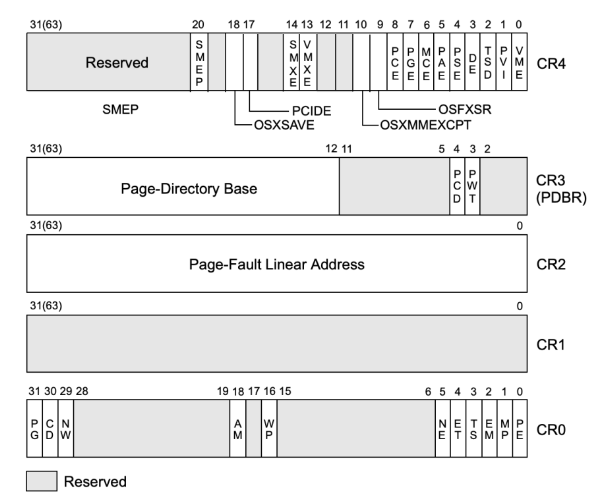

### **cr0**: 存储了CPU控制标记和工作状态

`PG`: 是否启用内存分页

`AM`: 是否启用内存对齐自动检查

`WP`: 是否开启内存写保护，若开启，对只读页面尝试写入时将触发异常，这一机制常常被用来实现**写时复制**功能

`PE`: 是否开启保护模式

### **cr1**: 保留未使用

### **cr2**: 页错误出现时保存导致出错的地址

### **cr3**: 存储了当前进程的虚拟地址空间的重要信息——**页目录**地址

### **cr4**: 也存储了CPU工作相关以及当前任务的一些信息

CR4.SMEP (bit 20 of CR4)决定内核态能否执行用户态的指令

CR4.SMAP(bit 21 of CR4)决定内核态能否读取用户态的数据

CR4.PAE（5bit）允许使用超过32位的地址

CR4.PGE（7bit）启用快表TLB（translation-lookaside buffer）

CR4.PKS（24b） 控制保护键的启用

### **cr5-cr8**: 64位新增扩展使用

## 调试寄存器

对于通常的断点，也就是程序执行到某个位置下就停下来，这种断点实现的方式，在x86/x64上，是利用了一条**软中断**指令：**int 3（汇编指令：interrupt中断）**来进行实现的。

在我们使用调试器下断点时，调试器将会把对应位置的原来的指令替换为一个int 3指令，机器码为0xCC（两个0xCC是汉字【烫】的编码）。

但对于多线程操作全局整数的追踪，需要一种新的断点：**硬件断点**

在x86架构CPU内部，提供了8个调试寄存器DR0~DR7。
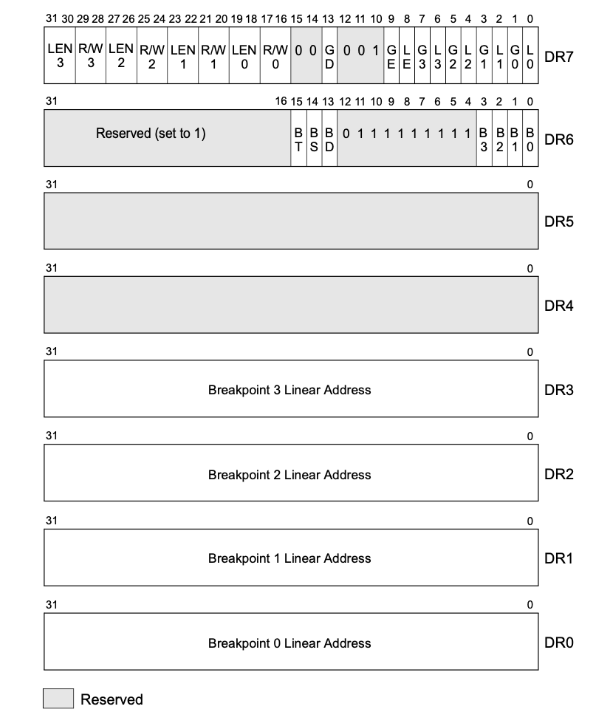

- DR0~DR3：这是四个用于存储地址的寄存器
- DR4~DR5：这两个有点特殊，受前面提到的CR4寄存器中的标志位DE位控制，如果CR4的DE位是1，则DR4、DR5是不可访问的，访问将触发异常。如果CR4的DE位是0，则DR4和DR5将会变成DR6和DR7的别名，相当于做了一个软链接。这样做是为了将DR4、DR5保留，以便将来扩展调试功能时使用。
- DR6：这个寄存器中存储了硬件断点触发后的一些状态信息
- DR7：调试控制寄存器，这里面记录了对DR0-DR3这四个寄存器中存储地址的中断方式(是对地址的读，还是写，还是执行)、数据长度(1/2/4个字节)以及作用范围等信息

## **描述符寄存器**

`gdtr`: 全局描述符表寄存器：前面提到，CPU现在使用的是段+分页结合的内存管理方式，gdtr寄存器指向全局描述符表(**GDT**)的表格中，这个表中的每一项都描述了一个内存段的信息。
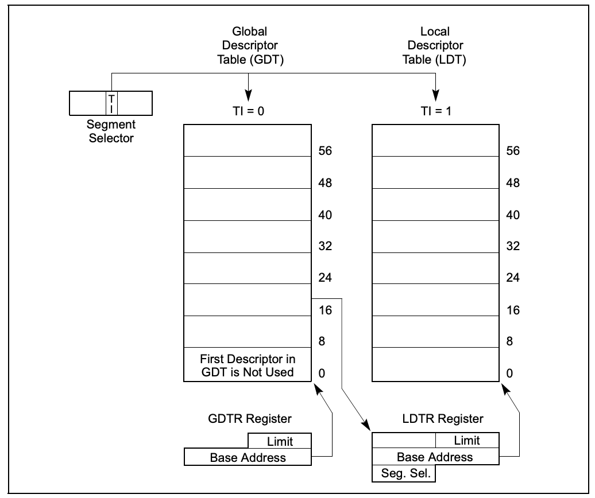

可以通过sgdt指令读取，lgdt写入，均为特权指令

`ldtr`: 局部描述符表寄存器，这个寄存器和上面的gdtr一样，同样指向的是一个段描述符表(**LDT**)。不同的是，GDT是全局唯一，LDT是局部使用的，可以创建多个，随着任务段切换而切换(下文介绍任务寄存器会提到)。
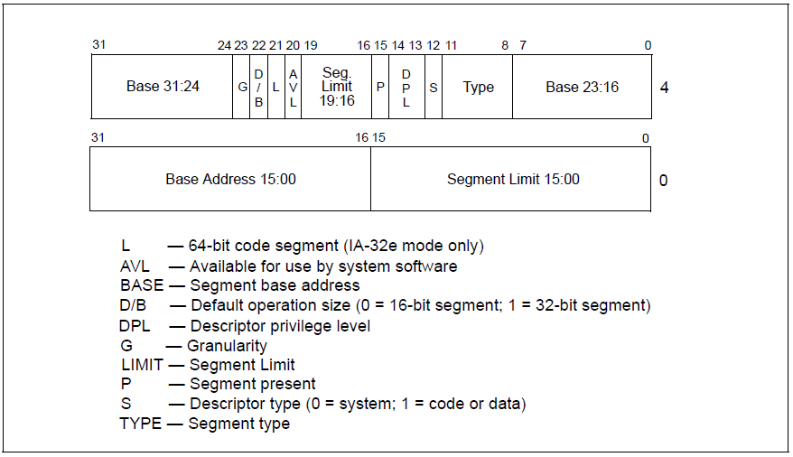

`idtr`: 中断描述符表寄存器，指向了**中断描述符表IDT**，这个表的每一项都是一个中断处理描述符，当CPU执行过程中发生了硬中断、异常、软中断时，将自动从这个表中定位对应的表项，里面记录了发生中断、异常时该去哪里执行处理函数。
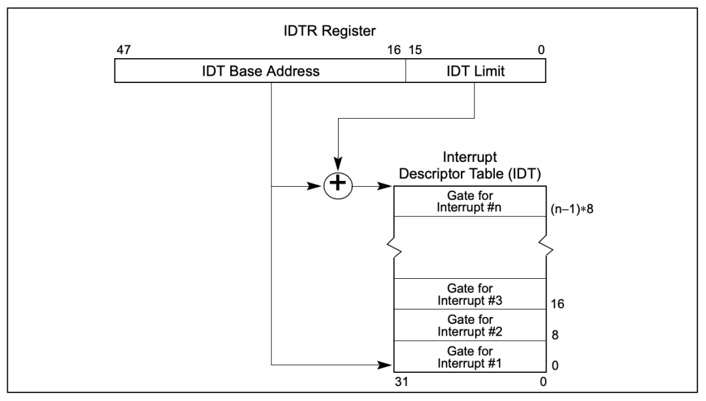

IDT中的表项称为**Gate**，中文意思为**门**，因为这是应用程序进入内核的主要入口

IDT中的表项存在三种类型，对应三种类型的门：任务门、陷阱门、中断门
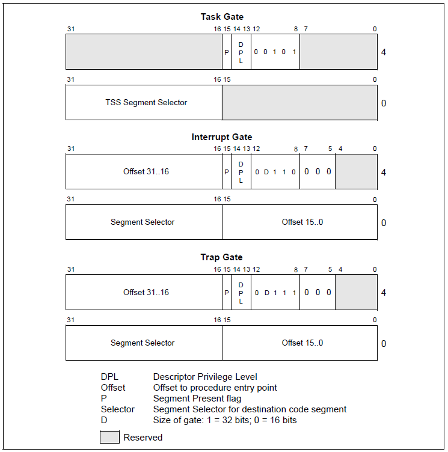

## **任务寄存器TR**
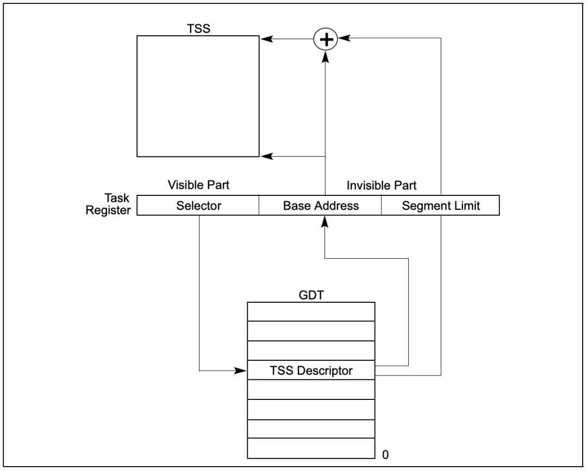

描述任务的数据结构**TSS（32位）：**
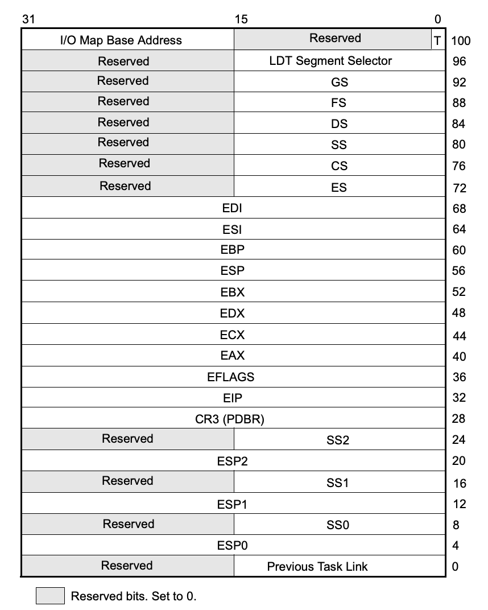

x86CPU的构想是每一个任务对应一个TSS，然后由TR寄存器指向当前的任务，然而包括Linux和Windows在内的主流操作系统都没有使用这个机制来进行线程切换，而是自己使用软件来实现多线程切换。还是存在一些特殊情况，如一些异常处理会使用到TSS来执行处理。

## **模型特定寄存器（MSR寄存器）**

可能随着不同的版本有所变化，主要用来支持一些新的功能。

32：

- IA32_SYSENTER_CS
- IA32_SYSENTER_ESP
- IA32_SYSENTER_EIP

64，这一对指令升级为**syscall/sysret**
这三个MSR寄存器是用来实现**快速系统调用**

在x86_64模式下，段寄存器CS, DS, ES, SS基本上是不用了，FS和GS虽然还在用，但使用传统的mov指令等方式设置FS和GS值，支持的地址空间只能到32位，如果想要支持到64位，必须通过写MSR的形式来完成。