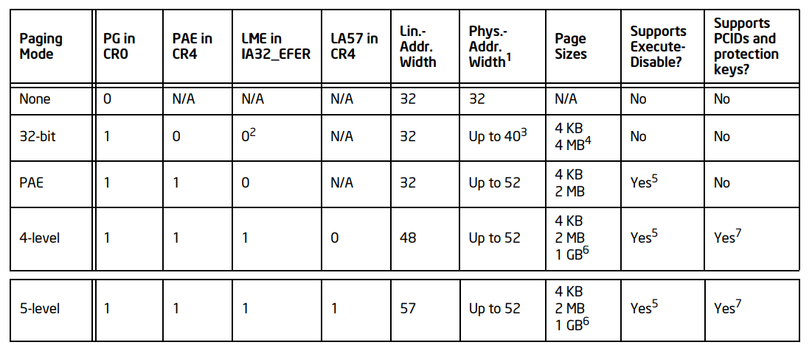
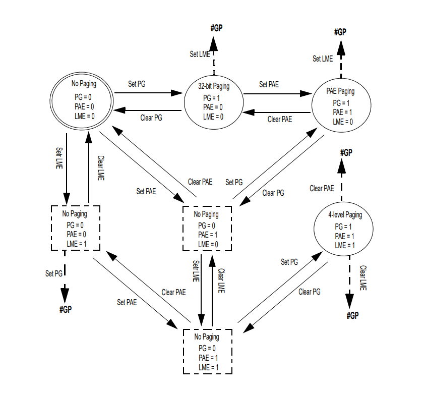
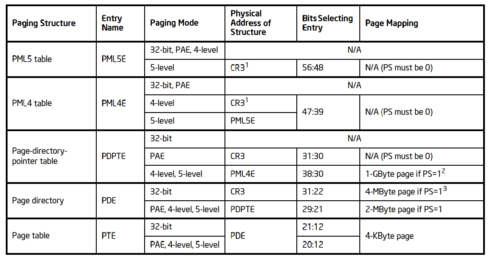
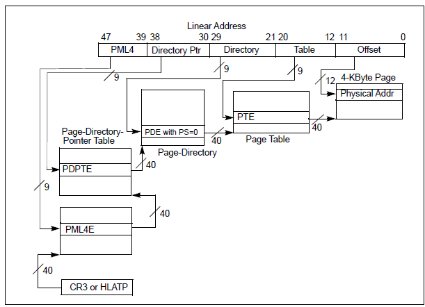
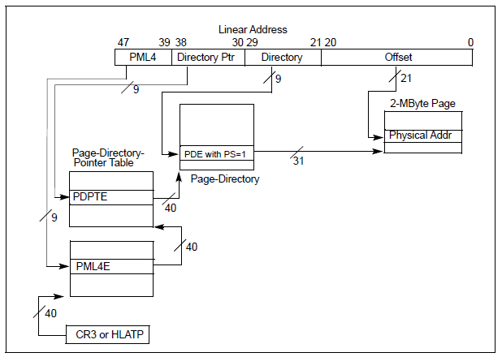
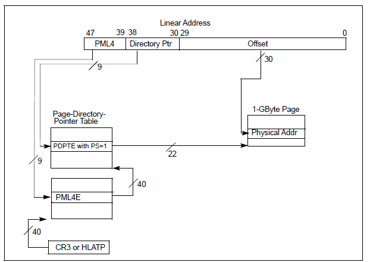
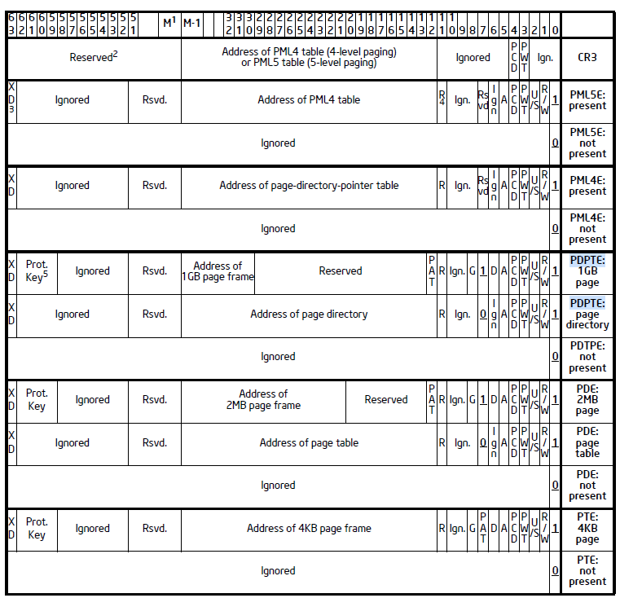

# cpu页表

Owner: -QVQ-

# 页表的控制位

页表的行为被以下控制：

CR0：WP、PG标志位（16、31bit）

CR4：PSE、PAE、PGE、LA57、PCIDE、SMEP、SMAP、PKE、CET、PKS（4、5、7、12、17、20、21、22、23、24bit）

IA32_EFER MSR：LME、NXE（8，11bit）

EFLAGS：AC（18bit）

enable HLAT

软件可以用MOV去设置CR0.PG，只要确保CR3包含了页表结构的物理地址

# 页表模式

CR0.PG = 0，分页不被启用，所有的线性地址都被认为是物理地址

CR0.PG = 1，保护模式启用（CR0.PE = 1），分页启动下面四种中的一种：

1. CR4.PAE = 0，**启用32位的分页**，涉及到CR0.WP,CR4.PSE, CR4.PGE, CR4.SMEP, CR4.SMAP, CR4.CET
2. CR4.PAE = 1 ，IA32_EFER.LME = 0，**PAE分页**启动，涉及到CR0.WP, CR4.PGE, CR4.SMEP, CR4.SMAP, CR4.CET和 IA32_EFER.NXE
3. CR4.PAE = 1, IA32_EFER.LME = 1,  CR4.LA57 = 0，**四级分页**启用，在PAE分页的基础上新增了CR4.PCIDE, CR4.PKE,  CR4.PKS, 
4. CR4.PAE = 1, IA32_EFER.LME = 1,  CR4.LA57 = 1，**五级分页**启动，和四级分页的控制位一样

32位和PAE分页只在隐私保护模式IA32_EFER.LME = 0时，四级五级分页只在隐私保护模式IA32_EFER.LME = 1时

不同分页模式的区别有以下几种：线性地址宽度，物理地址宽度、页表大小、是否支持禁止执行（是否支持阻止软件从原本可读的页面中读取信息）、是否支持PCID（4、5级页表下，可以缓冲多个线性地址）、支持保护键（4、5级页表，每个地址关联一个保护键，软件可以禁用这个保护键）

上诉信息整理成如下表格：

注意：早期的版本用IA-32e paging，等于4级页表

4级五级页表仅在IA-32e模式下，IA-32e有两个子模式：

共存模式：只使用32位线性地址，超出32位的值全部视为0

64位模式：处理器强行规范化：4级页表不使用高16位bit 63:48，5级页表不使用高7位bit 63:57

# 页表模式的切换

如图所示：

GP为通用保护错误

当开启了PG时，如果修改LME将产生GP错误，意味着不能直接从32位分页或PAE分页切换到4级分页，需要先将PG设为0，再将LME设为1，再设置PG为1重启页表.

# 页表模式的修改

CR0.WP：设为0，允许管理模式对只读的地址进行写操作，设为1则不行，用户模式不论这个值都不能对只读的地址写操作

CR4.PSE：设为1，32位页表能用4KB和4MB的页面，设为0只能用4KB的页面

CR4.PGE：设为1，一些转换也许会通过线性地址共享，设为0，不能共享

CR4.PCIDE（4、5级页表）：设为1，允许处理器去缓冲多个线性地址空间

CR4.SMEP：设为1，特权模式下软件软件不能从用户模式获取指令

CR4.SMAP：设为1，特权模式下软件软件不能访问用户模式的数据

CR4.PKE 和 CR4.PKS：描述了基于保护键的进入权限

CR4.CET：启用控制流强制技术，设为1，当前的内存访问为影子堆栈模式，线性地址转换为影子堆栈分页。

- 影子堆栈
    
    对系统进行攻击的时候，为了攻破运行中的某个进程，攻击者最喜欢的目标就是 call stack 了，将 stack 上的返回地址（return address）改写，就可以将系统的控制权重定向到他们精心选择的代码上。影子堆栈是为了解决这个问题而诞生的
    
    随着函数调用栈的深入，任何一个回调地址损坏都会导致程序错误，影子堆栈给堆栈创建一个副本，只保留返回地址这类数据，每个函数被调用，返回地址同时写入常规堆栈和影子堆栈中，当函数返回时，需要两个堆栈进行对比，不匹配发出红色警告。
    
    这样可以提高攻击者的攻击门槛，需要破坏两个内存区域，而其中一个不确定在什么位置，硬件支持可以使影子堆栈更强大。intel等厂商支持，如果一个影子堆栈正确建立起来，后续将返回地址入栈的操作以及在函数返回时进行比较的操作全都是由 CPU 硬件自己完成，同时，影子堆栈通常不能被应用程序写入。
    

IA32_EFER.NXE：设为1，具体的一个线性地址可以阻止指定的指令访问

enable HLAT：不使用CR3来做线性地址的转换，而是用VMCS（virtual-machine control structure）

# 分层分页结构的概况

所有分页模式都用hierarchical paging structures去管理线性地址（4KB），由一系列条目组成，32位为1024*4bytes，64位为512*8bytes，PAE分页为128*32bytes

线性地址高部分记录分页结构条目，这些条目的最后一项去标识线性地址转换到的物理地址基址，即页框，用线性地址的低部分去记录偏移量。

每个分页结构条目包含了物理地址，可以是另一个分页结构的地址，也可以是页框的地址。

对于4级页表，每个分页结构由512=2^9个条目组成，64：48未使用，47：39为一级分页结构条目，38：30为二级，29：21为三级，20：12为四级，11：0为偏移量

对于5级页表，增加了56：48作为一级页表

处理器会优先使用快表TLB代替分页结构条目

## 页表访问

在x86_64架构中，用户地址空间地址范围和内核地址空间地址范围都只用到了低48位，各占128TB，用户空间高16位为0，内核空间高16位都为1，中间的地址并不存在。这是考虑到当前的硬件多少于128TB，没有必要浪费CPU的晶体管去增加引脚以提高地址范围。32位则是高9位。

如图，对于5级页表的地址，先查询56：48位访问CR3找到对应的PML5E，再查询地址的47：39位访问PML5E表找到对应的PML4E，再查询地址的38：30位访问PML4E表找到PDPTE，再查询地址的29：21位访问PDPTE表找到PDE，再查询地址的20:12位访问PDE表找到页表PTE，再根据11：0的偏移量访问具体的物理地址。

在页表遍历的过程中，如果找到对应的物理页框，则可以进行对应的内存读写操作。反之，如果遇到了寻址失败的情况，则说明对应的物理页框没有被分配或者被换出到外存了，此时需要进行相应的页表调度和页表交换操作。

在一些情况下，可能因为配置了分页结构地址转换并没有全部完成，即中间找分页条目时没有找到，那么如果剩下的线性地址超过12位，则会访问当前分页结构条目的第7bit位(PS — 页面大小)，如果为0，这个条目将映射到另一个分页结构，如果为1，这个条目将映射到一个页表

如果剩下的线性地址不超过12位，当前的分页结构条目总是应黑色到一个页面。第7bit将另作他用

# 四级五级分页模式

## 用CR3的四级五级分页

四级和五级分页基本相同，CR3寄存器存放第一级页表的位置，即PML5表或者PML4表，对CR3的使用依赖于CR4.PCIDE值的设置，即CR4.PCIDE值设置为1时启用PCID决定CR3的使用方式，否则不启用。

如果启用CR3，此时64位的寄存器地址分别用于：

2：0  忽略

如果CR4.PCIDE = 0， 

3（PWT） 页面等级

4 页面等级缓冲的取消使用

11：5 忽略，为0

如果CR4.PCIDE = 1， 

11：0 PCID

其他部分

M-1:12 用于线性地址转换的PML4表的物理地址

63：M 保留位，均为0

（M为MAXPHYADDR的缩写，即最大可用的地址长度，是52）

注意，如果软件修改了CR4.PCIDE的值，CR3的值会立刻更新

## 用HLATP的四级五级分页

每个线性地址的转换用HLATP的值，是个虚控制单位，当是4级页表时，就是PML4表，五级页表时，就是PML5表，他和CR3有相同的形式，依然取决于CR4.PCIDE的值。

## 四级五级页表的线性地址转换

四级页表和五级页表可能会映射到4KB、2MB、1GB大小的页面，以四级页表举例，他们的映射到线性地址的关系分别如下，五级页表类似

1. 映射到4KB大小的页面

1. 映射到2MB大小的页面

1. 映射到1GB大小的页面

### PML5E的表项

| 0 (P) | 存在位，必须为1才能引用PML4表 |
| --- | --- |
| 1 (R/W) | 读为0，1为写 |
| 2 (U/S) | 0为用户模式，1为内核模式 |
| 3 (PWT) | 分页的写入 |
| 4 (PCD) | 分页缓冲的启用 |
| 5 (A) | 表面这个条目是否是用户与线性地址转换 |
| 6 | 无 |
| 7 (PS) | 保留位 |
| 10:8 | 无 |
| 11 (R) | 普通页表模式：无
HLAT分页模式：1为重启页表 |
| M–1:12 | PML4表的物理地址 |
| 51:M | 保留，为0 |
| 62:52 | 无 |
| 63 | IA32_EFER.NXE = 1时
这一位为1 则取消执行这个指令，即不被允许这个条目调用其他语句
IA32_EFER.NXE = 0,
这一位保留 |

### 四级五级页表下，线性地址的转换：

1. 得到PML5E的地址：（由以下方式得到这个寄存器的值）
    
    51：12 由CR3或者HLATP得到，即基地址
    
    11：3 由线性地址的56:48位得到，即偏移量
    
    2：0 为0
    
2. 得到PML4E的地址：
    
    51：12 由CR3或者HLATP得到（四级页表），（五级页表由PML4E得到）
    
    11：3 由线性地址的47:39位得到
    
    2：0 为0
    
3. 得到PDPTE的地址：
    
    普通转换：
    
    51：12 由PML4E得到
    
    11：3 由线性地址的38:30得到
    
    2：0 为0
    
    HLAT分页模式中：
    
    PDPTE的第11位是1，则重启页表开启1GB页表的支持，否则继续执行以下步骤
    
4. 得到PDE的地址：
    
    如果PDPTE的第7位（ps位）为1，则映射了一个1GB的页面，则物理地址的计算，
    
    51:30 由PDPTE得到
    
    29:0   由最初的线性地址得到
    
    如果PDPTE的第7位（ps位）为0，则映射了一个4KB的页面，则
    
    51:12  由PDPTE得到
    
    11:3    由线性地址的29：21得到
    
    2:0      为0
    
    在HLAT分页模式下，如果PDE的11位为1，则重启页表模式转为支持2MB的页面
    
5. 得到PTE的地址：
    
    如果PTE的第7为（ps位）为1，则映射了一个2MB的页面，则
    
    51:21 由PDE得到
    
    20:0 由最初的线性地址得到
    
    如果PTE的第7为（ps位）为0，则映射的为4KB的页面，则
    
    51:12 由PDE得到
    
    11:3    由线性地址的20:12得到
    
    2:0      为0
    
    HLAT模式下，PTE的第11位为1，则重启页面模式为支持最大4KB的页表
    
6. 得到物理地址的地址：
    
    51:12 由PTE得到
    
    11:0   由最初的线性地址得到
    
    PTE的62：59位是线性地址的保护键
    

如果一个页表结构项的P位（第0位）为0，或者这项设置了些预留位，则没有线性转换，产生页面错误。

如果一个页表结构项的P位（第0位）为1，则有如下的预留位：

51 ：MAXPHYADDR

PS :  在PML4E和PML5E中才有

PDPTE中的PS为1，29:13为保留位

PDE中的PS位为1，20：13为保留位

IA32_EFER.NXE = 0,XD位 (63位)是保留的

## 总结

五级页表举例，根据线性地址，查询对应的一级页表(PML5E)，页表里存放了512个条目，线性地址中56：48共9位决定访问哪一个条目。每个条目4KB即64位，前12位为权限信息，后面的有效位为下一级页表的物理地址的基地址。通过这个基地址和线性地址的47:39位组成的偏移量访问二级页表（PML4E）的物理地址，以此类推访问到最终的物理地址

其中每一级页表里表项的PS位（第7位）决定了这个页面的大小，为1，则不需要递归往后遍历其他页表，这个表项的基地址加上线性地址后续的地址即偏移量直接得到物理地址。如果是第三级页表PDPTE，则这个页面大小为1GB

# 地址访问权限

CR0, CR4, IA32_EFER MSR，EFLAGS.AC 和进入的模式决定了访问权限的许可

访问线性地址只有特权模式和用户模式两种，取决于**CPL（current privilege level）特权等级**，CPL<3为特权等级，CPL=3为用户等级。

访问线性地址分为显式的和隐式的，对于一些隐式的访问可以无视CPL，包括：访问GDT全局描述表、LDT本地描述表去加载段描述符，发生中断时访问IDT中断描述表，改变任务或者CPL的转换时访问TSS任务状态段。其他CPL<3的访问为显示访问。

页表结构条目控制的线性地址转换描述了线性地址的模式，如果至少有一个**页表结构条目U/S（bit2）标志位**为0，这个地址是特权模式地址，否则是用户模式地址。

当影子堆栈的CET（control-flow enforcement technology）启用时，进入权限还要考虑**影子堆栈权限**。对于普通数据，每个影子堆栈访问只能是用户权限或管理员权限的一种，即管理员权限不能访问用户权限。一般情况，CPL=3影子堆栈访问为用户访问，CPL<3为管理员访问。WRUSS例外，视为用户访问。影子堆栈访问只能访问影子堆栈地址。

注意，处理器会强制使用快表，使用如果软件修改了分页条目的权限，处理器并不一定使用了改变后的分页条目，这涉及到其他内容

## 对于管理员模式的访问

总结：CR0.WP代表了内存写保护，只在写访问时生效，开启时只有写打开的文件才能写，不开启时，不论是不是写打开的文件都能写

CR4.SMAP（数据访问）和CR4.SMEP（指令抓取） 代表内核能否访问用户态，无论读写都有效，没开启均可访问，开启后，拒绝一切隐式访问，相当于限制了内核和用户态一些描述信息的共享。同时对于显示访问用EFLAGS.AC 来标识能不能访问，为1可访问，为0不能访问。

### **数据读写权限**具体操作如下：（下面的地址可读表示这个地址存在的意思）

- 对于**管理员模式**的页面（有保护键）**读**，只要地址可读，均可访问
- 对于**用户模式**的页面，**读**权限依赖于CR4.SMAP
    
    CR4.SMAP = 0时，对于有可读保护键的地址，则可以访问
    
    CR4.SMAP = 1时，无论是隐式还是显示访问，访问权限依赖于EFLAGS.AC
    
    EFLAGS.AC = 1且访问是显式的，对于有可读保护键的地址，则可以访问
    
    EFLAGS.AC = 0或者访问是隐式的，不能读
    
- 对于**管理员模式**的地址，数据的**写入**权限依赖于CR0.WP
    
    CR0.WP = 0时，对于有可写保护键的地址，则可以访问
    
    CR0.WP = 1时，对于可写保护键的地址，其所有级的页表表项读写标识为写（第1位为1），且地址允许写时，则可以访问。当控制地址转换的页表表项中有一个读写位为0则不能访问
    
- 对于**用户模式**的地址，数据的**写入**权限依赖于CR0.WP
    
    CR0.WP = 0
    
    CR4.SMAP = 0，对于有可写保护键的地址，则可以访问
    
    CR4.SMAP = 1, 
    
    EFLAGS.AC = 1且访问是显式的，对于有可写保护键的地址，则可以访问
    
    EFLAGS.AC = 0或者访问是隐式的，不能写
    
    CR0.WP = 1
    
    CR4.SMAP = 0， 对于可写保护键的地址，其所有级的页表表项读写标识为写（第1位为1），则可以访问。控制地址转换的页表表项中有一个读写位为0则不能访问
    
    CR4.SMAP = 1,
    
    EFLAGS.AC = 1且访问是显式的，对于可写保护键的地址所有级的页表表项读写标识为写（第1位为1），则可以访问。控制地址转换的页表表项中有一个读写位为0则不能访问
    
    EFLAGS.AC = 0或者访问是隐式的，不能写
    

### 指令抓取权限具体操作：

- 从管理员模式地址抓取
    
    32位的分页模式 或者 IA32_EFER.NXE = 0则能抓取
    
    其他分页模式且IA32_EFER.NXE = 1，地址转换中每一个分页结构项的XD位（63位）为0时可以抓取指令。有一个为 1则不能抓取
    
- 从用户模式地址抓取：
    
    CR4.SMEP = 0，
    
    32位的分页模式 或者 IA32_EFER.NXE = 0则能抓取
    
    其他分页模式且IA32_EFER.NXE = 1，地址转换中每一个分页结构项的XD位（63位）为0时可以抓取指令。有一个为 1则不能抓取
    
    CR4.SMEP = 1，不能执行
    

## 对于用户模式的访问

- 读
    
    对于用户模式的有可读保护键的地址，则可以访问
    
    管理员模式的地址均不可访问
    
- 写
    
    对于用户模式，有可写保护键的地址，其所有级的页表表项读写标识为写（第1位为1），则可以访问。控制地址转换的页表表项中有一个读写位为0则不能访问
    
    管理员模式的地址不可访问
    
- 指令抓取
    
    用户模式的指令，
    
    32位的分页模式 或者 IA32_EFER.NXE = 0则能抓取
    
    其他分页模式且IA32_EFER.NXE = 1，地址转换中每一个分页结构项的XD位（63位）为0时可以抓取指令。有一个为 1则不能抓取
    
    不能抓取管理员模式的指令
    

# 保护键

只有四级五级页表才有保护键。每个分页结构表项的62：59位为保护键，

CR4.PKE = 1，PKRU寄存器决定每个保护键用户模式的地址是读还是写

CR4.PKS=1，IA32_PKRS MSR决定每个保护键管理员模式的地址是读还是写

PKRU是32位寄存器，对每一个i（0 ≤ i ≤ 15），PKRU[2i]是第i个保护键的**禁止访问位**，又叫**ADi**，PKRU[2i+1]是第i个保护键的**禁止写入位**，又叫**WDi**。IA32_PKRS MSR类似，多余的位为0

软件能用RDPKRU和WRPKRU指令去读写PKRU。PKRU被XSAVE管理，能被XSAVE指令集读写。

## 线性地址的保护键访问地址

总结：当CR4.PKE=0时，保护键不起作用。CR4.PKE=1时，保护键对于数据的读具有一票否定权。对于写，当内存写保护关闭时不起作用，打开时，对于数据的写依然有一票否定权

- 保护键只能控制数据访问，不能控制指令抓取
- CR4.PKE=0时，用户模式地址的保护键不能控制对该地址的访问
- CR4.PKE=1时，用户模式地址的保护键i的使用由PKRU寄存器决定
    - **ADi = 1，都不可访问**
    - **WDi = 1**
        - 用户模式的写请求被拒绝
        - CR0.WP = 1时，管理员模式的写请求拒绝，
        - CR0.WP = 0时，WDi不起作用
- CR4.PKS = 0时，管理员模式地址的保护键不起作用
- CR4.PKS = 1时，管理员模式地址的保护键i的使用由IA32_PKRS MSR寄存器决定
    - **ADi = 1，都不可访问**
    - **WDi = 1**
        - CR0.WP = 1时，管理员模式的写请求拒绝
        - CR0.WP = 0时，WDi不起作用