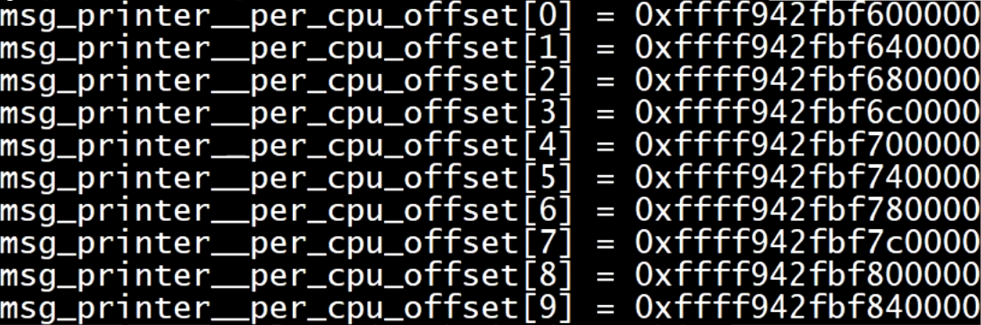

# per cpu

Owner: -QVQ-

> SMP（Symmetric Multi-Processing） 系统：指多处理器系统中，所有处理器具有完全对称的地位，都可以访问共享的物理内存，I/O 子系统并行工作，这些处理器通过高速系统总线相互连接。
> 

per-cpu 变量的引入有效的解决了SMP系统中处理器对锁的竞争，每个cpu只需访问自己的本地变量。各个 CPU 访问共享的全局变量时需要进行锁竞争，而 per-cpu 变量则不需要。可以有效地提高多处理器系统的性能和并行能力。

注意：单CPU的计算机中使用的per-cpu变量就是通过上述宏定义的放在全局数据区的per-cpu变量

# 意义

一是**提高并发性**，每个cpu有自己的 空间做运算。如果用多线程对同一全局变量操作需要互斥锁会影响性能。但用per_cpu每个cpu计算自己的部分在最后统一加起来得到总值从而提高并发性。

对percpu变量的使用，涉及到同一CPU不同进程访问的问题：

假设有两个进程在CPU上执行，都进入内核，写入percpu变量，两个执行体同时对一个变量进行写。

为了避免这种情况，使用percpu需要，禁止抢占，以防止其他 CPU 切换到本地 CPU 上，打破了本地数据的一致性。

另一个好处是**减少cache冲突**。如果在多线程下，有多少个线程就分配多大的数组，每个线程对自己的数组部分计算，虽然线程间不需要上锁了，但是数组的每个空间都在一个缓存行(cache line)里面，各个线程都要访问一个cache line影响性能。per_cpu每个线程有自己的存储空间，减小了cache冲突的概率

线程用的是fs段，__thread关键字，被其声明的变量将在每个线程中都有一份（线程局部存储TLS）

percpu用的是gs段，percpu变量也是，将在每个cpu中都有一份，不同cpu之间不同值

# percpu的内存位置

cpu里的gs寄存器存放在内存的cpu内存空间的首地址，即`__per_cpu_offset[0]`，这个数组的大小为Linux里最大线程数，但实际上cpu的个数没有这么多，物理上有多少CPU，这个实际使用的数组个数就是多少

我的虚拟机是2核的，for_each_online_cpu(i)输出i就只能得到0，1


打印出来，可以看到每个元素大小8kb，即percpu变量的最大值


这里的数组下标就是线程的编号，用如下方式打印出来的就是多核cpu下每个cpu在`__per_cpu_offset`里的首地址

```c
int i;
for_each_online_cpu(i){
DEBUG_PRINT(DEVICE_NAME CPU "%d per cpu base %lx\n",i,_per_cpu_offset[i])
}
```

# percpu变量的API

## 定义：

- `static DEFINE_PER_CPU(type, name) = 0;`//type是变量类型，name是变量名称
    
    定义一个per cpu变量
    
    相比与DECLARE_PER_CPU，DEFINE_PER_CPU只是去掉了变量前面的extern
    
- `DECLARE_PER_CPU(type, name);`//type是变量类型，name是变量名称
    
    声明一个per cpu变量，宏定义，这个宏定义将在编译时生成一个指向变量的指针数组，数组的长度为 `NR_CPUS`，等于系统中 CPU 的数量。


## 访问：

> 注意：per_cpu变量的地址打印出来能发现实际上是偏移量，但用（*per_cpu变量）访问地址的时候，汇编代码中进行了转换，实际访问的地址是当前cpu的基地址+（*变量名）的偏移量
> 
- this_cpu_ptr(ptr)
    
    宏功能：返回指向per-cpu变量ptr的指针，这个指针指向的类型和自己定义的percpu类型一致
    
    返回值：是当前CPU的per-cpu变量的指针
    
    `ptr`：是一个per-cpu 变量
    
    头文件： `#include <linux/percpu.h>`。
    
    数组的长度必须是`NR_CPUS`，等于系统中CPU的数量。
    
    - 源码
        
        实现细节：ptr是per_cpu变量，这个宏展开后，实际上就是ptr的偏移量+当前cpu的基地址，得到当前cpu的per cpu实际地址
        
        ```
        #define this_cpu_ptr(ptr)	\\
        	((__typeof__(*(ptr)) __percpu *)(__percpu_offset[raw_smp_processor_id()] + (unsigned long)(ptr)))
        
        ```
        

`unsigned long __per_cpu_offset[NR_CPUS]`获取每个CPU的per cpu区域的基地址

定义在arch/x86/kernel/setup_percpu.c

访问每个cpu的内存的基地址

- [**`per_cpu_offset**](https://elixir.bootlin.com/linux/v5.6/C/ident/per_cpu_offset)(int cpu)`
    
    等同于`__per_cpu_offset[cpu]`
    

获取指向`ptr`指向的per-cpu变量在`cpu`号CPU上的指针：

- `per_cpu_ptr(ptr, cpu)`  宏定义
    
    用于获取指向`ptr`指向的per-cpu变量在`cpu`号CPU上的指针。
    
    返回值：指向per-cpu变量在`cpu`号CPU上的指针。
    
    等同于：`(unsigned *)((unsigned long)(&per) + __per_cpu_offset[cpu]`
    
    `ptr`：是一个指针，它指向per-cpu变量的第一个元素
    
    `cpu`：是一个整数，表示CPU编号。
    
    头文件：`#include <linux/percpu.h>`。
    
    实现细节：这个宏展开后，实际上就是ptr的地址+cpu的偏移量得到指定cpu的per cpu地址返回
    
    ```c
    #define per_cpu_ptr(ptr, cpu)	\\\\
    	((__typeof__(*(ptr)) __percpu *)(__percpu_offset[cpu] + (unsigned long)(ptr)))
    
    ```
    

下面两个需要配对使用

- get_cpu_var(var)
    
    功能：无抢占的返回per-cpu变量ptr在当前cpu的值
    
    返回值：与var为同一类型
    
    实现：关中断，访问变量，封装了this_cpu_ptr（ptr）
    
- put_cpu_var(var)
    
    访问结束后使用
    
    实现：开中断，访问变量
    
- `__raw_get_cpu_var(var)`
    
    是一个直接的宏，它在不禁止抢占的情况下返回当前cpu的percpu变量的值。
    
- 宏for_each_online_cpu
    
    遍历所有在线的CPU
    
    `int i;`
    
    `for_each_online_cpu(i){……}`
    
    头文件：`#include <linux/cpumask.h>`
    
    //如下能打印出每个CPU
    
    ```c
    int i;
    for_each_online_cpu(i){
    DEBUG_PRINT(DEVICE_NAME CPU "%d per cpu base %lx\n",i,_per_cpu_offset[i])
    }
    ```
    

获取当前CPU编号

`int get_cpu()`是Linux内核中的一个函数，它用于获取当前CPU的编号。这个函数会禁止本地中断，

使用完毕后，应该调用`put_cpu()`函数来恢复中断。这个函数通常用于在访问per-cpu变量时确定当前CPU的编号。

# 例子

在每个cpu中统计进入该函数的次数：

```c
DEFINE_PER_CPU(unsigned , count_call) = 0;

  unsigned *pUsage = NULL;
	preempt_disable();
    pUsage = this_cpu_ptr( (unsigned*) (&count_call) );
    (*pUsage)++;//次数加1
  preempt_enable();
```

汇总每个cpu得到总的进入次数

```c
DECLARE_PER_CPU(unsigned , count_call);//如果和上面的代码不是一个文件就需要加声明，表示这个表量在其他文件定义

unsigned *pUsage = NULL;//指向每个cpu内存里percpu变量
	unsigned nCount = 0;//统计调用次数
	int cpu;//记录cpu的值
	
	for_each_online_cpu(cpu){
    	//下面这行等同于pUsage = per_cpu_ptr(&count_call, cpu);
		pUsage = (unsigned *)((unsigned long)(&count_call) + __per_cpu_offset[cpu]);
		//即变量的偏移量+当前cpu内存地址的基质
		nCount += *pUsage;
	}
	DEBUG_PRINT(DEVICE_NAME "all function call num: %u\n", nCount);
```

- 报错：error: function declaration isn’t a prototype [-Werror=strict-prototypes]
    
    void count_calls()应该写成
    
    void count_calls(void)