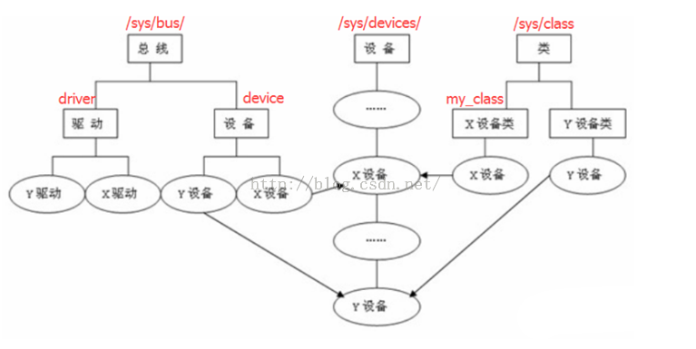
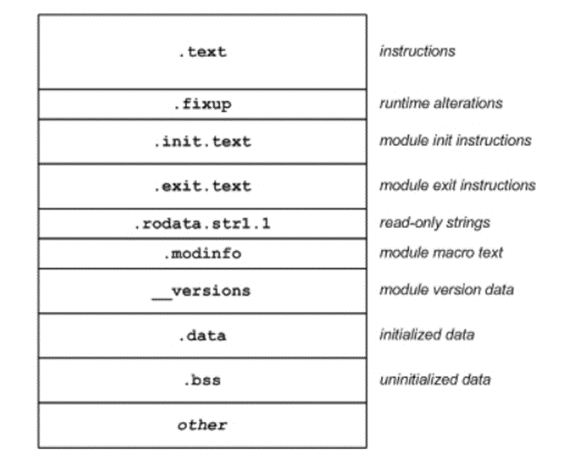
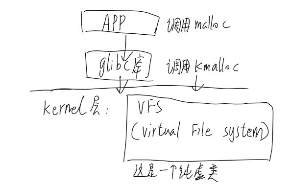
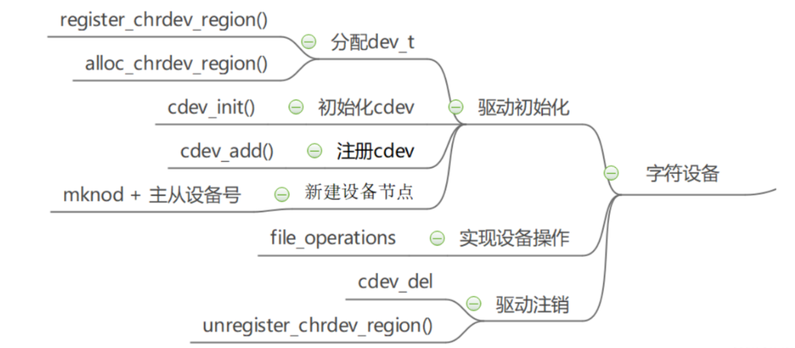
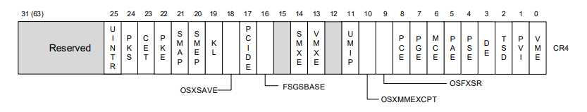

# 内核驱动模型、内核模块LKM：

Owner: -QVQ-

内核开发没有libc库，标准头文件，所以不能用c语言封装的函数例如printf（用kprintf）等等（在驱动不用c库是为了速度和大小），应使用GNU C。

- 需要关注的特性：
    1. inline.C99标准引入
    2. 内联汇编：asm volatile(…)
    3. 分支声明：if产生的分支时，告诉CPU哪个分支是大概率出现的，以帮助CPU作优化
    likely、unlikely
    
    ```c
    void func1(int i){
    		if(likely(i > 8)){//标注这个分支大概率出现
    			i=1;
    			printk("%d",i);
    		}else{
    			i=2;
    			printk("%d",i);
    		}
    }
    void func2(int i){
    		if(unlikely(i > 8)){//告诉CPU这个分支大概率不会执行
    			i=10;
    			printk("%d",i);
    		}else{
    			i=2;
    			printk("%d",i);
    		}
    }
    ```
    
    - 对其编译后得到的汇编语言
      
        ```c
        Dump of
        assembler code for function func1:
        0x00000000000001c0 <+0>: callq 0x1c5 <func1+5> 
        0x00000000000001c5 <+5>: push %rbp 
        0x00000000000001c6 <+6>: cmp $0x8,%edi //比较i与8
        0x00000000000001c9 <+9>: mov %rsp,%rbp
        0x00000000000001cc <+12> jle 0x1e1<func1+33> //小于等于时跳转到0x1e1
        0x00000000000001ce <+14> mov $Oxa,%esi
        0x00000000000001d3 <+19>: mov $Ox0,%rdi
        0x00000000000001da <+26>: callq 0x1df <func1+31>
        0x00000000000001df <+31>: pop %rbp
        0x00000000000001e0 <+32>: retq 
        0x00000000000001e1 <+33>: mov $Ox2,%esi//跳到这里
        0x00000000000001e6 <+38>: mov $0x0,%rdi
        0x00000000000001ed <+45>: callq 0x1f2<func1+50> 
        0x00000000000001f2 <+50>: pop %rbp
        0x00000000000001f3 <+51>: retq 
        End of assembler dump.
        (gdb)disass func2
        Dump of assembler code for function func2:
        0x0000000000000200 <+0>: callq 0x205<func2+5>
        0x0000000000000205 <+5>: push %rbp
        0x0000000000000206 <+6>: cmp $Ox8,%edi//比较i与8
        0x0000000000000209 <+9>: mov %rsp,%rbp
        0x000000000000020c <+12>: jg 0x221<func2+33>//大于等于时跳转到0x221
        0x000000000000020e <+14>: mov $Ox2,%esi
        0x0000000000000213 <+19>: mov $Ox0,%rdi
        0x000000000000021a <+26>: callq 0x21f<func2+31>
        0x000000000000021f <+31>: pop %rbp
        0x0000000000000220 <+32>: retq 
        0x0000000000000221 <+33>: mov $Oxa,%esi//跳到这里
        0x0000000000000226 <+38>: mov $Ox0,%rdi
        0x000000000000022d <+45>: callq  0x232<func2+50>
        0x0000000000000232 <+50> pop %rbp
        0x0000000000000233 <+51>: retq
        ```
        
        在编译结果中两者均为小概率时发生跳转。（CPU在执行时需要提前作环境的部署，如果发生跳转需要重新部署环境，从而降低性能）这里均为向高地址跳转，x86结构的CPU预测大概率不会发生跳转，因此将大概率发生的代码放到跳转指令后，小概率发生的代码放到跳转目标后。从而达到对编译器作提示从而优化
        
        CPU在对循环语句编译时会预测向低地址发生跳转
        
        注意新的电脑在使用分支预测时在生成的汇编代码中常常不会生效，原因未知
        
    1. 没有内存保护机制
    2. 不用轻易用浮点数
       
        用户态使用浮点操作，内核会完成从整数模式到浮点数操作的转换（通过捕获陷阱），内核开发需要人工保存恢复浮点寄存器
        
    3. 函数调用栈很小（默认情况下，64位时，栈大小为8KB）
       
        因此不要使用**局部数组**、不要使用**递归调用**
    
- VFS
  
    Linux sysfs 是一个**虚拟的文件系统**（VFS）,（路径/sys下为设备驱动模型中各个组件的层次关系），它把连接在系统上的设备和总线组织成为一个分级的文件，可以由用户空间存取，向用户空间导出内核数据结构以及它们的属性。
    
    /lib/modules/$(shell uname -r)目录下存放了各种编译号的内核模块、符合信息等
    
    其中：
    
    **kernel目录**包含各个内核模块
    
    **build**往往是一个符号链接，指向的目录包含了内核头文件，用于编译内核模块的各个makefile，其中build/makefile里是编译顶层的makefile文件，包含了KERNELRELEASE的定义
    
    当在Linux系统中创建一个文件时就会在文件系统中创建一个inode结构体与之对应，inode结构体代表一个文件在文件系统中的存在，包含文件的元数据（例如文件权限，所有者等），以及数据块的指针。多次打开同一文件不会产生多个inode，所有打开的文件都close时，inode在内存中被释放。
    
    file结构体代表一个打开的文件，包含了对应inode结构体的指针，以及其他一些用于文件操作的信息。
    
    一个文件在文件系统中只对应一个inode结构体，但可以有多个打开的文件，每个打开的文件对应一个file结构体，它们通过inode结构体建立联系。
    
- **分类：**（数据结构定义详见 linux/device.h）

    
    1. **设备(device)**（字符设备驱动、块设备驱动和网络设备驱动）
       struct device描述设备
       
        /proc/devices 文件里记录了所有的设备，第一列是主设备号，第二列是设备名
       
    2. **总线(bus) ：**struct bus_type描述总线
       
        cpu总线式管理驱动，（首先创建一些总线，如USB总线，pci总线，然后操作系统管理好总线就可以，由总线来管理驱动。）
        
        总线还分两个分支，驱动和设备，设备之间、驱动之间由链表连起来，那么所有的设备来注册，比如插了一个热插拔usb设备，系统就将设备添加到usb总线设备里面去，然后到驱动的链表下面去找，安装相应的驱动。
        
        **platform总线的注册**
        
        [Linux设备驱动模型简述（源码剖析）](https://www.bbsmax.com/A/RnJWaZrEdq/)
        
    3. **类(class)：**struct class 和 struct class_device
       
        意义在于作为同属于一个class的多个设备的容器。
        
        类（目的就是为了对各种设备进行分类管理）和bus多重管理设备，不同的思路和管理方法。比如摄像头和U盘在bus角度看都是USB设备，但是在class角度看一个是大容量存储设备，一个是摄像头。
        
        class在分类的同时还对每个类贴上了一些“标签”，这也是设备驱动模型为我们写驱动提供的基础设施。
        sys/devices才是真正的设备，从class或bus进去，最终都会指向devices目录下。
        
    4. **驱动(driver)：**struct device_driver描述驱动
    
    设备和对应的驱动必须依附于同一种总线，因此 device_driver和 device结构中都包含 struct bus_type指针。
    
- 内核模块特性
  
    装入的内核模块和其他内核部分一样，具有相同的访问权限，因此，差的内核模块会导致系统崩溃
    
    为了使内核模块访问所有内核资源，内核必须维护符号表，并在装入和卸载模块时修改这些符号表
    
    有些模块要求利用其他模块的功能，因此，内核要维护模块之间的依赖性
    
    内核必须能够在卸载模块时通知模块，并且要释放分配给模块的内存和中断等资源
    
    内核版本和模块版本的不兼容，也可能导致系统崩溃，因此，严格的版本检查是必需的
    
    | 
      功能项
       | 
      OS
       | 
      Kernel
       |
    | --- | --- | --- |
    | 
      关系
       | 
      OS必然包含kernel方能运行
       | 
      Kernel可以成为OS一部分，没有OS时，Kernel能独立运行
       |
    | 
      目标
       | 
      服务与应用程序
       | 
      服务于上层程序
       |
    | 
      功能
       | 
      为应用程序提供良好的运行机制及环境，同时提供各种统一的资源接口
       | 
      以CPU资源为核心，进行各种任务调度和通讯机制，并且协同各种模块一道服务于上层（OS）
       |
    
    LKM 是一个特殊的可执行可链接格式（Executable and Linkable Format，ELF）对象文件。（通常，必须链接对象文件才能在可执行文件中解析它们的符号和结果）。由于必须将 LKM 加载到内核后 LKM 才能解析符号，所以 LKM 仍然是一个 ELF 对象。
    
    例如，如果在 LKM 上使用 objdump 实用工具，会发现一些熟悉的区段（section），比如 .text（说明）、.data（已初始化数据）和 .bss（块开始符号或未初始化数据）。
    
    具有ELF区段的LKM的示例

    
- 内核模块的生命周期
  
    用户空间中，insmod(插入模块)启动模块加载过程。insmod 命令定义需要加载的模块，并调用 init_module 用户空间系统调用，开始加载过程。init_module 函数通过系统调用层，进入内核到达内核函数 sys_init_module。这是加载模块的主要函数。
    
    rmmod 命令会使 delete_module 执行 system call 调用，
    
    delete_module 最终会进入内核，并调用 sys_delete_module 将模块从内核删除。
    
    在模块的加载和卸载期间，模块子系统维护了一组简单的状态变量，用于表示模块的操作。加载模块时，状态为 MODULE_STATE_COMING。如果模块已经加载并且可用，状态为 MODULE_STATE_LIVE。此外，卸载模块时，状态为 MODULE_STATE_GOING
    
    Linux可以随意动态的加载与写在操作系统部件，我们可以在系统启动后任何时候把驱动模块动态挂载到内核中，而我们不再需要某个模块时又可以将它从内核模块卸载和删除，这就是动态模块加载。
    

**驱动的执行方式**：

驱动程序现在VFS中注册，注册是指将函数的地址告诉他。如何应用程序触发这些函数的执行

VFS是一个纯虚类，相当于所有驱动的基类，定义了所有驱动设备接口的规范。

在用户层有一个write函数，那么内核层也就要有一个write函数


**字符类设备的代码实现：**

一个设备号由主设备号和次设备号构成。用 dev_t 类型（ 32位无符号整数）的变量进行标识，高12位表示主设备号，低20位表示次设备号。

**主设备号**对应设备**驱动程序**，同一类设备一般使用相同的主设备号。

**次设备号**描述该驱动的**设备**的序号，由驱动程序使用，序号一般从 0 开始。

- 关于设备号，内核提供了几个宏定义和函数
  
    <include/linux/kdev_t.h>
    
    **MAJOR**（dev） 从设备号 dev 中提取主设备号。
    
    **MINOR**（dev） 用来从设备号 dev 中提取次设备号。
    
    **MKDEV** （ma,mi）将主设备号 ma 和 次设备号 mi 组合成 dev_t 类型的设备号
    
    <include/linux/fs.h>
    
    /* 获取次设备号 */
    static inline unsigned **iminor**(const struct inode *inode)
    
    /* 获取主设备号 */
    static inline unsigned **imajor**(const struct inode *inode)
    
- 注册字符设备号
  
    方法一：
    
    register_chrdev函数能实现快速注册
    
    方法二：

    
    首先分配设备号，下面两个分别为静态分配（需要指定设备号）和动态分配（系统自动分配设备号），
    
    - int **register_chrdev_region**(dev_t from, unsigned count, const char *name)
      
        注册一系列连续的字符设备号，主设备号需要函数调用者指定
        
        from 为设备编号，包含主设备号和次设备号
        
        count 用于指定连续设备号的个数，即当前驱动程序所管理的同类设备的个数。
        
        name 为设备或驱动的名字
        
        成功返回0，失败返回错误码
        
    - int **alloc_chrdev_region**(dev_t *dev, unsigned baseminor, unsigned count, const char *name)
      
        注册一系列连续的字符设备号，主设备号是由内核动态分配得到
        
        dev 为函数的输出值，记录动态分配的设备号，如果申请多个设备号，则此参数记录这些连续设备号的起始值
        
        baseminor 指定首个次设备号
        
        count 用于指定连续设备号的个数
        
        name 为设备或驱动的名字。
        
        成功返回0，失败返回错误码
        
    
    初始化，将文件操作加载到设备中
    
    - void **cdev_init**(struct cdev *cdev, struct file_operations *fops)
      
        将文件操作加载到设备
        
        cdev：设备的结构体指针
        
        fops：文件操作的结构体指针
        
    - int **cdev_add**(struct cdev *dev, dev_t num, unsigned int count);
      
        将设备挂载到系统中
        
        - dev是cdev结构的指针，也就是驱动文件。
        - num是这个设备相应的第一个设备号。
        - count是应当关联到设备的设备号的数目。
    
    卸载
    
    - void **unregister_chrdev_region**(dev_t from, unsigned count)
      
        释放主次设备号
        
        - from：要释放的设备号。
        - count：表示从 from 开始，要释放的设备号数量。
    
    注意：如果我们是用的struct cdev slCharDevice，那么直接使用cdev_init即可，如果是struct cdev* slCharDevice，那么需要slCharDevice= cdev_alloc()完成内存申请，然后再用cdev_init
    
    这里的cdev结构体实际上就是一个device
    
- 创建设备类型、注册设备节点
  
    1.手动创建
    
    `mknod /dev/chardev c 10 0`
    
    在/dev路径下创建一个名字为chardev的字符设备节点，主设备号为10，次设备号为0。
    
    当我们使用上述命令，创建了一个字符设备文件时，实际上就是创建了一个设备节点 inode 结构体，并且将该设备的设备编号记录在成员 i_rdev，将成员 f_op 指针指向了 def_chr_fops 结构体（并不是自己构造的 file_operation，而是字符设备通用的 def_chr_fops）。这就是 mknod （用户空间的glibc库）负责的工作内容。
    
    2.自动创建
    
    创建设备类型
    
    - **class_create**()
      
        `#define class_create(owner, name) \
        ({ \
           static struct lock_class_key __key; \
           __class_create(owner, name, &__key); \
        })`
        
        宏定义，*创建设备类型*
        
    
    注册设备节点
    
    - struct device ***device_create**(struct class *class, struct device *parent, dev_t devt, void *drvdata, const char *fmt, ...)
        - class：该设备依附的类。
        - parent：父设备。
        - devt：设备号(主次设备号)。
        - drvdata：私有数据。
        - fmt：设备名。
        
        例如：
        
        `device_create(chrdev_class, NULL, MKDEV(dev_major, 0), NULL, DEV_NAME); */*/dev/chrdev 注册这个设备节点*/*`
        
    
    注销设备类型
    
    void **class_destroy**(struct class *cls)
    
    注销设备节点
    
    **device_destroy**()
    
- 创建字符类设备
- 分文件编写时的注意
    - DriverMain.h
      
        我们可以用一个SLDriverParameters结构体来管理设备号，驱动文件，设备类
        
        ```cpp
        #ifndef DriverMain_H
        #define DriverMain_H
        #define DEVICE_NAME "msg_printer"
        
        struct SLDriverParameters
        {
        	struct class *pslDriverClass;//设备类
        	dev_t uiDeviceNumber;//设备号
        	struct cdev slCharDevice;//驱动文件
        };
        
        extern struct SLDriverParameters gslDriverParameters;
        
        #endi
        ```
        
    - DriverMain.c
      
        ```c
        struct SLDriverParameters gslDriverParameters = {0};
        
        struct file_operations gslNvmDriverFileOperations ={
        }
        int InitalizeCharDevice(void)
        void UninitialCharDevice(void)
        
        static int DriverInitialize(void)
        static void DriverUninitialize(void)
        module_init(DriverInitialize);
        module_exit(DriverUninitialize);
        ```
        
    
    DriverFileOperations.c和DriverFileOperations.h实现file_operations内需要挂载的函数具体实现
    
- 例子
  
    ```c
    //DriverMain.h
    #ifndef DriverMain_H
    #define DriverMain_H
    
    #include <linux/init.h>
    #include <linux/module.h>
    #include <asm/mtrr.h>
    #include <linux/device.h>
    #include <linux/mm.h>
    #include <linux/cdev.h>
    #include <linux/slab.h>
    
    #define DEVICE_NAME "msg_printer"
    //建立一个结构体对该驱动的资源管理
    struct SLDriverParameters
    {
    	struct class *pslDriverClass;//设备类
    	dev_t uiDeviceNumber;//下面这个设备对应的设备号
    	struct cdev slCharDevice;//设备的驱动程序
    };
    
    extern struct SLDriverParameters gslDriverParameters;
    
    #endif
    ```
    
    ```c
    //DriverMain.c
    #include "DriverMain.h"
    #include "DriverFileOperations.h"
    #include "ToolFunctions.h"
    
    MODULE_LICENSE("Dual BSD/GPL");
    
    struct SLDriverParameters gslDriverParameters = {0};
    
    struct file_operations gslNvmDriverFileOperations = 
    {
    	.owner = THIS_MODULE,
    	.open  = DriverOpen,
    	.release = DriverClose,
    	.read  = DriverRead,
    	.write = DriverWrite,
    	.unlocked_ioctl = DriverIOControl,
    	.mmap = DriverMMap,
    };
    
    int InitalizeCharDevice(void)
    {
      //用于函数报错的调试
    	int result;
    	struct device *pdevice;
    
      //动态获取1个从0开始的设备号
    	result = alloc_chrdev_region(&(gslDriverParameters.uiDeviceNumber), 0, 1, DEVICE_NAME);
    
    	if(result < 0)
    	{
    		printk(KERN_ALERT DEVICE_NAME " alloc_chrdev_region error\n");
    		return result;
    	}
    
      //创建设备类
    	gslDriverParameters.pslDriverClass = class_create(THIS_MODULE, DEVICE_NAME);
    	if(IS_ERR(gslDriverParameters.pslDriverClass)) 
    	{
    		printk(KERN_ALERT DEVICE_NAME " class_create error\n");
    
    		result = PTR_ERR(gslDriverParameters.pslDriverClass);
    		goto CLASS_CREATE_ERROR;
    	}
      //将file_operation结构体挂载到设备里，即打开关闭一类具体操作函数的挂载
    	cdev_init(&(gslDriverParameters.slCharDevice), &gslNvmDriverFileOperations);
    	gslDriverParameters.slCharDevice.owner = THIS_MODULE;
      //将驱动文件注册到系统，和设备号关联起来
    	result = cdev_add(&(gslDriverParameters.slCharDevice), gslDriverParameters.uiDeviceNumber, 1);
    	if(result < 0) 
    	{
    		printk(KERN_ALERT DEVICE_NAME " cdev_add error\n");
    		goto CDEV_ADD_ERROR;
    	}
      //注册设备节点，将设备类和设备号关联起来
    	pdevice = device_create(gslDriverParameters.pslDriverClass, NULL, gslDriverParameters.uiDeviceNumber, NULL, DEVICE_NAME);
    	if(IS_ERR(pdevice)) 
    	{
    		printk(KERN_ALERT DEVICE_NAME " device_create error\n");
    
    		result = PTR_ERR(pdevice);
    		goto DEVICE_CREATE_ERROR;
    	}
    
    	return 0;
    
    DEVICE_CREATE_ERROR:
    	cdev_del(&(gslDriverParameters.slCharDevice));
    
    CDEV_ADD_ERROR:
    	class_destroy(gslDriverParameters.pslDriverClass);
    
    CLASS_CREATE_ERROR:
    	unregister_chrdev_region(gslDriverParameters.uiDeviceNumber, 1);
    
    	return result;
    }
    
    void UninitialCharDevice(void)
    {
    	device_destroy(gslDriverParameters.pslDriverClass, gslDriverParameters.uiDeviceNumber);
    
    	cdev_del(&(gslDriverParameters.slCharDevice));
    
    	class_destroy(gslDriverParameters.pslDriverClass);
    
    	unregister_chrdev_region(gslDriverParameters.uiDeviceNumber, 1);
    }
    
    static int DriverInitialize(void)
    {
    	DEBUG_PRINT(DEVICE_NAME " Initialize\n");
    
    	return InitalizeCharDevice();
    }
    
    static void DriverUninitialize(void)
    {
    	DEBUG_PRINT(DEVICE_NAME " Uninitialize\n");
    
    	UninitialCharDevice();
    }
    
    module_init(DriverInitialize);
    module_exit(DriverUninitialize);
    ```
    
    ```c
    //DriverFileOperations.h
    //DriverFileOperations.c
    //实现具体的驱动执行函数
    ……
    ```
    
- 模块加载与调试
  
    插入模块`insmod 模块名.ko`
    
    卸载模块`rmmod 模块名.ko`
    查看内核调试信息`dmesg`
    
    清空内核调试信息`dmesg --clear`
    
    重装模块组合技`rmmod *.ko; dmesg --clear; insmod *.ko ;dmesg`
    
    查看模块信息`modinfo 模块名`
    
    查看当前系统安装的模块`lsmod`
    
- 出现SMAP问题
  
    SMAP/SMEP：Supervisor Mode Access Prevention(管理模式访问保护)，禁止内核对用户空间的访问

    
    在CR4寄存器中，第20位和21位为SMAP/SMEP的标识位，0表示关闭1开启。
    
    注意这个寄存器只在较新的电脑才有，如果是老电脑没有这个寄存器，则不需要下面的操作，内核空间可以直接读取用户空间的值。
    
    通过copy_from_user和copy_to_user函数封装了stac函数，即先关闭AC标识，再访问数据，再关闭SMAP
    
    以下两种写法是一样的，均能实现在内核空间中从用户空间的ulArg指针中得到值
    
    ```c
    int a;
    //从用户态之间打印出程序的地址
    int* ulArg = 具体的用户态地址;
    stac();//EFLAGS.AC = 1
    a = *((int __user *)ulArg);//访问
    clac();//EFLAGS.AC = 0
    ```
    
    ```c
    copy_from_user(&a, (int __user *)ulArg, sizeof(int))) { 
    ```
    
- 对于全局变量的读写
  
    一个进程通过open和close打开关闭驱动模块，驱动模块内的全局变量依然保存，再次打开这个文件时依然可以读取这个全局变量的值
    
    每次有应用程序请求打开内核模块时，都会调用加载file_operations的open函数，关闭模块都会加载file_operations的close函数。所以如果要想一个进程通过驱动模块写入，一个进程通过驱动模块读取，则不能在open和close里对全局变量作初始操作。
    
- 遇到的问题
    - 在编译时，这个函数`copy_from_user(&a, (int __user *)ulArg, sizeof(int))`发生报错，*././include/linux/compiler_types.h:289:20: warning: ‘asm’ operand 2 probably does not match constraints*
      
        *././include/linux/compiler_types.h:289:20: error: impossible constraint in ‘asm’*
        
        解决：makefile文件里将优化级别从-O0改成-O2
        
        分析：The trouble above was caused by extended assembly in arch/x86/include/asm/cpufeature.h, where the modifiers of the operand 0 and 2 were i, meaning that immediate integers were expected. But they both used parameter bit, which was a variable instead of a constant. If -O2 was specified, the inline function _static_cpu_has was expanded with a constant in place of parameter bit, which bypassed the restriction.
        
    - 编译时重复定义
      
        报错大致内容如下
        
        DriverFileOperations.o:DriverMain.h:34: multiple definition of `gslDriverParameters'; DriverMain.o:DriverMain.h:34: first defined here
        
        解决：
        
        在.c文件中定义struct类型的变量，在.h文件中用extern关键字去修饰声明
        
        即：
        
        .c中：`struct listnode *Linknode = NULL;`
        
        .h中：`extern struct listnode *Linknode;`
        
        注意不要在.h定义时初始化，如下也是会报错重复定义的
        
        .h中：`extern struct listnode *Linknode = NULL;`
        
    - 函数传入的指针记得初始化
      
        ```c
        static struct listnode *add_temp;
        copy_from_user(add_temp, (struct listnode __user *)ulArg, sizeof(struct listnode)
        //add_temp没有初始化就传入函数内，会编译失败，先给指针分配空间
        //这样写太麻烦，所以直接用引用最方便，如下
        static struct listnode add_temp;
        copy_from_user(&add_temp, (struct listnode __user *)ulArg, sizeof(struct listnode)
        ```
        
    - ioctl控制函数中_IOR第三个参数只能是变量类型
      
        在用ioctl传入参数时，如果需要传入数组，应当写成结构体，传入结构体指针，而不是数组指针
        
        ```c
        //这样效率较低
        int *c = (int)malloc(8);
        c[0] = 1;
        c[1] = (int)'+';
        ioctl(fd,NODE_IOCTL_INSTRL,c);//内核读取数据后用同样的规则访问两个数据
        
        //用结构体
        struct a{
           int a1;
           char a2;
        }
        struct a c = {1,'+'};
        ioctl(fd,NODE_IOCTL_INSTRL,c);//内核读取数据后用同样的规则访问两个数据
        
        ```
        

# 动态模块及模块间通信

模块初始化可以设定或模块之间调用，可使用module_param()和EXPORT_SYMBOL_GPL()

实现：

模块一中，在模块初始化函数内，定义全局函数指针变量，令其指向模块运算函数，最后导出全局指针变量到全局符号表

模块二中，新增一个动态模块。该动态模块调用被导出的函数指针，间接调用动态模块中的函数

模块一中，`EXPORT_SYMBOL（函数名）`命令导出函数指针

 模块二中，extern声明函数即可使用