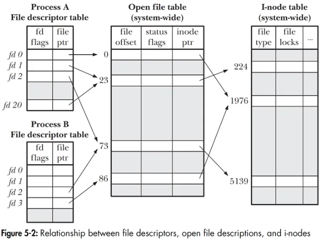

[小林 coding](https://xiaolincoding.com/)

# 页缓存page cache

## **进程执行write时崩溃了，写入的数据会丢失吗**

不会，执行write时，是将文件数据写入到内核的page cache中，内核在适当的时机将page cache中的数据持久化到磁盘

---

## page cache机制

通过`cat /proc/meminfo`能实时获取系统内存情况

其中page cache = buffers + cached + swapcached

可以组织到page cache的页分为文件页和匿名页两部分

**@ 之所以swapcached也属于page cache的一部分**

因为当匿名页交换到磁盘上再加载回内存时，磁盘上的swap file还在，因此可认为是一个内存的备份，属于page cache

---

通过`free -m`查看到当前的页缓存（cached）占用量、块缓存（buffer）占用量

page用于管理缓存文件的页数据，buffer用于缓存块设备的块数据

页属于文件系统的逻辑上的概念，块是于块设备驱动程序同级的，是物理上的概念，两者共同加速I/O：

写入数据时首先写到缓存，并标记为脏页，再向外部存储flush

读数据时，先读取缓存，未命中再去外部存储读取，并加入缓存。

> os总是积极地将所有空闲空间用作缓存，内存不够时会用LRU等算法淘汰缓存页

> linux2.4前，page和buffer完全分离，但块设备大多是磁盘，磁盘又通过文件系统来组织，这导致很多数据缓存了两次

linux2.4以后，一个文件的页加载到了page cache，匿名buffer只需要维护指向页的指针就可以了

对于page cache的管理采用基数数（多叉搜索树）

**page cache机制的预读**

对于读取一个页，会将其后的3个页都加载进来， 即对于4KB的数据，实际上内核读取了16KB

## **缓存会带来数据不一致的问题**

linux提供一些方式来保证一致性

**write through写穿**：向用户提供特定接口，应用程序主动调用接口来保证文件一致性，包括将对应的文件的数据和必要的元数据刷新至磁盘，将对应文件的元数据刷新至磁盘，将对应文件的元数据和数据刷新至磁盘

**write back写回**：系统中存在定期任务，周期性的同步文件系统中的文件脏数据块

系统存在一个管理线程，监控脏页情况，某设备一段时间没有产生脏页，就销毁其刷新线程，若有设备有脏页需要写回但没有刷新线程，就为其创建一个，每个存储设备对应一个刷新线程，

## page cache优劣

优：

1. 加快数据访问
2. 减少IO

缺：

1. 占用额外的物理空间
2. 内存紧张时导致频繁的swap操作
3. 对应用层透明，应用层难以优化，因此mysql等都采用自己的page管理
4. 某些场景下比起直接IO（包括绕过内核，或绕过缓存）多一次磁盘读写IO

