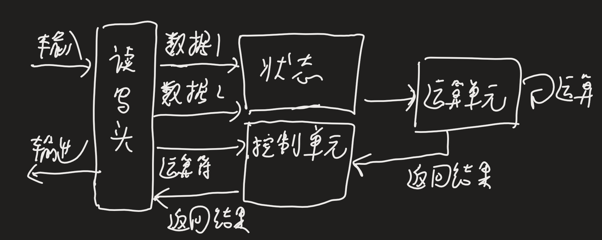
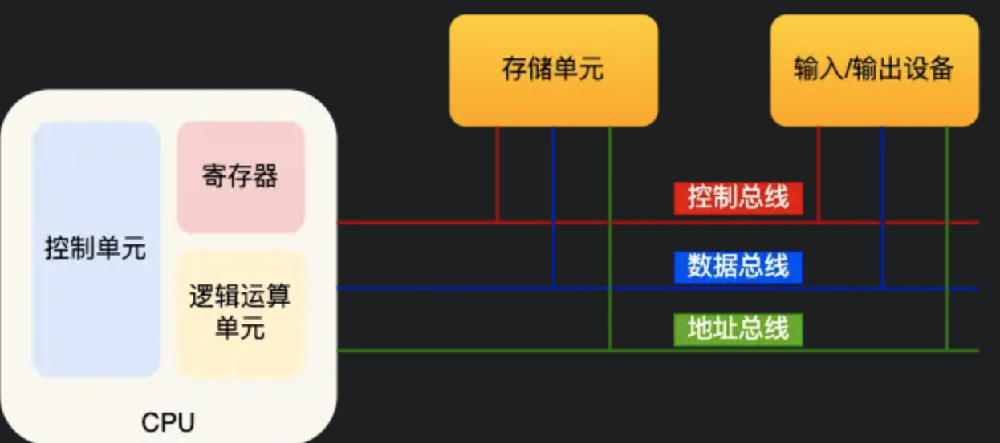
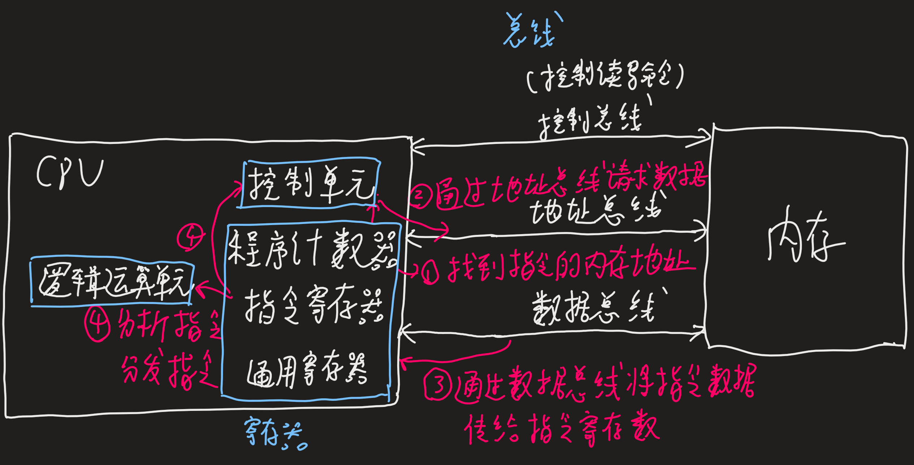
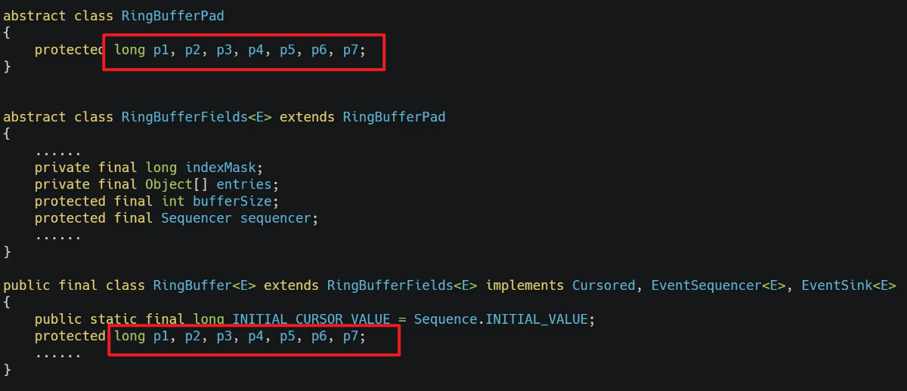
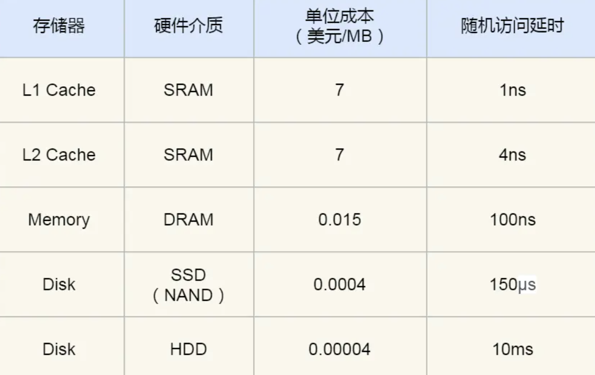
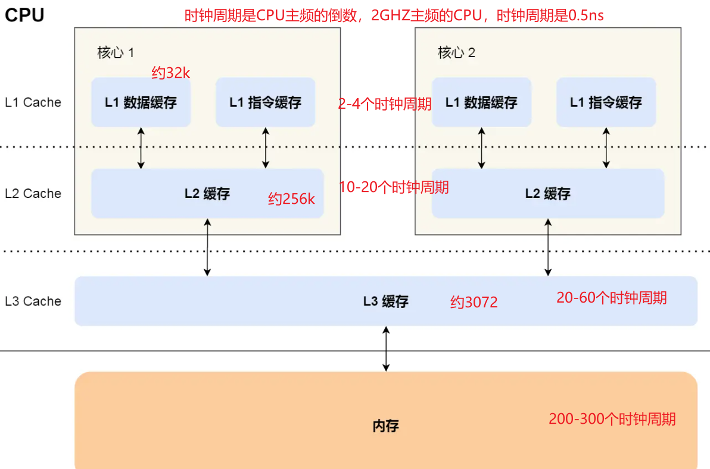
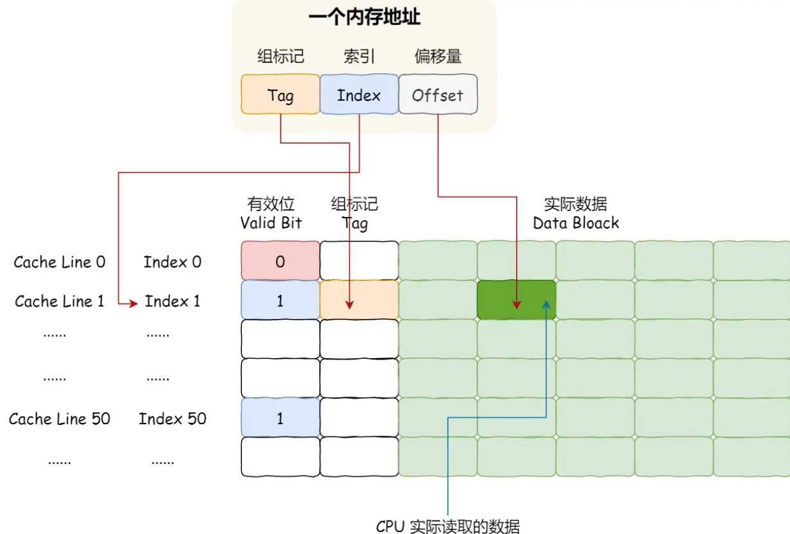
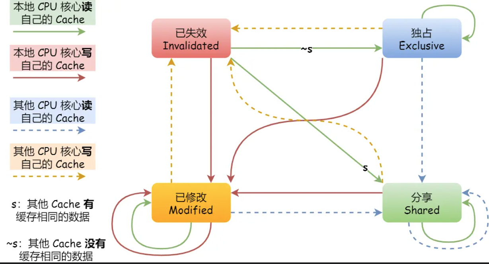

[小林 coding](https://xiaolincoding.com/)
# CPU的执行

## 图灵机模型

1. 读写头将数据和指令写入纸带上的格子，
2. 读写头依次读入数据1，数据2到**状态**（储存设备）中，在读入+号到**控制单元**
3. 通知运算单元，把状态的1和2读入并计算，结果3放到状态中
4. 运算单元将结果返回给控制单元，控制单元将结果给读写头
5. 读写头将3写入纸带的格子中


## 冯诺依曼模型

在图灵机模型上，提出计算机的5个部分，包含运算器，控制器，存储器，输入输出设备


**中央处理器**

CPU，32位CPU一次可以计算4个字节，64位CPU一次可以计算8个字节，通常称为CPU的位宽

CPU中，**控制单元**负责控制CPU工作，**逻辑单元**负责计算，寄存器分为多种器不同作用，包括：

- **通用寄存器**：存放需要计算的数据
- **程序计数器**：存储CPU要执行的下一条指令的内存地址
- **指令寄存器**：存放正在执行的指令

**总线**

- 地址总线：用于指定CPU要操作的内存地址
- 数据总线：用于读写内存的数据
- 控制总线：用于发送和接收信号，如中断等

CPU读写内存数据时，先通过**地址总线**来指定**内存地址**，在通过**控制总线**来**控制读写命令**，最后通过**数据总线**来**传输数据**

## 位宽

**线路位宽**

数据通过操作电压传输，通常希望能一次就访问到所有的内存地址，每条地址总线能表示0或1两种地址，CPU想要操作4G的内存，需要32条地址总线，即线路位宽为32

**CPU位宽**

32位的位宽计算出64位的数据，需要将64位的数据分成2部分分别计算再求和。而64位可以一次计算出64位的数据。但通常很少需要超过32位的数据运算，所以通常性能差距不大

## 程序的基本执行

1. CPU读取**程序计数器**的值找到指令的**内存地址**，CPU的**控制单元**操作**地址总线**访问内存地址,通知内存**准备数据**
2. 内存通过**数据总线**将指令数据传给CPU，存到**指令寄存器**
3. **程序计数器自增**指向下条指令，自增的大小即CPU的位宽
4. CPU分析**指令寄存器**的指令，**确定指令的类型和参数**，计算类的指令就将指令交给**逻辑运算单元**运算。存储类的指令交由**控制单元**执行


一个指令周期分为四个阶段：

1. 取指令：图中1-3步
2. 指令译码：图中4步，指令译码控制器负责解析指令
3. 执行指令：逻辑运算单元完成
4. 数据写回：将寄存器的值写入内存

读指令、执行、下一条指令这个执行过程称为一个CPU的指令周期，通常一个指令周期由多个cpu时钟周期完成，乘法的执行慢于加法很多

1GHz的CPU表示时钟频率，1s产生1G次数的脉冲信号，即时钟周期

## 程序的执行速度

程序的CPU执行时间=指令数 * 每条指令的平均时钟周期数CPI *时钟周期时间

指令数通常由编译器优化，CPI由和时钟周期由硬件完成

## CPU读数据的伪共享问题

当变量A和变量B位于同一个Cache line里面，CPU缓存读取数据以Cache line为单位读取，因此两个CPU为了访问两个不同的变量而以MESI协议中的共享读到同一个Cache line

一个CPU执行修改这个Cache line，将另个CPU的这一对应Cache line变为失效，另个CPU也修改，将这个CPU的这一Cache line变为失效，这样循环下去。

**避免的方法1：**就是尽量将经常修改的数据放到不同的cache line中

当同一cache line中共享的数据在多核之间竞争比较严重，可以使用宏定义__cacheline_aligned_in_smp，使得变量在cache line里是对齐的

例如：对于变量

```c
struct test{
    int a;
    int b __cacheline_aligned_in_smp;
}
```

a，b在物理地址上是连续的，因此可能会位于同一cache line中，而使用宏定义__cacheline_aligned_in_smp可以将地址对齐，使用不同cache line，以时间换空间


**避免的方法2：**字节填充+继承

一个CPU的cache line大小为64字节，即8个long类型数据，因此在类前后填充7个long类型，那么中间的值就一定不会和其他程序共用一个cache line


# CPU Cahce

寄存器能存8个字节，读写速度一般在半个CPU时钟周期

CPU cache采用SRAM静态随机存储器，只要有电数据一直存在，断电丢失。包含L1 Cache、L2 Cache、L3 Cache。

> 内存的速度访问约200-300个时钟周期，百倍于CPU，为了弥补两者的性能差异引入了CPU Cache高速缓存，价格方面相差了466倍
>
> 内存采用DRAM动态随机储存器，功耗更低，容量更大，造价更低。数据存储在电容里，会不断漏电，需要定时刷新电容，才能存储数据

```shell
# 查看L1 Cache数据缓存的大小  32k 5
cat /sys/devices/system/cpu/cpu0/cache/index0/size
# 查看L1 Cache指令缓存的大小  32k
cat /sys/devices/system/cpu/cpu0/cache/index1/size
# 查看L2 Cache的大小         256k 8
cat /sys/devices/system/cpu/cpu0/cache/index2/size
# 查看L3 Cache的大小         3072k 11+
cat /sys/devices/system/cpu/cpu0/cache/index3/size
# 查看L1 Cache数据缓存Cache Line一次载入数据的大小   64字节
cat /sys/devices/system/cpu/cpu0/cache/index0/coherency_line_size
```

性能差异


CPU切换上下文为几十ns-us、系统调用不涉及IO为us级别

L1分成数据缓存和指令缓存，通常他们大小一样，对于1+1=2，+是指令放在指令缓存，1是数据放在数据缓存

L3是所有CPU共享的，L1、L2是每个CPU都有的


CPU Cache由多个Cache Line组成，Cache Line又由Tag（头标志）+数据块（Data Block）组成


CPU Cache的数据从内存读取过来，一小块一小块（即为缓存块Cache Line）读取数据，而不是按照单个数组元素来读取数据的

因此载入array[0]时，会一次载入64k的数据，即array[0]到array[15]的数据

**@ CPU如何判断数据是否在Cache里**

**直接映射策略**：把内存块的地址始终映射在一个CPU Cache Line的地址，映射关系的实现方式则是使用取模运算，取模运算的结果就是内存块地址对应的CPU Cache Line的地址

这就会导致有多个内存块会映射到同一个CPU Cache Line中，因此用**Tag（组标记）**来记录当前CPU Cache Line中存储的数据对应的内存块

Tag还有一个**有效位**，用来标记对应的CPU Cache Line中的数据是否有效，如果为0则访问内存重新加载数据

CPU读取数据时只读取CPU所需要的一个数据片段（CPU Cache Line中），即**字**，因此引入**偏移量**

因此，CPU通过组标记、CPU Cache Line索引、偏移量这三种信息找到数据


**当数据在CPU CacheCPU访问内存地址：**

1. 根据内存地址中的索引计算在CPU Cache的索引，
2. 判断有效位，如果无效就会直接访问内存并重新加载数据
3. 对比组标记，确认这个数据是我们要访问的数据，如果不是则直接访问内存并加载数据
4. 根据偏移量，从CPU Cache Line的数据块中读取对应的字

除了直接映射策略，还有全相连、组相连等

# CPU缓存一致性

## 数据写入内存的策略

**写直达：**

保持内存和cache一致性最简单的方式，将数据同时写入内存和cache中

- 如果数据已经在Cache里面，先更新到cache里面，再写入内存
- 没有在Cache里面，直接把数据更新到内存

每次写都会写回内存，花费大量时间

**写回：**

当发生写操作，新数据仅仅写入缓存中：

- 该行数据如果在缓存里，则直接覆盖写，标记脏页
- 该行数据如果不在缓存里，选中一缓存块（如果选中的是脏页则写回内存），再将修改之前的该行数据从内存读到缓存，再用新数据覆盖缓存，标记脏页

> 数据覆盖时，先把修改之前的数据从内存读到缓存，再将新数据写入缓存。
>
> 这是为了在多核CPU的环境下，使得当前CPU获得对该行数据的独占权限

这个方法只在缓存不命中时才会从内存读取数据

## 多核CPU缓存一致性问题

多核CPU下，L1、L2缓存是各CPU独有的，因此带来缓存一致性问题：

AB号cpu同时运行两个线程操作同一变量，A号CPU修改了变量还没写回内存时，B读到的值是错的

解决这个问题需要两点：

- 写传播，即对某个CPU核心的数据更新必须传播到其他CPU核心
- 事务的串行化，在所有处理器的视角里，程序执行次序应该是一样的

> 如果A号CPU和B号CPU同时对一个值写入并通知其他CPU，那么所有CPU收到的执行修改顺序应该是一样的。

### 总线嗅探

实现**写传播**则依赖**总线嗅探**，例如

当A号CPU修改了L1变量中的i变量，通过总线把这个事件广播通知给其他所有的核心，每个CPU核心监听总线上的广播事件，并检查是否有相同的数据在自己的L1缓存里

这种方式加重了总线的负载，每个数据都需要发出广播事件

### MESI协议

要实现**事务的串行化**需要引入**锁**，如果两个CPU核心里有相同数据的cache，那么只有拿到锁才能对这个缓存数据更新

MESI协议用四个状态来标记cache line四中状态：

- *Modified*，已修改。即脏页
- *Exclusive*，独占。未修改，独占
- *Shared*，共享。未修改，多个CPU持有
- *Invalidated*，已失效

独占时，不需要写传播，

A号CPU独占数据时，B号CPU读取了相同数据，会发消息给所有CPU，A号CPU回复数据，cache line从独占变为共享

共享时，如果要更新cache的数据，需要先向其他CPU核心广播请求，将其他核心的Cache对应的cache line标记为无效（无视修改状态），再更新当前cache的数据，标记为已修改

继续修改这个值时，因为是已修改状态，因此不需要通知，直接更新

当这个值的cache line要被替换时，同步到内存



# 代码如何迎合cpu的执行

## 提高数据缓存的命中率

1. 对于二维数组，优先遍历列，再遍历行

```cpp
for(int i; i < N; i++){
    for(int j; j < N; j++){
        array[i][j];//速度更快
        array[j][i];//速度更慢
    }
}
```

## 提升指令缓存的命中率

```cpp
//操作一
for(int i = 0; i < N; i++){
    if(array[i]<50){
        array[i] = 0;
    }
}
//操作二
sort(array, array+N);
```

操作一和操作二的执行顺序会影响程序的性能，先执行操作二再执行操作一效率更高

CPU的分支预测，如果分支预测可以预测到接下来要执行if还是else，就可以提前把指令放进指令缓存中

当数组元素是顺序的，分支预测器会动态地根据历史命中数据对未来进行预测，先排序再遍历时，前几次遍历命中if<50的次数比较多，分支预测就会缓存if里的array[i]=0指令到Cache中，后续CPU执行该指令只需从Cache读取就好

当然显示的给出预测也可以，但一般CPU自身的预测已经足够了

```CPP
if(likely(a == 1)){
    ……
}else if(unlikely( a != 1)){
    ……
}
```

## 提升多核CPU的缓存命中率

现代CPU通过时间片可能在不同CPU核心来回切换执行，这对L1 L2 Cache是不利的，如果都在一个核心上执行，那么数据的L1和L2 Cache缓存命中率可以得到有效提高

当有多个计算密集型的线程，为了防止切换到不同的核心而导致缓存命中率下降，可以把线程绑定 在某个CPU核心上，即提高CPU亲和力

```cpp
#define _FNU_SOURCE
#include <sched.h>

int sched_setaffinity(pid_t pid, size_t cpusetsize, cpu_set_t *mask);
```

通常内核的进程都自带软亲和力，进程尽可能的执行在一个CPU上

有时也需要硬亲和力（强行将进程或线程绑定到某个指定的CPU核运行）

使用场景：

计算密集、提高Cache命中率、正在运行时间敏感的、决定性的进程