[小林 coding](https://xiaolincoding.com/)


# 零拷贝

## 直接内存拷贝DMA

异步中断方式


DMA方式
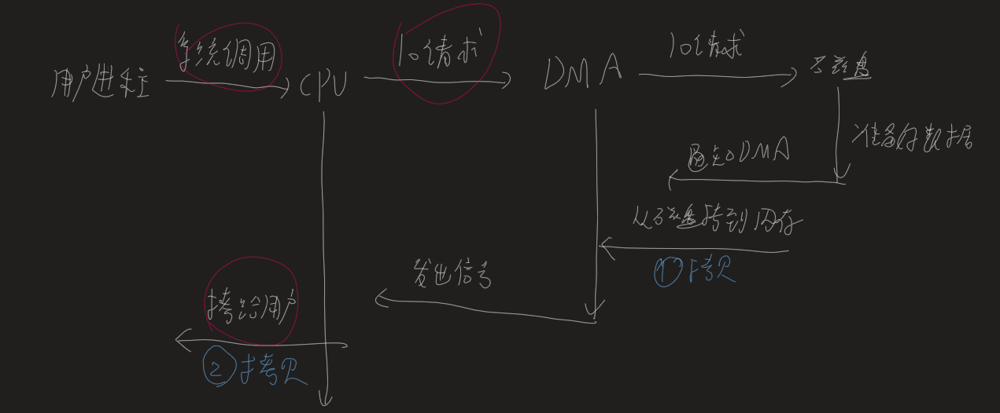

## 对于文件的网络传输的问题

1. 对于一次读写数据（read+write)，共要经历2次系统调用，4次数据拷贝（磁盘到内核、内核到用户、用户到socket缓冲区（内核）、socket到网卡）

2. 对于一个文件的网络传输会会产生多次读写数据(需要我们关注缓冲区大小)：

   文件大小>分配的内存缓冲区大小<socket缓冲区大小（受到滑动窗口大小动态变动）

   分配的内存缓冲区大小：如果太大，不能一次拷给socket，如果太小，需要调多次read、write系统调用

**优化：**对于文件传输的场景，用户层将指定文件发给网络，这个过程中数据拷贝到用户态是没有意义的。

## 零拷贝

### mmap+write方式

mmap（）系统调用红会直接把内核缓冲区的数据映射到用户空间，从而没有拷贝操作，可代替read函数

mmap的映射是先建立磁盘文件和虚拟地址的映射关系，当真正访问虚拟地址时产生缺页再分配实际物理地址，将磁盘文件拷贝到内存，因此mmap的映射大小可以大于内存大小

特点：

- 等同于共享内存的优点，减少了拷贝，双方可以对同一片地址操作
- 映射大小为页，有内部碎片

### sendfile方式

```c
ssize_t sendfile(int out_fd, int in_fd, off_t *offset, size_t count);
```

专门用于发送文件的系统调用函数sendfile（）

- 从两次系统调用变为了一次
- 数据不经过用户层，磁盘读到内核，内核发给网络（拷贝从4次变为3次，磁盘->内核->socket->网卡）

如果网卡支持**SG-DMA，则变为2次：磁盘->内核->网卡**（内核只传给socket要传的数据大小和位置，不需要传数据）

数据从磁盘到内核，从内核到网卡都由DMA负责，不需要内核参与，因此没有通过CPU

### 优化点

1. 系统调用从2次变为1次，拷贝从4次变为2次且没有CPU参与
2. 不需要关注内存缓冲区大小，CPU不参与，全部由DMA参与
3. 可以利用pagecache的预读，提高缓存命中率

kafka、nginx都使用了零拷贝，通常能将传输效率提高了一倍

### 对于大文件的网络传输（异步/直接IO方式）

异步IO发起后，访问磁盘时是直接IO，没有经过pagecache，经过pagecache可以称为缓存IO

直接IO的应用场景：

1. 对于大文件可以使用直接IO（异步IO）实现传输， 大文件并不能通过pagecache获得明显优化
2. 对于mysql等数据库通常会绕开内核缓冲区，由自己在用户态实现缓冲区，以支持独特的查询和减少系统内存的开销

缺点：无法利用缓存IO中对磁盘的优化，

# IO多路复用

## 基本socket模型

Socket是应用层与TCP/IP协议族通信的中间软件抽象层，它是一组接口。在设计模式中属于门面模式，，它把复杂的TCP/IP协议族隐藏在Socket接口后面，对用户来说，一组简单的接口就是全部，让Socket去组织数据，以符合指定的协议。

### 套接字

是一个整数，0、1、2对应的FILE *结构的表示就是stdin、stdout、stderr，即标准输入、标准输出、标准错误输出

linux下socket为文件，申请一个套接字就是打开socket文件，文件描述表中这个文件的文件描述符对应一个套接字

**组成**：4元组来表示（clientip:clientport， serverip:serverport），clientip 是客户端的IP地址，clientport 是客户端的端口，serverip 是服务器的IP地址，而 serverport 是服务器的端口。

系统创建套接字后，大多数字段没有填写。必须调用其他的过程来填充这些字段才可以使用。

**监听套接字**: 监听套接字正如accept函数的参数sockfd，由listen函数将一个主动套接字转化为监听套接字。<u>一个服务器通常只创建一个监听socket描述子</u>，它在该服务器的生命周期内一直存在。

**连接套接字**：而accept函数等待客户端的连接请求到达监听套接字listenfd，accept函数返回的是连接socket描述字(一个连接套接字)，它代表着一个网络已经存在的点点连接

连接套接字socketfd_new依然使用的是与监听套接字socketfd_new一个类型的端口号，均只存在于服务器端

### socket建立

**socket缓冲区**

1. 调用 `socket()` 函数，创建网络协议为 IPv4，以及传输协议为 TCP 的 Socket
2. 调用bind绑定端口和IP地址，用于内核收到TCP报文通过端口号找到应用，一个机器有多个网卡，通过绑定IP决定内核收到哪个网卡才把包发给我们
3. 调用listen监听，
4. 调用accept获取客户端的连接，会阻塞

客户端

1. 调用socket
2. 调用connect发起连接，指明IP和端口，开启三次握手。

   从established状态的连接队列头部取出一个已经完成的连接，如果没有则一直阻塞。同样，如果队列满了客户端继续发出连接请求，并不会拒绝，只会延迟

内核为任何一个给定的**监听套接口维护两个缓冲区**

- 每个 socket 被创建后，都会分配两个缓冲区，输入缓冲区和输出缓冲区
- 即使关闭套接字也会继续传送输出缓冲区中遗留的数据；但将丢失输入缓冲区中的数据。
- 通过 getsockopt() 函数获取缓冲区的默认大小，一般都是 8K

```cpp
unsigned optVal;
int optLen = sizeof(int);
getsockopt(servSock, SOL_SOCKET, SO_SNDBUF, (char*)&optVal, &optLen);
printf("Buffer length: %d\\n", optVal);
```

内核为任何一个给定的**监听套接口维护两个队列**：

1、未连接队列（incomplete connection queue），已由某个客户发出并到达服务器，正在等待完成相应的 TCP 三次握手（ SYN_RCVD 状态）

2、全连接队列（completed connection queue），已完成 TCP 三次握手过程的（ESTABLISHED 状态）

### 文件描述符的底层实现

**文件描述符**：系统有文件描述符数组，数组的下标是文件描述符，数组内容是指针，指向所有打开的文件列表

每个进程有task_struct结构体，包含指向文件描述符数组的指针

每个文件有inode，socket文件的inode指向内核的socket结构，包含发送队列和接收队列两个链表，每个节点是结构体sk_buff，表示各个层的数据包，应用层叫data，TCP叫segment，IP叫packet，数据链路层叫frame

> 全部数据包用一个结构体，如果用不同结构体，上下层数据传递去包头加包头会发生多次拷贝，降低效率。

如下图，用data指针指向数据实际的位置，head和end表示整个数据的长度，一开始余留好整个数据的长度
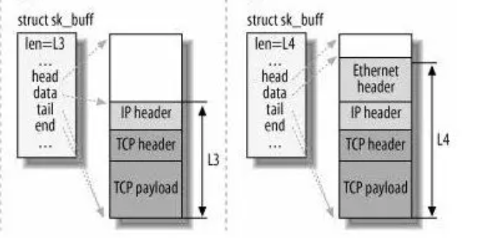

## 增加服务数

如上同步阻塞的方式，当读写操作阻塞时，其他客户端和服务器无法连接

服务器承载连接数收到一些限制：

​	文件描述符，linux一般可以打开1024个文件，通过ulimit修改文件描述符的上限

​	系统内存，tcp连接占用的数据结构

**@ C10K问题：如果服务器内存2G，千兆网卡能并发1w请求吗**

从硬件资源，每个请求处理占用不到200KB的内存和100KB的网络就可以满足1W个请求

但实际上，效率低的模型会加重系统开销，从而无法服务

### 多进程模型

主进程负责监听客户端的连接，一旦连接完成，为其分配一个进程来处理请求。

因为fork创建子进程实际上等同于把父进程的东西复制一份，包括文件描述符，从而可以直接使用已连接socket和客户端通信。父进程负责连接，子进程负责服务

> 注意，当子进程退出时，内核会保留该进程的一些信息，需要做好回收，不然就会成为僵尸进程，消耗系统资源。可以在子进程退出后调用wait（）和waitpid（）函数

这个方式对于100个客户端可行，但每产生一个进程会占据一定的系统资源，且进程上下文切换代价较大，对于1W个客户端不可行

### 多线程模型

通过线程池处理服务，因为所有线程共享连接队列，因此需要上锁。对于1W个连接，线程池阻塞队列扛不住

### IO多路复用select/poll

> **IO多路复用：**一个进程维护多个socket，一个进程虽然任一时刻只能处理一个请求，但处理每个请求耗时控制在1ms以内，这样1s内可以处理上千个请求

**原理：**将已经连接的socket放到一个文件描述符集合，调用select函数将文件描述符集合<u>拷贝到内核</u>中，让内核检查是否有网络事件产生（暴力遍历），
当检查到有事件产生后，将这个socket标记为可读或可写，再把整个文件描述符集合<u>拷贝回用户态</u>里，用户态通过遍历的方法找到可读可写的socket再对其处理

**性能：**这个过程产生了2次遍历文件描述符，2次拷贝文件描述符，随着并发数上来，性能指数增长

**区别：** **select**使用固定长度的**BitsMap**，表示文件描述符集合，且linux中支持的select文件描述符是默认最大1024（FD_SETSEZE参数决定）

**poll**不再用BitsMap来存储所关注的文件描述符，而是用**动态数组（链表）**，突破了select文件描述符个数限制，只受系统文件描述符限制

其他部分他们区别不大

> 即使对于水平触发的select/poll，也最好用非阻塞IO，因为select可能错误的将一个socket文件描述符解释为准备读取，而实际上不可读写，使用阻塞IO会使程序阻塞，

### IO多路复用epoll

使用**红黑树**来跟踪进程所有待检测的文件描述字：通过epoll_ctl()将需要监控的socket加入内核的红黑树中，select/poll每次操作传入整个socket集合，epoll因为维护了红黑树，因此每次只需传入一个待检测的socket，从而减少了上面提到的两次拷贝问题，查询速度从O(N)提升到O（logN）

**事件驱动机制**：内核维护链表来记录就绪事件，当socket发生时通过回调函数将其加入这个就绪事件列表中，当用户调用epoll_wait（）函数时，只返回有事件发生的文件描述符的个数，不需要像select/poll那样轮询扫描整个socket集合，大大提高了检测效率
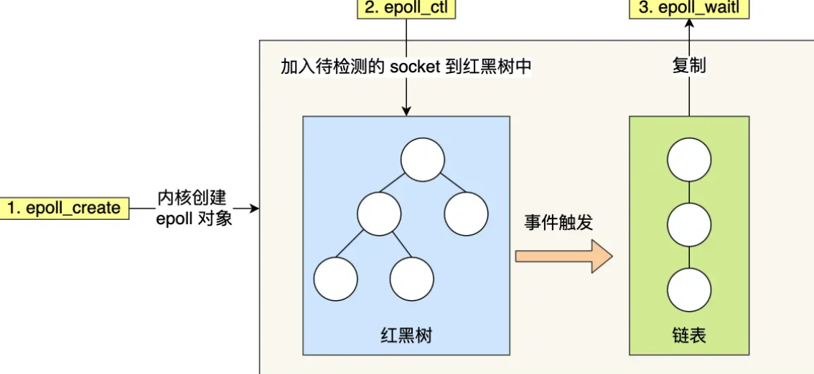

图中可以看出，当事件发生时，将指针移到队列中，并将队列长度返给用户层，将队列从内核态拷贝到用户态，用户通过队列长度和复制的链表访问，这个过程依然有拷贝，但比起select/poll只拷贝了发生的事件，没有全部拷贝

**水平触发**：被监控的socket有可读事件发生时，服务器不断苏醒，直到内核缓冲区被read读完

**边缘触发**：当socket描述符有可读事件发生时，服务器只从epoll_wait中苏醒一次，即使没有调用read函数读取数据也依然只苏醒一次，因此要保证程序能一次性将内核缓冲区的数据读完

使用水平触发，当内核通知文件描述符读写时，接下来还继续检测状态，看它是否依然可读或可写

使用边缘触发，通常和非阻塞IO搭配使用，程序循环从文件描述符里读取数据，直到系统调用（read/write)返回错误。如果没有数据读写时，进程会阻塞。

通常，边缘触发效率更高，因为减少epoll_wait的系统调用次数

select/poll只有水平触发，epoll默认水平触发，但可以设置为边缘触发


## socket编程

**socket**

```
#include<sys/socket.h>
int  socket(int protofamily, int type, int protocol);//返回sockfd描述符
```

对应普通文件的打开操作，他创建一个socket描述符，唯一标识一个socket，作为参数可以进行一些读写操作

- `protofamily`：即协议域，又称为协议族（family）。 常用的协议族有，AF_INET(IPV4)、AF_INET6(IPV6)、AF_LOCAL（或称AF_UNIX，Unix域socket）、AF_ROUTE等等。 协议族决定了socket的地址类型，在通信中必须采用对应的地址，如AF_INET决定了要用ipv4地址（32位的）与端口号（16位的）的组合、AF_UNIX决定了要用一个绝对路径名作为地址。
- `type`：指定socket类型。 常用的socket类型有，SOCK_STREAM、SOCK_DGRAM、SOCK_RAW、SOCK_PACKET、SOCK_SEQPACKET等等。
- `protocol`：指定协议。 常用的协议有，IPPROTO_TCP、IPPTOTO_UDP、IPPROTO_SCTP、IPPROTO_TIPC等，分别对应TCP传输协议、UDP传输协议、STCP传输协议、TIPC传输协议

并不是type和protocol可以随意组合的，protocol为0时会自动选择type对应的默认协议

```
fd = socket(AF_INET，SOCK_STREAM，0）
```

表示使用字节流传输数据，即TCP协议

**bind**

如果没有bind，系统就会随机分配端口

```
int bind(int sockfd, const struct sockaddr *addr, socklen_t addrlen);
```

- `sockfd`：即socket描述字
- `addr`：指向要绑定给sockfd的协议地址。这个地址结构根据地址创建socket时的地址协议族的不同而不同
- `addrlen`：对应的是地址的长度，即sizeof（addr）

```cpp
struct sockaddr_in{
	sa_family_t sin_family; //地址族，和socket函数传入的协议族是一样的
	uint16_t sin_port;      //16位TCP/UDP端口号
	struct in_addr sin_addr; //32位IP地址
	char sin_zero[8];        //不使用
}
struct in_addr{
	In_addr_t s_addr;//32位IPv4地址
}
```

**listen**

```
int listen(int sockfd, int backlog);
```

`sockfd`:socket描述字

`backlog`:可以排队的最大连接个数

将套接字( sockfd )变成被动的连接监听套接字（被动等待客户端的连接），相当于开启一个被动等待的状态

并不阻塞，只是将该套接字和套接字对应的连接队列长度告诉 Linux 内核，这里的backlog参数对应未连接队列的长度

**connect**

```
int connect(int sockfd, const struct sockaddr *addr, socklen_t addrlen);
```

客户端调用connect向服务端发出连接请求，返回一个连接的socket描述字

​		`sockfd`:socket描述字

​		`addr` :服务器地址

​		`addrlen`：为socket地址的长度

这个过程由内核自动完成三次握手，默认一直阻塞直到连接上

这个过程也会被select函数接收为读操作

**accept**

服务器用于监听指定的socket地址，TCP服务器监听到客户端的一个请求就会调用accept函数接收请求。

```
int accept(int sockfd, struct sockaddr *addr, socklen_t *addrlen); //返回连接connect_fd
```

`sockfd`：socket描述字

`addr` ：结果参数，用于接收一个返回值，返回客户端的地址，可为NULL

`addrlen` ：结果参数，用于接收上诉addr的结构的大小

成功返回表示连接建立，返回与客户通信的套接字

注意：accept默认会阻塞进程，直到有个客户建立连接后返回一个新可用的连接套接字

### 大小端问题

通常服务器在启动的时候会绑定一个地址，用于提供服务，客户端就可以通过他来连接服务器，而客户端就不用指定，系统自动分配端口号和ip地址的组合（connect时系统随机生成一个）

 在将一个地址绑定到socket的时候，请先将主机字节序转换成为网络字节序，而不要假定主机字节序跟网络字节序一样使用的是Big-Endian 

 a) Little-Endian就是低位字节排放在内存的低地址端，高位字节排放在内存的高地址端。

 b) Big-Endian就是高位字节排放在内存的低地址端，低位字节排放在内存的高地址端。 

 **主机字节序**就是我们平常说的大端和小端模式：

**网络字节序：** 4个字节的32 bit值以下面的次序传输：首先是0～7bit，其次8～15bit，然后16～23bit，最后是24~31bit。这种传输次序称作大端字节序。**由于TCP/IP首部中所有的二进制整数在网络中传输时都要求以这种次序，因此它又称作网络字节序。**

网络都是大端，但主机可能是小端也可能是大端

\#inclde<arpa/inet.h>

```
uint32_t htonl(uint32_t hostlong)
```

将一个32位数从**主机字节顺序**转换成**网络字节顺序**。

```
uint16_t htons(uint16_t hostlong)
```

将一个16位数从**主机字节顺序**转换成**网络字节顺序**

```
uint16_t ntohs(uint16_t hostlong)
```

将一个16位数由**网络字节顺序**转换为**主机字节顺序**

```
uint32_t ntohs(uint32_t hostlong)
```

uint32_t ntohs(uint32_t hostlong)

例子：

```cpp
memset(&servaddr, 0, sizeof(servaddr));
servaddr.sin_family = AF_INET;
servaddr.sin_addr.s_addr = htonl(INADDR_ANY);//让系统自动获取本机的IP地址。
servaddr.sin_port = htons(8000);//设置端口号

//将本地地址绑定到所创建的套接字上
if( bind(socket_fd, (struct sockaddr*)&servaddr, sizeof(servaddr)) == -1){
    printf("bind socket error: %s(errno: %d)\\n",strerror(errno),errno);
    exit(0);
}
```

其中一些宏：

**INADDR_ANY**

转换过来就是0.0.0.0，表示本机的所有IP，多网卡的情况下，这个就表示所有网卡ip地址的意思。

比如一台电脑有3块网卡，对应3个ip地址了。如果绑定某个具体的ip地址，你只能监听你所设置的ip地址所在的网卡的端口，其它两块网卡无法监听端口，如果我需要三个网卡都监听，那就需要绑定3个ip，

为此出现INADDR_ANY，你只需绑定INADDR_ANY，管理一个套接字就行，不管数据是从哪个网卡过来的，只要是绑定的端口号过来的数据，都可以接收到。

### connetc之前的地址转换二进制：

```c
int inet_aton(const char *cp, struct in_addr *inp);
```

转换网络主机地址ip(如192.168.1.10)为二进制数值，储存在结构体inp中

返回0表示成功，否则表示主机地址无效

（转换完，还需要调用函数将主机字节顺序转为网络字节顺序）

```c 
in_addr_t inet_addr(const char *cp);
```

转换网络主机地址ip(如192.168.1.10)为二进制数值

如果参数无效返回-1，255.255.255.255也会返回-1

```c
char *inet_ntoa(struct in_addr in);
```

转换网络字节排序的地址为标准的ASCII以点分开的地址,该函数返回指向点分开的字符串地址（如192.168.1.10)的指针

\#include <arpe/inet.h>

```c
int inet_pton(int family, const char *strptr, void *addrptr);
```

将点分十进制的ip地址转化为用于网络传输的数值格式

返回值：若成功则为1，若输入不是有效的表达式则为0，若出错则为-1

```c
const char * inet_ntop(int family, const void *addrptr, char *strptr, size_t len);
```

将数值格式转化为点分十进制的ip地址格式

返回值：若成功则为指向结构的指针，若出错则为NULL

### read、write等操作函数

建立号连接关系就可以调用网络I/O进行读写操作

- read/write

```
#include <unistd.h>
ssize_t read(int fd, void *buf, size_t count);
ssize_t write(int fd, const void *buf, size_t count);
```

write成功返回，**只是buf中的数据被复制到了kernel中的TCP发送缓冲区。**至于数据什么时候被发往网络以及后面的内容，无法保证

只有每个socket的发送缓冲区满时会阻塞（）每个socket有自己的发送接收缓冲区

- send/recv

```
#include <sys/types.h>
ssize_t send(int sockfd, const void *buf, size_t len, int flags);
ssize_t recv(int sockfd, void *buf, size_t len, int flags);
```

TCP数据读写部分常用，失败返回-1，设置errno
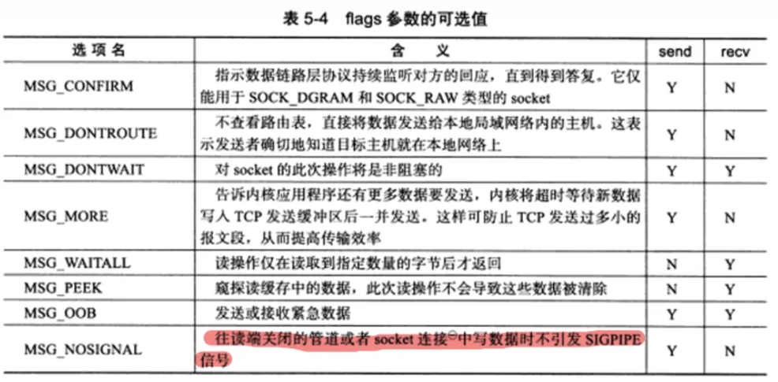

- sendro/recvfrom

```c
ssize_t sendto(int sockfd, const void *buf, size_t len, int flags, const struct sockaddr *dest_addr, socklen_t addrlen);
ssize_t recvfrom(int sockfd, void *buf, size_t len, int flags,struct sockaddr *src_addr, socklen_t *addrlen);
```

UDP常用的读写，`UDP`通信没有连接的概念，所以我们读取数据都需要获取发送端的`socket`地址，这里的`flags`参数和上面的表格相同，失败返回-1

讲最后两个参数设置NULL也可以用于面向连接的socket数据读写

- sendmsg/recvmsg

```c
ssize_t sendmsg(int sockfd, const struct msghdr *msg, int flags);
ssize_t recvmsg(int sockfd, struct msghdr *msg, int flags);
```

通用数据读写

```c
struct msghdr {
		void* msg_name;// socket地址，面向连接的socket这里必须为NULL
    socklen_t msg_namelen;// socket地址的长度
		struct iovec* msg_iov;// 分散的内存块
		int msg_iovlen;// 分散内存块的数量
		void* msg_control;// 指向辅助数据的起始位置
    socklen_t msg_controllen;// 辅助数据的大小
		int msg_flags;// 复制函数中的flags参数，并且在调用过程当中更新
};
struct iovec {
    void *iov_base; // 内存起始地址
    size_t iov_len; // 这块内存的长度
}
```

**TCP阻塞模式:**

对于TCP套接字（默认情况下），当使用 write()/send() 发送数据时：

1. 检查缓冲区大小，不够时阻塞，直到有空间才唤醒
2. TCP协议在向网络发送数据时不能写入，发完后唤醒write/send函数
3. 如果要写入的数据大于缓冲区的最大长度，那么将分批写入。
4. 所有数据都写入缓冲区才返回

当使用 read()/recv() 读取数据时：

1. 检查缓冲区，有数据则读，否则阻塞
2. 要读的数据长度小于缓冲区长度，则剩余数据会不断积压直到再次读
3. 读到数据后才返回，否则阻塞

**close函数**

```c
#include <unistd.h>
int close(int fd);
```

close操作只是使相应socket描述字的引用计数-1，只有当引用计数为0的时候，才会触发TCP客户端向服务器发送终止连接请求。

```c
int inet_pton(int af, const char *src, void *dst);//转换字符串到网络地址:
```

inet_pton 是Linux下IP地址转换函数，可以在将IP地址在“点分十进制”和“整数”之间转换 ，是inet_addr的扩展。

第一个参数af是地址族，转换后存在dst中

af = AF_INET:src为指向字符型的地址，即ASCII的地址的首地址（ddd.ddd.ddd.ddd格式的），函数将该地址转换为in_addr的结构体，并复制在*dst中

af =AF_INET6:src为指向IPV6的地址，函数将该地址转换为in6_addr的结构体，并复制在*dst中

如果函数出错将返回一个负值，并将errno设置为EAFNOSUPPORT，如果参数af指定的地址族和src格式不对，函数将返回0。

### socket编程实例

服务器端：一直监听本机的8000号端口，如果收到连接请求，将接收请求并接收客户端发来的消息，并向客户端返回消息

服务端

```cpp
/* File Name: server.c */
#include<stdio.h>
#include<stdlib.h>
#include<string.h>
#include<errno.h>
#include<sys/types.h>
#include<sys/socket.h>
#include<netinet/in.h>
#define DEFAULT_PORT 8000
#define MAXLINE 4096
int main(int argc, char** argv)
{
 int    socket_fd, connect_fd;
 struct sockaddr_in servaddr;
 char    buff[4096];
 int     n;
 //初始化Socket
 if( (socket_fd = socket(AF_INET, SOCK_STREAM, 0)) == -1 ){
	 printf("create socket error: %s(errno: %d)\\n",strerror(errno),errno);
	 exit(0);
  }
 //初始化
 memset(&servaddr, 0, sizeof(servaddr));
  servaddr.sin_family = AF_INET;
  servaddr.sin_addr.s_addr = htonl(INADDR_ANY);//IP地址设置成INADDR_ANY,让系统自动获取本机的IP地址。
  servaddr.sin_port = htons(DEFAULT_PORT);//设置的端口为DEFAULT_PORT
 
 //将本地地址绑定到所创建的套接字上
 if( bind(socket_fd, (struct sockaddr*)&servaddr, sizeof(servaddr)) == -1){
	 printf("bind socket error: %s(errno: %d)\\n",strerror(errno),errno);
	 exit(0);
  }
 //开始监听是否有客户端连接
 if( listen(socket_fd, 10) == -1){
	 printf("listen socket error: %s(errno: %d)\\n",strerror(errno),errno);
	 exit(0);
  }
 printf("======waiting for client's request======\\n");
 while(1){
		//阻塞直到有客户端连接，不然多浪费CPU资源。
	  if( (connect_fd = accept(socket_fd, (struct sockaddr*)NULL, NULL)) == -1){
			printf("accept socket error: %s(errno: %d)",strerror(errno),errno);
			continue;
	  }
		//接受客户端传过来的数据
    n = recv(connect_fd, buff, MAXLINE, 0);
		//向客户端发送回应数据
	  if(!fork()){ /*紫禁城*/
		if(send(connect_fd, "Hello,you are connected!\\n", 26,0) == -1){
        perror("send error");
        close(connect_fd);
				exit(0);
	   }
	   buff[n] = '\\0';
		 printf("recv msg from client: %s\\n", buff);
	   close(connect_fd);
	  }
	  close(socket_fd);
	}
}
```

客户端

```cpp
/* File Name: client.c */
#include<stdio.h>
#include<stdlib.h>
#include<string.h>
#include<errno.h>
#include<sys/types.h>
#include<sys/socket.h>
#include<netinet/in.h>
 
#define MAXLINE 4096
 
int main(int argc, char** argv)
{
 int    sockfd, n,rec_len;
 char    recvline[4096], sendline[4096];
 char    buf[MAXLINE];
 struct sockaddr_in servaddr;
 
 if( argc != 2){
	 printf("usage: ./client <ipaddress>\\n");
	 exit(0);
} 
 
 if( (sockfd = socket(AF_INET, SOCK_STREAM, 0)) < 0){
	 printf("create socket error: %s(errno: %d)\\n", strerror(errno),errno);
	 exit(0);
 }
 
 memset(&servaddr, 0, sizeof(servaddr));
 servaddr.sin_family = AF_INET;
 servaddr.sin_port = htons(8000);
 if( inet_pton(AF_INET, argv[1], &servaddr.sin_addr) <= 0){
	 printf("inet_pton error for %s\\n",argv[1]);
	 exit(0);
  }
 
 
 if( connect(sockfd, (struct sockaddr*)&servaddr, sizeof(servaddr)) < 0){
	 printf("connect error: %s(errno: %d)\\n",strerror(errno),errno);
		exit(0);
  }
 
 printf("send msg to server: \\n");
 fgets(sendline, 4096, stdin);
 if( send(sockfd, sendline, strlen(sendline), 0) < 0){
	 printf("send msg error: %s(errno: %d)\\n", strerror(errno), errno);
	 exit(0);
  }
 if((rec_len = recv(sockfd, buf, MAXLINE,0)) == -1) {
   perror("recv error");
	 exit(1);
  }
 buf[rec_len]  = '\\0';
 printf("Received : %s ",buf);
 close(sockfd);
 exit(0);
}
```

客户端去连接server

./client 127.0.0.1

# IO多路复用编程

## select

### select函数

```cpp
#include <sys/select.h>
#include <sys/time.h>
#include <sys/types.h>
#include <unistd.h>
```

`int select(int nfds, fd_set *readfds, fd_set *writefds, fd_set *exceptfds, struct timeval *timeout);` //会阻塞到有文件描述符可以IO操作或被信号打断或者超时才会返回

**参数：**

将监听的文件描述符分为三组，每一组监听不同的需要进行的IO操，

`nfds` 所有文件描述符的范围，即文件描述符的最大值+1

`readfds`监视文件描述符是否可读，

`writefds`监视文件描述符是否可写

`exceptfds`是需要进行异常事件处理的文件描述符。

`timeout` 表示返回的时间上线，为NULL则无限等待，通常设置为0

```cpp
struct timeval{
    long tv_sec;//秒
    long tv_usec;//微秒
}//表示select返回之前的时间上限，
```

当select返回时，每组文件描述符都会被select过滤，只留下可以进行IO操作的文件描述符

**特殊的：**

可以用NULL来表示对应的事件不需要监听

如果`timeout->tv_sec==0 && timeout->tv_sec==0` ，不等待直接返回，加入的描述符都会被测试，并且返回满足要求的描述符个数，这种方法通过轮询，无阻塞地获得多个文件描述符状态

select的等待可被信号中断，如果捕获到信号，返回-1，并将errno设置成EINTR

> 注意如果要检测的描述符是8、9、10，要么系统也要从0开始检测，实际检测的描述符个数是填入的nfds值，填入8，那么8和8以后的值不会被感知到

**返回值：**

成功时，返回三个文件描述符集合中准备好了的文件描述符数量

超时返回0，错误返回-1，并设置errno

**错误码：**

EBADF：集合中包含无效的文件描述符。（文件描述符已经关闭了，或者文件描述符上已经有错误了）。

EINTR：捕获到一个信号。

EINVAL：nfds是负的或者timeout中包含的值无效。

ENOMEM：无法为内部表分配内存。

### FD_xx系列的函数

是用来操作文件描述符组和文件描述符的关系

`FD_ZERO(**&**writefds)`用来清空文件描述符组。每次调用select前都需要清空一次

`FD_SET(fd, **&**writefds);`//添加一个文件描述符到组中

`FD_CLR(fd, **&**writefds);`//将一个文件描述符移出组中

**`if** (FD_ISSET(fd, **&**readfds))`//检测一个文件描述符是否在组中

可同时监听的文件描述符数量是通过FS_SETSIZE来限制的，linux中为1024。增加这个值，但随着监听的文件描述符数量增加，select的效率降低

```cpp
//FD_xxx系列函数使用案例
fd_set readfds;
int fd;
FD_ZERO(&readfds)//新定义的变量要清空一下。相当于初始化。
FD_SET(fd,&readfds);//把文件描述符fd加入到readfds中。
//select 返回
if(FD_ISSET(fd,&readset)){//判断是否成功监视
    //dosomething
}
```

### 原理

fd_set是一个long的数组，其中1字节长的fd_set对应8bit对应8个文件描述符fd

用FD_ZERO则全部清0 为0000,0000

若fd=5，则FD_SET后变为00001,0000（第5个位置为1）

再加入fd＝2，fd=1,则set变为0001,0011

此时执行select(6,&set,0,0,0)阻塞等待

若fd=1,fd=2上都发生可读事件，则select返回，此时set变为0000,0011。注意：没有事件发生的fd=5被清空。

### 例子

```cpp
#include <stdio.h>
#include <stdlib.h>
#include <sys/time.h>
#include <sys/types.h>
#include <unistd.h>

int main(void)
{
    fd_set rfds;//定义一个能保存文件描述符集合的变量
    struct timeval tv;//定义超时时间
    int retval;//保存返回值

    /* 监测标准输入流（fd=0）看什么时候有输入*/
    FD_ZERO(&rfds);//初始化集合
    FD_SET(0, &rfds);//把文件描述符0加入到监测集合中。

    /* Wait up to five seconds. */
    /* 设置超时时间为5s */
    tv.tv_sec = 5;
    tv.tv_usec = 0;

    /*调用select函数，将文件描述符集合设置成读取监测 */
    retval = select(1, &rfds, NULL, NULL, &tv);//这里会等待5s，如果在这5s内输入值就会立即返回
    /* 这时候的tv值是不可依赖的 */

    /*根据返回值类型判断select函数 */
    if (retval == -1)
        perror("select()");
    else if (retval)
        printf("Data is available now.\\n");
    /* 此时如果FD_ISSET(0, &rfds)将返回ture*/
    /* 因为值增加了一个fd，如果返回值>0,则说明fd=0在集合中。*/
    else
        printf("No data within five seconds.\\n");

    exit(EXIT_SUCCESS);
}

```

完整的服务器回射程序：

```cpp
简单的服务器回射程序：

#include <netinet/in.h>
#include <sys/socket.h>
#include <arpa/inet.h>
#include <sys/select.h>
#include <unistd.h>
#include <stdlib.h>
#include <string.h>
#include <stdio.h>
#include <strings.h>

#include "common.h"

#define SERV_PORT   10086

typedef struct sockaddr SA;

int main(void)
{
    int                 listenfd, connfd;
    struct sockaddr_in  cliaddr, servaddr;
    socklen_t           clientlen;


    if ((listenfd = socket(AF_INET, SOCK_STREAM, 0)) < 0) {
        err_quit("socket error");
    }

    bzero(&servaddr, sizeof(servaddr));
    servaddr.sin_family         =   AF_INET;
    servaddr.sin_port           =   htons(SERV_PORT);
    servaddr.sin_addr.s_addr    =   htonl(INADDR_ANY);

    if (bind(listenfd, (SA *)&servaddr, sizeof(servaddr)) < 0) {
        err_quit("bind error");
    }

    if (listen(listenfd, 5) < 0) {
        err_quit("listen error");
    }


    fd_set rfds, allfd;
    int maxfd, maxi = -1;

//method one:
    //int maxfd;
    //if ((maxfd = sysconf(_SC_OPEN_MAX)) < 0) {
    //  err_sys("sysconf error");
    //} 
    //
    //int clinet[maxfd];
//-----------------------------------------------------

//method two:
//在sys/select.h中定义了一个FD_SETSIZE其表示fd_set描述符总数。
    int client[FD_SETSIZE];
//-----------------------------------------------------

    int nready;
    int i, nread;
    int sockfd;
    char buf[MAXLINE];

    FD_ZERO(&allfd);
    FD_SET(listenfd, &allfd);
    maxfd = listenfd;

    for (i=0; i<FD_SETSIZE; ++i) {
        client[i] = -1;
    }


    for ( ; ; ) {

        rfds = allfd;

        nready = select(maxfd+1, &rfds, NULL, NULL, NULL);//监听事件
        if (nready < 0) {
            err_quit("select error");
        }

        if (FD_ISSET(listenfd, &rfds)) {//如果是连接事件

#ifdef DEBUG
    printf("have descriptor....\n");
#endif

            clientlen = sizeof(cliaddr);
            connfd = accept(listenfd, (SA *)&cliaddr, &clientlen);//连接
            if (connfd < 0) {
                err_quit("accept error");
            }

            for (i=0; i<FD_SETSIZE; ++i) {
                if (client[i] < 0) {
                    client[i] = connfd;
                    break;
                }
            }

            if (i == FD_SETSIZE) {
                err_quit("too many clients");
            }

            FD_SET(connfd, &allfd);

            if (connfd > maxfd) {
                maxfd = connfd; //记录连接的数量
            }

            if (i > maxi) {
                maxi = i;
            }

            if (--nready <= 0) {
                continue;
            }
        }
		//连接事件处理完了，接下来处理读写事件
        for (i=0; i<=maxi; ++i) {//遍历每一个已经连接的套接字
            if ((sockfd = client[i]) < 0) {
                continue;
            }

            if (FD_ISSET(sockfd, &rfds)) {//查看这个套接字是否有读事件

#ifdef  DEBUG
    printf("fd: %d\n", sockfd);
#endif

                if ((nread = read(sockfd, buf, MAXLINE)) == 0) {//读
                    close(sockfd);
                    FD_CLR(sockfd, &allfd);
                    client[i] = -1;
                } else {//如果没有数据读，再看是否有写事件
                    if (write(sockfd, buf, nread) != nread) {
                        err_msg("fail to write...");
                    }
                }

                if (--nready <= 0) {
                    continue;
                }
            }
        }
    }

    return EXIT_SUCCESS;
}

```


## pselect

```
#include <sys/select.h>
int pselect(int nfds, fd_set *readfds, fd_set *writefds, fd_set *exceptfds, const struct timespec *timeout, const sigset_t *sigmask);
```

大致和select相同，区别在于

- 超时使用的数据结构，select是struct timeval，秒和微秒，pselect使用struct timespec ，用秒和纳秒。
- select会更新超时参数timeout 以指示还剩下多少时间，pselect不会。
- select没有sigmask参数

sigmask:这个参数保存了一组内核应该打开的信号（即：从调用线程的信号掩码中删除）

当这个参数==NULL时等同于select

使用sigmask等价于如下操作

```cpp
sigset_t origmask;
sigprocmask(SIG_SETMASK, &sigmask, &origmask);
ready = select(nfds, &readfds, &writefds, &exceptfds, timeout);
sigprocmask(SIG_SETMASK, &origmask, NULL);
```

如果信号在条件之后，select之前到达就会无限期阻塞，因此出现了pselect，因为它是类似原子操作的

## poll

**`#include** <poll.h>`

**`int** **poll**(**struct** pollfd *****fds, nfds_t nfds, **int** timeout);`

**`#include** <signal.h>`

**`#include** <poll.h>`

```
int ppoll(struct pollfd*fds, nfds_t nfds, const struct timespec*tmo_p,const sigset_t*sigmask);
struct pollfd {
    int fd; /* file descriptor */
    short events; /* 需要关心的事件 */
    short revents; /* 所有内核监测到的事件 */
    };
```

## epoll

```cpp
#include <sys/epoll.h>
int epoll_create(int size);
//返回句柄，size表示事件数目（一个大致数目，在最新的内核版本中这个参数没有意义）
int epoll_create1(int flags);
//用于创建一个epoll实例，

int epoll_ctl(int epfd, int op, int fd, struct epoll_event* event);
//用于往epoll实例中增删改要检测的文件描述符
//成功返回0，失败-1
//epfd epoll_create返回的句柄
//op  EPOLL_CTL_ADD：注册新的fd到epfd中；
//     EPOLL_CTL_MOD：修改已经注册的fd的监听事件；
//     EPOLL_CTL_DEL：从epfd中删除一个fd；
//fd  需要监听的socket句柄fd（通过socket建立连接得到的句柄）
//event 监听事件类型

int epoll_wait(int epfd, struct epoll_event* events, int maxevents,int timeout);
//用于阻塞的等待可以执行IO操作的文件描述符直到超时
//返回值表示当前监控事件中发生的个数，0表示没有事件发生，-1表示错误
//epfd    epoll的描述符
//events  需要提前分配好这个数组，epoll会把发生的事件复制到events数组中
//maxevents 本次可以返回的最大数目，通常与events的大小相等
//timeout 等待最大时间，-1为一直等待

int epoll_pwait(int epfd,struct epoll_event* events
					, int maxevents,int timeout
					, const sigset_t* sigmask);
```

**`/proc/sys/fs/epoll/max_user_watches`** 表示用户能注册到的epoll实例的最大文件描述符的数量限制。

- struct epoll_event

  ```cpp
  //libevent 采用水平触发， nginx 采用边沿触发
  #define EPOLLIN 0x001 //表示对应的文件描述符可以读（包括对端SOCKET正常关闭）；
  #define EPOLLOUT 0x004 //表示对应的文件描述符可以写；
  #define EPOLLPRI 0x002 //表示对应的文件描述符有紧急的数据可读（这里应该表示有带外数据到来）；
  #define EPOLLERR 0x008 //表示对应的文件描述符发生错误；
  #define EPOLLHUP 0x010 //表示对应的文件描述符被挂断；
  #define EPOLLET 0x80000000 //表示将EPOLL设为边缘触发（Edge Triggered）模式，这是相对于LT（Level Triggered）水平触发模式来说的；
  #define EPOLLONESHOT (1 << 30) //表示只监听一次事件，当监听完这次事件后，如果还需要继续监听该socket，需要再次把这个socket加入到EPOLL队列里。
  struct epoll_event {
      __uint32_t events;  /* Epoll events */
      epoll_data_t data;  /* User data variable */
  };
  typedef union epoll_data {
      void *ptr;
      int fd;
      __uint32_t u32;
      __uint64_t u64;
  } epoll_data_t;
  ```

### **状态变化通知(edge-triggered)模式下的epoll**

在epoll状态变化通知机制下，有一些的特殊的地方需要注意。考虑下面这个例子

1. 服务端文件描述符rfd代表要执行read操作的TCP socket，rfd已被注册到一个epoll实例中
2. 客户端向rfd写了2kb数据
3. 服务端调用epoll_wait返回，rfd可执行read操作
4. 服务端从rfd中读取了1kb数据
5. 服务端又调用了一次epoll_wait

(即边沿触发的事件通知机制)

在第5步的epoll_wait调用不会返回，而对应的客户端会因为服务端没有返回对应的response而超时重试，原因就是我上面所说的，epoll_wait只会在状态变化时才会通知程序进行处理。第3步epoll_wait会返回，是因为客户端写了数据，导致rfd状态被改变了，第3步的epoll_wait已经消费了这个事件，所以第5步的epoll_wait不会返回。

我们需要配合非阻塞IO来解决上面的问题：

1. 对需要监听的文件描述符加上非阻塞IO标识
2. 只在read或者write返回EAGAIN或EWOULDBLOCK错误时，才调用epoll_wait等待下次状态改变发生

通过上述方式，我们可以确保每次epoll_wait返回之后，我们的文件描述符中没有读到一半或写到一半的数据。

epoll逻辑模型

```cpp
int s = socket(AF_INET, SOCK_STREAM, 0);
bind(s, ...);
listen(s, ...)

int epfd = epoll_create(...);
epoll_ctl(epfd, ...); //将所有需要监听的socket添加到epfd中

while(1) {
    int n = epoll_wait(...);
    for(接收到数据的socket){
        //处理
    }
}
```

- 一个epoll的例子

  ```cpp
  //https://banu.com/blog/2/how-to-use-epoll-a-complete-example-in-c/epoll-example.c
  #include <stdio.h>
  #include <stdlib.h>
  #include <string.h>
  #include <sys/types.h>
  #include <sys/socket.h>
  #include <netdb.h>
  #include <unistd.h>
  #include <fcntl.h>
  #include <sys/epoll.h>
  #include <errno.h>
  
  #define MAXEVENTS 64
  
  static int
  make_socket_non_blocking (int sfd)
  {
    int flags, s;
  
    flags = fcntl (sfd, F_GETFL, 0);
    if (flags == -1)
      {
        perror ("fcntl");
        return -1;
      }
  
    flags |= O_NONBLOCK;
    s = fcntl (sfd, F_SETFL, flags);
    if (s == -1)
      {
        perror ("fcntl");
        return -1;
      }
  
    return 0;
  }
  
  static int
  create_and_bind (char *port)
  {
    struct addrinfo hints;
    struct addrinfo *result, *rp;
    int s, sfd;
  
    memset (&hints, 0, sizeof (struct addrinfo));
    hints.ai_family = AF_UNSPEC;     /* Return IPv4 and IPv6 choices */
    hints.ai_socktype = SOCK_STREAM; /* We want a TCP socket */
    hints.ai_flags = AI_PASSIVE;     /* All interfaces */
  
    s = getaddrinfo (NULL, port, &hints, &result);
    if (s != 0)
      {
        fprintf (stderr, "getaddrinfo: %s\\n", gai_strerror (s));
        return -1;
      }
  
    for (rp = result; rp != NULL; rp = rp->ai_next)
      {
        sfd = socket (rp->ai_family, rp->ai_socktype, rp->ai_protocol);
        if (sfd == -1)
          continue;
  
        s = bind (sfd, rp->ai_addr, rp->ai_addrlen);
        if (s == 0)
          {
            /* We managed to bind successfully! */
            break;
          }
  
        close (sfd);
      }
  
    if (rp == NULL)
      {
        fprintf (stderr, "Could not bind\\n");
        return -1;
      }
  
    freeaddrinfo (result);
  
    return sfd;
  }
  
  int
  main (int argc, char *argv[])
  {
    int sfd, s;
    int efd;
    struct epoll_event event;
    struct epoll_event *events;
  
    if (argc != 2)
      {
        fprintf (stderr, "Usage: %s [port]\\n", argv[0]);
        exit (EXIT_FAILURE);
      }
  
    sfd = create_and_bind (argv[1]);
    if (sfd == -1)
      abort ();
  
    s = make_socket_non_blocking (sfd);
    if (s == -1)
      abort ();
  
    s = listen (sfd, SOMAXCONN);
    if (s == -1)
      {
        perror ("listen");
        abort ();
      }
  
    efd = epoll_create1 (0);
    if (efd == -1)
      {
        perror ("epoll_create");
        abort ();
      }
  
    event.data.fd = sfd;
    event.events = EPOLLIN | EPOLLET;
    s = epoll_ctl (efd, EPOLL_CTL_ADD, sfd, &event);
    if (s == -1)
      {
        perror ("epoll_ctl");
        abort ();
      }
  
    /* Buffer where events are returned */
    events = calloc (MAXEVENTS, sizeof event);
  
    /* The event loop */
    while (1)
      {
        int n, i;
  
        n = epoll_wait (efd, events, MAXEVENTS, -1);
        for (i = 0; i < n; i++)
  	{
  	  if ((events[i].events & EPOLLERR) ||
                (events[i].events & EPOLLHUP) ||
                (!(events[i].events & EPOLLIN)))
  	    {
                /* An error has occured on this fd, or the socket is not
                   ready for reading (why were we notified then?) */
  	      fprintf (stderr, "epoll error\\n");
  	      close (events[i].data.fd);
  	      continue;
  	    }
  
  	  else if (sfd == events[i].data.fd)
  	    {
                /* We have a notification on the listening socket, which
                   means one or more incoming connections. */
                while (1)
                  {
                    struct sockaddr in_addr;
                    socklen_t in_len;
                    int infd;
                    char hbuf[NI_MAXHOST], sbuf[NI_MAXSERV];
  
                    in_len = sizeof in_addr;
                    infd = accept (sfd, &in_addr, &in_len);
                    if (infd == -1)
                      {
                        if ((errno == EAGAIN) ||
                            (errno == EWOULDBLOCK))
                          {
                            /* We have processed all incoming
                               connections. */
                            break;
                          }
                        else
                          {
                            perror ("accept");
                            break;
                          }
                      }
  
                    s = getnameinfo (&in_addr, in_len,
                                     hbuf, sizeof hbuf,
                                     sbuf, sizeof sbuf,
                                     NI_NUMERICHOST | NI_NUMERICSERV);
                    if (s == 0)
                      {
                        printf("Accepted connection on descriptor %d "
                               "(host=%s, port=%s)\\n", infd, hbuf, sbuf);
                      }
  
                    /* Make the incoming socket non-blocking and add it to the
                       list of fds to monitor. */
                    s = make_socket_non_blocking (infd);
                    if (s == -1)
                      abort ();
  
                    event.data.fd = infd;
                    event.events = EPOLLIN | EPOLLET;
                    s = epoll_ctl (efd, EPOLL_CTL_ADD, infd, &event);
                    if (s == -1)
                      {
                        perror ("epoll_ctl");
                        abort ();
                      }
                  }
                continue;
              }
            else
              {
                /* We have data on the fd waiting to be read. Read and
                   display it. We must read whatever data is available
                   completely, as we are running in edge-triggered mode
                   and won't get a notification again for the same
                   data. */
                int done = 0;
  
                while (1)
                  {
                    ssize_t count;
                    char buf[512];
  
                    count = read (events[i].data.fd, buf, sizeof buf);
                    if (count == -1)
                      {
                        /* If errno == EAGAIN, that means we have read all
                           data. So go back to the main loop. */
                        if (errno != EAGAIN)
                          {
                            perror ("read");
                            done = 1;
                          }
                        break;
                      }
                    else if (count == 0)
                      {
                        /* End of file. The remote has closed the
                           connection. */
                        done = 1;
                        break;
                      }
  
                    /* Write the buffer to standard output */
                    s = write (1, buf, count);
                    if (s == -1)
                      {
                        perror ("write");
                        abort ();
                      }
                  }
  
                if (done)
                  {
                    printf ("Closed connection on descriptor %d\\n",
                            events[i].data.fd);
  
                    /* Closing the descriptor will make epoll remove it
                       from the set of descriptors which are monitored. */
                    close (events[i].data.fd);
                  }
              }
          }
      }
  
    free (events);
  
    close (sfd);
  
    return EXIT_SUCCESS;
  }
  ```

  ## 不同IO多路复用方案优缺点

  比起 select，**poll**

  1. poll传参更方便，select要计算nfds，还要分三组传入
  2. poll性能更好，select是每个bit位都检测，poll检测的是数组
  3. select时间参数在返回的时候各个系统的处理方式不统一

  比起poll，**select**

  1. 支持的select的系统更多，poll一些系统不兼容
  2. select提供精度更高us，poll是ms

  比起poll和select，**epoll**

  1. 在需要同时监听的文件描述符数量增加时，poll&select是O(N)，epoll是O（1），高性能的网络服务器选择epoll
  2. epoll内部用一个文件描述符挂载需要监听的文件描述符，不需要一一遍历，效率更高
  3. epoll支持边沿触发和水平触发两种方式，select只支持水平触发
  4. epoll只支持linux，select在不同平台上都有支持

# 高性能网络模式

## 演进

用线程池处理多个连接的业务会带来一些问题，一个线程对应一个连接时，一般采用【read->业务处理->send】的处理流程，如果当前连接没有数据可读，那么线程会阻塞在read操作上，没法处理其他业务

一个解决方案是将socket改成非阻塞，线程用轮询调read来判断是否有数据。但轮询消耗CPU资源，随着线程处理的连接变多而降低效率

I/O多路复用是更好的解决方案，通过一个系统调用，监听所有的连接。只在连接上有数据时，线程才去发起读请求。但IO多路复用是面向过程的方式写代码，使得开发效率不高，于是用面向对象多I/O多路复用作了层封装，即reactor模式（dispatcher模式）

reactor模式的组成：
**reactor**负责监听和分发事件、事件类型包含连接事件、读写事件
**处理资源池**负责处理事件，如read->业务逻辑->send

那么就有了四种方案，其中三种在实际项目中会使用

- 单 Reactor 单进程 / 线程；
- 单 Reactor 多进程 / 线程；
- 多 Reactor 单进程 / 线程；//没有意义，不使用
- 多 Reactor 多进程 / 线程；

## reactor

### 单reactor单进程/线程

一般c语言用单进程，c语言写完的程序运行就是独立的进程，不需要在进程中再创建线程

java用单线程方案，java跑在java虚拟机进程上，写的java程序只是其中的一个线程

进程里有reactor、acceptor、handler三个对象：
reactor对象用于监听和分发事件
acceptor对象用于获取连接
handler对象用于处理业务
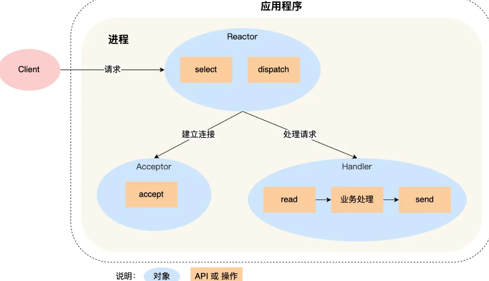

1. reactor对象通过select监听事件，收到事件后通过dispatch进行分发
2. 如果是建立连接的事件，则分发给acceptor对象，齐通过accept方法获取连接并创建一个handler对象，handler对象继续处理后续响应事件
3. 不是连接建立事件，则交由当前连接对应的handler对象来响应，handler通过read->业务处理->send的流程来完成业务流程

缺点：

- 单进程无法充分利用多核CPU性能
- handler在业务处理时无法处理其他连接事件

单reactor单进程的方案只适用于业务处理非常快的场景，不适用计算密集型的场景

redis6.0之前使用的是这种方案

### 单reactor多线程/多进程
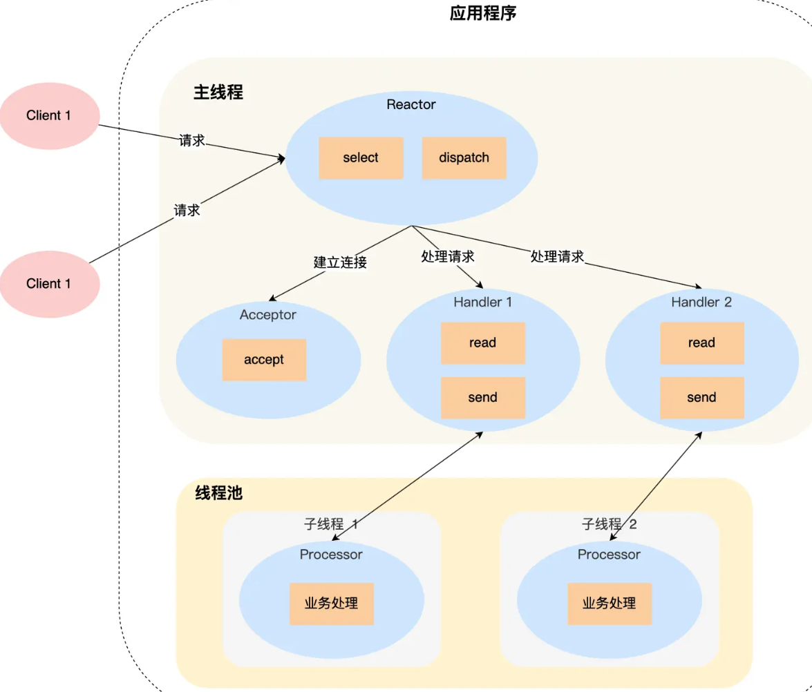

1. reactor对象通过select监听事件，收到后通过dispatch进行分发

2. 如果是建立连接，交由acceptor对象

3. 不是建立连接，交由handler对象

   这三个步骤和上面相同，接下来才不一样

4. handler对象不再负责业务处理，只负责数据的接发，handler对象通过read读取到数据后，将数据发给子线程里的processor对象进行业务处理

5. 子线程里的processor对象进行业务处理，处理完成后发给主线程的handler对象，handler通过send方法将响应结果发给client

单reator多线程能够充分利用多核CPU，但也带来了多线程竞争资源的问题

但reator多进程相比reactor多线程实现起来很麻烦，需要考虑父子进程的双向通信，因此几乎没有实际应用

但因为主线程一个reactor对象承担所有事件的监听响应，reactor的模式存在瞬间高并发的场景时出现性能瓶颈，

### 多reactor多进程/线程

**多reactor多线程**
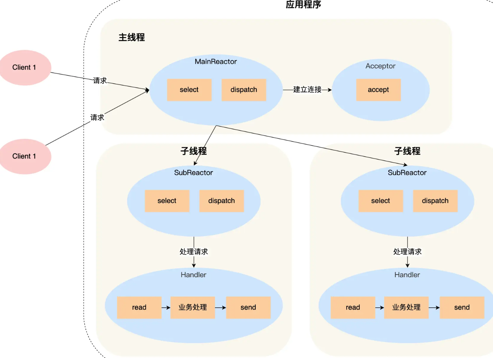

1. 主线程中的mainreactor对象通过select监控连接建立事件，通过acceptor对象的accept获取连接并分配给某个子进程
2. 子线程的subreactor对象将mainReactor对象分配的连接加入select继续进行监听，创建一个handler用于处理连接的响应事件
3. 有新事件发生时，subReactor对象会调用当前连接对应的handler对象进行响应
4. handler对象通过read->业务处理->send的流程来完成完整的业务流程

一个子线程可能对应多个连接和handler

多reactor多线程的方案实现起来比单reactor多线程的方案要简单：

- 主线程和子线程分工明确，主线程只负责接收新连接，子线程负责对该连接的后续处理
- 主线程和子线程的交互简单，主线程将新连接传给子线程，子线程无需返回数据，直接可以在子线程将处理结果发给客户端

memcache采用了这个方案

**多reactor多进程**

nginx采用了这个方案，与标准的多reactor多进程有些差异

主进程只用来初始化socket，创建mainReactor 来accept连接交给子进程的reactor，通过锁来控制一次只有一个子进程来进行accept，子进程accept新连接后放到自己的reactor进行处理，不再分配给其他子进程

## proactor

reactor是非阻塞同步网络模式，proactor是异步网络模式

**阻塞IO**：调用read函数时，一直等待到数据准备好并从内核拷贝数据到应用程序时再返回

**非阻塞IO**：调用read函数，如果没有数据就立即返回，如果有数据，会将数据从内核拷贝到应用程序，再返回，而这个拷贝的过程是阻塞的

对于异步I/O而言是内核数据准备好和数据从内核态拷贝到用户态这两个过程都不用等待

> 发起aio_read(异步I/O)之后，就立即返回，内核将数据从内核空间拷贝到用户空间，这个过程是异步的，内核自动完成。

即reactor是非阻塞同步网络模型，感知的是就绪可读性事件。proactor是异步网络模式，感知的是已完成的读写事件
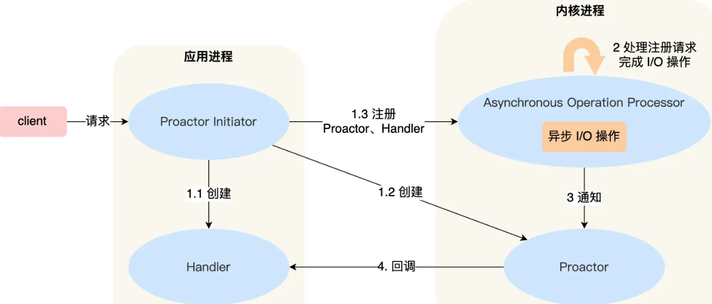

1. proactor initiator负责创建proactor和handler对象，并将proactor和handle都通过asynchronous operation processor注册到内核
2. asynchronous operation processor负责注册请求，并处理I/O操作
3. asynchronous operation processor完成I/O操作后通知proactor
4. proactor根据不同的事件类型回调不同的handler进行业务处理
5. handler完成业务处理

但linux下的异步I/O不完善，aio系列函数是由POSIX定义的异步操作接口，不是操作系统级别支持的，而是在用户空间模拟处理的异步，并只支持本地文件的aio异步操作，不支持socket。这使得linux的高性能网络程序都使用reactor方案

window里实现了一套完整的支持socket的异步编程接口IOCP，是操作系统级别实现的异步I/O，因此windows里实现高性能网络程序可以使用proactor方案

# 一致性哈希

## 问题背景

大多网站背后都有多台服务器构成集群提供服务，对不同节点分配客户端请求这就是负载均衡问题。

最简单的方式，引入一个中间的负载均衡层，将外界的请求**轮流**转发给内部的集群，考虑到每个节点的硬件配置有区别，因此可以引入权重值，实现**加权轮询**。

而这建立在每个节点存储的数据都是相同的前提，访问任意一个节点都能得到结果。但如果是**数据分片的分布式**系统，每个节点数据不一致就不能随意分配客户端请求

如果为了提高系统容量而将数据水平切分到不同的节点存储，即对于一个分布式KV缓存系统，某个key应该到哪个节点是确定的

因此需要有一个应对分布式系统的负载均衡算法

**@ 使用哈希算法有什么问题**

例如分布式系统中有3个节点，基于hash(key)%3公式对数据进行映射

致命问题是当节点数据发生了变化，也就是对系统作扩容或缩容，因为数据和节点的映射改变了，因此必须做数据迁移，而最坏情况下所有数据都要迁移

## 一致性哈希算法

哈希算法是对节点数据取模，而一致哈希算法是对2^32进行取模运算，是固定值

一致哈希算法将2^32取模运算的结果值组织成一个圆环，即哈希环

**一致性哈希要进行两步哈希**

第一步：对存储节点进行哈希计算，根据节点的IP地址进行哈希映射
第二部：对数据进行存储和访问时，对数据进行哈希映射

一致性哈希是指将存储节点和数据都映射到一个首位相连的哈希环上

**当对指定key进行读写时**：先对数据进行哈希计算，确定key在环上的位置，然后映射的结果值往顺时针方向找到第一个节点，就是存储该数据的节点

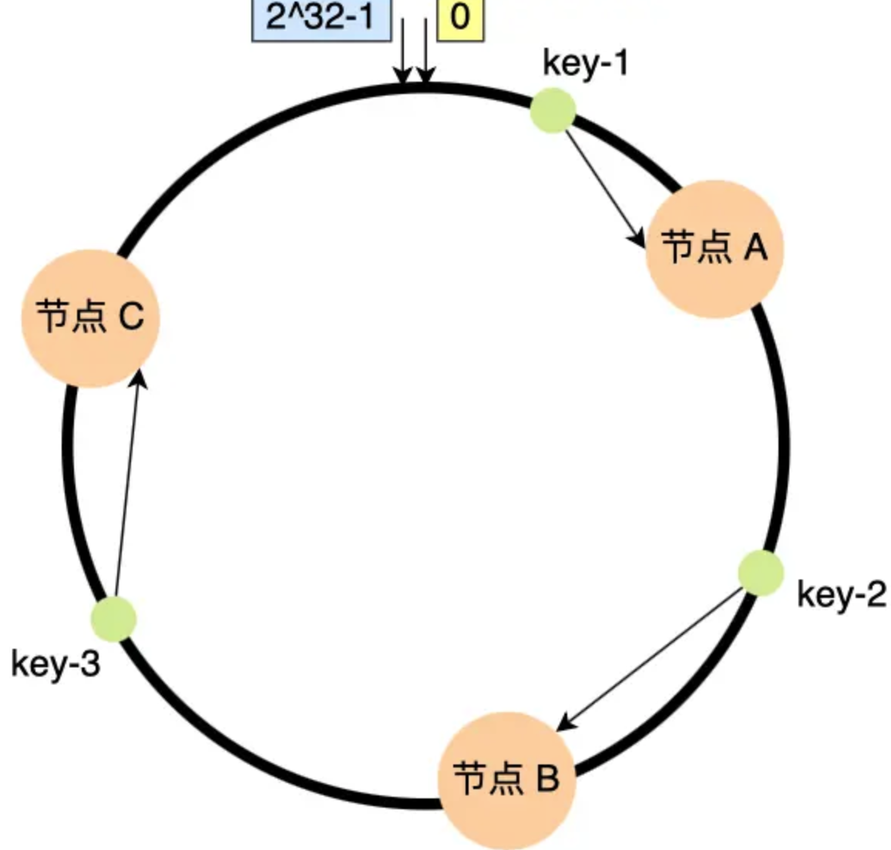

当增加一个节点时，只有一个节点的数据需要迁移

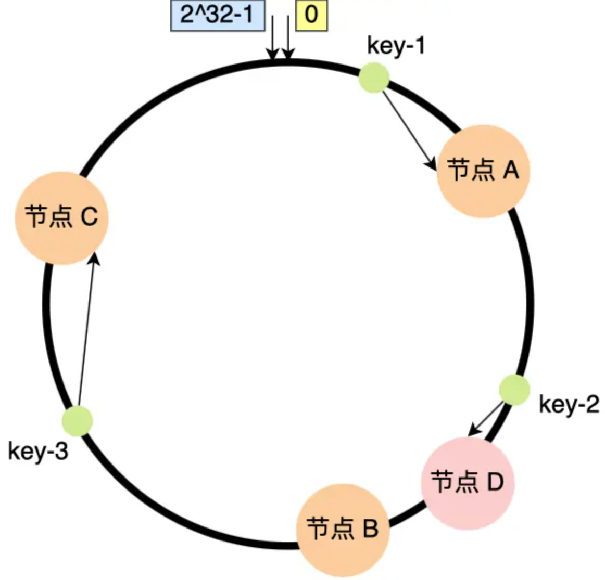

但减少一个节点时，同样也只有一个节点需要做数据迁移

**问题：**

在实际情况，一致性哈希算法并不能保证节点能够在哈希环上分布均匀，可能出现大量的请求集中在一个节点上。以及进行容灾和扩容时，哈希环上的相连节点任意收到过大影响，引发雪崩式的连锁反应

例如，下图A节点崩溃，导致B一下子处理大量数据和访问量，再崩溃，连锁下去

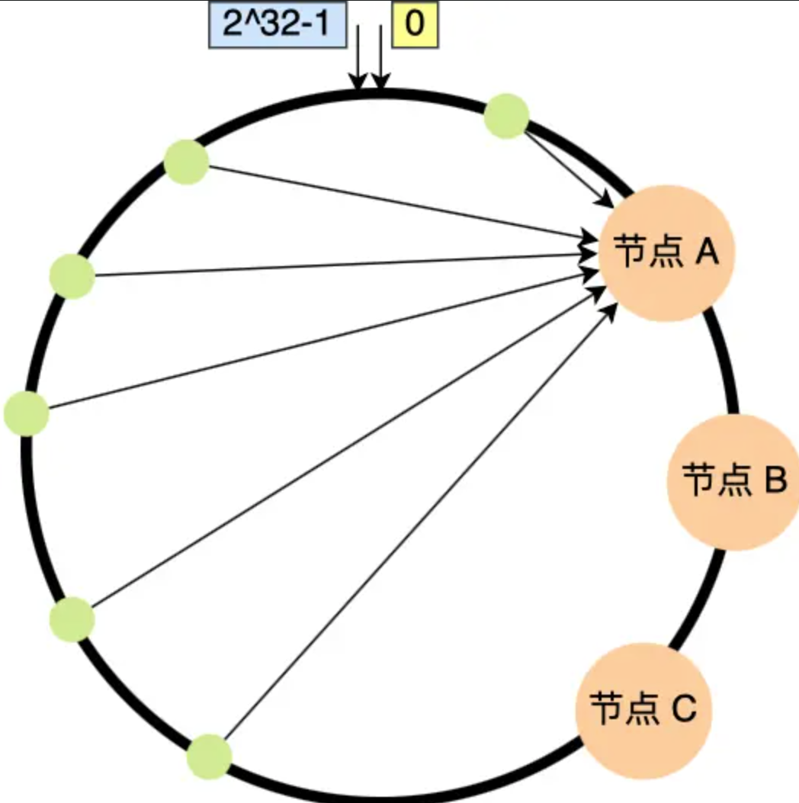

**虚拟节点**

想要解决节点在哈希环上分配不均匀的问题，就要有大量的节点，节点数越多，分布越均匀

实际中没有那么多节点，因此就需要加入虚拟节点，对真实节点作多个副本

不再将真实节点映射到哈希环上，而是将虚拟节点映射到哈希环上，并将虚拟节点映射到实际节点，例如：对节点A加上编号来作为虚拟节点：A-01、A-02、A-03，节点B、C同理

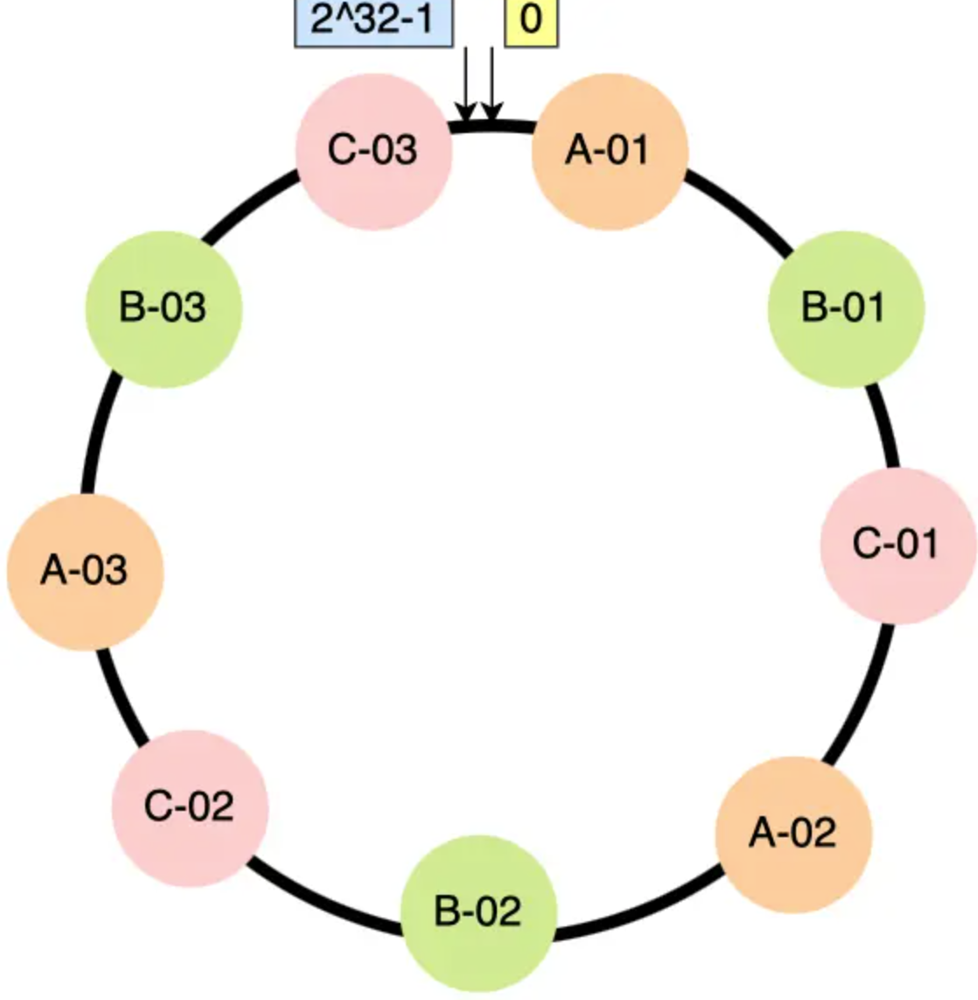

此时，有访问请求寻址到A-01，再寻址到A节点

实际工程中，如nginx的一致性哈希算法，内阁权重为1的真实节点有160个虚拟节点。对于硬件配置更好的节点（权重更高）增加更多的虚拟机节点

提升节点的均衡度和系统的稳定性，当某个节点被移除时，对应该节点的多个虚拟节点均会移除，这些虚拟节点顺时针方向的下一个虚拟节点对应不同的真实节点，从而平坦了节点变化导致的压力。

