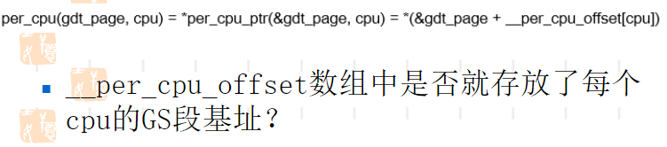

# 段表

Owner: -QVQ-

# 指针变量存放的信息

`int a[3];`

`a+2 = 1;`

指针变量里并没有存放类型信息：

在编译时，会根据指针类型选择不同的赋值语句，不同的指针类型的计算对应不同的mov指令，

X86的地址转化中，分页可以通过软件关闭，分段不能

逻辑地址通过分段转为线性地址，再通过分页转为物理地址。在CPU执行指令时，通过代码段寄存器（CS，Code Segment）和指令指针寄存器（IP，Instruction Pointer）来确定要执行的下一条指令的内存地址。但在现有的操作系统环境中，分段被系统跳过了，现在的CPU也实现了跳过分段系统，所以逻辑地址就等同于线性地址，程序在访问内存的时候还是直接给出相应单元的实际物理地址。

在早期受限于价格和技术水平，当时的CPU和寄存器的宽度仍然为16位。为了便利地实现多道程序并发运行，也就需要支持对各个程序进行重定位，因为如果不支持重定位，凡是涉及到内存访问的地方都需要将地址硬编码，进而必须把某个程序加载到内存的固定区间。有了分段机制，程序中只需要使用基于段的相对地址，然后更改段基址，就可以方便地对程序进行重定位。分段系统使得可以 使16位寄存器来寻址20位的内存空间。

而现在CPU寄存器都为64位可以寻址全部的内存空间了，所以分段机制已被跳过，现在仅仅用于一些权限检查。

段基址存放在寄存器中，ptr只能存放偏移量

# 证明分段机制被绕开了

在写c时并不需要考虑段基址，编译器和操作系统都起了作用

GDT段描述符里放了段基址和偏移量。

GDTR寄存器存放了GDT表，32位如下

64位GDTR占64位的基地址+16位的limit共80位

段寄存器里，15-3为偏移量，2bit代表是指向GDTR还是TDTR，现在都是指向GDTR，1-0bit代表4个运行级别，0为内核，3为用户态，2和1未使用

## 探索操作系统是如何使用CPU提供的分段管理机制（32位下）

读出GDTR寄存器、GDT表、段寄存器

只能在内核访问，所以编写内核模块。

程序步骤：

编写用户态程序，获取其CS、DS、SS，弄清使用的是GDT或者LDT，

进入内核，读取GDTR寄存器，获取GDT的基地址

打印出GDT表格的内容，并找出各个段寄存器对应的表项，即段描述符

分析段描述符内的基地址、段界限等信息

### 用户态的代码

输出cs\ds\ss的值

并调用write函数调用内核模块

输出：

### 内核态的代码

01110表示对应GDT表项的14项

输出cs\ds\ss的值

通过内联汇编sgdt读取gdtr的值，gdtr为6个字节48位，为32字节的段基址和16位的GDT表的范围

gdtr+2能读到48-13位的地址，即段基址

输出：

01100表示对应内核表项的第14项

查看内核输出信息

GDT表每一项8字节，8*14=70因此地址应该在第70

### 对GDT表项的解读

打印出来的GDT表：

左边是低地址右边是高地址，所以应该反过来读

对于上面这行应该是00  CF FB 00 00 00 FF FF 

通过查找X86手册查看GDT表项，即段描述符

对于00  CF FB 00 00 00 FF FF

低四个字节00 00 FF FF表示 ，段基址的15-0bit为00 00，**段大小的15-0bit为FF FF**

高四个字节00  CF FB 00转为2进制为0000 0000 1100 1111 1111 1011 0000 0000，表示，7-0bit的000表示段基址的23-16bit为000，**19-16bit为1111代表段界限的19-16bit为1111**，31-24bit为0000 0000代表段基址31-24bit为0000 0000

整理一下得到段基址base的值为OX00 00 00 00，段界限limit的值为1111 1111 1111 1111 1111，段表大小为4KB，即12位，加上段界限的20位刚好是32位。

而对于GDT表内的所有表项分析能发现所有的表项都是段范围范围为全范围，即Linux将应用程序的代码段范围设为了32位地址的全范围。

从而确认内核跳过了分段机制

## Flat Memory Model平坦内存模型

全局只有一个段，相当于没有段，感觉起来绕开了分段机制，因此即使没有意识到使用的是偏移量，程序也正常经常使用线性地址空间，代替逻辑地址空间通常编程时，不用关心段寄存器

不仅Linux使用flat内存模型，windows也采用了在x64中，忽略了段描述符中的段基址和段界限。即cpu直接支持flat模式

fs、gs例外

# 内核管理GDT表的源码侦察

## 找到GDT表数据结构

关键点：GDTR寄存器需要专门指令lgdt、sgdt

在源码文件中搜索出现了lgdt指令的地方

能找到如下多个文件：

排除掉定义的文件，

1. arch/x86/include/asm/desc.h:中

    
    有对他的定义，但这里有条件编译，往前追溯能发现这里满足条件，因此这里的定义是无效的
    
2. 对于arch/x86/kernel/paravirt.c:

    
    出现了函数的挂载，继续找pv_cpu_ops.load_gdt出现的地方
    

能找到如下的多个文件，排除定义，

[**/**](https://elixir.bootlin.com/linux/v5.6.18/source)[arch](https://elixir.bootlin.com/linux/v5.6.18/source/arch)/[x86](https://elixir.bootlin.com/linux/v5.6.18/source/arch/x86)/[include](https://elixir.bootlin.com/linux/v5.6.18/source/arch/x86/include)/[asm](https://elixir.bootlin.com/linux/v5.6.18/source/arch/x86/include/asm)/[paravirt.h](https://elixir.bootlin.com/linux/v5.6.18/source/arch/x86/include/asm/paravirt.h)：

函数名为load_gdt表明为 装载GDT表的功能，PVOP_VCALL1这个宏或者函数也表明这可能是调用装载GDT表。事实上这个函数的确是装载GDT表，因此我们去找调用load_gdt函数的地方，看看是怎样对GDT做操作的

[**/**](https://elixir.bootlin.com/linux/v5.6.18/source)[arch](https://elixir.bootlin.com/linux/v5.6.18/source/arch)/[x86](https://elixir.bootlin.com/linux/v5.6.18/source/arch/x86)/[kernel](https://elixir.bootlin.com/linux/v5.6.18/source/arch/x86/kernel)/[cpu](https://elixir.bootlin.com/linux/v5.6.18/source/arch/x86/kernel/cpu)/[common.c](https://elixir.bootlin.com/linux/v5.6.18/source/arch/x86/kernel/cpu/common.c)：

address可能为段基址，size可能是段大小

这里[**`get_cpu_gdt_rw**](https://elixir.bootlin.com/linux/v5.6.18/C/ident/get_cpu_gdt_rw)(cpu);`函数很可能就是对 GDT表的管理方式，而其中的参数CPU是作为int型传入的，可能代表是哪个CPU，因此可以猜测是否每个CPU都有自己的GDT表项

继续追[**`get_cpu_gdt_rw`**](https://elixir.bootlin.com/linux/v5.6.18/C/ident/get_cpu_gdt_rw)查找gdt_page的实例

[**/**](https://elixir.bootlin.com/linux/v5.6.18/source)[arch](https://elixir.bootlin.com/linux/v5.6.18/source/arch)/[x86](https://elixir.bootlin.com/linux/v5.6.18/source/arch/x86)/[include](https://elixir.bootlin.com/linux/v5.6.18/source/arch/x86/include)/[asm](https://elixir.bootlin.com/linux/v5.6.18/source/arch/x86/include/asm)/[desc.h](https://elixir.bootlin.com/linux/v5.6.18/source/arch/x86/include/asm/desc.h)

找到gdt_page的定义，在文件arch/x86/include/asm/segment.h的定义：

其中[**/**](https://elixir.bootlin.com/linux/v5.6.18/source)[arch](https://elixir.bootlin.com/linux/v5.6.18/source/arch)/[x86](https://elixir.bootlin.com/linux/v5.6.18/source/arch/x86)/[include](https://elixir.bootlin.com/linux/v5.6.18/source/arch/x86/include)/[asm](https://elixir.bootlin.com/linux/v5.6.18/source/arch/x86/include/asm)/[desc_defs.h](https://elixir.bootlin.com/linux/v5.6.18/source/arch/x86/include/asm/desc_defs.h)中定义了

对比intel手册结构体和 GDT表项的定义一致，

至此确认 `[**desc_struct](https://elixir.bootlin.com/linux/v5.6.18/C/ident/desc_struct)`就是段表**

## GDT管理方式

内核进程栈大小为8KB，ulimit -s

# 直接访问gdt_page时的bug

编写程序输出gdt_table[4]会报错：

从输出来看这是用户态的地址，而且很小，这说明gdt_table[4]中存放的很可能是偏移量而不是实际的地址

反汇编一下

平坦内存模型下，fs、gs段特殊一些，基地址不是0，所以可能gdt_table可能是在fs或者gs段内

编写内核模块用内联汇编，假设gdt_table是fs或者gs的偏移量，直接通过偏移量访问寄存器的值

执行后发现gs打出了值，fs报错

从而说明，gdt_table放在 gs段内

gs段在64位下用在per cpu

fs段用在TLS线程局部存储

32位下相反

MSR类寄存器需要rdmsr、wrmsr指令读取，不能用mov访问

rdmsr指令后，高4字节在edx，低4字节在eax

> 为了找到和这个指令相关的宏定义是哪个文件，而逐一将可能的文件修改成无法编译通过，一个个尝试，直到有一次编译不过即可，那么调用的就是那次编译不过改的文件
> 

写模块打印出这个数组的部分值

可以看出数组[0]和段基址的值是一样的，从而猜测数组就是存放每个 CPU的段基址。但这个数组有8192个值，我们只打出了钱10个 的值。

写模块在用户进程创多个线程分别打印，从而有高概率不同线程在不同CPU上运行，打出不同的值

最后得出在不同CPU上运行的GS段基址确实对应了数组的值

进一步提出问题：为什么每个CPU都有一个GS段，是否每个CPU都有gdt_page，进一步 是否每个线程都有

### __thread关键字，为什么同一份代码，能操作不同的变量

gcc提供了__thread关键字，被其声明的变量将在每个线程中都有一份（线程局部存储TLS）

输出：

可以看出他们不是同一份x变量

尝试输出他们的地址，发现他们的地址不一样

为什么同一份代码，能操作不同的变量？

尝试反汇编 一下：

从而可以看出每个线程都有自己的fs段，所以加上偏移量后能访问不同的地址

所以per_cpu约等于per__thread代表的是每一个线程

### per_cpu的好处

一是提高并发性，每个线程有自己的 空间做运算。如果用多线程对同一全局变量操作需要互斥锁会影响性能。但用per_cpu每个线程计算自己的部分在最后统一加起来得到总值从而提高并发性。

另一个好处是减少cache冲突。如果在多线程下，有多少个线程就分配多少个数组，每个线程对自己的数组部分计算，虽然线程间不需要上锁了，但是数组的每个空间都在一个缓存行(cache line)里面，各个线程都要访问一个cache line影响性能。per_cpu每个线程有自己的存储空间，减小了cache冲突的概率

内核提供了宏this_cpu_ptr获取per_cpu指针对应的线性地址

this_cpu_off是一个per cpu变量，保存了当前CPU的per_cpu区域的起始线性地址

ptr是偏移量