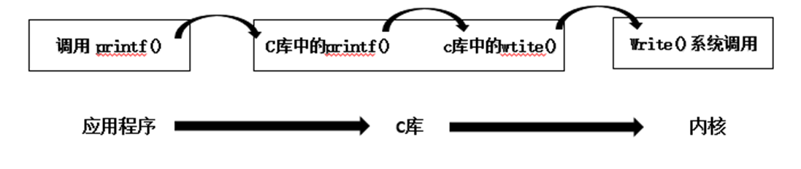
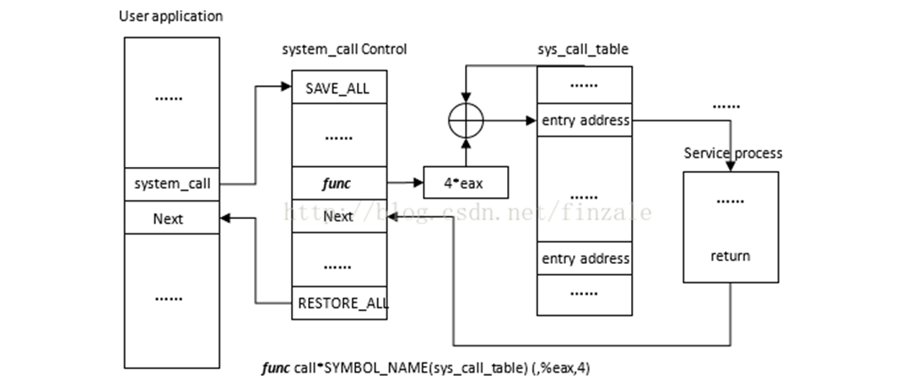
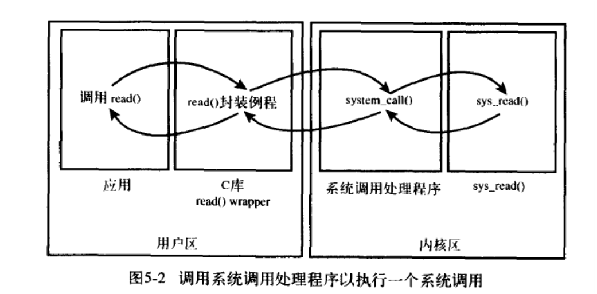
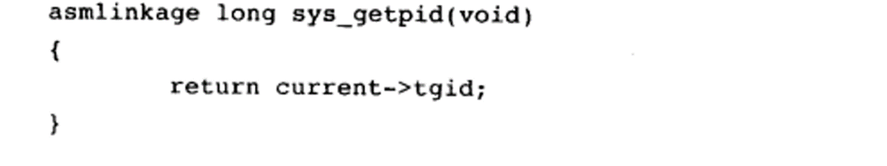
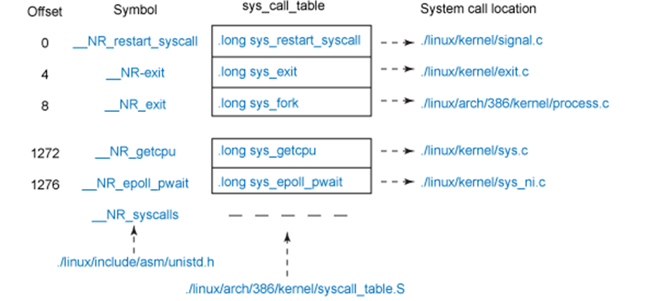

# 系统调用

Owner: -QVQ-

系统调用在用户空间进程和硬件设备之间添加了一个中间层。该层主要作用有三个

为用户空间提供了一种统一的硬件的抽象接口。

系统调用保证了系统的稳定和安全。作为硬件设备和应用程序之间的中间人，内核可以基于权限和其他一些规则对需要进行的访问进行裁决。

每个进程都运行在虚拟系统中，而在用户空间和系统的其余部分提供这样一层公共接口，也是出于这种考虑。如果应用程序可以随意访问硬件而内核又对此一无所知的话，几乎就没法实现多任务和虚拟内存，当然也不可能实现良好的稳定性和安全性。

在Linux中，系统调用是用户空间访问内核的惟一手段；除异常和中断外，它们是内核惟一的合法入口。

# POSIX

是 **可移植操作系统接口**的一种规范，Linux基本上逐步实现了POSIX兼容

Linux的系统调用向大多数Unix系统一样，作为C库的一部分提供

C库实现了Unix系统的主要API，包括标准C库函数和系统调用。所有的C程序都可以使用C库，此外，C库提供了POSIX的绝大部分API。


Unix系统调用在出现错误的时候会把错误码写入errno全局变量。通过调用perrno()库函数，可以把该变量翻译成用户可以理解的错误字符串。

# 系统调用流程


用户空间的程序无法直接执行内核代码，他们不能直接调用内核空间中的函数，因为内核驻留在受保护的地址空间。

通知内核的机制是靠软中断实现的：通过引发一个异常来促使系统切换到内核态去执行异常处理程序。此时的异常处理程序实际上就是系统调用处理程序。

调用流程如下：


1. 在用户空间（user application）中，当系统调用发生（system_call）时，产生int $0x80指令，CPU被切换到内核态
2. 执行中断向量表IDT对应的0x80中断处理函数，即跳转到了system_call()的入口(system_call control)，
3. system_call()函数检查系统调用号(func)，到系统调用表sys_call_table中，根据sys_call_table的基址加上eax*4的偏移量，找到该系统调用（号）对应的内核函数入口(entry address)
    
    System_call()函数通过将给定的系统调用号与NR_syscalls做比较来检查其有效性。如果它大于或者等于NR_syscalls，该函数就返回-ENOSYS。否则就执行相应的系统调用。
    
4. 接着调用这个内核函数
    
    (在x86上，系统调用号是通过eax寄存器传递给内核的)
    
    对应的调用函数`call *sys_call_table(, %eax, 4)`调用系统调用处理程序以执行一个系统调用
    
5. 然后返回，当系统调用返回的时候，控制权仍然在system_call()中，他最终会负责切换到用户空间并让用户进程继续执行下去。

### 例如：getpid（）系统调用

系统调用get_pid()在内核中被定义为sys_getpid()


系统调用都需要asmlinkage限定词，通知编译器仅从栈中提取该函数的参数

# 系统调用实现

## 原则：

- 决定它的用途
- 决定参数、返回值和错误码
- 系统调用的接口应该力求简洁，参数尽可能少
- 系统调用设计得越通用越好

## 系统调用的上下文问题

内核在执行系统调用的时候处于进程上下文。Current指针指向当前任务，即引发系统调用的那个进程。
在进程上下文中，**内核可以休眠，**比如在系统调用阻塞或显式调用schedule()的时候可以被抢占。**必须保证系统调用是可重入的**。

## 参数传递

在x86系统上，ebx、ecx、edx、esi和edi按照顺序存放前五个参数。

给用户空间的返回值也通过寄存器传递。在x86系统上，存放在eax寄存器中

## 系统调用号

在linux系统中，每个系统调用被赋予一个系统调用号存储在sys_call_table中，其指明了

系统调用对应的系统调用号，它与体系结构有关，一般在entry.s中定义

下图是sys_call_table示例


# 系统调用的性能

Linux系统调用比其它许多操作系统执行的要快，linux令人难以置信的上下文切换时间是一个重要原因，进出内核都被优化得简洁高效。另一个原因就是系统调用处理程序和每个系统调用本身也都非常简洁。

# 实验：用系统调用实现在内核做加法运算

四则函数原型：long my_oper(int* result, int num1, int num2, char* op)

系统函数原型：long my_func(int count)，调用my_oper实现四则运算

## 添加系统调用的具体实现

在内核目录kernel/sys.c，添加具体的实现

`SYSCALL_DEFINE1(my_func,int,count){…}`

SYSCALL_DEFINE后面的1代表系统调用参数的个数，是宏定义

`long my_func(int* result, int num1, int num2, char* op)`

```c
long add_cal_func(int* result, int num1, int num2, char* op){
if(op)
{
        if(*op == '+')
                *result = num1 + num2;
        else if(*op == '-')
                *result = num1 - num2;
        else if(*op =='*')
                *result = num1 * num2;
        else if(*op =='/')
        {
                if(num2 != 0)
                        *result = num1/num2;
                else{
                        printk("divided number can't be zero.\n");
                        *result = 0;
                }
        }
}
else
        printk("operator is empty.\n");
return 0;
}
SYSCALL_DEFINE3(add_cal_func,int, count, int, num1, int, num2){
        //不传入参数，直接计算count次
        if(num1 == 0){
                int result;
                printk("cal start1, count is:%d\n", count);
                for(int i = 0; i < count; i++){
                        char op_add = '+';
                        add_cal_func(&result,10,10,&op_add);
                }
                printk("add cal success!\n");
        }
        else{
                printk("cal start2, count is:%d\n", count);
                char op_add = '+';
                int result = 0;
                add_cal_func(&result, num1, num2, &op_add);
                printk("%d + %d = %d\n", num1, num2, result);
        }
        return 0;
}
```

## 添加系统调用的声明

在内核目录下修改修改include/linux/syscalls.h，添加

`asmlinkage long sys_my_func(int count);`

注意不要加入到条件定义里了

```c
asmlinkage long sys_add_cal_func(int count, int num1, int num2);
```

## 修改系统调用向量表

修改`arch/x86/entry/syscalls/syscall_64.tbl`

`333 64 my_oper sys_my_func`

此处的系统调用号必须与之前声明的保持一致，my_func为调用函数名，sys_my_func为实际调用的函数

```c
548     64      add_cal_func            sys_add_cal_func
```

注意中间是换行符不是空格

## 编译