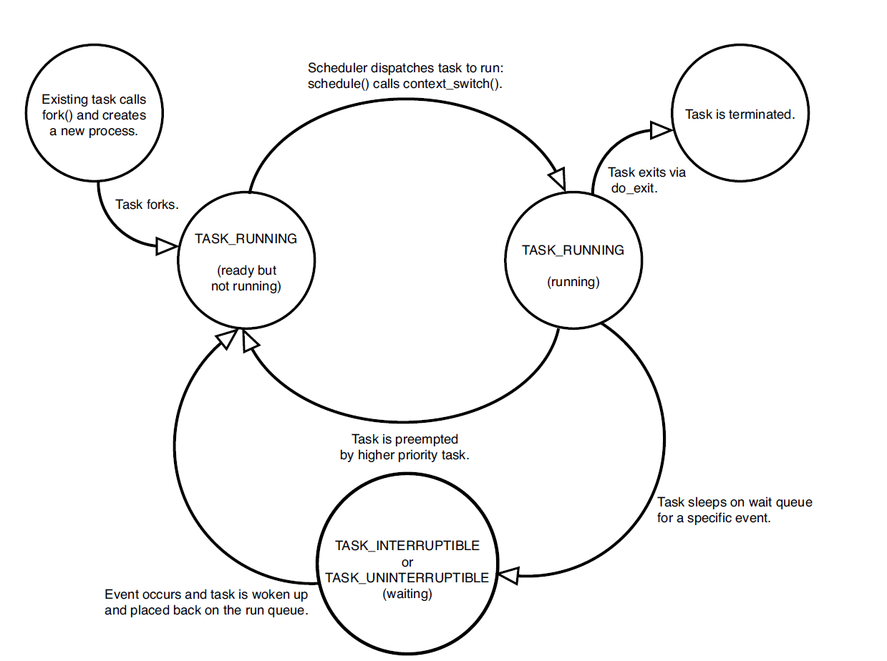
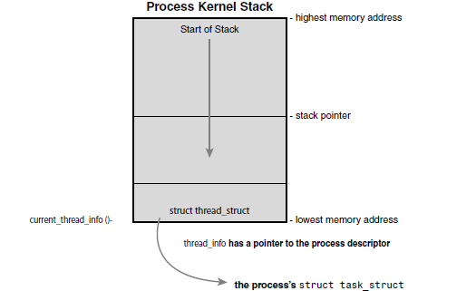

# 进程

Owner: -QVQ-

注意 通常任务指一个静态的程序，进程指一个动态的，运行起来的程序（任务）

# **进程描述符及任务结构**

任务队列（task list）的双向循环链表，存放进程描述符（process descriptor），即`task_struct`。定义在<linux/sched.h>

通过`current`宏**获取当前进程的task_struct数据结构**，该宏的实现依特定硬件体系结构不同而不同

当程序调用系统调用（system call）或者触发异常（exception）时，陷入（trap）内核空间。此时，我们称内核“代表进程执行”并处于进程上下文（context）中。在此上下文中`current`宏是有效的。

## `task_struct`的数据结构

固定存在

 `volatile long	state;`//进程状态

`struct **list_head  tasks**;`//进程队列

`int pid`;//进程标识符

`int  exit_code`//进程的退出码

mm_struct描述一个进程的地址空间

……

## 进程状态（**`volatile** long	state;`）

系统中的每个进程必然处在五种状态其一：

- `TASK_RUNNING` 运行：进程是可执行的，正在执行或在运行队列中等待执行，这是进程在用户空间中唯一可能的状态
- `TASK_INTERRUPTIBLE` 可中断：进程正在睡眠（被阻塞），等待一些条件满足时，转入`TASK_RUNNING`
- `TASK_UNINTERRUPTIBLE` 不可中断：与可中断不同的是，对信号不做响应，通常在进程必须在等待时不受干扰或等待事件很快会发生时出现，使用较少
- `__TASK_TRACED`：被其他进程跟踪的进程，如通过ptrace对调试程序进行跟踪
- `__TASK_STOPPED` 停止：进程停止执行，通常发生在收到SIGSTOP，SIGTSTP，SIGTTIN，SIGTTOU等信号时。


设置当前进程状态，通常使用`set_task_state(task, state)`函数<linux/sched.h>

## **进程描述符的**分配


slab分配器动态生成`task_struct`，在栈底（向下增长的栈）创建一个`struct thread_info`(<asm/thread_info>),`thread_info`中task指针指向`task_struct`

```cpp
struct thread_info {
		struct task_struct *task;//进程描述符
		struct exec_domain *exec_domain;
		__u32 flags;
		__u32 status;
		__u32 cpu;
		int preempt_count;
		mm_segment_t addr_limit;
		struct restart_block restart_block;
		void *sysenter_return;
		int uaccess_err;
};
```

## 进程描述符PID

进程标识值（process identification value），简称PID，PID实际上是个int类型，最大值默认为32768，存放在各自的进程描述符中，这个最大值实际上就是系统允许同时存在进程数的最大值。管理员可通过修改`/proc/sys/kernel/pid_max`来提高上限以应对各种场景。.

PID在linux下实际上对应的是线程号，TGID表示进程组，实际上对应进程ID，通常由这个进程创建的第一个线程号PID为TGID

# 线程资源

## 共享的内容

文件描述符表，用户id，用户组id，信号处理方式，工作目录

## 独有的内容

- 调用栈：如果共用一个栈空间会有栈混乱的问题。主线程使用栈空间，其他线程使用共享区的空间
- 寄存器：
- PID
- errno错误码
- 信号屏蔽字：每个线程对应的task_struct结构中存储了阻塞位图
- 调度优先级

## 多线程的优劣

1. 并行效率：对于计算密集型，可以拆分任务，并行计算
    
    对于IO密集型，可以执行不同的IO操作
    
2. 线程切换比进程快

劣：

- 一个线程崩溃导致整个进程退出
- 线程切换有开销，应控制线程数量
- 有并发问题

## 进程家族树

与其他Unix系统类似，Linux中所有进程都是PID为1的`init进程`的后代，内核在系统启动的最后阶段启动init进程。该进程读取系统初始化脚本（initscript）并执行其他的相关程序，最终完成系统启动的整个过程。

系统中每个进程必有一个父进程，每个进程也可以拥有零或多个子进程。拥有同一个父进程的所有进程被称为兄弟（siblings）。

进程的家族树存放在`task_struct`中

`parent`：指向父进程的`task_struct`

进程中可通过如下代码获得父进程的结构：

`struct task_struct *my_parent = current->parent;`//current是一个宏指向当前`task_struct`

`children`:一个保护所有子进程的链表 

进程中可通过如下代码遍历子进程的结构：

```cpp
struct list_head *list;
list_for_each(list, &current->children) {
	struct task_struct *task = list_entry(list, struct task_struct, sibling);
/* task now points to one of current’s children */
}
```

`init进程`固定为`init_task`,可通过如下方式访问

`for (struct task_struct *task = current; task != &init_task; task = task->parent)`

实际上我们可以通过`task_struct`的**`tasks`**访问任意一个进程

`list_entry(task->tasks.next, struct task_struct, tasks)`//访问上一个进程

`list_entry(task->tasks.prev, struct task_struct, tasks)`//访问下一个进程

这两个操作封装成了宏`next_task(task) 、prev_task(task),`

`for_each_process(task)`宏提供了遍历所有的`task_struct`

# 进程线程创建

Linux中，

`fork`通过拷贝当前进程并创建一个子进程，父子的区别仅在于PID，PPID和部分资源及统计量。

`exec`负责读取可执行文件并将其载入地址空间开始运行。最终执行系统调用`execve`陷入内核

## clone的实现

`fork()`, `vfork()`, `__clone()`库函数都是调用系统调用`clone()`实现fork，由`clone()`<linux/sched.h>调用`do_fork()`。

`do_fork`定义在<kernel/fork.c>文件中。该函数调用`copy_process()`函数，然后让进程开始运行。copy_process返回指向子进程的指针。内核有意让子进程先执行，子进程立即调用`exec()`可以避免COW（copy-on-write）时如果父进程先运行并写入地址空间将产生一些额外开销。

`copy_process()`函数执行流程：

1. 调用dup_task_struct，创建内核栈、thread_info、task_struct，值等同于父进程的值
2. 检查子进程是否超过当前用户能创建的进程数量
3. 子进程为了区别父进程，将部分值初始化（刚开始先全部复制过来，再修改），其中`task_struct`完全不变
4. 子进程的状态设置为`TASK_UNINTERRUPTIBLE`确保他并不会立马运行
5. 调用`copy_flags`去设置`task_struct`中的一些标识位，`PF_SUPERPRIV`位设置子进程的管理员权限，`PF_FORKNOEXEC`标识是否有调用exec（）
6. 调用`alloc_pid`去分配一个pid
7. 根据标识位去 执行clone或者copy_process去 复制或者共享一个打开的文件、文件系统信息、信号量、进程地址空间、命名空间。线程中用共享，进程中用复制
8. 返回指向子进程的指针

clone的参数列表

| CLONE_FILES
   | Parent and child share open files. |
| --- | --- |
| CLONE_FS  | Parent and child  share filesystem information. |
| CLONE_IDLETASK  | Set PID to zero (used only  by the idle tasks). |
| CLONE_NEWNS  | Create a new namespace for  the child. |
| CLONE_PARENT |  Child is to have  same parent as its parent. |
| CLONE_PTRACE  | Continue tracing
  child. |
| CLONE_SETTID  | Write the TID
  back to user-space. |
| CLONE_SETTLS  | Create a new TLS  for the child. |
| CLONE_SIGHAND  | Parent and child  share signal handlers and blocked signals. |
| CLONE_SYSVSEM  | Parent and child
  share System V SEM_UNDO semantics. |
| CLONE_THREAD  | Parent and child are in the  same thread group. |
| CLONE_VFORK  | vfork() was used and the  parent will sleep until the child wakes it. |
| CLONE_UNTRACED  | Do not let the tracing  process force CLONE_PTRACE on the |
| CLONE_SYSVSEM |  Parent and child  share System V SEM_UNDO semantics. |
| CLONE_STOP |  Start process in the TASK_STOPPED state. |
| CLONE_SETTLS  | Create a new TLS  (thread-local storage) for the child. |
| CLONE_CHILD_CLEARTID  | Clear the TID in the  child. |
| CLONE_CHILD_SETTID  | Set the TID in the  child. |
| CLONE_PARENT_SETTID  | Set the  TID in the parent. |
| CLONE_VM  | Parent and child  share address space. |

## `fork`创建进程

`fork()`：  `clone(SIGCHLD, 0);`

Linux使用写时复制（copy-on-write）页实现fork，让父子共享同一份拷贝。只有在需要写入的时候，数据才会被复制，从而使各个进程拥有自己的拷贝。之前仅是以只读的方式共享

`fork()`的实际开销就是复制父进程页表以及给子进程创建唯一PID。

## `vfork`创建进程

`vfork`除了不拷贝父进程的页表项外，与fork功能相同。子进程作为一个单独的线程在他的地址空间里运行，父进程被阻塞，直到子进程退出或执行`exec()`。子进程不能向地址空间写入。不推荐使用vfork，它的实现并不优良。

`vfork()`： `clone(CLONE_VFORK **|** CLONE_VM **|** SIGCHLD, 0);`

## 线程的创建

inux把线程看作“轻量级进程“，有自己独立的task_struct，只是进程间共享资源的手段

与普通进程创建类似，只不过在调用`clone()`需要传递参数指明共享的资源：

`clone(CLONE_VM **|** CLONE_FS **|** CLONE_FILES **|** CLONE_SIGHAND, 0);`

### 内核线程

内核线程没有地址空间，mm指针指向NULL，他们仅在内核运行，可以被调度，可被抢占

运行`ps -ef`可以看到内核线程，有很多，类似flush和ksofirqd。

内核线程仅由其他内核线程创建，内核线程也是由内核进程kthreadd<linux/kthread.h>衍生而来，

**内核线程的创建**

`struct task_struct *kthread_create(int (*threadfn)(void *data),void *data,const char namefmt[],...)`

新进程将运行threadfn函数，并向其传递data参数，该进程将被命名为namefmt，它在变量参数列表中接受打印样式的格式化参数。

一个新任务是由kthread内核进程通过`clone()`系统调用创建的。

进程在不可运行状态下创建;在通过`wake_up_process`显式唤醒之前，它不会开始运行。一个进程可以通过kthread_run()函数创建并运行:

`struct task_struct *kthread_run(int (*threadfn)(void *data),void *data,const char namefmt[],...)`

这是一个宏，简单的调用了`kthread_create`和`wake_up_process`

**内核线程的终结**

它自己调用`do_exit`或者其他程序调用`kthread_stop()`

`int kthread_stop(struct task_struct *k)`

# 进程的终止

### **删除进程资源**

通常进程的终止由进程自身调用`exit`()系统调用显示的完成或者main结束后隐式的完成（c的汇编在main后面自动加上exit）。也可能进程接收到一个信号或者异常不能处理或者不能忽略。

不论一个进程如何终结，都会调用`do_exit()`<kernel/exit.c>：

1. 在`task_struct`中设置PF_EXITING标志位
2. 调用`del_timer_sync`来删除任何内核计时器。返回时，保证没有计时器排队，也没有计时器处理程序正在运行。
3. 如果BSD可用，调用`acct_update_integrals`写出统计信息
4. 调用`exit_mm`去释放这个进程有的mm_struct
5. 调用`exit_sem`,如果进程在排队等待IPC信号，退出排队
6. 调用`exit_files`和`exit_fs`递减文件描述符和文件系统数据，如果为0则关闭文件
7. `task_struct`中的`exit_code`成员存放了任务退出码，可能由exit提供，或者其他内核机制提供，供父进程查看进程退出状态
8. 调用`exit_notify`()将信号发送到任务的父进程，将任务的任何子进程重新定位到线程组中的另一个线程或init进程，并将任务的退出状态(存储在task_struct结构中的`exit_state`中)设置为EXIT_ZOMBIE。
9. 调用`schedule`作进程调度

此时，与该任务关联的所有对象(假设该任务是唯一的用户)都被释放。该任务不可运行(并且不再具有可运行的地址空间)，并且处于ExIT_zoMBIE退出状态。它占用的唯一内存是内核堆栈、thread_info结构和task_struct结构。任务的存在仅仅是为了向父任务提供信息。

> 特殊的，`wait()`一族函数都是通过唯一的系统调用`wait4()`来实现的。它的标准动作是挂起调用它的进程，直到其中一个子进程退出，此时函数返回子进程PID。调用该函数时提供的指针会包含子函数退出时的退出代码
> 

### **删除进程描述符**

调用`do_exit()`后， 系统还是保留了进程描述符。在父进程获得已终结的子进程信息后，通过调用`release_task`来释放`task_struct`。

`release_task`：

1. 调用__exit_signal()，然后调用__unhash_process()，后者依次调用detach_pid()从pidhash中删除进程并从任务列表中删除进程。
2. __exit_signal()释放所有剩余资源，并完成统计
3. 如果任务是线程组的最后一个成员，并且leader是一个僵尸进程，那么release_task()通知僵尸进程leader的父进程。
4. put_task_struct()来释放包含进程内核堆栈和thread_info结构的页面，并释放包含task_struct的slab缓存。

此时进程的所有信息删除完毕

### **孤儿进程造成的进退维谷**

父进程在子进程之前退出，必须有机制保证子进程能找到新的父亲，否则孤儿进程会在退出时永远处于僵死状态。解决办法是给子进程在当前线程组内找一个线程作为父亲，如果不行就用init作为父亲。