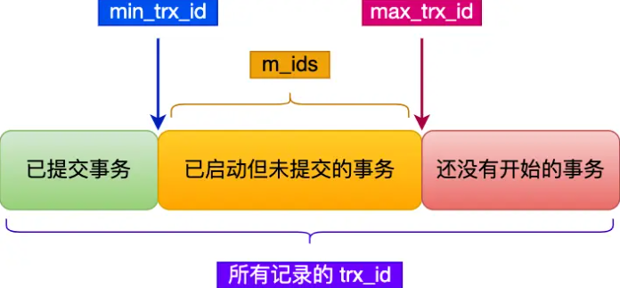
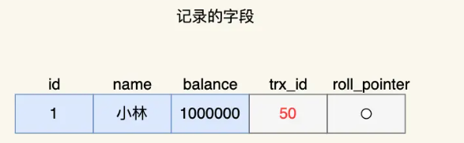
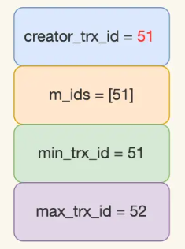
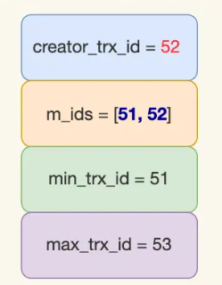
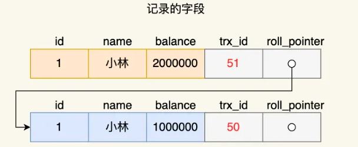

# 事务

Owner: -QVQ-

# 概念

**定义：**用户定义的一个数据库操作序列

**特性：**
原子性：如果事务中的某条执行失败，则整个事务回滚，都失败

通过undo log回滚日志来保证

隔离性：多事务并发执行，互不干扰。

MVCC或锁机制实现

永久性：一旦事务提交，他对数据的改变就是永久性的，接下来的其他操作或故障不应该对其结果有影响

redo log重做日志来保证

一致性：事务对数据库的作用应使数据库从一个一致状态到另一个一致状态（数据库只包含成功事务提交的结果）

持久性+原子性+隔离性保证

**故障分类：**
1、事务内部的故障
撤消故障事务的所有修改，使得故障事务就象没有运行一样。这类操作称为事务撤消（UNDO）。
2、系统故障：（软故障）指造成系统停止运转的任何事件，使系统要重新启动
撤销故障发生时未完成的事务，重做已完成的事务
3、介质故障：（硬故障）外存损坏
重装数据库，然后重做已完成的事务
4、计算机病毒
数据库恢复策略
数据转储：备用的数据称为后备副本
转储的状态：静态转储：转储期间  不允许  对数据库进行操作
                      动态转储：转储期间    允许    对数据库进行操作
转储方式       海量转储：每次转储全部数据库
                      增量转储：只转储上次转储后更新过的数据

**日志文件：**
定义：是用来记录事务对数据库的更新操作的文件。
作用：在数据库恢复中起着重要的作用。并协助后备副本进行介质故障恢复
动态维护日志文件的方法：周期性地执行建立检查点、保存数据库状态的操作

**数据库镜像：**
优点：可提高数据库的可用性。不需关闭系统，保证“不间断”地恢复；便于多个应用并发操作
缺点： 频繁地复制数据，会降低系统的运行效率；使用更多的磁盘设备。

# 并行事务的实现

## 隔离级别

同时处理多个事务 ，可能出现：严重性从上到下递减

- **脏读（dirty read)**
    
    一个事务A读到另一个未提交事务B修改的数据
    
    未提交事务随时可能发生回滚操作，那么 这个事务A读到的数据就是过期的数据 
    
    > 事务A修改数据从100为200，还没提交事务
    事务B查询得到数据为 200，此时发生了脏读
    > 
    
    通过
    
- **不可重复读（non-rrepeatable read)**
    
    1 一个事务内多次读一个数据，前后两次读到的数据不一样
    
    > 事务A查询得到数据为100，没结束事务
    事务B修改数据为200并提交事务
    事务A再查询得到数据为200
    > 
    
    2 B删除了数据并提交了事务，A读到的数据少了一条这是不可重复读
    
    通过mvcc或锁解决
    
- **幻读(phantom  read)**
    
    1 一个事务内多次做范围查询，查询满足某个条件的**数量**，查询结果不一致
    
    > 事务A查询大于100W的记录，发现有5条，没结束事务
    事务B插入一条超过100W的记录并提交事务
    事务A再查询大于100W的记录，发现有6条
    > 
    1. 一个事务写入提交了数据A，B事务本来读不到，现在读到了

**四种隔离级别：**性能从上到下依次递减

- 读未提交：一个事务未提交时，它的变更就能被其他事务看到
- 读提交：一个事务提交后，它做的变更才能被其他事务看到
    
    能解决脏读
    
- 可重复读：一个事务中看到的数据始终和这个事务启动时看到的数据一致
    
    能解决脏读、不可重复读（InnoDB默认隔离级别）
    
- 串行化：会对事务加读写锁，多个事务对记录读写操作发生读写冲突时，会变成串行
    
    能解决脏读、不可重复读、幻读
    

## 举例说明不同隔离级别的查询结果


读未提交时，V1、V2、V3均查到200W

读提交时，V1为100W，V2、V3为200W

可重复读时，V1、V2为100W，V3为200W

串行化时，事务A查询时锁住了，事务B的修改阻塞，V1、V2查询得到100W，直到提交事务A事务B才运行，V3再查询时，事务B的写锁优先级高，先执行完，直到事务B提交，写锁释放，V3查询得到200W

注意，开启事务命令并不等同于启动了事务

`begin/start  transaction`命令执行后，并不代表事务启动，只有在这个命令后执行了CRUD后才是真正启动事务

`start transaction with consistent snapshot` 命令执行后，立马启动事务

## Read View(快照)在MVCC里如何工作

当一个事务开启时，会给这个事务生成给一个`Read View`（实际上代表事务启动那一刻，当前数据库在这一个记录的操作状态）

使用`Read  View`可以使得事务的一般读写不需要上锁

`Read View`为一条数据，有四个字段

- `creator_trx_id` 这条事务的id
- `m_ids` 创建Read View时活跃且未提交事务的id列表
- `min_trx_id` 创建`Read View`时活跃且未提交事务的最小事务的事务id
- `max_trx_id` 创建`Read View`时数据库中下一个事务的id值

> 聚簇索引还有两个隐藏列：：`trx_id`（修改这个记录的最新一个事务id）、`roll_pointer`（修改这个记录的上一个版本的地址，可以通过它找到修改前的记录）
> 

mvcc机制使得一条记录有多个版本，对应多个 `trx_id`，多个版本之间通过`roll_pointer`字段（指向的内容即记录的undo log回滚日志）形成单向链表，即版本链，每次读尽可能的读到最新的版本（不上锁的读，所以是尽可能）

一条记录的所有`trx_id`在当前这一刻可以被划分为三种类型

已提交事务

已启动但未提交的事务

还没有开始的事务

当一个事务创建`Read View`后，可以通过`min_trx_id` 、`max_trx_id` 两个字段区分出上面三种类型

`m_ids` 字段为已启动但未提交的事务的集合，但并不等于`min_trx_id` 、`max_trx_id` 两个字段之间的全部事务的集合，（有些事务晚于`min_trx_id` 生成，但是在生成已经提交了），所以`m_ids` 字段是`min_trx_id` 、`max_trx_id` 之间集合的子集

`m_ids` 字段包含当前事务自己

> 为什么会用这些字段，直接保存所有活跃的字段的`trx_id` 就行了？（以下为猜想）
如果查询`trx_id` 用的是哈希表，那么查询当前行的`trx_id` 是否在活跃字段的时间为O(1)，但不在活跃字段也分没有提交事务和没有开始的事务，因此再设置`min_trx_id` 、`max_trx_id` ，再用trx_id和两个字段比较就能得出结果，整体时间复杂度为O(1)
> 


每次事务在进行读操作之前（根据隔离级别，可能在事务一启动就生成一个然后一直用，也可能每次读之前都生成一个）会生成一个`Read View`，进行读操作时，都会用读到的记录中的隐藏列`trx_id`和自己的`Read View`比较：

1 如果读到记录的`trx_id`位于自己`Read View`的已启动未提交的事务中（`min_trx_id`<`trx_id` < `max_trx_id`），需要判断是否在`m_ids`列中，

如果在，则不可读，通过`roll_pointer` 字段找到之前的版本，直到符合条件的

如果不在，则表示这个记录是位于`min_trx_id` 后的生成的事务，但是已经提交了，所以可以读

2 如果读到记录的`trx_id`位于自己的`Read View`的已提交事务中（`trx_id` < `min_trx_id`），代表这个版本的记录在创建`Read View`之前由已提交的事务生成的，可以读

3 如果读到记录的`trx_id`位于自己`Read View`的还没开始的事务（`trx_id` >`max_trx_id`），这代表如果采用这个数据将发生脏读，因此不能读，而是通过`roll_pointer` 字段找到之前的版本，直到符合条件的

## 可重复读和读提交隔离级别下的读写

### 可重复读

对于如下字段


事务A启动，得到`Read View`


事务B启动，得到`Read View`


- 事务B读数据balance读到100W
- 事务A修改数据为200W，但并没有提交事务

此时当前记录字段的结构如下


- 事务B读取数据，读到的余额还是100W
    
    事务B读到`trx_id`为51这条，和自己的`Read View` 里的字段比较，发现属于活跃未提交事务，因此沿着`undo log`回滚日志往下找旧版本的记录，即通过`roll_pointer`读到上条`trx_id`为50这条记录（实际中当前数据库还有其他记录的读写，这条记录的事务字段未必连续），再用trx_id=50和自己的`Read View` 里的字段比较，发现属于已提交事务，可以读，读出数据为100W
    
- 事务A提交事务
- 事务 B读取余额，读到的余额还是100W
    
    原理同上，`trx_id=51`这条记录虽然已经提交了，但事务A并没有更新`Read View` ，因此对事务A来说，`trx_id`=51这条记录还属于活跃未提交事务，不可读，再向前读100W的数据
    

### 读提交

可重复读是在事务创建时生成一个`Read View` ，并且不会改变，而读提交是每次读都会生成一个`Read View` 

造成的区别就是在当前事务进行期间提交 的 事务，读提交隔离级别下可以读到（会出现不可重复读和幻读），而可重复读级别下不可读到

## MySQL对于幻读的处理

对于快照读（select语句），通过MVCC的方式解决

对于当前读的问题（select for update语句)，是通过`next-key lock`解决

### 对于快照读

可重复读隔离级别有MVCC实现，通过Read View可以在undo log版本链找到事务开始的数据，从而每次查询的数据是一样的，避免了幻读

### 对于当前读

对于update、insert、delete这些语句执行前都会查询最新版本的数据

select……for update也是当前读，每次执行读最新数据

如果不上锁，一次事务之间做范围查询，就可能出现幻读

因此Innodb引擎为了解决可重复读隔离级别使用当前读出现幻读的问题，引出了间隙锁

即如果查询id=（3，5），将对这个范围加上next-key临键锁则其他事务无法插入id=4

事务B在执行插入语句时会判读插入的位置是否有锁，如果有，则生成一个插入意向锁并进入等待状态，直到事务A提交了事务

## MySQL下哪些情况还会发生幻读

在当前读的范围查询时，会上临建锁，因此此时在范围内的增删都会被阻塞

**情况一**

更新一个值（期间其他事务插入并提交），再查询能查到

```sql

事务B begin;
事务B select from t_stu where id = 5;//查不到
事务A begin;
事务A inseret into t_stu values(5,‘小美’,18);
事务A commit;
事务B update t_stu set name = ‘小林’ where id = 5;//能查到
```

此时事务B发生了幻读，即更新一个其他事务刚提交的值，就能查到这个值

事务B执行了select时生成了ReadView，之后事务A插入id=5的记录并提交，事务A更新操作能够成功(为什么？)，使得这条新记录的trx_id值变成了事务A的事务id，之后事务A再使用普通select语句能看到这条记录，出现前后两次查询结果集不一致，即幻读

**情况二**

第一次快照读，第二次当前读

```sql
事务A select * from t_test where id > 100;
事务B 插入id=200并提交
事务A select * from t_test where id > 100 for update;//也会出现幻读
```

要避免这种情况，在开启事务，马上执行select …… for update这类当前读的语句，因为它会对记录加next-key lock，避免其他事务插入一条新记录