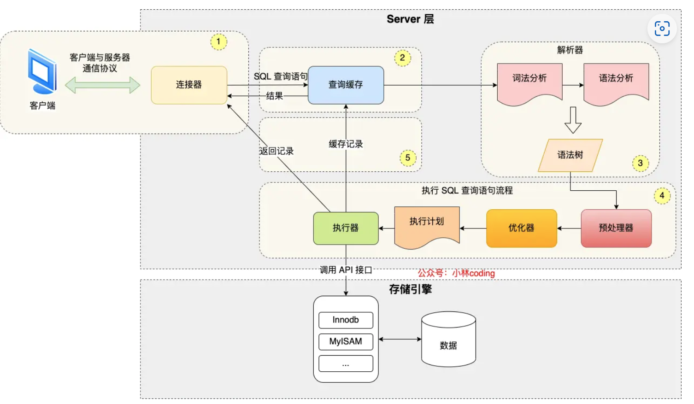
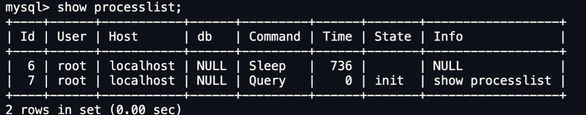
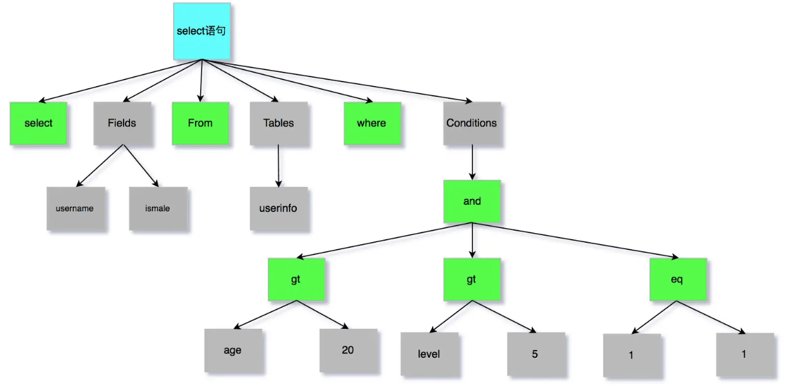
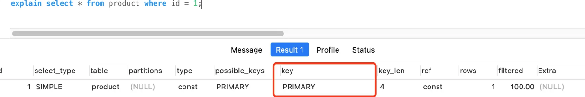
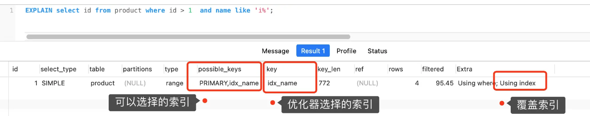
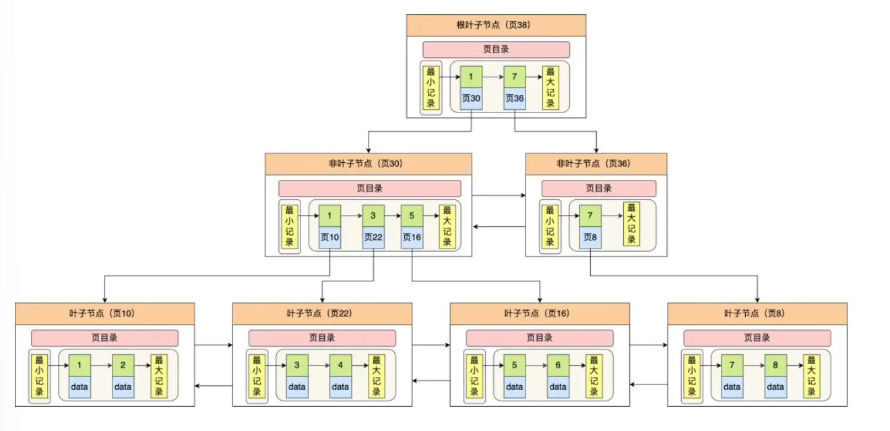
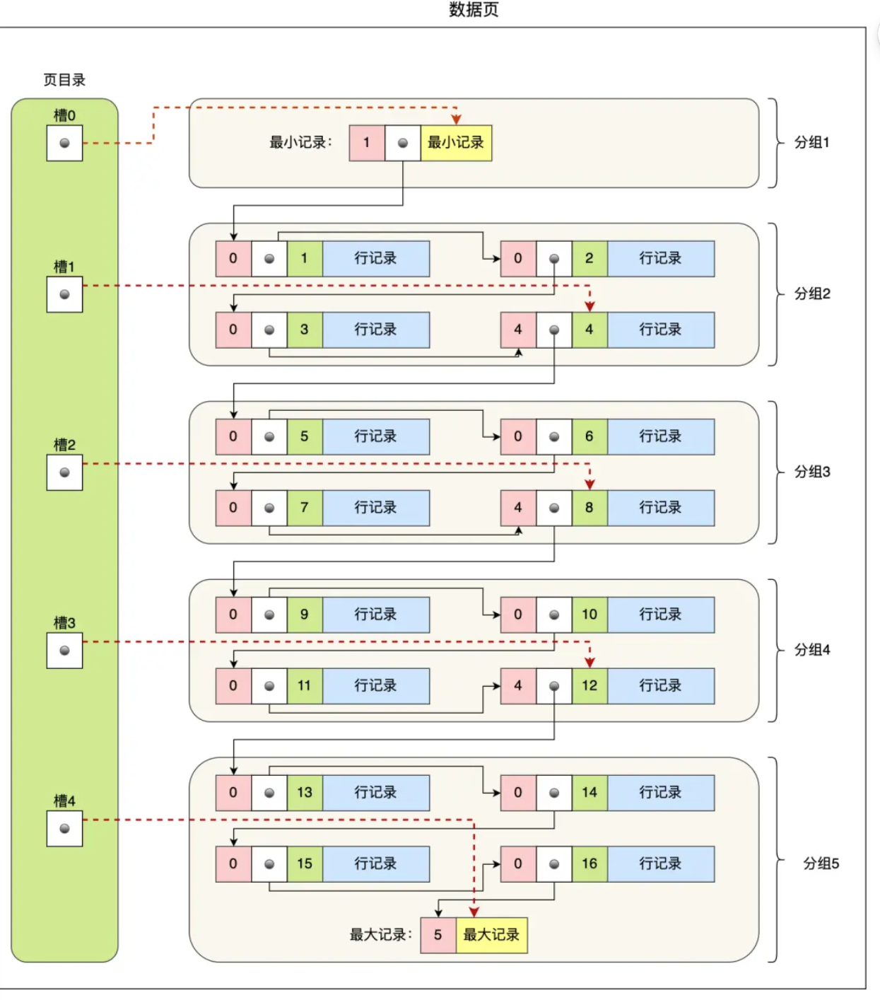

# 数据查询和存储

Owner: -QVQ-

# 查询

## select语句的执行过程

分成server层和存储引擎层


server层：负责建立连接、分析和执行SQL，大多核心功能模块都在这里实现（连接器、查询缓存、解析器、预处理器、优化器、执行器等），所有的内置函数和跨存储引擎的功能（存储过程、触发器、视图）都在server层实现

存储引擎层负责数据的存储和提取，支持多个存储引擎（InnoDB（默认）、Memory、MyISAM），索引数据结构由该层实现，InnoDB采用B+树

### 连接器

linux下的连接mysql

```bash
# -h 指定 MySQL 服务得 IP 地址，如果是连接本地的 MySQL服务，可以不用这个参数；
# -u 指定用户名，管理员角色名为 root；
# -p 指定密码，如果命令行中不填写密码（为了密码安全，建议不要在命令行写密码），就需要在交互对话里面输入密码
mysql -h$ip -u$user -p
```

与客户端进行TCP三次握手建立连接，

连接器验证用户名和密码，获取该用户的权限保存起来，后续该用户在此连接里的任何操作都会基于连接开始时读到的权限进行权限逻辑的判断

（如果用户已经建立了连接，管理员中途修改了该用户的权限不影响已经存在的连接权限）

查看当前MySQL服务被多少客户端连接了

`show processlist`


表示，id为6的用户名为root，状态为sleep（连接完后没有再执行过任何命令），空闲连接时长为736秒

空闲连接会一直存在吗

空闲连接的最大空闲时长由`wait_timeout`参数控制，默认8小时

`show variables like 'wait_timeout'`

手动断开连接：`kill connection +id`

服务端主动断开一个空闲连接时，客户端并不会马上知道，发起下一个请求时报错

MySQL的连接数有限制吗

最大连接数由 max_connections 参数控制，默认151个值

`show variables like 'max_connections'`

MySQL也有短连接和长连接

短连接会增加连接次数，通常用长连接

长连接后可能占用内存增多，查询语句中临时使用内存管理连接对象，长连接累计很多将使得占用内存太大可能被系统强制杀掉从而发生MySQL服务异常重启

如何解决

1 定期断开长连接

2 客户端主动重置连接，调用 `mysql_reset_connection()` 函数的接口来重置连接，这个过程不需要重连和重新作权限验证，会将连接恢复到刚创建完时的状态

### 查询缓存（Query Cache）

MySQL服务收到SQL语句后解析字段判断语句类型，对于查询语句首先去查询缓存里查找缓存数据，以KV形式保存在内存中，key为SQL查询语句，value为SQL语句查询结果

如果查询语句没有命中往下执行，执行完后，查询的结果加入查询缓存中

实际上对于更新频繁的表，查询缓存的命中率很低

MySQL8.0删除了查询缓存，之前的版本可通过query_cache_type参数关闭功能

### 解析器解析SQL

第一步、词法分析，在输入的字符串中识别除关键字出来

| 关键字 | 非关键字 | 关键字 | 非关键字 |
| --- | --- | --- | --- |
| select | username | from | userinfo |

第二步、语法分析

判断是否符合语法规则，语法问题在这个阶段报错

然后构建出SQL语法树


对于字段和表的不存在不在这里得出

### 执行SQL

**第一步、prepare阶段（预处理阶段）**

检查SQL查询语句中的表和字段是否存在（MySQL8.0）

将select *中的*扩展为表上的所有列

**第二步、optimize阶段（优化阶段）**

**优化器**

负责将SQL查询语句的执行方案确定下来，基于查询成本决定选择哪个索引

> 在查询语句最前面加个`explain`命令，能输出这条SQL语句的执行计划，key列代表使用了哪个索引，图中显示用的主键索引
> 


如果key为null表明没有用索引，即全表扫描

例如：

表中同时存在主键索引(id)和普通索引(name)，执行

`select id from product where id > 1 and name like 'i%';`

此时用不同索引方式执行效率不同，因此优化器将决定使用哪个索引，通常基于查询成本选择查询代价小的普通索引


这条语句明显是覆盖索引，直接在二级索引能查到结果，extra一列表明了用的是覆盖索引优化

**第三步、execute阶段（执行阶段）**

执行器调用存储引擎API交互，以记录为单位

例一：主键索引查询

对于语句`select * from product where id = 1;`

- 调用`read_first_record`函数指针指向的函数，这个函数指针被指向为 InnoDB 引擎索引查询的接口，将条件id=1交割存储引擎，让其定位符合条件的第一条记录
- 存储引擎通过主键索引的B+树定位到id=1的第一条记录，不存在则返回错误后结束，存在则将记录返回给执行器
- 执行器从存储引擎读到记录后判断是否符合查询条件，符合则发送给客户端，不符合则跳过
- 执行器的查询过程为while循环，进入第二次查询，此时调用read_record函数指针指向的函数，优化器选择的访问类型为const因此这个函数指针返回-1，查询结束

例二：全表扫描

`select * from product where name = 'iphone';`

- 调用`read_first_record`函数指针指向的函数，这个函数指针会指向InnoDB引擎全扫描的接口，让存储引擎读取表中第一条数据
- 执行器判断读到的记录是否符合条件，不是跳过，是返回给客户端，
- 进入第二次while循环，优化器选择的访问类型为all，函数指针指向的函数不变，继续读刚才那条记录的下一条记录，执行器继续判断条件
- 重复至所有记录读完，执行器收到存储引擎报告的查询完毕的信息退出循环

例三：索引下推

> **索引下推：**将server层的部分事情交给存储引擎层了，能减少二级索引在查询时的回表操作，提高效率，
> 

对于如下语句

`select * from t_user  where age > 20 and reward = 100000;`

不使用索引下推时，执行器与存储引擎的执行流程：

- server层调用存储引擎的接口定位到满足查询条件的第一条二级索引记录，即age>20的第一条语句
- 存储引擎根据二级索引的B+树快速定位到这条记录后，获取主键值，进行回表操作，将完整的记录返回给server层
- server层判断该记录的reward是否等于10W，成立则发送给客户端，否则跳过该记录
- 循环向存储引擎要下一条记录，直至读完记录

即，没有索引下推，每查询一条二级索引记录都要回表操作和返回判断

使用索引下推时，执行流程：

- server层首先调用存储引擎的接口定位到满足查询条件的第一条二级索引记录，即age>20的第一条记录
- 存储引擎定位到二级索引后，先不执行回表，而是判断reward等于10W是否成立，不成立则跳过该二级索引，成立则执行回表操作，将记录返给server层
- server层在判断其他的查询条件是否成立，成立则发送给客户端，否则跳过，继续向存储引擎要下一条记录，
- 循环，直至读完

Extr 部分显示了 “Using index condition”，说明使用了索引下推。

## 执行update语句

`update t_user set name = ‘xiaolin’ where id=1;`

基本和select语句相同

- 通过连接器建立连接
- 对于update语句不经过查询缓存，把整个表的查询缓存清空
- 解析器识别关键字，生成语法树，做语法分析
- 预处理器判断表和字段是否存在
- 优化器确定执行计划，确定走索引还是全表等
- 执行器具体执行

另外会涉及到undo log(回滚日志), redo log(重做日志)，binlog(归档日志)

## B+树如何进行查询

B+树的每个节点都是一个数据页


对于查找主键为6的记录

1. 从根节点开始，通过二分法定位到符合页内范围包含查询值的页，6在【1，7）之间，进入页30
2. 页30中，二分法定位到页16
3. 叶子节点页16，二分法定位到要查询的记录在哪个槽，再遍历槽内记录，找到键值为6的记录

B+树的范围查询，是先用B+树找到范围开头的哪个节点，再在叶子节点顺序遍历找到其他节点

# 数据存放

创建一个如下的数据库

数据库名my_test，创建一张表t_order

会生成一个文件夹，下内容代码

**db.opt**  存储当前数据库的默认字符集和字符校验规则

**t_order.frm**   保存表结构信息，保存表的元数据信息，包含表结构的定义

**t_order.ibd**   保存表的数据信息和索引信息

> 表的数据信息可能在一个独占表空间文件（文件名.ibd），也可能在共享表空间文件（ibdata1）里，参数innodb_file_per_table决定，默认为1放在独占空间
> 

## 表空间

表空间结构由**段、区、页、行**组成

**段**分为数据段（B+树叶子节点区的集合）、索引段（B+树非叶子节点区的集合）、回滚段（回滚数据的区的集合）

对量大的数据，采用**区**为单位分配（1MB64页），意义是让相邻的页在物理位置上也相邻，应对顺序IO

按照页为单位读写（默认大小16KB的连续空间），页是磁盘管理的最小单位（读取和写入），页的类型有数据页、undo日志页、溢出页等。数据表中的行记录用数据页来管理

记录按照**行**为单位存储，有不同的存储结构

> 之所以用16KB作为页大小是随机IO和顺序访问在性能上的平衡：
较大的页可以减少随机IO的次数，减少额外的存储开销，但也会导致内存利用率下降，并且导致更多不必要的读取
> 

### InnoDB引擎的数据页存储方式

**页默认大小为16KB，包含7个部分**

- 文件头（38字节）：表示页的通用信息，有两个指针，指向上个数据页和下个数据页
- 页头（56字节）：页的专有信息
- 最大、最小记录（26字节）
- 用户记录：存储行记录
- 空闲空间
- 页目录：存储用户记录的相对位置，起索引作用
- 文件尾（8字节）：校验页是否完整

每次数据写从空闲空间里取出空间放入用户记录

**数据页中的记录组织**

行记录按照主键顺序组成单向链表，页目录和记录的关系类似跳表


- 所有记录和最小记录、最大记录一起划分为不同组（不包含标记为删除的记录）
- 每个组中最后一条记录为组内最大的那条记录，其头信息中会存储该组一共有多少条记录（n_owned字段)
- 页目录存储每组最后一条记录的地址偏移量（槽slot）

查询时，通过二分法定位到查询的记录所在槽（分组），在槽内遍历找到对应的记录

对于每个分组的记录

- 第一个分组的记录只能有1条
- 最后一个分组的记录在1-8条之间
- 剩下的分组中的记录在4-8条之间

## 行格式

```sql
CREATE TABLE `t_user`(
	
)ENGINE = InnoDB DEFAULT CHARACTER SET = ascii ROW_FORMAT = COMPACT;
//指定存储引擎是InnoDB  指定行格式是COMPACT 指定字符集是ascii
```

Redundant格式，现在不使用了

Compact格式，5.1后的默认格式，一种紧凑的行格式

Dynamic格式、Compressed是在Compact格式上的改进，也是紧凑的行格式，5.7后默认Dynamic格式


**对于如下数据类型**

```sql
CREATE TABLE t_user(
	id int(11) NOT NULL,
	name VARCHAR(20) DEFAULT NULL,
	phone VARCHAR(20) DEFAULT NULL,
	age int(11) DEFAULT NULL
	PRIMARY KEY (id) USING BTREE
)ENGINE = InnoDB DEFAULT CHARACTER SET = ascii ROW_FORMAT = COMPACT;
//指定存储引擎是InnoDB  指定行格式是COMPACT 指定字符集是ascii
```

**如下数据**

| id | name | phone | age |
| --- | --- | --- | --- |
| 1 | a | 123 | 18 |
| 2 | bb | 1234 |  |
| 3 | ccc |  |  |

### 记录的额外信息

**1 变长字段长度列表：**

varchar、TEXT、BLOB等变长字段将自己的长度放在这里

对于第一条数据

name列的值为a，长度为1，十六进制0x01

phone列的值为123，长度为3，十六进制0x03

变长字段的按列的顺序逆序存放，所以这里的变长字段长度列表的值为【03 01】

第二条数据，变长字段长度列表的值为【04 02】

第三条数据，变长字段长度列表的值为【03】

只在表中有变长数据时才有变长字段

之所以要逆序存放

双指针从中间向两边读值，向右读的是数据，向左读的是记录的额外信息

这样使得靠前的信息能在同一个CPU Cache Line中，提高cpu cache的命中率

**2  NULL值列表**

统一存放NULL值而不是真实的记录空间从而节约空间

对于允许存在NULL值的列，每个列对于一个二进制位（顺序逆序），值为1则该列为NULL，为0则不为NULL

NULL值列表必须用整数个字节的位（1字节8位）表示，不足则用0在高位(即左边)补齐，即9个字段都是NULL，则会占2字节空间的NULL值列表

对于第一条数据，为0x00，（自动补齐一个字节）

第二条数据，为0x04（二进制100）(最后一位为1，逆序存放)

第三条数据，为0x06（二进制110）（最后两位为1，逆序存放）

当字段为NOT NULL时，没有NULL值列表这一栏

**3 记录头信息**

主要几个：

delete_mask 标识数据是否被删除（数据的删除只是做删除标记）

next_record  下一条记录的位置（记录间通过链表组织）

record_type 表示当前记录的类型，0为普通类型，1为B+树非叶子节点记录，2为最小记录，3为最大记录

### 记录的真实数据

除了定义的字段，还有三个隐藏字段，在真实数据左边

- `row_id` 如果没有指定主键或唯一约束列，才会添加这个隐藏字段用作**标识**，6个字节
- `trx_id` **事务ID**,表示这个数据由哪个事务生成的，6个字节
- `roll_pointere` 记录上 一个版本的指针，7个字节

### varchar类型最大取值为多少

varchar(n)，n代表的是存储的字符数量，不是字节大小

除了TEXT、BLOBs这种大对象类型，一行的字节总长度不能超过65535个字节（2*16-1），包含 变长字段长度列表、NULL值 列表 所占的字节数

因为varchar的数据分成了三部分存储：真实数据、真实数据的长度、NULL标识

即，对于单字段，1字节（NULL标识）+2字节（真实数据的长度）+65532字节（varchar类型可以的最大取值），刚好可以占满一列的空间

### 行溢出的处理

一行最大可存放65535字节（64kb-1），而一页是16KB，一页放不下则反思行溢出，多的数据放到溢出页

compact行格式，记录一部分真实数据，然后保留20字节存储指向溢出页的地址

Compressed 和 Dynamic行格式，不记录真实数据，只存储20字节的指针来指向溢出页，实际数据都在溢出页

## mysql单表的大小

表数据存放在*.ibd文件中，在文件中被分成多个小份的数据页（段、区、页），每页16KB

索引页作为 索引节点，查询时先通过索引节点（非叶子节点）按B+树原则查询，数据页 （叶子节点）位于最底层（0层）

单表的大小由下面三个因素决定

1. mysql内B+树的高度通常为3层，
2. 叶子节点能容纳的数据行数y
3. 单个B+树节点有多少索引项x

即x^2*y行数据

单个数据节点能有多少索引项

单个索引页有16KB，约有1KB的表项，可用数据存储约有15KB，索引项由4B的页号（指针）和主键构成（通常用递增的Bigint也就是8字节），那么一个索引页可存放约15*1024/12=1280个索引项

这个数字是相对的，它的设置和硬件环境无关，只和MySQL所操作的索引节点大小有关。在索引节点中，MySQL会用4字节来存储页号，这个数据大小和操作系统位数无关。不管是32位操作系统还是64位操作系统，MySQL在这个设置上都是相同的。

叶子节点能容纳的数据行数

同理也有15KB，一行大小不确定，如果 按 一行 1KB来算，那么整体可用存放 15行，整个表可以存放15*1280*1280=2450W行数据

所以通常不建议 一个表超过2000W行数据