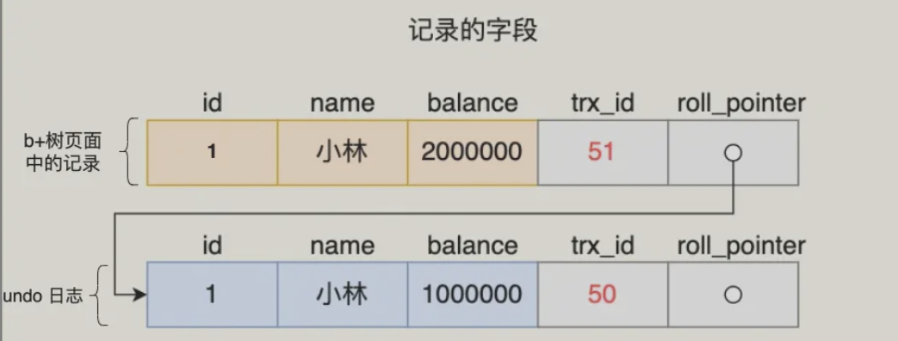
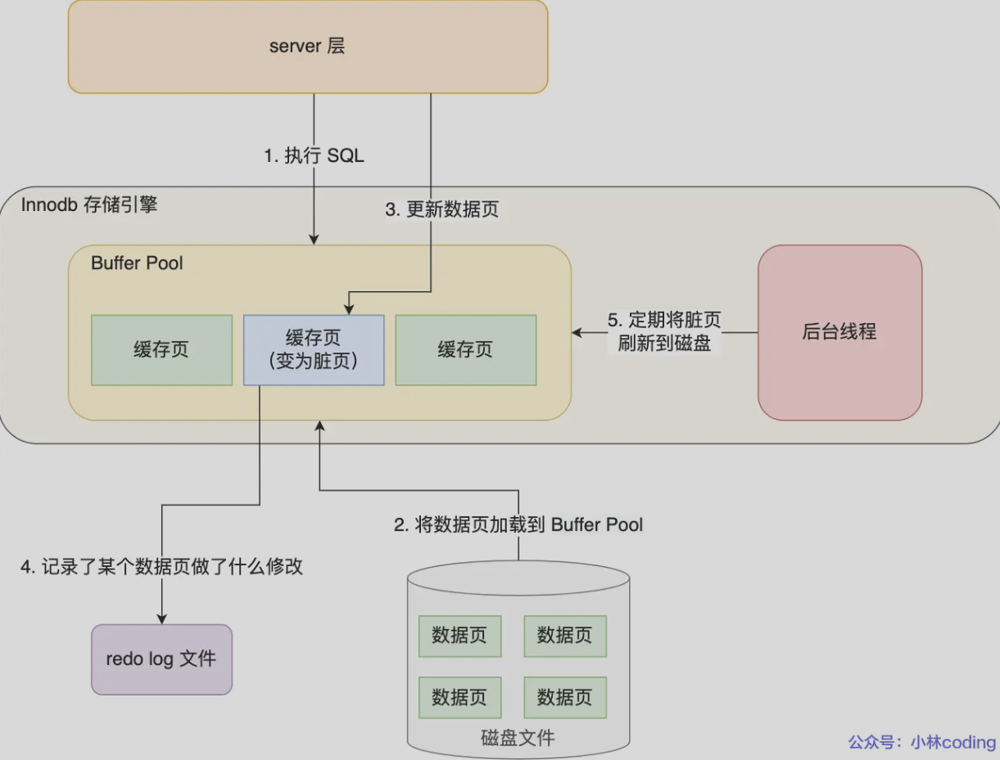
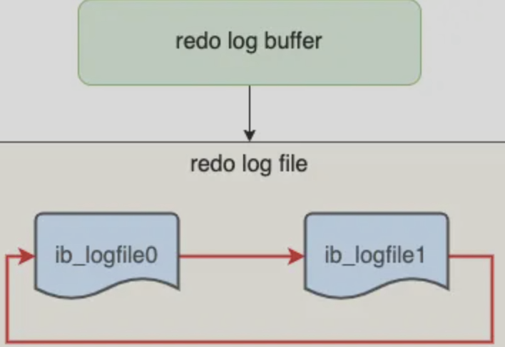
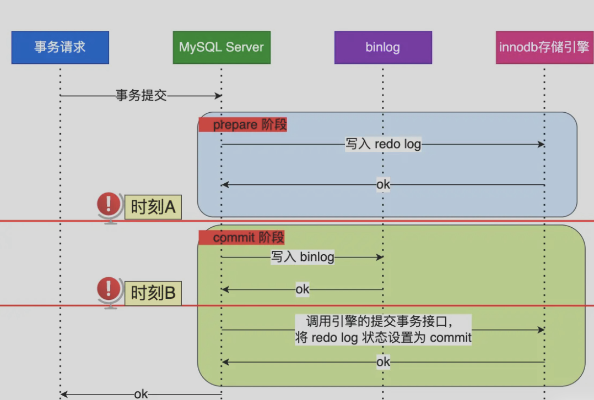
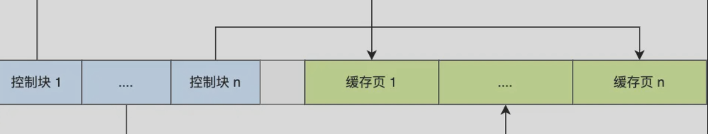
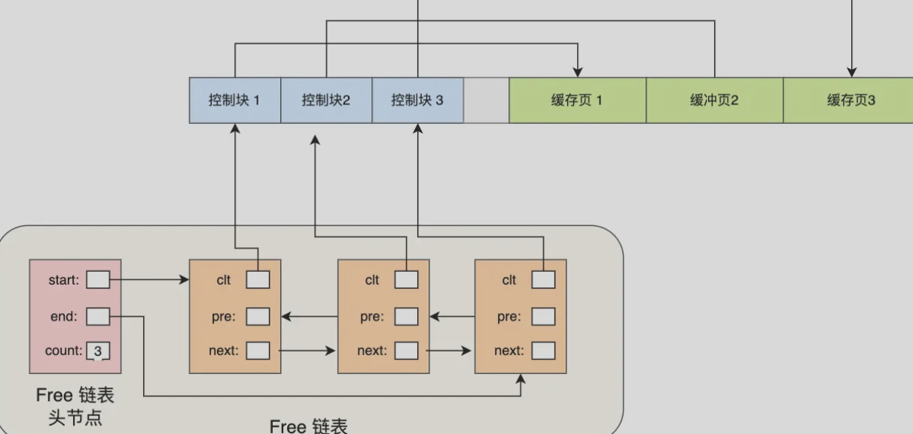
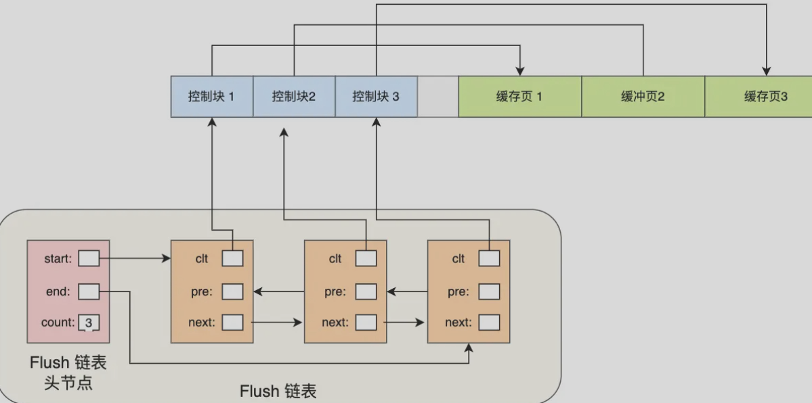

# 日志

Owner: -QVQ-

对于每次读写操作会隐式的创建事务并提交

更新语句的流程会涉及三种日志：

**undo log（回滚日志):** Innodb存储引擎层生成，实现了事务的原子性，用于事务回滚和MVCC

**redo log (重做日志)：**Innodb存储引擎层生成，实现了事务的持久性，用于掉电等故障恢复

**binlog(归档日志)：**是server层生成，用于数据备份和主从复制

# 回滚日志undo log

位于回滚段中，多个连续的回滚区组成，新的事务写入以追加写入undo log区。

**意义**：避免事务未提交时，如果mysql发生了崩溃，回滚到事务之前的数据。通过readview+undo log实现MVCC

undo log保证了原子性

事务开启后，每次执行都会将更新前的数据保存到undo log日志文件内，事务回滚时利用undo log回滚

- 插入记录时，把这条记录的主键值记下来，回滚时删掉这条记录就好
- 删除记录时，把记录的内容记下来，回滚时把这些内容组成的记录插入到表中
- 更新记录时，把旧值记录下来，回滚时更新为旧值即可

**undo log格式：**

不同的操作需要记录的内容也不同，产生的undo log格式也不同

通过trx_id知道该记录是哪个事务修改的

通过roll_pointer将undo log串成一个链表，即版本链

undo log和数据页的刷盘策略是一样的，通过redo log保证持久化

# redo log物理日志

buffer pool是基于内存的，redo log是防止系统崩溃使得数据丢失，记录了某个数据页做了什么修改，每执行一个事务就会产生这样的物理日志

事务提交只需要先将redo log持久化到磁盘，不需要等待buffer pool里的脏页数据持久化到磁盘

**WAL技术（write ahead logging）：**每次更新会先更新内存同时标记脏页，然后对这个页的修改以redo log的形式记录，后台线程会在适当的时候将buffer pool的脏页刷新到磁盘里

WAL和redo log保证了事务中的持久性，这个能力为crash-safe（崩溃恢复）

**undo和redo的区别**

每次undo log的修改也需要记录对应的redo log

undo log和redo log都是和事务一一对应， 开启一个事务生成一条日志

事务提交后发生崩溃，通过redo log回滚记录，其记录了此次事务完成后的数据状态，

事务提交前发生崩溃，通过undo log回滚事务，其记录了此时事务开始前的数据状态

redo log比起数据直接落盘

redo log属于追加操作，属于顺序写，而数据直接落盘需要先找到写入位置，属于随机写，前者开销小

**redo log的实现**

redo log有自己的缓存redo log buffer，每产生一条redo log时先写入到redo log buffer，后续再持久化到磁盘中

**redo log的刷盘时机**

- mysql关闭
- redo log buffer 中的记录写入量大于内存空间的一半
- 每隔一秒
- 每次事务的提交（可控）

提供了三种策略，参数 `innodb_flush_log_at_trx_commit` 控制

- 参数为0时，事务提交不会触发落盘操作，每隔一秒将redo log buffer中的redo log写入操作系统的page cache，再持久化到磁盘
    
    mysql的崩溃或导致上一秒的数据丢失
    
- 参数为1时， 事务提交触发落盘
- 参数为2时，事务提交时将缓存的redo log buffer写入redo log，但并不是落盘，os内核中有个page cache用于缓存文件数据
    
    mysql的崩溃不会丢失数据，os崩溃或断电会丢失
    

redo log文件写满了

innodb有1个重做日志文件组（redo log group)，由两个redo log文件组成：ib_logfile0、ib_logfile1

以循环写的方式实现，如果写到末尾就又回到开头

同时，redo log的脏页刷新到磁盘中后，旧的数据旧没用了，innodb用双指针记录当前记录写到的位置和要擦除的位置

如果写指针追上了要擦除的指针则表示文件已满，不能再执行新的更新操作，此时mysql会阻塞等待

# binlog

## 概念

记录所有数据库表结构和表数据修改的日志，不记录查询类操作

server层生成一条binlog，等之后事务提交时会一起写入binlog文件

**binlog和redo log**

先有binlog，由于其没有crash-safe的能力，所以innodb用redo log来实现crash-sage能力

两者区别

1 binlog是server层实现，所有存储引擎可以使用，redo log是innodb存储引擎实现的

2 binlog记录有3中数据格式

STATEMENT: 记录的是逻辑日志(操作），对于动态函数使用这种方式会导致还原的数据不一致

ROW: 记录的是最终修改的数据的结果

MIXED：根据不同的情况使用上面两种模式

redo log记录的是物理日志，某个数据页做了什么修改

3 binlog是追加写，写满一个文件创建一个文件继续写。redo log是循环写，日志大小固定

4 binlog用于备份恢复、主从复制。redo log用于故障恢复

整个数据被删除了如何恢复

redo log是边写边擦，不能使用redo log文件恢复，但可以使用binlog恢复

## binlog实现主从复制

将mysql上的变化以二进制形式保存在磁盘上，复制的过程就是将binlog中的数据从主库传输到从库上，主库的事务操作和复制线程是异步的不互斥

集群的主从复制过程分为3个阶段：

- 写入binlog：主库收到客户端提交事务的请求后，写入binlog日志，再提交事务，并更新本地存储数据，返回给客户端响应
- 同步binlog：从库创建一个线程接收主库的binlog日志，把binlog写到暂存日志中，返回给响应
- 回放binlog：从库创建一个用于回放binlog的线程，读暂存日志，并更新存储引擎中的数据

此时可以在写数据只写主库，读数据只读从库，这样即使写请求会锁表或者锁记录，不影响读请求的执行

从库的数量

从库数量增加，连接上的io线程页比较多，主库也要创建同样多的线程来处理复制的请求，对主库资源消耗较高，还受限主库的网络带宽

一般主库跟2-3个从库（1套数据库，1主2从1备主）

## 主从复制模型

**同步复制**

主库提交事务的线程要等待所有从库的复制成功响应才返回结果

性能差和可用性差，实际不会使用

**异步复制（默认）**

主库提交事务的线程不会等待binlog同步到从库旧返回

主库死机数据就会丢失

**半同步复制**

主库等待一部分数据复制成功响应回来（比如数据复制到任意一个库上）

## binlog什么时候刷盘

事务执行时，先把日志写到binlog cache，事务提交时再把binlog cache写到内核的page cache，在适当的时候落盘到binlog文件中，

无论这个事务有多大都要保证一次性写入，每执行一个事务的开始都会默认提交上一个事务，从而保证原子性

什么时候binlog cache会写到binlog文件

事务提交的时候，执行器把binlog cache的完整事务写入binlog文件中，并清空binlog cache

`sync_binlog`参数控制数据库的binlog刷到磁盘的频率

0，表示每次提交事务都用write写到内核page cache，不fsync，后续由操作系统决定写入磁盘（默认值，通常性能最好，但风险最高）

1，表示每次提交都write并马上执行fsync

N，表示每次提交事务都write，积累N个事务后才fsync

# 结合日志更新语句的执行

`UPDATE t_user SET name=’xiao’ WHERE id=1;`

1 执行器调用存储引擎的接口，获取记录：

在buffer pool中，直接返回给执行器，

不在buffer pool，将数据页从磁盘读入buffer pool，返回记录给执行器

2 执行器得到聚簇索引记录后，判断更新前的记录和更新后的记录是否一样：一样就不进行后续更新流程、不一样就把更新前的记录和更新后的记录都当作参数传给innodb层执行更新操作

3 开启事务，首先记录相应的undo log，将旧的值写入buffer pool中的undo页面。在内存修改该undo页面后，记录对应的redo log

4 innodb层开始更新记录，会先更新内存，将记录写到redo log里。采用WAL技术，不会立即写入磁盘，而是先写redo日志，后台在合适的时间写到磁盘

5 记录对应的binlog，保存到binlog cache，事务提交时统一刷新到硬盘

6 接下来是两阶段提交

prepare阶段将redo log对应的事务状态设置为prepare，将redo log刷新到硬盘

commit 阶段将binlog刷新到硬盘，将redo log状态设置为commit

# 两阶段提交

## 意义

redo log和binlog都要持久化到磁盘，可能出现两份日志之间逻辑不一致，redo log影响主库，binlog影响从库

**例**

如果redo log刷入到磁盘，binlog还没写入，mysql死机了，重启后，通过redo log恢复了主数据库的数据，从句由于binlog丢失了这条数据，出现主从不一致

如果binlog刷入到磁盘，redo log还没写入，mysql死机了， 重启后，主库为旧值，从库为新值，主从不一致

## 概念

两阶段提交是分布式事务一致性协议，保证多个逻辑操作要么全成功，要么全失败

两阶段分别是准备阶段和提交阶段，每个阶段都由协调者coordinator和参与者participant共同完成（commit语句包含了提交阶段）

**实现**

当事务提交时，mysql使用了内部XA事务来保证这两个日志的一致性，binlog作为协调者，存储引擎作为参与者

prepare阶段：将XID（内部XA事务的ID）写入到redo log，将redo log对应的事务状态设置为prepare，将redo log持久化到磁盘

commit阶段：将XID写入到binlog，将binlog持久化到磁盘，接着调用引擎的提交事务接口，将redo log状态设置为commit，该状态写入到文件系统的page cache，

只要binlog写磁盘成功，redo log状态还是prepare也没关系，依然会被认为事务已经执行成功

**对于时刻A和时刻B的崩溃**

MySQL重启后会按顺序扫描redo log文件，碰到处于prepare状态的redo log，就拿其中的XID去binlog查看是否存在此XID

如果没有当前内部XA事务的XID，说明redo log刷盘了而binlog没有，则回滚事务对应时刻A崩溃的情况

如果有当前内部XA事务的XID，说明都完成了刷盘，则提交事务

处于prepare阶段的redo log和完整的binlog，重启后就会提交事务

binlog写入后会被从库使用，所以主库此时必须提交事务，不然主从不一致

事务没提交时，redo log会持久化到磁盘，binlog不会

事务执行中redo log直接写到redo log buffer，后台线程会逐渐将其持久化到磁盘，因此事务没提交的时候，redo log也可能被持久化到磁盘

bin log 一定是事务重启后才持久化到磁盘

如果发生mysql崩溃，redo log会和redo log对比，回滚还没提交的事务

## 两阶段提交的问题

### 性能问题

主要带来性能的影响：

1. 磁盘I/O次数高，每个事务都会有redo log和bin log两次刷盘，如果两个刷盘都设置为提交事务就刷盘，会有更大的性能瓶颈
2. 锁竞争激烈，多事务的情况下，需要加锁来保证提交的原子性，早期mysql一个事务获取锁完成两阶段后从释放锁让下个事务开始

### **组提交下的两阶段（group commit)**

**binlog的组提交**

当有多个事务提交时，将多个binlog刷盘操作合并成一个，从而减少磁盘i/o次数

prepare阶段不变，commit阶段拆分为三个过程

flush阶段：多个事务按进入的顺序将binlog从cache写入文件，不刷盘

sync阶段：对binlog文件做刷盘（多个binlog合并后的）

commit阶段：事务按顺序做Innodb commit操作，通知redo log

这每个阶段对应一个队列并有锁保护，保证了事务写入的顺序，第一个进入队列的事务会成为leader领导队列的所有事务，完成后通知其他事务操作结束

此时只针对每个队列上锁，不再锁提交事务，减小了锁颗粒度

**redo log的组提交**

mysql5.7中，将redo log刷盘操作推迟到组提交的flush阶段

**flush阶段**

由leader对同组的redo log做一次刷盘，对同组的binlog写入binlog文件（调用write，不调fsync，不刷盘，写入内核的文件系统中的page cache）

这一步完成后如果数据库崩溃，redo log没有记录，binlog有，MySQL会重启后回滚binlog的数据

**sync阶段**

binlog写入binlog文件后会等待一段时间，等待时间由参数binlog_group_commit_sync_delay参数控制，等待的事务数量由binlog_group_commit_sync_no_delay_count参数的值，等待时间或等待的事务数量达到设置的值就会开始刷盘

这一步之后如果mysql崩溃，由于binlog和redo log都有记录，mysql会继续进行事务的提交

**commit阶段**

将redo log状态设置为commit

### binlog和redo log高磁盘IO的优化

通过控制参数来延迟binlog和redo log刷盘的时机来降低磁盘IO频率

1、组提交：binlog_group_commit_sync_delay 和 binlog_group_commit_sync_no_delay_count 参数控制组的大小和刷新时间，参数增加可以减少刷盘次数，缺点是增加语句的响应时间，binlog写入os的缓存页，所以mysql崩溃不会影响，但系统崩溃会影响数据

2、sync_binlog参数设置大于1（常见的100-1000），表示每次提交事务都write，但累计n个事务后才落盘，风险是主机掉电时会丢调n个事务的binlog日志

3、innodb_flush_log_a_trx_commit设置为2，每次事务提交都缓存在redo log buffer里的redo log写到redo log文件（操作系统缓存），由操作系统决定什么时候落盘。风险是主机掉电时会数据丢失

# 缓冲池buffer pool

位于innodb内，和查询缓存不是一回事

**意义：**

更新一条记录先缓存到内存，来提高数据库的读写性能

读数据时，如果存在buffer pool就会直接读取buffer pool的数据，否则读后台

修改数据，直接修改buffer pool的数据，然后将其设置为脏页，后台线程在合适的时机将脏页写入磁盘

这时虚拟内存空间很大，使用的物理空间却很小，只有虚拟内存被访问后触发缺页终端申请物理内存，才会建立虚拟地址和物理地址的映射关系

**buffer pool大小：**

mysql启动时会为buffer pool申请一片连续的内存空间，然后按照默认16KB的大小划分出页，即缓存页。默认大小为128MB，通过innodb_buffer_pool_size参数来设置buffer pool的大小，通常为物理内存的60%-80%

**buffer pool构成：**

数据页、索引页、插入缓存页、undo页、自适应哈希索引、锁信息

每个缓存页都有一个控制块，块中包括缓存页的表空间、页号、缓存页地址、链表节点等，位于缓存页的最前面

缓存页和控制块之间的灰色部分为碎片空间，如果缓存页分配的大小合适也可能没有碎片空间

有三种页来管理数据free page（空闲页）、clean page（干净页，页面已使用未修改）、dirty page（脏页，已使用已修改，写入磁盘后变为干净页）

**buffer pool对空闲页的管理**

采用空闲链表

空闲链表头节点为空闲链表的控制信息，空闲链表的每个节点指向一个控制块，对应一个空闲的缓存页

每当取空闲块时，先从磁盘加载一个页到buffer pool中，再从free链表中取一个空闲的缓存页，填入对应的控制块的信息，把缓存页从空闲链表移出

**如何管理脏页**

更新数据时不是直接写入磁盘，而是将对应的缓存页标记为脏页，后台线程负责写入磁盘

Flush链表结构同空闲链表，负责管理脏页，用于快速找出脏页

**如何提高缓存命中率**

LRU算法，最少最近未使用算法，链表头部是最近使用的，尾部是最久没使用的，优先淘汰尾部

当访问的页在buffer pool里，把对应的节点移到链表头部

当访问的页不再buffer pool里，从尾部取出一个节点写入后放入头部

- **简单的LRU会出现的问题**
    - 预读失效
        
        即提前加进来的页并没有被访问
        
        mysql加载数据页会把相邻的数据页一起加载进来，这些页并没有被访问，但占用了LRU链表前排的位置而淘汰了末尾的页
        
    - buffer pool污染
        
        一个sql语句扫描了大量数据，将buffer pool里的所有页都替换出去，导致大量热数据被淘汰
        
        即使对于小额的查询，如果查询使用的是全表扫描，也会导致buffer pool里的页都会被替换调
        
- mysql对LRU的改进
    - 避免预读失效
        
        将LRU划分了2个区域，old区域（链表后半部分）和young区域（链表前半部分），这两部分的比例可以被参数innodb_old_blocks_pct控制，默认37：63
        
        预读的页加入old区域的头部，真正访问的页加入young区域的头部
        
    - 避免buffer pool污染
        
        mysql对进入到young区域条件增加了一个停留在old区域的时间判断
        
        某个处在old区域的缓存页第一次访问时，在它对应的控制块中记录下这个访问时间
        
        后续访问时间与第一次访问的时间在某个时间间隔内，该缓存页就不会从old区域移动到young区域的头部，如果不再某个时间间隔内，就会移到young区域的头部，由innodb_old_blocks_time控制，默认1000ms
        
        即必须同时满足被访问与在old区域停留时间超过1s两个条件才能插入到young区域
        
        另外为了防止young区域节点频繁移动到头部，young前1/4的区域不会移动到链表头部，后面3/4被访问才会
        

**脏页什么时候刷入磁盘**

innodb的更新操作采用write ahead log策略，即先写日志，再写入磁盘，通过redo log让mysql有崩溃恢复能力，所以不会出现脏页未落盘断电数据丢失的问题

- redo log日志满了，会触发脏页的落盘
- buffer pool满了淘汰脏页时会触发落盘
- mysql认为空闲时，后台线程定期刷入适量脏页入磁盘
- mysql关闭时

> 偶尔一些sql语句用时较长， 可能是脏页刷新到磁盘时带来的性能开销，导致数据库操作抖动。可以调大buffer pool合伙redo log日志的大小来减少这种现象
>