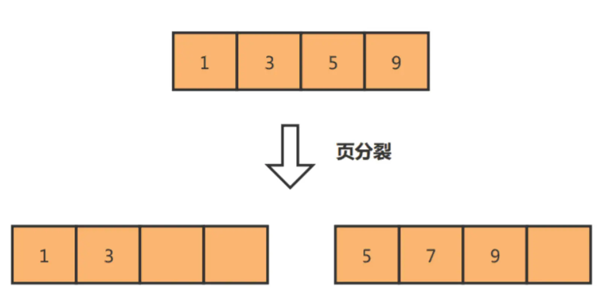
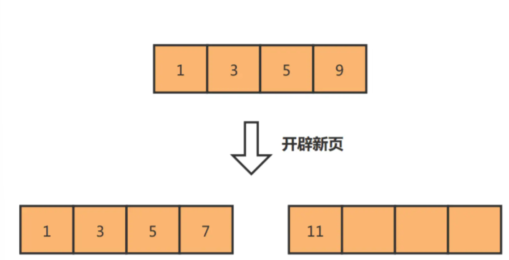

# 索引

Owner: -QVQ-

# 索引类型

索引合并：使用多个单列索引，MySQL可以同时使用这些单列索引来加速查询，将结果进行合并后返回给用户。这样可以避免使用组合索引的情况下出现的索引冗余问题。

## **按数据结构分类**

- FULLTEXT全文索引（仅MyISAM引擎支持），为了结果模糊查询效率较低的问题
- HASH，只在精确查询时效率高，
- BTREE，B+树（最常用）
- RTREE， R树

## **按字段特性分类**

- 普通索引：加速查询（可为 NULL）
- 唯一索引：加速查询+列值唯一（可为NULL）
- 主键索引：加速查询+列值唯一（不可为NULL）+只有一个组合索引
- 前缀索引：对字符类型字段的前几个字符建立的索引，可以建在字段类型为char、varchar、binary、varbinary

## **按字段个数分类**

**单列索引**

**组合索引（**联合索引）：指将多个列的值组合在一起作为索引的键值，以提高查询效率。其效率大于索引合并

组合索引的实现，将多个字段的值作为B+Tree的key值，从前往后依次比较字段（**最左匹配原则**）

创建（a, b, c)，对于如下几种，可以匹配上联合索引

```sql
where a = 1;
where b = 2 and a = 1;
where b = 2 and c = 3 and a  = 1;
# 查询优化器的存在使得顺序不会影响查询选择
```

对于如下不能匹配联合索引

```sql
where b = 2;
```

a是全局有序，b在a的范围下局部有序，全局无序

### **联合索引范围查询**

存在部分字段用到了联合索引，部分字段没有用到的情况，这种情况都发生在范围查询

创建联合索引(a,b)，对于如下查询语句

Q1:`select * from t_table where a > 1 and b = 2;`

最左匹配原则，先执行a>1，这里匹配上了联合索引，可以用b+树加速查询，对于b字段是无序的，只能顺序遍历

即a字段用到了联合索引，b字段没有

可以通过key_len字段查看用到了多少字长的联合索引

对于上诉例子，a,b,c都为int类型4字节，这次查询联合索引只用到了a字段

则查询语句显示出的key_len字段为4（如果key_len字段可以为NULL。则为5字节），表示只有a用到了联合索引

对于如下查询语句

Q2:`select * from t_table where a >= 1 and b = 2;`

a=1 and b =2部分用到了联合索引，a>1 and b=2没有用到

整体用到了，key_len字段为8

> 一些猜想：
对于a=1,b=2,通过B+树一次遍历可完成，先判断a=1,再通过b=2在决定向B+树左或右走，实际上并没有遍历完全部的a=1，整体O(logn）
对于a>1,b=2，不能一次遍历完成，如果a>1的第一条记录是a=3，那么必须从a=3往后遍历直接找到b=2，这个过程是顺序遍历，找到b>2后面不用遍历了，属于减枝操作，不影响时间复杂度
如果在索引的记录项里能记录a=3的索引的范围，剪切出一颗a=3的子树，再在其中做b=2的判断，复杂度也可以降下来，但这将变长索引字节，使得读取一次页包含的索引项变少，从而提高B+树的高度，提高磁盘访问次数
> 

Q3:`select * from t_table where a between 2 and 8 and b=2;`

对于区间内的查询，不同数据库的处理不同

myqsl属于闭区间查询

Q4: `select * from t_user where name like ‘j%’ and age=22;`

等价做一次where name >= ‘j’，对于name=‘j’ and age=22是联合查询，>’j’不是

？？？？？？？？？？如果没有j这个会怎么样？？？？？？

**索引的字节大小**

int类型的索引是4字节，如果可以为空加1位

对于varchar(30)，对于utf8mb4字符集，一个字符集是4字节，故是120字节，对于变长字节需要再加两字节，共122

这里固定两字节，不会因为varchar的长度而改变为1字节


联合索引的范围查找找到第一个满足条件的主键后，对第二个条件的判断是在联合索引里判断，还是回主键索引判断

MySQL5.6以前，回主键索引找到数据行，再对比字段

MySQL5.6引入索引下推优化，可以在联合索引遍历中，对联合索引中包含的字段做判断，减少回表次数

查询语句的执行计划里出现extra为`using index condition` ，则说明使用了索引下推的优化

**索引区分度**

联合索引的字段顺序对索引效率有很大影响，因此建立联合索引时，要将区分度大的字段排前面

区分度=字段不同值的个数/表的总行数

如果索引的区分度很小，查询优化器发现某个值出现在表的数据行中的百分比（通常30%）很高，一般会忽略索引，进行全表扫描

联合索引进行排序

对于如下查询语句的优化

`select * from order where status=1 order by create_time asc`

建立status和create_time的联合索引，这样按照status筛选出的数据就是按照create_time排好序的

直接建立status的索引，这条语句还要对筛选出来的结果进行排序，即在SQL执行计划中，extra列会出现`using filesort`

## **按物理存储分类**

- 聚簇索引（主键索引）
- 二级索引（辅助索引）

在创建表时，InnoDB存储引擎选择聚簇索引的方式：

- 如果有主键，使用主键作为聚簇索引的索引键
- 没有主键，选择第一个不包含NULL值的唯一列为聚簇索引的索引键
- 上面两个都没有则自动生成一个隐式自增id`row_id`列作为聚簇索引的索引键

其他索引都属于辅助索引

关于辅助索引的查找

主键索引的B+树的叶子节点存放的是实际数据，二级索引的B+树的叶子节点存放的是主键值

用二级索引进行查询，会先找到对应的叶子节点获取主键值，再通过主键索引中的b+树找到对应的叶子节点获取整行数据，这个过程叫**回表**

当查询的数据不用回表，直接通过二级索引的b+树的叶子节点就能查询到，称为**覆盖索引**

B+树即使在数据量很大的情况下查询一个数据的磁盘I/O依然维持在3-4次

为什么用B+树作为索引的数据结构

- 对比B树

B树中间节点也存放了数据，在相同的磁盘I/O下，B+树能查询更多的节点

B+树是双链表连接，支持范围的顺序查找

- 对比 二叉树

二叉树比起B+树有更深的高度，意味着更多的磁盘IO次数

- 对比哈希表

哈希表适合等值查询，不适合范围查询

# 索引的使用场景

优：提高查询速度

缺：

- 占用物理空间
- 创建和维护索引耗费时间，随着数据量的增加而增大
- 会降低表的增删改的效率

**适用场景**

字段有唯一限制

经常用于where、group by和order by的字段

**不适用场景**

不用于where、group by和order by的字段

字段索引区分度低，即重复字节太多

表数据太少

经常更新的字段（用户余额）

# 优化索引的方法

### 前缀索引优化

对字段的前几个字符建立索引

优：

减少索引字段的大小，从而增加一个索引页中存储的索引值，提高查询速度

缺：

order by无法适用前缀索引

无法把前缀索引用于覆盖索引

### 覆盖索引优化

直接在索引节点能得到需要查询的数据，不需要通过聚簇索引查询 获得，避免回表

### 主键索引设为自增

> 对于没有特别的要求通常用自增字段作为主键，且长度不要太大
> 

对于自增主键，数据的插入位置是按照主键的顺序来的，每次新的插入操作都是追加操作，不需要重新移动数据，有更高的效率

对于非自增主键，插入主键的索引值是随机的，插入中间位置将移动其他数据，可能出现页分裂（需要从一个页面复制数据到另一个页面），造成大量的内存碎片，影响查询效率



### 索引设置为非空

索引列存在NULL使得优化器的索引选择更复杂，更难优化

NULL值会占用物理空间

### 防止索引失效

1 使用左或者左右模糊匹配时，like %xx或者like %xx%

```sql
select * from table where like phone=**788;
select * from table where like phone=**78*;
```

注意对于后缀查询，如果当前表查询的所有字段都是索引字段，则属于不会是全表扫描，而是覆盖索引，因为所有信息都通过索引直接得到

2 查询条件中对索引做了计算、函数操作

```sql
select * from t_user where length(name)=6;//函数
select * from t_user where id + 1 = 10;//计算

select * from t_user where id = 10 - 1;//优化成 这样就能够触发索引
```

查询语句的变化太多，对于计算类型mysql如果作优化成本太高，同时使mysql变的臃肿，因此让程序员输入时优化

3 隐式类型转换

对于 mysql，数字和字符的比较，会将字符转为数字，再和数字比较，因此对于如下一组查询

```sql
select * from t_user where name=6;//name是字符串类型的索引项
select * from t_user where id=“46”;//id是int类型的索引项
```

第一条将表 中name的每一项提取出来，转为 数字类型再和6比较，从而是全表查询

第二条将‘46’转为数字再在id索引项中用B+树的方式作索引查询，效率更高

> ‘110’和‘9’比较，会先将‘1’和‘9’比较，‘9’大，所以‘110’小于’9‘
> 

4 联合索引没有按照最左匹配原则

对于联合索引字段（a、b、c）

如果用where a=1 and c = 3，即索引截断

对于MySql5.6以前，a走索引找到主键，b以后的数据通过主键遍历数据行

MySql5.6以后，索引下推（using index condition)，a走索引，对索引中的字段作c的判断过滤一些记录，从而减少回表次

5 or前的条件是索引列，or后的不是索引列，则索引失效

### 一些索引的信息

**执行计划**

- possible_keys 字段表示可能用到的索引；
- key 字段表示实际用的索引，如果这一项为 NULL，说明没有使用索引；
- key_len 表示索引的长度；
- rows 表示扫描的数据行数。
- type 表示数据扫描类型，我们需要重点看这个。

**type字段**，常见扫描类型的执行效率从低到高：

- All（全表扫描）；
- index（全索引扫描）；对索引表全扫描
- range（索引范围扫描）；where中用<、>、in、between值检索给定范围的行
- ref（非唯一索引扫描）；因为数据有序，通过索引快速找到第一条，再在附近找其他条
- eq_ref（唯一索引扫描）；多表联查，找两张表相等的user_id

????????????????????待测试？？？？？？？？？？？？？？

- const（结果只有一条的主键或唯一索引扫描）。主键和唯一常量值比较，即`select name from product where id=1`

All和index应该避免

**extra字段**

using filesort： 查询语句中包含group by操作，且无法利用索引完成排序，则必须排序，从而降低效率

using temporary：用临时表保存中间结果，常见于使用了order by和group by对查询结果排序了，降低了效率

using index：索引覆盖，效率高

# 索引的存储结构

大小16KB

索引页记录的是数据页的最小主键ID（对应页记录的最小记录id值）和页号（指向对应页的指针），在索引页中增加了层级的信息，

索引的结构和页的结构类似，一样有

- 文件头（38字节）：表示页的通用信息，有两个指针，指向上个数据页和下个数据页
- 页头（56字节）：页的专有信息
- 最大、最小记录（26字节）
- 用户记录：存储索引记录（这是和数据页的主要差别）
- 空闲空间
- 页目录：存储用户记录的相对位置，起索引作用
- 文件尾（8字节）：校验页是否完整

mysql存储引擎B+树的叶子节点存放的是数据

MyISAM存储引擎，B+树的叶子保存数据 的物理地址

聚簇索引还有两个隐藏列：：trx_id（修改这个记录的最新一个事务id）、roll_pointer（修改这个记录的上一个版本的地址）

## 索引的查询

对于id为主键自增索引，name为索引字段，没有其他字段的表作查询

对该表的后缀查询，会选择扫描二级索引树，因为聚簇索引树记录的东西更多，包含主键值、事务id、用于MVCC的回滚指针及其他列，而二级索引树胡hi小很多，优化器认为遍历二级索引树的成本更低

# count的使用

在nnodb 存储引擎下

count函数，是一个聚合函数，会遍历全表统计行数据对应项不为NULL的个数 

从性能上来说

count(1)=count(*)>count(主键字段)>count(字段)

count(1)，统计1这个表达式不为NULL的记录，即统计全表有多少个记录

count(*）

count(字段），统计字段不为NULL的记录有多少条

**对于count(主键字段）的执行过程**

server层循环向innodb读取记录，参数不为NULL则+1，最后返回客户段结果

如果表中只有主键索引没有二级索引，则遍历整个聚簇索引

如果表中有二级索引，则遍历二级索引，因为遍历二级索引代价小于主键索引

**对于count(1)的执行过程**

如果表中只有主键索引则遍历主键索引，但不会读取记录中的任何字段的值

如果有二级索引，遍历二级索引

比起count(主键字段)，这个不需要读取记录的值，所以效率高些

**对于count(*)的执行过程**

select语句中*表示全部，count语句中*表示0，count(0)等同于count(1)，性能没有差异

如果有多个二级索引，优化器会选择使用key_len最小的二级索引扫描

**对于count(字段)的执行过程**

全表扫描实现

为什么通过遍历的方式计数

对于MyISAM 引擎，存储了有效行的数值，通过表级锁保证了一致性

而InnoDB存储引擎是支持事务的，一个时刻的多个查询由于MVCC的原因应该返回多少行是不确定的，因此无法向MyISAM一样只维护一个变量

如何优化count(*)

1 采用近似值

用explain或show table  status命令 估算

2 额外表保存计数值 

将这个计数值保存到单独的计数表中