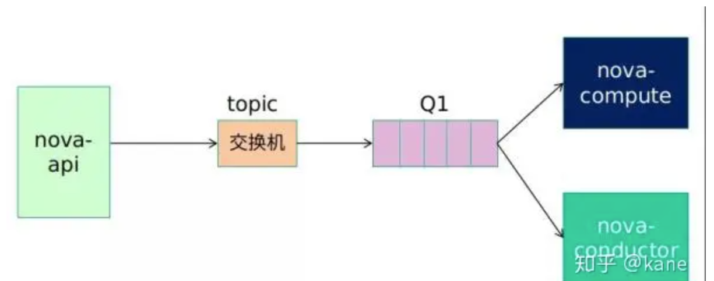

# RPC框架

Owner: -QVQ-

# 概念

**功能：**

RPC是远程调用系统简称，它允许程序调用运行在另一台计算机上的过程，就像调用本地的过程一样。

RPC指的是计算机A的进程调用另外一台计算机B的进程，A上的进程被挂起，B上被调用的进程开始执行，当B执行完毕后将执行结果返回给A，A的进程继续执行

RPC 实现了网络编程的“过程调用”模型，让程序员可以像调用本地函数一样调用远程函数。

**应用：**

RPC可以用于构建基于B/S模式的分布式应用程序：请求服务是一个客户端、而服务提供程序是一台服务器。和常规和本地的调用过程一样，远程过程调用是同步操作，在结果返回之前，需要暂时中止请求程序。

**RPC的优点：**

1. 支持面向过程和面向线程的模型；
2. 内部消息传递机制对用户隐藏；
3. 基于 RPC 模式的开发可以减少代码重写；
4. 可以在本地环境和分布式环境中运行；

**HTTP和RPC的区别**

用户调用接口 + 具体网络协议，应用层协议

- HTTP也是一种网络协议，但包的内容是固定的，必须是：请求行 + 请求头 + 请求体；
- RPC是一种自定义网络协议，由具体框架来定，比如SRPC里支持的RPC协议有：SRPC/thrift/BRPC/tRPC

用户接口的功能：

- 定位要调用的服务；
- 让我们的消息向前/向后兼容；

对于用户接口

|  | 定位要调用的服务 | 消息前后兼容 |
| --- | --- | --- |
| HTTP | URL | 开发者自行在消息体里解决 |
| RPC | 指定Service和Method名 | 交给具体IDL（接口描述语言） |

http牺牲了消息兼容，减少了用户调用接口函数。RPC和HTTP之间协议互通。

## RPC层级

- 用户代码（client的发送函数/server的函数实现）
- **IDL序列化**（protobuf/thrift serialization）
- 数据组织 （protobuf/thrift/json）//接口描述文件层
- 压缩（none/gzip/zlib/snappy/lz4）
- **协议** （Sogou-std/Baidu-std/Thrift-framed/TRPC）
- **通信** （TCP/HTTP）

## RPC运行的流程

- thrift：IDL纯手工解析，用户使用srpc是不需要链thrift的库的
- protobuf：service的定义部分纯手工解析

RPC


其中压缩层、序列化层、协议层都是相互解耦打通的，横向增加任何一种压缩算法或IDL或协议都不需要也不应该改动现有的代码

网络传输的数据必须是二进制数据，将传送数据转成二进制叫序列化，把二进制消息体逆向还原成请求对象，称为反序列化

**调用流程如下：**

1. 客户端调用客户端存根程序，将参数传入；
2. 客户端存根程序将参数转化为标准格式，并编组进消息；
3. 客户端存根程序将消息发送到传输层，传输层将消息传送至远程服务器；
4. 服务器的传输层将消息传递到服务器存根程序，存根程序对阐述进行解包，并使用本地调用的机制调用所需的函数；
5. 运算完成之后，将结果返回给服务器存根，存根将结果编组为消息，之后发送给传输层;
6. 服务器传输层将结果消息发送给客户端传输层；
7. 客户端存根对返回消息解包，并返回给调用方


为了达到这个目的，需要实现网络传输（socket）、序列化与反序列化（protobuf）、函数映射表等功能（std::function）

## RPC框架


**涉及到的技术**

1. **动态代理**
    
    生成Client Stub（客户端存根）和Server Stub（服务端存根）的时候需要用到java动态代理技术。
    
2. **序列化**
    
    客户端怎么把参数值传给远程的函数，在网络中，数据都必须转为字节进行传送，客户端把参数先转成一个字节流，传给服务端后，再把字节流转成自己能读取的格式。
    
    序列化和反序列化的定义是：
    
    - 将对象转换成二进制流的过程叫做序列化
    - 将二进制流转换成对象的过程叫做反序列化
    
    目前主流高效的开源序列化框架有Kryo、fastjson、Hessian、Protobuf等。
    
3. **NIO通信**
    
    Java 提供了 NIO 的解决方案，Java 7 也提供了更优秀的 NIO.2 支持。可以采用Netty或者mina框架来解决NIO数据传输的问题。开源的RPC框架Dubbo就是采用NIO通信，集成支持netty、mina、grizzly。
    
4. **服务注册中心（实现服务寻址）**
    
    通过注册中心，让客户端连接调用服务端所发布的服务。主流的注册中心组件：Redis、Zookeeper、Consul、Etcd。Dubbo采用的是ZooKeeper提供服务注册与发现功能。
    
    在本地调用中，函数体是直接通过函数指针来指定的，在远程调用中，所有的函数都必须有自己的一个 ID（进程内唯一），在客户端和服务端分别维护一个函数和Call ID的对应表。
    
5. **负载均衡**
    
    在高并发的场景下，需要多个节点或集群来提升整体吞吐能力。
    
6. **健康检查**
    
    健康检查包括，客户端心跳和服务端主动探测两种方式。
    

### 动态代理

RPC的一种调用技术

**实现方式：**就是代理模式，在接口上封装了一层代理类，调用接口的时候被代理类拦截，在代理类里面加入其他调用处理逻辑

**意义：**

便于管理大量接口，便于扩展接口，便于修改调用逻辑，便于扩展新的功能和维护

**JDK动态代理实现流程：**

代理的创建：构建代理器→绑定实例→绑定接口→生成代理实例

代理的调用：读取缓冲→生成字节码→反序列化class→new创建实例

### 服务注册中心

**服务发现：**注册中心记录服务对象方法、提供者的IP端口。这个获取服务对象方法提供者地址信息的过程就叫服务发现！

**服务注册：**服务提供方在正式提供服务之前要先把自己的服务对象注册到注册中心上，注册中心会把这个服务提供者的地址信息以及提供的服务对象名+方法名保存下来。

**服务订阅：**在服务调用方启动时，会去注册中心找自己需要的服务对象对应的服务提供者的地址信息，然后缓存到本地，为远程调用做储备。

### **健康监测**

网络中的波动，硬件设施的老化等等。可能造成集群当中的某个节点存在问题，无法正常调用

RPC 框架会根据路由和[负载均衡](https://so.csdn.net/so/search?q=%E8%B4%9F%E8%BD%BD%E5%9D%87%E8%A1%A1&spm=1001.2101.3001.7020)算法选择一个具体的IP 地址，为了确保每次选出来的IP对应的连接是健康的

**终极的解决方案是让调用方实时感知到节点的状态变化**

心跳机制：服务调用方每隔一段时间就和服务提供方进行一次通信确认状态。

节点的状态并不是固定不变的，它会根据心跳或者重连的结果来动态变化，

总共包含以下状态:健康状态（连接成功，心跳探活也一直成功）、波动状态（连接成功，但心跳请求连续失败）、失败状态（连接失败）。

**问题：**

通过心跳判断健康的阔值，如果太低，在负载高的情况下易连续心跳失败而造成断开连接

### 异步处理机制

**调用端实现异步：**

返回 Future 对象，通过GET方式获取结果；或者采用入参为 Callback 对象的回调方式，处理结果。

**DUBBO框架实现异步：**

调用端向服务端发送请求消息之前会先创建一个 Future，有一个唯一的消息标识和这个Future映射。动态代理所获得的返回值最终就是从这个future中获取。

收到服务端响应时，调用端根据唯一标识找到Future，将服务器的结果给Future，最后动态代理用GET方法从Future中获得到值

**服务端实现异步：**

RPC服务端接收到消息根据协议拆包解包，对消息解码和反序列化，再执行业务逻辑，这些操作不会由一个线程处理。服务端异步则需要一种回调方式，让业务逻辑可以异步处

### 路由

应用上线可能导致节点出现异常进而导致应用服务的不稳定因素，

灰度方式发布：先发布部分实例观察是否存在异常，后续再根据使用的情况，选择发布更多实例或是回滚已经上线的实例。

但多方调用频繁复杂，实例有问题会导致所有调用方业务收到影响

**实现路由：**

先让一小部分的调用请求进行逻辑验证，没问题再接入其他服务节点，实现流量隔离

①服务注册方向方式

通过服务发现的方式来隔离调用方的请求，但把这种复杂的计算逻辑放到注册中心内，当集群节点变多之后，就会导致注册中心压力很大，所以这个**方式不理想**

②RPC路由策略

在 RPC 发起请求的时候，结合一个**筛选逻辑(**即**路由策略)**从服务提供方节点集合里面选择一个合适的节点（负载均衡）

> 接收请求-->请求校验-->路由策略-->负载均衡-→
> 

**IP 路由策略：**用于限制哪些可以调用服务方的客户端 IP。

**参数化路由：**只值接收入参小于某值的节点，

通过 RPC 路由策略的组合使用可以让服务提供更加灵活地管理、合理分配流量

### 负载均衡

rpc框架实现，RPC 的服务调用方会与“注册中心”下发的所有服务节点建立长连接，在每次发起 RPC 调用时，服务调用方都会通过配置的负载均衡插件，自主选择一个最佳的服务节点，发起 RPC 调用请求

具体策略包括：**轮询、随机、权重、最少连接**等

**自适应的负载均衡：**

服务调用方**收集与之建立长连接的每个服务节点的指标数据**（如服务节点的负载指标、CPU 核数、内存大小、请求处理的耗时指标、服务节点的状态指标（CPU/内存占用率）），计算出分数

需要设置如下组件

①**指标采集器**收集服务节点 CPU 核数、CPU 负载以及内存占用率等指标，还包括请求耗时等数据，通过服务调用方与服务提供方的心跳数据来获取。可以配置开启哪些指标采集器并设置权重

②**计分器**，对节点打分，记录出权重给计分器

③**权重评定器**，记录权重

## 网络传输

**基于 TCP 协议的 RPC 调用**

由服务的调用方与服务的提供方建立 Socket 连接，并由服务的调用方通过 Socket 将需要调用的接口名称、方法名称和参数序列化后传递给服务的提供方，服务的提供方反序列化后再利用反射调用相关的方法。将结果返回给服务的调用方

优：由于 TCP 协议处于协议栈的下层，能够更加灵活地对协议字段进行定制，减少网络开销，提高性能，实现更大的吞吐量和并发数

缺：但是需要更多关注底层复杂的细节，实现的代价更高

平台兼容性不好，

**基于 HTTP 协议的 RPC 调用**

由服务的调用者向服务的提供者发送请求，服务的提供者可能会根据不同的请求方式做出不同的处理。类似网页访问

缺：HTTP是上层协议，发送同等内容，效率低，占用空间大，传输时间更长

## 使用R**abbitMQ 的 RPC 架构**

在 OpenStack 中服务与服务之间使用 RESTful API 调用，而在服务内部则使用 RPC 来调用和解耦服务内部功能模块，具有强扩展性，耦合性低

OpenStack 的 RPC 架构中，加入了消息队列 RabbitMQ，这样做的目的是为了保证 RPC 在消息传递过程中的安全性和稳定性。

### **RabbitMQ概念**

起到类似线程池的作用，接收任务放入队列，服务器处理完后，返回结果

**优点：**

- 同步变异步
    
    使用线程池将同步变异步，需要自己实现线程池
    
- 低内聚高耦合：解耦，减少强依赖。
- 流量削峰：通过消息队列设置请求值，超过阀值的抛弃或者转到错误界面。
- 网络通信性能提高：TCP 的创建和销毁开销大

RabbitMQ 采用信道通信，多条线程多条信道，公用一个 TCP 连接。

### **RabbitMQ的交换机**

RabbitMQ 使用 Exchange(交换机)和 Queue(队列)来实现消息队列。基于三种不同的交换机类型完成两种RPC调用方式

交换机决定了Routing Key如何加入队列

①**广播式交换器类型(Fanout)**

不分析所接收到消息中的 Routing Key，默认将消息转发到所有与该交换器绑定的队列中去。


**②直接式交换器类型(Direct)**

只转发至Routing Key 与 Binding Key精准匹配的消息队列

**③主题式交换器(Topic Exchange)**

转发至所有满足Routing Key 与 Binding Key模式匹配（支持通配符）的队列中，

### RPC.CALL（调用）和RPC.CAST(通知）

一种双向通信流程，


一个用户通过 Dashboard 创建一个虚拟机，封装后发送给 NOVA-API。NOVA-API 作为消息生产者，将该消息以 RPC.CALL 方式通过 Topic 交换器转发至消息队列。

此时，Nova-Compute 作为消息消费者，接收该信息并通过底层虚拟化软件执行相应虚拟机的启动进程。待用户虚拟机成功启动之后，Nova-Compute 作为消息生产者通过 Direct 交换器和响应的消息队列将虚拟机启动成功响应消息反馈给 Nova-API。此时 Nova-API 作为消息消费者接收该消息并通知用户虚拟机启动成功。

客户端创建 Message 时指定reply_to队列名、correlation_id标记调用者，返回时同样携带信息，客户端根据correlation_id判断是哪个函数的调用返回

RPC.CAST的远程调用和RPC.CALL类似，只是缺少了系统消息响应流程。


## 框架

```cpp
//服务端
注册服务器功能的回调函数
建立连接
接收命令参数
反序列化得到调用命令
上锁
通过调用命令查找回调函数，
try
	执行回调函数
catch（）
	异常处理
序列化结果
解锁
传回结果
```

```cpp
//客户端
建立连接
生成请求
序列化请求
发送请求
创建线程（）{
	接收数据
	反序列化
	使用结果
}
```

[C++ 简单实现RPC网络通讯_rpc c++_Thomas_Lbw的博客-CSDN博客](https://bobowen.blog.csdn.net/article/details/128695528?spm=1001.2101.3001.6650.1&utm_medium=distribute.pc_relevant.none-task-blog-2~default~CTRLIST~Rate-1-128695528-blog-102516185.235^v38^pc_relevant_yljh&depth_1-utm_source=distribute.pc_relevant.none-task-blog-2~default~CTRLIST~Rate-1-128695528-blog-102516185.235^v38^pc_relevant_yljh&utm_relevant_index=2)