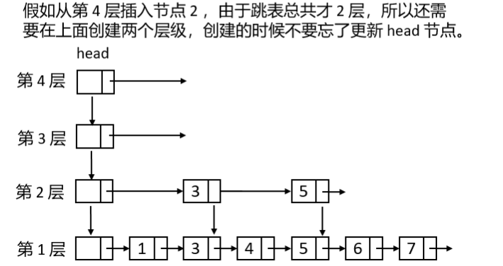
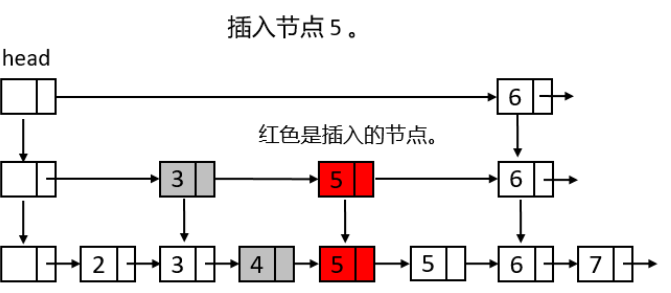
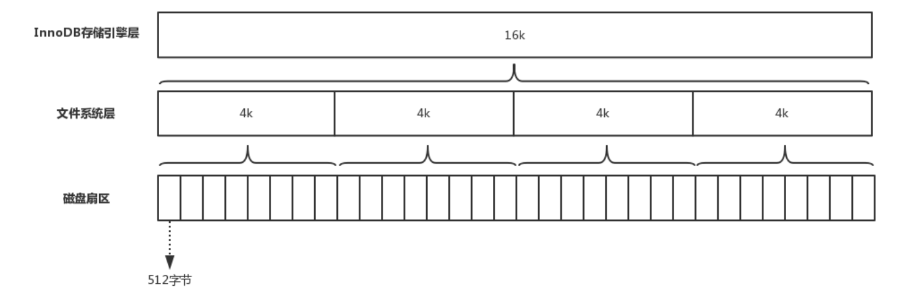
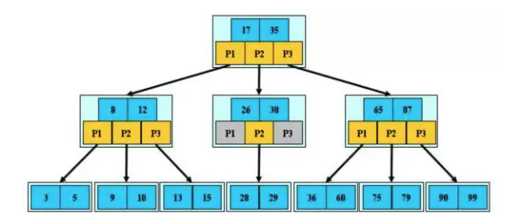
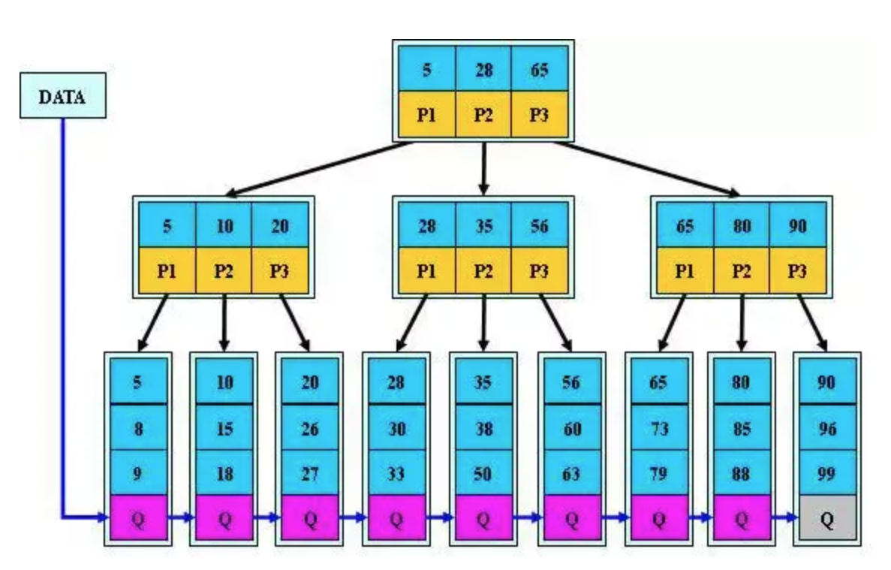
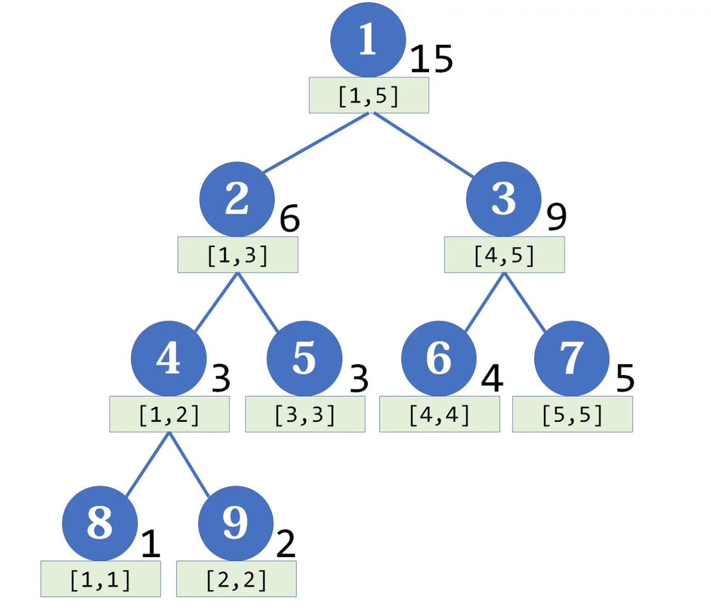

# 数据库的数据结构

Owner: -QVQ-

# 跳表

实现有序链表的快速查找

- 一个跳表有若干层链表组成；
- 每一层链表都是有序的；
- 跳表最下面一层的链表包含所有数据；
- 如果一个元素出现在某一次层，那么该层下面的所有层都必须包含该元素；
- 上一层的元素指向下层的元素必须是相同的；
- 头指针 head 指向最上面一层的第一个元素；

```cpp
// 跳表的节点类。
class SkipListNode {
     // 跳表节点的值，在实际应用中节点类可以加个泛型，这里为了方便介绍，直接使用 int 类型。
     int val;
     SkipListNode next;// 指向后面一个节点。
     SkipListNode down;// 指向下面一层的相同节点。
 }
```

最大值 MAX_LEVEL ：指定跳表的最大层级数

跳表中每一层都有一个头节点，不存储任何数据

**插入**

原始链表插入，上层链表可能也要插入，插入方式为随机性和确定性两种

随机性：

随机生成一个level，从level层往下每层都要插入，即在插入节点的时候从第几层开始插入

随机数满足越往上几率越小，1 的概率是0.5，2的概率是0.25，3的概率是0.125

底层是level=1，往高层level增加

实现方式一：允许存在一层为空

```cpp
private int randLevel() {
     int level = 1;// 1 的概率是0.5，2的概率是0.25，3的概率是0.125，4的概率是0.0625，……
     // Math.random()每次会生成一个 0 到 1 之间的随机数
     while (Math.random() < 0.5f && level < MAX_LEVEL)
         level++;
     return level;
 }
```

对于多线程插入需要上锁

这种做法允许存在一层为空

第一步：在跳表节点插入之前先判断上面的层级有没有创建，如果底层没有创建，要先创建

> 如果跳表仅允许创建比当前最大层级多一个层级，则在插入大量数据时，可能会导致所有数据都在较低的层级上，并可能导致跳表的查询效率下降。
也为了更好的拓展最大层
> 


第二步：如果创建了层级或者插入的层级小于跳表的层数，需要找到每一层待插入节点的前一个节点，用一个数组记录所有待插入的节点的前一个节点

第三步：从高层（2）往底层（1），在节点后面插入，连接next、down指针


**查询：**从上往下查找，后面没有节点或后面节点比查找的大则往下查找

**删除：**从上往下找到待删除节点的前一个节点，从当前层往下每一层都要删除，如果上面一层的节点都被删除完了，还需要把上层的链表清空

# B树

### 意义

数据库读取需要在磁盘上搜索，磁盘寻道开销时间大，10ms级，内存查询50ns级

B树：一个节点可以拥有多于2个子节点的查找树

**与平衡二叉树比起来：**

平衡二叉树需要旋转，如果部分加载到内存就没有办法完成旋转操作

平衡二叉树高度为logn，在逻辑上很近的节点可能实际很远，无法很好利用磁盘预读

**B-和B+树的区别：**

1. B+树节点不存放数据，数据都在叶子节点，B-树节点存放数据，这使得查询时间复杂度B+树固定为logn，B-树复杂度不固定，整体都等价于二分查找
2. B+树叶子节点两两相连可增加区间访问性（局部性原理），支持范围查找，B-树无法区间查找
3. B+树每个节点只有key没有value使得一个块可以存放更多的节点，对于单次磁盘IO，B+树可以访问更多的信息，从而整体减少查询的IO次数，因此更适合外部存储

MySQL使用B树

储存数据最小单元


**主存存储**

通常是随机读写存储器（RAM），抽象看是一系列的存储单元组成的矩阵，每个存储单元存储固定大小的数据

对于读，系统将地址信号放到**地址总线**上传给**主存**，主存解析信号并定位到指定**存储单元**，将数据放到**数据总线**上，供其它部件读取

对于写，将要写入单元地址和数据分别放在地址总线和数据总线上，主存读取两个总线的内容，做相应的写操作。

主存存取的时间仅与存取次数呈线性关系，不和距离有关系

**磁盘存取**

磁道、扇区、磁盘

## B-树

**定义**：一种多路搜索树


- 对于M叉树，是一种搜索树
- 非叶子节点的儿子数[M/2,M]（根节点例外）
- 每个节点放[M/2-1（向上取整）, M-1]个关键字，关键字排好序
- 非叶子节点的指针指向大于或者小于关键字的节点
- 指针数量比关键字多一个（可为空）
- 所以叶子节点位于同一层

**查找**

对节点内的关键字进行二分查找，命中则结束，否则进入对应的儿子节点

**特性**

关键字分布在整棵树中，一个关键字只出现一次

性能等价于在关键字全集内作一次二分查找O（logN）

由于性能总是等价于二分查找，所以不需要平衡

## B+树

**定义**


B-树的变体

非叶子节点的指针和关键字个数相同

非叶子节点的指针指向关键字大于当前关键字的数据

所有叶子节点链式串联

所有关键字都在叶子节点出现

**B+树的分裂**

当一个节点满了，分配一个新的节点，并将原节点1/2的数据复制到新节点，最后在父节点中新增新节点的指针，无关兄弟节点

**查找**

等同B-树，只是必须要到叶子节点才命中

**特性**

必须要到叶子节点才命中

非叶子节点起索引作用，叶子节点才是存储

适用于文件索引系统

## B*树

在B+树的基础上为非叶子节点之间加链表指针用于分裂

非叶子节点关键字个数至少为（2/3*M）个（代替B+树的1/2）

**B*树的分裂**

当一个节点满了，下个节点未满，将一部分数据移到兄弟节点中，再在原节点插入关键字，递归修改父节点中兄弟节点的关键字。

如果兄弟节点也满了，则在原节点和兄弟节点之间增加新节点，两个节点各复制1/3的数据到新节点，递归修改父节点

**特性**

B*优点：空间利用率更高，分配新节点的概率更低，节点的最低利用率从1/2提高到2/3

B+优点：*B+树在节点分裂时，只需要修改父节点的指针，而B**树需要递归修改父节点和兄弟节点的关键字，增加IO操作的开销。

# 线段树

一种**平衡二叉树，**维护区间信息，它可以实现O(logn)的区间修改，还可以同时支持多种操作（加、乘）

结构：

母结点代表整个区间的和，线段树的每个**节点**都对应一条**线段（区间），**越往下区间越小


上面节点右边的数字为两个子节点最大范围的和

中间节点为x，左右两边节点的范围为x/2，如果x为单数，允许右边多一个节点

**区间修改**

朴素的方式是用递归的方式层层修改

懒标记：对于正好是线段节点的区间，不再递归下去，而是打上标记，将来要用到它的子区间时，再向下传递

区间向下递归时有三种情况：

当前区间与目标区间没有交集：递归结束

区间被包括在目标区间里：更新当前区间，打上懒标记，不再向下递归。

当前区间和目标区间相交，但不包含：把区间一份为二，分别处理，存在懒标记，则需要传递给字节点，两个子节点对应更新

[算法学习笔记(14): 线段树](https://zhuanlan.zhihu.com/p/106118909)