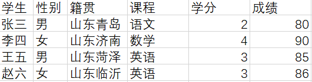
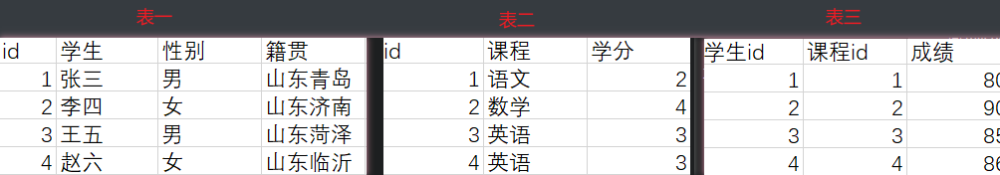
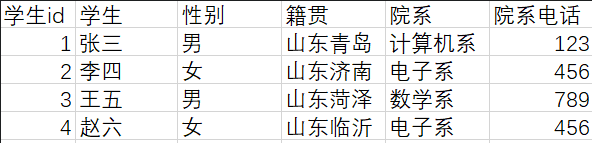
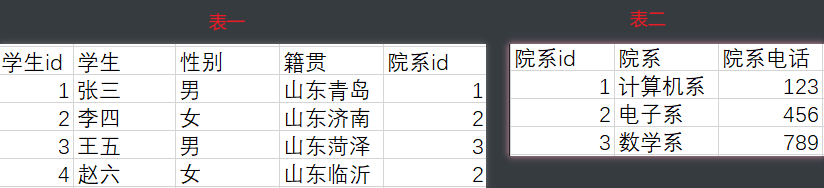

# 概念

Owner: -QVQ-

**纵向拓展**通常指增加更多的处理器和内存获得更多的计算能力

**横向拓展**是指通过增加更多的服务器节点来增强系统的性能和容量

包含读写分离：主数据库负责文本的写操作，从数据库负责数据读的操作（可以一写多读）

垂直切分：将一个数据库按照不同功能划分成不同的数据库（例如用户管理、订单管理）

水平切分：同一个表中的数据分片保存到不同的数据库中（例如用用户ID）

# 关系型和非关系型数据库

## **关系型数据库**

采用关系模型来组织数据的数据库，即二维表格模型

例如：SQL Server、Oracle、Mysql、PostgreSQL、SQLite

**优点：**容易理解、使用方便（通用的sql语句）、易于维护（ACID属性降低了数据冗余和数据不一致的概率）、多语句作复杂查询、存储在磁盘中安全可靠

**瓶颈：**

海量的数据读写效率低

难以横向拓展

高并发读写能力差，硬盘I/O，最大连接数优先

数据模型灵活度低，需要先知道存储什么类型的数据

最大特点是事务的一致性，因此适用于银行系统等对一致性要求高的系统种，对应的读写性能较差

对于网页应用对并发读写能力要求更高，一致性的要求没有那么严格，允许有一定的时间间隔，更适用于非关系型数据库

## **非关系型数据库（NoSQL）**

指非关系型的、分布式的、一般不保证ACID的数据存储系统

例如：MongoDB、Redis、CouchDB

以键值存储，结构不稳定，每个元组有不一样的字段，从而不会局限于固定的结构，减少时空开销

**分类**

面向高性能并发读写的KV数据库（Redis、Tokyo Cabint）

面向海量数据访问的面向文档数据库、可在海量数据库快速查询数据（MongoDB、CouchDB）

面向可拓展的分布式数据库

优点

关系型数据库只支持基础类型，NoSQL支持灵活的储存数据格式

速度快、效率高，可以用硬盘和随机存储器为载体

海量数据的维护和处理轻松、可扩展、高并发、成本低

## 对比

**事务：**Nosql没有ACID，每个数据集都是原子级别的，SQL种多张表同批次更新，一张失败整体失败(可以通过事务来控制，在所有命令完成之后，再统一提交事务)

**存储**：Sql通常以数据库表的形式存储，增加外部关系使用的是外键，使

Sql将数据分配成最小的逻辑表来存储，多表管理相对复杂，NoSql用kv的形式存储，单个数据库存储为一个整体，整体读取效率更高

**结构上**：sql中必须定义好地段和表结构才能写数据，对于结构变更会比较麻烦

**数据间**：表格型的关系型数据库数据存储在表中的行和列，彼此关联容易提取，NoSql是大块存储到一起

**数据：**关系型数据库只支持基础类型，NoSQL支持灵活的储存数据格式

**存储载体**：NoSQL可以用硬盘和随机存储器为载体，SQL只能用硬盘

通常一个项目，对于结构化的数据（用户的账号信息）采用关系型数据库，因为通常用结构化查询、数据的规模增长速度可预期

对于非结构化的数据（文章评论）采用NoSql，因为数据是海量的(用结构胡查询就很慢)、增长速度难预期

# 数据库的比较

## etcd和ceph

etcd的数据量小（几十G），但并发数量高几个量级

ceph

**客户端服务端模式的数据库**

适用于数据与应用分离

关系数据库的作用是减少带宽数据过滤，因此最好将数据库引擎和数据保持在同一个物理设备上

数据位于与应用程序不同的设备上时

适用于多个并发写入

对于大量的数据，不适合放入单个磁盘文件的大小

**使用场景：**客户端服务器应用程序、大容量网站、大数据量、高并发

## etcd和Redis比较

etcd和Redis都是非关系型数据库，适用于不同的场景。

- etcd是一个分布式键值存储系统，用于存储配置数据和服务发现。它提供了强一致性和高可用性的特性，适用于构建分布式系统和微服务架构。
- Redis是一种键值存储和缓存数据库，支持多种数据结构和功能，如字符串、列表、哈希、集合等。它以高性能和低延迟的方式处理数据，适用于高并发读写和缓存需求的场景。

## levelDB和Redis比较

都属于非关系型数据库，适用于大量数据高性能并发读写的场景。

然而，它们也有一些区别：

- levelDB是一种键值存储数据库，而Redis是一种键值存储和缓存数据库。
- levelDB更加轻量级，适用于嵌入式设备和物联网应用，而Redis更加强大和功能丰富，适用于更复杂的应用场景。
- levelDB支持本地文件存储，而Redis支持网络访问和分布式部署。
- levelDB的数据结构不稳定，每个元组可以有不同的字段，而Redis的数据结构更加稳定和灵活，支持多种数据类型。

综上所述，levelDB和Redis在某些方面有相似之处，但也有一些区别，具体使用哪种数据库取决于应用的需求和场景。

## SQLite数据库

适用于取代本地的文件存储和高并发的网站使用

不是客户端服务端模式

强调可伸缩性、并发性、集中性和可控性

不需要配置或维护

每个SQLite数据库文件一次只支持一个写入，不适合高并发写入

适用数据与发起SQL语句的应用在同一设备上

适用于数据较小，最大281TB的数据，但当数据规模达到TB以上时适用于客户端服务端模式

**最佳工作环境：**嵌入式设备和物联网、应用程序的文件存储格式、网站、企业数据缓存、数据分析、服务器端数据库

# 事务

数据库事务的**特性（ACID）**，包括以下四个方面：

- **原子性（Atomicity）：** 事务是一个原子操作，要么全部执行成功，要么全部执行失败，不存在部分执行的情况。
- **一致性（Consistency）：** 事务在执行之前和执行之后，数据库的完整性约束没有被破坏。换句话说，事务将数据库从一种一致性状态转换到另一种一致性状态。
- **隔离性（Isolation）：** 并发执行的事务之间应该相互隔离，每个事务都感觉不到其他事务的存在，并且并发执行的结果与顺序执行的结果相同。
- **持久性（Durability）：** 一旦事务提交，其所做的修改将永久保存在数据库中，即使系统发生故障也不会丢失。

ACID属性确保了数据库事务的可靠性和一致性，是关系型数据库的重要特性。

在关系型数据库中，外键是用来建立表与表之间的关系的一种机制。它是一个字段，用于将一个表的数据与另一个表的数据进行关联。通过在一个表中定义外键，可以确保数据的完整性和一致性。

**外键**是一个指向另一个表中主键的字段。它定义了两个表之间的关系，可以用来连接两个表并创建引用。通过外键，可以在一个表中引用另一个表中的数据。例如，在存储用户信息的表中，可以通过在用户信息表中定义一个外键来关联到另一个表，如存储地址信息的表。这样，在查询用户信息时，可以使用外键来获取关联的地址信息。

使用外键可以实现数据的引用完整性，确保关联数据的一致性和正确性。当在一个表中定义了外键时，系统会自动检查外键的引用完整性，确保在关联的表中存在对应的数据。如果试图插入或更新一个关联数据不存在的外键值，则会导致错误。

总的来说，外键是用来建立表与表之间关系的重要机制，它可以通过关联和引用数据来实现数据的完整性和一致性。

# memcached

开源的、高性能、具有分布式内存对象的缓存系统，

- kv缓存
- 协议简单
- 不持久化
- 没有安全机制
- 互不通信的memcached有分布式特征

# 三大范式

## 意义

避免数据冗余、

提高查询和更新效率：数据冗余使得更新某个数据需要修改多行数据（例如某课程的学分），如果分表了只需修改一行

数据一致性、完整性：更新某个数据需要修改多个学生的信息，那么修改的过程中会出现有些学生查到的是新的，有些学生查到的是旧的

## 原理

### 第一范式（1NF）原子性：

表中每一列信息都不可再分

### 第二范式（2NF）唯一性：

通过一个主键字段或者一个联合主键字段可以唯一确定一行，且表中其他非主键字段一定完全依赖所有主键字段，而不是部分依赖

例如：

对于这个表，通过学生和课程可以唯一确定一行，联合主键索引（学生、课程）。但学分依赖于课程，不依赖学生。成绩依赖学生不依赖课程，因此不满足第二范式。

分表修改如下

### 第三范式（3NF）独立性：

对于非主键索引之间，不能有依赖性

例如：

表中学生id作为主键唯一确定一行，满足第一范式和第二范式，但非主键中院系电话依赖于院系，因此不满足第三范式

修改如下：

# 分库分表

分库：单一数据库的连接量，读写性能达上限，需要分库

分表：

- 数据量过大，超过三层b+树索引，

## 垂直分库

将一个库的表按照业务类型拆分到多个库，每个库的表不一样

- 降低单库压力
- 各系统间解耦

需要考虑数据一致性，引入分布式事务

跨库多表join问题：

- 需要join的字典不拆表
- 对join字段冗余

## 垂直分表

拆分表结构，按照范式原则拆分一个表为多个子表

- 提高缓存命中率，（数据库以行为单位缓存数据，拆分后可以只缓存访问频率高的字段，从而能缓存更多数据）
- 提高查询更新效率
- 降低数据冗余
- 保证数据一致性

## 水平分库

用哈希映射，将不同数据映射到不同库，从而支持大规模数据存储

- 提高集群并发能力

单库的自增ID需要引入分布式自增ID

## 水平分表

同一库内，将单表按数据拆分为多个表

- 降低单表数据量，降低b+树高度，提高查询速度
- 

