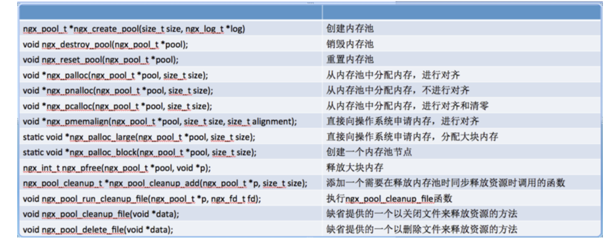
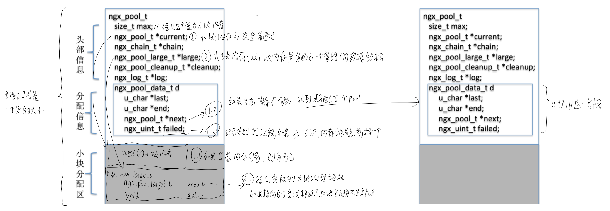
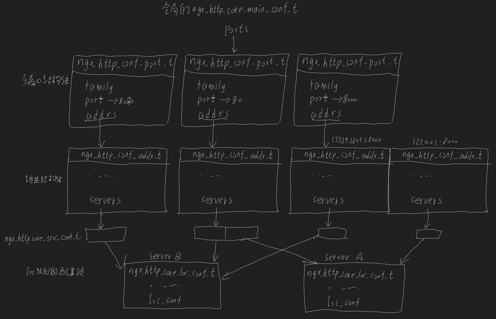
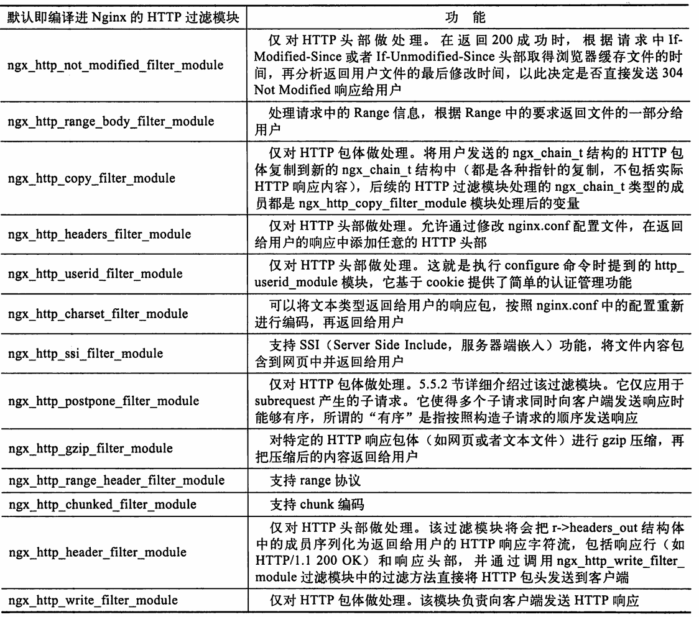
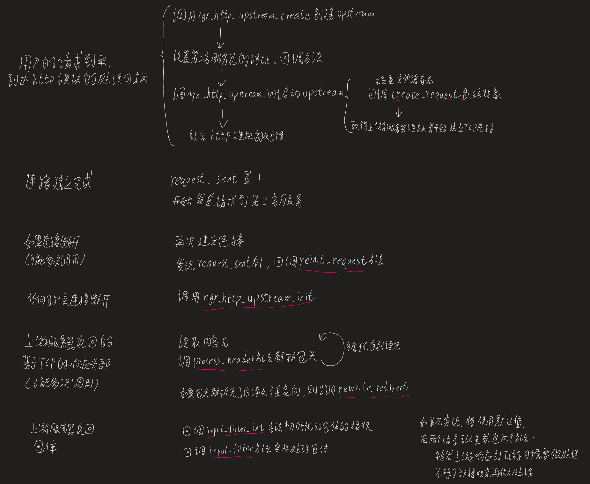

## nginx作为反向代理

> 通常nginx能作为反向代理服务器和静态web服务器

对于一组请求，nginx会将请求完整的缓存到代理服务器，再向上游服务器转发。这是为了如果接到请求就和上游服务器建立连接，当用户请求传输的数据很大，且用户请求转发走公网速度较慢，上游服务器这个连接在很长时间被浪费了。代理服务器缓存完再请求上游服务器，这时走内网速度较快，上游服务器返回数据时代理服务器不缓存直接转发客户端。最终降低了上游服务器的压力，将压力全部由nginx服务器承担


## http配置项

### 原理

```shell
# 通常一个http，多个server，一个server里多个location
http{
	server{
		listen 80;#
		server_name somename alias another.alias;
		location / {
			root html;
			index index.html index.htm;
		}
	}
	server{
		listen 443 ssl;# 通常443是https的端口
		server_name localhost;
		location / {
			root html; # 定位根路径（html这个文件夹）
			index index.html index.htm; # 找到index.html,如果没有就找index.htm
		}
		location /private{
			auth_basic "Restricted Area"; # 
			auth_basic_user_file /etc/nginx/.htpasswd;# 这两个参数设置http基本认证
			allow 192.168.1.0/24;# 
			deny all;#这两个参数设置ip地址或CIDR范围访问权限
			satisfy any; # 这个参数为all表示用户需要满足上面的所有条件
						# 这个参数为any表示用户只需满足上面一个条件即可
		}
		tyr_files file1 file2 fallback; # 依次访问file1、file2,如果文件存在就返回给用户，如果都不存在则通过fallback重定向到其他location
	}
}
```

执行流程如下，比如对于`https://aliyuque.antfin.com/gdc_tsc/vlyqvz/wuk85n#176153a`这个地址的请求：

1. 客户端通过url访问服务端时，通常会指定端口如‘http://www.example.com:8080/path_to_file’，如果没有指定端口，浏览器通常会根据协议类型自动使用默认端口。http默认80端口，https默认443端口
2. 通过ip+端口找到服务器后，会根据server_name来找到对应的server，（实际中可能有多个域名对应同一个ip，这个不同域名对应不同的server），那么`aliyuque.antfin.com`就是一个server
3. 域名后面的部分表示要访问的资源路径，对应一个的location，通过`gdc_tsc/vlyqvz/wuk85n`定位location

### 数据结构

`nix_module_s` nginx 模块的控制块

`ngx_http_module_t` 读取配置文件时在读取的不同阶段要处理的回调函数

`ngx_command_s` 对模块的处理方法


对于http模块处理请求阶段，传入的参数`ngx_http_request_s`，主要包含以下几部分:

1. 方法名

​	通常直接用r->method这个整型成员和宏比较判断，或者用request_start、method_end指向方法名的开始和结束位置

2. URI

- uri_start和uri_end指向URI的开始和结束的下一个位置
- extern成员指向用户请求的文件扩展名
- unparsed_uri表示没有进行URL解码的原始请求
- args_start指向URL参数的起始地址，uri_end指向结束地址
- http_protocol指向用户请求中http的起始地址
- http_version时nginx解析过的协议版本
- request_start和request_end可以获取原始的用户请求行

3. 获取http头部

header_in指向nginx收到的未解析的头部，headers_in指向解析后的头部，其中的headerss一个链表，每个节点都是一个kv表，可以通过遍历链表来获取所有http头部

4. 获取http包体

异步接收包体，避免一次性读包体会阻塞nginx进程

`ngx_int_t ngx_http_read_client_request_body(ngx_http_request_t*r,ngx_http_client_body_handler_pt post_handler);`

当所有包体接受完后，会调用post_handler指向的回调方法，即这个函数返回并不能说明包接受完了

使用了这个函数，那么调用这个函数的上层`ngx_http_mytest_handler`函数的返回值就要是`NGX_DONE`

### 模块的配置项

```shell
ngx_feature_test="#include<someheader.h> int main(){return some_function();}"#变量的内容是c语言代码，用于自动检测环境是否支持当前代码
ngx_feature_incs=""# 表示当前这个脚本测试的时候需要包含的头文件


ngx_module_incs=""# 这个模块自身编译需要的头文件
```


## nginx模块

分类为五类：核心模块、mail模块、http模块、conf模块、事件模块，

框架定义核心模块和配置模块，框架使用核心模块，其他模块继承配置模块

核心模块定义了mail、http、事件模块的基础，mail、http、事件模块的基础三类模块中都有一个主要管理的运行模块

- 所有事件模块由其中的nxg_events_module核心模块定义，ngx_event_core_module模块加载完成
- 所有http模块由其中的ngx_http_module核心模块定义和加载完成，ngx_http_core_module负责决定具体的请求选择哪个http模块
- mail模块和http模块相似

## 事件驱动架构

传统的服务器上每个事件消费者独占一个进程资源，主进程处理连接和关闭事件，子进程处理其他事件。nginx是有五类事件由事件分发器感知后短暂调用对应的处理模块，只有事件收集器会独占进程资源。

这带来了更低的用户感知请求时延和并发吞吐，但也要求事件消费者不能有阻塞行为，不然将导致其他事件得不到相应

**请求的多阶段异步处理：**

一个请求如果有阻塞的部分，会根据阻塞的点划分成多个阶段：

1. 将同步变为异步
   比如send数据，第一阶段，事件调用非阻塞的send函数然后退出，当读函数返回结果时会通知事件分发器调用模块处理，开启第二阶段

2. 将长任务分解成多个小任务

   有些触发事件不能被事件收集者收集，则只能拆分执行时间

   比如，读文件（如果系统不支持异步读，这意味着事件收集者无法感知读完），将10MB划分成1000份，每次读10KB并发送，发送成功后会触发网络事件，从而通知事件收集者调用模块进入下一阶段的读取发送

3. 自旋锁或其他循环等待事件，则使用定时器

   有时可能需要持续的检查标志位直到可以继续往下走，此时应该使用定时器来代替循环检查。

   定时器事件发生就检查标志，不满足就退出并注册下个定时器

4. 某个阻塞方法没法划分阶段

   首先判断这个阻塞是否必要，因为它违反了当前的事件驱动架构，如果必须要，那么

   阻塞前和阻塞后由事件分发器调用，当要阻塞时使用一个单独的进程来执行阻塞，阻塞完毕后响分发器通知继续执行

当处理完一个阶段后，等待内核产生下次事件，使得事件分发器调用事件消费者处理事件

这样使进程占用的内存提前释放，提高并发

## 多进程模式

通常一个master管理进程，多个worker工作进程，1个可选的cache manager进程，1个可选的cache loader进程

多个进程间平等，通过进程通信实现负载均衡

## 框架启动流程

main里面：

1. 解析命令行处理参数
2. 时间、正则、错误日志、ssl等初始化
3. 如果处在升级中，需要处理父进程传来的环境变量，恢复资源信息

Ngx_init_cycle()里面: 

4. 初始化所有容器
5. 生成**核心模块**的配置结构（调核心模块的create_conf），http模块实际上并没有自己的create_conf方法
6. 调用ngx_conf_param解析命令行参数
7. 调用ngx_conf_parse解析配置文件，读取nginx.conf配置文件，每读一行，拿key和各个模块用ngx_command_t注册的命令比对，匹配了就会调对应的句柄。这个过程会处理完全部的http的各级配置
8. 初始化**核心模块**（调核心模块的init_conf）、对于http模块来说这里也是null
9. 创建目录打开资源等、设置socket句柄柄监听端口
10. 初始化**所有模块**（调模块的init_module方法），对于http和http_core这个也是没有的

main里面：

10. 根据设置启动master、worker进程，worker进程执行`ngx_worker_process_cycle`函数
11. 调用所有模块的init_process方法

其中，ngx_conf_parseh函数对配置的解析：


**worker进程的循环：**

`ngx_worker_process_cycle`函数内会循环`ngx_process_events_and_timers`，另外四个全局标志位会根据收到的四种信号改变，控制worker的执行

| 全局标志位 | 信号 | 意义 |
|----  | ----  |---- |
| ngx_reopen  | USR1  | 用-s reopen重新打开所有文件,用于把当前日志文件转移到其他目录再重新生成新的日志文件 |
| ngx_quit  | QUIT  | 安全的关闭进程，关闭连接-等待计时器-是否内存池 |
| ngx_terminate  | TERM、INT  | 强制关闭进程，只释放内存池 |
| ngx_exiting  | ？  | ？ |

**master进程的循环：**

master和worker循环方式不同，master只收到了信号才开始执行一遍循环

| 全局标志位        | 信号          | 意义                                                         |
| ----------------- | ------------- | ------------------------------------------------------------ |
| ngx_reap          | CHLD          | 有子进程意外结束,ngx_reap_children                           |
| Ngx_quit          | **QUIT**      | 安全退出,先等待关闭子进程后，删除pid文件，销毁监听，释放内存 |
| ngx_terminate     | **TERM、INT** | 强制关闭                                                     |
| ngx_reconfigure   | HUP           | 重读配置文件并使新配置生效                                   |
| ngx_restart       | 无            | master进程内部使用的，感觉没啥意义                           |
| ngx_reopen        | **USR1**      | 重新打开服务所有文件                                         |
| ngx_change_binary | USR2          | 平滑更新nginx版本                                            |
| ngx_noaccept      | WINCH         | 所有子进程不再接收新的连接，相当于对子进程发送QUIT信号量     |

```c
//master函数的执行伪代码
void ngx_master_process_cycle(ngx_cycle_t *cycle){
      sigemptyset(&set);
  
  		/*……添加6个信号量用于屏蔽他们……*/
    	sigaddset(&set, SIGCHLD);//
  		/*……*/
	
  		//sigaction函数则是对set里的信号作相应
  		sigprocmask(SIG_BLOCK, &set, NULL);//设置当前进程屏蔽这些信号量
      sigemptyset(&set);//清空set
  
      ngx_start_worker_processes();//开启子进程

  		/*子进程会向事件驱动模块注册ngx_channel_handler函数，事件驱动模块会在收到信号号调用ngx_channel_handler，设置上面提到的全局标志位*/
  		//怎么保证这个顺序的
  
  		for(;;){
          sigsuspend(&set);//阻塞当前进程，并将信号屏蔽字临时设置为set内的（这里就是清空所有的屏蔽信号）直到有信号量发生时将退出阻塞并恢复上面设置的信号屏蔽字
        	//此时恢复到屏蔽6种信号量的时候，这么做是为了避免当前处理信号时又有新的信号产生

            /*………对上面提到的6种标志位一次判断并处理………*/
					if(ngx_reap)……；
            /*……*/
      }
}
```

## 一个基本的模块所需要的数据对象

```c
ngx_command_t;//模块配置
ngx_http_module_t；//具体模块的初始化方法
ngx_module_t ;//定义模块
```


# 框架数据结构

## nginx框架结构

一个nginx服务只有一个ngx_cycle_s类型的全局变量，包含配置文件，使用资源等信息

```c
struct ngx_cycle_s{
  /*---------------模块和内存对象---------------------*/
  void ****conf_ctx;//存放所有模块的配置信息，有多少模块就有多少指针，本身是个数组的指针，每个成员又指向了一个数组的指针，即二维数组
  //一种访问方式，conf_ctx[ngx_http_module->index]指向ngx_http_conf_ctx_t
  //第一维长度为5，代表5类模块，第二维为这类模块的具体模块们的配置
  
  ngx_pool_t  *pool; // 内存池对象
  
  /*---------------日志对象---------------------*/
  //在配置文件还没有解析之前（ngx_init_cycle方法）先使用自带的log对象，在解析时先解析道new_log里，完成解析后，用new_log的地址覆盖log对象
  //全局配置信息存放在这里，配置的http、server、local里的error_log对象保存在ngx_http_core_loc_conf_t->error_log
  ngx_log_t                *log; //日志对象
  ngx_log_t                new_log;
  
  /*---------------连接对象---------------------*/
  //没看懂？有些模块会预先生成连接对象，以加速事件的收集、分发
  ngx_uint_t files_n;//总数
  ngx_connection_t **files;//指针对象
  
  //可用连接池，发起连接就从表头取一个，归还连接就插入表头
  ngx_connection_t *free_connections;//单向链表
  ngx_uint_t free_connection_n;
  
  //可重复使用长连接队列
  ngx_queue_t reusable_connections_queue;//双向链表容器
  
  //监听的端口和相关参数，有多少个worker进程就会复制多少个ngx_listening_t
  ngx_array_t               listening;// 动态数组，每个数组元素储存着ngx_listening_t成员（表示一个监听端口及相关的参数）

  //nginx认为每个连接对象都一定有读写事件，因此用同一个数组下标就可以访问（连接对象，读，写事件对象）
  ngx_uint_t connection_n;//同时表示下面3个对象的总数
  ngx_connection_t* connections;//当前已连接对象
  ngx_event_t* read_events;//所有读事件对象
  ngx_event_t* write_events;//所有写事件对象
  
  /*---------------文件对象---------------------*/
  //nginx所有要操作的文件目录，如果创建目录失败将导致nginx启动失败
  ngx_array_t pathes;//动态数组容器
  //打开的文件指针，模块添加的文件路径，nginx框架在ngx_init_cycle方法中打开这些文件
  ngx_list_t open_files;//单链表容器
  
  /*---------------配置信息---------------------*/
  ngx_str_t conf_file;//配置文件相对于安装目录的相对位置名称
  ngx_str_t conf_param;//命令行携带的部分参数（通常是-g）
  ngx_str_t conf_prefix;//配置文件的路径
  ngx_str_t prefix;//安装路径
  ngx_str_t lock_file;//进程间同步的文件锁名称
  ngx_str_t hostname;//主机名
  ngx_uint_t files_n; //每个进程能够打开的最多文件数
  
  /*---------------其他---------------------*/
  //启动初期用它保存临时对象
  ngx_cycle_t* old_cycle;
}

void ngx_init_cycle();//这个方法初始化构造ngx_cycle_s对象
```

## nginx的进程管理

```c
ngx_process_t    ngx_processes[NGX_MAX_PROCESSES];//存储所有子进程的数组
typedef struct {
    ngx_pid_t           pid;
    int                 status;//进程的状态
    ngx_socket_t        channel[2];//用于master和worker通信

    ngx_spawn_proc_pt   proc;//子进程的循环执行方法
    void               *data;//上面函数的参数
    char               *name;//进程名称

    unsigned            respawn:1;//重新生成子程序
    unsigned            just_spawn:1;//正生成子程序
    unsigned            detached:1;//正在父子进程分离
    unsigned            exiting:1;//正退出
    unsigned            exited:1;//已经退出

#if (T_PROCESS_IDX_ALI)
    int                 proc_idx; /*工作进程编号*/
#endif
} ngx_process_t;

//父进程调用其创建子进程，其中封装了fork函数
ngx_pid_t ngx_spawn_process(ngx_cycle_t *cycle, ngx_spawn_proc_pt proc, void* data, char* name, ngx_int_t respawn);
```

进程的状态改变：

子进程意外退出时，内核发送CHLD信号，nginx的信号处理函数ngx_process_get_status会将sig_reap置1，遍历进程数组修改对应的状态

## 模块数据结构

所有模块的基类

```c
struct ngx_module_s {//
    ngx_uint_t            ctx_index;//同类模块中的序号
    ngx_uint_t            index;//所有模块中的序号

    char                 *name;//new

    ngx_uint_t            version;//模块的版本
    const char           *signature;//new？

    void                 *ctx;//具体模块的内容（子类内容）
    ngx_command_t        *commands;//子类注册的命令信息
    ngx_uint_t            type;//模块类型，core、http、event、mail、conf
    /*……*/
    /*模块初始化函数指针*/
    /*保留变量*/
    /*……*/
};
```

事件模块类型

```c
struct ngx_event_module_t{
    ngx_str_t              *name;//名字
		//解析配置的两个阶段调用
    void                 *(*create_conf)(ngx_cycle_t *cycle);
    char                 *(*init_conf)(ngx_cycle_t *cycle, void *conf);
		//每个事件模块需要实现的10个抽象方法
    ngx_event_actions_t     actions;
} ;//

struct ngx_event_actions_t{
  //增删事件
  ngx_int_t  (*add)()
  ngx_int_t  (*del)()
  //启用、取消事件，未使用
  ngx_int_t  (*enable)()
  ngx_int_t  (*disable)()
  //增删连接事件
  ngx_int_t  (*add_conn)()
  ngx_int_t  (*del_conn)()
  //？
  ngx_int_t  (*notify)()
  //对事件的统一处理方法
  ngx_int_t  (*process_events)()
  //初始化和退出事件模块
  ngx_int_t  (*init)()
  ngx_int_t  (*done)()
};
```

## 事件数据结构

```c
struct ngx_event_s {
    void            *data;//通常指向ngx_connection_t连接对象
  
    unsigned         write:1;//表示事件是否可写
    unsigned         accept:1;//是否可以建立新的连接
    unsigned         instance:1;//用于判断事件是否过期
    unsigned         active:1;
    unsigned         disabled:1;//是否禁用事件，epoll事件驱动下无意义
    unsigned         ready:1;//是否就绪可消费（例如一次写事件可能经过多次执行才完成，进入下一次就绪状态）

    unsigned         timedout:1;//定时器超时
    unsigned         timer_set:1;//这个事件是否存在在定时器中
    unsigned         delayed:1;//是否需要延迟处理这个事件

    unsigned         deferred_accept:1;//是否三次握手后 不建立连接，收到数据包才建立连接
    int              available;//尽可能的多建立tcp连接

    ngx_event_handler_pt  handler;//回调方法

    /*………………………………*/
};

```

## 连接对象

这两个连接对象都只能从连接池中拿到

```c
struct ngx_connection_t{
  struct ngx_connection_s {
    /*连接对象未使用时作为链表的next指针
    使用了则由使用它的模块定义*/
    void               *data;
    ngx_event_t        *read;//连接对应的读事件
    ngx_event_t        *write;//连接对应的写事件

    ngx_socket_t        fd;//套接字句柄
		//收发网络字符流的方法
    ngx_recv_pt         recv;
    ngx_send_pt         send;
		
    ngx_listening_t    *listening;//这个连接对应的监听对象
    off_t               sent;//已经发出去的字节数量
    /*………………………………*/
};//被动连接建立的对象
  
struct ngx_peer_connection_t{
  ngx_connection_s *conection;//每次使用对象时，一般都重新生成一个这个结构体，依然是从连接池中获取
    /*………………………………*/
}//nginx主动去连接建立的对象，是ngx_connection_s简单的封装
```

## 变量

同一个请求在模块间的传递或在配置文件里使用模块动态的数据（例如配置里设置的ip）

两种变量定义的方式，一种是在配置文件里用set定义，一种是在模块中定义变量后导出

请求阶段赋值变量，同时保存在数组和hash表里（可选）

```c
//变量实际存储的结构体
typedef struct ngx_http_variable_value_t {
    unsigned    len:28;  /* 变量值的长度 */  
    unsigned    valid:1;   /* 变量是否有效 */  
    unsigned    no_cacheable:1;  //变量是否是可缓存的
    unsigned    not_found:1; /* 某个变量没用能够通过get获取到其变量值*/  
    unsigned    escape:1;  /* 变量值是否需要作转义处理*/  
    u_char     *data;  /* 变量值 */  
} ngx_variable_value_t;
```

```c
//这个结构体每个请求生成时包含，通过这个结构体在数组中找到上面那个结构体
struct ngx_http_variable_s{
    ngx_str_t name;
    ngx_http_set_variable_pt set_handler;
    ngx_http_get_variable_pt get_handler;
    uintptr_t data;//传递给回调的参数
    ngx_uint_t flags;//变量的属性
    ngx_uint_t index;//在数组中的索引
};
//变量的属性包括
#define NGX_HTTP_VAR_CHANGEABLE 1 //这个变量可变，通常arg_xxx这类变量是只读的不可变
#define NGX_HTTP_VAR_NOCACHEABLE 2 //每次都去取值，而不是直接返回cache的值
#define NGX_HTTP_VAR_INDEXED 4 //需要用索引读取这个变量
#define NGX_HTTP_VAR_NOHASH 8 //这个变量不需要被hash

//get和set的回调原型
void (*ngx_http_set_variable_pt) (ngx_http_request_t *r, ngx_http_variable_value_t *v, uintptr_t data);
ngx_int_t (*ngx_http_get_variable_pt) (ngx_http_request_t *r, ngx_http_variable_value_t *v, uintptr_t data);
```

初始化流程：

1. 解析http时会调用ngx_http_variables_add_core_vars来将变量添加到全局的hash key链中
2. 解析完http模块后，调用ngx_http_variables_init_vars初始化变量
3. 对每个请求创建一个变量数组

**创建变量：**

调用`ngx_http_add_variable`创建变量，将变量name添加进全局的hash key表中并初始化域

```c
//定义变量，后面会将其注册
static ngx_http_variable_t ngx_http_fastcgi_vars[]={
    {ngx_string("fastcgi_script_name"),NULL,
     ngx_http_fastcgi_script_name_variable,0
     NGX_HTPP_VAR_NOCACHEABLE|NGX_HTTP_VAR_NOHASH,0  
    },//变量1 
    {}//变量2
}
//模块定义
static ngx_http_module_t 模块名{
    ngx_http_fastcgi_add_varibales,//通常在定义模块时设置预处理函数里声明变量
    NULL,
    ……
};
//上面设置了在模块初始化配置信息之前会调用这个函数创建变量
static ngx_int_t ngx_http_fastcgi_add_varibales(ngx_conf_t* cf){
    ngx_http_variable_t *var,*v;
    for(v=ngx_http_fastcgi_vars;v->name.len;v++){//循环遍历变量表添加变量
        var = ngx_http_add_variable(cf, &v->name, v->flags);//将变量放入到全局变量中
        if(val==NULL)return NGX_ERROR;
        var->get_handler = v->get_handler;//需要自己设置回调
        var->data = v->data;//设置回调函数的参数
    }
    return NGX_OK;
}
//上面设置了如果想要查询这个变量的则会调用这个函数
static ngx_int_t ngx_http_fastcgi_script_name_variable(ngx_http_request_t *r, ngx_http_variable_value_t *v, uintptr_t data){
    //通过r拿到数据f
    if(f){
        //如果f的数据不符合预期
        v->not_fountd=0;
        //……
        return NGX_OK;
	}
    v->len = f->len;
    v->data = ngx_pnalloc(r->pool, v->len);
    ngx_copy(v->data, f->data, f->len);
    return NGX_OK;
}
```

**使用变量：**

```c
//得到变量的索引
index = ngx_http_get_variable_index(cf, value);
if(index == NGX_ERROR)return NGX_ERROR;
//获取变量的值
value = ngx_http_get_indexed_variabe(r, index);
//ngx_http_get_variable能够得到没有索引的变量值
//ngx_http_get_flushed_variable能根据设置决定用不用缓存的数据，还是每次都要去读数据
if(value == NULL || value->not_found){
    //只有第一次变量获取失败会返回空，后面获取失败都是靠not_found标志位
}
```

# nginx提供的数据结构

## 内存池

针对大块的内存单独申请空间，并提供单独的释放函数

针对小块的内存用内存池复用。

大小块内存的分界是一页内存


pool的分配：


pool销毁：

1. 先调cleanup回调函数
2. 释放大块内存
3. 打印小块内存的使用情况
4. 释放小块内存

这里的fail标志位控制分配内存的起始块，每次分配小块内存的时候，遍历ngx_pool_t链表找到合适的空间分配，如果多次分配都失败（fail>5），那么这个链表节点不再参与分配，相当于从链表表头忽略了前几个节点

## 散列表

哈希表，通过线性探测再散列的方式解决冲突

```c
typedef struct {
    void             *value;
    u_short           len;//是name的有效长度
    u_char            name[1]; //在初始化ngx_hash_t时会决定这里的长度
} ngx_hash_elt_t; 
typedef struct { //hash桶遍历可以参考ngx_hash_find  
    ngx_hash_elt_t  **buckets; //hash桶(有size个桶)  
    ngx_uint_t        size;//hash桶个数，不是每个桶中的成员个数
} ngx_hash_t;
```

存在需要对于`*.test.com`或者`www.test.*`这样带有通配符的key查找的情况，因此就需要实现带通配符的散列表查找

nginx是将`test.com`和`www.test`单独做为key，放到专门的前缀后缀散列表里面，每次查找先全值匹配，再前缀匹配，再后缀匹配


# 事件处理模块

事件主要指网络事件和定时器事件，包括epoll读写、普通定时器事件、expirt实现的读写事件

## 核心模块

nginx启动时在ngx_cycle_t的read_events/write_events成员中预分配了所有的读写事件

通过`ngx_event_get_conf(ngx_cycle_t->conf_ctx,  模块名)`来获取对应模块的配置结构

set处理配置信息的方法：

1. 初始化所有事件模块的ctx_index编号
2. 调用所有事件模块的create_conf方法
3. 读取配置文件解析子模块的配置项
4. 调用所有模块的init_conf方法

> 事件过期的判断：
>
> 存在一个场景，顺序处理事件时，事件1关闭了连接归还到连接池，事件2从连接池取得对象和另一个用户建立连接，事件3处理事件1的用户的事件，实际上这个连接已经关闭了，但事件3无法感知
>
> 解决，复用指针的最后一位（指针的最后一位一定为0），使用连接对象的指针，从连接池取出对象时改变最后一位的值并记录到自己的instance。使用时通过指针的最后一位和自己记录的instance比较，一样说明没有经过连接池，没有过期
> 真的彻底解决了吗？？？如果中间经过了两次取连接池呢

ngx_command_t中定义了7个命令项，也就是对7个配置项感兴趣：

- worker_connections、connections:获取每个worker进程的最大tcp连接数
- use: 解析配置确定使用哪个事件处理模块作为事件驱动机制
- multi_accept:epoll模式下，调用accpet尽可能多地接收新的连接，将启动事件数据结构里的available字段？
- Accept_mutex:是否使用负载均衡器，默认打开。用于确保worker进程接收连接数量多负载均衡。
- Accept_mutex_delay:启用accept_mutex负载均衡锁后，延迟accept_mutex_delay毫秒后再试图处理新连接事件
- debug_connection：对收到新的连接时打印debug级别的日志


## ngx_event_core_module模块

ngx_event_core_module模块和ngx_event_module模块都是在ngx_event.c文件中的

Nginx定义了一系列（目前为9个）运行在不同内核版本上的事件驱动模块，nginx只会启用一个模块

在worker启动前，先调了ngx_event_module_init方法初始化一些变量，启动后在进入循环前，先调用ngx_event_core_module模块的ngx_event_process_init:

1. 初始化定时器和负载均衡器（如果打开了负载均衡，但又只有一个子进程还是会关闭）
2. 初始化use配置里指定的那个事件模块
3. 预分配free_connections连接池对象、ngx_event_t读写事件池
4. 为新连接事件注册accept方法，将监听对象连接的读事件添加到事件驱动模块中

## ngx_epoll_module模块

其中只对两个配置项感兴趣，

- epoll_events: 一次最多可以返回多少个事件，和预分配多少个结构体
- Worker_aio_requests: 如果开启了异步io，初始分配的异步io数

epoll没有enable和disable，因此是调用add和del借口实现的

`ngx_epoll_process_events`处理事件流程：

```c
void ngx_epoll_process_events(ngx_cycle_t *cycle,ngx_msec_t timer, ngx_uint_t flags){
    //timer表示当前最近的一个定时器的时间，flags包含了NGX_POST_EVENTS这批需要延后处理的标志
    events = epoll_wait(ep, event_list, (int)nevents, timer);
	//为了避免频繁调用系统调用，nginx缓存了时间。又为了避免对时间同时读写（读时间到一半时发生信号中断，处理信号时更新时间）
    //nginx用循环数组slot[64]缓存了时间，每次写时往下一个位置写
    if()ngx_time_update();//拿到时间到slot
    for(i=0;i<events;i++){
        instance=(uintptr_t)event_list[i].data.ptr&1;//取出instance
        c=……;//恢复这个连接的真实指针位置
        if(c->fd=-1||rev->instance!=instance)continue;//判断读事件是否过期
        if((revents & EPOLLIN )&&rev->active){//如果读事件且活跃
            if(flags & NGX_POST_EVENTS){//如果设置了延后处理的标识位
                ngx_post_event(rev, rev->accept ? &ngx_posted_accept_events:&ngx_posted_events);//移入到对应的post队列里
            }else{
                rev->handler(rev);//立即处理
            }
        }
        //如果写事件且活跃
        if((revents & EPOLLOUT) && c->write->active){
            if();//判断是否过期
            if(flags & NGX_POST_EVENTS){//如果设置了标志位则添加到post队列里
                ngx_post_event(c->write, &ngx_posted_events);
            }else{
                //立即处理
            }
        }
    }
    return NGX_OK;
}
```


## 定时器事件

nginx的定时器不依赖内核，每个进程都会单独的管理时间

```c
typedef struct {
    time_t      sec; //格林威治时间1970年1月1日凌晨o点o分o秒到当前时间的秒数
    ngx_uint_t  msec; //毫秒偏移量
    ngx_int_t   gmtoff; //时区
} ngx_time_t;

/*nginx提供了6种当前时间的表示形式*/
volatile ngx_msec_t      ngx_current_msec; //格林威治时间1970年1月1日凌晨0点0分0秒到当前时间的毫秒数
volatile ngx_time_t     *ngx_cached_time; //ngx_time_t结构体形式的当前时间
volatile ngx_str_t       ngx_cached_err_log_time; //用于记录error_log的当前时间字符串，它的格式类似于：”1970/09/28  12：OO：OO”
//用于HTTP相关的当前时间字符串，它的格式类似于：”Mon，28  Sep  1970  06：OO：OO  GMT”
volatile ngx_str_t       ngx_cached_http_time;
//用于记录HTTP曰志的当前时间字符串，它的格式类似于：”28/Sep/1970：12：OO：00  +0600n"
volatile ngx_str_t       ngx_cached_http_log_time;
//以IS0 8601标准格式记录下的字符串形式的当前时间
volatile ngx_str_t       ngx_cached_http_log_iso8601;

```

更新时间的操作全部由ngx_epoll_process_events方法里执行

## 事件驱动架构

worker启动后调用ngx_event_core_module模块的ngx_event_process_init，其中将监听事件的连接处理函数`ngx_event_accept`注册进去，当监听到连接请求时将调用。

监听时涉及到惊群问题和负载均衡问题，解决这个问题离不开post机制，用于将一个事件延后执行。

nginx设计了两个post队列，一个是被触发的监听连接读事件构成的ngx_posted_accept_events队列，一个是普通读写事件构成的ngx_posted_events队列。将epoll_wait产生的事件分发到两个队列，ngx_posted_accept_events队列优先执行

### 建立新的连接

`ngx_event_accept`流程如下：

1. 调用accept方法建立连接
2. 设置新的负载均衡阔值ngx_accept_disabled
3. 从连接池中获取一个ngx_connection_t对象并初始化
4. 添加到epoll里
5. 调用监听端口上的handler回调方法
6. 如果设置了multi_accept配置项，那么这里将循环去建立下一个连接，即一次性尽量多的建立连接

### 解决惊群和负载均衡

当一个连接请求进来时，可能同时唤醒多个睡眠的worker进程，但只有一个进程会竞争到锁，其他进程的唤醒是一种浪费。

（部分操作系统可能在底层解决了这个问题）

惊群：

每个worker进程循环时会根据参数决定是否执行`ngx_trylock_accept_mutex`函数，

```c
ngx_shmtx_t ngx_accept_mutex;//所有nginx进程通过ngx_trylock_accept_mutex来竞争这个锁
ngx_uint_t ngx_accept_mutex_held;//当前worker进程通过这个全局变量判断自己是否竞争到了锁
```

当竞争到了这个锁，才能监听端口，即同一时刻只有一个进程在监听端口，没有竞争到锁的进程不再建立新的连接，只处理它已经建立的连接事件

这里的竞争这个锁是用的gcc提供的cas机制

负载均衡：

```c
ngx_int_t ngx_accept_disabled;
```

初始化时，这个变量是个负值，为连接总数的7/8，调用ngx_event_accept函数建立新连接时里面会修改这个值。当其为负数时不会触发负载均衡的操作，为正值时不会处理新连接事件，而是使值-1。

整体流程：

```c
//worker进程的循环主要就是执行这个函数
void ngx_process_events_and_timers(ngx_cycle_t *cycle) {
  	//是否启用timer_resolution，程序是以同步的方式执行计时器的，开启了会提高计时器的精度
  	if(ngx_timer_resolution){//非阻塞读、try读的区别
      //启用，epoll函数将不会等待，遍历时间后就立即返回
    }else{
      //不启用，没有事件触发时，epoll最多等待到最近的计时器的时间
    }
  	//拿负载均衡锁
    if (ngx_use_accept_mutex) {//启用了负载均衡锁时
        if (ngx_accept_disabled > 0) { 
          ngx_accept_disabled--;//值减少
        }else{//可用连接够时
          	ngx_trylock_accept_mutex(cycle)；//获取全局锁并设置进程的全局变量
            if (ngx_accept_mutex_held) {//如果拿到了锁
            		flags |= NGX_POST_EVENTS;//设置表示位
            } else {
            		;//如果没有拿到锁
            }
        }
    }
  	//一般调用ngx_epoll_process_events函数开始处理，epoll_wait返回后的分类到两个不同的post队列里，accpet_post和正常读写post，详细流程见上面
	(void)ngx_process_events(cycle, timer, flags);
    //处理accpet_post连接事件后就释放锁
    ngx_event_process_posted(cycle, &ngx_posted_accept_events); 
    if (ngx_accept_mutex_held) {
        ngx_shmtx_unlock(&ngx_accept_mutex);//释放锁
    }
  
		//处理红黑树队列中的超时事件handler
    if (delta) ngx_event_expire_timers(); 
    
  	//处理post队列里的普通读写事件，放在释放ngx_accept_mutex锁后执行，提高客户端accept性能
    ngx_event_process_posted(cycle, &ngx_posted_events); 
}

```

//cpu绑定的方式执行进程，计时器事件采用同步方式好于异步方式？

## 文件的异步io

> linux内核的异步io一定会走磁盘即使内存里有数据，因此使不使用异步io要看情况 
>
> linux内核只能异步读，不能异步写（linux写操作本身就走的缓存延迟写）
>
> 《深入理解nginx》p339

```c
//初始化时会将异步io的文件描述符加入到epoll
void ngx_epoll_aio_init(,){
  //初始化文件描述符和文件异步io句柄
  ngx_eventfd=syscall(SYS_eventfd,0);
  io_setup(,);
  //填入事件结构体,装入epoll对象
  ngx_eventfd_event.  = ;
  ee.data.ptr = &ngx_eventfd_conn;
  //将文件套接字加入到监听里
  epoll_ctl(,,ngx_eventfd,&ee);
}

//对象通过这个函数请求读数据
ssize_t ngx_file_aio_read(,,,,){
  //打包读文件的请求
  //加入到post队列里
  //之后进程的主循环里取出post队列，执行回调
}

//epoll返回时，事件循环函数ngx_process_events_and_timers会调用这个事件的回调函数将事件取出，如下
void ngx_epoll_eventfd_handler(ngx_event_t *ev){
  //读取已完成的I/O事件的个数	
  read(ngx_eventfd, &ready, 8);   
  while(ready){
      //调用io_getevents获取已经完成的异步I/O事件
      events = io_getevents(ngx_aio_ctx, 1, 64, event, &ts);
      if (events > 0) {
          ready -= events; //将ready减去已经取出的事件
          for (i = 0; i < events; i++) { //处理event数组里的事件
						e = (ngx_event_t *) (uintptr_t) event[i].data;//拿到数据
            ngx_post_event(e, &ngx_posted_events); //放入post队列里
          }
    	}
  }
}
//post队列执行时，会调用这个方法开始处理
void ngx_file_aio_event_handler(ngx_event_t* ev){
  ev->data->handler(ev);//调用对应读取这个数据的对象的回调函数
}
```

# http框架

http框架由模块ngx_http_modue、ngx_http_core_module\ngx_http_upstream_module组成

框架主要功能：

- 解析管理配置文件的配置项
- 调用事件模块监听端口，处理读写事件
- 验证发来包的完整性
- 将请求分发到各个模块处理
- 提供处理网络io、磁盘io的工具
- 为http模块提供upstream机制访问第三方服务、subrequest机制实现子模块

```c
struct ngx_http_module_t {
    NULL, /* preconfiguration */
    NULL,  /* postconfiguration*/ 

    NULL,/* create main configuration */
    NULL,/* init main configuration */
    
    NULL,/* create server configuration */ 
    NULL,/* merge server configuration */
 
    NULL,/* create location configuration */
    NULL,/* merge location configuration */
};
```

## 限流

Nginx中限制请求发送频率和并发连接数的实现：

- **限制请求发送频率（rate limiting）：**

  在权限判断之前做（NGX_HTTP_PREACCESS_PHASE阶段）

  - 使用leaky bucket漏桶算法实现

- **限制并发连接数：**

  在连接建立阶段之前实现

  - 使用共享内存记录总体连接数

## 配置项的管理

```c
typedef struct { //ngx_cycle_t->conf_ctx,对于http来说(第7个指针)，这个指针指向的是这个类型的结构体的数据
		/* 指针数组，指向ngx_http_module_t->create_main_conf方法创建的存放http{}块内的main级别的配置项参数
    指针指向不同模块，http内配置项里ctx_index设置的顺序决定了每个指针的位置*/
    void        **main_conf; 
/* ngx_http_module_t->create_srv_conf方法方法创建的，srv级别的配置项 */
    void        **srv_conf;
/*ngx_http_module_t->create->loc->conf方法创建的，存放location{}配置项*/
    void        **loc_conf;/
} ngx_http_conf_ctx_t; //配置项的结构体对象

/*………………ngx_http_core_module里的关键数据结构……………………*/
typedef struct {
  ngx_array_t                servers;//数组，表示每个server的ngx_http_core_srv_conf_t对象
	/*……*/
} ngx_http_core_main_conf_t;

typedef struct {
  ngx_http_conf_ctx_t        *ctx;//指向当前server块所属的结构体
  ngx_str_t                  server_name;//当前server块的虚拟主机名
	/*……*/
} ngx_http_core_srv_conf_t;

typedef struct {
	ngx_str_t     name;//location名称
    void **loc_conf;//所属loction块内所有http模块create_loc_conf方法产生的结构体指针
    ngx_queue_t* locations;//同个server块内多个表达loaction块的ngx_http_core_loc_conf_t的结构体以双向链表串起来
	/*……*/
}ngx_http_core_loc_conf_t;
//每个locations里的节点就是下面这个结构体，通过链表串起来
typedef struct { 
    ngx_queue_t                      queue;//所有的loc配置通过该队列链接在一起
    
    ngx_http_core_loc_conf_t        *exact; //精确匹配走这个，这里面可以qian
    ngx_http_core_loc_conf_t        *inclusive;//带有通配符的走这个
    
    ngx_str_t                       *name;//当前location /xxx {}中的/XXXX
    u_char                          *file_name; //所在的配置文件名
    ngx_uint_t                       line; //在配置文件中的行号
    ngx_queue_t                      list; //三叉树排序用到
} ngx_http_location_queue_t;
```

http模块会调用create_main_conf、create_srv_conf、create_loc_conf分别生成结构体，之所以这样而不是一个结构体全部包含完，是为了能处理配置里的合并项

在创建main级别的配置项时必须同时创建3个结构体，用于合并之后会解析到的server、location的配置项。每个server必须创建两个结构体，一个自己，一个存储location的配置项

```xml
http{
	server{
		location /L1{}
		location /L2{}
	}
	server{
		location /L1{}
		location /L3{}
	}
}
```

对于这样的配置项实际上会生成7个结构块

ngx_http_conf_ctx_t结构体里main_conf数组的存放各个模块的配置项指针，而这个顺序是按照模块的排序来的，因此main_conf[0]一定是ngx_http_core_module模块的ngx_http_core_main_conf_t结构体，其他配置级别同理


```c
//server级别配置项的创建函数
char *ngx_http_core_server(ngx_conf_t *cf, ngx_command_t *cmd, void *dummy){
  ngx_http_conf_ctx_t* ctx = ngx_pcalloc();//每解析到一个server，都会分配一个conf块
  ctx->main_conf = http_ctx->main_conf;//main指针复用http指向的main空间
  
	//创建srv和loc级别的结构体并装入conf块
  ctx->srv_conf = malloc();
  ctx->loc_conf = malloc();
  for(cf->cycle->modules[i]){//访问每个http模块
    if(module->create_srv_conf){//调用创建srv的函数
      ctx->srv_conf[] = module->create_srv_conf(cf);
  	}      
    if(module->create_loc_conf){//调用创建loc的函数
      ctx->loc_conf[] = module->create_loc_conf(cf);
  	}    
  }
  //因为第一个http模块是ngx_http_core_module模块，会生成关键的ngx_http_core_srv_conf_t配置结构体，其中包含着server块
  
  //把这个函数创建的ctx对象加入到ngx_http_core_module模块里的main_conf指针里（数组）
  
  rv = ngx_conf_parse(cf, NULL);//解析server块内的所有配置项
  ngx_http_add_listen（cf, cscf,);//添加监听端口，默认80，如果没有1024以下端口的权限就默认8000
}
```

```c
//对于location级别的配置项的创建
char* ngx_http_core_location(ngx_conf_t* cf, ngx_command_t* cmd, void* dummy){
  	ngx_http_conf_ctx_t* ctx = ngx_pcalloc();//每解析到一个location，都会分配一个conf块
  	ctx->main_conf = http_ctx->main_conf;//指向所属server下的main指针数组
    ctx->srv_conf = pctx->srv_conf;//指向所属server下的srv指针数组
    //循环调用http模块的创建create_loc_conf方法
    for(cf->cycle->modules[i]){//访问每个http模块  
        if(module->create_loc_conf){//调用创建loc的函数
          ctx->loc_conf[] = module->create_loc_conf(cf);
        }  
    }
    //建立ngx_http_loaction_queue_t并添加到双链表
    //预编译正则表达式
    //解析当前location下的配置项
}
```


配置的合并（to be continue）

```c
for(m=0;ngx_modules[m];m++){
    //调用方法合并每个模块
    ngx_http_merge_servers(cf,cmcf,module,mi);
}
char* ngx_http_merge_servers(ngx_conf_t *cf, ngx_http_core_main_conf_t *cmcf,ngx_http_module_t *module, ngx_uint_t ctx_index){
    
}
```

对于server的检索：采用散列表的数据结构，从而达到较好的查询效率

对于location的检索：采用平衡二叉查找树，不用红黑树是因为location是静态的不会改变，因此使用平衡二叉树能有更好的性能

```c
struct ngx_http_location_tree_node_s{
    ngx_http_location_tree_node_s* left;
	ngx_http_location_tree_node_s* right;
   	……
}
```

## 端口结构的管理


## http请求流程的阶段

11个阶段中，7个阶段里每个阶段都可以增加任意数量的模块进行处理，4个阶段不允许增加第三方模块

11个阶段：

```c
typedef enum {
    //ngx_http_core_generic_phase
    NGX_HTTP_POST_READ_PHASE = 0,  //接收到完整的HTTP头部后处理的HTTP阶段，主要是获取客户端真实IP
    //ngx_http_core_rewrite_phase
    NGX_HTTP_SERVER_REWRITE_PHASE, //还没有查询到URI匹配的location前，这时rewrite重写URL的阶段
    //ngx_http_core_find_config_phase（不可添加方法）
    NGX_HTTP_FIND_CONFIG_PHASE,    //根据URI寻找匹配的location（通过平衡二叉树查找）
    //ngx_http_core_rewrite_phase
    NGX_HTTP_REWRITE_PHASE,        //查找到匹配的location后，rewrite重写URL的阶段
    //ngx_http_core_post_rewrite_phase（不可添加方法）
    NGX_HTTP_POST_REWRITE_PHASE,   //重写后的阶段，防止错误的conf导致死循环（一个请求超过10次重定向则被认为死循环）
	//ngx_http_core_generic_phase
    NGX_HTTP_PREACCESS_PHASE,      //在access阶段前要做的，对请求作限制性处理
    //ngx_http_core_access_phase
    NGX_HTTP_ACCESS_PHASE,         //让http模块判断权限
    
    NGX_HTTP_POST_ACCESS_PHASE,    //（不可添加方法）判断变量是否有访问权限，没有则结束请求
	//不可添加方法
    NGX_HTTP_PRECONTENT_PHASE,		//（替代了原本的NGX_HTTP_TRY_FILES_PHASE，用于判断请求里如果访问try_files配置项的信息，存在则返回，不存在则继续往下执行）
	//ngx_http_core_content_phase
    NGX_HTTP_CONTENT_PHASE,        //处理http请求的阶段，并不是所有请求都能到这个函数处理的
	//ngx_http_core_generic_phase
    NGX_HTTP_LOG_PHASE             //记录日志
} ngx_http_phases;
```


控制阶段的数据结构：

```c
struct ngx_http_phase_handler_s {
    ngx_http_phase_handler_pt  checker; //如果实现了，框架层会先调用这个方法，其中去调用handler方法
    ngx_http_handler_pt        handler;//可以自定义的方法 
    ngx_uint_t                 next;//指向下一个阶段的序号，通过这个标志位使得各个阶段可以乱序执行
    ngx_uint_t  			  phase;      
};

typedef struct { //保存在全局的ngx_http_core_main_conf_t结构体中的
    /*ngx_http_phase_handler_t构成的数组首地址，表示一个请求可能经历的所有ngx_http_handler_pt处理方法*/
    ngx_http_phase_handler_t  *handlers;
    
    /* 表示NGX_HTTP_SERVER_REWRITE_PHASE阶段第1个ngx_http_phase_handler_t处理方法在handlers数组中的序号，用于在执行HTTP请求的任何阶段中快速跳转到NGX_HTTP_SERVER_REWRITE_PHASE阶段处理请求 */
    ngx_uint_t                 server_rewrite_index; 
    /*
    表示NGX_HTTP_REWRITE_PHASE阶段第1个ngx_http_phase_handler_t处理方法在handlers数组中的序号，用于在执行HTTP请求的任何阶段中
    快速跳转到NGX_HTTP_REWRITE_PHASE阶段处理请求
     */
    ngx_uint_t                 location_rewrite_index;
} ngx_http_phase_engine_t;
struct ngx_http_core_main_conf_t{
    /*……*/
    ngx_http_phase_engine_t phase_engine;//各个http模块在各个http阶段的处理方法
}
```

第三方http模块接入各个阶段的方式：

向全局的`ngx_http_core_main_conf_t`结构体的phases数组中添加`ngx_http_handler_pt`来实现

NGX_HTTP_CONTENT_PHASE阶段例外，可以按照test例子里的方式接入

## http框架流程

为什么要有http框架？

事件驱动架构在性能上不错，但开发效率不高，关注的是tcp层面的传输。

作为web服务器，更需要关注业务，因此http模块屏蔽网络事件细节，可以灵活的接入11个阶段处理，关注的是http层的传输。

主要有四部分工作：

- 集成事件驱动模块，处理读写事件和定时器事件
- 在不同阶段调度不同http模块
- 将请求分解为子请求（事件驱动提高了性能但提高了开发难度，因此分解请求降低难度）
- 提供基本的工具接口，接发包体等

### 建立连接

事件框架把连接建立起来后的最后一步会调用ngx_listening_t里的handler方法，即http模块里的ngx_http_init_connection

```c
void ngx_http_init_connection(ngx_connection_t *c){
    /*……*/
    rev->handler = ngx_http_wait_request_handler;//设置可读事件的句柄
    if(rev->ready){//如果这个连接的套接字上已经有数据了，则调用读事件句柄开始执行
        rev->handler(rev);
        return;
    }
    ngx_add_timer(rev, c->listening->post_accept_timeout, NGX_FUNC_LINE);//设置定时器，如果这么多秒还没消息就关闭连接（调用ngx_http_wait_request_handler在里面执行）
    ngx_handle_read_event(rev, 0, NGX_FUNC_LINE);//将读事件添加到epoll中
} 
```

### 第一次可读事件的处理

第一次读事件时走`ngx_http_wait_request_handler`，以后再有读事件走`ngx_http_process_request_line`

这是因为nginx第一次连接时不会分配内存，而是延迟到有数据过来时再分配内存初始化请求

```c
static void ngx_http_wait_request_handler(ngx_event_t *rev){
    //1. 判断超时，则关闭连接
    if (rev->timedout) { 
        ngx_http_close_connection(c);
        return;
    }
    //2. 创建结构体并初始化，整个http模块以此为核心来处理请求，添加地址信息、配置信息
    c->data = ngx_http_create_request(c);
    
    //3. 重置读事件的回调方法为ngx_http_process_request_line
    rev->handler = ngx_http_process_request_line;
    //4. 接收http请求行
    ngx_http_process_request_line(rev);
}
```

```c
struct ngx_http_request_s{
    ngx_connection_t                 *connection; //这个请求对应的连接
    void						**ctx;//所有模块的上下文
    
    void                            **main_conf; //指向请求对应的存放main级别配置结构体的指针数组
    void                            **srv_conf; //指向请求对应的存放srv级别配置结构体的指针数组  
    void                            **loc_conf; //指向请求对应的存放loc级别配置结构体的指针数组 

    ngx_http_event_handler_pt         read_event_handler; //当一次无法处理完数据时，该请求再次回调，就通过这个句柄来处理
     ngx_http_event_handler_pt         write_event_handler;//父请求重新激活后的回调方法
    
    ngx_buf_t                        *header_in;//主要用于接收http头部的缓冲区
    ngx_http_headers_in_t            *headers_in;//吧解析完的每个http头部加入到headers_in的headers链表中
    ngx_http_request_body_t			*request_body;//接收http请求中包体的数据结构
    unsigned                          internal:1;//标志位，为1时表示请求的当前状态是在做内部跳转
    
    ngx_http_post_subrequest_t       *post_subrequest;/* 保存回调handler及数据，在子请求执行完，将会调用 */  
    ngx_http_request_t               *main; //指向原始请求，赋值见ngx_http_subrequest
    ngx_http_request_t               *parent;//指向父请求。
    ngx_http_posted_request_t        *posted_requests; //各个子请求构成的单向链表
    
    ngx_http_upstream_t     		*upstream;//处理使用upstream访问第三方服务
    /*……*/

}
```

### 接收请求行

ngx_http_process_request_line方法读取行，但不一定一次能读完，因此这个方法可能多次调用

```c
//返回值有3类:NGX_OK表示成功，NGX_AGAIN表示收到的数据不够不能解析，
ngx_int_t ngx_http_parse_request_line(ngx_http_request_t *r, ngx_buf_t *b)
{}
static void ngx_http_process_request_line(ngx_event_t *rev){
    if(rev->timeout){
        //判断读事件是否超时，
    }
    ngx_int_t rc = NGX_AGAIN;
    for(;;){//先读一行，分析出请求行中包含的method、uri、http_version信息
        if(rc == NGX_AGAIN){//还有数据没读完，继续读
            n = ngx_http_read_request_header(r);//读取一行
        }
        rc = ngx_http_parse_request_line(r, r->header_in);//解析一行
        if(rc == NGX_OK){//解析完成，开始设置
            if(){}//判断包头信息是否合法，
            //设置解析成功的参数到ngx_http_request_t中
            ngx_list_init();//初始化存放http头部的容器
            rev->handler = ngx_http_process_request_headers;
            ngx_http_process_request_headers(rev);//解析头部，详见下一章
            return;
        }else if(rc == NGX_AGAIN){//表示数据不全，还需要继续读包
            if(r->head_in == ){//判断接收缓冲区的空闲空间，如果够就进入下次循环，如果不够
            	//分配更大的缓冲区
                //如果没有空间或者超过了配置文件设置的大小，则关闭连接
            }
        }else{//表示收到了非法请求,关闭连接
            ngx_http_finalize_request(r, NGX_HTTP_BAD_REQUEST);
            return;
        }
    }
}
```

### 接收http头部

接收较大的头部时依然可能被多次调用

```c
void ngx_http_process_request_headers(ngx_event_t *rev){
    if (rev->timedout) {}//超时了则终止连接
    ngx_int_t rc = NGX_AGAIN;
    for(;;){
        if(r->header_in == ){}//如果缓冲区不够扩容或退出
        ngx_http_read_request_header(r); //重复直到读完
    
        rc = ngx_http_parse_header_line(r, r->header_in, cscf->underscores_in_headers);//解析一行
        if(rc==NGX_OK){//解析出了一行头部，需要设置解析的头部
            //设置解析出的头部到ngx_http_request_t->headers_in里的headers链表中
        }
        if(rc == NGX_HTTP_PARSE_HEADER_DONE){//解析出了完整请求，可以开始处理http请求了
		   ngx_http_process_request_header(r);//调用ngx_http_find_virtual_server查找对应的虚拟主机配置块，并检查是否合法
            ngx_http_process_request(r);//开始调用各个HTTP模块处理请求，详见下一章
        }
        if(rc == NGX_AGAIN){//表示仍需读包
			continue;
        }
    }
}
```

### 处理http请求

对于异步驱动的http框架来说，处理请求可能分多步进行，第一次都是调`ngx_http_process_request`，后面都是调回调`ngx_http_request_handler`

对于第一次的处理

```c
void ngx_http_process_request(ngx_http_request_t *r){
    if(timer){}//1. 取消掉头部超时的定时器
    //2. 重设读写事件触发的句柄，对这个请求下一次将调用新的函数
    c->read->handler = ngx_http_request_handler;
    c->write->handler = ngx_http_request_handler;
    //3. 设置读事件的句柄，表示暂时不要读取客户端请求，对水平触发起作用
    //此时有读请求过来时，将调用ngx_http_block_reading方法把监听套接字移出epoll
    //作用是在水平触发模式下会一直触发事件，因此在处理HTTP请求时暂时移出监听，相当于将读事件阻塞
    r->read_event_handler = ngx_http_block_reading; 
    //4. 执行11个阶段
    ngx_http_handler(r); 
    //5. 执行post请求，通常是对子请求作处理
    ngx_http_run_posted_requests(c);
} 

void ngx_http_handler(ngx_http_request_t *r){
    if(!r->internal){//用于判断是否需要重定向
        r->phase_handler = 0;//如果不需要重定向，从第一个阶段开始执行
    }else{
        r->phase_handler = cmcf->phase_engine.server_rewrite_index;//从NGX_HTTP_SERVER_REWRITE_PHASE阶段开始执行
    }
    r->write_event_handler = ngx_http_core_run_phases;//设置写事件句柄
    ngx_http_core_run_phases(r);  //见下
}

void ngx_http_core_run_phases(ngx_http_request_t *r){//依次执行每个阶段的check函数
    while(ph[r->phase_handler].checker){
        rc = ph[r->phase_handler].checker(r, &ph[r->phase_handler]);
        if(rc == NGX_OK)return;//返回NGX_OK时会立即把控制权交还给epoll，当有事件被触发才继续执行
    }
}
```

对于非第一次的处理

```c
void ngx_http_request_handler(ngx_event_t *ev){
    //如果可写，则执行11个阶段，如果既可读又可写则优先写
    if(ev->write){
        r->write_event_handler(r); //在前面设置成了ngx_http_core_run_phases
    }else{
        r->read_event_handler(r);//
    }
    //无论这个请求是第一次还是不是，都要处理一次post请求
    ngx_http_run_posted_requests(c);
}
```

各个阶段和模块的交互：

NGX_HTTP_POST_READ_PHASE

NGX_HTTP_PREACCESS_PHASE  

NGX_HTTP_LOG_PHASE阶段的checker方法：

```c
ngx_int_t ngx_http_core_generic_phase(ngx_http_request_t *r, ngx_http_phase_handler_t *ph){
    rc = ph->handler(r);//调用模块提供的句柄
    if(rc == NGX_OK){
        r->phase_handler = ph->next//不论当前阶段还有没有其他模块，都转向下一个阶段处理
        return NGX_AGAIN;
    }
    if(rc == NGX_DECLINED){
        r->phase_handler++;//转向下一个模块处理,可能是当前阶段或者下个阶段
        return NGX_AGAIN;
    }
    if(rc == NGX_AGAIN || rc == NGX_DONE){
        //handler方法无法在这一次调度中处理完这一个阶段，需要多次调度
        //即，如果请求事件再次触发时，再次调用这个方法
        return NGX_OK;//返回NGX_OK使框架把控制权给epoll
	}
    //返回错误或者http开头的返回码，则结束请求
    ngx_http_finalize_request(r,rc);
    return NGX_OK;
}
```

NGX_HTTP_SERVER_REWRITE_PHASE 

 NGX_HTTP_REWRITE_PHASE阶段的checker

```c
ngx_int_t ngx_http_core_rewrite_phase(ngx_http_request_t *r, ngx_http_phase_handler_t *ph) {
    rc = ph->handler(r);//调用模块提供的句柄
    /*http任务这个阶段的任务的排序不重要，因此不能前面的模块处理完后就不管后面的模块直接到下阶段，
    	即这个阶段的任务必须每个模块都处理才行*/
    if(rc == NGX_DECLINED){
        r->phase_handler++;//转向下一个模块处理,可能是当前阶段或者下个阶段
        return NGX_AGAIN;
    }
    if(rc == NGX_DONE){
        //handler方法无法在这一次调度中处理完这一个阶段，需要多次调度
        //即，如果请求事件再次触发时，再次调用这个方法
        return NGX_OK;//返回NGX_OK使框架把控制权给epoll
	}
    //返回错误或者http开头的返回码，则结束请求
    ngx_http_finalize_request(r,rc);
    return NGX_OK;
}
```

NGX_HTTP_ACCESS_PHASE

```c
ngx_int_t ngx_http_core_access_phase(ngx_http_request_t *r, ngx_http_phase_handler_t *ph){
    if(r != r->main){//如果是子请求r指向父请求，如果不是r指向自己
        //如果是子请求，已经有权限了，跳过这个阶段
        return NGX_AGAIN;
    }
    rc = ph->handler(r);//调用模块提供的句柄

    if(rc == NGX_DECLINED){
        r->phase_handler++;//转向下一个模块处理,可能是当前阶段或者下个阶段
        return NGX_AGAIN;
    }
    if(rc == NGX_AGAIN || rc == NGX_DONE){
        //handler方法无法在这一次调度中处理完这一个阶段，需要多次调度
        //即，如果请求事件再次触发时，再次调用这个方法
        return NGX_OK;//返回NGX_OK使框架把控制权给epoll
	}
    //根据配置里的设置决定访问权限
    //……
    
    //返回错误或者http开头的返回码，则结束请求
    ngx_http_finalize_request(r,rc);
    return NGX_OK; 
}
```

NGX_HTTP_CONTENT_PHASE阶段：

如果希望一个方法应用到所有用户请求，应在ngx_http_module_t接口中的postconfiguration方法中，向ngx_http_core_main_conf_t结构体的phases[NGX_HTTP_CONTENT_PHASE]动态数组中添加ngx_http_handler_pt处理方法。如果只是希望应用到这个location，则注册到ngx_command_t就好

> 如果用第二种方法设置，那么当前阶段只会执行这一个方法，如果用第一种方法，那么当前阶段没有这个限制
>
> 如果用了两种方法设置，那么只有第二种方法的会生效
>
> 如果用第二种方法设置了多个，那么只会有一个生效

```c
ngx_int_t ngx_http_core_content_phase(ngx_http_request_t *r,ngx_http_phase_handler_t *ph){
    if(r->content_handler){
        //如果有location匹配了url（NGX_HTTP_FIND_CONFIG_PHASE阶段完成的），则走location里的函数并退出
        r->write_event_handler = ngx_http_request_empty_handler;//修改可写事件的回调句柄，再有写事件时将直接返回，防止http模块异步地处理请求时却还有其他http模块在同时处理可写事件
        ngx_http_finalize_request(r, r->content_handler(r));
        return NGX_OK;
    }
    rc = ph->handler(r);//执行这个阶段的句柄
    if(rc != NGX_DECLINED){
        if (ph->checker) {//如果checker方法存在，则调用
        	r->phase_handler++;
        	return NGX_AGAIN;
    	}else if(r->uri.data[r->uri.len - 1] == '/'){
            //如果下一个checker方法不存在，检查URI请求是否到结尾了
            //如果到结尾了，终止请求并返回
            ngx_http_finalize_request(r, NGX_HTTP_FORBIDDEN);//返回错误码403
            return NGX_OK;
        }
    }else{
       //终止请求并返回，返回错误码404
        ngx_http_finalize_request(r, NGX_HTTP_NOT_FOUND);
        return NGX_OK;
    }
}

```

> 在NGX_HTTP_CONTENT_PHASE阶段后并不会直接调用NGX_HTTP_LOG_PHASE模块的回调，因为NGX_HTTP_LOG_PHASE通常是在整个请求流程结束后才作日志记录，通常是在ngx_http_free_request方法

### subrequest与post请求

> 为什么需要subrequest机制，完全无阻塞的事件驱动机制，涉及读请求（连接、关闭、可读），写请求，定时器三类事件，连接上又可能同时与多个上游服务器有多个tcp连接，处理的事件太多使得复杂度过高。

http模块中

- 为一个请求添加新的事件
- 把已经由定时器、epoll中移除的事件加入其中

都需要把引用计数+1


subrequest将请求拆分成多个互不相关的子请求，post基于subrequest实现

```c
 struct ngx_http_request_s{
     /*……*/
     ngx_http_request_t               *main; //指向原始请求，赋值见ngx_http_subrequest
    ngx_http_request_t               *parent;//指向父请求。
    ngx_http_posted_request_t        *posted_requests; //各个子请求构成的单向链表
     unsigned                          count:8; //应用计数，每当派生出请求时+1，只有为0时才会删除这个请求

     /*……*/
 };
struct ngx_http_posted_request_s { //把各个子请求以单向链表组织起来
    ngx_http_request_t               *request; 
    ngx_http_posted_request_t        *next; 
};
```

执行post请求的方法

```c
void ngx_http_run_posted_requests(ngx_connection_t *c){
    for(;;){
        if(c->destroyed || r->main->posted_requests == NULL){
            return ;//如果连接销毁了或者没有子请求，直接返回
        }
        r->main->posted_requests = r->main->posted_requests->next;//将链表指针后移指向下一个请求
 		r->main->posted_requests->requests->write_event_handler(r);//执行当前请求的post方法       
    }
}
```

### 处理包体

对待包体有接收到缓冲区和丢弃两种方案：

- 异步接收到缓存区`ngx_http_read_client_request_body`方法

- 丢弃包体（并不是直接丢弃，而是接收后不移动到缓冲区），`ngx_http_client_body_handler_pt`方法

对于用户而言调用ngx_http_read_client_request_body，后面再有这个包体的内容过来时调用的方法是`ngx_http_read_client_request_body_handler`，这两个方法做的事情都是去套接字上的缓冲区读数据，因此他们的共性部分提取出来为`ngx_http_do_read_client_request_body`

包体的数据结构：

```c
typedef struct{
     ngx_temp_file_t                  *temp_file; //存放HTTP包体的临时文件  
    /* 接收HTTP包体的缓冲区链表。当包体需要全部存放在内存中时，如果一块ngx_buf_t缓冲区无法存放完，这时就需要使用ngx_chain_t链表来存放 */
    ngx_chain_t                      *bufs;
    //当buf中的数据填满后(buf->end = buf->last)，就会写入到临时文件后或者发送到上游服务器，该内存空间就可以继续存储读取到的数据了
    ngx_buf_t                        *buf;//直接接收http包体的缓存，最终一道bufs里
    off_t                             rest;//还需要接收的包体长度
    ngx_chain_t                      *free; //free  busy 和bufs链表的关系可以参考ngx_http_request_body_length_filter
    ngx_chain_t                      *busy;
    ngx_http_chunked_t               *chunked;
    /* HTTP包体接收完毕后执行的回调方法，也就是ngx_http_read_client_request_body方法传递的第2个参数 */ 
    //POST数据读取完毕后需要调用的HANDLER函数，也就是ngx_http_upstream_init  
    ngx_http_client_body_handler_pt   post_handler; //在ngx_http_read_client_request_body中赋值，执行在ngx_http_do_read_client_request_body
   
}ngx_http_request_body_t;
```

**接收包体：**

第一次数据来的方法：

```c
//通常都是解析头部行后，携带了包体调到这，如果包体没读完，下次也不会调到这，而是走ngx_http_do_read_client_request_body
//这个函数是异步接收包体，接收完后调用post_handler处理包体，即这个函数返回后可能执行post_handler也可能没有
ngx_int_t ngx_http_read_client_request_body(ngx_http_request_t *r, ngx_http_client_body_handler_pt post_handler){
    
    if (r != r->main || r->request_body || r->discard_body) {//已经生成过结构体或已经丢弃了
		//如果操作过包体则直接调回调并结束
    }
    if (r->headers_in.content_length_n < 0 && !r->headers_in.chunked) {
		//如果包体长度小于等于0，执行回调并结束
    }
    //接收包头的时候已经读了一部分的包体
    preread = r->header_in->last - r->header_in->pos;
	if(preread){
        //如果有数据就读
        if(){//如果还需要读，但是缓冲区空间够
        	//修改下次调用的函数
        }
    }else{
        //
    }
    if(rb->rest == 0){//包体读完
        //执行回调返回
    }
    //到这里表示，读一次数据没有读完
    //分配用于接收包体的缓冲区
    //设置后续接收的read_event_handler方法
    //调用ngx_http_do_read_client_request_body方法接收包体
}
```

```c
static ngx_int_t ngx_http_do_read_client_request_body(ngx_http_request_t *r){
    for(;;){//外面的for只是为了方便编程跳转使用
        for(;;){//里面的for循环表示循环更新缓冲区接收到包体
            if(){
                //如果缓冲区满了，写入临时文件
            }
            n = c->recv(c, rb->buf->last, size);//该函数会在for循环反复读，如果内核没数据了但包体没读完则添加读事件并退出循环
        }
        //到这里了表示，没有可读的字符流，同时没有接收到完整的包体，需要把读事件添加到事件模块
        if (!c->read->ready) {
            //添加读事件到定时器
             ngx_add_timer(c->read, clcf->client_body_timeout, NGX_FUNC_LINE);
			//将读事件添加到epoll，重新开始监听
            ngx_handle_read_event(c->read, 0, NGX_FUNC_LINE);
            return NGX_AGAIN;
        }
    }
    //到这里了表示已经接收到了完整的包体
    ngx_del_timer(c->read, NGX_FUNC_LINE);//删除读事件定时器
    ngx_http_write_request_body(r);//将缓冲区剩余内容写入临时文件
    //重新设置后续读事件的处理方法，即将读事件的套接字移除给，避免被打断
    r->read_event_handler = ngx_http_block_reading;
    rb->post_handler(r); //调回调
}
```

后面数据来的回调：

```c
static void ngx_http_read_client_request_body_handler(ngx_http_request_t *r){
    if(timeout){
        //如果超时了，终止请求
    }
    //读包
    ngx_http_do_read_client_request_body(r);
}
```

**放弃接收包体**

其实就是接收包体但不保存，直接丢弃

```c
//用户调用的接口，第一次丢包
ngx_int_t ngx_http_discard_request_body(ngx_http_request_t *r){
    if(){
        //如果这是个子请求，则直接返回，子请求不会接收包体。原始请求则继续执行
    }
    if (rev->timer_set) {//丢弃包不需要定时器，因此删除就行
        ngx_del_timer(rev, NGX_FUNC_LINE);
    }
    if (r->headers_in.chunked) {
     	//如果缓冲区接收到了完整的包体
        rc = ngx_http_discard_request_body_filter(r, r->header_in);
		return NGX_OK;//接收丢弃并返回
    }
    rc = ngx_http_read_discarded_request_body(r);//接收包体并丢弃
    r->read_event_handler = ngx_http_discarded_request_body_handler; //设置下次读事件的处理方法
    ngx_handle_read_event(rev, 0, NGX_FUNC_LINE);//把读事件添加到epoll里面
    r->count++;//把引用计数+1，
    r->discard_body = 1;//设置丢弃标记
}

//实际丢包的函数
ngx_int_t ngx_http_read_discarded_request_body(ngx_http_request_t *r){	
    if (r->headers_in.content_length_n == 0) {
        //当已经丢弃了足够多的包，阻塞对这个套接字的读取
        r->read_event_handler = ngx_http_block_reading;
        return NGX_OK;
    }
    if (!r->connection->read->ready) {
        return NGX_AGAIN;//如果包体没有读完则继续读
     }
    n = r->connection->recv(r->connection, buffer, size);//从套接字中读取请求的包体
    //更新已经丢弃的包体长度
    rc = ngx_http_discard_request_body_filter(r, &b);
}

//包体很大，一次丢不完，后面包体来了的丢包回调函数
void ngx_http_discarded_request_body_handler(ngx_http_request_t *r){
    if (rev->timedout) {
		//连接超时结束请求
        ngx_http_finalize_request(r, NGX_ERROR);
    	return;
    }
    rc = ngx_http_read_discarded_request_body(r);//接收包体
    if(){//如果没有读完，将读事件添加epoll里面
		ngx_handle_read_event(rev, 0, NGX_FUNC_LINE);        
    }
}

```

### 发送http响应

因为对于http模块来说，大多数情况下发送http响应的时候就是这个请求结束的时候，为了不发送完后还来调关闭请求的回调。nginx的设计是发送响应时必须和结束请求的方法配合使用

这里的发送即过滤模块的流水线式的方式，让每个感兴趣的http模块加入到 `ngx_http_send_header`,通过每个过滤模块中独有的指针将各个过滤头部的方法连接起来，调ngx_http_send_header时就依次调用了各个过滤模块的方法。

```c
//构造请求的响应行头部并发送
ngx_int_t ngx_http_send_header(ngx_http_request_t *r){
    return ngx_http_top_header_filter(r);//依次调用每个过滤模块的函数方法
}
```

最后一个过滤方法负责发送头部（ngx_http_header_filter_module模块,它的方法为`ngx_http_header_filter`方法） 

如果要发送的响应头大于缓存无法一次发完，ngx_http_request_t中的ngx_chain_t的成员out将保存没有发送完的响应头部，且`ngx_http_header_filter`方法返回NGX_AGAIN

```c
//这个方法是最后一个过滤模块的方法，负责打包和发送头部
static ngx_int_t ngx_http_header_filter(ngx_http_request_t *r){
    //把headers_out中的成员变量序列化为字符流并发送出去
    if(r->header_sent){//如果已经发送了，则不再发送
        return NGX_OK;//对于这个标志位，我认为更多是为了模块的通用性和安全性，例如防止重定向多次调到了这，防止出现并发控制的情况。
    }
    r->header_sent=1;
    
    //分配用于存放响应字符流的缓存
    //将响应头按规则格式化到缓存中
    //调用方法发送
    return ngx_http_write_filter(r, &out);//这个方法也是发送包体的最后一个模块的方法
}
```

发送包体的函数也是类似依次调用过滤模块

```c
ngx_int_t ngx_http_output_filter(ngx_http_request_t *r, ngx_chain_t *in){
    rc = ngx_http_top_body_filter(r, in);
}
```

过滤模块的最后一个模块的方法就是上面提到的ngx_http_write_filter方法

```c
//把in里的数据拼接到out里面发送，没有发完的留在out里面，out是一个缓冲区链表
ngx_int_t ngx_http_write_filter(ngx_http_request_t *r, ngx_chain_t *in){
    //1 遍历out缓冲区，求得总大小
    for(cl=r->out; cl;cl=cl->next){
        size += ngx_buf_size(cl->buf);
    }
    //2 遍历in链表，将里面的数据拼接到out里面，并计算总大小
    for (ln = in; ln; ln = ln->next) { //in表示这次新加进来需要发送的内容
        //将in里的数据拼接到out里面
        size += ngx_buf_size(cl->buf);
    }
    
    //3 如果不急着发送
    if(){
        //如果缓冲区不完整(比如头部信息不完整)但缓冲区又不满，则不急着立即发送
        return NGX_OK;
    }
    //delayed为1表示这次不发送，delayed为0，limit_rate==0表示不需要限制发送
    if(c->write->delayed){
        //
        return;
    }
    
    //4 如果限速了
    if(r->limit_rate){//这个参数表示每秒可发的字节数
        limit = 限速率limit_rate*（当前时间-请求开始的时间+1）-（已发送的字节-最小第一次发送字节）;//得到可以发送的字节数
        //限速是必须要在发送了limit_rate_after字节后才能生效，这是对于小响应包的优化设计
        if(limit<=0){//超发了，退出，
            //计算出delay的时间
            ngx_add_timer(c->write, delay, NGX_FUNC_LINE); //handle应该是ngx_http_request_handler
            c->write->delayed = 1; 
            return NGX_AGAIN;
        }
    }
    //5 发送
    chain = c->send_chain(c, r->out, limit); //这里面会重新计算实际已经发送出去了多少字节

    //6 再次判断和更新限速
    if(r->limit_rate){
        //重新计算是否超速了
    }
    //如果超速了，添加定时器
    
    //7 把发送成功的缓冲区还给内存池
    for (cl = r->out; cl && cl != chain; ) {
        ngx_free_chain(r->pool, ln);
    }
    if(){
        //如果没发完
        return NGX_AGAIN;
    }
    return NGX_OK;//如果发完了返回ok
}
```

### 结束http请求

事件驱动机制下，一个请求可能被多个事件触发，因此结束请求必须要等到所有事件都结束了。

http将请求分为多种动作，如果http框架提供的方法会导致nginx会再次调度到请求（例如在方法中产生了新事件或重新将已有事件加到epoll或定时器中），那么认为这一步是独立的动作。对于每个http请求都有引用计数，每次派生出动作时+1，结束动作都调ngx_http_finalize_request方法-1。

一、关闭tcp连接函数`ngx_http_close_connection`：从定时器、epoll、post队列中取出，释放空间到连接池，关闭连接

二、释放ngx_http_request_t数据结构的函数`ngx_http_free_request`方法：

每一个请求结束都会调用这个方法，一个连接可以涉及多次请求释放

```C
struct ngx_http_cleanup_s{
    ngx_http_cleanup_pt handleer;
    void *data;
    ngx_http_clenup_t *next;
};//每个ngx_http_request_t结构体中都有这个成员cleanup，http模块可以向cleanup以单链表的形式添加，用以在请求结束时释放资源
```

1. 遍历`ngx_http_cleanup_s`链表，释放资源
2. 调用http11个阶段的最后一个阶段NGX_HTTP_LOG_PHASE记录日志
3. 销毁结构体中的pool内存池

三、关闭请求`ngx_http_cloase_request`：

当原始请求引用计数为0并且block为0则依次调用ngx_http_free_request、ngx_http_close_connection

四、`ngx_http_finalize_connection`方法

用于解决keepalive特性和延迟关闭

如果应用计数为1，判断keep alive标志，即这个连接是否要复用，判断lingering_close标志表示需要延迟关闭（设置定时器实现ngx_http_set_lingering_close），确认关闭时则调用ngx_http_cloase_request方法

五、`ngx_http_terminate_request`方法

http模块提供的强制关闭请求的方法，直接将引用计数置1，并调用ngx_http_cloase_request方法

六、`ngx_http_finalize_request`方法

```c
//r可能是派生出的请求，也可能是原始请求，rc是标志位，可能是返回值或http响应码
void ngx_http_finalize_request(ngx_http_request_t *t, ngx_int_r rc){
    //通常NGX_DONE表示一个子请求正常结束，直接调结束方法判断引用计数
    if (rc == NGX_DONE) {
        ngx_http_finalize_connection(r);  
        return;
    }
    //表示请求还要按11个阶段运行下去
    if (rc == NGX_DECLINED) {
        r->content_handler = NULL;
        r->write_event_handler = ngx_http_core_run_phases;
        ngx_http_core_run_phases(r);
        return;
    }
	//如果当前请求是子请求，调子请求的回调
    if (r != r->main && r->post_subrequest) {
        rc = r->post_subrequest->handler(r, r->post_subrequest->data, rc); 
    }
    //如果rc是异常的错误类型则调ngx_http_terminate_request终止连接
    if(rc == || c-<error){
    
    	ngx_http_terminate_request(r,rc);
    }
    //如果http码是上传动作或特殊响应，
	if(){
        //调用ngx_http_special_response_handler，构造完整的http响应
        ngx_http_finalize_request(r, ngx_http_special_response_handler(r, rc));//再次关连接
    }
    //如果是子请求，需要激活他的父请求执行
    if (r != r->main) { 
    	//将父请求加入到posted_requests链表中。在之后的ngx_http_run_posted_requests方法就会调到夫请求的write_event_handler方法
        return;
    }
    //如果缓冲区有数据，即http响应过大无法一次发给客户端，
    if(){
        //根据限速规则将写事件添加到定时器
    }
    //判断读写的timer_set标志位，将相应的事件移除定时器
    ngx_http_finalize_connection(r);
}
```


# http过滤模块（管道过滤器模式）

所有过滤模块按照configure设定的顺序，过滤模块之间独立。每个过滤模块处理输入的数据，并将输出的数据传递给下一个过滤模块

这带来了更容易维护，增强（旧模块很容易被新模块替代），新的过滤模块可以很方便的加入到过滤系统中（可拓展），可测试性（灵活变动过滤模块来验证功能）

功能上：将在ngx_http_send_header发送包头和ngx_http_output_filter函数发送包体时调用过滤模块，只处理服务器发出去的数据，不处理客户端发来的数据

## 对过滤模块的管理

组织上：由链表串连各个过滤模块，每个元素是一个独立的c源码，其中通过两个static静态指针指向下一个文件中的过滤方法。实质上链表串联是各个过滤模块处理的方法

http框架中两个指针指向链表的第一个元素：

```c
extern ngx_http_output_header_filter_pt ngx_http_top_header_filter;
extern ngx_http_output_body_filter_pt ngx_http_top_body_filter;
```

http模块中对过滤模块处理包头和包体的方法做了定义

```c
//ngx_http_core_module.h
typedef ngx_int_t (*ngx_http_output_header_filter_pt)(ngx_http_request_t *r);//每个过滤模块处理http包头的方法原型
typedef ngx_int_t (*ngx_http_output_body_filter_pt)(ngx_http_request_t* r, ngx_chain_t *chain);//每个过滤模块处理http包体的方法原型，两个参数分别是发来的请求，要发送的包体
```

初始化串联各个过滤模块的方法：

每个模块都有两个指针指向下个过滤模块处理包体和包头的方法，在过滤模块初始化时，每个模块将自己插入到链表的表头

```c
//每个过滤模块都有这两个指针，指向下个过滤模块的方法
static ngx_http_output_header_filter_pt ngx_http_next_header_filter;
static ngx_http_output_body_filter_pt ngx_http_next_body_filter;
//初始化的流程
ngx_http_next_header_filter = ngx_http_top_header_filter;//尾插法
ngx_http_top_header_filter = ngx_http_myfilter_header_filter;//全局指针拿到当前模块的指针
//包体指针类似……

```

即过滤模块在ngx_module.c的顺序越靠后，越先执行，可以在编译前手动修改这个.c来改变顺序

整体调用流程，当调用发送函数发送包头时，从链表的第一个函数开始调用，发送包体函数类似

```c
ngx_int_t ngx_http_send_header(ngx_http_request_t *r){
    if(){}
    return ngx_http_top_header_filter(r);
}
```

## 官方提供的过滤模块

官方的过滤模块的顺序被写死在sh脚本内，第三方过滤模块按指定规则加入，可以修改ngx_module.c来改变顺序



## 编写过滤模块

config与http模块基本一样，修改类型为HTTP_FILTER_MODULES就行

模块加入，修改configure是一样的。定义过滤模块也是一样的，type依然是NGX_HTTP_MODULE

实现初始化方法，通常写在proconfiguration一栏

```c
//一个不完整的添加字段的过滤模块
static ngx_http_output_header_filter_pt ngx_http_next_header_filter;//用于指向下个模块
static ngx_http_output_body_filter_pt ngx_http_next_body_filter;//用于指向下个模块
//实现处理http头的方法
ngx_int_t ngx_http_test_header_filter(ngx_http_request_t* r,ngx_chain_t *chain){
}
//实现处理http包体的方法
ngx_int_t ngx_http_test_body_filter(ngx_http_request_t* r,ngx_chain_t *chain){
}
static ngx_int_t ngx_http_filter_init(ngx_conf_t* cf){//目的是为了插入这个过滤模块到过滤链表中
    ngx_http_next_body_filter = ngx_http_top_body_filter;
    ngx_http_next_header_filter = ngx_http_top_header_filter;
	ngx_http_top_header_filter = ngx_http_test_header_filter;
	ngx_http_top_body_filter = ngx_http_test_body_filter;
}


//需要有控制当前过滤器是否生效的配置项
struct ngx_http_myfilter_conf_t{
    ngx_flag_t enable;//on or off表示开关
};
//通常一次请求的包头只会处理一次，但包体可能处理多次，因此需要判断是否处理过了
struct ngx_http_myfilter_ctx_t{
  	ngx_int_t add_prefix; //0表示不需要添加，1表示需要添加，2表示已经添加过了
};
//初始化配置结构体
static void* ngx_http_myfilter_create_conf(ngx_conf_t* cf){
    ngx_http_myfilter_conf_t* mycf;
    mycf = (ngx_http_myfilter_conf_t*)ngx_pcalloc(cf->pool, sizeof(ngx_http_myfilter_conf_t));
    if(mycf==NULL)return NUll;
    mycf->enable=NGX_CONF_UNSET;
    return mycf;
}
static char* ngx_http_myfilter_merge_conf(ngx_conf* cf, void *parent, void* child){
    ngx_http_myfilter_conf_t* prev = (ngx_http_myfilter_conf_t*)parent;
    ngx_http_myfilter_conf_t* conf = (ngx_http_myfilter_conf_t*)child;
    //合并配置项
    ngx_conf_merge_value(conf->enable, prev->enable, 0);
    return NGX_CONF_OK;
}
static ngx_http_module_t test_module_ctx{
    NULL,//通常写在这里
    ngx_http_filter_init,
    
    NULL,    
    NULL,
    
    NULL,
    NULL,
    
    ngx_http_myfilter_create_conf,//
    ngx_http_myfilter_merge_conf,//过滤模块通常需要出现在各个级别的配置块中，因此需要合并配置项
}
```

# nginx提供的通信方法

消息传递：共享内存、套接字、信号

进程同步：原子操作、信号量、文件锁

## 共享内存

```c
struct ngx_shm_t {
    u_char* addr;
    size_t size:
    ngx_str_t name;//这块共享内存的名字、、、、、、、
    ngx_log_t *log;
    ngx_uint_t exists;//为1 表示共享内存是否被分配过
}
//linux里面提供的mmap方法,start表示要分配的内存起始地址，length为要分配的内存大小，port表示可读可写，flags表示是否文件映射，fd和offset表示需要同步的磁盘文件
void* mmap(void* start, size_t length, int port, int flags, int fd, off_t offset);
//一个例子
a = (u_char*)mmap(NULL, shm->size, PROT_READ|PROT_WRITE, MAP_ANON|MAP_SHARED,-1,0);

//释放内存
int munmap(void *start, size_t lenght);
```

# 日志

## 错误日志

```c
ngx_log_error(level, log, args…);
ngx_log_debug(level, log, args…);
//上面两个宏都是对这个函数的封装，ngx_log_error_core模块实现
ngx_log_error_core(ngx_uint_t level, ngx_log_t *log, ngx_err_r err, const char* fmt, ……);
```

**level参数：**

error宏里，0为不将日志写入文件，而是直接输出屏幕，8为最低debug级别，记录日志时大于等于log参数设置的日志级别的日志会被记录，其他的会被忽略

debug宏里，均为8的debug级别，level表示日志的类型

**log参数：**

通常直接调用http的log结构，不需要关注这个

**err：**

错误码

**fmt参数：**

可变参数，在printf的基础上增加了一些转换格式

# 上下文

http框架为每个http请求提供了对每个http模块的独立的上下文结构体

```c
ngx_http_get_module_ctx(r,module);//得到上下文
ngx_http_set_ctx(r,c,module);//第二个参数是准备设置的上下文结构体
```

# 访问第三方服务

nginx提供了两种全异步的方式来和第三方服务通信，upstream和subrequest方式

upstream首要功能是穿透，当他原封不动的转发第三方的回复时有很好的表现，http框架提供

subrequest是从属请求，nginx取得第三方服务后再决定如何处理客户端的请求，子请求和原始请求可以并发处理

## upstream方式

upstream，在完整接收http请求的头部后就和上游服务器建立连接，而不是接收完完整的消息才建立连接

提供8个回调，在请求的结构体中b包含upstream的指针，

```c
ngx_http_upstream_create
ngx_http_upstream_init
```

- 创建upstream
- 使用配置文件里指定的上游服务器地址，或者从请求的URL里动态获取上游服务器地址
- 调用ngx_http_upstream_init方法启动upstream
- 在执行的各个阶段会回调他的8个方法

upstream提供了3种处理上游服务器包体的方式：

- 交由HTTP模块使用input_filter回调方法直接处理包体
- 以固定缓冲区转发包体
- 多个缓冲加磁盘文件的方式转发包体

```c
struct ngx_http_upstream_conf_t{//这三个必须设置，
    ngx_msec_t connect_timeout;//连接上游服务器的超时时间
    ngx_msec_t send_timeout;//发送tcp包到上游服务器的超时时间，ms
    ngx_msec_t read_timeout;//接收tcp包到上游服务器的超时时间，ms
    /*……*/
};//对应ngx_http_upstream_s里的conf成员，都是存放从配置里读到的
struct ngx_http_upstream_resolved_t{
    ngx_uint_t naddrs;//地址个数
    sockaddr *sockaddr;//上游服务器的地址
    socklen_t socklen;
	/*……*/
};//对应ngx_http_upstream_s里的resolved成员

struct ngx_http_upstream_s{
    ngx_http_upstream_handler_pt read_event_handler;//处理读事件的回调方法
    ngx_http_upstream_handler_pt read_event_handler;//处理写事件的回调方法
    ngx_peer_connection_t peer;//保存主动向上游服务器发起的连接
	ngx_http_upstream_resolved_t* resolved;//保存上游服务器的地址
    ngx_array_t   *hide_headers;//转发上游给下游的头部信息时，保存不发送的包头信息
    ngx_http_upstream_headers_int_t headers_in;//存放从上游返回的头部信息
    
    ngx_chain_t *request_bufs;//以链表的方式把ngx_buf_t缓冲区连接起来，表示需要发送给上游服务器的请求内容
    
    ngx_http_upstream_conf_t *conf;//配置里读到的upstream的配置
    
    ngx_int_t (*input_filter_init)(void *data);//处理包体前的初始化方法，data用于传递用户数据，指向下面的input_filter_ctx
    ngx_int_t (*input_filter)(void *data,ssize_t bytes);//用来读取后端的数据
    void *input_filter_ctx;//指向所属的请求等上下文
    ngx_ini_t (*create_request)(ngx_http_request_t *r);//（必要）生成发送到上游服务器的请求内容
    ngx_int_t (*reinit_request)(ngx_http_request_t *r);//向上游服务器建立连接失败时调用，可能多次调用
    ngx_int_t (*process_header)(ngx_http_request_t *r); //（必要）第一次收到上游服务器的包体时调用
    void (*abort_request)(ngx_http_request_t *r);//在客户端放弃请求的时候被调用 
    void (*finalize_request)(ngx_http_request_t *r,ngx_int_t rc);//（必要）销毁这个upstream的时候调用
	//上游返回的响应出现需要重定向时调用
    ngx_int_t (*rewrite_redirect)(ngx_http_request_t *r, ngx_table_elt_t *h, size_t prefix);
    ngx_int_t (*rewrite_cookie)(ngx_http_request_t *r, ngx_table_elt_t *h);

    ngx_http_upstream_state_t *state; //用于表示上游响应的错误码、包体长度等信息
	
    unsigned request_sent:1;//表示连接是否建立
    unsigned header_sent:1;//表示包头是否发给上游服务器了
}
```

启动upstream机制

```c
static ngx_int_t ngx_http_mytest_handler(ngx_http_request_t *r){
	/*……*/
    r->main->count++;//引用计数器加1
    ngx_http_upstream_init(r);//初始化
    return NGX_DONE;//返回必须是DONE，表示这个方法展示不需要调用了
}
```

