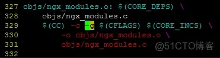

# nginx环境：

[nginx编译+配置环境](https://www.jb51.net/server/299566yj6.htm#_label0)

```shell
# 下载
wget http://nginx.org/download/nginx-1.24.0.tar.gz
# 解压
tar -zxvf nginx-1.24.0.tar.gz
# 进入到源码目录
cd nginx-1.24.0/
cp -r contrib/vim/* ~/.vim # vim工具，高亮配置文件


# 查看configure 支持的参数，其中包含指定某些路径、开启某些模块、编译中特殊参数
#./configure --help | more
# 安装nginx必备依赖库
yum -y install gcc pcre pcre-devel zlib zlib-devel openssl openssl-devel
# 进行编译，指定安装目录，没什么报错就是编译成功
./configure --prefix=/nginx  --with-debug
make 
make install 
```


**yum install -y pcre pcre-devel**

**yum install -y zlib zlib-devel**

**yum install -y openssl openssl-devel**

yum install gcc-c++

```
yum -y install lua*
```

yum install -y wget

**[nginx编译报错src/core/ngx_murmurhash.c:37:11: 错误：this statement may fall through [-Werror=implicit-fallthrough=\] h ^= data[2]](https://www.cnblogs.com/wxj612/p/13696628.html)**

**解决/usr/local/nginx/sbin/nginx: error while loading shared libraries: libluajit-5.1.so.2: cannot open**

[/usr/local/nginx/sbin/nginx: error while loading shared libraries: libluajit-5.1.so.2: cannot open_./nginx: error while loading shared libraries: lib-CSDN博客](https://blog.csdn.net/weixin_45093060/article/details/104037482)

解决无法找到**struct crypt_data定义**

[nginx ‘struct crypt_data’没有名为‘current_salt’的成员](https://www.jianshu.com/p/80079987978e)

解决无法找到共享库**`libpcre.so.1`**

[error while loading shared libraries: libluajit-5.1.so.2: cannot open shared 解决办法-CSDN博客](https://blog.csdn.net/pa5201314/article/details/44876931/)

# 调试

- gdb关联进程调试时出现`ptrace: Operation not permitted.`

```shell
# 设置容器的privileged权限
docker exec --privileged -it build-pg /bin/bash 
# 设置允许非PTRACE权限的进程使用ptrace系统调用来追踪其他进程
echo 0 > /proc/sys/kernel/yama/ptrace_scope # 系统和容器的值都要修改
```


- ./configure --prefix=/nginx  --with-debug

> ./objs/Makefile 下修改  增加-g   （不确定是否需要）


`ps -ef | grep nginx` 查看工作线程和主线程（e为显示所有进程，f为全格式显示）

- 为了方便调试，关闭主线程，只有一个工作线程

`vim [nginx的安装目录]/conf/nginx.conf`

添加`master_process off;` # 关闭主线程，只有一个工作线程

添加`daemon off` # 关闭守护进程，前台工作

- b ngx_event.c:ngx_process_events_and_timers

[nginx调试参考文档](https://blog.51cto.com/u_12227/10351899)