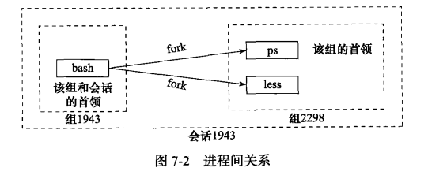
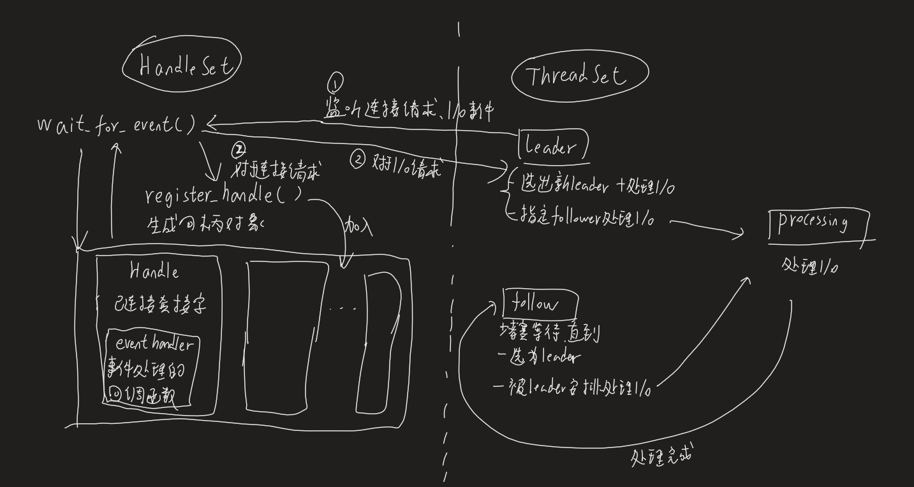
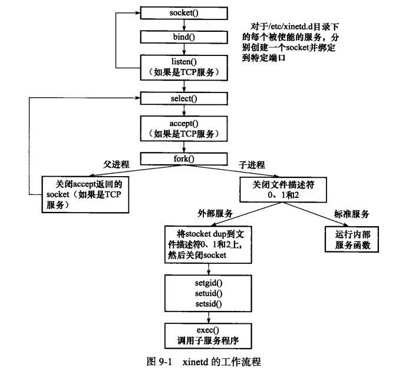
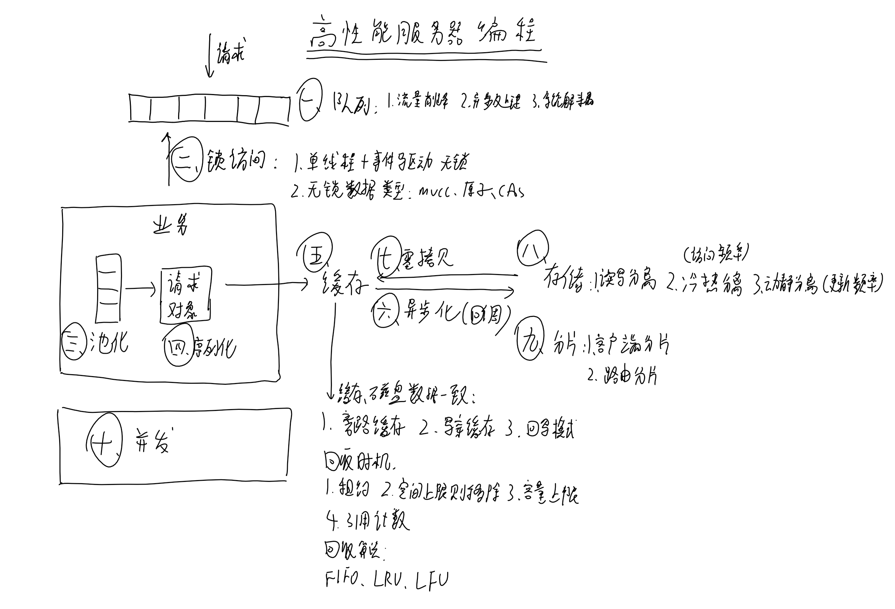
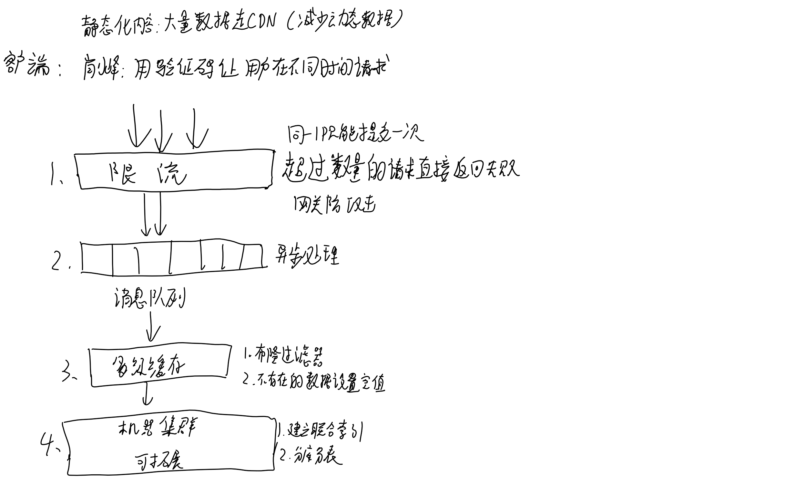

# 服务端开发

# 文件IO函数

dup/dup2函数：重定向标准输入输出

readv/writev：对分散的内存块执行读写操作

mmap/munmap：共享内存

零拷贝：

- `sendfile`文件向socket进行数据传输
- `splice` 文件描述符之间传输
- `tee` 在两个管道文件描述符间拷贝数据，并不消耗数据

# linux服务器程序规范

## 系统日志

能接收用户进程和内核打出的日志

- 用户进程调用syslog函数生成系统日志，写入本地/dev/log中（socket类型）
- rsyslogd(syslogd)守护进程监听文件以获取用户进程的输出，保存到/var/log/debug、/var/log/messages、/var/log/kern.log


/etc/rsyslog.conf中配置输入输出路径，监听范围（UDP/TCP/指定端口）

## 用户信息

一个进程同时有用户id和有效id

- 真实用户ID UID  启动进程的用户ID
- 有效用户ID EUID   访问权限使用这个ID
- 真实组ID GID
- 有效组ID EGID

有效用户为root的进程为特权进程

## 进程间关系

- SID：会话ID
- PPID：父ID
- PGID：进程组


Linux下每个进程都属于一个**进程组（PGID）**，每个进程都有首领进程，进程组没有全部结束，首领进程不能结束

非首领进程可以调用`setsid`函数创建一个**会话**（SID）：

- 当前进程称为会话的首领，且是新会话的唯一成员
- 成为首领进程，PGID=该进程的PID
- 离开终端

例子：



## 系统资源限制

```cpp
`int getrlimit(int resource, struct rlimit *rlim)`//读取
`int setrlimit(int resource, const struct rlimit *rlim)`//设置
   struct rlimit{
       rlim_t rlim_cur;//指定资源的软限制，建议的值，超过可能发出信号
       rlim_t rlim_max;//指定资源的硬限制，普通程序可以减少，但不能增加
   }
```

使用这个函数对资源的修改仅限当前程序之后的执行

如果要永久性改变配置，可以修改Linux的配置文件

- 虚拟内存总量
- coredump文件大小
- CPU时间
- 内存限制：数据段大小限制，栈、堆空间大小
- 文件描述符数量限制
- 进程数限制

## 服务程序后台化

`int daemon(int nochdir, int noclose)`//第一个参数是否改变工作目录，第二个参数是否标准输入输出重定向

原理：

```cpp
//1. 创建子进程，关闭父进程
//2. 创建新的会话和进程组
//3. 切换工作目录
//4. 标准输入输出重定向
```

# 服务器程序框架

C/S请求响应模型：访问量过大，服务器压力大

P2P点对点模型：每台服务器消耗服务并提供服务。用户传输的请求过多会加剧网络负载

P2P通常有专门的发现服务器，使得节点之间相互发现，

## 服务网关

微服务的入口，客户端的请求首先到服务网关

- 权限管理：校验用户请求资格
- 路由和负载均衡：将请求转给目标服务
- 限流：按照指定流量限制请求

### 业务形态

- **解耦不同网络环境：**内外网&生产办公环境
- **公共业务切面：**安全认证&限流熔断&监控
- **灵活的流量控制**：
  - **私有协议**，拦截用户的HTTP请求，走私有协议到服务器
  - **链路优化**：让远程用户就近访问
  - **异地多活：**根据业务的维度进行分流
- **定制化网关**：对不同的业务进行独立的定制化网关，由控制面对网关的差异特性统一管理
- **对业务层统一的接口：**
  - 协议适配层：屏蔽不同协议的编解码、交互方式，对TCP的连接处理等
  - 通用中间模型和接口：业务面向中间模型和接口编程

## 服务器框架


## 高并发模式

并发编程对I/O密集型有提升效率的意义，计算密集型不适用于并发编程

### 半同步/半异步模式

这里的同步是指程序完全按照代码顺序执行，异步指由系统事件(中断、信号)驱动程序的执行

- 异步线程的执行效率高，但难以调试和拓展，不适用于大量并发
- 同步线程效率低，实时性差，但逻辑简单

服务器适用于将两个结合起来，即半同步/半异步模式，同步线程处理客户端逻辑，异步线程处理IO事件

等同于多reactor多线程的方案

### 领导者/追随者模式

多个工作线程轮流获得事件集合

对线程分类，leader线程负责监听和分发，follower处理事件。leader可以让出leader自己处理任务，也可以指定follower处理事件


线程集中存在互斥关系

## 有限状态机

状态机每个状态独立，状态之间没有相互转移

每次循环，状态机获取一个数据包，通过类型判断如何处理

main函数解析字段，读取一条完整的数据后判断包类型，交给主状态机处理，记录当前状态，调用对应的函数处理状态

## 提高服务器性能

1. 池

资源在启动之初创建并初始化，需要时直接获取无须动态分配，避免了对内核的频繁访问，可能造成资源浪费

内存池、进程\线程池、连接池

2. 避免数据复制

零拷贝，共享内存

3. 上下文切换

工作线程的使用应和CPU的数量一起考虑，对于IO密集型任务，不应然线程切换占用大量CPU时间

4. 锁

引入无锁方案，或者减少锁的颗粒度

5. IO多路复用

同时监听多个接口，TCP和UDP可以是同个端口

# IO处理

## xinetd

网络守护进程服务程序，管理多种轻量级internet服务


# 信号

## 统一事件源

可以使用信号掩码来暂时不响应信号，此时收到的信号会被挂起（重复的信号只算一个），取消屏蔽后会立即响应信号

为了不让信号屏蔽太久，信号处理函数写入管道，主函数用epoll监听管道文件和其他套接字，对收到的管道消息读取并处理。从而将信号事件和IO事件、连接事件，统一处理

```cpp
static int pipefd[2];
//信号处理函数
void sig_handler(int sig){
	int msg=sig;
    send(pipefd[1], (char*)&msg,1,0);//当有信号f通知主循环
}
int main(){
    /*……*/
    //创建管道
    socketpair( , , , pipefd);
    //开启
    int listenfd = socket();bind();listen(listenfd, 5);
    //注册epoll
    int epollfd=epoll_create(5);
    epoll_ctl(epollfd, listenfd);//主业务的监听套接字
    epoll_ctl(epollfd, pipefd[0]);//监听管道
	
    while(1){
        for(epoll_wait()){//主循环感知到IO事件，或者管道写入事件则唤醒
            int sockfd = events[i].data.fd;
            if(sockfd == listenfd){//主业务，建立连接
                accept()
            }else if(sockfd==pipefd[0] && events[i].event&EPOLLIN){//收到管道消息并处理信号
                ret = recv(pipefd[0], signals, sizeof(signals), 0);//接收管道消息
                while(ret){//对对应消息进行处理
                    case:
                }
            }else if(……){
                //主业务
            }
        }
    }
}
```

# 定时器

## 基于SIGALRM信号实现


1. **升序链表的定时器**：SIGALRM信号定时触发，每次触发，就执行一次TICK，TICK中检测链表上到期的任务

特点：

- 如果某个任务的超时时间不是T的整数倍，精度会略有偏差
- 每次插入时，需要遍历链表找到自己的位置（按到期时间有序的链表），插入的时间复杂度O(N)

使用场景：周期遍历关闭那些非活动连接

2. IO复用系统的超时：

```cpp
while(1){
    int start = time(null);
    int num = epoll_wait(fd,,,timeout);
    if(num==0){//epoll超时，重置
        timeout = TIMEOUT;
    }else{//有事件发生
        int end = time(null);
        timeout = (end-start)*1000;//重新计算超时时间
        if(timeout<0)timeout = TIMEOUT;//可能出现重新计算的值<0
        /*…………………………业务处理………………………………*/
    }
    
}
```

## 时间轮

该时间轮有N个槽，定时器通过超时时间%N的计算方式映射到每个槽上，每个槽为一个单链表

每次tick时，si指针移动一位，从而均匀的映射到各个链表上，链表内无序


- 使槽间隔si变小，能提高精度，
- 要提高执行效率，则增大N值，将链表分散均匀

复杂的时间轮，可能有多个轮子，不同轮子有不同的粒度。

插入时间复杂度O（n），执行时间复杂度O（n），需要遍历链表找到超时的定时器。

## 时间堆

将超时时间最小的定时器的超时其作为心搏间隔，超时时这个定时器必然到期，再选出下一个超时时间最小的一个定时器

最小堆结构适合实现这种方案

# 高性能网络通信

## 读写数据

对于可写事件，如果一开始就把可写socket注册到epoll，即使没有事件要写，epoll也会因为文件描述符变的可写而唤醒应用。并且不急于写数据的套接字在epoll里增加内核维护这一集合的时间

正确的做法：对于发送数据时注册写socket到epoll里，如果有发送缓存区空了会触发可写事件从而执行写入（这就要求应用层也要有发送缓冲区），写入完成后，再从epoll里移除这个socket

```c
//用户调用的发送函数接口
void sendMessage(const void* data, size_t len){
    //如果没有监听可写事件，且发送缓冲区没有遗留数据
    if(!isWritin() && outputBuffer_.readableBytes()==0){
        //尝试直接发送数据
		nwrote = socket::write(channel_->fd(), data, len);
        if(nworte>=0){
            len-=nwrote;
        }else{
            //判断是否出错
        }
    }
    //缓冲区内有数据还没发出去
    if(len>0){
        //剩余数据加入到发送缓冲区
        outputBuffer_.append(static_cast<const char*>(data) + nwrote, remaining);
        if(!isWriting())channel_->enableWriting();//注册可写事件
    }
}
//写事件触发后，main_cycle函数对这次事件执行的回调函数
//可写事件触发后会调用handleWrite()函数
void TcpConnection::handleWrite()
{  
	//将发送缓冲区中的数据发送出去
	int32_t n = sockets::write(channel_->fd(), outputBuffer_.peek(), outputBuffer_.readableBytes());
	if (n > 0){
		//发送多少从发送缓冲区移除多少
		outputBuffer_.retrieve(n);
		//如果发送缓冲区中已经没有剩余，则移除监听可写事件
		if (outputBuffer_.readableBytes() == 0){
			//移除监听可写事件
			channel_->disableWriting();
		}
	}
	else{
		//发数据出错处理          
		handleClose();
	} 
}

```

## 主循环

监听线程/进程函数的循环

```cpp
void main_cycle(){
	while (!m_bQuitFlag)
	{
		epoll_or_select_func();//阻塞监听网络事件
		handle_io_events();//处理这些网络事件
		handle_other_things();//顺便作一些事件
	}
}
//被唤醒执行任务，观察者模式
void EventLoop::handle_other_things()
{
    std::vector<OtherThingFunctor> otherThingFunctors;
    callingPendingFunctors_ = true;
    {//上锁得到要处理的句柄
        std::unique_lock<std::mutex> lock(mutex_);
        otherThingFunctors.swap(pendingOtherThingFunctors_);//
    }
    //执行
    for (size_t i = 0; i < otherThingFunctors.size(); ++i){
        otherThingFunctors[i](./);
    }
    
    callingPendingFunctors_ = false;
}
//唤醒者
void EventLoop::queueInLoop(const Functor& cb)
{
    {//上锁注册需要执行的句柄
        std::unique_lock<std::mutex> lock(mutex_);
        pendingOtherThingFunctors_.push_back(cb);
    }
	//尝试唤醒handle_other_things()所在线程
    if (!isInLoopThread() || callingPendingFunctors_){//如果主线程在运行且主线程不在处理中
        wakeup();
    }
}
```

为了当没有网络事件但又让handle_other_thing()函数能够即使执行，而不用等到epoll超时才执行，可以设置一个特殊的wakeup fd绑定到epoll里，当有其他任务需要处理时，写入这个fd数据让其可读

可以调用管道来生成这个fd，也可以使用eventfd（）、socketpair()

唤醒后要将fd的数据读出来，否则fd的接收缓冲区写满会导致写入失败


另外socket 上的send和recv是原子性的，多个线程同时send或同时recv并不会崩溃，但会造成包的乱序，send和recv多线程是可以的

## 发送/接收缓冲区

要求：

- 缓冲区数据有序，头部取出，尾部加入
- 需要有扩容机制
- 支持各种数据类型
- 对于接收缓冲区需要找到数据包的结尾标识

一种实现：一块连续内存分为两部分，预留空间（存放元数据信息等）和存储空间，用读写指针标明读写位置

**当对端一直不接受数据如何处理**

1. 缓冲区需要有大小上限，当数据存入超过上限时认为连接出现了问题，关闭连接回收资源
2. 一部分数据在待发送缓冲区，缓冲区足够，但对端不接收使得也不能释放。因此需要设置定时器每隔一段时间检查发送缓冲区为发出去的数据是否超时。超时认为出现了问题关闭连接

## 网络库中的各个层

session层：

业务逻辑，依赖connection

通常用weak_ptr指针指向connection层的对象，因为connection对象可能因为自身的运行而销毁。可能用sessionmanager对象统一管理这些session对象的生命周期

session根据具体的业务可能分为不同对象

Connection层：

通常和一个客户端的连接对应一个connection对象，记录该路连接的各种状态信息，提供对网络事件的处理接口，掌管channel对象的生命周期。有时可能会用server对象来集中管理多个connection对象

channel层：

一般持有一个socket，负责数据收发，记录需要监听的各种网络事件状态，提供对事件状态判断和增删改的接口

socket层：

对socket进行封装，实现跨平台，或更易于可用

# 多进程编程

## 创建

fork()，父进程返回子进程PID，子进程返回0

- 复制当前进程，创建进程表项，
- 复制数据和代码，采用写时复制
- 子进程以共享的方式获得父进程的打开文件（计数器+1）

exec系统调用

- 在子进程中执行其他程序，替换当前进程映像
- 正常执行后exec将不会返回，exec后的代码不会执行
- exec不会关闭原程序打开的文件描述符

**僵尸进程：**父进程通常需要跟踪子进程的退出状态，如果父进程结束，内核不会立即释放子进程表项，等待父进程的退出操作，子进程结束后，父进程读取其退出状态之前，此时子进程是僵尸态。

**孤儿进程：**父进程异常结束，子进程被init进程接管，子进程退出前也是僵尸态

# 场景题

## 高性能服务器需要的技术


一致性哈希做负载均衡，数据写入不同服务器

## 秒杀系统


## 设计一个本地缓存

内存上：

1. 选择合适的数据结构
2. 设置上限
3. 清除策略
4. 过期时间

使用上：

1. 简明的接口
2. 线程安全
3. 阻塞机制
4. 是否持久化

更新：

对时间性能的要求决定更新策略

## 设计一个RPC

