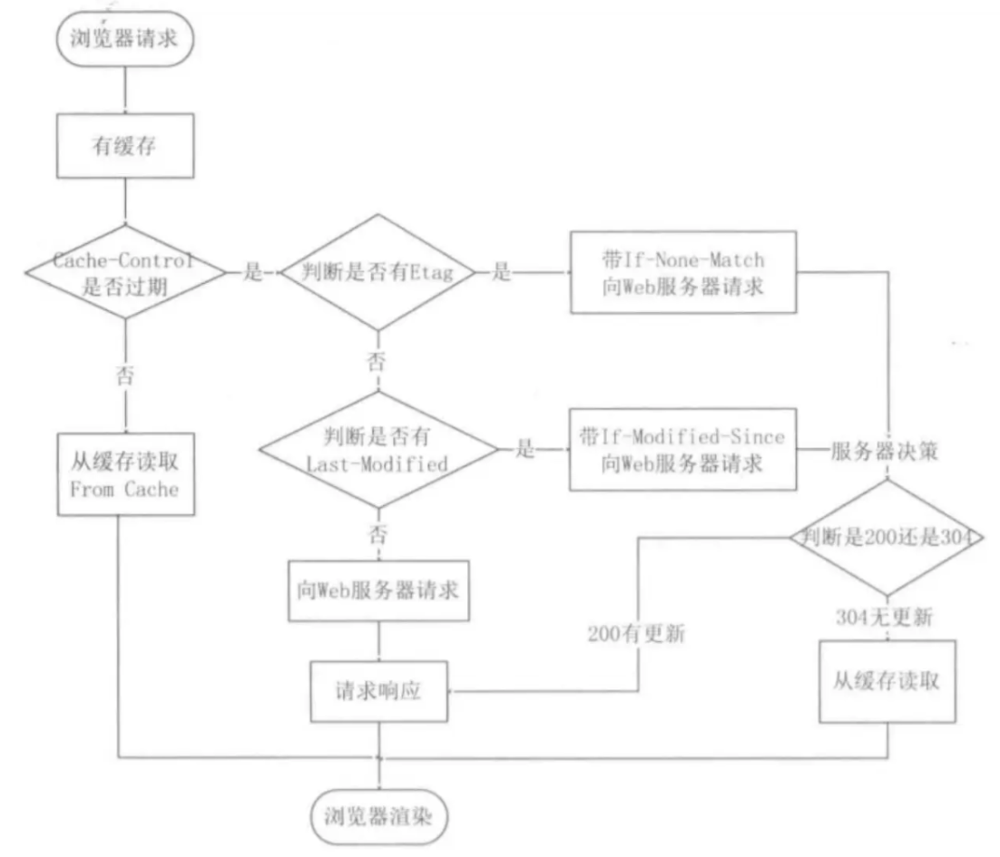
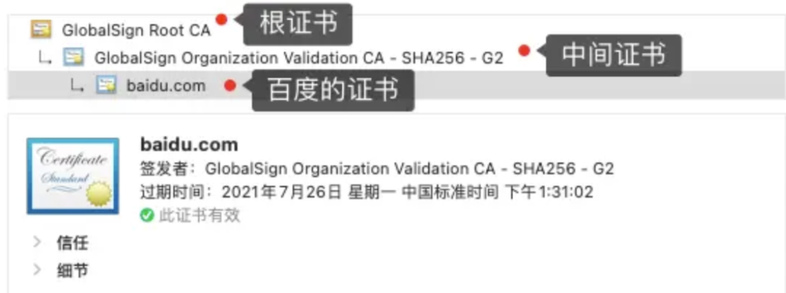
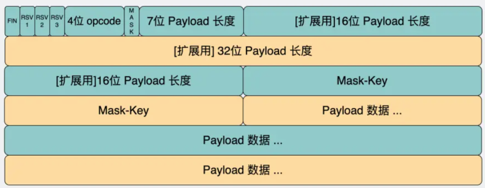

[小林 coding](https://xiaolincoding.com/)


# HTTP

## 概念

是一种超文本协议传输：
协议：两个以上的参与者的一种行为约定和规范
传输：通过中转或接力在两点之间双向传输数据
超文本：包含文字、图片、视频、超链接（一个超文本跳到另一个超文本），例如HTML

## **特点**

**简单**：基本报文格式header+body，头部信息是key-value简单文本的形式，易于理解

**灵活和易于拓展**：HTTP协议里各类请求方法、URI/RUL、状态码、头字段等每个组成没有被固定死，可被开发人员自定义和扩充

HTTP工作在应用层，下层可以随意变化

HTTPS是在HTTP和TCP层加了SSL/TLS安全传输层，HTTP/1.1和HTTP/2.0传输协议使用的是TCP协议，HTTP/3.0使用的UDP协议

**应用广泛和跨平台**：是的

### HTTP常见的状态码


### HTTP常见字段

**Host字段**，表示请求指定的服务器的域名（例：Host: www.A.com)，使得可以将请求发往同一台服务器上的不同网站

**content-length字段**，表面本次回应的数据长度

HTTP协议通过设置回车符、换行符作为HTTP header的边界，通过Content-Length字段作为HTTP body的边界，从而解决沾包的问题

**connection字段**，如果开启，即客户端要求服务器使用HTTP长连接机制

**content-type字段**，用于服务器回应时标识本次数据的格式（例，content-type:test/html;charset=utf-8）

**content-encoding字段**，表示服务器使用的数据的压缩方法

### Keep-Alive

**长连接**：HTTP发送请求时，先创建一个TCP连接，把HTTP请求发送并接收，浏览器和服务器协商是否关闭TCP，不关闭虽然有一定损耗，但如果还有请求可以直接在这个TCP连接上发送，不需要再三次握手，长连接可以设置一定时间内没有请求自动关闭

**短连接**：请求结束后直接关闭TCP连接，下次请求需要重新创建TCP连接

通常默认打开，这给**HTTP流水线**技术提供了基础：客户端先一次性发送多个请求，而在发送过程中不需先等待服务器的回应，可以减少整体的响应时间

> TCP的keepalive是TCP的保活机制，如果TCP建立了连接，客户端一直不发消息，就会触发服务端发送探测报文，和Keep-Alive不是一个东西

## GET和POST

RFC规范中（请求评论，是一种文档规范，描述互联网的各自协议、标志等）

GET的语义是从服务器**获取指定的资源**，GET请求的参数位置是在URL中，URL只支持ASCII，所以GET请求的参数只能ASCII字符，且浏览器对URL的长度有限制，可以携带报文body

POST的语义是根据请求负荷（报文body）**对指定的资源做出处理**，POST请求携带数据的位置一般写在报文body中，可以是任意格式，且无大小限制

> 在文章的留言通常用POST请求发送
> 打开文章通常用GET请求

**@GET和POST方法是安全和幂等的吗**

**安全**是指请求方法不会破坏服务器上的资源
**幂等**指多次执行相同的操作，结果都是相同的

GET方法是安全且幂等的，所以GET请求的数据可以缓存到浏览器（书签）上，也可以缓存到代理上（nginx）

POST因为是新增或提交数据的操作，会修改服务器上的资源，所以是不安全的，也不幂等，无法缓存POST请求

实际开发，不一定按照这个RFC来

## HTTP缓存技术



对于重复性的HTTP请求，可以把请求响应的数据缓存在本地，避免再发送HTTP请求

### 强制缓存

指只要浏览器判断缓存没有过期，则直接使用浏览器的本地缓存，由浏览器主导

利用下面两个HTTP响应头部字段实现的，用来表示资源在客户端缓存的有效期：

- Cache-Control，是一个相对时间
- Expires，是一个绝对时间

Cache-Control优先级高于Expires，实现流程如下

- 浏览器第一次请求访问服务器资源时，服务器在返回资源的同时，在response头部加上Cache-Control，Cache-Control中设置了过期时间大小
- 浏览器再次请求访问服务器中的该资源时，会先通过请求资源的时间和Cache-Control中设置的过期时间大小来计算出该资源是否过期，如果没有，则使用缓存
- 服务器再次收到请求后，会再次更新response头部的cache-control字段

### 协商缓存

第一次请求得到数据后，对于后面的客户端的请求，服务端告诉客户端是否可以继续使用缓存的方式即为协商缓存，回复请求码304表示浏览器可以使用本地缓存的资源

第一种实现：基于时间实现

响应头部中Last-Modified，标识这个响应资源的最后修改时间，
请求头部中的If-Modified-Since，标识当这个资源过期了，发现响应头中有Last-Modified声明，则再次发起请求的时候带上Last-Modified的时间，
服务端收到请求后发现有If-Modified-Since则和被请求资源的最后修改时间进行对比，如果最后修改时间较新，说明资源又被改过，返回新资源（HTTP 200 OK），否则说明资源无新修改，响应HTTP304走缓存

第二种实现：基于标识实现

响应头部中Etag：唯一标识响应资源
请求头部中的If-None-Match：当资源过期时，浏览器发现响应头里有Etag，则再次向服务器发起请求时，会将请求头If-None-Match值设置为Etag的值。服务器收到请求后进行对比，如果资源没有变化返回304，变化了返回200

两种实现，后者相对安全，前者可能出现时间篡改导致不可靠问题，当一次请求同时带有Etag和Last-Modified字段，那么客户端下一次请求时，Etag的优先级更高，如果Etag有变化就不用判断Last-Modified了，如果Etag没有变化，再看Last-Modified

**@为什么Etag优先级更高**

1. Last-Modified字段不可靠，最后修改时间可能改变
2. 有些文件是秒级以内修改的，If-Modified-Since能检查到的粒度是秒级的，Etag能保证这种需求下客户端在1s内能刷新多次
3. 有些服务器不能精确获取文件的最后修改时间

协商缓存只有在强制缓存未命中时才会触发带有协商缓存字段的请求

## HTTP/1.1特性

### 无状态

好处是服务器不需要额外的资源来记录状态信息从而减轻负担
缺点是在完成有关联性的操作时会更麻烦

> 例如登录->添加购物车->下单，这一系列操作都要知道用户的身份，但服务器不知道这些请求是有关联的，每次都要问一遍身份

一种解决方案是在请求和响应报文中加入Cookie信息来控制客户端的状态，即客户端第一次请求后，服务器下发一个cookie，客户端请求服务器时，填上cookie信息发送

### 不安全

明文传输数据，可阅读，易于调试，但也不安全，泄漏隐私

不验证通信方的身份，因此可能遭遇伪装，（访问假的淘宝网站）

无法证明报文的完整性，可能遭篡改（植入垃圾广告）

### 性能

采用了长连接和管道网络传输（默认不开启管道）

管道网络传输：即流水线传输，可以传输多个请求不必等回复，但服务端处理时必须按请求顺序串行处理，存在一个请求处理很久阻塞整个队列的问题。（解决了请求队列的队头阻塞，没有解决响应队列的队头阻塞）

整体性能一般

## HTTPS

明文传输的HTTP存在安全风险（窃听、篡改信息、冒充），HTTPS在HTTP和TCP层之间加入了SSL/TLS协议解决这个问题，分别用信息加密、校验机制、身份证书来抵御这三种风险

建立连接时，多了TLS的握手过程，传输内容时，https会把数据加密

### 混合加密

在通信建立前采用**非对称加密**的方式交换会话密钥，在通信过程中使用**对称加密**的会话密钥加密明文数据

---

**@为什么采用混合加密**

对称加密只使用一个密钥，运算速度快，密钥必须保密，因此无法做到安全的密钥交换

**非对称加密**使用两个密钥，公钥和私钥，公钥任意分发而私钥保密，解决了密钥交换问题，但速度慢

---

### 摘要算法+数字签名

为了确保传输的内容不被篡改，对内容计算出一个指纹，同内容一起传输给对方，接收方收到内容后也计算出指纹，和发来的指纹对比相同

摘要算法（哈希函数）计算出内容的哈希值，这个哈希值是唯一的，且无法通过哈希值推导出内容

**非对称加密：**

公钥和私钥可以双向加解密，不是对内容进行加密，而是对内容的哈希值加密

公钥加密，私钥解密：可以保证内容传输的安全，只有持有私钥的人才能解读实际的内容

私钥加密，公钥解密：可以保证消息不会被冒充，公钥能解析出数据，则证明这个消息的来源是正确的

但这个过程比较耗时，因此只用于连接的建立，私钥由服务端保管，服务端会向客户端颁发公钥

**数字证书**

可以通过哈希算法来保证消息的完整性，通过数字签名来保证消息来源可靠性，但这还缺少身份验证的环节（伪造一对公私钥）

CA（数字证书认证机构）

- 将服务器公钥放在数字证书中（数字证书认证机构颁发），
- 客户端拿到服务器的数字证书后，使用CA的公钥确认服务器数字证书的真实性，（CA的公钥已事先置入了浏览器或操作系统里）
- 从数字证书获取服务器公钥后，使用它对报文加密后发送，
- 服务器用私钥对报文解密

### HTTPS如何建立连接

SSL/TLS协议基本流程：（SSL和TLS是一个东西）

- 客户端向服务器索要并验证服务器的公钥
- 双方协商生产会话密钥
- 双方采用会话密钥进行加密通信

前两步的握手涉及四次通信，使用不同的密钥交换算法

**TLS握手过程**

1. clienthello

   客户端向服务器发送：

   - 客户端支持的TSL协议版本、

   - **生产的随机数**（用于生成会话密钥）

   - 客户端支持的密码套件列表、如RSA加密算法

2. serverhello

   服务器收到请求后，发出响应：

   - 确认TLS协议版本，不支持则关闭通信

   - **生产随机数**（用于生成会话密钥）

   - 确认的密码套件列表，如RSA加密算法

   - **服务器的数字证书**

3. 客户端回应

   通过浏览器或os中的CA公钥确认数字证书的真实性

   客户端从数字证书中取出**服务器的公钥，使用其加密报文**，向服务器发送如下信息：

   - **随机数**（被服务器公钥加密）

   - 加密通信算法改变通知，表示随后的信息将用会话密钥加密通信

   - 客户端握手结束通知，表示客户端的握手阶段已经结束，这一项同时把之前所有内容发生的**数据做个摘要**，用来供服务端校验

   > 此时生成了三个随机数，之后的通信将依赖这三个随机数

4. 服务器最后的回应

   通过协商的加密算法，**计算**出本次通信的**会话密钥**，向客户端回应：

   - 加密通信算法改变通知，表示随后的信息都将用会话密钥加密通信

   - 服务器握手结束通知，这一项同时把之前所有内容发生的**数据做个摘要**，用来供服务端校验

@ SSL/TLS 1.2需要4次握手，SSL/TLS 1.3优化后只需三个握手

### 签发证书：

CA把持有者的公钥、用途、颁发者、有效时间等信息打包，作hash计算得到一个hash值
CA会使用自己的私钥将该hash值加密，生成证书签名
最后添加证书签名，形成数字证书

**客户端校验服务端数字证书**

客户端使用同样的hash算法获取该证书的hash值H1
浏览器和os集成CA的公钥信息，浏览器收到证书后使用CA的公钥解密证书签名，得到hash值h2
比较H1和H2，值相同，则为可信赖的证书，否则不可信

**证书信任链**

向CA申请的证书一般不是根证书签发的，而是中间证书签发，浏览器只存放根证书（公钥）



对三层关系的证书验证过程：

- 客户端收到baidu.com的证书后，由于这个证书不是根证书，无法根据本地已有的根证书的公钥区验证，因此向上找到证书的颁发机构，向CA请求该中间证书
- 请求证书后发现G2证书是由GlobalSign Root CA签发，即根证书，自签证书，应用软件检查此证书是否预载于根证书清单上，有，则用根证书的公钥去验证G2证书，通过则认为中间证书可信
- G2被信任后，用其中的公钥去验证baidu.com证书的可信，通过则可信任

中间层级的出现是 为了将根证书隔离，确保证书的绝对安全性

### HTTPS的应用数据如何保证完整性

TLS在实现上为握手协议和记录协议：

- 握手协议为TLS四次握手的过程，负责协商加密算法和生成对称密钥，后续用此密钥来保护应用程序数据
- TSL记录协议负责保护应用程序数据并验证其完整性和来源，对数据加密使用记录协议

TSL记录协议负责消息的压缩，加密及数据的认证：

1. 消息分割成多个较短的片段，对每个片段进行压缩
2. 压缩的片段加上消息认证码（MAC值），为了数据完整性的认证
3. 通过对称密码进行加密
4. 再加上数据类型、版本号、压缩后的长度组成的报头就是最终的报文数据

记录协议完成后，最终的报文数据将传递到传输控制协议TCP层进行传输

### HTTPS一定安全可靠吗

1. 客户端向服务端发起HTTPS建立连接请求时，被假基站转发到中间人服务器，中间人向服务端发起HTTPS建立连接请求，
2. 客户端和中间人TLS握手中，中间人发送自己的公钥证书给客户端，客户端验证证书，从证书拿到公钥，生成随机数，用公钥加密随机数发送给中间人，中间人私钥解密得到随机数，双方都有随机数，通过算法生成对称加密密钥，后续通过这个对称加密密钥加密通信
3. 中间人和服务端握手
4. 后续通信中，中间人用对称加密密钥A解密客户端的HTTPS请求，用对称加密密钥B加密HTTPS请求后转给服务端，接收同样

客户端不知道中间人这个角色，中间人可修改偷看数据

发生这种场景的前提是用户点击了中间人服务器的证书


另外，如果电脑中毒了，恶意导入了中间人的根证书，此时系统认为这个证书合法，此时不会出现风险提醒

因此，HTTPS协议本身没有漏洞，用中间人攻击本质上是利用了客户端的漏洞

**@为什么抓包工具能截取HTTPS数据**

工作原理同中间人一致

中间人实现明文代理需要满足两点：

- 服务端不会校验客户端身份，因此中间人作为客户端和服务端建立连接这一步不会有问题
- 中间人与客户端连接，中间人必须有对应域名的私钥

中间人要拿到私钥只能通过如下方式：

- 去网站服务端拿到私钥
- CA处拿域名签发私钥
- 自己签发证书且被浏览器信任

只能用第三种方式，即用抓包工具抓包时需要先在客户端安装根证书

**@如何避免被中间人抓取数据**

不要点击证书非法的网站、保证电脑不受病毒入侵

可以通过HTTPS双向认证来避免这个问题，一般只要单向验证，双向验证服务端也需要验证客户端的身份，发现服务端不可信任会中止通信

## HTTP/1.1、HTTP/2、HTTP/3演变

### HTTP/1.1比起HTTP/1.0的改进

改进

- 使用**长连接**的方式改善了HTTP/1.0短连接造成的性能开销
- 支持**管道网络传输**，第一个请求发出后不必等其回来，可以发第二个请求出去，减少整体响应时间

缺点

- 请求/响应**头部未经压缩**就发送，首部信息越多延迟越大，只能压缩body
- 发送冗长的首部，**每次发送相同的首部**造成浪费
- **服务器按请求顺序响应**，会造成队头阻塞
- **没有请求优先级**控制
- **只能C/S架构**，请求只能从客户端开始，服务器被动响应

## HTTP/2做了什么优化

基于HTTPS，因此安全性有保证

### 头部压缩

如果发出多个请求有相同或相似的头，那么协议会消除重复的部分

HPACK算法：客户端和服务器同时维护一张头信息表，所有字段存入这个表，生成索引号，以后不用发送同样字段，只发送索引号，从而提高速度

### 二进制格式

全面采用二进制（头信息和数据体），统称为帧：头信息帧、数据帧

### 并发传输

HTTP/1.1基于请求响应模型，完成一个事务才能处理下一个事务，因此有队头阻塞问题

HTTP/2引入了stream概念，多个stream复用一条TCP连接，

一个TCP连接包含多个stream，stream里包含多个message，对应HTTP/1中的请求或响应，由HTTP头部和包体构成，message里包含多个Frame，是HTTP/2最小单位，以二进制压缩格式存放HTTP/1中的内容

针对不同的HTTP请求用独一无二的StreamID来区分，接收端可以通过streamID有序组装成HTTP消息，不同Stream的帧可以乱序发送，因此可以并发不同的stream，即可以并行交错地发送请求和响应

### 服务器推送

服务器可以主动发送消息

客户端和服务器双方可以建立stream，客户端建立的stream是奇数号，服务器建立的stream是偶数号

例如：HTTP/1.1中，客户端从服务器获取到了HTML文件，仍需CSS来渲染页面，此时客户端还要发起CSS请求，HTTP/2中，客户端访问HTML时，服务器可以主动推送CSS文件，减少消息传递次数

### HTTP/2的缺陷

stream解决了HTTP这一层面队头阻塞的问题，但在TCP层面依然有队头阻塞问题

HTTP/2基于TCP传输，TCP必须保证收到的字节数完整且连续才会返给HTTP应用层，否则在缓存区中

发送方发的多个packet，接收方必须按序接收后，才能返给上层，如图，丢失了一个，则后面的包不会给上层，从而出现队头阻塞

## HTTP/3做了哪些优化

将底层从TCP改成了UDP，采用QUIC通信

QUIC的特点也对应了HTTP/3的优点：

### 无队头阻塞

QUIC中也有类似stream与多路复用的概念，当某个流发生丢包时，只阻塞这个流，其他流不受影响，因此不存在队头阻塞问题

### 更快的连接建立

对于HTTP/1和HTTP/2协议，TCP和TSL是分层的，需要分批次来握手，先TCP握手再TLS握手

HTTP/3的QUIC协议握手过程只需要1RTT，

在HTTP/3的QUIC协议并不和TLS分层，QUIC内部包含了TLS，在自己的帧里携带TLS的记录，QUIC使用的TLS/1.3，仅需1个RTT就可以同时完成建立连接与密钥协商

甚至在第二次连接时，应用数据包可以和QUIC握手信息一起发送，达到0-RTT的效果

### 连接迁移

基于TCP传输协议的HTTP协议，通过四元组确定一条连接（源IP端口，目的IP端口）

当设备的网络从4G切换到wifi时，意味这IP地址改变了，必须要断开重连

QUIC没有用四元组来绑定连接，而是通过连接ID来标记通信的两个端点，客户端和服务端各自选择一组ID来标记自己，因此即使设备网络改变导致IP改变，只要仍有上下文信息，就可以复用原连接

## RPC

**@ 使用纯裸TCP会有什么问题**

TCP的三个特点：面向连接、可靠、基于字节流

对于基于字节流，双向的通道里的数据，是01串，且没有任何边界，会出现沾包问题，因此纯裸TCP不能直接使用，需要再其上加入自定义规则用以区分消息边界

即把每条要发送的数据都要包装一下，加入消息头，其中写清楚一个完整的包长度，还有是否被压缩过和消息体格式等，使得双方可识别，这就是协议，于是基于TCP衍生出了很多协议如HTTP和RPC

而RPC（远程过程调用）本身并不是具体协议而是调用方式，使得调用远端服务器暴露出的方法能像本地方法一样调用，屏蔽调网络细节

**@ 有RPC了，为什么还要有HTTP**

RPC先于HTTP出现，对于自己的客户端和服务端建立连接收发消息，使用自家的RPC协议只管连自己公司的服务器

浏览器不仅要浏览自家服务器，还要访问其他公司的服务器，因此需要有个同一的标准

即RPC更多用于C/S架构，HTTP更多用于B/S架构（Browser/Server）

现在也没分那么清楚。现在很多软件即支持客户端也支持网页版手机端，使用HTTP的话，服务器只用同一套就行，RPC开启退居幕后，用于公司内部集群里，各个微服务之间的通讯

**@ HTTP和RPC的区别：**

**服务发现：**

要向某个服务器发起请求前得先建立连接，而这需要找到知道IP地址和端口，即服务发现

HTTP中，知道服务的域名，通过DNS服务去解析得到IP地址，默认端口80

RPC中，用专门的中间服务去保存服务名和IP信息，如etcd、redis，访问服务前，先用中间服务去获得IP和端口信息。DNS也是服务发现的一种，也可以基于DNS作服务发现组件

**底层连接形式**

主流的HTTP/1.1协议为例，默认在建立底层TCP连接后会一直保持这个连接，之后请求和响应都复用这个连接

RPC协议类似，建立TCP长连接进行数据交互，不同之处在于RPC还会建立连接池，请求量大时，建立多条连接放在池内，要发数据时取出一条连接，用完再放回去

由于连接池有利于提升网络性能，不少编程语言的网络库例都会给HTTP加个连接池，比如go，因此这一块差别不大

**传输内容**

TCP用消息头和消息体

对于HTTP/1.1，虽然叫超文本协议，但设计初衷是用于作网页文本展示，内容以字符串为主，在消息体这块，使用Json来序列化结构体数据，而这其中内容非常冗余，有些信息不需要每次都穿这个字段过来

RPC定制化程度高，可以用体积更小的protobuf或其他序列化协议，也不需要像HTTP考虑各种浏览器行为，比如302重定向跳转等。因此性能会更好一些，因此微服务中常用RPC

上诉情况基于HTTP/1.1，但HTTP/2性能比很多RPC好，甚至gRPC底层直接用HTTP/2

> HTTP/2是2015年出来的，大多公司RPC协议成熟，一般没有更换的必要

## WebSocket

平时浏览网页，从HTTP协议来看就是对网页上的一次点击触发一次HTTP请求，网站返回一次HTTP响应，即客户端主动请求服务器响应。但也有游戏网页中，其他玩家的移动，仿佛是服务器主动给客户端发消息

### 轮询和长轮询

**如何才能在用户不做操作的情况下，网页能收到消息并发送变更**

**轮询：**

网页的前端代码里不断定时发HTTP请求到服务器，服务器收到请求后响应，是一种伪服务器推的形式

比如扫描登录，前端网页不知道用户扫没扫，于是不断向后端服务器询问

这样做带来的问题：

- 消耗带宽，增加下游服务器负担

- 最坏情况，用户扫描1-2s才会触发下一次HTTP请求出现跳转页面，感受到明显卡顿

**一些解决方案，长轮询**

HTTP请求发出后，通常会给服务器留一定响应时间，如果将超时设置的很大，比如30s，在30s内收到扫描请求立马返回给客户端网页，如果超时就发起下一个请求

这样减少了HTTP请求数，百度网盘就是这样

这类在用户不感知的情况下服务器将数据推给浏览器的技术即服务器推送技术comet

上面两种解决方案本质上是客户端主动取数据，对于扫码这样的简单场景可用，但对于网页游戏这种大量的数据就需要websocket

### websocket的建立

TCP是全双工的，同一时间双方都可以主动向对方发送数据，但HTTP/1.1基于TCP协议，只做了半双工，同一时间，只能有一方主动发送数据

> 因为HTTP协议设计之初，考虑的是看网页文本的场景，客户端发起服务器响应，没有考虑网页游戏这样双方都要互发大量数据的场景

因此为了支持这样的场景，新的应用层协议websocket设计出来

对于普通网页访问使用HTTP协议，当打开网页游戏则切换为websocket协议

- TCP三次握手后，先统一使用HTTP协议进行一次通信
- 如果是普通的HTTP请求，后续继续使用HTTP协议，如果想建立websocket连接，会在HTTP请求带上特殊的包头

```shell
Connection: Upgrade # 浏览器想升级协议
Upgrade: WebSocket  # 想升级成websocket协议
Sec-WebSocket-Key: T2a6wZlAwhgQNqruZ2YUyg==\r\n # 随机生成的base64码
```

如果服务器支持websocket协议就会走websocket握手流程，解析客户端生成的base64码放在HTTP响应的包头里，带上101状态码（协议切换）发回浏览器

之后，浏览器也用同样的公开算法将base64转为另一段字符串，如果和传回来的字符串一致，则表示验证通过，此时websocket建立完成，后续使用websocket格式通信

> websocket只在建立时用到了HTTP，升级完成后就和http无关了

### websocket的消息格式

数据包在websocket中称为帧


**opcode字段**：标识数据帧类型，1是text类型，2是二进制数据类型，8是关闭连接的信号

**payload字段**：真正想要传输的数据长度，字节为单位

用最开始的7bit做标志位，先读最先的7bit，如果值是0-125，则表示payload全部长度，如果是126则表示接下来还要再读16bit，如果是127表示接下来还要读64bit

**payload data字段**：存放真正要传输的数据，知道了上面的payload长度后，可以根据这个值去截取对应的数据

### 数据传输

数据分片，通关fin表示数据完成

```c
FIN=0，opcode=0x1，表示发送的是文本类型，且消息还没发送完成，还有后续的数据帧。
FIN=0，opcode=0x0，表示消息还没发送完成，还有后续的数据帧，当前的数据帧需要接在上一条数据帧之后。
FIN=1，opcode=0x0，表示消息已经发送完成，没有后续的数据帧，当前的数据帧需要接在上一条数据帧之后。服务端可以将关联的数据帧组装成完整的消息。
```

**心跳保持连接：**

- 发送方->接收方：ping
- 接收方->发送方：pong

### websocket的使用场景

继承了TCP协议的全双工能力，并解决了粘包问题，

- 实时性要求高的场景：适用于服务器和浏览器频繁交互的大部分场景，网页聊天室、网页游戏、飞书协同办公软件
- 适用大量数据传输：HTTP每次请求头部信息增加了额外的数据开销，Websocket协议头部相对较少

服务器有能力主动发送给客户端数据

# FTP

**在计算机网络上在客户端和服务器之间进行文件传输的应用层协议**

FTP需要两个TCP连接：控制连接、数据连接。

控制连接保持开启，数据连接随时开关

主动模式：

用户的输入会通过控制连接给服务器（告知连接的端口号），服务器应答，并建立一个tcp连接。过该连接服务端和客户端就可以进行数据传输了。传输完成后断开。
