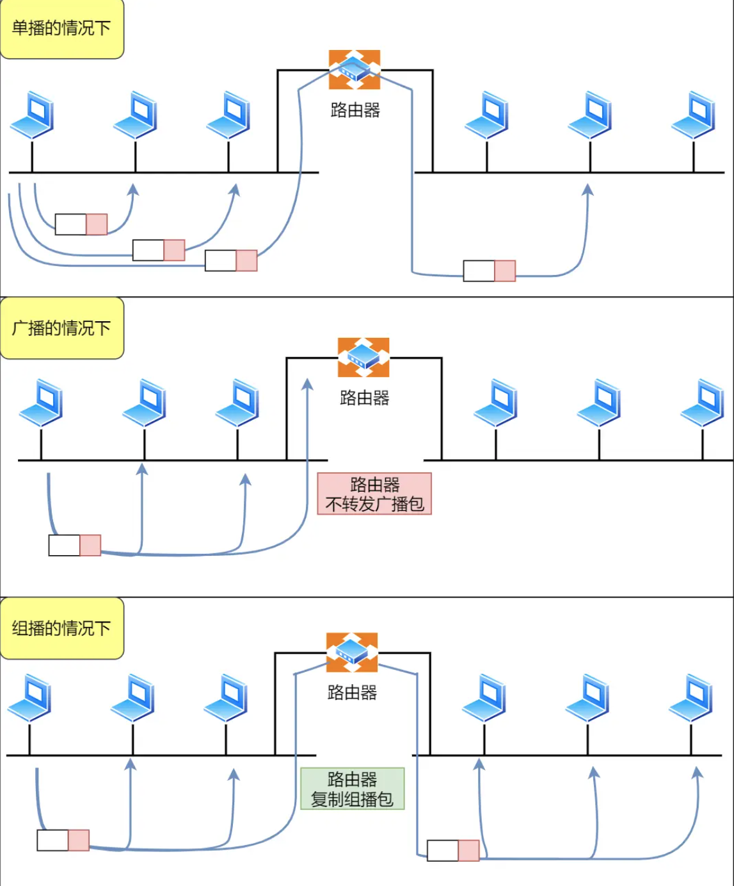
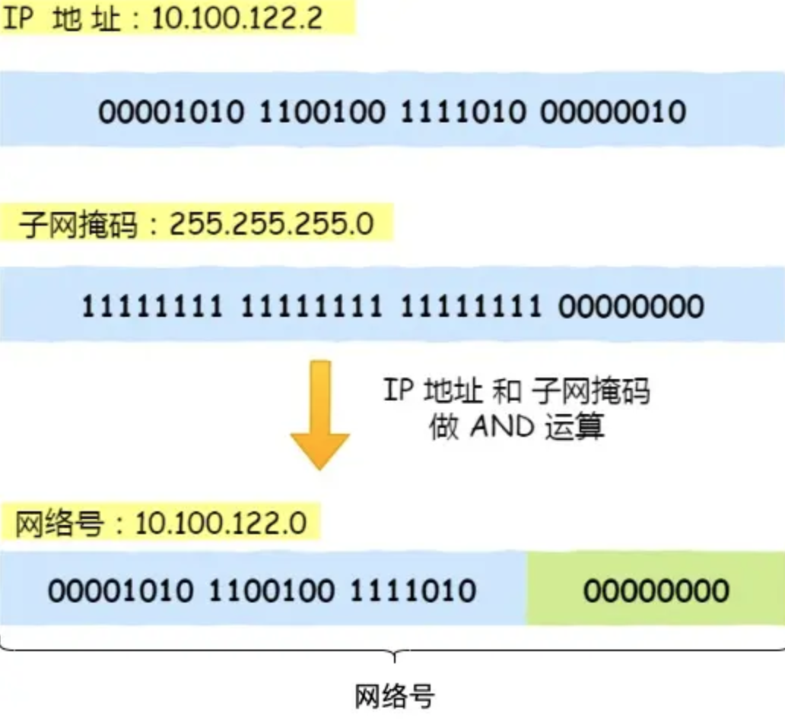
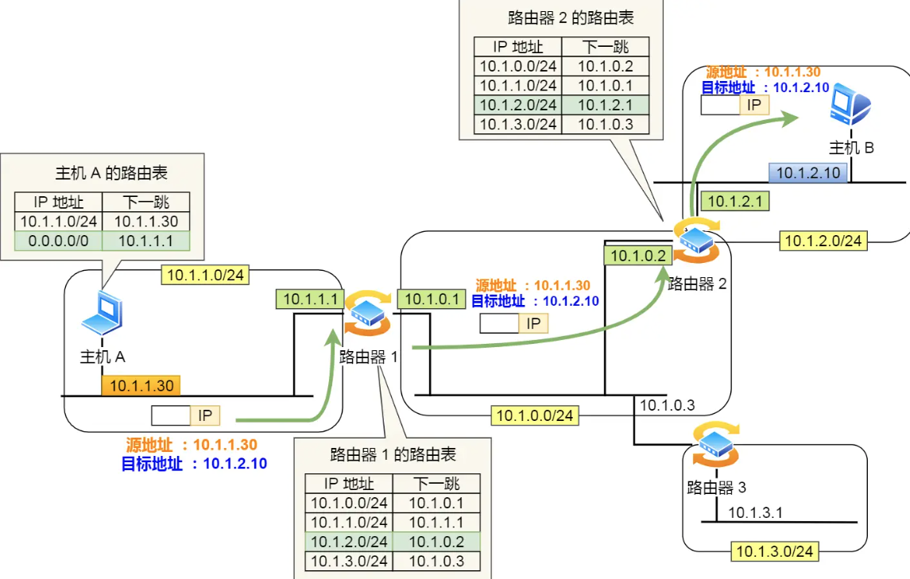

# IP

[小林 coding](https://xiaolincoding.com/)

[TOC]

使得在复杂的网络环境中将数据包发送给最终目的主机

**@ IP和MAC（数据链路层）的关系和区别**

IP的作用是主机之间通信用的，MAC的作用是实现两个设备之间通信，IP则负责在没有直连的两个网络之间进行通信传输，IP指明方向，MAC决定具体怎么走

---

首先每个设备需要配置正确的IP地址

IPv4由32位正整数表示，为方便记忆，将32位IP地址以每8位一组，分为4组转为10进制

IP地址不是以主机台数来配置的，而是以网卡来配置的，通常路由器、服务器都有2个以上的网卡和IP地址

## IP地址的分类

黄色部分为分类号，用以区分IP地址类别

A、B、C类地址分为网络号和主机号两部分。

例如对于C类，最大主机个数

减2是因为两个IP是特殊的，即主机号全为1指定某个网络下的所有主机用于广播，和全为0指定某个网络

D类没有主机号，常被用于多播，E类未使用

**@ 广播地址的作用**

用于在同一个链路中相互连接的主机之间发送数据包

**本地广播**：例如网络地址若为192.168.0.0/24，广播地址为192.168.0.255，这个广播地址的IP包会被路由器屏蔽，所以不会到达192.168.0.0/24以外的链路上

**直接广播：** 192.168.0.0/24 向 192.168.1.255/24发送IP包，收到包的路由器转发给192.168.1.0/24，使得所有192.168.1.1 - 192.168.1.254都能收到这个包（由于直接广播有安全问题，通常设置为不转发）

**全局广播：**地址是255.255.255.255，现在不会使用

---

**@ 多播地址的作用**

用于将包发给特定组内的所有主机

广播不能穿透路由，若想给其他网段发送同样的包，可以使用穿透路由的多播

D类地址

4位表示是多播地址，剩下的28位是多播的组编号

- 224.0.0.0 ~ 224.0.0.255 为预留的组播地址，只能在**局域网中**，路由器是不会进行转发的。
- 224.0.1.0 ~ 238.255.255.255 为**用户可用的组播地址**，可以用于 Internet 上。
- 239.0.0.0 ~ 239.255.255.255 为**本地管理组播地址**，可供内部网在内部使用，仅在特定的本地范围内有效。

---

**@ IP分类的优缺**

优点：简单明了，选路简单

缺点：

1. 同一网络下没有地址层次，不能再次细分
2. 不能很好的与现实网络匹配，C类地址能包含的最大主机数量太少，B类地址的最大主机数又太多

## 无分类地址CIDR

只有两部分，前面是网络号，后面是主机号

表示形式 `a.b.c.d/x`，其中/x表示前x位（0-32）属于网络号，

例，10.100.122.2/24表示前24位是网络号，剩余8位为主机号

而广播地址是每个子网里最大的那个主机号

**子网掩码**

**@为什么要分离网络号和主机号**

两台主机通讯先判断是否处于一个广播域中，即网络地址相同表面在同一网络上，可以直接把数据包发给目标主机

路由器寻址也是通过这样的方式来找到对应的网络号，把数据包发给对应网络中

---

**@子网划分**

通过子网掩码划分子网

将主机地址分为两个部分：子网网络地址+子网主机地址

由于子网网络地址划分为2位，子网地址就有4个，00、01、10、11

---

## 公有IP地址与私有IP地址

A、B、C分类地址，有分公有IP和私有IP地址

个人用户使用私有IP地址，允许组织内部分配管理，不同网络可以重复

公有IP由ICANN组织统一分配，保持唯一

## IP地址与路由控制

IP地址的网络地址由路由控制，主机和路由器有各自的路由器控制表，路由控制表记录网络地址与下一步发送至路由器的地址

发送IP包时，首先确定IP包首部中的目标地址，从路由控制表中找到与该地址相同的网络地址的记录，转发给相应的下一个路由器。如果有多条相同网络地址的记录，则选择相同位数最多的网络地址，即最长匹配

主机A发送一个IP包，源地址是10.1.1.30，目标地址是10.1.2.10

1. 由于主机A中的路由表没有找到这个地址，因此将包转发到默认路由器1
2. 路由器1收到后，查找自身路由表，把IP数据包转发到10.1.0.2这台路由器2
3. 路由器2收到后，查找自身路由表，发现匹配了，把IP包从路由器2的10.1.2.1接口出去，经过交换机把IP数据包转发目标主机

**@ 环回地址**

127.0.0.1是特殊地址，是同一台计算机程序之间进行网络通信使用的默认地址

---

## IP分片与重组

每个数据链路的最大传输单元MTU不同（因为有不同用处），以太网是1500，当IP数据包大于MTU时，IP数据包会被分片，重组只能由目标主机完成，路由器不参与

由于IP层包分片，其中丢失了一个就会整体重发，所以TCP中引入了MSS，即在TCP做了分片，每个分片小于MTU，不交给IP层分片。对于UDP，尽量不要发送一个大于MTU的数据报文

## IPv6

### 概念

**优点：**

- 128位，有更多的地址，更好的安全性和扩展性
- 自动分配IP地址，即插即用
- 包头包首部采用固定的值40字节，去掉包头校验和，简化了首部结构，减轻了路由器负荷，提高了传输的性能
- 提高了安全性，有应对伪造IP地址的网络安全功能及防止线路窃听的功能

但IPv4和IPv6不能兼容，需要设备、网络运营商共同升级，因此普及慢

**IPv6地址的标识：**

以16位作为一组，中间用：隔开

出现连续的0可以将其省略，用：：隔开，但一个IP地址只能出现一次这种省略

### IPv6地址的结构

**环回地址**用于当前主机内的通信，不经过网络

#### 单播地址

**全局单播地址**，相当于IPv4的公有IP

**唯一本地地址**，在内网里播通信（相当IPv4的私有IP），常用于当本地IP未配置时，同一网络内的通信，

**链路本地单播地址**，同一链路单播通信，不经过路由器（IPv4没有这个地址）

### IPv6首部与IPv4首部

- 取消了首部校验和字段：数据链路层和传输层都会校验，因此取消
- 取消了分片/重组相关字段：上层分片重组了，IPv6不允许在中间路由器进行分片重组，只能在源主机和目标主机，大大提高了路由器的转发速度
- 取消选项字段：放入在IPv6首部中的下一个首部指出的位置上，删除该字段使得IPv6的首部为固定的40字节

## IP协议相关技术

### DNS域名解析

比起IP地址，域名更方便人类记忆，DNS可以将域名网址转为具体的IP地址

#### 域名的层级关系

域名用句点来分割，靠右层级越高

- 根DNS服务器
- 顶级域DNS服务器(com 、cn)
- 权威DNS服务器(server.com)

根域的DNS服务器信息保存在互联网中所有的DNS服务器中，任何DNS服务器可以找到并访问根域DNS服务器

### 域名解析过程

浏览器先查看自己缓存，没有则查看os的缓存，还没有则查看本机域名解析文件hosts，还没有则DNS服务器查询：

1. 客户端发出DNS请求给本地DNS服务器（客户端的TCP/IP中填写的DNS服务器地址）
2. 本地域名服务器收到客户端请求后，如果缓存的表格能找到，则直接返回IP地址，如果没有则去问它的根域名服务器，根DNS发现后置是.com，则返回.com的顶级域名服务器地址
3. 本地DNS收到后请求顶级域名服务器，询问www.server.com，顶级域名服务器给出器的权威DNS服务器的地址
4. 本地DNS收到后请求权威DNS服务器，询问www.server.com，权威DNS服务器给出域名解析的原出处，即IP地址
5. 本地DNS将IP地址返回客户端，客户端和目标建立连接

### ARP

传输IP数据报时，确定了源IP地址和目标IP地址后，需要通过主机路由表依次转发，通过主机的路由表可以找到下一跳的IP地址，即通过ARP协议求得下一跳的MAC地址

**@ 通过ARP查找MAC地址**

ARP借助ARP请求和ARP响应两种类型的包确定MAC地址：

- 主机通过广播发送ARP请求，广播内容包括想知道的MAC地址的主机IP地址
- 同个链路的所有设备收到ARP请求时，会拆开ARP请求包查看目标IP地址是否和自己的IP一致，一致则把自己的MAC地址塞入ARP响应包给主机

os通常会缓存MAC地址，不过这个缓存有一定期限，超过则清除

**@ RARP协议**

ARP是通过IP求MAC，RARP是通过MAC求IP地址，例如打印机等小型嵌入式设备接入网络时会用到

通常需要架设一台RARP服务器，对于新加入的设备：

- 新加入的设备发送MAC地址请求IP的请求信息
- RARP服务器收到后返回MAC地址对应的IP地址的信息给设备
- 设备根据收到的应答信息设置自己的IP

### DHCP

个人电脑通过DHCP动态获取IP地址，省去了配IP信息繁琐的过程

DHCP客户端监听68号端口，DHCP服务端监听67号端口

1. 客户端发起DHCP发现报文的IP数据报，（客户端没有IP地址，也不知道DHCP服务器的地址），所以使用UDP广播通信，目的地址是255.255.255.255：67，源IP地址是0.0.0.0：68。DHCP客户端把该IP数据报传递给链路层，链路层将帧广播到网络
2. DHCP服务器收到DHCP发现报文时，回复报文，携带IP广播地址255.255.255.255，带租约的IP地址、子网掩码、默认网关、DNS服务器
3. 客户端收到多个服务器的DHCP报文，选择一个发送请求报文，包含配置参数
4. 服务用DHCP ACK报文对DHCP请求报文响应，应答参数

此时客户端在租约内可使用DHCP服务器分配的IP地址

如果租约的DHCP IP地址快过期了，客户端会向服务器发送DHCP请求报文

- 服务器同意继续租用，则用DHCP ACK报文进行应答，则客户端延长租期
- 服务器如果不同意，则用DHCP NACK报文，客户端则停止使用该IP

DHCP全程使用UDP广播通信，如果服务端和客户端不在一个局域网内，则需要DHCP中继代理，不同网段的IP地址也可以由一个DHCP服务器同一分配管理

- DHCP客户端以广播的形式发送DHCP请求包给DHCP中继代理，DHCP中继代理以单播的形式发给DHCP服务器
- DHCP服务器收到包后向DHCP中继代理返回应答，再转给DHCP客户端

### NAT网络地址转换

IPv4地址紧张，因此提出网络地址转换NAT，缓解IPv4地址耗尽的问题

同个公司、家庭、教室内的主机对外部通信时，把私有IP转为公有IP，把IP地址+端口号一起转换，即**网络地址与端口转换**NAPT

两个私有IP地址同时发出请求时，路由器将两个不同的私有IP地址转换为同一个公有地址的不同端口号，并在NAPT转换表记录，当连接断开时，从表中删除这条记录

缺点：

- 外部无法主动和NAT内部服务器建立连接，因为NAPT转换表没有转换记录
- 转换表的生成和维护产生性能开销
- 通信时NAT路由器重启，则TCP连接重置

**NAT穿透技术**

应用程序主动建立好映射，从NAT设备获取公有IP地址，自己建立端口映射条目，用这个条目对外通信

### ICMP互联网控制报文协议

当网络包在复杂的网络传输中遇到问题时将由ICMP负责通知

ICMP主要功能：确认IP包能否成功送达目标地址、报告发送过程中IP包被废弃的原因和改善网络设置等

例：

主机A向主机B发送了数据包，由于一些原因，途中的路由器未能发现主机B的存在，这时，路由器会向主机A发送一个ICMP目标不可达数据包，说明发送不成功（这种通知消息会使用IP进行发送）

#### **ICMP报头格式**

封装在IP包里，工作在网络层

#### **查询报文类型**

用于诊断的查询消息

| 0    | 回送应答         | 查询报文类型 |
| ---- | ---------------- | ------------ |
| 3    | 目标不可达       | 差错报文类型 |
| 4    | 原点抑制         | 差错报文类型 |
| 5    | 重定向或改变路由 | 差错报文类型 |
| 8    | 回送请求         | 查询报文类型 |
| 11   | 超时             | 差错报文类型 |

**回送消息**用于进行通信的主机或路由器之间，用于判断所发送的数据报是否到达对端

**标识符**用于区分是哪个应用程序发的ICMP包，常用进程PID作为标识符

**序号**从0开始，每发送一次新的回送请求就会加1，用来确认网络包是否丢失

**选项数据**中，还会存放请求的时间值用于计算往返时间

#### **差错报文类型**：

用于通知出错原因的错误消息

**@ 目标不可达消息**

无法将IP数据包发给目标地址时，会给发送端主机返回一个目标不可达的ICMP消息，原因记录在ICMP包头的代码字段

代码字段包括：

- 0 网络不可达，IP分为网络号和主机号，网络号不匹配时则是这个报错，不再有网络分类后，这个渐渐不使用了
- 1 主机不可达，路由表没有该主机的信息或主机没有连接到网络
- 2 协议不可达，对端防火墙禁止TCP访问，则使用TCP的方式会返回这个报错
- 3 端口不可达，对端主机没有进程监听8080端口
- 4 需要分片但设置了不分片，需要超过MTU大小的包时则丢弃并告知发送端

**@ 原点抑制消息**

使用低速广域线路时，连接WAN的路由器可能遇到网络拥堵，

当路由器向低速线路发送数据时，其发送队列的缓存变为0而无法发送出去时，可以向IP包的源地址发送一个ICMP原点抑制消息

主机收到这个消息后，可以增大IP包的传输间隔，减少网络拥堵

然而，这可能产生不公平的网络通信，因此一般不用

**@ 重定向消息**

如果路由器发现发送端主机使用了不是最优的路径发送数据，那么它会返回一个ICMP重定向消息给主机

消息中包含了最合适的路由信息和源数据

**@ 超时消息**

IP包中的TTL字段，它的值随着每经过一次路由器就会减1，直到减到0时该IP包会被丢弃，此时路由器会发送一个ICMP超时消息给发送端主机

这个TTL字段的目的是为了避免在路由控制中出现循环的情况，避免IP包无休止的在网络上被转发

有时可以将TTL设置为一个较小的值，来控制包到达的范围

#### ping的工作原理

IP协议基于ICMP协议实现

1. ping命令执行时，源主机首先会构建一个ICMP回送请求消息数据包

   ICMP数据包内包含类型（回送请求为8）、序号（区分连续的ping）、发送时间

   ICMP协议将这个数据包连同目标地址一起交给IP层，协议字段为1标识是ICMP协议，再加上其他控制信息构建成IP数据包

2. 加入MAC头，

   如果本地ARP映射表中查找出IP地址对应的MAC地址则直接使用，没有则发送ARP协议查询MAC地址，

   获得MAC地址后，由数据链路层构建一个数据帧，加上控制信息，传送出去

3. 主机B收到数据帧后，先检查MAC地址和本机地址对比，符合则接收，否则丢弃

   从帧中提取数据包给本机的IP层，IP检查后将信息提取给ICMP协议

4. 主机B构建一个ICMP回送响应消息数据包，

   ICMP回送响应包包含类型（回送响应为0）、序号（发来的序号）

ping和TCP都是用socket函数实现，只是TCP发送数据时报头不同，一个是ICMP头，一个是TCP头

#### traceroute——差错报文类型的使用

traceroute（unix、macos），tracert（windows）

**作用一**：设置特殊的TTL，追踪来去目的时经过的路由器

`traceroute 192.168.1.100`

它的原理就是将TTL设置为1，遇到第一个路由就返回差错报文网络，再将TTL设置为2，遇到第二个路由返回差错报文网络，如此反复直到到达目的主机，从而拿到所有路由器的IP

**作用二**：故意设置不分片，从而确定路径的MTU

有时不确定路由器的MTU大小，以太网一般1500字节，非以太网不确定

在发送端主机发送IP数据报时，将IP包首部的分片禁止标志设为1，发送端每次收到ICMP差错报文时就减少包的大小，以此来定位一个合适的MTU值

### IGMP因特网组管理协议

组播地址可以给一组的地址发送数据，如果管理一组需要IGMP协议

IGMP工作在主机和最后一跳路由之间

主机发送IGMP报文申请加入到组播组时，路由器记录IGMP路由表，路由器后续就会转发组播包到对应的主机，如果不加入，默认路由器不会转发组播包到连接中的主机

IGMP报文采用IP封装，IP头部的协议为2，TTL字段通常为1，因为IGMP是工作在主机和连接的路由器之间

**IGMP工作机制**

IGMP分为，IGMPv1，IGMPv2，IGMPv3

**常规查询和响应工作机制**

IGMPv2下

1. 路由器周期性发送**IGMP常规查询报文**给特定组播地址224.0.0.1

2. 主机收到查询，如果本地有对应的组播组成员，则发送**IGMP成员关系报告报文**（源IP为自己主机的IP，目的IP为组播地址）

   这种发送是通过启动延迟计时器（随机0-10s），超时后就会发，如果在定时器超时之前，收到同一组内其他主机发出的成员关系报告报文，则自己不发送，这样可以减少整个组内的网络数量

3. 路由器收到主机成员关系报文后，在IGMP路由表中加入该组播组，

**离开组播组工作机制**

1. 主机发送离组报文给224.0.0.2
2. 路由器收到报文后，以1s为间隔连续发送**IGMP特定组查询报文**（共计发送2个），以便确认该网络是否还有224.1.1.1组的其他成员
3. 如果有主机是这个特定组的成员则立即响应
4. 路由器收到后，则继续向该网络转发组播数据包。如果没有其他成员了，则停止转发该组播地址的数据包

### 为什么断网还能ping通127.0.0.1

ping命令执行时，从应用层到传输层到网络层，这段路径和ping外网一样，到了网络层，系统会根据目的IP在路由表中获取对应的路由信息，包括选择哪个网卡把消息发出

当发现目标IP是外网IP就从真网卡发出，当目标IP是回环地址时，就选择本地网卡

本地网卡是个假网卡，有个input_pkt_queue的链表中挂者发给本地的各自消息，消息发到这个链表会触发有个软中断，内核线程ksoftirqd会负责取出消息，顺着数据链路层、网络层层层上层给应用程序

如果主机负载大，可能ping127.0.0.1会失败

**@ ping回环地址和ping本机地址有什么区别**

没有区别，都不会发送到网络中

**@ 127.0.0.1和localhost和0.0.0.0**

localhost是个域名，等同于网址，默认会把他解析为127.0.0.1，可以在/etc/hosts文件下修改

ping0.0.0.0是不行的，它在IPv4中表示的是无效地址。

当启动服务器时，一般会listen一个IP和端口，等待客户端的连接，如果listen的是本机的0.0.0.0，表示本机上所有IPv4地址。此时用127.0.0.1和192.168.31.6都能访问到这个服务器。当然客户端connect时，不能使用0.

# 方

NAT模式：实现私有ip地址和公有ip地址的转换，使得通过一个公共IP地址访问一个局域网下的多个设备

TUN模式：虚拟网络接口方式，常用于虚拟机、容器连接到其他虚拟网络

DR模式：使用虚拟MAC地址请求实际机器，修改为目的地的mac地址，使真实物理服务器集群所有机器虚拟ip和负载均衡服务器ip地址一样，这种方式为直径路由方式
