[小林 coding](https://xiaolincoding.com/)

# 基础

TCP/IP的四层模型：应用层、传输层、网络层、网络接口层（数据链路层、物理层）

OSI模型：应用层、**表示层、会话层**、传输层、网络层、数据链路层、物理层

应用层在用户态下，其他层在内核态下，专注于为用户提供应用功能，比如HTTP、FTP、Telnet、DNS、SMTP等

**传输层**为应用层提供网络支持，帮助实现应用到应用的通信。传输协议包括TCP、UDP。应用层传输的数据可能很大，不好直接传输，传输层的数据包大小超过MSS（TCP最大报文段长度）就要将数据包分块，每个分块即一个TCP段。

**网络层**负责实际的传输功能，最常使用的是IP协议，将传输层的报文作为数据部分，加上IP包头组装成IP报文，报文大小超过MTU（以太网中一般为1500字节）就会再次分片。

用ip地址区分设备，ip地址分为网络号和主机号

配合子网掩码算出IP地址的网络号和主机号，比如10.100.122.0/24，/24表示255.255.255.0子网掩码（其中有24个1）

将10.100.122.0和255.255.255.0进行按位与运算得到网络号，将255.255.255.0取反与IP地址进行按位与运算得到主机号

寻址中，先匹配到网络号再匹配主机

IP协议还有路由的选择，实际场景多台设备通过众多网络设备连接起来，形成多条网络的路径，因此需要通过路由算法决定路径选择

即IP协议的寻址决定了方向，路由选择路径

**网络接口层**在IP头部前加锁MAC头部，并封装成数据帧发送到网络上

以太网指在局域网内把附近的设备连接起来使他们可以进行通讯，包括电脑的以太网接口，wifi接口，以太网交换机，路由器的以太接口。

以太网在判断网络包目的地与IP的方式不同，因此必须采用相匹配的方式，MAC头部就起到这个目的，其中包含了接收方和发送方的MAC地址等信息，可以通过ARP协议获取对方的MAC地址

# 键入网址到网页显示

HTTP

解析URL

URL的组成：协议+服务器名称+路径

路径的/地址不是linux系统的根/，而是web服务器配置文件中指定的根，为某个路径

如果不指定文件路径，则访问一个默认地址

生成HTTP请求信息

请求行/状态行+消息头+消息体
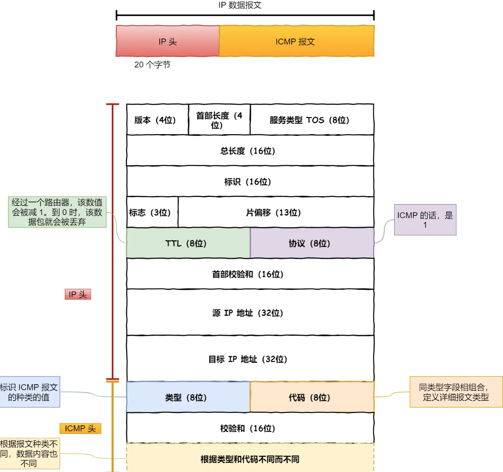

真实地址查询——DNS

查询服务器域名对应的IP地址，DNS服务器记录了web服务器域名和IP的对应关系

域名越靠右层级越高，**域名的层级关系如下**

- 根DNS服务器（.)默认隐藏
- 顶级域DNS服务器（.com）
- 权威DNS服务器（[server.com](http://server.com)）

根域的DNS服务器信息保存在互联网所有的DNS服务器中

**域名解析的过程**

- 客户端发出DNS请求，查询域名对应的IP，发给本地的DNS服务器（客户端TCP/IP设置中填写的DNS服务器地址）
- 本地域名服务器收到客户端请求后，询问**根域名服务器**得到.com顶级域名服务器的地址
- 本地DNS访问**.com顶级域名服务器**，得到负责www.server.com区域的权威DNS服务器地址
- 本地DNS访问**权威DNS服务器**，得到对应的IP地址
- 本地DNS将IP地址返回客户端

并不是每次访问都需要经过全步骤，其中浏览器、操作系统、hosts文件、本地域名服务器都会有缓存

协议栈

获取到IP后，将http的传输工作交给os的协议栈
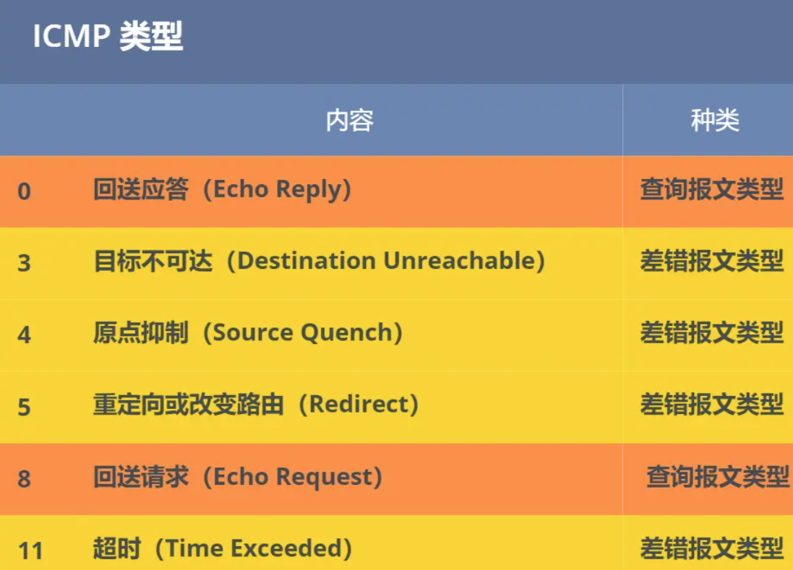

应用程序通过socket库来委托协议栈工作，协议栈上半部分为负责收发数据的TCP和UDP协议，下半部分是用IP协议控制网络包收发操作，包括ICMP协议（告知网络包传送过程中产生的错误和控制信息）和APR协议（根据IP地址查询相应的以太网MAC地址）

# QUIC: 如何通过UDP来实现TCP

## QUIC如何实现可靠传输
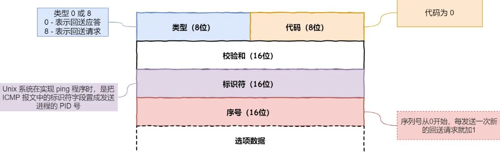

**Packet Header** 细分这两种：

- Long Packet Header 用于首次建立连接。（源连接ID+目标连接ID）
- Short Packet Header 用于日常传输数据。（目标连接ID+包号+负载数据）
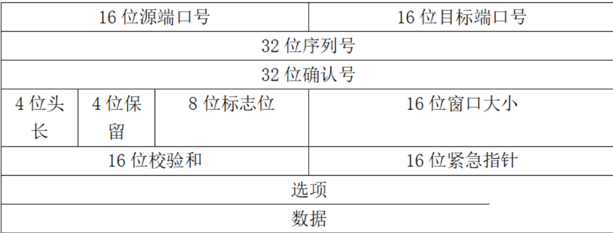

**优化一：**实现连接迁移，通过连接ID字段

通过三次握手协商目标连接ID，传输的时候只传目标连接ID

**优化二：**精准的计算RTT，同过包号字段

包号是独一无二且递增的，同一个数据多次重传会是不同的包号

> 传统TCP在因为重传报文的序列号和原始报文一样从而产生重传歧义问题：
> 对于一个包的ACK不知道是原始报文还是重传报文的ACK，从而无法计算RTT

## 如何解决TCP的队头阻塞

**优化三**：乱序确认，解决队头阻塞问题

> 什么是队头阻塞，接收方没收到30号数据，但是收到了31-50的数据，此时不能把31-50的数据给应用层（即使31-50的数据和30的数据不是一个stream的），带来如下问题：
>
> 1. 滑动窗口不能移动，接收窗口的大小变小一直被30号数据阻塞
> 2. 31-50的数据是一个stream的，30的数据是另一个stream的，此时31-50的数据收到了却不能给应用层，因为TCP要包有序才能传给上层。但实际上两个stream无数据依赖关系

发送方收到包丢失后，会生成新的包号重发，旧的包号不需要了，从而移动滑动窗口。这样就不会因为丢包重传将当前窗口阻塞在原地，解决了队头阻塞

**Frame Header字段**

一个packet报文可以存放多个QUIC Frame

- stream ID：多个并发传输的HTTP消息，通过stream ID区分
- offset：保证数据的顺序
- length：指明frame数据的长度

**优化四：**数据的有序性，通过stream ID +offset实现

包号不一样是为了做包重发，确定重发的包是哪个包是通过比较两个数据包的stream ID 和stream offset，就能确认两个数据包的内容一致

**优化五：**每个stream之间无干扰，通过包号+stream ID+offset实现+独立的滑动窗口

给每一个stream分配了一个独立的滑动窗口

## 如何做流量控制

TCP是通过让接收方告诉发送方它的接收窗口大小从而控制发送方的发送数据量

- 通过sindow_update帧告诉对端自己可以接收的字节数，
- 通过BlockFrame告诉对端由于流量控制被阻塞了，无法发送数据

1. stream级别的流量控制

即每个stream的独立的滑动窗口都需要做流量控制

接收窗口的左边界移动条件：

- TCP的接收窗口，只有在前面所有字节都接收到后，才移动左边界
- QUIC的接收窗口，收到的最大偏移字节数变了，则移动左边界
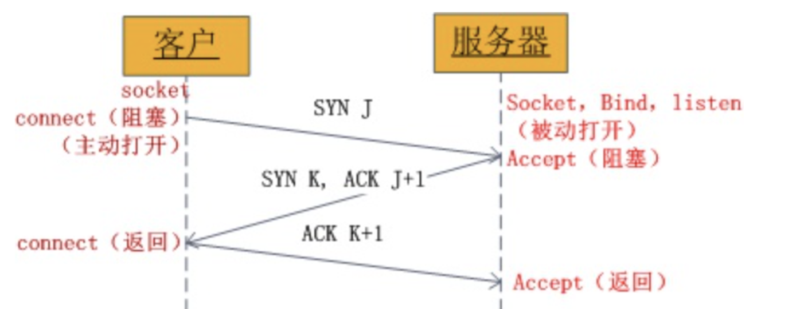

？区别是什么未知

接收窗口的右边界移动条件：

- 传回上层的数据>最大接收窗口的一半时
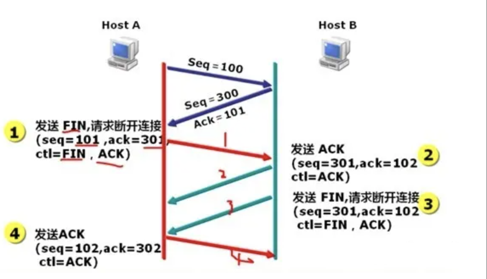

2. connection流量控制

限制所有stream相加起来的总字节数，小于物理缓冲容量

等同于各个stream接收窗口大小之和

## 拥塞控制的改进

基本等同于TCP的拥塞控制算法（慢开始、拥塞避免、快重传、快恢复）

- QUIC基于应用层从而不需要内核支持，TCP和内核和操作系统关联强，从而迭代速度慢
- TCP对系统所有应用生效，QUIC处于应用层，对于不同应用设置不同的拥塞控制算法

## 更快的连接建立

TCP和HTTPs需要先建立TCP连接，再建立HTTP连接

QUIC包含了TLS（ssh)，从而一次RTT完成连接

# TCP

## TCP和UDP

1. 连接：TCP需要连接后再发送数据，UDP不需要
2. 连接数量：TCP一对一，TDP支持一对多，多对多
3. 首部开销：TCP首部长度较长，使用了选项会使得字段变长，UDP首部8字节，固定不变
4. 分片：TCP数据大于MSS大小，则会在传输层分片，UDP数据大于MTU大小，会在IP层分片，目标主机在IP层组装数据
5. 拥塞控制：TCP有拥塞控制和流量控制，UDP没有
6. 传输方式：TCP流式传输，没有边界，保证顺序和可靠，UDP一个包一个包的发送有边界，可能丢包和乱序
7. 可靠性：TCP可靠交付，UDP最大努力交付

> TCP有可变长字段，UDP长度不会变化，不需要UDP首部长度字段

**@UDP有包长度字段，TCP没有**

TCP计算负载数据长度：TCP数据长度=IP总长度-IP首部长度-TCP首部长度

UDP也可以通过这样的方式计算长度，但是

第一种说法：用于补全UDP首部长度为4字节的倍数

第二种说法：早期的UDP协议可能不是基于IP协议的

**@TCP和UDP可以使用同一个端口吗**

可以

传输层的端口号是为了区分同一个主机上不同应用程序的数据包

数据链路层中，通过MAC地址来寻找局域网中的主机，网络层中，通过IP地址来寻找网络中互连的主机或路由器，传输层中，通过端口进行寻址（识别同一计算机中同时通信的不同应用程序）

传输层的TCP和UDP在内核中（传输层）属于两个完全独立的软件模块，他们的端口号相互独立，主机通过在IP包头的协议号字段知道该包是TCP/UDP，根据这个信息确定送给哪个模块处理

## **TCP协议**

### 定义

**有连接**：发送数据之前，需要进行连接，且一对一。

**可靠传输**：保证数据时有序且可靠的到达对端机器。

**面向字节流**：与面向数据报相反，数据可以在传递的过程中分成多个TCP报文，有序报文。

**回环地址**：IPv4所有127.开头的都是回环地址，IPv6表示为::1

**0.0.0.0**指代本机的所有IP地址，即回环地址和所有网卡

**loopback地址，**每一台路由器创建一个loopback 接口，并在该接口上单独指定一个IP 地址作为管理地址，管理员会使用该地址对路由器远程登录（telnet ），该地址实际上起到了类似设备名称一类的功能。
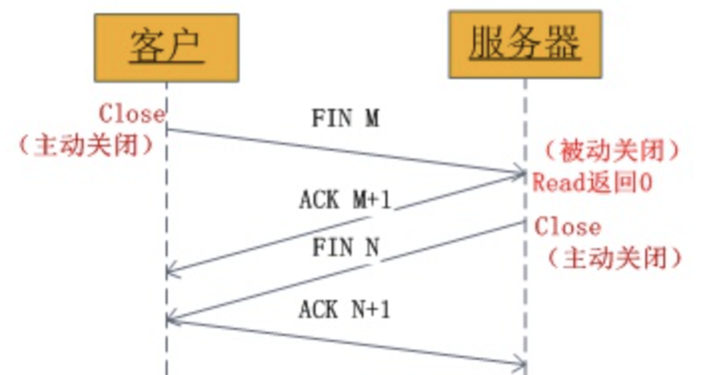

**标志位包含：**

**序列号**SEQ：建立连接时生成的随机数，每发一次数据累加一次，用于解决网络包乱序问题，32位无符号数，循环使用

**确认应答号：**下一次期望收到的数据的序列号，发送端收到这个确认应答后可以认为这个序号以前的数据都已被正常接收，用于解决丢包问题

**控制位:**

- ACK ,为1表示确认应答字段有效

- RST：表示TCP连接出现异常强制断开连接

- SYN:表示希望建立连接

- FIN：表示希望断开连接

### TCP连接

**@什么是TCP连接**

用于保证可靠性和流程控制维护的某些状态信息的组合，包括socket（由ip地址和端口号组成），序列号（用来解决乱序问题），窗口大小（作流量控制）

**@如何唯一确定一个TCP连接**

TCP四元组：

源地址和目标地址：32位，在IP头部，通过IP协议发送报文给对方主机

源端口和目的端口：16位，在tcp头部，告诉TCP协议应该把报文发给哪个进程

**@一个ip的服务端监听一个端口，他的TCP最大连接数是多少**

最大TCP连接数=客户端的IP数*客户端的端口数（IPv4为2^32 * 2^16）

当实际上并不会达到理论上限，会收到以下因素的影响

文件描述符限制：系统级（系统可打开的最大数量）、用户级（用户可打开的最大数量）、进程级（单个进程可打开的最大数量）

内存限制：每个TCP连接都要占用一定内存

#### TCP的建立（三次握手）

一开始，客户端和服务处于close状态，服务端主动监听某个端口，处于LISTEN状态

**第一次握手：**建立连接时，客户端**发送syn包**(syn=j)到服务器，并进入**SYN_SEND**状态，等待服务器确认；SYN：同步序列编号(Synchronize Sequence Numbers)。

报文：将**SYN标志**位置1，随机初始化序列号，将此序号置于TCP首部的**序列号**字段中，发送，不包含应用层数据
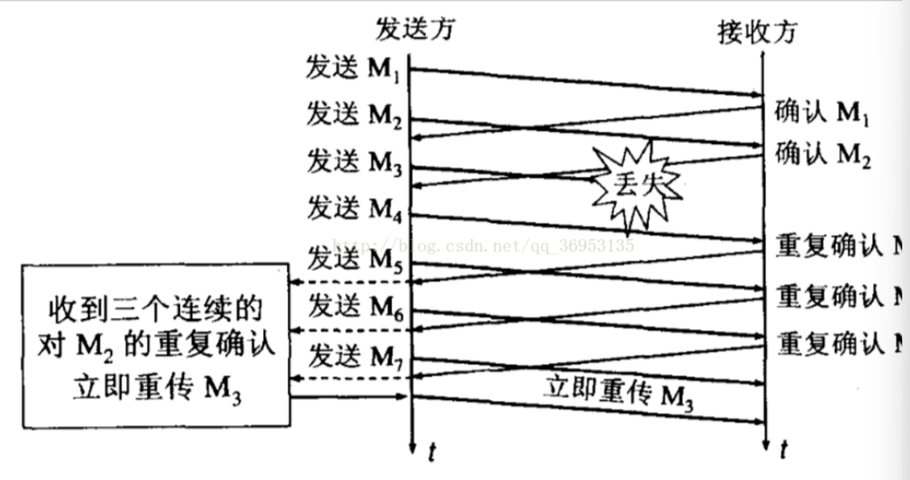

**第二次握手：**服务器收到syn包，必须确认客户的SYN（ack=j+1），同时自己也**发送一个SYN包**（syn=k），即**SYN+ACK**包，此时服务器进入**SYN_RECV状态**； 

报文：服务端也随机初始化自己的**序列号**（server_isn），填入TCP首部的序列号字段中，其次把TCP首部的确认应答号填入server_isn+1的**确认应答号**，**SYN和ACK**标志为1，发送报文，不包含应用层数据
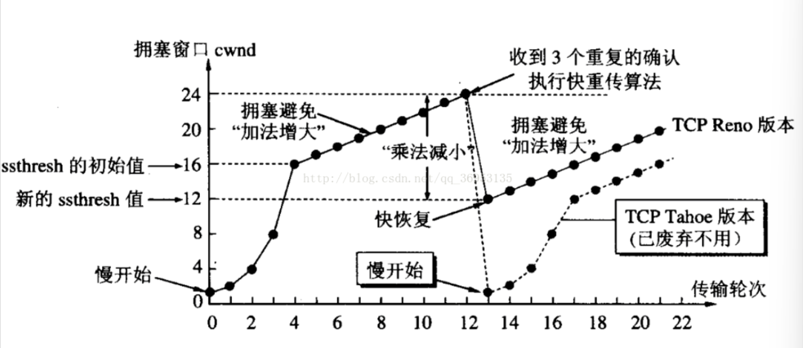

**第三次握手**：客户端收到服务器的SYN+ACK包，向服务器发送确认包ACK(ack=k+1)，此包发送完毕，

报文：ACK标志位置1，填入应答号字段

客户端进入ESTABLISHED状态，完成三次握手。 服务端收到后也进入**ESTABLISHED**状态
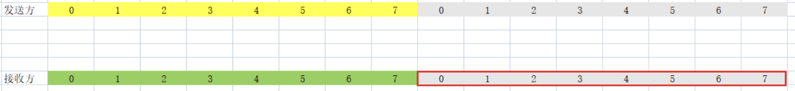

@linux中查看TCP连接状态

`netstat -napt`

#### TCP快速建立连接

需要由于第三次握手可以携带数据，一个完整的交互过程需要2个RTT的时延

对HTTP GET请求，linux提供了TCP Fast Open功能，可以减少建立的时延

- 在第一次建立连接时，第二次握手会产生一个cookie（已加密）通过SYN、ACK包发给客户端，客户端会缓存这个Cookie

- 下次请求的时候，客户端在SYN包带上cookie发给服务端，就可以跳过三次握手，这时HTTP GET请求只需要1个RTT时延

客户端存储了Fast Open Cookie之后，可以不断重复TCP Fast Open直至服务器认为cookie无效

net.ipv4.tcp_fastopen

#### 为什么是三次握手，不是两次、四次

1. 三次握手才能阻止**<u>重复连接的初始化</u>**，防止旧的重复连接初始化造成混乱，

   想象一个场景：客户端发送给SYN报文，然后客户端宕机，这个SYN被网络阻塞服务端没有收到，客户端重启后又重新发送SYN（不是重传，是以新的序列号发送）

   - 客户端连续发的多次SYN，如果旧的报文先到，服务端回应SYN+ACK报文给客户端

   - 客户端收到这个回应，发现和期望收到的确认号不一致，回复RST报文，服务端收到RST释放连接

   - 后续服务端收到新的SYN，完成正常握手

   **@如果服务端第一次收到旧SYN，再收到新的SYN**

   再收到新的SYN会回Challenge ack，即上一个SYN的序号，客户端收到此报文发现不是自己期望收到的，回复RST报文，重发新的SYN

   **@那为什么两次握手不行**

   如果是两次握手就无法阻止历史连接，没有中间状态给客户端来阻止历史连接，导致服务端建立了一个历史连接造成资源浪费

   服务端收到SYN报文就进入了ESTABLISHED状态，但客户端还没有进入ESTABLISHED状态，客户端会RST时服务端才会断开连接

   **@如果第三次握手的包丢失了**或者**第一个数据包先于第三次握手的包到服务端**

   服务端收到第一次握手的syn包进入syn_received状态，丢失了第三次的ACK，但是收到了客户端发送的数据，还是可以建立连接并正常收到这个数据包，因为数据报文中有ack标识位和确认号

2. 三次握手才能**<u>同步双方的初始序列号</u>**

   TCP协议通信双方维护各自的序列化，这可以起到去重复的数据，保证包的顺序，确认包的接收

   发送一次接收一次才能保证双方的初始序列号能被可靠同步

   四次握手也可以可靠同步，但第二步服务端回复客户端，和第三步服务端发出初始序列号可以合成一步

3. 三次握手才能**<u>避免资源浪费</u>**

   两次握手对于每一个客户端发来的SYN都要主动建立连接，而服务端发出的ACK报文因网络阻塞无法到达客户端，客户端一直收不到ACK就会重发，服务端因此建立多个无效连接，造成资源浪费

#### 每次握手分别丢失了会发生什么

**@如果第一次握手丢失了**

客户端会因迟迟收不到ACK而超时重传（重传的报文SYN序列号是一样的），时长写死在内核中，最大重传次数可定义一般为5（超时时长每次为1，2，4，8，16，32），总耗时约1分钟

**@如果第二次握手丢失了**

服务进入SYN_RCVD状态，此时第二次握手丢失，客户端会触发超时重传，服务端收不到回应也会触发超时重传，

**@如果第三次握手丢失了**

第三次握手如果丢失，服务端收不到确认报文会认为自己发出的SYN+ACK报文丢失了，而触发超时重传，客户端的ACK是不会重传的，只由服务端重传，客户端再收到SYN+ACK会再回复ACK。如果服务端超时重传两次后还是没等到第三次ACK就会断开连接

### 如何理解TCP是面向字节流的协议

UDP是面向报文的协议，通过UDP协议传输时不会对消息进行拆分，发出去UDP报文的数据就是完整的用户消息，每个UDP报文就是一个用户消息的边界，

对于收到两个UDP报文，会将其插入到队列中，队列中的每一个元素就是一个UDP报文，用户调用读数据时就会从队列中取出一个数据从内核拷贝给用户缓冲区

用户通过TCP协议传输时，消息可能被操作系统分组成多个TCP报文，因此不能认为一个用户消息对应一个TCP报文，当两个消息的部分内容分到同一个TCP报文时，即粘包问题，这时接收方不知道消息的边界就无法读取有效的消息，这个问题的解决交给应用程序

**解决粘包：**

**固定长度的消息**

实际灵活性太差，很少用

**特殊字符作为边界**

HTTP采用特殊字符作为边界，设置回车符、换行符作为HTTP报文协议的边界
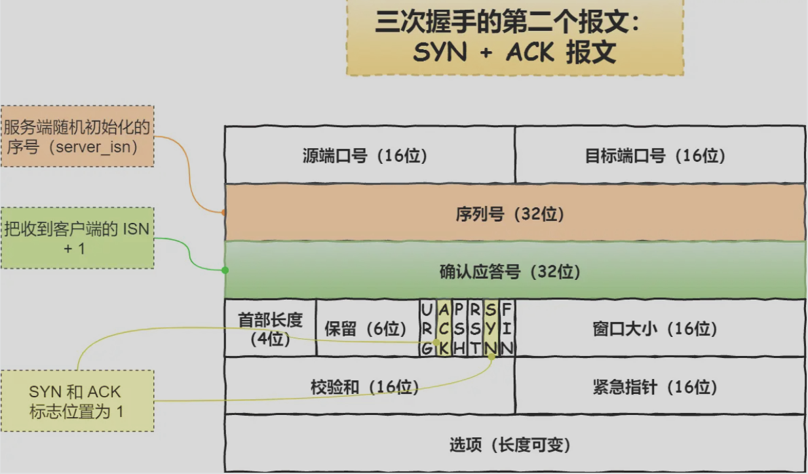

如果消息内容里有这个特殊字符，需要对这个字符转义，避免读取错误

**自定义消息结构**

例如，定义消息结构由包头和数据，包头固定大小，里有一个字段来说明其后的数据有多大

### SYN攻击

……

### 初始序列号ISN

如何随机产生：

ISN=M（计时器）+F(hash算法，根据四元组随机生成)，循环一次需要4.55小时

**@为什么每次建立TCP连接初始化的序列化都要求不一样**

1. 防止历史报文被下一个相同四元组的连接接收

   如果每次连接的序列号一样，将出现如下场景

   - 服务端和客户端建立连接，客户端发送一个包由于网络阻塞超时重传
   - 服务端断电重启，建立的连接消失，因此回复RST
   - 客户端与服务端建立与上一个连接相同的四元组
   - 之前网络阻塞的包现在到达，被服务端接收了，造成数据错乱

   虽然初始化序列号不一样很大程度避免了历史报文被下一个相同四元组的连接接收，但并没有完全避免

2. 为安全性，防止黑客伪造相同序列号的TCP报文

### 既然IP层会分片，为什么TCP层还需要MSS

MTU：网络包最大长度，通常为为1500
MSS：除去IP和TCP头部，能容纳的实际数据大小

如果不使用MSS，当IP层有超过MTU大小的数据就分片。但这存在的问题就是如果一个IP分片丢失，整个IP报文的所有分片都得重传，而IP层没有超时重传，由传输层的TCP负责超时和重传

当一个IP分片丢失后，接收方的IP层无法组成完整的TCP报文交付到TCP，使得TCP触发超时重传整个报文的所有分片

设定了最大MSS长度，会小于MTU长度，确保每次重发时以MSS为单位

### TCP连接的终止

#### TCP连接的终止（四次挥手释放）

1. 客户端发出TCP首部FIN标志位为1的报文，之和客户端进入FIN_WAIT_1状态
2. 服务端收到报文后向客户端发送ACK，进入CLOSE_WAIT状态
3. 客户端收到服务端的ACK后，进入FIN_WAIT_2状态
4. 服务端处理完数据后，向客户端发送FIN报文，进入LAST_ACK状态
5. 客户端收到服务端的FIN报文后，回一个ACK应答报文，进入TIME_WAIT状态，经过2MSL的时间后自动进入CLOSE状态
6. 服务端收到了ACK应答报文后进入CLOSE状态

#### 每次挥手的丢失

**@第一次挥手丢失**

超时重传，通常为3次，超时时间每次2倍叠加，一直丢失就会断开连接

**@第二次挥手丢失**

ACK的报文都不会重传，因此第二次挥手丢失，客户端收不到回复就会超时重传FIN报文，如果一直收不到第二次挥手，客户端就会断开连接

默认情况下，客户端收到第二次挥手，就会处于FIN_WAIT2状态，这个状态下，对于调用close关闭的连接，如果60s后没有收到FIN报文，客户端的连接会直接关闭

如果使用shutdown函数关闭连接，指定了只关闭发送方向，而接收方向没有关闭，意味这主动关闭方还可以接收数据，此时主动关闭方一直没收到第三次挥手，将一直处于FIN_WAIT_2状态

**@第三次挥手丢失**

内核收到客户端的FIN报文后回复了ACK，等待进程主动调close来触发服务端发送FIN报文，进入LAST_ACK状态

如果服务端迟迟收不到这个ACK服务端就会重发FIN报文（tcp_orphan_retrie控制重发次数），如果一直收不到这个ACK，服务端就会断开连接

客户端一段时间内没有收到第三次挥手就会断开连接

**@第四次挥手丢失**

当客户端收到服务端的第三次挥手的FIN报文后就会回ACK报文，进入TIME_WAIT状态，在linux系统，TIME_WAIT状态回持续2MSL后才会进入关闭状态

客户端收到第三次挥手后就会进入TIME_WAIT状态，开启时长为2MSL的定时器，如果途中再收到第三次挥手就会重置定时器，定时器到了就会断开连接

服务器如果发出第三次挥手没等到ACK超时重传，始终没收到ACK就会断开连接

**@为什么TIME_WAIT等待时间是2MSL**

MSL是报文最大生存时间，在网络上的最大存在时间，超过这个时间将被丢弃，IP协议里有个TTL字段代表IP数据报可以经过的最大路由数，没经过一个路由值减1，值为0则数据报被丢弃，同时发送ICMP报文通知源主机。

MSL>=TTL消耗为0的时间，通常TTL的值是64，MSL为30s，2MSL为60S

TIME_WAIT等待2倍的MSL主要是网络中存在来自发送方的数据包被接收方处理后又会向对方发送响应，这个一来回需要2倍的时间。

即客户端发送ACK，如果服务端没有收到最后断开连接的ACK报文触发超时重发FIN报文，到达客户端时，正好2个MSL。即2MSL的时长用于允许回复的ACK报文丢失一次

**@为什么不是4或者8MSL的时长**

因为对于丢包率1%的网络两次连续丢包的概率很低，忽略它更有性价比
占用端口资源，端口资源有限，如果客户端的TIME_WAIT状态过多，就无法对同一个[IP+port]发起连接

#### 为什么需要TIME_WAIT状态

1. 防止历史连接中的数据，被后面相同的四元组的连接错误的接收

   首先序列号会循环绕回初始值，如果没有TIME_WAIT状态或者时间过短：

   - 服务端在关闭连接之前发送的SEQ=301报文被网络延迟了
   - 客户端和服务端完成四次挥手
   - 客户端三次握手建立连接，SEQ=301报文抵达并被接收，产生数据错乱

   确保新的连接产生的数据一定是新建立的连接产生

   如果开启了TCP的时间戳则不存在这个问题

2. 保证被动关闭连接的一方能被正确的关闭

   如果客户端没有TIME_WAIT状态：

   - 客户端最后一次ACK报文在网络中丢失了，那么服务端会重发FIN报文
   - 客户端发完ACK进入CLOSE状态，收到服务端的FIN报文就会回RST报文
   - 服务端收到RST将其解释为错误，对于可靠的协议来说这种终止方式不够安全

#### 优化TIME_WAIT

1. 打开net.ipv4.tcp_tw_reuse和tcp_timestamps参数，可以复用处于TIME_WAIT的socket为新的连接所用（在调用connect函数时，内核随机找一个time_wait状态超过1s的连接给新的连接复用）
2. 开启*net.ipv4.tcp_max_tw_buckets*，当系统中处于TIME_WAIT的连接超过这个值，则将后面的TIME_WAIT连接状态重置
3. 使用SO_LINGER，不使用TIME_WAIT状态，跳过第四次挥手

服务端如果要避免TIME_WAIT状态的连接，就不要主动断开连接，让客户端去断开承受TIME_WAIT

#### 服务器出现大量TIME_WAIT状态的原因

即，什么场景下服务端会主动断开连接

1. HTTP没有使用长连接

   当不使用长连接时，每次请求分为 建立TCP->请求资源->响应资源->关闭连接

   大多数Web服务器，不管哪一方禁用了长连接服务，都由服务端主动关闭连接

   - 如果客户端禁用长连接，服务端开启，那么在请求响应模型下，客户端发来的请求携带了非长连接的信息，这时只有在服务端发起断开连接了
   - 如果客户端开启长连接，服务端禁用，服务端响应资源后，如果不立即发起关闭连接，那么就要调epoll/select去等待事件，再调read才能知道连接被关闭，有两次系统调用（原本只需要调一次close），且socket保持的时间也更长

2. HTTP长连接超时

   长连接下，只要任意一段没有明确提出断开连接则保持连接状态，客户端发完请求后，再计时器的时间内都没有发起新的请求就会触发服务端的主动断开

3. HTTP长连接的请求数量达上限

   nginx的keepalive_requests参数默认为100，在QPS较高的场景可以调大这个参数

#### 服务器出现大量CLOSE_WAIT状态的原因

说明服务端的程序没有调用close函数关闭连接，通常是服务端代码的错误

对于一个TCP服务端的流程：建立socket，再注册epoll

1. 没有将socket注册到epoll，当新的连接到来时，服务端无法获取已连接的socket
2. 新连接到来时没有调用accpet获取该连接的socket导致客户端主动断开连接，而服务端无法对这些socket调用close函数
3. 没有把获取的已经连接的socket注册到epoll，导致后续收到FIN报文时服务端无法感知这个事件，即无法调close函数
4. 对方关闭连接时，服务端没有调用close函数

#### 什么情况下会三次挥手

服务器在挥手时开启了TCP延迟确认机制，且没有数据要发送时，就会第二次和第三次挥手合并传输

### 故障注入

#### 建立了连接，客户端故障

如果客户端故障导致 TCP连接一直处于ESTABLISH状态

**保活机制：**

一端时间（net.ipv4.tcp_keepalive_time=7200s，2小时）没有活动后将触发**保活机制**：每隔一个时间间隔（tcp_keepalive_intvl=75s）发送一个探测报文，连续的几个（tcp_keepalive_probes=9）探测报文没有响应，内核将通知给上层。即linux中，最少要2小时11分种15秒才能发现一个死亡连接

socket接口设置SO_KEEPALIVE选项开启保活机制

注意的是：

- 探测报文如果收到回复将重置TCP保活时间
- 客户端如果宕机重启，TCP发送探测报文后，客户端会回复一个RST报文，这样会发现TCP连接被重置
- 如果进程崩溃，os在回收进程时会发送FIN报文，只有主机宕机时服务端无法感知

linux 的保活机制检测的时间较长，可以在应用层使用心跳机制，web服务软件一般都会提供keepalive_timout参数来指定HTTP长连接的超时时间

#### 建立了连接，服务端的进程崩溃

TCP连接信息内核维护，服务端进程崩溃后，内核会回收进程的TCP连接资源

## 底层实现

最大报文段长度MSS，指的是在一个 TCP 报文段中能够携带的最大有效载荷，也就是 TCP 协议在传输数据时，每个报文段中可以携带的最大数据量。MSS 的值一般由网络的最大传输单元 MTU 减去 TCP 和 IP 协议头的长度得出。

### ARO超时重传

ARQ（自动重传请求）模型响应有两种，UNA（此编号前所有包已收到，如TCP）和ACK（该编号包已收到），根据情况选择其中一种

#### 对于如何触发重传：超时重传、快重传

**超时重传**

发送数据时，指定时间没有收到对方的ACK就会重发

数据包丢失、确认应答丢失都会触发超时重传

**超时重传时间RTO**的确定取决于**最大往返时延RTT**，因为网络RTT的值经常变化，所以RTO的值也应该动态变化

RTO的计算：采样RTT，加权平均计算出平滑RTT的值，采样RTT的波动范围，两者加权求和

第一次计算RTO，R1为第一次测量的RTT
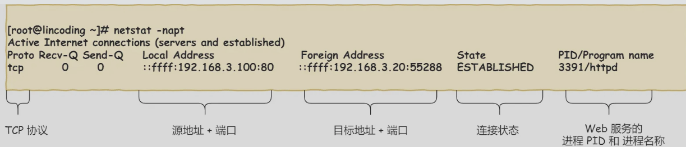

后续计算RTO，R2为后续测量的RTT

SRTT是计算平滑的RTT，DevRTR是计算平滑的RTT与新RTT的差距，Linux 下，**α = 0.125，β = 0.25， μ = 1，∂ = 4**

每次超时重传，下次超时间隔翻倍

**快速重传**

收到失序报文时立即发出重复确认（不需要等到之间发送数据时才捎带确认），发送方只要一连收到三个重复确认就应当立即重传（不必继续等待为其设置的重传计时器到期）
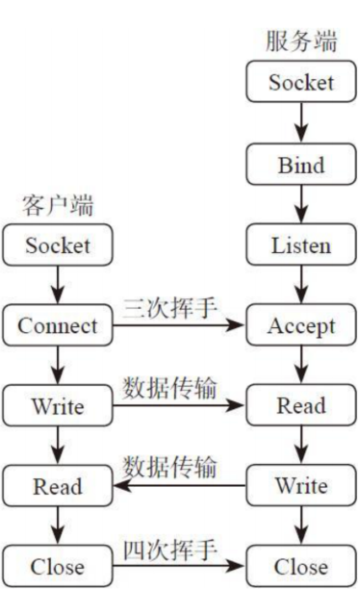

重传时不确定要从M2开始全部重传还是只传M2

#### 对于丢包的发送

**回退N帧：**即收到一个包丢失的消息后，重传这个包以后的所有包

**选择重传（**SACK方法-选择性确认）：

linux需要双方打开SACK选项，net.ipv4.tcp_sack（默认开启）

在TCP头部加SACK字段，可以将已收到的数据信息发给发送方，从而知道哪些数据丢失哪些接收了，只传丢失的数据

发送方维持一个窗口包含未被确认的序号、可发送的序号。
接收方维持一个窗口包含可接收的序号

每到达一个帧检测他的序号是否落在窗口内，如果落在窗口内且没有接收过，则接收并返回确认，等前面的帧都到达则交付给上层

发送端每个发送缓存都有一个超时计时器

问题：

如上情况收到0号数据时不能确认是前一组还是后一组的0（前一组发送方没有收到ACK而重发）

解决：

对于帧序号n，将发送窗口大小=接收窗口大小=2^（n-1）

即，对于帧序号7，发送窗口大小=4=接收窗口大小

> TCP协议中的16位窗口大小就是为窗口协议提供支持的。UDP协议的目标是尽最大努力交付，不管你收到没有，所以没有该字段

> UDP协议每次传输的最大数据量并不是2^16 - 1 - 8 - 20（8表示UDP头长，20表示IP头长），而是与MTU有关，即数据链路层的最大传输单元(Maximum Transmission Unit)，值是1500。

#### Duplicate SACK(D-SACK)

使用SACK告诉发送方哪些数据被重复接收了

- 当包1接收后，ack丢失了，发送方重发，接收方回的ack带sack信息告诉发送方这个包已经被接收了
- 当数据包1发送遇到网络延迟，发送方因快重传重发并接收这个包，后数据包1到达了，发送方发ack带者D-SACK信息，表示收到了重复的包

这样做可以有几个好处

- 让发送方知道是发出的包丢失了还是接收方回应的ACK丢了
- 让发送方知道是不是发送的包被网络延迟了
- 是不是网络中把发送方的数据包给复制了

linux下net.ipv4.tcp_dsack参数控制这个功能（默认开）

### 如何处理网络拥塞

窗口协议，流量控制是对接收方的能力控制，网络拥塞是对整个网络能力的控制

拥塞窗口cwnd，是发送方维护的一个状态变量，根据网络的拥塞程度动态变化，发送窗口的值=min（拥塞窗口，接收窗口）

基本规则：只要网络没有出现拥塞（发送方在规定时间内接收到ACK应答报文），cwnd增大，出现拥塞（发生了超时重传），cwnd减少

拥塞控制主要是四个算法：慢启动、拥塞避免、拥塞发生、快速恢复

慢启动门限ssthresh是一个阈值，通常为65535（2^16）

**慢启动：**是在刚开始发送数据时让窗口缓慢扩张（将初始的cwnd置1个MSS，然后以2倍的速度指数增长

**拥塞避免**：到ssthresh时执行拥塞避免，即+1线性增长

**拥塞发生：**

如果是**超时重传的重传机制**则直接恢复到慢启动，从1开始，并降低慢启动门限为cwnd的一半

AIMD算法：乘法减小（慢开始和拥塞避免阶段，出现超时就把开始门限ssthresh的值减半），加法增大（执行拥塞避免算法后，使拥塞窗口缓慢增大 ）

**快恢复**（退半避让）： （与快重传同时使用，能收到3个重复ack说明网络还行）它允许发送方在接收到丢失数据包的部分确认（ACK包）后，把拥塞窗口cwnd设置为慢开始门限ssthresh减半后的值，然后执行拥塞避免算法（加法增大）
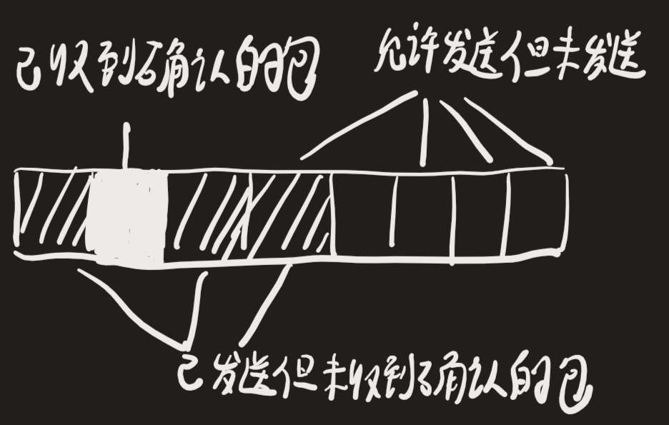

1. 在快恢复中，首先ssthresh = cwnd/2,cwnd = ssthresh+3，这是为了减少cwnd避免拥塞，
2. 随后继续重传丢失的数据包，如果再收到重复的ACK，cwnd+1，这是为了尽快将丢失的数据包发给目标
3. 知道收到新数据的ACK，把cwnd设置为第一步的ssthresh的值，恢复guo'c

当采用快恢复时，慢开始只在TCP连接建立和网络超时时才使用

### 如何连续发送大量数据-滑动窗口

传统TCP每发送一个数据进行一次确认应答，效率较低，往返时间长

概念：

- 发送方和接收方之间各自维持一个滑动窗口（大小不一定相同）控制发送和接收方的分组的数量和编号
- 它允许发送方发送多个分组而不需等待确认，TCP的滑动窗口是以字节为单位的
- 每收到一个确认，发送方就把发送窗口向前滑动。

**发送窗口之内：**

如果窗口大小为3，则连续发送3个TCP端

用两个指针SND.UNA、SND.NXT表示发送窗口的起始，和可用窗口的起始，通过SND.UNA+窗口大小得到#4的第一个字节

当发送窗口被#2部分占满时，则无法继续发送数据

收到ack应答后就右移窗口

**接收窗口之内：**
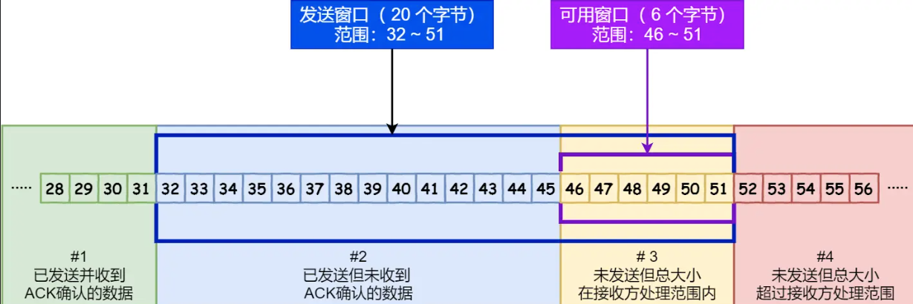

一个指针RCV.NXT表示接收窗口的起始

**@窗口大小由哪一方决定**

通常由接收方的窗口大小来决定，TCP里的window字段表示窗口大小，建立连接时，发送方根据这个接收端的处理能力来发送数据，通常小于等于接收方的窗口大小

### 流量控制

#### **窗口关闭**

发送方会根据接收方的能力动态控制发送的数据量，即流量控制

通常的消息发送，发送方的窗口会随接收方的窗口大小改变
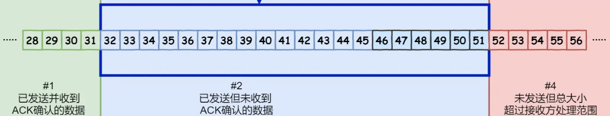

当窗口大小为0时回阻止数据发送，即窗口关闭

TCP发送方收到零窗口通知，就启动持续计时器，持续计时器超时，就会发送窗口探测报文，接收方收到时回返回现在的接收窗口大小

如果接收窗口认为0，则重新启动计时器，窗口探测的次数一般为3次，每次30-60s，超过3次可能会中断连接

#### **操作系统缓冲区和滑动窗口**：

- TCP不允许操作系统即减少缓存又收缩窗口，而是先收缩窗口，过段时间再减少缓存

如果可以同时减少缓存和收缩窗口
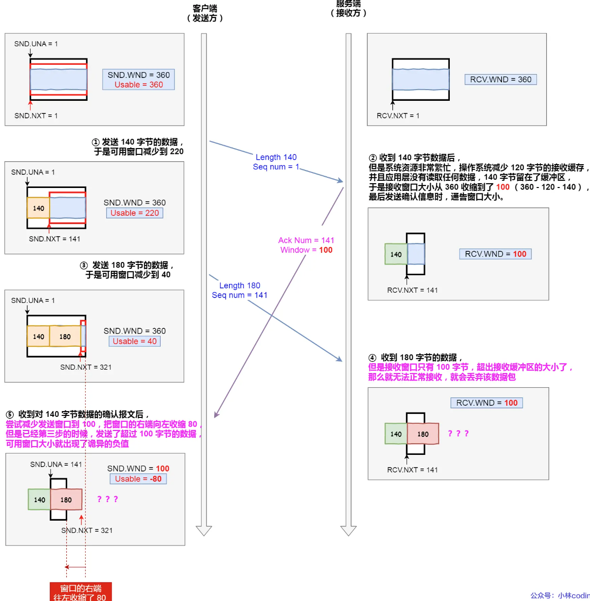

接收方缓存区因操作系统资源紧张而收缩，并且通知发送窗口收缩，而此时已经发送的数据到来时接收方缓冲区因收缩而装不下，无法接收丢弃改包，

发送方收到窗口收缩，这时已经发送的没有收到ack的数据超出了接收窗口的范围

先只收缩窗口不减少缓存，使得接收方在窗口缩小的消息发给对方之前，收到的消息可以在缓存区里接收，并返回给发送方ack

#### 糊涂窗口综合症

如果接收方窗口很小，每次只能腾出几个字节的窗口大小，这时发送方再来为几个字节发送一次太不经济了

解决方式：

对于接收方：当窗口大小<min（MSS, 缓存空间/2），向发送方通知窗口为0，即阻止请求发过来

对于发送方：Nagle算法，满足下面两个的条件的一个才能发送数据：

- 可用窗口大小>=MSS && 可发送的数据大小>=MSS, 
- 收到之前发送数据的ack包
- 等待超时，第一个包没到MSS长度，后过了200ms，依然没有新的数据要发，则直接发送
- 包内有FIN

必须要接收方满足【不通告小窗口给对方】和发送方满足【开启Nagle算法】才能避免糊涂窗口

nagle算法默认打开，对于一些需要小数据包交互的场景，如telnet、ssh等需要关闭这个算法

# KCP

发送的数据分为：

- 正常数据（ICKP_CMD_PUSH）
- 确认应答(ICKP_CMD_ACK)
- 窗口探测(IKCP_CMD_WASK)
- 窗口应答(IKCP_CMD_WINS)

## 数据的发送

数据的发送流程：ikcp_send()、ikcp_update()、ikcp_output()

ikcp_send()：对数据切片，编号+生成包头，加入发送队列snd_queue

ikcp_update()： 确定数据处理的频率，如果提早触发了则延后。即控制ikcp_output()的频率

ikcp_flush()：

1. 先发送**确认应答**：刷新ack列表，套上kcp头后发送出去

2. 再判断窗口大小，如果为0，则发送**窗口探测**

3. 如果有**窗口应答**，则生成ack消息发送

4. 再处理**正常数据**：更新拥塞窗口大小

​	从发送队列snd_queue转移到发送缓存snd_buf，转移量受拥塞窗口影响。并计算重传时间

​	遍历发送缓存snd_buf，对每个数据执行首次发送、超时重传、快重传、不发送

> 发送出去其实就是调ikcp_output()，其中调用上层的回调函数，也就是应用层注册进来的发送函数

## 数据的接收

ikcp_input()：

1. 解析包头验证合法性，

2. 做UNA确认、ACK确认：通过ack计算相关数据，移除发送队列中对应的包

3. 普通数据：判断是否是期望包

   ​					生成数据到acklist里，等待下次调ikcp_flush()时回复ack

   ​					解析数据：

   ​					a. 判断是否在接收窗口内，

   ​					b. 移入接收队列rcv_buf中

   ​					c. 将rcv_buf中合适的包移入rcv_queue（收到连续序号的包）

   应用层调`ikcp_recv（）`取切片组包到上层

   

# BBR拥塞控制算法

原有的问题：tcp基于丢包来判断网络拥塞状态，但现在的网络中丢包不一定表示网络发生了拥塞（可能是被主动抛弃的）

BBR算法通过观察发送数据包的**出队情况和确认接收ACK的延迟时间**，估算网络的瓶颈带宽，找到最大带宽和最小延时，得到网络链路中可以存放数据的最大容量，设置cwnd。

从而充分利用带宽资源。测量RTT调整发送速率，最小化网络延迟

bbr只需在发送段配置

# DPDK

传统数据包先到内核再到用户层，DPDK在用户层模拟了网卡驱动，绕过内核处理。本质是网络驱动程序和库

实现上，使用轮询+零拷贝，避免了系统调用和中断的开销，需要cpu单独分配核

缺点：

如果DPDK出问题，那么内核看不到这个网卡

DPDK支持的网卡没有内核全

轮询的实现方式，使得一个核一定是100%CPU。因此只适用于大量网络数据传输

# XDP

本质上是封装了ebpf，从而绕过tcp/ip协议栈同时复用内核基础设置。

可以在cpu来处理的最早时间执行xdp程序，可以用于ddos防御，防火墙，负载均衡

优：

可以更早的接触到包，从而提前选择丢弃。不需要像原来一样内核处理完了，到用户态才决定丢弃这个包

比起DPDK，无需独占CPU，linux支持的网卡它就能支持。动态挂载，服务不中断就能动态加载

