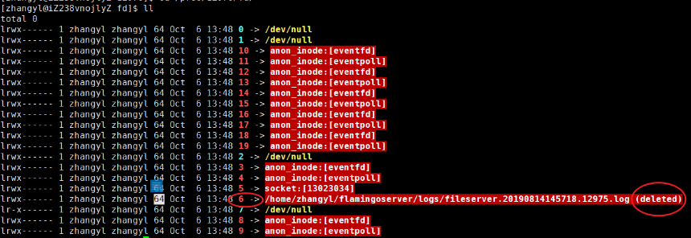

# ifconfig 查看网络

查看网卡和ip地址信息

```shell
ifconfig -s       # 显示精简的已激活的网卡列表，要包含未激活的需要加上-a命令
ifconfig 网卡名 up # 激活网卡
ifconfig 网卡名 down # 禁用网卡
```


改变网卡绑定的IP地址：

```shell
# 将指定ip地址绑定到某个网卡
ifconfig 网卡名 add ip地址
# 从某个网卡解绑指定ip地址
ifconfig 网卡名 del ip地址
```

# ping 查看网络

# telnet 查看服务器状态

检测指定IP：port是否存在监听服务，从而判断服务器是否在工作

`telnet www.baidu.com 80`//指定地址和端口号  连接对方服务器

连接后，对于能接收纯文本数据的服务器可以作交互

**从客户端角度判断向服务端的请求问题：**

1. ping，判断网络是否可达
2. telnet，判断服务器状态，是否被服务器接收了

# netstat 查看网络连接状态

查看当前网络连接的状态

```shell
-a (all)显示所有选项，netstat 默认不显示 LISTEN 相关。
-t (tcp)仅显示 tcp 相关选项
-u (udp)仅显示 udp 相关选项
-n 不显示别名，能显示数字的全部转化成数字
-l 仅列出有在 Listen (监听) 的服務状态
-p 显示建立相关链接的程序名
-r 显示路由信息，路由表
-e 显示扩展信息，例如uid等
-s 按各个协议进行统计 (重要)
-c 每隔一个固定时间，执行该 netstat 命令。
```

如果要查看历史连接状态可以在`/var/log/syslog`查看日志，或者用`tcpdump`命令来抓包

# lsof 查看文件资源

列出各个进程打开的文件描述符，只显示当前用户有权限能看到的进程fd信息

`lsof -p 进程号查看`指定进程打开的fd信息

```shell
+c 16 # 只显示进程名前16个字符
-i # 显示系统的网络socket信息
-nP # 不显示别名，显示IP(n)和端口号(P)
```

**恢复被进程持有但被删除的文件**：

```shell
lsof | grep fileserve # 查看这个文件被哪个PID持有
cd /proc/pid/fd/ # 进入对应进程的pid里找到这个文件
cat 这个文件描述符 > /home/恢复到的文件路径 # 移动文件
# 注意只有进程在存活状态才能通过这样的方式恢复
# 恢复后这个文件的状态仍然是deleted状态
```


# nc（netcat）模拟客户服务端

模拟一个服务器被其他客户端连接，或模拟一个客户端连接服务器

开发服务器又不想开发对端时可以用nc模拟

```shell
# 模拟一个服务器程序
nc -l -v 127.0.0.1 5000 # -l表示listen，-v表示显示更详细的信息
# 模拟一个客户端程序
nc -v www.baidu.com 80 # 模拟客户端区连接百度web服务器
	- p # 指定客户端以哪个端口去连服务器
```

```shell
# 例子模拟客户端服务端对话
# 服务器
nc -l -v 127.0.0.1 5000
# 客户端
nc -v -p 7878 127.0.0.1 5000

# 连接建立，两边可以发送消息对话
```

```shell
# 例子客户端服务端文件接发
nc -l ip地址 端口号 > 接收的文件名
nc ip地址 端口号 < 发送的文件名
```


# curl 模拟http请求

```shell
curl http://www.baidu.com > index.html # 默认以get方式请求数据，并写入到文件内
curl -X GET http://www.baidu.com/index.php?s=9 # 显示的以get方式请求数据
curl -X POST -d 'somepostdata' 'https://www.somesite.com/api/v1/chat' # 向网站请求somepostdata这个数据（必须有）
curl -X POST -H 'Content-Type: application/x-www-form-urlencoded' 
			-H 'Accept: application/json' 
			-H 'X-Requested-With: XMLHttpRequest' 
			-d 'somepostdata' 'https://www.somesite.com/api/v1/chat' # -H发送请求时增加头部信息
curl -i http://www.baidu.com/ # 使得应答结果包含http头部信息


```

# tcpdump 抓包工具

`tcpdump -vvv -i any 'tcp port 8888' `# 仅显示端口是 tcp:8888 上的数据包

```shell
tcpdump -i ens33 # 抓取网卡ens33上的包
tcpdump -i any # 抓取网卡ens33上的包
		-X  # 	以 ASCII 和十六进制的形式输出捕获的数据包内容
		
		-n # 不要将 ip 地址显示成别名的形式
		-nn # 不要将 ip 地址和端口以别名的形式显示
		
		-S # 以绝对值显示包的 ISN 号
		
		-vv # 显示详细的抓包数据；
		-vvv # 显示更详细的抓包数据。
		
		-w # 将抓取的包的原始信息（不解析，也不输出）写入文件中
		-r # 从利用 -w 选项保存的包文件中读取数据包信息。
		
		-c 5 # 限制抓包的个数
tcpdump -i any 'tcp src port 8888' # 仅显示源端口是 tcp:8888 上的数据包
tcpdump -i any 'tcp src port 8888 or udp dst port 9999' # 仅显示源端口是 tcp:8888 或目标端口是 udp:9999 的包 
```


## TCP抓包实例

发送包：ping [-I 指定网口] [-c 发送几个包]  IP地址

`ping -I eth1 -c 3 192.168.1.3`

抓包：`tcpdump -i eth1 icmp and host 192.168.1.3 -nn` 

tcpdump抓包显示信息：


## 抓包-百度为例

开启抓包：`tcpdump tcp and host 220.181.38.148 -w http.pcap`

发起请求：`curl -v http://220.181.38.148`

windows下用wireshark工具查看，报文如下


- 三次tcp握手

- get请求，ack回复

- get请求的回复，ack回复

- 4次挥手

共计11个包

# sar 网络流量监控

**安装：**

```shell
vim /etc/default/sysstat # 将flase改为true
service sysstat restart # 重启服务
```

`sar -n DEV 1` # 显示网口的统计，每隔一秒输出


# wireshark

