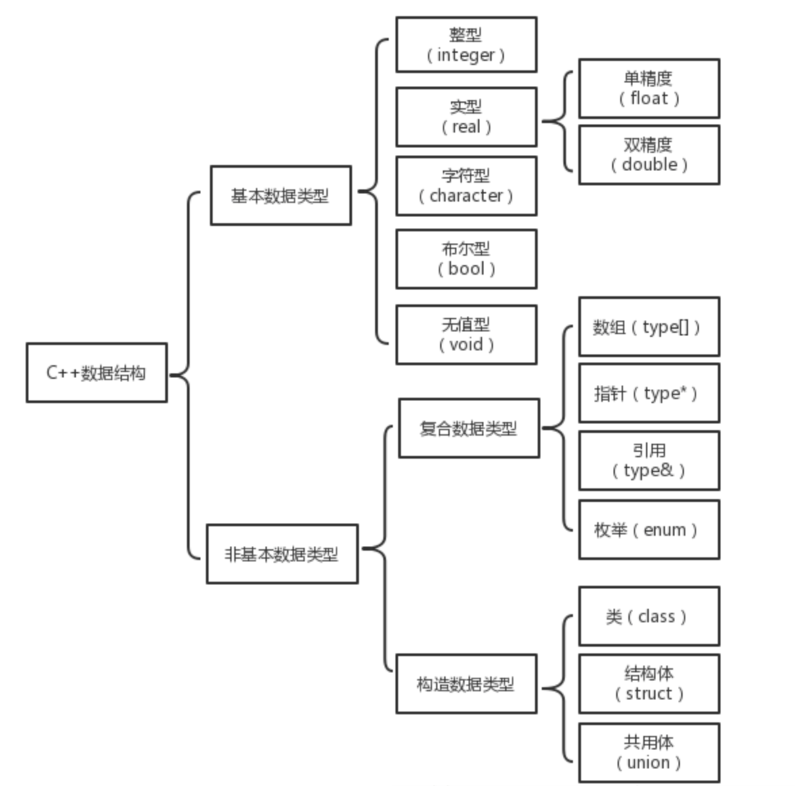

# 作用域和生命周期

Owner: -QVQ-

**作用域：**在源文件中该标识符能够独立地合法出现的区域

**生命周期：**是一个运行时概念，它是指一个变量在整个程序从载入到结束运行的过程中存在的时间周期

**作用域的级别**由高到低，主要有文件域（全局作用域）、名字空间域、类域、函数作用域和代码块作用域，其中函数作用域+代码块作用域=局部域。

## **函数的作用域**

函数分为类的成员函数和全局函数。

**类的成员函数：**

- 作用域：类域。
- 生命周期：无（程序运行期一直存在）。
- 引用方法：其他文件中要使用点操作符（.）或指针操作符（->）或作用域运算符（::）来引用。
- 内存分布：代码区。

注意：类成员函数可以定义在类体内，即定义在头文件，当类被不同源文件包含时不会报重定义的错误，因为类体内实现的函数具有inline特性

**全局函数：**

- 作用域：文件域。
- 生命周期：无（程序运行期一直存在）。
- 引用方法：其他文件中要使用要先进行函数原型声明
- 内存分布：代码区。

注意：如果在两个源文件中定义了同名的全局函数，连接时会出现重定义错误

## 数据类型的作用域

### 基本数据类型和复合数据类型

- 作用域：文件域。
- 生命周期：无（程序运行期一直存在）。
- 引用方法：无需申明，直接使用
- 内存分布：代码区。

### 构造数据类型

- 作用域：类型定义所在域。
- 生命周期：无（程序运行期一直存在）。
- 引用方法：通过作用域运算符进行定义
- 内存分布：代码区。

## 变量的作用域和生命周期

**全局变量**

- 作用域：全局作用域（一个文件定义，全文件可用）。
- 生命周期：无（程序运行期一直存在）。
- 引用方法：通过extern关键字声明要引用的全局变量
- 内存分布：全局/静态存储区；

多文件不能定义同名的全局变量，即使文件间没有关联，编译报错

**全局静态变量**

- 作用域：文件作用域
- 生命周期：无（程序运行期一直存在）。
- 内存分布：全局/静态存储区；

包含static、const关键字的定义，文件间没有相互关联，则可以同名

**局部变量**

- 作用域：局部作用域（只在局部作用域中可见，如函数域，代码块域）
- 生命周期：程序运行出局部作用域即被销毁
- 内存分布：栈区

**局部静态变量**

- 作用域：局部作用域
- 生命周期：无（程序运行期一直存在）。
- 内存分布：全局/静态存储区；

static定义