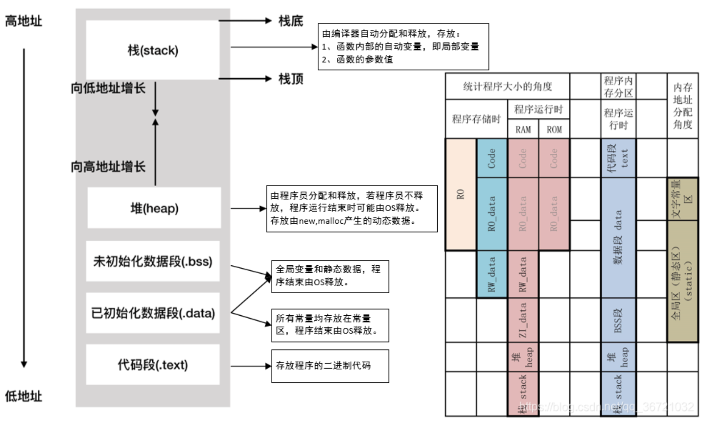

# 内存分配

Owner: -QVQ-

编译器（如Visual Studio和GCC）提供了内存泄露检测功能

内存泄漏工具：Valgrind，会对程序的性能和可靠性有影响，但能快速定位问题

通过systemtap 找到malloc, realloc 返回的地址, 可以通过systemtap 里面的$return 来获得, 并记录, 然后再记录free 的时候是否对这些地址进行过free. 

# 内存分配函数

## allocator分配器（没有存在的必要了）

使用C++的容器时，我们往往需要提供两个参数，一个是容器的类型，另一个是容器的分配器（通常使用C++自带的默认分配器）

`template < class T, class Alloc = allocator<T> > class vector; // generic template`

这个函数现在没有必须存在的必要？

### 意义

如果内存分配和对象构造（在分配的内存上构造对象）不分离可能带来的弊端如下：

① 我们可能会创建一些用不到的对象；

② 效率低下：对象被赋值两次，一次是默认初始化时，一次是赋值时；

③ 没有默认构造函数的类甚至不能动态分配数组；

④内存碎片：由于不同大小的对象混杂在一起，导致内存碎片化，使得内存利用率降低。

new操作将内存分配和对象构造组合在一起，而allocator的意义在于将内存分配和构造分离。这样就可以分配大块内存，而只在真正需要时才执行对象创建操作

我们可以实现自己的allocator，只需实现分配、构造等相关的操作

使用malloc可以避免调用构造函数，但它并不能解决与内存分配和对象构造相关的所有问题。例如，它不能处理对齐要求，并且它不能提供一种为数组分配/释放内存或为没有默认构造函数的对象分配内存的方法。分配器通过将内存分配与对象构造分离提供了更完整的解决方案。

### 使用

```cpp
//分配
allocator<string> alloc; // 构造allocator对象
auto const p = alloc.allocate(n); // 分配n个未初始化的string
//构造
auto q = p;//p的位置相当于begin（），q的位置相当于end()（有元素的后一位）
alloc.construct(q++, "hello"); // 在分配的内存处创建对象
alloc.construct(q++, 10, 'c');
//调用
for (auto it = p; it != q; it++) {
        cout << *it << endl;//输出hello   ccccccccccc
}
//销毁
while(q != p)
    alloc.destroy(--q);
//释放
alloc.deallocate(p, n);
//传递给deallocate的指针不能为空，且必须指向由allocate分配的内存，并保证大小参数一致。
```

### 拷贝和填充

```cpp
uninitialized_copy(b, e, b2)
// 从迭代器b, e 中的元素拷贝到b2指定的未构造的原始内存中；

uninitialized_copy(b, n, b2)
// 从迭代器b指向的元素开始，拷贝n个元素到b2开始的内存中；

uninitialized_fill(b, e, t)
// 从迭代器b和e指定的原始内存范围中创建对象，对象的值均为t的拷贝；

uninitialized_fill_n(b, n, t)
// 从迭代器b指向的内存地址开始创建n个对象；
```

### 缺点

stl的allocator在商业引擎中使用较少，其无法满足一些客制化需求：

① allocator内存对齐无法控制

② allocator难以应用内存池之类的优化机制

③ 绑定模板签名

### 内存分配和管理机制的原则

① 尽可能减少内存碎片，提高内存利用率

② 尽可能提高内存的访问局部性

③ 设计在不同场合上适用的内存分配器

④ 考虑到内存对齐

## new的语法

`::(optional) new (placement_params)(optional)  type ( initialize)r(optional)`

● 一般表达式

`p_var = new type(initializer); // p_var = new type{initializer};`

● 对象数组表达式

`p_var = new type[size]; // 分配
delete[] p_var; // 释放`

● 二维数组表达式

`auto p = new double[2][2];
auto p = new double[2][2]{ {1.0,2.0},{3.0,4.0} };`

● 不抛出异常的表达式

`new (nothrow) Type (optional-initializer-expression-list)`

> 不抛出异常和指定地址并不能同时用
> 

默认情况下，如果内存分配失败，new运算符会选择抛出std::bad_alloc异常，如果加入nothrow，则不抛出异常，而是返回nullptr

> 过去new失败返回NULL，现在抛出异常
> 

● 占位符类型

我们可以使用placeholder type（如auto/decltype）指定类型：

`auto p = new auto('c');`

● 带位置的表达式（`placement_params`）

可以指定在哪块内存上构造类型。它的意义在于我们可以利用placement new将内存**分配**和**构造**这两个模块分离

> 比如当我们想要编写内存池的代码时，可以预申请一块内存，然后通过placement new申请对象，一方面可以避免频繁调用系统new/delete带来的开销，另一方面可以自己控制内存的分配和释放
> 

预先分配的缓冲区可以是堆或者栈上的，一般按字节(char)类型来分配，原因：

① 方便控制分配的内存大小（通过sizeof计算即可）

② 自定义类型，会调用对应的构造函数。我们实际上是不期望它做任何构造操作的，而且对于没有默认构造函数的自定义类型，我们是无法预分配缓冲区的。

**用new将分配和初始化分开（利用new分配没有无参构造函数的类的数组）：**

```cpp
//利用栈空间，指定位置构造
class A{
private:
	 int data;
public:
	 A(int indata)  : data(indata) { }
	 void print(){
		  cout << data << endl;
	 }
};
int main(){
	 const int size = 10;
	 char buf[size * sizeof(A)]; // 内存预分配，为char类型
	 for (size_t i = 0; i < size; i++){
		  new (buf + i * sizeof(A)) A(i); // 指定位置的构造
	 }
	 A* arr = (A*)buf;
	 for (size_t i = 0; i < size; i++){
		  arr[i].print();
		  arr[i].~A(); // 手动调用对象析构
	 }
 // 栈上预分配的内存自动释放
 // 不能调用delete释放
 return 0;
}
```

new地址指定地址分配需要注意几点：

new不负责检查地址的正确性，因此可以重复分配

如果超出指定的已经建好的栈区的，则需要重新分配

```cpp
#include<iostream>
#include<new>
const int BUF = 512;
const int N = 5;
char buffer[BUF];
using namespace std;
int main() {
	int i;
	double* pd1 = new (buffer)double[N];
	double* pd2 = new (buffer)double[N];//可以重复分配
	//delete pd2;//error
	double* pd3 = new (buffer + N * sizeof(double))double[N];//超出范围的分配,注意这个地址是栈区
	//delete pd3; //error
}
```

new的定址分配只是返回那个地址并强制转换指针类型

●new的重载

①编写重载的operator new，这意味着我们的参数需要和全局operator new有差异。

② 重定义operator new，根据名字查找规则，会优先在申请内存的数据内部/数据定义处查找new运算符，未找到才会调用全局::operator new()。

**通常new是低效的：**

new作为一个通用接口，需要处理任意时间、任意位置申请任意大小内存的请求，它在设计上就无法兼顾一些特殊场景的优化，在管理上也会带来一定开销。

申请内存作为系统调用会从用户模式切换到内核模式

分配可能是带锁的。这意味着分配难以并行化

**尽量使用new[]而不是new**

一个类不同的构造函数用统一的析构函数时，new[]更通用

```cpp
char* p1 = new char;
char* p2 = new char[1];//这两种分配方式效果一样，但这种更通用

delete[] p1;//error
delete[] p2;//正确
```

## malloc

`void *malloc( unsigned int num_bytes)`

## **calloc**

`void *calloc( unsigned int num, unsigned int size)`

分配num个长度为size的块，初始化为0

## malloc/free和new/delete区别

1. **返回类型安全性：**new返回类型严格和对象匹配，申请需要指定类型
    
    **内存大小：**一个要显示指出一个不用
    
2. **重载**：new可以、malloc不能
3. new可以**指定地址分配**
4. **内存分配失败：**malloc返回NULL，new不返回抛出异常（可以执行用户指定的错误处理函数）
5. **数组分配：**new提供了对数组的操作
6. **构造调用：**malloc无法调用构造和析构函数

1. **申请的内存所在位置：**molloc是堆，new是自由存储区（凡是通过new操作符进行内存申请，该内存即为自由存储区）
2. **相互调用**：new基于malloc、malloc不能调用new

`auto it = new (0x777)(nothrow) stu[1](a,b);`//实际上nothrow不能和指定地址同时使用

`stu* it = (stu*) malloc(sizeof(stu));` 

## strdup

`#include <string.h>`
`char *strdup(const char *s);`

字符串拷贝函数，一般和free成对出现

拷贝字符串s，内部调用malloc分配内存，返回指向复制字符串分配的空间，分配失败返回NULL

# 内存初始化

`void *memset(void *str, int c, size_t n)`

向str（已分配好）填充n个c进入

填充c时用的是该值的无符号字符形式。

`void *memcpy(void *str1, const void *str2, size_t n)`

从存储区 str2 复制 n 个字节到存储区 str1（类型强制转换为 void*）。

`void *memmove(void *dest, const void *src, size_t n)`

如果复制的两个区域存在重叠就不能用上面那个函数（结果未知），这个函数会做检查，其他功能和上面函数一样

# 内存模型

描述多线程编程中对共享内存访问的顺序，在单线程情况下CPU指令的指令重排

强顺序模型（X86），内存有全局顺序，接近程序顺序的顺序模型

弱内存模型（ARMv8），CPU不保证顺序，程序员插入内存屏障指令来强化这个可见性

## 内存次序memory order

1. 内存系统coherence，定义了一个读操作能获得什么样的值
    
    满足以下三个条件的内存系统是coherent
    
    - 对于地址X，处理器P写了A，没有其他处理器写X，P能读到A
    - 对于地址X，处理器P1写了A，没有其他处理器写入，长时间后，处理器P2能读到（写结果能对其他处理器可见）
    - 写操作串行，1写入，在写入2，则不能先读2，再读1（如果没有这个条件将引发错误）
2. 内存系统consistency，定义了何时一个写操作的值会被读操作获得

（1）**sequential consistency model**

直观上，读操作应该返回“最后”一次写入的值。

- 在单处理器系统中，“最后”由程序次序定义。
- 在多处理器系统中，我们称之为顺序连贯(sequential consistency, SC).

**SC有两点要求**：

1. 单个处理器内应该遵循程序次序；
2. 在所有处理器的视角里，程序执行次序应该是一样的，不能P1看来执行次序为 W1->W2，P2 看来，执行次序却为 W2->W1。

> 且P1写了1，P2做了其他事，P3应该知道P1写了1
> 

**无缓存体系下实现SC**

处理器的下一次内存操作要在上一次内存操作前完成

**有缓存体系下实现SC**

检查写完成：

- P1 先完成了 Data 在内存上的写操作；
- P1 没有等待 Data 的写结果传播到 P2 的缓存中,继续进行 Head 的写操作；
- P2 读取到了内存中 Head 的新值；
- P2 继续执行，读到了缓存中 Data 的旧值。

因此需要延后每个处理器发布写确认通知的事件

维护写原子性：

针对同一地址的写操作被串行化(serialized).

对一个新写的值的读操作，必须要等待所有（别的）缓存对该写操作都返回确认通知后才进行

（2）relaxed consistency model

为了获得更好的性能引入，对于不同地址的操作对在缓存体系结构下，允许读操作在一个写操作未对所有处理器可见前返回值

## **C++11的内存次序**

**sequenced-before关系：**

同一线程中，A的执行顺序在B前面，则A sequenced-before B 。其他程序的视角也是如此

**Carries dependency**

同一个线程内，A sequenced-before B，且B受A的影响

**Happens-before 关系**

多线程中，A的内存状态在B执行前可见，包含了inter-thread happens before和synchronizes-with两种关系。

**Synchronized-with 关系：**

A的执行结果对B可见，且A操作的执行顺序在B操作之前，A `synchronizes-with` B

**Inter-thread happens-before 关系**

A线程中的操作A `happens-before` B线程中的操作B。

# 内存分配失败

有两种方式，异常处理和信号处理，通常异常处理用于同步处理，信号处理用于异步处理

## 异常处理

### 语法规则

- throw
    - 用于标记可能抛出的异常的操作
    - 当异常条件被触发时，程序会抛出(throw)一个异常，由catch捕获相应的异常，程序跳转到catch块定义的异常处理代码

```cpp
void test1() throw();//表示这函数不会触发异常
std::operator new(std::size_t size) throw(std::bad_alloc);//表示这个函数会抛出bad_alloc异常

throw "Division by zero condition";//抛出异常为字符串"Division by zero condition"
```

- try
    - 用于监测某个操作是否抛出异常
- catch
    - 用于定义处理其前try块可能抛出的异常的代码

### 实际操作

对于一般的写法，捕捉抛出的异常

```cpp
//
try {
    int*p = new int(5); //首先执行try的代码，如果没有异常不执行catch里面的语句
}
catch(const bad_alloc& e) {//异常类型
    return -1;//异常处理
}
...
catch(……) {//catch可以有多个，但至少要有一个
    ……;//能狗捕获任何类型的异常
}

//自定义异常抛出的字符串并捕获处理
try {
		if (1) {
			throw "hello";
		}else {
			throw "world";
		}
}
catch (const char* a) {
		if (strcmp(a, "hello") == 0) {
			cout << "hell" << endl;
		}
		else if (strcmp(a, "world") == 0) {
			cout << "wor" << endl;
		}
		else {
			cout << "ddddddddd" << endl;
		}
}
```

对于整个程序如果要注册统一的异常处理函数，以new函数为例：

```cpp
/*
* typedef void (*new_handler)();//定义一个函数指针类型
* new_handler set_new_handler(new_handler p) throw();//异常处理接口
*/
void noMemoryToAlloc(){//被下面的new函数触发
	std::abort();
}

int main(){
	set_new_handler(noMemoryToAlloc);//将异常处理的接口注册进去
	int *pArray = new int[100000000000];//new触发了异常信号
}
```

更近一步，如果我们希望new无法分配空间时，内存分配函数能不断调用分配函数直到分配到为止

```cpp
void *operator new(std::size_t size) throw(std::bad_alloc){
	if ( size==0 ) {
		size = 1;
	}
	while (true) {
		调用malloc等内存分配函数来尝试分配size大小的内存；
		if(分配成功)
			return 指向分配得来的内存指针；
		else{
			new_handler globalHandler = set_new_handler(0);//
			set_new_handle(globalHandler);//看不懂
			
			if(globalHandler)(*globalHandler)();///看不懂
			else throw std::bad_alloc();//没有所需内存，抛出异常
		}
	}
}
```

对每个类设置不同的异常处理函数

```cpp
#include <iostream>
using namespace std;

/*…………通用业务部分代码…………*/
/*模板父类的工具类，用于保存之前的异常处理函数*/
class NewHandlerHolder {
public:
    explicit NewHandlerHolder(std::new_handler nh) : handler(nh) {//保存之前的异常处理函数

    }
    ~NewHandlerHolder() {//析构时还原异常处理函数
        std::set_new_handler(handler); 
    }
private:
    std::new_handler handler;
    NewHandlerHolder(const NewHandlerHolder&);     // 禁用拷贝构造函数
    const NewHandlerHolder& operator=(const NewHandlerHolder&); // 禁用赋值运算符
};

```

```cpp

/*…………通用业务部分代码…………*/
/*模板父类，之所以用模板是为了对每个不同的类用不同的实例*/
template<typename T>
class NewHandlerSupport {
public:
    static std::new_handler set_new_handler(std::new_handler p) throw();
    static void* operator new(std::size_t size) throw(std::bad_alloc);
private:
    static std::new_handler current;
};

template<typename T>
std::new_handler NewHandlerSupport<T>::current = 0;

//设置和存储异常处理函数
template<typename T>
std::new_handler NewHandlerSupport<T>::set_new_handler(std::new_handler p) throw() {
    std::new_handler old = current;
    current = p;
    return old;
}

//重载new分配函数
template<typename T>
void* NewHandlerSupport<T>::operator new(std::size_t size) throw(std::bad_alloc) {
    NewHandlerHolder h(std::set_new_handler(current));//设置当前类的异常处理函数
    return ::operator new(size);//分配结束后还原异常处理函数
}

```

```cpp

/*…………实际业务部分代码…………*/
/*具体类*/
class Widget : public NewHandlerSupport<Widget> {
public:
    Widget() {
    }
private:
};

/*异常处理函数*/
void outOfMem() {
}
```

```cpp
/*主函数*/
int main() {
    Widget::set_new_handler(outOfMem);

    Widget* p1 = new Widget;    // 如果失败，将会调用outOfMem
    //string* ps = new string;    // 如果失败，将会调用全局的 new-handling function，当然如果没有的话就没有了
    //Widget::set_new_handler(0); // 把Widget的异常处理函数设为空
    //Widget* p2 = new Widget;    // 如果失败，立即抛出异常

}

```

文字版：

用父类注册异常处理函数，子类的业务函数里需要先调一次父类的异常切换函数，其中实现保存当前的异常处理函数，并将当前全局的异常处理函数切换为这个类的异常处理函数，子类的业务函数执行完后，自动启用保存的异常处理函数。从而实现不同类使用不同的异常处理函数

如果是new函数的话，父类重载new函数，其中先执行切换异常函数，再分配空间，不管分配成功没都切换异常函数（通过一个工具类的构造和析构函数实现），如果有异常执行异常处理函数

# 内存释放

对空指针调用delete并不会报错，因为内部做了检测，这是为了避免编程时每次释放空间时要判断是不是空指针

```cpp

int* p= new int;
delete p;
p = nullptr;
delete p;//并不会报错
```

# C++内存管理

## 内存组成

- **栈区（stack）**：由编译器自动分配与释放，存放为运行时函数分配的局部变量、函数参数、返回数据、返回地址等。其操作类似于数据结构中的栈。
- **堆区（heap）**：一般由程序员自动分配，如果程序员没有释放，程序结束时可能有OS回收。其分配类似于链表。
- **全局/静态区（static）**：存放全局变量、静态数据、常量。程序结束后由系统释放。全局区分为已初始化全局区（data）和未初始化全局区（bss），处于BSS段的变量的值默认为0。
- **常量区（文字常量区）**：存放常量字符串，程序结束后有系统释放。
- **代码区**：存放函数体（类成员函数和全局区）的二进制代码


**Code**： 即代码域，它指的是编译器生成的机器指令。

**RO_data**： ReadOnly data，即**只读数据域**，它指程序中用到的只读数据，全局变量

**RW_data：** ReadWrite data，即**可读写数据域**，它**指初始化为“非0值”的可读写数据**，程序刚运行时，这些数据具有非0的初始值，且运行的时候它们会常驻在RAM区，因而应用程序可以修改其内容。例如全局变量或者静态变量，且定义时赋予“非0值”给该变量进行初始化。

**ZI_data：** ZeroInitialie data，即0初始化数据，它指**初始化为“0值”的可读写数据域**，它与RW_data的区别是程序刚运行时这些数据初始值全都为0，而后续运行过程与RW-data的性质一样，它们也常驻在RAM区，因而应用程序可以更改其内容。包括未初始化的全局变量，和初始化为0的全局变量。

**RO**： 只读区域，包括RO_data和code。

## 堆与栈的区别

1. **管理方式不同：**堆手动分配，栈编译器自动管理
2. **空间大小不同：**栈的空间远小于堆
3. **产生碎片**：堆的连续是否分配导致大量内存碎片，降低效率。栈是栈结构，不会有数据从栈中间弹出
4. **生长方向不同**：栈位于高地址，向低地址扩展，堆相反
5. **分配方式不同：**堆都是动态分配的，栈有静态分配和动态分配
6. **分配效率不同：**底层分配专门的寄存器存放栈的地址，栈效率更高。堆的分配是C库提供的，机制复杂

## 内存泄漏

通常的，指用new或malloc申请的堆空间，但没有释放，使得这块内存就不能被再次使用了

广义的说，还包含系统资源的泄漏(resource leak)，比如核心态HANDLE，GDI Object，SOCKET， Interface等，

## 内存溢出

指程序在申请内存时，没有足够的内存空间供其使用

- 缓冲区溢出（栈溢出），如果向缓冲区中写入缓冲区无法容纳的数据，造成缓冲区以外的存储单元被改写，称为缓冲区溢出
- 栈溢出是缓冲区溢出的一种，原理也是相同的。分为上溢出和下溢出。
    - 其中，上溢出是指栈满而又向其增加新的数据，导致数据溢出；
    - 下溢出是指空栈而又进行删除操作等，导致空间溢出

堆栈溢出原因：

- 内存泄漏/没有回收垃圾资源，导致存储空间垃圾太多，内存已满。
- 没有设置合理的停止条件，递归调用次数太多，重复调用自己导致内存不

## 内存越界

- 读越界，即读了不属于自己的数据。如果所读的内存地址是无效的，程序立刻崩溃；如果所读内存地址是有效的，在读的时候不会马上出现问题，但由于读到的数据是随机的，因此它会造成不可预料的后果。
- 写越界，又称为缓冲区溢出，所写入的数据对别的程序来说是随机的，它也会造成不可预料的后果。

## 内存碎片

- 内部碎片：系统分配的内存大于实际所需的内存（由于对齐机制）；
- 外部碎片：不断分配回收不同大小的内存，由于内存分布散乱，较大内存无法分配

## 继承类布局

**继承**

如果一个类继承自另一个类，那么它自身的数据位于父类之后。

**含虚函数的类**

如果当前类包含虚函数，则会在类的最前端占用4个字节，用于存储虚表指针（vpointer)，它指向一个虚函数表（vtable)。

vtable中包含当前类的所有虚函数指针。

## 内存对齐

### alignas

用于指定对齐量。

可以应用于类/结构体/union/枚举的声明/定义；非位域的成员变量的定义；变量的定义（除了函数参数或异常捕获的参数）；

alignas会对对齐量做检查，对齐量不能小于默认对齐

例子

```cpp
// every object of type sse_t will be aligned to 16-byte boundary
struct alignas(16) sse_t
{
    float sse_data[4];
};

// the array "cacheline" will be aligned to 128-byte boundary
alignas(128) char cacheline[128];
```

### **alignof operator**

返回类型的std::size_t。如果是引用，则返回引用类型的对齐方式，如果是数组，则返回元素类型的对齐方式。

`alignof(char)   // 1`

`alignof(int*)   // 8`

类似sizeof的使用，可以计算出结构体对齐后的大小