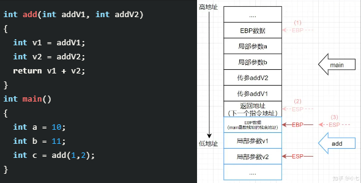
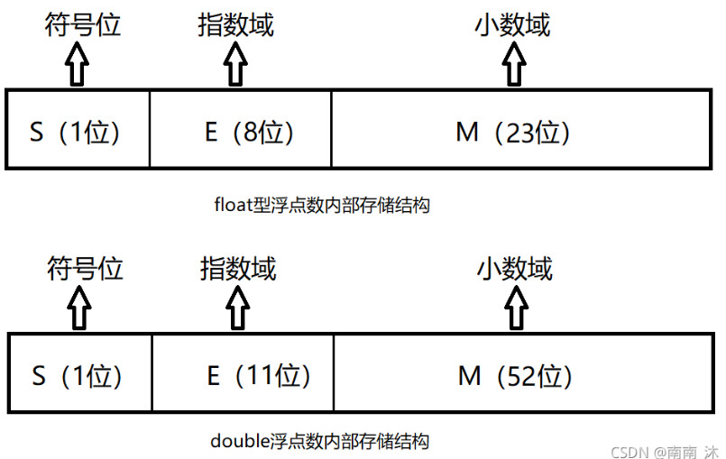
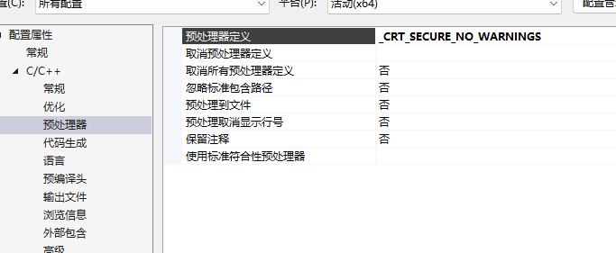

# 基础

Owner: -QVQ-

# 编译过程

预处理：

把#define的宏定义文本替换、忽略注释

#include文件的内容复制到cpp里，.h里如果还有.h文件就递归展开，生成.i文件

编译：

作语法分析，将程序转为特定汇编代码，生成.s文件，可以用文本编辑器查看

汇编：

将汇编代码转为机器码，生成二进制格式，将为每一个源文件产生一个目标文件，生成.o文件

链接：

将所有二进制形式的目标文件.o和系统组件组合成一个可执行文件

# 函数

## 函数调用栈

每个未完成运行的函数占用一个独立连续的区域，栈帧。函数返回时栈帧弹出。

栈帧结构：存放函数参数、局部变量、边界由栈帧**基地址指针EBP**（固定）和**堆栈指针ESP**（随数据入栈和出栈移动）表示、**指令寄存器EIP**（指向下一条待执行的指令地址，每执行一次变化一次）

> 函数中对数据的访问都基于内存偏移
> 

函数调用时的入栈顺序：

1. 主调函数内，**传递的参数**从右往左入栈
2. 主调函数内，**指令指针EIP**入栈（函数返回时需要执行的地方）
3. 被调函数内，主调函数的**基地址指针**EBP入栈，修改被调函数的堆栈指针ESP
4. 通过**移动堆栈指针**ESP加入被调函数的局部变量1-N


函数压栈

编译器给这个函数传递参数时压栈，需要确定压栈顺序（调用约定）

stdcall调用约定（pascal）：

对于函数：`int __stdcall function(int a, int b)`

1. 参数从右往左压栈
2. 函数自身修改堆栈
3. 函数名自动变为`_function@8`，
4. 函数结束后，清理堆栈，恢复堆栈

cdecl调用约定：

对于函数：`int __stdcall function(int a, int b)`

和stdcall不同的是，允许函数的参数不固定，函数不清理堆栈，而是调用者清理堆栈，

## 重载

对于用引用类型的多态

```cpp
void test(int a){//函数1
	cout << "()" << endl;
}
void test(int &a){//函数2
	cout << "f";
}
test(1);//调用函数1
int a = 1;
//test(a);//error,编译器不知道应该调用什么函数
test(move(a));//调用函数2

```

同理大多时候常量不属于多态

```cpp
void stu(const char ch) {
		cout << "const char*" << endl;
	}
void stu(char& ch) {
	cout << "char*" << endl;
}
stu('f');//输出const char*
char ch = 'a';
stu(ch);//error,不能确定调用哪个函数
```

## 函数返回值

函数返回值一般是右值类型，外部可以用右值引用的方式接收

`int&& abc(){}`//可以，但好像没有意义，本来返回值就是右值

```cpp
int abc(){
	int i = 1;
	return i;
}
int a = abc();
int&& b = abc();//都可以，右值引用少次拷贝，小值不影响
```

引用类型的函数返回值则为左值类型，外部可以用引用或非引用的方式接收

```cpp
int& abc(){
	int i = 1;
	return i;
}
int a = abc();
int &a = abc();//都可以，int&的接收少一次拷贝
//函数中定义的类作为返回值以引用方式传给外部有坑不要用
```

const修饰引用的方式返回值不影响外部得到他，const只限制自己，外部得到返回值是拷贝的方式

```cpp
class stu {
public:
	stu() {
		cout << "liang" << endl;
	}
	void abc()  {
		cout << "123" << endl;
	}
};

 const stu& abc() {
	stu s1;
	cout << "........"<<endl;
	return s1;
}//这里const作为引用的方式传递并不影响外部得到的方式,等同于如下操作
  //int a1 = 1;
	//const int& a2 = a1;
	//int a3 = a2;
	//a3 = 2;

int main()
 {	
	stu as = abc();//正确，且只打印一次liang
	as.abc();//丢失const特性
}
```

但如果外部用非常量引用那就会报错，外部用引用接收

```cpp
class stu {
public:
	stu() {
		cout << "liangziosg" << endl;
	}
	void abc() const {
		cout << "123" << endl;
	}
};

 const stu& abc() {
	stu s1;
	cout << "........"<<endl;
	return s1;
}

int main()
 {	
	stu& as = abc();//错误
	as.abc();
}
```

## 不同作用域下的同名变量

用`::name`来访问全局作用域的同名变量

# 数据结构

## size_t

`<stddef.h>, <stdio.h>, <stdlib.h>, <string.h>, <time.h>,<wchar.h>`中都包含其定义

使用size_t可能会提高代码的可移植性、有效性或者可读性

**意义：**在指定分配大小时，对于函数自定义函数的参数选用，对于不需要负数的参数用int可能出现错误，用unsigned int时（int的大小在不同机器上不同， 但int的大小和unsigned int的大小相同）可能大小不够（如果有单个的unsigned long可用的话），使用unsigned long又可能使运行效率降低（一些平台用2个16位来表示一个32位的unsigned long，移动2个16位需要两条指令）

**使用场景：**通常将一些无符号整型定义为size_t，代表了当前平台单个数字的最大位

`size_t n =  sizeof(thing);`

即，使用size_t声明的类型代表了字节大小或数组索引，而不是错误码或算术值

# 其他

### 类、模板、结构体

以下三个不能同名同时存在：

1.`template <long... nums> class abc;// 变长模板的声明`

`template<>class abc<>{};`

2.`class abc{};`

3.`struct abc{};`

## using关键字

C++11通过using指定别名，以下两个语句等价

```cpp
typedefint T;// 用 T 代替 int
using T=int;// 用 T 代替 int
```

在派生类中引用基类

```cpp
class Base{
public:
	void ShowName(){
	}
protected:
	int bValue;
};
class Derived : private Base{
public:
	using Base::bValue;//引用基类成员变量
	using Base::ShowName;//引用基类成员函数
};
```

## 用0x3f3f3f3f表示无穷大

优点：

1. 和0X7fffffff是一个数量级，一般不会有数比它大
2. 无穷大+无穷大也应该是无穷大，这个数字满足
3. memset来初始化数组时能带来高效，memset是按字节操作的，0x3f3f3f3f每一个字节都是0x3f，能不用for循环就对数组初始化

# 文件读写

`size_t fwrite(const void *ptr, size_t size, size_t count, FILE *stream);`

其中，`ptr` 是指向要写入文件的元素数组的指针，`size` 是要写入的每个元素的字节数，`count` 是要写入的元素数量，`stream` 是指向输出流的指针。该函数返回成功写入的元素总数。

例如：`fwrite((char*)ptr, sizeof(char), ptr_size, stream_out);`

# 类型转换

## 隐式转换

隐式转换，是指不需要用户干预，编译器私下进行的类型转换行为。

### **为什么要进行隐式转换**

C++面向对象的多态特性，就是通过父类的类型实现对子类的封装。通过隐式转换，你可以直接将一个子类的对象使用父类的类型进行返回。

### **转换发生在：**

- 混合运算： 级别低的类型向级别⾼的类型值转换
  
    `auto a = (int)10 + (double)10.0;`//a为double类型
    
- 将表达式的值赋给变量： 表达式的值向变量类型的值转换。
  
    `int` `a = true` `; (` `bool` `类型被转换为` `int` `类型)`
    
    `int` `* ptr = null;（null被转换为` `int` `*类型）`
    
- 实参向函数形参传值： 实参的值向形参的值进⾏转换。
  
    `void` `func(` `double` `a);`
    
    `func(1); // 1被隐式的转换为double类型1.0`
    
- 函数返回值： 返回值向函数返回类型的值进⾏转换。
  
    ```cpp
    double add( int a, int b){
     return a + b;
    }//运算的结果会被隐式的转换为double类型返回
    ```
    

### **隐式转换的原则：**

原则上为从小->大的转换中，计算结果预留出最多的空间

自定义对象子类对象可以隐式的转换为父类对象。

高      double    <---  float
|         long
|         unsigned
低         int              <---   char,short
右到左为一定发生的类型转换，即使是同种类型也一定先转换再运算

### **指针的隐式转换**

对于非基本类型，数组和函数隐式地转换为指针，并且指针允许如下转换：

- NULL指针可以显示的转换为任意类型指针，不能隐式转换

```cpp
//NULL指针可以显示的转换为任意类型指针
void* p = NULL;   //void * __ptr64
int* p1 = NULL;   //int * __ptr64

p = new int(10);
//p1 = p;//指针类型不一致，无法赋值
p1 = (int*)p; //必须显示转换
```

- 任意类型的指针可以转换为void指针
- 指针向上提升：一个派生类指针可以被转换为一个可访问的无歧义的基类指针，不会改变它的const或volatile属性

```cpp
auto p = new int(10);//p为int * __ptr64
auto p1 = malloc(sizeof(int));//p1为void * __ptr64
//*p1 = 10;//错误,类型不一致
```

### **隐式转换的风险**

1. 类中只有一个参数的构造函数也定义了一个隐式转换

```cpp
class str {
public:
	str(const char* ch) {
		//本意上是放入这个字符串
		cout <<"malloc" << ch << endl;
	}
	str(int n) {
	  //本意上是初始化n个字符的空间
		cout << "malloc" <<n<<"char"<<endl;
	}
};
int main() {
	str s1(10);//ok
	str s2("hello");//ok
	
	str s3 = 10;//等价str s3 = str(10) 输出"malloc 10 char" ,看起来像是装入了‘10’
	str s4 = 'a';//输出"malloc 92 char"，看起来像是转入了字符‘a'
	return 0;
}
```

1. 函数参数为类时，数据的传入如果不是这个类会调用构造函数构造这个类作为参数

```cpp
class Test {
public:
	Test(int a) :m_val(a) {}
	bool isSame(Test other)
	{
		return m_val == other.m_val;
	}
	int m_val;
};

void test(Test other) {
	cout<<other.m_val;
}
int main(void) {
	Test a(10);
	if (a.isSame(10)) //该语句将返回true，10和Test的比较结果是true，显然意料之外
	{
		cout << "隐式转换" << endl;
	}
	test(10);//这里的10将调用构造函数构造一个Test类型再作为参数传入
	return 0;
}
```

在类中，隐式转换可以被三个成员函数控制：

- 单参数构造函数：允许隐式转换特定类型来初始化对象。
- 赋值操作符：允许从特定类型的赋值进行隐式转换。
- 类型转换操作符：允许隐式转换到特定类型

### **禁止隐式转换：**

在构造函数声明的时候加上explicit关键字，能够禁止隐式转换，此时上面两个例子的问题都能解决

```cpp
class str {
public:
	explicit str(const char* ch) {
		//本意上是放入这个字符串
		cout <<"malloc" << ch << endl;
	}
	explicit str(int n) {
	  //本意上是初始化n个字符的空间
		cout << "malloc" <<n<<"char"<<endl;
	}
};
int main() {
	str s1(10);//ok
	str s2("hello");//ok
	
	str s3 = 10;//编译不通过，隐式转换被禁止了
	str s4 = 'a';//编译不通过，隐式转换被禁止了
	return 0;
}
```

## 显示转换

允许自由的转换类型

### 出现的问题

1. 强制类型转换时，不同类型的指针可以随意转换，编译器不会报错，运行时才报错（原则上希望**编译时报错优于运行时报错**）
2. 强制类型转换时，失去const属性
   
    ```cpp
    int a = 666;
    const int *p1 = &a;
    //*p1 = 999;//这里会报错，p指向的值为常量，不能赋值更改
    int *p2 = (int *)p1;
    *p2 = 999;//经过强制类型转换后，失去了const属性，此时不报错
    ```
    

### C++引入的四种类型转换

- static_cast
  
    在编译时执行检查
    
    **使用场景**：
    
    - 基本数据类型之间的转换使用，例如float转int，int转char等，
    - 在有类型指针和void*之间转换使用，
    - 子类对象指针转换成父类对象指针也可以使用static_cast。
    - 非多态类型转换一般都使用static_cast，而且最好把所有的隐式类型转换都是用static_cast进行显示替换
    - 不能使用static_cast在有类型指针之间进行类型转换。
    - 可以基类转派生类，但很可能会运行时出错，应避免
    
    例：`char a = static_cast<char>(97);`
    
- const_cast
  
    **使用场景**：用于常量指针或引用与非常量指针或引用之间的转换，只有const_cast才可以对常量进行操作，一般都是用它来去除常量性
    
    ```cpp
    int data = 10;
    const int* cpi = &data;
    
    int* pi = const_cast<int*>(cpi);//去常量性
    *pi = 11;
    const int* cpii = const_cast<const int*>(pi);//添加常量性
    ```
    
- dynamic_cast 只能用于指向类的指针和引用(或void*)
  
    父类的指针-》子类的指针时，**父类必须要有虚函数**
    
    因为在运行时执行检查，通过有没有虚函数表来判断能不能转换
    
    没有空引用，引用必须要初始化，因此无法使用特殊的引用值来指示失败，当请求不正确时，dynamic_cast将引发bad_cast异常。
    
    ```cpp
    class Base //为有虚函数的基类
    class Derived : public Base//派生类
    Base* pba = new Derived;//这里做了隐式转换，将指向派生类的指针转为基类指针
    Base* pbb = new Base;
    Derived* pd;
    ```
    
    1 向下转换，基类指针转为派生类指针：（基类指针指向派生类对象）
    
    ```cpp
    pd = dynamic_cast<Derived*>(pba); //如果基类不是多态类型（无虚函数），则不能用dynamic_cast()向下转换
    ```
    
    （基类指针指向基类对象）则不能转换为派生类指针
    
    ```cpp
    pd = dynamic_cast<Derived*>(pbb);//返回空指针
    ```
    
    2 向上转换，将派生类指针转为基类指针
    
    ```cpp
    Base* pb1, * pb2;
    Derived* pd2 = new Derived;
    pb1 = pd2; //可以隐式转换
    pb1->show();//如果show是虚函数，将会打印我是派生类，声明了虚函数之后，它是看内存中的对象，而不是指针类型
    pb2 = dynamic_cast<Derived*>(pd2);//也可以显示转换
    ```
    
    如果不相关的类相互转换，会返回nullptr
    
    ```cpp
    class Bad {
    public:
    	//virtual int a(){}
    	virtual void abc() {
    		cout << " abc1";
    	}
    	void ddd(){
    		cout<<"ddd";
    	}
    };
    class son : public Bad {};
    class son2{
    	virtual void a(){}
    	virtual void abc() {
    		cout << " abc2";
    	}
    };
    int main() {
    
    	Bad* a = new Bad;
    	son2* b=new son2;
    
    	a = dynamic_cast<Bad*>(b);//son2和Bad没有继承关系，因此这里会返回nullptr
    	a->ddd();//这里会通过a的指针类型Bad直接调用ddd函数
    	a->abc();//这里不能直接调用了，需要通过a指针指向的对象里的虚函数表来觉得调用哪个函数，
    					//但上面返回了nullptr，因此这里会报错
    	
    	cout << " ";
    }
    ```
    
- reinterpret_cast
  
    可以将指针类型任意转换，甚至是不相关的类之间
    
    通常优先用上面三中
    

# 头文件包含

头文件包含避免重复定义的两种方式

```cpp
//方式一：
#ifndef  __SOMEFILE_H__
#define   __SOMEFILE_H__
 ... ... // 声明、定义语句
#endif
 
//方式二：
#pragmaonce
 ... ... // 声明、定义语句
```

**#ifndef方式**，

不同头文件中的宏名可能撞车导致部分没有没有包含

编译器每次需要打开头文件才能判定是否有重复定义，使得在大型项目的编译时间相对较长

**#pragma once** 

由编译器保证物理上的同一文件不会被多次包含

不必担心宏名冲突

但如果头文件有多份拷贝没有办法被发现

这种方式不支持跨平台

一些老版本的编译器不支持这种方式

# 输出

格式如下：`\033[（设置，通过；分割输入多个设置）m (正文) \033[0m`

## 字色    背景     颜色

30                40              黑色
31                41              紅色
32                42              綠色
33                43              黃色
34                44              藍色
35                45              紫紅色
36                46              青藍色
37                47              白色

代码 意义：

0 终端默认设置（黑底白字）

1 高亮显示

4 使用下划线

5 闪烁

7 反白显示

8 不可见

光标位置等的格式控制：

\033[nA  光标上移n行

\03[nB   光标下移n行

\033[nC   光标右移n行

\033[nD   光标左移n行

\033[y;xH设置光标位置

\033[2J   清屏

\033[K   清除从光标到行尾的内容

\033[s   保存光标位置

\033[u   恢复光标位置

\033[?25l   隐藏光标

\33[?25h   显示光标

[\033[0;30m 之超级终端的字体背景和颜色显示等_\033[0;30m{}\033[0m_夜风~的博客-CSDN博客](https://blog.csdn.net/u014470361/article/details/81512330)

# c/c++中++i和i++

c++：

类对象可以重载++操作，

i++返回的是临时变量（右值），++i返回的是本身的值

c：

++i和i++都是复制出来的拷贝（临时变量）

```cpp
++a=10;//c不行，c++可以
a++=10；//c,c++都不行，都是临时变量
```

```cpp
void fun(int& i){}
int main()
{
    int i = 0;
    fun(++i);//true
    fun(i++);//error
    return 0;
}
```

# 浮点数的表示方式

由三部分组成：

符号位、小数域、指数域


**例如**：十进制数：88.8125 —> 二进制为：101 1000.1101

- -----0----1000 0101----011 0001 1010 0000 0000 0000
符号位S- -指数域E- - - - - - - - - - -小数域M

M的十进制表示范围为1-2，计算机默认他的二进制第一个数字总为1，因此可以舍去，读取的时候补上

E：为了应对x的-1次方此类的负数，E的实际值是真实值加上一个中间数，8位的E中间数是127

**一些特殊情况：**

- E全为0，有效位不再加上第一位的1，表示接近0的很小的数字，且有正负
- E全为1：如果M也全为0表示正无穷，全为1表示负无穷，如果小数域不全为0，则表示这个数未初始化

# 输出

`#include<sstream>`

istringstream类用于执行C++风格的串流的输入操作。能将字符串中的数字转为int或float，如果字符串有非数字则返回0

```cpp
istringstream is(" 1.2 3");
float a;
int b;
is >> a>>b; //此时a为1.2  b为3
```

ostringstream类用于执行C风格的串流的输出操作。

strstream类同时可以支持C风格的串流的输入输出操作。

`istringstream::istringstream(string str);`

# 输入

## cin

```cpp
const int MaxLen = 10;
char temp[MaxLen];
cin.get(temp. MaxLen);
if(!cin || temp[0] == '\1')
	cout << "empty string"<<endl;
//cin检测新c++标准，temp[0]检测旧版本
//两者都用于检测空行
```

直接用cin>>会忽略掉前面的空格、忽略回车

读取单个字符，包括白色空格字符

```cpp
char ch;
cin.get(ch)；
ch = cin.get();//两种方式都是读取字符

cin.get();//如果只是想简单地暂停屏幕直到按回车，并且不需要存储字符
```

**cin.get()和cin>>的混合使用带来的问题**

cin>>输入的字符遇到换行符停止但不会存储回车’\n’，’\n‘存储在键盘缓冲区，

cin.get函数从先前的输入操作停止的键盘缓冲区读取，读到换行符后无需等待用户输入直接向下执行

```cpp
char ch; 
int number;
cout << "Enter a number: ”;
cin >> number;   // 读取整数
cout << "Enter a character: ";
ch = cin.get() ;   // 此时这个语句会被跳过，ch得到'\n'
cout << "Thank You!\n";
```

**利用cin.get循环接收用户输入**

`cin.get(temp);`//这种方式只会得到字符串不会得到换行符

`cin.get();` //这种方式会得到换行符

```cpp
//这个程序实现循环输入字符，每次输入字符以回车结尾
string name;
//cin >> name;//这里如果开启了就会出现上面的错误，输入一次后在下面的break处结束，不会循环接收
string sayings[MaxLen];
char temp[MaxLen];
int i = 0;
for (i = 0; i < MaxLen; i++) {
	cin.get(temp, MaxLen);//得到字符串，但不会得到'\n'
	while (cin && cin.get() != '\n')//循环清空键盘缓冲区
		continue;
	if (!cin || temp[0] == '\0') {//查看缓冲区有没有内容
		break;//没有则退出，即如果用户只输入一个回车，回车在上面被清空这里没有内容，从而退出
	}
	else sayings[i] = temp;//有内容就得到内容
}
//如果开启了cin>>name;那么name得到数据后，键盘缓冲区内还有'\n'
//cin.get(temp, MaxLen)不接受'\n'跳过，while处清空了键盘缓冲
//此时temp为空，从而退出（如果没有接收到任何值，cin.get(temp)会给temp赋个\0）
```

# 输入输出流

**流缓冲区迭代器**和**流迭代器**最大的区别在于，前者仅仅会将元素以字符的形式（包括 char、wchar_t、char16_t 及 char32_t 等）读或者写到流缓冲区中，由于不会涉及数据类型的转换，读写数据的速度比后者要快。

**istreambuf_iterator输入流缓冲区迭代器：**

从指定的流缓冲区中读取字符

**创建：**

```cpp
#include <iterator>
using namespace std;
 
//通过调用 istreambuf_iterator 模板类中的默认构造函数，可以创建一个表示结尾的输入流缓冲区迭代器。要知道，当我们从流缓冲区中不断读取数据时，总有读取完成的那一刻，这一刻就可以用此方式构建的流缓冲区迭代器表示。
istreambuf_iterator<char> end_in;
//指定要读取的流缓冲区
istreambuf_iterator<char> in{ cin };
//传入流缓冲区的地址,rdbuf() 函数的功能是获取指定流缓冲区的地址。
istreambuf_iterator<char> in1{ cin.rdbuf() };
/*传入流缓冲区和传入其地址，构造出来的迭代器是一样的*/
```

**使用：**

```cpp
#include <iostream>     // cin, cout
#include <iterator>     // istreambuf_iterator
#include <string>       // string
using namespace std;
 
//创建结束流缓冲区迭代器
istreambuf_iterator<char> eos;
//创建一个从输入缓冲区读取字符元素的迭代器
istreambuf_iterator<char> iit(cin);
string mystring;
cout << "向缓冲区输入元素：\n";
//不断从缓冲区读取数据，直到读取到 EOF 流结束符
while (iit != eos) {
	mystring += *iit++;
}
cout << "string：" << mystring;
```

//windos下输入ctrl+z表示输入流结束符

```cpp
std::ifstream input_file(path);
std::string str(std::istreabuf_iterator<char>(input_file), std::istreambuf_iterator<char>());
这个语法能把输入的文件转为字符串，前一个参数相当于迭代器的开始，后一个参数是迭代器的结尾即EOF结束符
```

**ostreambuf_iterator输出流缓冲区迭代器：**

用于将字符元素写入到指定的流缓冲区中。仅能执行 ++p、p++、*p=t 以及 *p++=t 操作。

**创建：**

```cpp
#include <iterator>
using namespace std;
 
//通过传递一个流缓冲区对象，即可创建一个输出流缓冲区迭代器
ostreambuf_iterator<char> out_it(cout);
//还可以借助 rdbuf()，传递一个流缓冲区的地址，也可以成功创建输出流缓冲区迭代器
ostreambuf_iterator<char> out_it(cout.rdbuf());
```

**使用：**

```cpp
#include <iostream>     // cin, cout
#include <iterator>     // ostreambuf_iterator
#include <string>       // string
#include <algorithm>    // copy
using namespace std;
 
//创建一个和输出流缓冲区相关联的迭代器
ostreambuf_iterator<char> out_it(cout); // stdout iterator
//向输出流缓冲区中写入字符元素
*out_it = 'S';
*out_it = 'T';
*out_it = 'L'; // 输出STL
//和 copy() 函数连用
string mystring("\nCSDN");
//将 mystring 中的字符串全部写入到输出流缓冲区中
copy(mystring.begin(), mystring.end(), out_it); // 输出CSDN
```

- 对于unsafe的函数

  
    _CRT_SECURE_NO_WARNINGS
  

# 模板

## 函数模板

模板就是建立**通用的模具**，**提高复用性**

1. 模板定义

`template<typename T>`//typename 可用class替代

函数声明或定义;

例：

```cpp
template<typename T>
void mySwap(T& a, T& b){
	T temp = a;
	a = b;
	b = temp;
}
```

1. **模板运用**

//利用模板实现交换

//1、自动类型推导

✔`mySwap(10, 20);`

❌`mySwap(10,'a')`;//自动类型推导，必须推导出一致的数据类型T,才可以使用

//2、显示指定类型

`mySwap<int>(a, b);`

//模板使用时必须要确定出T的数据类型，才可以使用

```cpp
template<class T>//声明下面这个函数是模板函数
void func(){}
void test02(){
	//func(); //错误，模板不能独立使用，必须确定出T的类型
	func<int>(); //用显示指定类型（无法自动类型）给T一个类型，才可以使用该模板
}
```

2**. 普通函数与函数模板的区别**

//普通函数

`int myAdd01(int a, int b)`

`myAdd01(5,‘c’);` //将char类型的'c'隐式转换为int类型对应 ASCII码

//函数模板

`template<class T>`

`T myAdd02(T a, T b)`

//自动类型推导，不会发生自动类型转换,即隐式类型转换

❌`myAdd02(5, 'c');` // 使用自动类型推导时，不会发生隐式类型转换

//显示指定类型，可以发生隐式类型转换

✔`myAdd02<int>(5, 'c');`

3**. 普通函数与函数模板的调用规则**

1. 如果函数模板和普通函数都可以实现，优先调用普通函数

//同名，优先调用普通函数

//普通函数

`void myPrint(int a, int b)`

//函数模板

`template<typename T>`

`void myPrint(T a, T b)`

`template<typename T>`

`void myPrint(T a, T b, T c)` //函数模板也可以重载

`myPrint<>(a, b);` // 可以通过空模板参数列表来强制调用函数模板

//如果函数模板可以产生更好的匹配,优先调用函数模板

`myPrint('a', 'b');` //普通函数不够匹配，调用函数模板

4**. 模板的重载（具体化的模板）**

//普通函数模板

//具体化，显示具体化的原型和定意思以template<>开头，并通过名称来指出类型

//具体化优先于常规模板

`template<> bool myCompare(Person &p1, Person &p2){}`

## 类模板

1. **类模板**

```cpp
template<class NameType, class AgeType>
class Person{
public:
	Person(NameType name, AgeType age)：mName(name),mAge(age){}
private:
		NameType mName;
		AgeType mAge;
};
```

1. **类模板和函数模板区别**
- a. 类模板没有自动类型推导的使用方式

// `Person p("孙悟空", 1000);` // 错误 类模板使用时候，不可以用自动类型推导

`Person <string ,int>p("孙悟空", 1000);` //必须用显示指定类型使用类模板

- 类模板在模板参数列表中可以有默认参数

```cpp
template<class NameType, class AgeType = int>
Person <string> p("猪八戒", 999); // 可以指定默认参数
```

- 类模板中的成员函数，并不是一开始就创建的，而是在模板调用时再生成

```cpp
class Person1{
public:
	void showPerson1(){}
};

class Person2{}

template<class T>
class MyClass{
public:
	T obj;
	void fun() {obj.showPerson1(); }
};

MyClass<Person1> m1;
MyClass<Person2> m2;
M1.fun();//正确
M2.fun();//明显错误但不报错，只有在运行时才出错
```

3**. 类模板对象做函数参数**

- 指定传入的类型 --- 直接显示对象的数据类型

```cpp
template<class T1, class T2>
class Person{
public：
		Person(T1 a, T2 b){}
}

void printPerson1(Person<string, int> &p) {}//函数直接指定类型

int main(){
	//不需要再写模板声明
	Person <string, int >p("孙悟空", 100);//通过模板实例化一个具体参数类型的对象
	printPerson1(p);//创建和调用都用指定的类型
}
```

- 参数模板化 --- 将对象中的参数变为模板进行传递

//实际上是函数模板和类模板结合

```cpp
template <class T1, class T2>
class Person{
public：
		Person(T1 a, T2 b){}
}

void printPerson2(Person<T1, T2>&p){}//将函数模板化

int main(){
	Person <string, int >p("孙悟空", 100);//实例化时再确定具体类型
	printPerson1(p);//调用可灵活使用不同类型
}
```

- 整个类模板化 --- 将这个对象类型 模板化进行传递

//实际上是函数模板和类模板结合

```cpp
class Person{
public：
		Person(string a, int b){}
}

template<class T>
void printPerson3(T & p)//将函数模板化

int main(){
	Person <string, int >p("孙悟空", 100);
	printPerson1(p);//调用可灵活使用不同类型
}
```

4. **类模板与继承**

```cpp
template<class T>
class Base{}

//class Son:public Base
//错误，c++编译需要给子类分配内存，必须知道父类中T的类型才可以向下继承

方法一：子类在声明的时候，要指定出父类中T的类型
class Son :public Base<int>

方法二：如果想灵活指定出父类中T的类型，子类也需变为类模板
//类模板继承类模板 ,可以用T2指定父类中的T类型
template<class T1, class T2>
class Son2 :public Base<T2>{}
```

5**. 类模板成员函数类外实现**

```cpp
template<class T1, class T2>
class Person {
public:
//成员函数类内声明
void  manzxcv(T1 name, T2 age);
}

//构造函数 类外实现
template<class T1, class T2>//需要再次声明模板
Void Person<T1, T2>::manzxcv(T1 name, T2 age) {}
//即使函数内参数没有T1,T2，<T1,T2>也要写（模板参数列表）
```

6**. 类模板分文件编写**

问题：类模板中成员函数创建时机是在调用阶段，导致分文件编写时链接不到

- 解决方式1：直接包含.cpp源文件

#include "person.cpp" //原本编译器看到头文件是模板时不会再去person.cpp，现在直接加入person.cpp，强行让编译器看到

- 解决方式2：将声明和实现写到同一个文件中，并更改后缀名为.hpp，//主流方法·

（hpp是约定的名称，并不是强制，写在头文件中）

7**. 类模板与友元**

- 全局函数类内实现 - 直接在类内声明友元即可

```cpp
template<class T1, class T2>
class Person{
//全局函数配合友元   类内实现
friend void printPerson(Person<T1, T2> & p){}
}
```

此时printPerson 可作为全局函数调用（仅类模板和友元试出这种情况，原因未知）

- 全局函数类外实现 - 需要提前让编译器知道全局函数的存在

```cpp
//先声明有这个类存在
template<class T1, class T2>
class Person;

//再写这个函数内容
template<class T1, class T2>
void printPerson2(Person<T1, T2> & p){}

//再在类中声明
template<class T1, class T2>
class Person
{
//全局函数配合友元 类外实现
friend void printPerson2<>(Person<T1, T2> & p);
}
```

## c++11模板的改进

### 编译器对模板的右尖括号做单独处理

问题：

连续两个右尖括号(>>)会被编译解释成右移操作符，而不是模板参数表的形式

C++98标准是让程序员在>>之间填上一个空格

```cpp
template <int i> class X{};
template <class T> class Y{};

int main()
{
    Y<X<1> > x1;    // ok, 编译成功
    Y<X<2>> x2;     // err, 编译失败

    return 0;
};
```

在C++11标准中，要求编译器对模板的右尖括号做单独处理，使编译器能够正确判断出">>"是一个右移操作符还是模板参数表的结束标记。

### 模板的别名

`#include <type_traits>` //std::is_same

对类型起别名：

`using uint = unsigned int;
typedef unsigned int UINT;`

判断类型是否一致

`is_same<uint, UINT>::value`//一致返回1

### 函数模板的默认模板参数

1、普通函数带默认参数，c++98 编译通过，c++11 编译通过
`void DefParm(int m = 3) {}`

2、类模板是支持默认的模板参数，c++98 编译通过，c++11 编译通过
`template <typename T = int>`
`class DefClass {};`

3、函数模板的默认模板参数， c++98 - 编译失败，c++11 - 编译通过
`template <typename T = int> void DefTempParm() {}`

类模板的默认模板参数必须从右往左定义，函数模板的默认模板参数则没这个限定：

```cpp
template<class T, int i = 0> class DefClass3;
template<int i = 0, class T> class DefClass4;         // 无法通过编译

template<class T1 = int, class T2> void DefFunc1(T1 a, T2 b);
template<int i = 0, class T> void DefFunc2(T a);
```

## 模板的特化和偏特化

模板特化（template specialization）不同于模板的实例化，模板参数在某种特定类型下的具体实现称为模板的特化。模板特化有时也称之为模板的具体化，分别有函数模板特化和类模板特化。

### 函数模板特化

一个统一的函数模板不能在所有类型实例下正常工作时，需要定义类型参数在实例化为特定类型时函数模板的特定实现版本。

```cpp
template<typename T> T Max(T t1,T t2)
{
    return (t1>t2)?t1:t2;
}

//针对const char类型作函数模板特化
typedef const char* CCP;
template<> CCP Max<CCP>(CCP s1,CCP s2)
{
    return (strcmp(s1,s2)>0)?s1:s2;//字符类的比较不能简单的用>
}

int main()
{
    //调用实例：int Max<int>(int,int)
    int i=Max(10,5);
    //调用显示特化：const char* Max<const char*>(const char*,const char*)
    const char* p=Max<const char*>("very","good");
    cout<<"i:"<<i<<endl;
    cout<<"p:"<<p<<endl;
}
```

模板函数只能全特化，因为偏特化的功能可以通过函数重载完成

使用**函数重载**可以实现函数模板特化的功能，也可以避免函数模板的特定实例的失效：

```cpp
typedef const char* CCP;
CCP Max(CCP s1,CCP s2)
{
    return (strcmp(s1,s2)>0)?s1:s2;
}
```

**普通函数重载和使用模板特化的不同之处：**

1. 普通重载函数，无论是否有实际调用，都会生成二进制代码。
   
    模板的特化版本，发生函数调用，才包含特化模板函数的二进制代码。
    
    这符合函数模板的“惰性实例化”准则。
    
2. 如果使用普通重载函数，那么在分离编译模式下，应该在各个源文件中包含重载函数的申明，否则在某些源文件中就会使用模板函数，而不是重载函数。

### 类模板特化

类似于函数模板的特化

```cpp
template<typename T>
class A{
    T num;
public:
    A(){
        num=T(6.6);
    }
    void print(){
        cout<<"A'num:"<<num<<endl;
    }
};

template<> 
class A<char*>{
    char* str;
public:
    A(){
        str="A' special definition ";
    }
    void print(){
        cout<<str<<endl;
    }
};

int main()
{
    A<int> a1;      //显示模板实参的隐式实例化
    a1.print();
    A<char*> a2;    //使用特化的类模板
    A2.print();
}
```

## 模板偏特化（模板部分特化）

指定模板参数而非全部模板参数，或者模板参数的一部分而非全部特性

分为对部分模板参数进行全特化，对模板参数特性进行特化，包括将模板参数特化为指针、引用或是另外一个模板类。

### **函数模板偏特化**

函数模板

```cpp
//函数模板
template<typename T, class N> 
void compare(T num1, N num2){
    cout << "standard function template" << endl;
    if(num1>num2)
        cout << "num1:" << num1 << " > num2:" << num2 <<endl;
    else
        cout << "num1:" << num1 << " <= num2:" << num2 << endl;
}
```

对部分模板参数进行特化

```cpp
template<class N> 
void compare(int num1, N num2){
    cout<< "partitial specialization" <<endl;
    if (num1>num2)
        cout << "num1:" << num1 << " > num2:" << num2 << endl;
    else
        cout << "num1:" << num1 << " <= num2:" << num2 << endl;
}
```

将模板参数特化为指针

```cpp
template<typename T, class N> 
void compare(T* num1, N* num2){
    cout << "new partitial specialization" << endl;
    if (*num1>*num2)
        cout << "num1:" << *num1 << " > num2:" << *num2 << endl;
    else
        cout << "num1:" << *num1 << " <= num2:" << *num2 << endl;
}
```

将模板参数特化为另一个模板类

```cpp
template<typename T, class N> //下面的vecter已经是对函数模板的参数指定了，这里的T和N是对vector的参数指定
void compare(std::vector<T>& vecLeft, std::vector<T>& vecRight){
    cout << "to vector partitial specialization" << endl;
    if (vecLeft.size()>vecRight.size())
        cout << "vecLeft.size()" << vecLeft.size() << " > vecRight.size():" << vecRight.size() << endl;
    else
        cout << "vecLeft.size()" << vecLeft.size() << " <= vecRight.size():" << vecRight.size() << endl;
}
```

调用

```cpp
int main()
{
    compare<int,int>(30,31);//调用非特化版本compare<int,int>(int num1, int num2)

    compare(30,'1');        //调用偏特化版本compare<char>(int num1, char num2)

    int a = 30;
    char c = '1';
    compare(&a,&c);     //调用指针的偏特化版本compare<int,char>(int* num1, char* num2)

    vector<int> vecLeft{0};
    vector<int> vecRight{1,2,3};
    compare<int,int>(vecLeft,vecRight); //调用另一个模板类的偏特化版本compare<int,char>(int* num1, char* num2)
}
```

类模板的偏特化同理

## 模板类的调用优先级

全特化类>偏特化类>主版本模板类

注意，模板特化并不只是为了性能优化，更多是为了让模板函数能够正常工作

# 初始化列表

## 用于构造函数

```cpp
class foo
{
public:
	foo(string s, int i):name(s), id(i){} ; // 初始化列表
	private:
	string name ;int id ;
};
```

**构造函数的执行**可以分成两个阶段，初始化阶段和计算阶段

**初始化阶段：**所有类类型（class type）的成员都会在初始化阶段初始化，即使该成员没有出现在构造函数的初始化列表中.

**计算阶段：**一般用于执行构造函数体内的赋值操作。

**问题：**对于如下代码

```cpp
class Test1
{
public:
	Test1() // 无参构造函数
	{cout << "Construct Test1" << endl ;}
	Test1(const Test1& t1) // 拷贝构造函数
	{cout << "Copy constructor for Test1" << endl ;this->a = t1.a ;}
	Test1& operator = (const Test1& t1) // 赋值运算符
	{cout << "assignment for Test1" << endl ;this->a = t1.a ;return *this;}
	int a ;
};
class Test2
{
public:
	Test1 test1 ;
	Test2(Test1 &t1)
	{test1 = t1 ;}//下面两个输出都是在这一行调用的
			//直接用test1(t1)调用拷贝构造不就没这么多事了？
};
int main(){
	Test1 t1 ;
	Test2 t2(t1) ;
}
/*输出
Construct Test1 //第一行输出对应调用代码中第一行，构造一个Test1对象
Construct Test1 //初始化阶段，用默认的构造函数初始化对象test1
assignment for Test1 //计算阶段，对test1执行赋值操作
*/
```

**解决：**

```cpp
class Test2
{
	public:
	Test1 test1 ;//输出一句
	Test2(Test1 &t1):test1(t1){}//输出另一句
}
//使用同样的调用代码，输出结果如下
//Construct Test1 //对应第一行
//Copy constructor for Test1//对应第二行
```

区别是这里直接调用拷贝构造函数初始化test1，省去了调用默认构造函数的过程。

所以一个好的**原则**是，**能使用初始化列表的时候尽量使用初始化列表**

## 必须使用初始化列表的时候

1.**常量成员**，因为常量只能初始化不能赋值，所以必须放在初始化列表里面

2.**引用类型**，引用必须在定义的时候初始化，并且不能重新赋值，所以也要写在初始化列表里面

```cpp
//这个例子展示初始化列表在常量和引用中的应用
class test {
public:
	test(int &a, int b):a(a),b(b) {}
	//test(){};//这里会报错，因为类中的a，b必须初始化
	void show() {
		cout << a << " "<< b << endl;
	}
private:
	int &a;
	const int b;
};
int main() {
	int a = 10, b = 8;
	test tes(a,b);//调用初始化列表传入10，8
	a++;
	tes.show();//输出11，8
	return 0;
}
```

3. **没有默认构造函数**的类类型，因为使用初始化列表可以不必调用默认构造函数来初始化，而是直接调用拷贝构造函数初始化

注意：成员是按照他们在**类中出现的顺序进行初始化的**，而不是按照他们在初始化列表出现的顺序初始化

```cpp
class foo{
public:
int i ;int j ;
	foo(int x):j(x), i(j){} // i值未定义
};
```

- extern
  
    如果全局变量不在文件的开头定义，有效的作用范围将只限于其定义处到文件结束。
    
    关键字 extern 对该变量作“外部变量声明”，表示该变量是一个已经定义的外部变量。
    
    - 例子
      
      
        ```c
        //先使用后定义
        #include <stdio.h>
        int max(int x,int y);
        int main(void)
        {
            int result;
            /*外部变量声明*/
            extern int g_X;
            extern int g_Y;
            result = max(g_X,g_Y);
            printf("the max value is %d\n",result);
            return 0;
        }
        /*定义两个全局变量*/
        int g_X = 10;
        int g_Y = 20;
        int max(int x, int y)
        {
            return (x>y ? x : y);
        }
        ```
        
        在多项目的情况下可以避免重复定义
        
        ```c
        /****max.c****/
        #include <stdio.h>
        /*外部变量声明*/
        extern int g_X ;
        extern int g_Y ;
        int max()
        {
            return (g_X > g_Y ? g_X : g_Y);
        }
        
        /***main.c****/
        #include <stdio.h>
        /*定义两个全局变量*/
        int g_X=10;
        int g_Y=20;
        int max();
        int main(void)
        {
            int result;
            result = max();
            printf("the max value is %d\n",result);
            return 0;
        }
        ```
        

# 前置声明