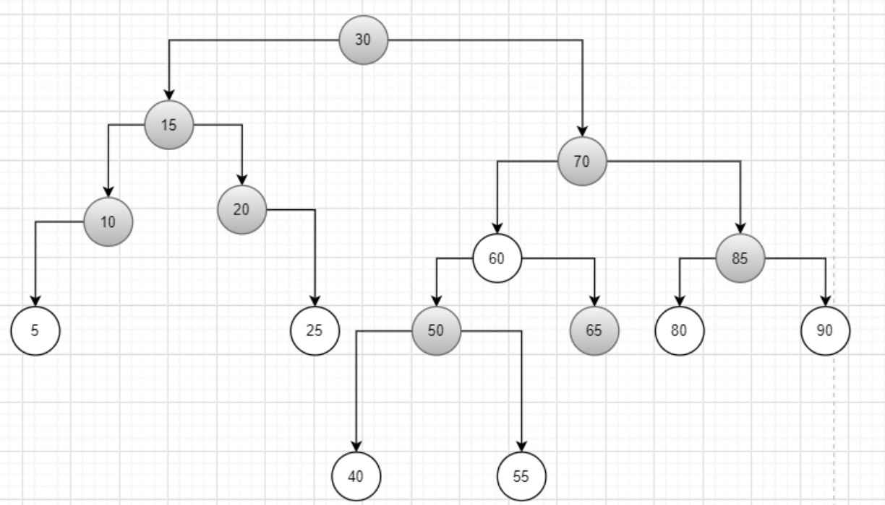

# 容器

Owner: -QVQ-

# 基础

SGI STL被gcc采用，是常用的STL版本

STL大体分为六大组件，分别是:**容器、算法、迭代器、仿函数、适配器（配接器）、空间配置器**

1. **容器**：各种数据结构，如vector、list、deque、set、map等,用来存放数据。

**序列式容器**:强调值的排序，序列式容器中的每个元素均有固定的位置。

**关联式容器**:二叉树结构，各元素之间没有严格的物理上的顺序关系

1. **算法**

**质变算法**：是指运算过程中会更改区间内的元素的内容。例如拷贝，替换，删除等等

**非质变算法**：指运算过程中不会更改区间内的元素内容，例如查找、计数、遍历等等

1. **迭代器**：扮演了容器与算法之间的胶合剂。

提供一种能够依序寻访某个容器所含的各个元素，而又无需暴露该容器的内部的方式。

每个容器都有自己专属的迭代器

迭代器使用非常类似于指针，初学阶段我们可以先理解迭代器为指针

- | 输入迭代器     | 对数据的只读访问          | 只读，支持++、==、！=
- | 输出迭代器     | 对数据的只写访问             | 只写，支持++
- | 前向迭代器     | 读写操作，并能向前推进迭代器| 读写，支持++、==、！=
- | 双向迭代器     | 读写操作，并能向前和向后操作| 读写，支持++、--
- | 随机访问迭代器 | 读写操作，可以随机访问          | 读写，支持++、--、[n]、-n、<、<=、>、>= |
1. **仿函数**：行为类似函数，可作为算法的某种策略。
2. **适配器**：一种用来修饰容器或者仿函数或迭代器接口的东西。
3. **空间配置器**：负责空间的配置与管理。

## 通用操作

每个容器的都有`const_iterator` 类型，是一个迭代器，比起`iterator` 它只能读取不能改变值

```cpp
for (vector<string>::const_iterator iter = text.begin(); iter != text.end(); ++ iter){
         cout << *iter << endl; //ok: print each element in text
         *iter = " ";     // error: *iter is const
     }
```

less<>()位置，里面是<，将使排序结果递增

reverse_iterator是不稳定的，在长度改变时不应该使用

容器不能直接判NULL，通常用`容器.empty()`

# 序列式容器

## 通用操作

### 迭代

| 函数 | 功能 | array | vector | deque |
| --- | --- | --- | --- | --- |
| `begin()` | 返回指向容器中第一个元素的迭代器。 | 是 | 是 | 是 |
| `end()` | 返回指向容器最后一个元素所在位置后一个位置的迭代器 | 是 | 是 | 是 |
| `rbegin()` | 返回指向最后一个元素的迭代器。 | 是 | 是 | 是 |
| `rend()` | 返回指向第一个元素所在位置前一个位置的迭代器。 | 是 | 是 | 是 |
| `cbegin()` | 和 begin() 功能相同，只不过在其基础上，增加了 const 属性，不能用于修改元素。 | 是 | 是 | 是 |
| `cend()` | 和 end() 功能相同，只不过在其基础上，增加了 const 属性，不能用于修改元素。 | 是 | 是 | 是 |
| `crbegin()` | 和 rbegin() 功能相同，只不过在其基础上，增加了 const 属性，不能用于修改元素。 | 是 | 是 | 是 |
| `crend()` | 和 rend() 功能相同，只不过在其基础上，增加了 const 属性，不能用于修改元素。 | 是 | 是 | 是 |

辅助函数

`advance（it,n)` 将迭代器it向后推n位

`distance（first,last)` 计算两个迭代器的距离

`prev(it)` 当前迭代器向前

`next(it)` 当前迭代器向后

### 赋值

| `assign()` | 用新元素替换原有内容。 | - | 是 | 是 |
| --- | --- | --- | --- | --- |
| `operator=()` | 复制同类型容器的元素，或者用初始化列表替换现有内容。 | 是 | 是 | 是 |
| `resize()` | 改变实际元素的个数。 | - | 是 | 是 |
| `swap()` | 交换两个容器的所有元素。 | 是 | 是 | 是 |

### 属性

| `size()` | 返回实际元素个数。 | 是 | 是 | 是 |
| --- | --- | --- | --- | --- |
| `max_size()` | 返回元素个数的最大值。这通常是一个很大的值，一般是 232-1，所以我们很少会用到这个函数。 | 是 | 是 | 是 |
| `capacity()` | 返回当前容量。 | - | 是 | - |
| `empty()` | 判断容器中是否有元素，若无元素，则返回 true；反之，返回 false。 | 是 | 是 | 是 |
| `front()` | 返回第一个元素的引用。 | 是 | 是 | 是 |
| `back()` | 返回最后一个元素的引用。 | 是 | 是 | 是 |
| `operator[]()` | 使用索引访问元素。 | 是 | 是 | 是 |
| `at()` | 使用经过边界检査的索引访问元素。 | 是 | 是 | 是 |
| `data()` | 返回指向容器中第一个元素的[指针](http://c.biancheng.net/c/80/)。 | 是 | 是 | - |

### 增删

| `push_back()` | 在序列的尾部添加一个元素。 | - | 是 | 是 |
| --- | --- | --- | --- | --- |
| `insert()` | 在指定的位置插入一个或多个元素。 | - | 是 | 是 |
| `emplace()` | 在指定的位置直接生成一个元素。 | - | 是 | 是 |
| `emplace_back()` | 在序列尾部生成一个元素。 | - | 是 | 是 |
| `pop_back()` | 移出序列尾部的元素。 | - | 是 | 是 |
| `erase()` | 移出一个元素或一段元素。 | - | 是 | 是 |
| `clear()` | 移出所有的元素，容器大小变为 0。 | - | 是 | 是 |
| `shrink _to_fit()` | 将内存减少到等于当前元素实际所使用的大小。 | - | 是 | 是 |

**对于emplace_back和push_back**

左值方式传入一个定义好的参数，没有区别

```cpp
 	vector<stu> a;
	stu s1('d');
	stu s2('d');
	a.push_back(s1);//调用stu(const stu &s)
	a.emplace_back(s2);//调用stu(const stu &s)
```

右值方式传入一个定义好的参数，没有区别

```cpp
vector<stu> a;
	stu s1('d');
	stu s2('d');
	a.push_back(move(s1));//调用stu(const stu &s)
	a.emplace_back(move(s2));//调用stu(const stu &s)
```

传入临时变量，没有区别

```cpp
vector<stu> a;
a.push_back(stu('d'));//stu(const char ch),再stu(const char& s)
a.emplace_back(stu('d'));//一样
```

传入变量，一个不会生成临时变量，一个会

```cpp
vector<stu> a;
a.push_back('d');//stu(const char ch),再stu(const char& s)
a.emplace_back('d');//stu(const char ch)
```

另外emplace_push支持多个参数传入

```cpp
vector<stu> a;
a.push_back(1);//实际上这里可能是隐式转换
a.emplace_back(1,2);//这里传入多个参数从而调用多个参数的构造函数
```

## array<T,N>

随机访问迭代器

`#include <array>`

**`u[sin](http://c.biancheng.net/ref/sin.html)g** **namespace** std;`

c++11新增，等同数组，不过增加了容器的操作

大小固定，无法扩展和收缩，连续内存

array<T,N>这里的T是数据类型，N必须是常量指明大小（不能是变量）

创建：`std::array<double, 10> values;`

### 对元素的访问

`容器名[n]`

`容器名.at(n)` 返回容器中 n 位置处元素的引用，越界时会抛出std::out_of_range 异常

`get<n>(容器名)` 获取到容器的第n个元素，这个n必须是在编译时可以确定的常量表达式

`容器名.data()` 返回一个指向容器首个元素的指针，可以通过*访问，可以作加法运算从而访问整个容器

## string容器

返回char*类型：`str.c_str()`

`std::to_string(int)` 将int转为string类型

string是写时复制，可以认为是深拷贝，因为其内部维持了计数器

```cpp
string str = "232323";
string str2 = str;//此时两个地址一样的
str2[0] = '3';//此时两个地址不一样
```

如果绕过string直接修改地址会破坏这个性质

```cpp
string str = "232323";
string str2 = str;
str.c_str()[0] = 't';
//此时str，str2都被修改了
```

## vector<T>

随机访问迭代器

`#include <vector>`

**`using** **namespace** std;`

头尾插入O(1),其他位置O(n)

vector底层通过三个迭代器实现（理解成指针）

```cpp
//_Alloc 表示内存分配器，此参数几乎不需要我们关心
template <class _Ty, class _Alloc = allocator<_Ty>>
class vector{
    ...
protected:
    pointer _Myfirst;//指向容器的起始字节位置
    pointer _Mylast;//指向最后一个元素的末尾字节
    pointer _Myend;//指向整个容器所占内存空间的末尾字节
};
```

通过这三个指针可以实现首尾标识、大小、容器、空容器判断等几乎所有的功能

当size==capacity时就需要扩容：

1. 完全弃用现有的内存空间，重新申请更大的内存空间；
2. 将旧内存空间中的数据，按原有顺序移动到新的内存空间中；
3. 最后将旧的内存空间释放。

在扩容之后，原本的指针，引用，迭代器可能会失效

可见扩容成本很高，每次扩容都会申请更多的内存可见，以便后期使用，不同的编译器申请的空间的量不同

每次扩容为原来数组长度的两倍或者1.5倍，通常1.5倍会有更高效率，因为多次扩容后，能利用上前面释放的空间，2倍不能（1，2，4，再申请8不能用上1+2+4的空间）

## deque<T>双端队列容器

随机访问迭代器

`#include <deque>`

**`using** **namespace** std;`

头尾插入O(1)

### 存储结构

存储数据的空间是由一段段等长的连续空间构成，各段空间不一定连续，deque容器用数组（数组名假设为map）存储各个连续空间的首地址


如果map数组满了，则再申请一块更大的连续空间，将原有数据（指针）拷贝过去

### 迭代器的底层实现

遍历时，必须确认各个连续空间在map数组中的位置

遍历时，确认是否处于当前空间的边缘位置，选择是否跳跃到上一个或下一个连续空间

```cpp
template<class T,...>
struct __deque_iterator{
    ...
    T* cur;//指向当前正在遍历的元素
    T* first;//指向当前连续空间的首地址
    T* last;//指向当前连续空间的末尾地址
    map_pointer node;//一个二级指针，指向map数组中指向当前连续空间的指针
}
```

通过上面的四个指针能实现对分段连续空间中存储的元素遍历

```cpp
void set_node(map_pointer new_node){
		node = new_node;
		first = *new_node;
		更新last指针;
}
//重置++运算符
self & operator++(){
	++cur;
	if(cur == last){//当处于连续空间的边缘时
		set_node(node+1);
		cur = first;//更新cur
	}
	return *this;
}
//重置--运算符同理
```

### deque容器的底层实现

deque容器需要维护map数组，start、finish两个迭代器

```cpp
class deque{
    ...
protected:
		//这里的迭代器就是上面的迭代器结构
    iterator start;//指向map数组首个连续空间的信息，其中cur指向首个元素
    iterator finish;//指向map数组最后一个连续空间的信息，其中cur指向最后一个元素的下个位置
    map_pointer map;
...
}
```

借助上诉结构可以实现deque容器提供的大部分成员函数

## list<T>

双向迭代器

`#include <list>`

**`using** **namespace** std;`

底层以双向链表的形式实现的，在任何位置插入都为O（1）

### list容器节点结构

```cpp
//list容器的每个节点都包含下面三个元素
struct __List_node{
    //...
    __list_node<T>* prev;//指向前一个节点
    __list_node<T>* next;//指向下一个节点
    T myval;//当前元素的值
    //...
}
```

### 迭代器的底层实现

操作节点的指针实现，和平时理解的一致

```cpp
//重载前置 ++ 运算符
    __list_iterator<T>& operator ++(){
        node = (*node).next;
        return *this;
    }
    //重载后置 ++ 运算符
    __list_iterator<T>& operator ++(int){
        __list_iterator<T> tmp = *this;
        ++(*this);
        return tmp;
    }
```

### 容器的底层实现

不同版本的STL底层实现不完全一致

SGI STL中为双向循环链表，内部包含两个指针，指向构建容器时的空白节点，即链表头部和尾部

```cpp
void empty_initialize()
{
    node = get_node();//初始化节点
    node->next = node; // 前置节点指向自己
    node->prev = node; // 后置节点指向自己
}
```

可以看出list实际上就是带头节点的双向循环链表

## forward_list<T>正向链表容器

前向迭代器，c++11

`#include <forward_list>`

**`using** **namespace** std;`

指定位置插入或删除O(1), 访问存储的元素O(n),

和list类似，不过底层是用单向链表实现，值提供向前迭代器，不支持反向遍历。对于存储相同个数的元素耗用更少内存，对单链表的某些操作效率更高

# 关联式容器

底层都用红黑树实现

## set/multiset

双向迭代器

`#include <set>`

**`using** **namespace** std;`

set/multiset会根据待定的排序准则，自动将元素排序，每个元素最多出现一次。两者不同在于前者不允许元素重复，而后者允许。

```cpp
template < class T, // 键 key 和值 value 的类型
	class Compare = less<T>, // 指定 set 容器内部的排序规则
	class Alloc = allocator<T> // 指定分配器对象的类型
> class set;//后两个参数带默认值可不指定，通常只用前两个参数
```

例：`std::set<std::string> myset{"http://c.biancheng.net/java/", "http://c.biancheng.net/stl/"}；`

**优势：**

底层用**红黑树**实现，**自平衡二叉搜索树，**以牺牲部分的平衡性换取了操作上/旋转次数的降低， 插入操作旋转次数不超过2，删除操作不超过3，插入删除效率高，

set支持高效的关键字查询操作O(logN)

**特点：**

要求key和value值必须相等，因此只需提供一个值即可存储起来

- 不能直接改变元素值（因为那样会打乱原本正确的顺序），要改变元素值必须先删除旧元素，则插入新元素
- 不能直接存取元素，只能通过迭代器进行间接存取，而且从迭代器角度来看，元素值是常数
- 元素比较动作只能用于型别相同的容器(即元素和排序准则必须相同)
- 自定义类型如果要构造set必须定义<运算符

对于关联式容器来是，都是以节点的方式来存储，类似链表。插入删除时只需要改变节点的指针即可

因此对 set 进行插入删除操作 都不会引起iterator的失效，但是vector的插入删除操作一般会发生内存移动和内存拷贝，所以过期的迭代器不要使用

```cpp
struct Info{
    string name;
    float score;
    //重载“<”操作符，自定义排序规则
    bool operator < (const Info &a) const
    {
        //按score从大到小排列
        return a.score<score;
    }
}
set<Info> s;
......
set<Info>::iterator it;
```

一个应用的例子：给vector去重

```cpp
	vector<int> vec;
	vec.push_back(2);
	vec.push_back(6);	
	vec.push_back(2);
	vec.push_back(3);
	vec.push_back(1);
				
	set<int> st(vec.begin(), vec.end());
	vec.assign(st.begin(), st.end());//此时vec只有4个值
```

## map/multimap

双向迭代器

`#include <map>`

**`using** **namespace** std;`

底层是红黑树

map 容器存储的各个键值对，键的值既不能重复也不能被修改

multimap 容器中可以同时存储多（≥2）个键相同的键值对。

```cpp
template < class Key,                                     // 指定键（key）的类型
           class T,                                       // 指定值（value）的类型
           class Compare = less<Key>,                     // 指定排序规则
           class Alloc = allocator<pair<const Key,T> >    // 指定分配器对象的类型
           > class map;//后两个有默认值，可不加
```

例：`std::map<std::string, int>myMap;`

排序规则默认调用`std::less<T>`，可以选择`std::greater<T>` 升序

该容器存储的都是pair<const K, T> 类型。

P.first 访问第一个数据，P.second访问第二个数据

```cpp
#1) 默认构造函数，即创建空的 pair 对象
pair();
#2) 直接使用 2 个元素初始化成 pair 对象
pair (const first_type& a, const second_type& b);
#3) 拷贝（复制）构造函数，即借助另一个 pair 对象，创建新的 pair 对象
template<class U, class V> pair (const pair<U,V>& pr);
#4) 移动构造函数
template<class U, class V> pair (pair<U,V>&& pr);
#5) 使用右值引用参数，创建 pair 对象
template<class U, class V> pair (U&& a, V&& b);
```

### 红黑树的实现

```cpp
//树节点
struct RBTreeNode
{
	typedef RBTreeNode<K, V> Node;

	Node* _left;
	Node* _right;
	Node* _parent;
	//T _data;
	pair<K, V> _kv;
	Color _color;//Color枚举红黑两种类型
……
}
//红黑树
template <class K, class V>

class RBTree
{
public:
	//typedef RBTreeNode<T> Node;
	typedef RBTreeNode<K,V> Node;
	RBTree()
		:_root(nullptr)
	{}
private:
	Node* _root;
};
```

红黑树中有个header节点，和根节点相互关联，同时还有指向红黑树的最小节点和最大节点


**自平衡二叉搜索树**

**以牺牲部分的平衡性换取了操作上/旋转次数的降低**， 插入操作旋转次数不超过2，删除操作不超过3，

必须满足如下规则：

1. 节点是红色或黑色
2. 根是黑色
3. 所有叶子都是黑色（叶子是 NULL 节点）
4. **每一个红色节点必须有两个黑色的子节点（不能有两个连续红）**
5. **从任一节点到每个叶子的所有简单路径都包含相同数目的黑色节点。（维持一种黑色平衡）**，这点证明了它并非是平衡二叉搜索树。

1*该路径上的黑色节点数量 <= 任意路径长度 <= 2 * 该路径上的黑色节点数目（红色节点和黑色节点一样多）

从上述特点得知：

- 新增节点必须为红
- 新增节点之父节点必须为黑
- 最好的查询时间为路径上全黑节点
- 最差的查询时间为路径上一半红一半黑节点（即最长路径是最短路径的2倍）


### **操作**

- 因为每一个红黑树也是一个特化的二叉查找树，因此红黑树上的查找和修改与普通二叉搜索树的操作一样
- 插入和删除操作会导致不再匹配红黑树的性质， 恢复红黑树的性质需要少量 O（logn）的颜色变更和不超过三次的树旋转

## 插入

N为要插入的节点（新插入的节点都为红色），P为父节点，U为叔父节点，G为祖父节点

### 情形1

N位于根上，没有父节点

则直接绘制为黑色节点（此时它在每个路径是对黑节点的数目也加1）

### 情形2

N的父节点是黑色，

满足性质

### 情形3

N的父节点和叔父节点都是红色，

将父节点和叔父节点都重绘为黑，将祖父节点重绘为红，向上递归，最后根节点如果变红了，则再变回黑


### 情形4

父节点是红色而叔父节点是黑色或没有，且新节点N是父节点的**右节点**，而父节点又是其父节点的左子节点（如果两个情况相反则下面的操作也相反）

进行一次左旋，然后安装情形5来处理


### 情形5

父节点是红色而叔父节点是黑色或没有，且新节点N是父节点的**左节点**，而父节点又是其父节点的左子节点

对祖父节点G作右旋转，如果有根节点为红，则变为黑色\

## 为什么rust使用b树，而cpp使用红黑树实现

|  | 随机查找 | 顺序查找 | 空间利用 | 增删 | 实现 |
| --- | --- | --- | --- | --- | --- |
| b树 |  | 局部性原理,效率更高 | 更高 | 涉及分页、合并（涉及数据的移动） | 复杂 |
| 红黑树 | 更优 |  | 维护很多指针 | 效率高（旋转和着色，都是对指针的操作） | 简单 |

# 无序关联式容器

和关联式容器唯一的区别就是不需要排序，无序关联式容器擅长通过指定键查找对应的值，而遍历容器中存储元素的效率不如关联式容器

底层用哈希表的存储结构

解决哈希冲突的方法是链地址法

## unordered_map/unordered_multimap

前向迭代器

unordered_map对键值不允许重复，unordered_multimap允许存储多个键相同的键值对

`#include <unordered_map>`

**`using** **namespace** std;`

定义

```cpp
template < class Key,                        //键值对中键的类型
           class T,                          //键值对中值的类型
           class Hash = hash<Key>,           //容器内部存储键值对所用的哈希函数
           class Pred = equal_to<Key>,       //判断各个键值对键相同的规则
           class Alloc = allocator< pair<const Key,T> >  // 指定分配器对象的类型
           > class unordered_map;//后三个参数有默认参数可不加
```

构造函数：

`unordered_map(size_type n, const hasher& hf, const key_equal& eql);`

建、值、键相等性判断

`unordered_map<key, value, int (*)()> umap(0, hasher);`

0为指定初始哈希桶的大小，hasher为自定义的哈希计算函数

### 底层实现

底层用数组实现哈希表，对于冲突用开链法解决

```cpp
template<typename K, typename V>  //每个节点的结构
	struct HashNode	{
		pair<K, V> _kv;//对值
		HashNode<K,V>* _next;//指向下一个冲突的节点，单链表结构
	};
 
	template<typename K, typename V, class HashFunc = _HashFunc<K>> //哈希表的结构，第三个参数是仿函数，为了实现可以存储string
	class HashTable	{
	protected:
		vector<HashNode*> _table;//用数组来存储节点的指针
		size_t _size;//保存有效元素的个数
	};
```

这里的vector扩容机制类似vector

## unordered_set/unordered_multiset

前向迭代器

unordered_set存储的元素不能重复，unordered_multiset允许存储值相同的元素。

`#include <unordered_set>`

**`using** **namespace** std;`

```cpp
template < class Key,            //容器中存储元素的类型
           class Hash = hash<Key>,    //确定元素存储位置所用的哈希函数
           class Pred = equal_to<Key>,   //判断各个元素是否相等所用的函数
           class Alloc = allocator<Key>   //指定分配器对象的类型
           > class unordered_set;//后三个有默认参数
```

### 自定义哈希函数

unordered_map允许我们传入自定义的哈希计算方式

```cpp
explicit unordered_map(size_type __n = 0,
                       const hasher& __hf = hasher(),
                       const key_equal& __eql = key_equal(),
                       const allocator_type& __a = allocator_type());

explicit unordered_set(size_type __n = 0,
                       const hasher& __hf = hasher(),
                       const key_equal& __eql = key_equal(),
                       const allocator_type& __a = allocator_type());

```

其中，`__n`为容器的桶数，`__hf`为哈希函数，`__eql`为键值相等的判断函数，`__a`为分配器对象。这些参数可以有默认值。

要注意的是，如果使用自定义的哈希函数，需要特化`std::hash`模板：

```cpp
namespace std {
    template<>
    struct hash<YourType> {
        size_t operator()(const YourType& obj) const {
            // ...
        }
    };
}

```

使用偏特化实现自定义的hash函数

```cpp
class abc {
	friend class hash<abc>;
public:
	abc(int a1,char b2, string c3):a(a1),b(b2),c(c3){}

	bool operator==(const abc& p)const {
		return p.a == a && p.b == b && p.c == c;
	}
private:
	int a;
	char b;
	string c;
};
template<>
class hash<abc> {
public:
	size_t operator()(const abc& p)const {
		return hash<int>()(p.a) + hash<char>()(p.b) + hash<string>()(p.c);
	}
};
int main()
{
	unordered_set<abc> a;
}
```

使用仿函数实现自定义的hash函数

```cpp
#include<iostream>
#include<unordered_set>
using namespace std;
//自定义类型
class abc {
	friend class Hasher;
public:
	abc(int a1, char b2, string c3):a(a1),b(b2),c(c3){}
	bool operator==(const abc& p) const{
		return p.a == a && p.b == b && p.c == c;
	}
private:
	int a;
	char b;
	string c;
};
//特化hash类
class Hasher1{
public:
	size_t operator()(const abc& p)const {
		return hash<int>()(p.a) + hash<char>()(p.b) + hash<string>()(p.c);
	}
};
//也可以用全局函数
size_t Hasher2(const Person& p) {
	return hash<string>()(p.firstname) + hash<string>()(p.lastname) + hash<int>()(p.age);
}
int main()
{
	unordered_set<abc, Hasher1> a;
	unordered_set<abc, Hasher2> b;
}
```

完全自定义的hash函数

```cpp
#include<unordered_set>
class Person {
private:
	string firstname;
	string lastname;
	int age;
	friend class Hasher;
public:
	Person() {}
	Person(string fn, string ln, int a) :firstname(fn), lastname(ln), age(a) {}
	//重载==运算符
	bool operator==(const Person& p)const {
		return (firstname == p.firstname) && (lastname == p.lastname) && (age == p.age);
	}
};
//最终计算hash的地方，里面可以用偏特化完成
template<typename T>
void hashCombine(size_t& seed, const T& arg)//真正的hash在这里完成
{
	//这里虽然也用到了标准库提供的hash函数，但是后面可以添加自己的一些数据（甚至hash<T>()(arg)操作也可以有我们自己来做）
	//不同用户在这里可以有不同的数，只要能够将原始数据尽可能打乱即可
	//0x9e3779b9涉及到数学中的黄金比例，实际上并不需要一定是这个数
	seed ^= hash<T>()(arg) + 0x9e3779b9 + (seed << 6) + (seed >> 2);
}
//递归出口
template<typename T>
void hashValue(size_t& seed, const T& arg)//③递归出口
{
	hashCombine(seed, arg);
}
//递归拆分对每一个参数处理
template<typename T1, typename... T2>
void hashValue(size_t& seed,const T1& arg,const T2&... args)//②在这里通过递归逐步拿到所有参数,当args...的大小为1时跳出该递归，接着进入③
{
	hashCombine(seed, arg);
	hashValue(seed, args...);//递归
}
//生成种子，调用函数拆分参数
template<typename... T>//T为模板参数包，可以代表任意多个类型；args为函数参数包，可以代表任意多个函数参数
size_t hashValue(const T&... args)//①在这里完成参数的第一次拆分，接着进入②
{
	size_t seed = 0;//种子，以引用方式传递
	hashValue(seed, args...);//args...中为T类型对象中的所有用于hash的数据成员
	return seed;
}
//自定义的哈希类
class Hasher {
public:
	size_t operator()(const Person& p)const {
		return hashValue(p.firstname,p.lastname,p.age);
	}
};
//从下往上阅读
void main()
{
	unordered_set<Person, Hasher> uset;
	uset.insert(Person("a", "a", 10));
	uset.insert(Person("a", "a", 10));
	uset.insert(Person("c", "c", 12));
	uset.insert(Person("d", "d", 13));
	uset.insert(Person("e", "e", 14));
	for (int i = 0; i < uset.bucket_count(); i++) {
		cout << "bucket " << i << " has " << uset.bucket_size(i) << " elements" << endl;
	}
}
```

MurmurHash算法

`hash_index = (hash_index << 1) ^ num;`

这是一种常见的计算哈希值的方法，通常高效、已于理解和实现，并且可以确保哈希值在散列桶中均匀分布

使用openssl库中的MD5、SHA哈希函数在特定情况下更适用，但通常计算量更大

### 哈希定址

直接定址法： 取关键字的某个线性函数作为散列（哈希）地址

**数字分析法：取其中的数字作为地址**

**平方取中法：将数字平方，取中间几位作为关键字**

**除数取余法：X%P**

**随机数法：f(x) = random(x)**

折叠法：关键字分割成位数相同的几部分，取其叠加和（舍去进位）作为哈希地址

### 冲突

开放定址法：

线性探测再散列

二次探测再散列（平方探测法）d = 0,1^2, -1^2, 2^2, -2^2

随机探测再散列

再散列

链地址（拉链法）

公共溢出区

哈希表中每一个冲突的位置用对应的链表，即哈希桶

# 容器适配器

stack和queue的**默认情况下底层容器都为deque**。因为：

- stack和queue不需要遍历，固定一或两端
- 元素增长时，deque比vector效率高

## stack

不支持迭代器

`#include <stack>`

**`using** **namespace** std;`

一种单端开口的容器，

默认情况以deque为缺省情况下栈的底层结构

也可以指定vector或list为底层实现

`std::stack<int, std::vectro<int>> third`

`std::queue<int,std::list<int>>third；`

## queue

不支持迭代器

`#include <queue>`

**`using** **namespace** std;`


## priority_queue

不支持迭代器

`#include <queue>`

**`using** **namespace** std;`

```cpp
std::priority_queue <typename T,//元素类型
        typename Container=std::vector<T>,//底层使用的基础容器，默认为vector
        typename Compare=std::less<T> >//指定排序规则，默认为std::less<T>
valuse;
```

底层用大根堆结构实现

依然和队列一样有队头队尾，但出队规则是优先级最大的元素先出

每当有新元素进入，会根据排序规则找到优先级最高的元素，移动到队头。当堆头移出后，会重新找到当前优先级最高的元素移动到队头O(logN)

**创建：**

```cpp
//方式一
std::string wrds[] { "one", "two", "three", "four"};
std::priority_queue<std::string> words { std::begin(wrds),std:: end(wrds)};
 // "two" "three" "one" "four"
//方式二
std::priority_queue<std::string, std::vector<std::string>,std: :greater<std::string>> words1
 {std::begin (wrds) , std:: end (wrds) }; //"four" "one" "three" "two"
//拷贝函数
std::priority_queue<std::string> copy_words {words}; // copy of words
//

```

[C++ priority_queue(STL priority_queue)用法详解](http://c.biancheng.net/view/480.html)

**操作：**

- push(const T& obj)：将obj的副本放到容器的适当位置，这通常会包含一个排序操作。
- push(T&& obj)：将obj放到容器的适当位置，这通常会包含一个排序操作。
- emplace(T constructor a rgs...)：通过调用传入参数的构造函数，在序列的适当位置构造一个T对象。为了维持优先顺序，通常需要一个排序操作。
- top()：返回优先级队列中第一个元素的引用。
- pop()：移除第一个元素。
- size()：返回队列中元素的个数。
- empty()：如果队列为空的话，返回true。
- swap(priority_queue<T>& other)：和参数的元素进行交换，所包含对象的类型必须相同

# **std::initializer_list<T>**

c++11中使得我们能用{}初始化类中变量，原理就是用到了**std::initializer_list<T>**

基础用法：

```cpp
#include <initializer_list>
#include <vector>
class A
{
public:
    A(std::initializer_list<int> integers){//针对{}类型的构造函数
        m_vecIntegers.insert(m_vecIntegers.end(), integers.begin(), integers.end());
    }

    ~A(){}

    void append(std::initializer_list<int> integers){
        m_vecIntegers.insert(m_vecIntegers.end(), integers.begin(), integers.end());
    }

private:
    std::vector<int> m_vecIntegers;
};
```

进一步的，如果想要{}里存在不同的类型，希望有统一操作，则将入参封装成一个类，对每个不同的类型分别调用不同的构造函数

```cpp
#include <iostream>
#include <string>
#include <initializer_list>
#include <vector>

//省略了jsonType枚举类的定义
//…………

//统一的数据体
struct jsonNode
{
    jsonNode(const char* key, const char* value) : 
        m_type(jsonType::jsonTypeString),
        m_key(key),
        m_value(value)
    { 
    }

    jsonNode(const char* key, double value) :
        m_type(jsonType::jsonTypeDouble),
        m_key(key),
        m_value(std::to_string(value))
    {
    }
    
    //...省略其他类型的构造函数...

    jsonType    m_type;
    std::string m_key;
    //始终使用string类型保存值是避免浮点类型因为精度问题而显示不同的结果
    std::string m_value;
};
//json对象
class json
{
public:
		//使用初始化列表的函数，列表的每个对象都用jsonNode这个类对象封装起来
    static json& array(std::initializer_list<jsonNode> nodes)
    {            
        m_json.m_nodes.clear();
        m_json.m_nodes.insert(m_json.m_nodes.end(), nodes.begin(), nodes.end());

        return m_json;
    }
private:
    std::vector<jsonNode> m_nodes;

    static json           m_json;//实现单例
};
json json::m_json;

//使用
int main(){
																					//类中有不同的数据类型对象
	 json array_not_object = json::array({ {"currency", "USD"}, {"value", 42.99} });
    return 0;
}
```

# heap

`#include<algorithm>`

## `make_heap()`

把可迭代容器转化为堆，默认大根堆

第一个参数是指向开始元素的迭代器

第二个参数是指向最末尾元素的迭代器

第三个参数是less<>()或是greater<>()

> 要使用less<int>()，以及greater<int>()，请添加头文件#include <functional>，且一定要加括号less<>()
> 

```cpp
#include<iostream>
#include<vector>
#include<algorithm>
#include <queue>
#include <functional>
vector<int> q = {1,2,3,4,5,6,7,8,9};
make_heap(q.begin(), q.end(), less<int>());
```

注意：这个函数只生成一个堆，但不会自动维护它

## `push_heap()`

将数据插入到堆中，先用q.push_back()传入q中，再调用这个函数

三个参数同make_heap()

```cpp
vector<int> q = {1,2,3,4,5,6,7,8,9};
make_heap(q.begin(), q.end(), less<int>());
q.push_back(12);
push_heap(q.begin(), q.end(), less<int>());
```

## `pop_heap()`

将第0个元素和最后一个元素交换位置，再对前n-1个元素调用make_heap()函数

三个参数与make_heap()的一致

再调用容器内的pop_heap()弹出这个数据

```cpp
vector<int> q = {1,2,3,4,5,6,7,8,9};
make_heap(q.begin(), q.end(), less<int>());
pop_heap(q.begin(), q.end(), less<int>());、
q.pop_heap();
```

## `sort_heap()`

将堆进行排序，大顶堆将转为递增序列，小顶堆转为递减序列

三个参数与make_heap()的一致

如果传入的容器不符合堆的特性则报错

## `is_heap`

测试范围内的元素是否是一个二叉堆

三个参数与make_heap()的一致

## `is_heap_until`

返回第一个破坏二叉堆结构元素的迭代器。如果都有效，则返回last