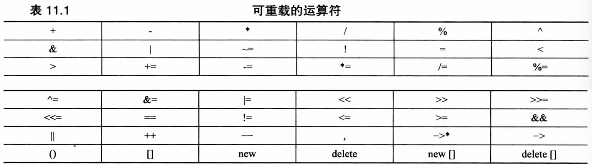

# 对象和类

Owner: -QVQ-

# 类

内联方法：定义位于类声明中的函数都将自动成为内联函数

抽象数据类型ADT

**作用域为类的常量**

对于类中的常量，所有实例类只需存放一个就好，直接用const并不能起到这样的效果

方法一：枚举并不会产生额外的空间，在类中的代码遇到时编译器用常量代替枚举的地方

```cpp
class Bakery{
	enum {Months = 12};
	double costs[Months];
};
```

方法二：static

```cpp
class Bakery{
private:
	static const int Months = 12;
	double costs[Months];
}
```

**强类型枚举**
`enum classenum struct`

问题：
`enum Status {Ok, Error};
enum Status2 {Ok, Error};//此时重定义了，报错
Status flag = Ok;//这个ok是在同一片区域下的`

解决：强类型枚举，enum后面加上class或struct修饰就可以不同空间定义，但使用时必须加上作用域
`enum class Status {Ok, Error};
enum struct Status2{Ok, Error};
Status flag3 = Status::Ok;`//必须加上作用域

枚举的底层随系统而异

对于作用域内枚举，C++11，默认为整型，可以指定类型

```cpp
enum class Status :char { Ok, Error };
Status flag1 = Status::Ok; 
cout << sizeof(flag1) << endl;//输出char的1

enum Status2 { Ok, Error };
Status2 flag = Ok;
cout << sizeof(flag) << endl;//输出int的4
```

注意：有范围的枚举和其他有范围的枚举或无范围的枚举不能做比较，无范围的枚举间可以比较

```cpp
enum a { a1, a2, a3 };
enum b { b1, b2, b3 }; 
enum class c :int { c1, c2, c3 };
enum class d:int{d1,d2,d3};
//if (a1 < c::c2)cout << "f";//error
if (a1 < b2)cout << "f";
//if (c::c1 < d::d2)cout << "f";//error
```

## 类作为参数传递

类作为参数传递的时候为左值默认为拷贝构造（`stu &s`），如果没有，也可以调（`const stu&s`）类型的拷贝构造函数

类作为返回值的时候属于右值调用的是（`const stu& s`）类型的拷贝构造函数

类用引用类型作为返回值属于左值调的`stu& s` ，但这个方法不安全

```cpp
class stu {
public:
	stu() {
		cout << "()" << endl;
	}
	stu(stu& s) {
		//空实现
		cout << "(&s)" << endl;
	}
	stu(const stu& s) {
		cout << "const (&s)" << endl;
	}
	~stu() {
		cout << "~()" << endl;
	}
	int a = 10;
};

stu test(stu s) {
	s.a++;
	cout << s.a << endl;//此时s.a为11,因为我们拷贝函数里是空的
	//拷贝函数，这里的s结束后会调用析构函数
	return s;
}

int main() {
	stu s;//创建时调用构造函数
	s.a = 100;
	auto b = test(s);//作为入参时调用的是拷贝构造

}
//输出
// ()
// (&s)
// 11
//const (&s)
// ~()
// ~()
// ~()
```

### default

```cpp
class a{
	a()=default;
}
```

等同于写了一个空构造函数

### const成员函数

只能在类中才能使用，表明这个函数不会修改类中的变量，但可以修改函数传入的参数

`void func() const{}`

## 特殊成员函数

### 默认函数

默认构造函数

默认析构函数

复制构造函数

赋值运算符

地址运算符

移动构造函数

移动赋值运算符

**关于构造函数：**

1.`stu(stu s){}` 不能作为构造函数，因为stu作为参数的时候会再调用这个函数，从而引发无限递归

2.类的创建不能没有参数的（）,如下的创建是不合法的，系统会将a判定为一个函数声明

`stu a();`

应该是`stu a;`

3.创建了构造函数，依然有默认拷贝函数

4.创建了拷贝函数，则没有默认函数

如果构造函数的所有参数都有默认参数，则带参数的构造函数也可以是默认构造函数，默认构造函数只能存在一个

```cpp
klunk(){}//这两个不能同时存在
klunk(int i = 0){}
```

**关于复制构造函数**

新建一个对象并用现有对象初始化他时调用

```cpp
//即按值传递时会调用复制构造函数
string b;
string a(b);
string c = b;//2
string d = string(b);//3
string *e = new string(b);
//2、3两种方式，可能会用复制构造函数生成临时对象，再将临时对象赋值给c、d
//也可能直接复制构造函数生成c、d，这取决于具体实现
```

复制构造和赋值运算都不会生成新的静态变量空间

`0 （void *)0  NULL  nullptr  ‘\0’` 都为空
**赋值运算符的使用**

当已有对象赋给另一个对象时将使用重载的赋值运算符

```cpp
string a, c;
string b = a;//可能会调用赋值运算符，但一定会调用拷贝构造
c = a; //一定调用赋值运算符
```

```cpp
class stu{
public:
	stu(){}
	stu(int a){
		cout<<"(int)"<<endl;
	}
	stu& operator=(stu a) {
		cout << "operator=(stu)" << endl;
	}
}
stu a;
a = 2;//将先调用int的构造函数再调用赋值运算符
//输出（int）
//operator=(stu)
```

### 子类调用基类的构造函数

语法：`<子类名>(形参列表) : <父类名>(参数列表)`

父类中定义的纯虚函数子类必须被重写才能实例化成功

```cpp
//基类
class Rectangle {
protected:
    float width, length, area;
public:
    Rectangle(float a, float b):width(a)，length(b){};
};
//子类
class Cube : public Rectangle {
protected:
    float height;
    float volume;
public:
   Cube(float width, float length, float high) : Rectangle(width, length) {    //调用了矩形类的构造函数
		//把cube传入的width、length传入Rectangle函数中用父类的构造方法，high自己使用
	    height = high;
		} 
};
```

## 重载

重载分为成员函数重载和非成员函数重载

重载后的运算符必须至少有一个操作数是用户定义的类型（防止用户为标准类型重载运算符）。不能将系统自带的减法运算符重载为两个double值的和

重载运算符不能违法运算符原来的语法规则，不能将求模运算符%重载成一个操作数

不能修改运算符的优先级

不能创建新的运算符

不能重载sizeof  .  *   ::  三目运算符、C++11的类型转换运算符

**可重载的运算符：**


=  （）  []  →  只能通过成员函数进行重载

重载时，C++将区分常量和非常量函数

```cpp
class stu{
	float operator[](int i) const{
		cout << "[]const" << endl;
		return a_;
	}//如果没有这个重载，下面b[2]将报错
	float operator[](int i) {
		cout << "[]" << endl;
		return a_;
	}
}
stu a = 1;
const stu b = 2;
cout<<a[2]<<endl;
cout<<b[2]<<endl;//自动调用const的重载

```

**静态类成员函数**

`static`关键字被称为类级别标志，是因为它对整个类操作而不是对具体的实例。可以用于控制整个类接口的行为，例如显示类内容的格式

其中不能使用this指针，只能访问静态成员变量

## 友元

在为类重载二元运算符时常需要友元

对于*的重载的使用语句`A=2.75*B`和`A=B*2.75` 从概念上来说是相同的，但实际上，后者才能成功调用，2.75不是对象没有重载过*

非成员函数是一个解决方法(非成员函数需要成为类的友元)

`Time operator*(double m, const Time &t)`

从而将`A=2.75*B` 与`A=operator*(2.75, B)` 相匹配

非成员函数实现`A=2.75*B`、成员函数实现`A=B*2.75`

注意：对于`A=B*2.75`，不能成员函数和非成员都重载它，会出现二义性

**创建：**

在类中声明:

`friend Time operator*(double m, const Time& t);`

在类中声明但不是类的成员函数，但和成员函数有相同权限

定义时不需要加friend关键字

## 类的类型转换

```cpp
stu{
	stu(int i){
		a_=i;
	}
	int a_;
}
stu a;
a = 1;//将调用一次构造，一次析构
```

程序使用构造函数来创建一个临时的stu对象，再用赋值的方式复制给a，这是隐式转换

**基本类型隐式转换为类**

只有接收一个参数的构造函数才能作为转换函数，第二个参数有默认值则也可以作隐式转化

如果加上explicit禁止隐式转换则不能

```cpp
class stu{
	explicit stu(int i, int j = 0){
		a_=i;
	}
	int a_;
}
stu a;
//a = 1;//error,不能隐式转换
//a = {2, 3};//error，不能两个参数隐式转换
a = stu(1);//只能显示转换
a = (stu)1;//可以显示转换
```

这种隐式转换也可以发生在作为函数参数的传递之间

```cpp
class stu{
	stu(float a){}
	stu(float a, float b){}
}
void test(stu a){}

test(2);//自动转换为float类型再调用stu构造
//等同test((stu)2);
test({1,2});//这里实际上列表初始化，并不是隐式转换
//test((stu){1,2});//error
```

**类转换为基本类型**

使用特殊的C++运算符函数：转换函数

- 必须是类方法
- 不能指定返回类型
- 不能有参数(作为类的方法，调用时已经确定参数了)

```cpp
class stu{
	//operator double();
	stu(double a):a_(a){}
	operator int(){
		return a_;
	}
	//operator char(){
	//	return a_;
	//}//如果再加一个，cout不能确定输出哪种类型，将报出二义性的错误
	int a_;
}

stu a(18.5);
double b = double(a);//b为18
double c = (double)a;
double d = a;//编译器自动转化
cout<<a;//输出18；
```

这种转换会带来些问题，一方面用explicit来显示的转换，另一方面，不要用这种特性，而是用函数调用来实现类的返回值

基于这种转换可以实现类和一般类型的加法

```cpp

stu{
	stu(float a):a_(a){}
	//这两种方式不能同时存在
	//方式一，重载加法对象为float
  //stu operator+(float a){
	//	return a + a_;
	//}
	//方式二、重载加法对象为stu
	stu operator+(stu a){
		return a.a_+this-.a_;
	}
	float a_;
}

//构造函数、重载+可以实现
	stu a = 1.2;
	float b = 3.1;
	stu c = a + b;
	//方式二、通过b调用一次构造，再调用+，再调用构造返回结果给c
	//方式一、直接调用+，更高效
```

# 初始化列表

## 用于构造函数

```cpp
class foo
{
public:
	foo(string s, int i):name(s), id(i){} ; // 初始化列表
	private:
	string name ;int id ;
};
```

**构造函数的执行**可以分成两个阶段，初始化阶段和计算阶段

**初始化阶段：**所有类类型（class type）的成员都会在初始化阶段初始化，即使该成员没有出现在构造函数的初始化列表中.

**计算阶段：**一般用于执行构造函数体内的赋值操作。

**问题：**对于如下代码

```cpp
class Test1
{
public:
	Test1() // 无参构造函数
	{cout << "Construct Test1" << endl ;}
	Test1(const Test1& t1) // 拷贝构造函数
	{cout << "Copy constructor for Test1" << endl ;this->a = t1.a ;}
	Test1& operator = (const Test1& t1) // 赋值运算符
	{cout << "assignment for Test1" << endl ;this->a = t1.a ;return *this;}
	int a ;
};
class Test2
{
public:
	Test1 test1 ;
	Test2(Test1 &t1)//初始化阶段先调test1的无参构造函数
	{test1 = t1 ;}//计算阶段调赋值运算符
};
int main(){
	Test1 t1 ;
	Test2 t2(t1) ;
}
/*输出
Construct Test1 //第一行输出对应调用代码中第一行，构造一个Test1对象
Construct Test1 //初始化阶段，用默认的构造函数初始化对象test1
assignment for Test1 //计算阶段，对test1执行赋值操作
*/
```

**解决：**

```cpp
class Test2
{
	public:
	Test1 test1 ;
	Test2(Test1 &t1):test1(t1){}//输出
}
//使用同样的调用代码，输出结果如下
//Copy constructor for Test1
```

区别是这里直接调用拷贝构造函数初始化test1，省去了调用默认构造函数的过程。

所以一个好的**原则**是，**能使用初始化列表的时候尽量使用初始化列表**

## 必须使用初始化列表的时候

1.**常量成员**，因为常量只能初始化不能赋值，所以必须放在初始化列表里面

2.**引用类型**，引用必须在定义的时候初始化，并且不能重新赋值，所以也要写在初始化列表里面

```cpp
//这个例子展示初始化列表在常量和引用中的应用
class test {
public:
	test(int &a, int b):a(a),b(b) {}
	//test(){};//这里会报错，因为类中的a，b必须初始化
	void show() {
		cout << a << " "<< b << endl;
	}
private:
	int &a;
	const int b;
};
int main() {
	int a = 10, b = 8;
	test tes(a,b);//调用初始化列表传入10，8
	a++;
	tes.show();//输出11，8
	return 0;
}
```

3. **没有默认构造函数**的类类型，因为使用初始化列表可以不必调用默认构造函数来初始化，而是直接调用拷贝构造函数初始化

注意：成员是按照他们在**类中出现的顺序进行初始化的**，而不是按照他们在初始化列表出现的顺序初始化

```cpp
class foo{
public:
int i ;int j ;
	foo(int x):j(x), i(j){} // i值未定义
};
```

# 类的构造

有参构造函数是 私有成员，有参构造时将会发生错误

## emplace_back的出现

功能和push_back一样，只是效率稍微高了一些

只是在具体实现时，emplace_back是直接构造，push_back是先构造，在移动构造

## 继承构造

```cpp
class B : public A
{
public:
    using A::A; // 继承构造函数
};
```

- 继承的构造函数只能初始化基类中的成员变量  ，不能初始化派生类的成员变量
- 基类的构造函数被声明为私有 ，那么不能继承构造函数
- 派生类是从基类中虚继承，那么不能继承构造函数
- 一旦使用继承构造函数，编译器不会再为派生类生成默认构造函数

## 委托构造

如果一个类包含多个构造函数，C++ 11允许在一个构造函数中的定义中使用另一个构造函数，但这必须通过初始化列表进行操作，

```cpp
class Info
{
public:
    Info() : Info(1) { }    // 委托构造函数
    Info(int i) : Info(i, 'a') { } // 既是目标构造函数，也是委托构造函数
    Info(char e): Info(1, e) { }

private:
    Info(int i, char e): type(i), name(e) { /* 其它初始化 */ } // 目标构造函数
    int  type;
    char name;
    // ...
};
```

## 继承控制

`final`关键字表明这个类不能被继承，或者类中这个函数不能被重写

`override`关键字确保当前的派生类实现了重写基类的虚函数，如果实际没有重写，报错

```cpp
class B1 final {}; // 此类不能被继承
//class D1: public B1 {}; // error!

class B
{
public:
//  virtual void func() override // error! 指定了重写但没有父类，实际并没重写
//  {
//      cout << __func__ << std::endl;
//  }
    virtual void f() const
    {
        cout << __func__ << std::endl;
    }
    virtual void fun()
    {
        cout << __func__ << std::endl;
    }
};

class D : public B
{
public:
 
//  virtual void f() override   // error! 指定了重写但实际并没重写,类型声明不完全相同
//  {
//      cout << __func__ << std::endl;
//  }
    virtual void fun() override final // ok! 指定了重写实际上也重写了，同时，指定为最终，后代类中不能再重写此虚函数
    {
        cout << __func__ << std::endl;
    }
};

class D2 : public D
{
public:
//  virtual void fun() // error! 基类的此虚函数被指定为最终,不能被重写,虽然没有显示指定"override"
//  {
//      cout << __func__ << std::endl;
//  }
};
```

## 类默认函数的控制

### =default

类的特殊成员函数，当存在用户自定义的特殊成员函数(默认构造函数、析构函数、拷贝构造函数以及拷贝赋值运算符)时，编译器将不再会为它隐式地生成默认特殊函数。

此外，手动编写的默认构造函数的代码执行效率比编译器自动生成的默认构造函数低。

在函数声明后加上“=default;”，就可将该函数声明为 "=default"函数，编译器将为显式声明的 "=default"函数自动生成函数体。

"=default"函数既可以在类体里（inline）定义，也可以在类体外（out-of-line）定义

```cpp
class X{
public:
    X() = default; //Inline defaulted 默认构造函数
    X(const X&);//拷贝构造函数
    X& operator = (const X&);//拷贝赋值函数
    ~X() = default;  //Inline defaulted 析构函数
};

X::X(const X&) = default;  //Out-of-line defaulted 拷贝构造函数
X& X::operator= (const X&) = default;   //Out-of-line defaulted  拷贝赋值操作符
```

"=default"函数特性仅适用于类的特殊成员函数，且该特殊成员函数没有默认参数。

```cpp
class X
{
public:
    int f() = default;      // err , 函数 f() 非类 X 的特殊成员函数
    X(int, int) = default;  // err , 构造函数 X(int, int) 非 X 的特殊成员函数
    X(int = 1) = default;   // err , 默认构造函数 X(int=1) 含有默认参数
};
```

### =delete函数

类中显式的禁用某个函数

禁用类的某些转换构造函数，从而避免不期望的类型转换：

```cpp
class X
{
public:
    X();
    X(const X&) = delete;  // 声明拷贝构造函数为 deleted 函数
    X& operator = (const X &) = delete; // 声明拷贝赋值操作符为 deleted 函数
};

int main()
{
    X obj1;
    X obj2=obj1;   // 错误，拷贝构造函数被禁用

    X obj3;
    obj3=obj1;     // 错误，拷贝赋值操作符被禁用

    return 0;
}
```

```cpp
class X{
public:
    X(double){}
    X(int) = delete;
};

int main()
{
    X obj1(1.2);
    X obj2(2); // 错误，参数为整数 int 类型的转换构造函数被禁用

    return 0;
}
```

禁用某些用户自定义的类的 new 操作符

```cpp
class X
{
public:
    void *operator new(size_t) = delete;
    void *operator new[](size_t) = delete;
};

int main()
{
    X *pa = new X;      // 错误，new 操作符被禁用
    X *pb = new X[10];  // 错误，new[] 操作符被禁用

    return 0;
}
```

## 子类的构造函数如果不指定的话一定会调用父类的默认构造函数

子类在构造时，并不能访问父类对象的值

```cpp
class A {
public:
int a_;

	A(){
		cout<<"A() ";
	}
	A(int a):a_(a){
			cout<<"A(int a)";
	}
	
	A& operator=(const A& a)
	{
		cout << "A& operator=(const A& a)" << endl;
		return *this;
	}
};
class B: public A {
public:
	B(){}
	//B(int a):A(a){} 
	B(int a){
		cout<<"B(int a)";
	}//默认调用A()
	
	//这样的调用是错误的，在构造时，并不能访问父类对象的值
	//B(int a):A::a_(a){}
	
	//对于拷贝operator= 函数却不会默认调用父类的
	B& operator=(const B& b)
	{
		cout << "B& operator=(const B& b)" << endl;
		return *this;
	}
};

int main(){
	B b(1);//A() B(int a)
	
	B b,c;
	c = b;//B& operator=(const B& b)
}
	
```

对于拷贝`operator=` 函数却不会默认调用父类的

## 生成指向成员的指针的包装对象

`Foo`为一个类，`display_greeting`为类中变量或者函数

`auto greet = std::mem_fn(&Foo::display_greeting)`

# 析构函数

## 生成析构函数的时机

代码中使用了child类，才会生成析构函数

```cpp
class Grand{};
//如果没有显示指定，通常生成内联(inline)、public 的析构函数（且为空）

class Father : public Grand {
public:
    ~Father() {  } // 自定义析构函数
};

class Child : public Father{};
//继承链中存在析构函数，因此会为child生成有实现体的析构函数
```

使用析构函数调用信号：

- **信号处理的异步执行，和析构函数可能存在资源竞争**
- 信号处理和析构函数可能调用相同的标准库（malloc、prinf），而这些函数是不可重入的，会导致未定义的错误

## 析构函数的调用

1、 最好将父类的析构函数设置为viritual类型，这样

`Father *****f **=** **new** Child;`

才能调到子类的析构函数，避免内存泄露

2、基类析构函数如果是纯虚函数，必须要有定义存在

```cpp
class AbstractBase {
 public:
    virtual ~AbstractBase() = 0;
};
AbstractBase::~AbstractBase() {}
class Derived : public AbstractBase {};
//因为子类析构时会调用基类的析构
```

3、虚析构函数的调用和虚函数的调用规则不同

```cpp
class Father {
public:
    virtual void test() { printf("Father\n"); }
    virtual void normalVirtual() { printf("1 "); test(); }
    virtual ~Father() { test(); }
};

class Child : public Father{
public:
    void test() { printf("Child\n"); }
    void normalVirtual() { printf("2 "); test(); }
    ~Child() { 
	    test(); 
    }//编译器会插入一个对父类的析构函数的调用
};

int main() {
    Father *f = new Child;
    f->normalVirtual();// 2 Child
    delete f;//Child  Father
}
```

对于一般的虚函数，即使指针类型是父类，因为有虚函数表的存在 也会调用到子类重写的虚函数，而对于虚析构函数，先调到子类重写的虚函数，其中会有对父类的析构函数的调用

## 析构函数和异常机制

默认 下，析构函数是自带noexcept(true)修饰的(禁止抛出异常)

但如果手动开启了抛出异常，可能会出现问题：

问题一：

如果外部有抛出异常，再退出当前作用域，从而调用析构函数抛出异常，那么就会两次进入异常处理函数，从而导致程序终止

即，外部和析构函数都抛了异常

```cpp
class Bad {
public:
    ~Bad() noexcept(false) {
        throw 1;//析构函数又掉异常处理函数，程序终止
    }
};

int main() {
    try {
        Bad bad;
        throw 2; // 抛出异常，准备执行异常处理函数
        //bad结束生命周期，调用析构
    } catch(...) {
        std::cout << "Never print this\n";
    }
}
```

问题二：

如果使用了智能指针，那么异常不一定会抛到外面

```cpp
//这个程序会直接报错
class Bad {
public:
    ~Bad() noexcept(false) {
        throw 1;//这个异常并没有被外面的catch捕获，从而终止程序
    }
};

int main() {
    try {
        std::shared_ptr<Bad> bad = std::make_shared<Bad>();
        // 使用下面这种普通指针，可以正常捕获异常，运行程序
        // Bad *b = new Bad;
        // delete b;
    }
    catch (...) {
        std::cout << "Never print this\n";
    }
}
```

改进

```cpp
class Bad {
public:
    ~Bad() noexcept(false) {
     try {//内部进行异常处理
        throw 1;
      } catch(...) {
        std::cout << "Never print this\n";
	    }
    }
};

int main() {
    try {
        Bad bad;
        throw 2; 
    } catch(...) {
        std::cout << "Never print this\n";
    }
}
```

# 对象模型

对于普通函数而言，类对象并不直接存储函数的地址，而是存储数据成员的值。当调用一个普通成员函数时，编译器会确定调用哪个函数，并将类对象的地址作为函数的隐含参数。

对于类内函数，如果没有对类内数据做修改，那么他的地址是确定的

通过类对象访问类内函数时，实际上会将对象的this指针作为函数参数，当没有修改类内数据时，意味者没有使用this指针，因此即使为nullptr也不影响使用

```cpp
#include<iostream>
using namespace std;
class Person {
public:
	//定义Person类的一个成员函数
	void ShowClassFunc() {
		cout << "这是一个person类的成员函数\n";
		int a = 4;
		cout << a;
	}
	
};

void test2() {
	int a;
	Person* ptr = (Person*) & a; //创建一个Person类型的空指针
	ptr->ShowClassFunc();//通过空指针访问类成员函数
}

void test() {
	Person* ptr = NULL; //创建一个Person类型的空指针
	ptr->ShowClassFunc();//通过空指针访问类成员函数
}

int main() {
	test();//对于类内函数，如果没有对类内数据做修改，那么他的地址是确定的
	test2();//两个函数均能正常运行
}
```

# 继承

## 友元关系不能继承

## 父子类转换

**基类对象不能赋值给派生类对象，但是可以用**dynamic_cast转换了再赋值

## 继承中引用类型不同的变量

对于一般的变量，当引用绑定到一个不同类型的对象时，编译器可能会创建一个临时变量来进行类型转换。这个临时变量是只读的，因此需要用 `const` 修饰。

```cpp
void print(const int& x) {//因为这个临时变量是const类型的，所以这里的引用也得是const
    std::cout << x << std::endl;
}

int main() {
    double d = 3.14;
    print(d); // 绑定到临时变量
    return 0;
}
```

同理：

```cpp
	double d = 3.14;
	const int& b = d;//true
	int &c = d;//error
```

但是引用时对于任何类型的指针都不可以转换

```cpp
	int* p;
	const double*& q = p;//error
	
	//两者有一个是void*类型的指针也不行
```

## 父子类同名变量或函数

对于同名变量，父类会隐藏，可以通过**`基类::基类成员` 访问**

```cpp

class A
{
public:
	int _b = 10;
};

class B : public A
{
public:
	int _b = 100;
};

	B b;
	cout << b.A::_b;
}
```

对于同名函数，不存在重载，只要同名，基类函数隐藏

```cpp
class A 
{
public:
	void func()
	{
		cout << "func()" << endl;
	}
};

class B : public A
{
public:
	void func(int b)
	{
		cout << "func(int b)" << endl;
	}
};

int main()
{
	B b;
	b.func();//error,不存在这个函数
	b.func(1); // 打印“func(int b)”
	b.A::func();//打印“func()”
}
```

# 虚函数

- 虚函数的默认参数不能重载
- 纯虚函数不能在类内实现，可以在类外实现（纯虚函数是抽象类，不能实例化，因此只能在类外实现）。通常析构函数的纯虚函数必须有类外实现，不然会链接失败
- 子类重写虚函数时，不能有更高的访问权限（例如由public变为private），会编译报错
- 避免在构造函数和析构函数中调用虚函数，因为此时对象还未完全构造或已经被销毁。

## 什么情况会发生调用了纯虚函数这个报错？

1.  在未完全构造的对象调用纯虚函数，例如构造函数或析构函数
2. 通过基类指针或引用（实际指向的是一个未完全实现纯虚函数的对象）调用纯虚函数
3. 在对象的生命周期之外调用纯虚函数