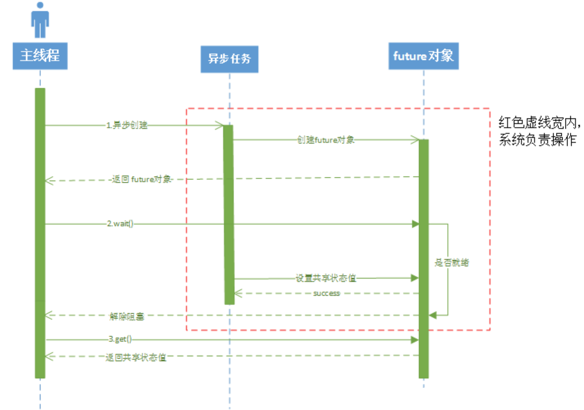

# 线程

Owner: -QVQ-

# 线程

## 线程的比较

**thread和async的比较：**

- 使用`thread`创建线程必须有`join`来结束线程，容易忘记
- thread用指针传递数据不能控制线程对数据的访问
- 当创建大量线程时，thread创建失败会导致程序崩溃，async允许系统根据需求决定创建

**主进程和线程的通信方式：**

1. 用指针作为线程创建的入参
    
    用指针传递数据，而这意味着数据不能互斥
    
    > 用thread结合ref()将锁和数据都传入时，可以做到数据的互斥访问，但不能控制线程和主进程对数据访问的顺序，不能实现线程写后主进程读
    > 
2. `future`和`async`配合，`async`启动线程，`future`获得线程的句柄，线程内通过`return`返回值， 主进程通过`future`调用`get`得到值
    
    这种方式只能返回一个数据，同时`return`后，线程不能继续执行后面的内容
    
3. `shared_future`和`async`配合，支持多个线程读，主进程写
4. 创建一个`promise`对象通过`ref`作为线程创建的入参，线程内通过传入的`promise.set_value()`设置值，主线程通过`promise.get_future.get()`获得值
    
    > 可以把`promise`当成是`future`的封装类，`future`是不可变数据，作为入参传入线程主进程得不到数据，`promise`自动帮我们完成`future`的创建和拷贝
    > 

# 线程

## 线程的使用

`#include <thread>`

**线程的创建**：`thread 线程名(函数名,参数列表);`

`thread 线程名（）;`//创建空线程

`thread 线程1(线程2);`//线程拷贝

**线程的回收**：`线程名.join（）`

```cpp
void func1(){}
void func2(int a, char ch, const char *str){}

int main()
{
    thread t1(func1);   //子线程1
		thread t2(func2, 1, 'a', "mike");//子线程2
		
		t1.join();//等待线程结束（此函数会阻塞）
    t2.join();//如果线程函数有返回值，返回值将被忽略。
}
//在linux环境下 在编译中要加 -lpthread参数
```

如果不希望线程被阻塞执行，可以调用线程的**std::thread::detach**，将线程和线程对象分离，让线程作为后台线程去执行。但需要注意的是，detach之后就无法在和线程发生联系了，比如detach之后就不能再通过join来等待执行完，线程何时执行完我们也无法控制，但会随着调用它的线程结束而结束

**后台创建线程：**

`thread(函数名,参数列表).detach();`//不需要线程名

`线程名.detach();`//支持创建运行后，后续转为后台运行

**获取指定线程的id：**`线程名.id()`

**获取当前线程的id：**`this_thread::get_id()`

**获取cpu核心数:**`thread::hardware_concurrency()`//失败返回0

**线程睡眠**：`this_thread::sleep_for (chrono::seconds(1));`//休眠1秒

thread类是防拷贝的，不允许拷贝构造以及赋值，但是可以移动构造和移动赋值

**判断线程是否是有效的:**`线程名.joinable()`

通常无效是因为：

1. 由thread的缺省构造函数而造成的（thread()没有参数）。
2. 该thread被move过（包括move构造和move赋值）。
3. 该线程被join或者detach过。

线程函数的参数，即使是右值引用方式传递，不能修改外部的值，因为其实际引用的是线程栈中的拷贝，而不是外部实参.

> 所以这样的语法编不过:
`void thread_1(int &a){}`
`thread T1(thread_1, a)`
> 

**线程修改外部实参：**

`std::ref(参数)`（包装按引用传递的值）

`std::cref`（包装按const引用传递的值）

`thread t3(ThreadFunc1, std::ref(a));`//此时`ThreadFunc1`才可以修改a在外部的值

**线程中使用引用：**

```cpp
using namespace std;
void method(int & a){ 
	a++;
}

int main(){
    int a = 0;
    thread th(method,ref(a));//如果调用的函数参数为引用，这里就必须用ref()，否则报错
    //thread th2(method,a);  //编译出错
		cout<<a;//可能是0或1，要看线程运行到哪了
		th.join();//不回收线程会发生报错
		cout<<a;//1
}
```

## std::async

`#include<future>`

是一个函数没有成员函数

`async(Fn &&fn, Args&& …args)`

fn是个枚举值：

| launch::async | 0x1 (1） | 异步启动 |
| --- | --- | --- |
| launch::deferred | 0x2 (2) | 在调用future::get、future::wait时同步启动 |
| launch::async | launch::defereed | 0x3 (3) | 给操作系统而定，资源紧张用defereed |

> 注意：async返回的future对象的析构是异步的。
当由`std::async`返回的`std::future`对象超出作用域时，将调用`std::future`的析构函数。如果异步操作尚未完成，则析构函数将阻塞并等待操作完成才继续。
因此，如果调用`std::async`而不保存返回的`std::future`对象，则可能会导致意外的阻塞或死锁。
> 

```cpp
auto fut1 = std::async(std::launch::async, [] {
		 std::this_thread::sleep_for(std::chrono::milliseconds(5000)); 
			std::cout << "work done 1!\n"; 
     return 1;
});
// 这一步没有阻塞，因为async的返回的future对象用于move构造了fut1，没有析构
 
 std::cout << "Work done - implicit join on fut1 associated thread just ended\n\n";
 
 std::cout << "Test 2 start" << std::endl;
 std::async(std::launch::async, [] { 
			std::this_thread::sleep_for(std::chrono::milliseconds(5000)); 
			std::cout << "work done 2!" << std::endl; 
});
// 阻塞！因为async返回future对象是右值，将要析构，而析构会阻塞
```

### 处理异常

## std::future

为了获得async函数的返回值，future对象提供访问异步操作结果的机制，很轻松解决从异步任务中返回结果。

内部定义了原子对象，主线程通过自旋锁轮询

异步操作的创建者能查询等待std::future提取值，如果异步操作仍未提供值，则可能阻塞

- 唯一期望(unique futures，std::future<>) std::future的实例只能与一个指定事件相关联。
- 共享期望(shared futures)(std::shared_future<>) std::shared_future的实例就能关联多个事件

异步操作准备好发送结果给创建者时，它能通过接口（eg,std::promise::set_value std::future） 修改共享状态的值。唯一期望的定义

```cpp
template< class T > 
class future;
//数据有关的期望
template< class T > 
class future<T&>;
//数据无关的期望
template<>          
class future<void>;
```

```cpp
//获取结果
T get(); //返回结果
T& get(); //仅为future<T&>模板特化的成员
void get();//仅为future<void>模板特化的成员
//注意get这个值只能调用一次
```

如果不wait，直接调用get，等价于先调wait再调get

此时调用valid得到false，共享状态被释放，即future对象是一次性事件

```cpp
//状态
valid() //检查future是否拥有共享状态
void wait() const; //一直阻塞直到结果变得可用
//void的返回值存在是为了检测线程是否结束
```

`wait_for()` //等待结果到指定的时间间隔，如果仍未有结果则返回，若在这段时间内结束则返回`future_status::ready`。若没结束则返回`future_status::timeout`。

若async是以`launch::deferred`启动的，则**不会阻塞**并立即返回`future_status::deferred`

```cpp
future<void> fut = async(launch::async, count_big_number);
while (fut.wait_for(chrono::seconds(1)) != future_status::ready)
		cout << '.' << flush;
```

`wait_until()` //等待结果到指定的时间点，如果仍未有结果则返回
例子：


举个栗子

```cpp
#include <iostream>
#include <future> // std::async std::future
using namespace std;

template<class  Args> 
decltype(auto) sum(Args args) {//这个自动推导返回值
	return  args;
}

int main() {
	// 注：这里不能只写函数名sum，必须带模板参数
	future<int> val = async(launch::async, sum<int>, 100);//获得一个future对象
	cout << val.get() << endl;//阻塞等待线程结束并获得返回值
	return 0;
}//输出100
```

## std::shared_future

比起future，这个可以共享给多个线程读取

```cpp
#include <iostream>
#include <future>
#include <chrono>
#include <thread>

using namespace std;

void print(shared_future<int> fut) {
    cout << "正在等待主线程传来的值..." << endl;
    int x = fut.get();  // 阻塞直到共享状态准备好
    cout << "取得的值是：" << x << endl;
}

int main() {
    promise<int> prom;
    shared_future<int> fut = prom.get_future().share();
		//允许多个线程读取数据，而future不支持
    thread t1(print, fut);
    thread t2(print, fut);
		//主线程设置数据
    this_thread::sleep_for(chrono::seconds(2));
    prom.set_value(10);

    t1.join();
    t2.join();

    return 0;
}

```

## std::promise

thread不像asyn一样可以传递future对象获得返回值

所以可以通过引用获得返回值，

promise是future的一个包装，future的值不能改变，所以promise通过创建一个新的future来实现修改

```cpp
//构造函数
template <class Alloc> promise(allocator_arg_t aa, const Alloc& alloc)
//与默认构造函数相同，但使用特定的内存分配器alloc构造对象
promise (promise&& x) noexcept//构造一个与x相同的对象并破坏x
```

```cpp
//线程内调用的函数
void set_value (const T& val)
void set_value (T&& val)
void promise<R&>::set_value (R& val)
void promise::set_value (void)
//设置promise的值并将共享状态设为ready

//线程外调用
future get_future()//构造一个future对象，值、状态都和promise相同

shared_future share()//得到一个shared_future对象
```

例子：利用引用和promise实现返回值

```cpp
#include <iostream>
#include <thread>
#include <future> // std::promise std::future
using namespace std;

template<class Args> decltype(auto) sum(Args&& args) {
	return (args);
}

template<class Args> void sum_thread(promise<long long>& val, Args&& args) {
	val.set_value(sum(args));
}

int main() {
	promise<long long> sum_value;
	thread get_sum(sum_thread<int>, ref(sum_value), 100);
	cout << sum_value.get_future().get() << endl;
	get_sum.join(); 
	return 0;
}
```

## std::this_thread

<thread>头文件中，std::this_thread这个命名空间，可以很方便地对线程直接控制

`get_id()`  获取当前线程id

`void sleep_for( const std::chrono::duration<Rep, Period>& sleep_duration )` 等待一段时间

`void yield()` 暂时放弃线程的执行， 将主动权交给其他线程

```cpp
#include <iostream>
#include <thread>
#include <atomic>
using namespace std;
atomic_bool ready = 0;

void sleep(uintmax_t ms) {
	this_thread::sleep_for(chrono::milliseconds(ms));
}
void count() {
	while (!ready) this_thread::yield();//一开始所有线程都会阻塞在这
	for (int i = 0; i <= 20'0000'0000; i++);
	cout << "Thread " << this_thread::get_id() << " finished!" << endl;
	return;
}
int main() {
	thread th[10];
	for (int i = 0; i < 10; i++)
		th[i] = thread(::count);
	sleep(5000);
	ready = true;//这里将对线程作通知，所有线程cout
	cout << "Start!" << endl;
	for (int i = 0; i < 10; i++)
		th[i].join();
	return 0;
}
/*
Start!
Thread 2936 finished!
Thread 21764 finished!
Thread 17712 finished!
Thread 10008 finished!
Thread 8928 finished!
Thread 15508 finished!
Thread 16252 finished!
Thread 15632 finished!
Thread 21092 finished!
Thread 21032 finished! */
```

# 信号量

c语言中的信号量在头文件`<semaphore>` 中

# 条件变量

```cpp
void wait (unique_lock<mutex>& lck);
template<classPredicate>
void wait (unique_lock<mutex>& lck, Predicate pred);
```

wait有两种重载，

第一个参数是lock，第二个是等待条件

线程阻塞并解锁互斥量，直到有人唤醒它，

如果wait没有第二个参数，直接解锁并阻塞等待

如果wait有第二个参数，不满足则阻塞，被唤醒后，获取互斥量后继续判断第二个参数，false则解锁休眠，true则向后执行

```cpp
atomic<int> stop_;
mutex lock_;
condition_variable conv_;

if (cv.wait_for(lck, chrono::seconds(5), []{ return stop_.load(); }) == cv_status::timeout) {
	printf("ready is still false");
}
```

持有期间间断释放锁lck，判断ready的值是否为true，如果5秒内依然不为true，返回`cv_status::timeout` 

如果5s内收到通知，依然要判断ready的值是否为true，不为true依然阻塞

wait_for结束后lck是上锁状态

测试用例：

```cpp
class stu{
	atomic<int> stop_;
	mutex lock_;
	condition_variable conv_;
};
void test(stu& s) {
	printf("prt: %d\n", &s);
	unique_lock<mutex> lk(s.lock_);
	cout << "now start" << clock() << endl;
	s.conv_.wait_for(lk, chrono::seconds(5), [&]() {return s.stop_.load();});
	cout <<"now end" << clock() << endl;//确实是等了5s才结束
}
void test1(stu& s) {
	Sleep(2000);
	printf("prt: %d\n", &s);//输出了相同的类地址
	unique_lock<mutex> lk(s.lock_);
	cout << "now notify" << clock() << endl;
	s.conv_.notify_all();
}

int main()
{
	stu s;
	thread t1(test, ref(s));
	thread t2(test1, ref(s));
	t1.join();
	t2.join();
```

# 锁

## 概念

**悲观锁**：一种悲观的态度类来防止一切数据冲突，上锁后其他人不能对其操作，数据库通常是悲观锁

可以保证数据的独占性和正确性，但性能低

**乐观锁**：对于数据冲突保持一种乐观态度，操作时不加锁，通过业务实现锁的功能

数据提交时才通过机制来验证数据是否存在冲突（加版本号，进行版本号对比方式实现）

提高了性能，但在并发非常高的情况下会导致大量的请求冲突，使得大部分操作无功而返，从而不适用于高并发场景

> 通常只在冲突概率很低，上锁代价较高时，才使用乐观锁
> 

### **乐观锁的实现——版本号机制**

A、B线程同时访问数据1，A修改数据1并提交，提交时会把之前查询到的version号和现在的数据的version进行比较，相同则提交，不同则视为数据过期


### **乐观锁的实现——CAS机制（compare and swap）**

3个操作数：

需要读写的内存位置(V)

预期的原值（A）

拟写入的新值（B）

如果V==A，则将该值更新为B，如果不相等则什么都不做（或者轮询）

然后返回V的值

> 判断相等并决定是否更新这个为原子性操作，由CPU在硬件层面保证
> 

C++11中的原子性锁

`template**<** class T **>** **bool** atomic_compare_exchange_weak( std**::**atomic***** obj,T***** expected, T desired );`

`template**<** class T **>** **bool** atomic_compare_exchange_weak( **volatile** std**::**atomic***** obj,T***** expected, T desired );`

**CAS的ABA问题**

> 变量值X=100
发起了两次-50的请求，一条线程1成功了，另一条线程2阻塞中
线程3抢占发起+50的请求成功，X为100，线程2阻塞
线程2执行，发现值没有变，执行X=50
理想中，发起的两次请求，线程2发现线程1执行了应该终止
> 

即，CAS是检测值有没有变化才更新的，但实际值发生了变化

解决这个问题，需要增加版本号

## mutex 独占的互斥量，不能递归使用 *C++11*

timed_mutex 有超时功能的独占互斥量，*C++11*

`#include <mutex>`

声明一个互斥量：`mutex g_lock`; 

**上锁**：`g_lock.lock();`

**解锁**：`g_lock.unlock();`

**尝试锁定互斥量**，得不到程序继续往下执行`g_lock.try_lock()`

等待一定时间`chrono::seconds timeout(1)`

```cpp
#include <iostream>
#include <mutex>
#include<thread>
using namespace std;
int i = 0;
void thread_1() {
	mutex g_lock;
	while (1) {
		if (g_lock.try_lock()) {
			i++;
			g_lock.unlock();
			break;
		}
	}
}
int main() {
	thread th[100];
	for (int i = 0; i < 100; i++) {
		th[i] = thread(thread_1);
	}
	for (int i = 0; i < 100; i++) {
		th[i].join();
	}
	cout << i << endl;//100
	return 0;
}
```

## recursive_mutex （recursive_timed_mutex）递归互斥量，能递归使用 *C++11*

递归锁

允许同一个线程对同一个锁对象多次上锁，获得多层所有权，解锁需要与上锁的调用次数相同

`lock()`

未上锁则上锁，被其他线程上锁，则阻塞，若自己线程上过锁则再次调用该函数上锁，获得新的所有权级

`bool try_lock()`

未上锁则上锁，被其他线程上锁，则返回false，若自己线程上过锁则再次调用该函数

`void unlock()`

释放一个权级

`native_handle_type native_handle()`

获得原始句柄。该函数需要库函数支持时才存在于recursive_mutex对象中。该函数会返回于对象相关的可用于访问具体应用信息的值。

**原理：**

可重入锁（recursive lock）是一种特殊的互斥锁，允许同一线程多次获取锁而不会发生死锁。：

可重入锁内部维护一个线程 ID 变量，记录当前持有锁的线程 ID，当同一线程再次获取锁时，先检查线程 ID 是否与记录的相同，如果是，则增加计数器，否则执行阻塞等待。释放锁时，递减计数器，直到计数器为 0 时才将线程 ID 置为无效状态

在 C++11 中，标准库提供了 `std::recursive_mutex` 类来实现可重入锁，它内部已经实现了线程 ID 或计数器的处理，可以直接在程序中使用。

## shared_timed_mutex 具有超时机制的可共享互斥量 *C++14*

shared_mutex 共享的互斥量 *C++17*

用于数据免受多个线程同时访问的同步原语

### 排他性，仅一个线程能占有互斥

`void lock()` 锁定互斥，若互斥不可用则阻塞

`bool try_lock（）` 尝试锁定互斥，若互斥不可用则返回

`try_lock_for（timeout_duration）` 尝试锁定互斥，若互斥在指定的时限时期中不可用则返回，若传入时间小于等于0则等同try_lock()

```cpp

std::shared_timed_mutex mutex;
if(mutex.try_lock_for(std::chrono::milliseconds(100))){}
```

`try_lock_until(timeout_duration)` 尝试锁定互斥，若直至抵达指定时间点互斥不可用则返回

```cpp
std::shared_timed_mutex test_mutex;
test_mutex.try_lock_until(std::chrono::steady_clock::now() + std::chrono::seconds(10));
```

`void unlock()` 解锁互斥

### 共享，多个线程能共享同一互斥的所有权

共享有上线，通常为10000

`void lock_shared(void)` 为共享所有权锁定互斥，若互斥不可用则阻塞

`bool try_lock_shared()` 尝试为共享所有权锁定互斥，若互斥不可用则返回

`try_lock_shared_for(timeout_duration)` 尝试为共享所有权锁定互斥，若互斥在指定的时限时期中不可用则返回

`try_lock_shared_until(timeout_duration)` 尝试为共享所有权锁定互斥，若直至抵达指定时间点互斥不可用则返回

`void unlock_shared()` 解锁互斥（共享所有权）

## 锁的智能分配

### lock_guard

`mutex mt;`

`lock_guard<mutex> guard(mt);`

调用lock_ guard的构造函数上锁，当调用析构函数的时候自动解锁，可以避免使用mutex加锁时忘了解锁

但在定义lock_guard的地方会调用构造函数加锁，在离开定义域的话lock_guard就会被销毁解锁，如果这个定义域范围很大，锁的粒度就很大，影响效率

注意，如果使用了`lock_guard<std::mutex>`，意味着函数结束后自动执行一遍解锁操作，因此在函数内手动解锁，将导致函数结束后重复释放锁而报错

```cpp
#include <iostream>
#include <mutex>
#include<thread>
using namespace std;
int i = 0;
void thread_1() {
	mutex g_lock;
	lock_guard<std::mutex> locker(g_lock);
	i++;
}
int main() {
	thread th[100];
	for (int i = 0; i < 100; i++) {
		th[i] = thread(thread_1);
	}
	for (int i = 0; i < 100; i++) {
		th[i].join();
	}
	cout << i << endl;
	return 0;
}
```

但在定义lock_guard的地方会调用构造函数加锁，在离开定义域的话lock_guard就会被销毁解锁，如果这个定义域范围很大，锁的粒度就很大，影响效率

### unique_lock

`mutex mt;`

`unique_lock<mutex> unique(mt);`

在构造函数加锁，用unique.unlock()解锁，在析构函数的时候会判断是否已经解锁了来决定要不要解锁

比起lock_guard多了个unique.unlock()来实现中途解锁

但，unique_lock内部维护一个锁的状态，效率上会更慢

# 原子操作

`#include <atomic>`

**`template** **<class** **T>** **struct** **atomic**;`

在多个线程中对这些类型的共享资源进行操作，编译器将保证这些操作都是原子性的，从而提供比普通mutex更好的性能

多线程对原子数据类型作运算时，不需要锁

原子数据类型：`atomic<long> total = {0};`

atomic_int是atomic<int>的别名

```cpp
#include <iostream>
#include<atomic>
#include<thread>
using namespace std;
//atomic<int> i = 0;
atomic_int i = 0;//atomic_int是atomic<int>的别名
void thread_1() {
	i++;
}
int main() {
	thread th[100];
	for (int i = 0; i < 100; i++) {
		th[i] = thread(thread_1);
	}
	for (int i = 0; i < 100; i++) {
		th[i].join();
	}
	cout << i << endl;
	return 0;	
}
```

atomic_flag是atomic<flag>的别名

初始化 `std::atomic_flag flag = ATOMIC_FLAG_INIT;`

`test_and_set()`，将标志位置设为true，并返回之前的值

`clear()`，将标志设为false

通常用于简单的互斥锁

```cpp
#include <iostream>
#include <atomic>
#include <thread>

std::atomic_flag flag = ATOMIC_FLAG_INIT;

void func(int id) {
    while (flag.test_and_set(std::memory_order_acquire)) {
        // 等待其他线程释放锁
    }

    // 业务处理   
 
    flag.clear(std::memory_order_release);  // 释放锁
}

int main() {
    std::thread t1(func, 1);
    std::thread t2(func, 2);
    
    t1.join();
    t2.join();
    
    return 0;
}
```

## 原子操作

原子类的成员函数

```cpp
**void** **store**(T desired, std**::**memory_order order **=** std**::**memory_order_seq_cst) **noexcept**;
//写入值
//desired：要存储的值，
//order：存储操作的内存顺序。默认是std::memory_order_seq_cst（顺序一致性）

T load(memory_order order = memory_order_seq_cst) const noexcept;
//读取值，返回读取的结果

T exchange( volatile std::atomic<T> obj, T desired );
//将obj对象的值替换成desired，并返回旧值

winner.exchange(true)

bool is_lock_free() const volatile noexcept;
//检查当前atomic对象是否支持无锁操作，不会涉及数据竞争

bool compare_exchange_strong( T& expected, T desired, std::memory_order success, std::memory_order failure );
//当前值和expected相等时，当前值修改为desired，返回true
//当前值和expect不等时，将expect修改为当前值，返回false

bool compare_exchange_weak( T& expected, T desired, std::memory_order success, std::memory_order failure );
//weak版比起strong允许出乎意料的返回（比如在字段值和期待值一样的时候却返回了false），在循环算法中是可接受的
```

例子：无锁链表

CAS方法

```cpp
 1 template<typename T>
 2 class lock_free_stack
 3 {
 4 private:
 5   struct node
 6   {
 7     T data;
 8     node* next;
 9 
10     node(T const& data_): 
11      data(data_)
12     {}
13   };
14 
15   std::atomic<node*> head;
16 public:
17   void push(T const& data)
18   {
19     node* const new_node=new node(data); 
20     new_node->next=head.load();  //如果head更新了，这条语句要重来一遍
21     while(!head.compare_exchange_weak(new_node->next,new_node));
22   }
23 };
```

| fetch_add | 添加到包含的值并返回它在操作之前具有的值 |
| --- | --- |
| fetch_sub | 从包含的值中减去，并返回它在操作之前的值。 |
| fetch_and | 读取包含的值，并将其替换为在读取值和 之间执行按位 AND 运算的结果。 |
| fetch_or | 读取包含的值，并将其替换为在读取值和 之间执行按位 OR 运算的结果。 |
| fetch_xor | 读取包含的值，并将其替换为在读取值和 之间执行按位 XOR 运算的结果。 |

也可以用++自增自减

- 用CAS代替原子操作的++（没有意义）
    
    ```cpp
    void thread1(atomic_int& atint) {
    	for (int i = 0; i < 1000000; i++) {
    		int wa = atint.load();
    		int ne = wa + 1;
    		while (!atint.compare_exchange_weak(wa, ne))ne = wa + 1;
    	}
    }
    int main()
     {	
    
    	clock_t start = clock();
    	atomic_int atint = 0;
    	thread t1(thread1, ref(atint));
    	thread t2(thread1, ref(atint));
    	t1.join();
    	t2.join();
    	cout << atint << endl;
    	clock_t end = clock();
    	cout << "-----------------------" << endl;
    	cout <<"         " << end - start << endl;//126
    	cout << "-----------------------" << endl;
    	return 0;
    }
    //直接++atint，约20左右。。。。。。。。。。。。。。。。。
    ```
    

## 内存次序

**C++11的6种原子变量的内存次序对应三种内存模型**

不同内存次序模型在不同CPU架构下有不同代价

1. **顺序一致次序(sequential consisten ordering)** 
    
    **`memory_order_seq_cst`.**
    
    默认内存序，将程序看作简单序列，对一个原子变量的操作顺序一致，等同以特定顺序单线程执行
    
2. **松弛次序(relaxed ordering)** 
    
    **`memory_order_relaxed`**.
    
    只保证load和store是原子操作，不提供跨线程的同步
    
    程序计数器是个典型场景，统计多个程序对一个值的调用次序
    
3. **获取-释放次序(acquire-release ordering)**
    
    **`memory_order_release`.** 原子store操作（写），
    
    多线程中，保证写在读前面
    
    保证对下一个acquire或consume操作的synchronizes-with，其他线程可见
    
    **`memory_order_consume`**
    
    通常与memory_order_release对应
    
    保证多线程下，store、load操作能先写后读
    
    **`memory_order_acquire`**. 原子load操作（读），
    
    通常与memory_order_release对应
    
    比起consume，还能保证release之前的操作也能完成
    
    保证对最新的release或者sequentially consistent操作synchronize，其他线程对该变量的存储结果可见
    
    - 例子
        
        ```cpp
        std::atomic<bool> ready{ false };
        std::atomic<int> var = { 0 };
        int data1 = 0;
        
        void sender()
        {
            data1 = 42;                                              // A
            var.store(100, std::memory_order_relaxed);              // B
            ready.store(true, std::memory_order_relaxed);           // C
        }
        void receiver()
        {
            while (!ready.load(std::memory_order_acquire));        // D
            //比起用consume更加strong
            assert(data1 == 42);  // never failed                    // E
            assert(var == 100);  // never failed                    // F
        }
        
        int main()
        {
            std::thread t1(sender);
            std::thread t2(receiver);
            t1.join();
            t2.join();
        }
        ```
        
    
    **`memory_order_acq_rel`**. 
    
    同时包含memory_order_acquire和memory_order_release
    
    在`compare_exchange_strong` 中使用
    
    - 例子
        
        ```cpp
        #include <thread>
        #include <atomic>
        #include <cassert>
        #include <vector>
         
        std::vector<int> data;
        std::atomic<int> flag = {0};
         
        void thread_1()
        {
            data.push_back(42);
            flag.store(1, std::memory_order_release);
        }
         
        void thread_2()
        {
            int expected=1;
            while (!flag.compare_exchange_strong(expected, 2, std::memory_order_acq_rel)) {
                expected = 1;
            }
        }
         
        void thread_3()
        {
            while (flag.load(std::memory_order_acquire) < 2)
                ;
            assert(data.at(0) == 42); // will never fire
        }
         
        int main()
        {
            std::thread a(thread_1);
            std::thread b(thread_2);
            std::thread c(thread_3);
            a.join()
        ```
        
    
    > 注意：volatile关键字能防止指令被编译器优化， 但不能提供原子性和线程间的同步保证
    > 

# 智能指针的线程安全

智能指针有两个变量：引用计数器、指针

引用计数器是用原子变量实现的（`atomic<int>* j`），因此自增减是线程安全的

但指针指向的具体空间并不是线程安全的

问题：

当智能指针发生拷贝行为时，先执行指针对象的拷贝，再执行计数器+1拷贝，这两个过程并不是原子性的

1. 线程1拷贝了指针对象，还没拷贝引用计数器时，切换线程
2. 线程2修改了这个指针的指向对象，并完成了引用计数器的修改
3. 回到线程1，继续拷贝引用计数器，
4. 此时这个指针的指向对象已经修改了，线程1的智能指针指向错误的地址


文字版本：

因为智能指针拷贝时复制地址和增加引用计数器不是原子的，两个线程读写同一个智能指针对象时，读线程先拷贝了地址，写线程释放了智能指针，减少了引用计数器为0，触发了内存的释放，此时读线程再执行引用计数器的修改。此时读线程指向的地址是被释放了的地址，成了悬空指针

**多线程代码操作的不是同一个shared_ptr对象，此时没有问题：**

shared_ptr不是同一个对象，但是共用的一个引用计数，指向的地址是同一个，这样是不会出现非预期的异常行为

例如

- 线程以值的形式传入
- 函数以值传递

此时如果对指针指向的改变是安全的

# STL的线程安全

一个方式是上锁

另一个方式是固定vector的大小（通过reserve()或者resize()来固定，后者可以把空间分配这个过程提前，从而减少运行时的分配耗时），避免动态扩容

使用时，不同线程用下标直接访问元素（避免动态扩容或数据增删时，迭代器失效），可以结合环形队列，给成员变量加读写标记，用原子变量标识队头尾