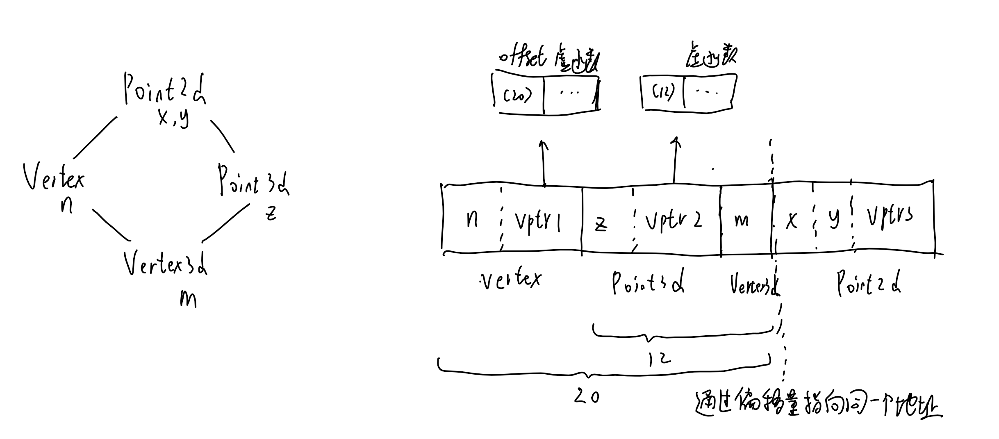

# 关于对象

比起c语言，C++将函数和数据放到一起，使两者关联，给编程带来益处，而带来内存和性能代价主要由virtual引起：

- 虚函数需要有虚函数表
- virtual base class，被共享的单一实例
- 多重继承的额外负担（内存增大，多个vptr）

## 对象模式

### 简单对象模式

class object由连续同样大小的slot构成，每个slot指向对象的一个member。

并没有编译器使用这种方式，只是为了降低编译器复杂度设计的

缺点是对对象的访问都需要经过指针中转，优点是对非静态数据成员的修改不需要重新编译

### 表格驱动对象模型

class object指向两个表格，Member Date Table(内含实际数据)和Function Member Table(内含函数地址)

缺点同样是需要进过指针中转访问速度慢，内存变大，优点是对数据的修改不需要重新编译所有相关代码

### C++对象模型

- class object内只有非静态数据成员(nonstatic data members)
- 静态数据成员、静态函数和非静态函数放在class object之外有单独的区域
- 虚函数，class object产生指向虚函数表（vtbl，virtual table）的指针vptr，每个class对应一个vtbl，vtbl内第一个slot指向类型信息对象（用于RTTI（runtime type identification）），还有一堆指向虚函数的指针

> vptr的setting和resetting都由每个class的constructor\destructor和copy assignment运算符自动完成

加上继承的虚函数表，虚继承中，base class不管被派生（derived）多少次，都只有一个实例（subobject）

简单模型中，在derived class object中，存在多个slot指向它的多个base class subobject。这个模型优点在于空间和存取时间效率，缺点是对非静态数据成员的修改需要重新编译程序

虚继承的一种实现方案是采用类似虚函数表的实现，引入一个基类表和基类表指针，或者是直接扩充虚函数表。优点和虚函数表的优点一样，能让所有的派生类都有一致的内存表现方式，且修改base class无序改变class objects。缺点和虚函数表的缺点一样，对数据的访问需要经过指针，空间和存取效率低

虚继承不论哪种实现方案，都会出现随着继承的深度，经过指针的‘间接性’增加带来的效率问题

？ 早期的c++采用将base class subobject中的data members放到derived class object中的方案，获得了访问基类数据最快的速度，代价是每次修改基类数据，都要重新编译所有用到这个基类数据的代码

## 关键词带来的差异

为了适配c语言，引入了额外的规则

`int (*pf)();`从语言层面无法判断这是声明还是调用时，额外的规则会将其判断为声明

从语言上struct关键字和class关键字大多时候可以互换和混着使用，例如class继承struct，模板中同时使用struct声明和调用，保留struct是为了让c使用者更好的迁移，引入class是为了强调ADT（abstract data type）观念

而什么时候使用struct和class不是语言问题，而是开发理念、规范一类问题

### 策略性正确的struct

c语言中struct有一种妙用，将struct的最后一个member设定为一个指针，每次使用按需给这个struct分配内存：

```c
struct mumble{
    //stuff
    char pc[1];
};
//此时通过pc获得了一个变长数组
struct mumble *p = (struc mumble*)malloc(/*自定义的长度*/);
p->pc[/*自定义的访问*/]
```

但在C++中，不要这么做，因为c++标准中，

- 同个**access sections**（存取区段，class中的public、private、protected三种段落）中数据其声明顺序和在内存布局中一致，但不同access sections的数据在内存中排列不一定
- **derived class**中base class的数据可能出现在derived class的data members的任意位置
- **vptr**也可能出现在derived class 中的 data members的任意位置

如果需要c++中class的一部分有c的模样，那么将这一步独立出来为一个单独的struct。不要用继承，而是用组合来实现

当要传递一个复杂class object的部分或全部到某个C函数去时，struct声明可以将数据封装起来，使其有和C兼容的空间布局。

## 对象的差异

### 程序范式

C++有三种programming paradigms(程序设计范式)：

- 程序模式（procedural model），例如c语言中对字符串的操作
- 抽象数据类型模型（abstract data type model, ADT），数据和一组表达式（public）接口一起提供，运算定义是隐藏起来的，例如c++中使用string操作字符串
- 面向对象模型(object-oriented model)，通过一个抽象的base class提供共同的公共接口，实例都从base class派生出来

同一种paradigm有助于程序的稳固，混合了多种paradigm可能导致开发的混乱：

当用OO paradigm的方式来定义如下数据：

```cpp
class Library_materials;
class Book : public Library_materials;

Library_materials thing1;
Book book;
```

却用ADT的方式来使用他

```cpp
thing1 = book;// 这是ADT的方式，导致book被裁剪了
thing1.check();//调用的是Library_materials而不是Book里的函数
```

正确的做法应该是用pointer或reference来做间接处理

```cpp
Library_materials &thing2 = book;
thing2.check();//引用同指针一样会走虚函数表
```

ADT和OO paradigm的对比：

- ADT patadigm中，处理的是单一类型的实例，在编译时已经确定好了类型，

- OO paradigm中，操作的object只有在到达它执行的时刻才能确定他的类型，只有通过pointers和reference才能动态解析

下面将探讨OO model的特点

### C++如何实现多态

多态一定需要经过指针或引用来实现，**以引用和指针获取到的对象一定是动态运行的，但普通的值传递的函数调用是静态的**，可能走虚函数表也可能不走，在编译时就确定了它会调用的函数，下面的例子能说明

<details>
  <summary>点击展开代码</summary>
  <pre><code>
class stu {
    public:
        virtual int add(int &a) {
            return a + 2;
        }
};
class stu1 : public stu {
    public:
        virtual int add(int& a) {
            return a + 1;
        }
};
void test(stu* s1, stu& s2, stu s3)
{
    int a = 0;
    cout << s1->add(a) << endl;// 1, 运行的stu1::add
    cout << s2.add(a) << endl;// 1, 运行的stu1::add
    cout << s3.add(a) << endl;//2, 运行的stu::add
}
// 测试程序
int main() {
    stu1 s;
    test(&s, s, s);
}
  </code></pre>
</details>

c++支持多态只存在于public class体系中，nonpublic class和void指针可以说是多态的，但并没有被语言支持，C++以下列方式实现多态：

- 经过隐式转换，`shape* ps = new circle()`，编译器判断（一般只是指针类型改变了，多重继承下，shape为第二以后的父类需要将指针往后偏移）
- 经过虚函数表，`ps->rotate()`，运行期判断（经过vptr）
- 显示转换和typeid，`circle *pc = dynamic_cast<circle*>(ps)`，运行期（通过vptr查询vtbl中的RTTI）

typeid和dynamic_cast都依赖于vtbl，vtbl中的RTTI结果包含类的信息和继承层次关系信息

一个class object的大小：

- 其nonstatic data members的总和
- 由内存对齐（alignment）而填补（padding）的空间
- 虚函数表

### 在对象模型中指针的作用

不管指向什么类型，指针和引用的大小都是固定（64位上为8bytes）的，指针类型会告诉编译器如何解释某个指针指向的类型，这个指针指向的地址的范围是多少。所以转换（cast）是编译器指令，告诉被指向内容的解释方式

对于多态对象的指针类型，在编译时期决定了他的可用接口和接口的access level，在运行时每一个执行点时，决定了实际调用的实例。类型信息维护在link之中，link存在于vptr和vtbl之间

例如，如果ZooAniaml是Bear的基类，对于如下类型

```cpp
Bear b;
ZooAniaml *pz = &b;
Bear *pb = &b;
```

指针ZooAniaml指向内存涵盖的只包含Bear对象中ZooAniaml的那一部分，因此用pz调用Bear专属的成员函数是不合法的，虽然pz指向Bear对象。如果要调用需要转换为Bear对象再调用

正是这样的特性，使得指针不会直接操作内存，只是拥有内存的位置和解释方式

### 为什么多态的实现只能通过指针和引用

再回到用值传递的方式为什么不能触发多态的话题，对于如下例子

```cpp
Bear b;
ZooAniaml za = b;//b被裁剪了，只保留了ZooAniaml类型的那部分
za.rotate();//调用ZooAniaml的rotate
```

首先对于`ZooAniaml za = b`这样的赋值构造，编译器会在初始化和指定（assignment）操作之间做取舍，当对象中存在vptr时，并不会拷贝vptr（za不用b初始化vptr），因此za的vptr并不指向Bear对象的vptr，同时不会改变b中的vptrs的内容

其次`za.rotate()`调用，za本质上是一个ZooAniaml

OO程序设计中，并不支持对object的直接处理，通过pointer和reference来访问对象并不会触发内存中任何“与类型有关的内存委托操作（type-depedent commitment）”，它们只是决定指向的内存位置和解释方式，从而能实现多态

当一个base class object被直接初始化为一个derived class object时，为一个确定的对象，多态不再呈现，编译器可以通过inline等在编译时直接解析一个操作，从而绕过virtual操作

总的来说，C++也支持ADT风格，称为object-based(OB)，例如string。OB可能比对等的OO设计更快更紧凑，因为没有虚函数表的存放，也没有虚函数指针的中转操作，所有操作都在编译时期解析完成，但OB没有OO的弹性，不支持类型的扩充

# 构造函数语意学

编译器往往按照字面意思来理解程序而不是按照实际意图，常出现的错误是发生在隐式转换中，一个例子是

```cpp
if(cin)……
//为了能让cin被if支持引入cin转为int
class cin_class{
    operator int(){
        ……
    }
}
//但使用时错误的使用了它，原本应该是cout
cin << 1;//理想中这个程序应该编译报错，但实际上他是能正常运行的，<<被解释成立左移运算符，从而出现了意料之外的行为
```

而这样类似的错误常发生在memberwise initialization或NRV上，这一章将介绍编译器这类错误的干涉，以及对程序形式和效率的冲击

## default constructor的构造操作

cpp会自动生成默认构造，为了避免不同的编译模块（不同的文件）生成多个default constructor，default constructor、copy constructor、destructor、assignment copy operator都是以inline的方式完成，不会被其他文件看到，不适合inline的则合出一个static实例

cpp中，global object会自动初始化为0，local object不会，所以构造函数并不能完成初始化数据的使命，初始化数据是程序员的工作，编译器需要做的是能够正确创建object，能通过object找到对应的数据。

对于一个class，如果没有任何user-declared constructor，那么会有一个default constructor被implicitly声明，而这个default constructor大多时候是trivial(没用的)的。下面4小节讨论会生成nontrivial default consttructor的四种情况

### 类中有default constructor 的member class object

即这个类存在一个有default constructor的成员，那么在这个constructor被调用时就会为其生成一个default constructor

例如：

```cpp
class Foo{
public:
    Foo()
    ……
}
class Bar{
public:
    Foo foo;
    char *str;
}
```

这个场景下，编译器为了完成构造Bar类的职责，会在生成的default constructor里，调用成员Foo的default constructor，但str的初始化不是编译器的职责，是程序员的职责。如果有多个需要初始化的class member objects，编译器会以member objects在class中的声明顺序来调用

如果这里程序员写了explict default constructor，其中初始化了str，却没有调用Foo的构造函数，像下面这样

```cpp
class Bar{
public:
    Bar():str(nullptr){}
    Foo foo;
    char *str;
}
```

由于已经定义了一个default constructor，编译器没法再生成一个，因此编译器会**拓展**现有default constructor，安插调用Foo的default constructor的代码

### 类中有default constructor的base class

同上

如果同时有有default constructor的member object和base class，会先调用base class的，再调用member object的

```cpp
Bar():Foo(){}//显示指出父类的构造，此时不会再插入调用父类构造的代码
Bar(){
	Foo();//这属于额外调用一次父类构造，加上编译器插入的调用父类构造的代码，一共调用了两次父类构造
}
```

### 带有virtual function的class

即class中声明或继承了一个virtual function

在编译期间会发生：

1. 编译器为每个class生成一个vtbl

2. 每个class object对象中，生成一个vptr，指向vtbl

3. 虚拟函数的调用操作会被改写

   改写前：`widget.flip()`

   改写后：`(*widget.vptr[1])(&widget)`

   即将接口调用转换为调用虚函数表的指定位置，并将自己作为入参

为了完成这个任务，构造函数会为每个object的vptr设置初值，存放virtual table的地址。如果没有构造函数就生成，有就在其中安插代码来完成这个工作

### 带有一个virtual base class的class

不同编译器对virtual base class的实现差异很大，对于如下例子

```cpp
class X {
public:
	int i;
};
class A : public virtual X{
public:
	int j;
}

void foo(const A* pa){
	pa->i = 1024;
}
```

这里A是虚继承的方式，为了能找到基类X的位置，一个可能的编译器转变操作为：`pa->__vbcX->i = 1024`，其中__vbcX表示编译器产生的指向virtual base class的指针

这个操作以同样的方式在default constructor中完成

- 调用基类的default constructor
- 生成vtbl
- 将vptr初始化，定位virtual base subobject
- 改写操作

## Copy Constructor的构造操作

拷贝操作发生在如下情况：

- 初始化赋值操作：`A a=b`
- 值传递：`func(A a)`
- 返回值可能触发拷贝：`return a;`

拷贝操作触发的函数为`X(const X& x)`,如果有后继参数，其都必须有默认值

### 拷贝函数的调用

对于如下四种拷贝函数：

- `X(X& x)`
- `X(const X& x)`
- `X(const X&& x)`
- `X(X&& x)`

他们可以同时存在

其中有const 和没有const 的区别在于入参能传递的对象，没有const的拷贝函数不能传入const对象，而有const的拷贝函数可以

右值拷贝和左值拷贝，如果一个场景两个都可以调用，那么会优先调用右值拷贝

如果只有左值拷贝，那么一些用右值拷贝的场景也是可以用左值拷贝的，如下

```cpp
stu( stu& u) {	}

stu test(){
	stu a;
    return a;//ok
}
stu test1(){
    return stu();//error,除非增加移动拷贝
}
```

### default memberwise initialization

当class没有提供explicit copy constructor时，当一个object以另一个object作为初值时，并不是把一个object的内容拷贝一份到另一个object上，而是以递归的方式施行memberwise initialization，对于如下类，

```cpp
class String{
……
private:
  char *str;
  int len;
};

String noun("book");
```

执行

```cpp
String verb = noun;
```

等价于：

```cpp
verb.str = noun.str;
verb.len = noun.len;
```

如果类中有自定义对象，那么会递归的调用自定义对象的copy constructor

上面一套的操作的实现，从概念上是被一个copy constructor实现的，但实际上，一个编译器通常能为大部分class objects产生bitwise copies，当class展现出`bitwise copy semantics`时，这个copy constructor是trivial的，当class没有展现出bitwise copy semantics时，编译器才会产生一个nontrivial的copy constructor合入程序

### Bitwise Copy Semantics（位逐次拷贝）

满足bitwise copy semantics的情况

```cpp
class Word{
private:
    int cnt;
    char *str;
}
```

不满足的情况

```cpp
class Word{
private:
    int cnt;
    string str;
}
```

因此编译器必须合成一个copy constructor，以便调用string的copy constructor

什么时候一个class不展现出bitwise copy semantics，有4中情况：

1. class组合了一个声明了（隐式或显示）copy constructor的member object
2. class继承了一个声明了（隐式或显示）copy constructor的member object
3. class声明了virtual function
4. class继承链中，存在virtual base classes

前两种情况，是将copy constructor的调用操作安插到合成的copy constructor中，后两种则相对复杂，下面两部分将分别介绍这两种情况

### 有虚函数的class时

需要分情况，对于如下两个类：

```cpp
class ZooAniaml{
public:
    virtual void animate();
}
class Bear : public ZooAniaml{
public:
	void animate();
}

Bear yogi; //定义一个派生object
```

- 同类型的对象用值传递`Bear winnie = yogi`，可以直接靠bitwise copy semantics完成，这种情况下直接复制vptr值是安全的

- base class object和derived class之间做初始化操作时，`ZooAniaml Franny = yogi`，合成出来的ZooAniaml copy constructor会显示设定object的vptr值指向ZooAniaml class的vtbl，而不是直接从右手边的object中拷贝过来，其他部分赋值拷贝

### 有virtual base class subobject时

一个class object以另一个有virtual base class subobject的object作为初值，也会使bitwise copy semantics失效

首先copy constructor中将编译器生成的代码（调base class的default constructor，设置vptr并定位出subobject）插入，再以上一段提到的class以derived class初始化的方式做初始化

## 程序转换语意学（program transformation semantics）

这一章将讨论调用copy constructor的策略

### 显示的初始化操作（explicit initialization）

```cpp
X x0;//已定义了一个object

void foo(){//定义了三个object
    X x1(x0);
    X x2 = x0;
    X x3 = X(x0);
}
```

> c++中的定义是指占用了内存的行为

编译器将初始化赋值转换为汇编有两个必要的操作，上诉foo（）函数会被改写成：

```cpp
void foo(){
    X x1;//1. 重写每一定义，只分配内存不初始化
    X x2;
    X x3;
    
    x1.X::X(xo);//2.编译器安插的调用copy constructor操作
    x2.X::X(xo);
    x3.X::X(xo);
}
```

### 参数的初始化操作（argument Initialization）

```cpp
void foo(X xo);

X xx;
foo(xx);
```

C++标准中，将class object做参数传递给一个函数，或做为函数返回值，都相当于`X xx = arg`

一种编译器的实现方式是生成一个临时对象作为函数参数：

```cpp
X __temp0;
__temp0.X::X(xx);
foo(__temp0);//同时foo函数也必须转化为reference
//foo函数完成后对这个临时对象调用destructor
```

另一种编译器对实现方式是以copy constructor的方式将实际参数直接建在其应该在的地方

### 返回值的初始化

双阶段转化：

1. 给函数额外加上一个reference类型的参数，这个参数用来放置返回值
2. 在函数return前安插一个copy constructor操作

对于这样的代码：
```cpp
X bar(){
    X xx;
    //do……
    return xx;
}

X xx = bar();
```

转换后的伪代码大致如下：

```cpp
void bar(X &__result){
    X xx;
    xx.X::X();//编译器产生的default constructor
    //……
    __result.X::XX(xx);//编译器产生的copy constructor
    return;
}

X xx;//不需要调用default constructor
bar(xx);
```

同理，如果声明了一个函数指针`X (*pf)()`，将会变为`void (*pf)(X&)`

### 在使用者层面做优化（optimization at the User Level），绕过拷贝函数

对于这样的代码

```cpp
X bar(const T &y, const T &z){
    X xx;
    //以y,z对xx做一些处理
    return xx;
}
```

改写成：

```cpp
X bar(const T &y, const T &z){
    return X(y, z);//用constructor直接得到X，避免一次复制
}
```

转为汇编伪码变为：

```cpp
void bar(X &__result, const T &y, const T &z){
    __result.X::X(y, z);
    return;
}
```

这样有更高的效率，从先构造一个，再拷贝出去，变成了直接构造出来，但也会使这个类中出现大量特殊用途的constructor

### 在编译器层面做优化（Optimization at the Compiler Level）

Named Return Value（NRV）优化：

将如下代码：
```cpp
X bar(){
    X xx;
    //对xx做些处理……
    return xx;
}
```

编译器优化为：

```cpp
void bar(X &__result){
    __result.X::X();
    //直接处理__result……
    return;
}
```

NRV优化能带来程序效率的改善，但是也会带来一些问题：

- 编译器默默完成，使用者并不知道是否做了这个优化
- 一旦函数变的复杂，编译器的优化也难以进行
- 让程序变的不如预期，原本认为要执行copy constructor的地方没有执行

NRV优化需要类中有copy constructor，如果没有可能不会触发

对于下面三个操作，从语意上相等：

```cpp
X xx0(1);
X xx1 = X(1);
X xx2 = (X) 1;
```

但实际上后两个操作提供了两步，先生成一个临时的object并设以初值，再用拷贝构造作为explicit object的初值，再destructor这个临时对象，这里是否应该绕过拷贝操作，给了编译器很大的自由空间

即使是有了NRV优化，上诉提到的绕过拷贝函数的优化依然有必要

### 什么时候需要显示定义Copy Constructor

默认copy constructor本身就很高效，大多时候都不需要单独再显示定义Copy Constructor，除非class需要大量的memberwise初始化操作，且编译器支持NRV

一种实现的方式：

```cpp
Point3d::Point3d(const Point3d &rhs){
    //简单的实现
    _x=rhs._x;
    _y=rhs._y;
    _z=rhs._z;
    //更高效的实现
    memcpy(this, &rhs, sizeof(Point3d));
}
```

但用`memcpy`这种方式要注意，如果类有virtual function或内含一个virtual base class，那么编译器产生的内部members也会被改写，造成错误

> 显示的定义Copy Constructor更多是为了深拷贝?，现在编译器更智能了，NRV和显示定义Copy Constructor的关系更小

## 成员初始化队伍（member initialization list）

必须要使用member initialization list的场景：

- 初始化一个reference member
- 初始化一个const member
- 调用一个有参数的base class的constructor
- 调用一个有参数的member class的constructor

使用初始化列表可以避免先创建临时对象后拷贝，而是直接创建

注意，list中初始化顺序是按照class中members的声明顺序来的，而不是在initialization list中的排列顺序来的

```cpp
X::X(int val):j(val){
    i=j;
}
```

总是先初始化初始化列表，再调用explicit user assignment

在初始列表中调用函数`constructor():arg(func(arg1))`是可以的，但是最好在constructor中调用而不是在初始化列表中，因为不确定func对这个object的依赖性有多高，函数在执行时哪些成员设置了值是不确定的

同时也不建议用derived class的函数在derived class中的constructor里去调用base class constructor初始化base class 

# Data语意学

对于如下类，他们用sizeof得到的大小在不同编译器下是不确定的

```cpp
//这四个类均为空类
class X{};
class Y:public virtual X{};
class Z:public virtual X{};
class A:public Y, public Z {};
```

首先X大小为1，因为必须要有一个占位字符才能确定这个object在内存中的位置

其次Y、Z的大小，本身为空有1，虚继承存在指针4，加上内存对齐共8，但一些编译器优化中，如果有指针了就没有占位的1字符，因此共为4

最好A的大小，如果不考虑编译优化，X为1，Y、Z为4，共9，加上内存对齐，共12，考虑编译器优化则为8

C++并不规定数据在内存中的排列顺序，也不规定不同层级间的排列顺序。nonstatic data members的数据直接存放在每个class object中，static data members存放在程序的global data segment中，不论该class有没有objects或有多个objects。除了template class，static data members都只有一份

## Data Member的绑定

对member functions本体的分析，会在整个class的声明都出现了才开始，

```cpp
classs P3d {
public:
    float X()const {return x;}//虽然得到了完整的函数实现，但此刻并不会分析
    //……
private:
    float x;
    //……
};//直到整个类的声明都出现了才开始对member functions的分析
```

但member function的argument list并不是这样，而是在第一次遭遇时被决议(resolved)，因此extern和nested type names之间的非直觉绑定操作会发生，如下面例子

```cpp
typedef int len;
class P3d {
public:
	void mumble(len val) { _val = val; }//决议为global中的int
	len mumble() { return _val; }//决议为global中的int
//private:
	typedef float len;//这一行定义的内容不会对前面生效
	len _val;//决议为nested中的float
};
int main() {
	P3d p;
	p.mumble(1.2);
	cout << p.mumble() << endl;//1
	cout << typeid(p._val).name() << endl;//float
}
```

因此，开发时请总是将nested type声明放在类的最前面

## Data member的布局和存取

### data member的布局

C++标准中，

- 同个access sections（存取区段，class中的public、private、protected三种段落）中数据其声明顺序和在内存布局中一致（不一定连续），但不同access sections的数据在内存中排列不一定
- derived class中base class的数据可能出现在derived class的data members的任意位置
- vtbl也可能出现在derived class 中的 data members的任意位置

在大多编译器的实现中，access sections都是作为整个区块的，vtbl和base class放在object最前面或最后面

### static data members的存取

编译器会将这类数据放在data segment并重新命名（name-mangling），对这类数据的读取会在编译阶段转为对唯一extern实例的直接参考操作，从而通过指针和通过对象来访问这类数据是一样的

即使这个类存在virtual base class，也是一样的

### nonstatic data members的存取

在成员函数中，编译器会对每个成员变量加上一个this指针来访问

直接访问object的member时，通过指针+偏移量（offset）来找到变量

`&origin._y`将等于`&origin+(&Point3d::_y-1)`，注意offset可能会加上了1，这是为了让编译期区分出“一个指向第一个member的指针”和“指向data member但不是具体member的指针”两种情况

因此，存取一个nonstatic data member（这个member可能是基类的或不是）和存取一个C struct member是一样的

但如果这个nonstatic data member时一个virtual base class 的member，那么只有到运行时才能知道他的地址，且需要经过一次中转，有一定性能影响

## 继承和Data Member

### 没有多态下的继承（没有virtual function）

原本只需要一个类，拆分成有具体继承（concrete inheritance）关系的两个类，且两个类中没有虚函数，那么在内存上并不会有额外的成本。在开发中，可能需要注意的有

一是避免写重复的代码，在derived class的初始化函数中，可以先调用base class的初始化函数

二是拆分会造成空间的膨胀，例如

```cpp
class c1{int i;char c0;}
class c2 : public c1{char c1;}
class c3 : public c2{char c2;}
//C1 8b, c2 12, c3 16, 但如果只用一个类来封装这些数据只需要8
```

这是因为如果编译器优化了这个空间，那么当用子类给父类赋值时将没有办法完成裁剪这一操作，会将子类的值错误的给父类

### 多态下的继承（有virtual function）

如果只关心一个抽象的操作，而不想关注具体操作的对象是谁，那么多态能让程序更有弹性，可以基于抽象类拓展具体类

但是这也会带来一些代价：

- 内存中增加vtbl，table的个数为虚函数的个数+一两个支持runtime type identification
- 对每个class object加入vptr（对于均有virtual function的一个父类一个子类，子类的object有两个vtbl）
- 加强constructor和destructor，使其正确处理vptr

如果一个程序对对象的操作组合有限，那么要考虑使用多态带来的代价是否能接受

另一个话题是在object中，将vptr放在前面还是后面？放后面能使class的内存布局在前半部分是等同于struct的，放前面能为virtual function的调用带来优势

### 多重继承

多重继承下，为了能让基类和子类间转换，需要编译阶段额外的调整

对于这样的继承关系，ve3d同时继承了ve、p3d、p2d、ve，（这5个都是object的指针）且均有虚函数，如下图


假设编译器的优化使的ve3d的objectd内存布局是从低到高为ve3d、ve、p3d、p2d，实际上编译器大多是按照声明的顺序来布局的

ve3d指针向p3d指针、ve3d指针向p2d指针、p3d指针向p2d指针的转化可以直接赋值，但`ve = ve3d`需要编译期转换为计算后的代码，伪代码可能是这样：

`ve = ve3d ? &ve3d+sizeof(ve3d) : 0`//避免指针为空

### 虚拟继承

通常是将object划分为两个区域，一个为不变区域，另一个为可变区域用于解决虚拟继承的问题，不同编译器对于可变区域有不同的实现方式

一种方式是，引入一些指针来指向这个object继承来的virtual base object，对virtual base class的member的访问都通过这个指针中转访问

这带来了两个问题，也有对应的解决方案：

1. 第一个问题是，随着继承链的深度增加，对virtual base class的访问需要通过更多的指针间接访问。

​		解决方案是在编译阶段将所有的virtual base class指针拷贝一份到object中，用空间换时间

2. 第二个问题是，随着继承的virtual base class增多，derived object需为每个virtual base class保存一个指针，理想上object大小不应随继承的virutal base class增加而增加，一般有两个解决方案：

   1. 第一个类似vptr一样再引入一个虚基类表，每定义一个有virtual base class的derived类，为其安排一个指针指向virtual base class table表，virtual base class table中存放virtual base class指针

   2. 另一种是直接复用vtbl的策略（virtual table offset strategy），将指向virtual base class的指针移入到虚基类表中，从而object大小固定，vtbl中的正数值为指向虚函数的地址，负数值为指向virtual base class的偏移量，类似下图，意味着每次访问都需要进过一次vtbl表，同时还需要计算一次偏移量，但整体代价可控，并不会膨胀



## 指向Data Members 的指针

指向Data Members的指针实际保存的是data Member在object中的偏移；若在继承体系中赋值，编译器会重新计算以修正偏移

用`&Point3::x`能得到x变量在Point3 class的object的偏移量+1，这是因为：当有两个指针为`float Point3d::*p1=0`和`float Point3d::*p2=&Point3d::x`时，这两个指针无法区分。（编译器可能做了优化，使得没有加1）

+1是一种优化方式，有写编译器可能有其他优化方式，如下是我在visual studio上测出来的

```cpp
class stu {
public:
	int a, b, c;
};
int main() {
	int stu::* p1 = 0;
	int stu::* p2 = &stu::a;
	printf("p1:%p,p2:%p\n", p1, p2);//p1:FFFFFFFF,p2:00000000
}
```

当用指向Data Members的指针做运算时，编译器会自动对指针加上基值

```cpp
class Base1 {
public:
	int v1=1;
};
class Base2 {
public:
	int v2=1;
};
class Derived:public Base1, public Base2{public:};

void func(int Derived::* dmp, Derived* pd) {
	cout<<pd->*dmp;
}
int main() {
	int Base2::* bmp = &Base2::v2;
	int Derived::*  dmp = &Base2::v2;//出现了类型转换，编译器会自动加上Base2基偏移量
	printf("%p\n", bmp);//0
	printf("%p\n", dmp);//4
	Derived pd;
	func(bmp, &pd);
}
```

# function语意学

## member的各种调用方式

### class member名称的特殊处理（name mangling）

class member会被加上class名称形成独一无二的命名，这是为了避免在继承关系中，父子类有两个一样的变量名，而如果声明了extern “c”则会抑制这种效果

### nonstatic member functions

nonstatic member functions和一般的nonmember function有同样的效率

对于这样的调用`ptr->magnitude()`会经过如下改写：

1. 改写函数的signature，将class object作为第一个参数

   `Point Point::magnitude(Point *const this)`

   如果是const members function，改为`Point Point::magnitude(const Point *const this)`

2. 将每一个对nonstatic data member的存取操作改为经this指针来操作

3. 将member function经过mangling处理重新写成一个外部函数，每一个调用`ptr->magnitude()`也会转换为外部函数的调用

### virtual member functions

如果`normalize()`是一个虚成员函数，那么`ptr->normalize()`将转为通过vptr调用`(*ptr->vptr[1])(ptr)`，其中，

- ptr是this指针
- vptr的名字可能会被mangled，因为一个object里可能有多个vptr
- 1是virtual table slot 的索引值，关联`normalize`函数

在虚函数内部再次调用类内虚函数时，因调用目标已确定，无需通过 vptr，可直接显式调用（explicitly invocation）。同理，对象调用如 `obj.normalize()` 也可优化为直接调用。若该虚函数为 inline，性能提升更明显。

注意，normalize函数实际上被编译器拓展为了`normalize(derived* this)`，此时传入的ptr可能是`base*`类型的，此时出现了将基类指针传递给派生类指针的情况，但实际上基类指针不能给派生类指针复制是编译器定义的规则，编译器在处理这里的时候，因为单一继承下内存布局中基类和派生类总是有同一起始地址，因此这里的转化是安全的，编译器允许的

### static member function

当调用class中没有用到class data member的class member函数时，实际上可以不经过object调用，但c++标准中要求所有class member函数的调用都要进过class object，因此就有了这种写法`((Point*)0)->object_count();`

为了在语言层面在解决这个问题，引入了static member function，它具有这些特性

- 这类函数不会绑定一个class object，可直接调用
- 不能被声明为const、volatile、virtual
- 不能调用nonstatic members

static member function的名称经过mangled的转化，因为不依赖函数对象，如果取这个函数的类型，它将是个函数指针而不是指向class member function的指针

## virtual member functions

### 单一继承体系中的virtual functions机制

为支持多态，需执行期类型判断法(runtiome type resolution)，即判断哪些类有多态特性，在什么时候使用多态，因此对象中必须存储相关的类型信息。

如果这个信息存在指针中，那么

- 增加了空间负担，每个指针都要有这个重复信息
- 即使这个class不使用多态（polymorphism），也要负担这个空间成本
- 与c指针不兼容

如果这个信息存在于集合体中，那么

- 同样和c struct不兼容

多态通过public base class指针（或引用）提供的统一接口访问派生类对象，这种结构在编译器建立，被称为消极(passive)多态，当真正调用虚函数时，才需要类型信息执行实际类型函数，触发积极多态(active polymorphism)。于是RTTI（runtime type identification）引入c++

为了通过这个类型信息调用正确的函数，需要知道ptr指向的真正类型（vtbl存的一个字符串或字符，用于运行时类型识别，进行安全的类型转换等），对应函数的位置（vtbl存放函数地址），其中，vtbl内的函数指针有以下几种：

- derived类中重写的virtual function实例
- 对于没有重写的virtual function，继承base class的function
- derived类中新引入的virtual function
- `pure_virtaul_called()`函数实例，一方面用于在vtbl中为pure virtual function占位，另一方面可以作为异常处理函数

编译阶段，对于调用虚函数的代码修改，通过指针和slot位置找到vtbl中对应的函数指针并访问，即`(*ptr->vptr[4])(ptr)`

### 多重继承下的virtual functions

当Derived类同时继承了Base1、Base2类时，此时要实现virtual function复杂度集中在第二个基类Base2上，有三种情况需要考虑。

**第一种情况**，通过第二个基类指针调用derived class的函数，典型的就是virtual destructor：

对Base2类型指针的访问需要调整，如下面这样，如果不调整，通常类的内存布局是按照声明顺序来的，即低地址到高地址为Derived、Base1、Base2，此时访问Derived、Base1没有问题，但是访问Base2的非静态成员变量会失败

```cpp
Base2 *pbase2 = new Derived; 
pbase2->data_Base2;
//编译器调整后裁剪为指向Derived object中Base2的那一段
Derived *temp = new Derived;
Base2 *pbase2 = temp ? temp + sizeof(Base1) : 0;
pbase2->data_Base2;

delete pbase2;//也需要调整，将地址还原为实际的地址范围，但不能在编译期直接修改
```

释放pbase2时也需要做调整，但却不能编译时在delete处直接修改pbase2的地址，因为只有在运行时访问vtbl中的运行时信息RTTI才能确定pbase2的类型，从而还原pbase2的实际起始地址。具体实现上是采用thunk技术，在virtual table slot中内含一个指针，可能指向一个virtual function，也可能指向一个thunk（pbase2的virtual function），在thunk中存放还原pbase2的地址（只有当pabse2的类型和其指向的类型不一致时才会调用指定的thunk，一致时调用的是正常的virtual function）和调用对应的virtual function的代码。thunk技术能不破坏vtbl结构，不给不需要调整this指针的virtual function带来负担。

题外话，什么是thunk技术。是一种编译器使用的技术，用函数指针指向一段地址，地址中直接保存一段汇编指令。c++中的lambda本质上就是一个应用层的“thunk”。thunk技术的优点是，能解决直接在使用处扩充代码带来的代码膨胀问题，提供调用一致性、代码复用

```cpp
//下面代码是一个使用thunk的例子，不过我没跑通
//实现的功能是对入参加1后调用foo函数
void foo(int a){
    printf ("In foo, a = %d ", a);
}

unsigned char code[9];
*((DWORD*)&code[0]) = 0x042444FF; /* inc dword ptr [esp+4] */
code[4] = 0xe9; /* JMP */
*((DWORD*)&code[5]) = (DWORD)&foo - (DWORD)&code[0] - 9; /* 跳转偏移量 */
void (*pf)(int/* a*/) = (void (*)(int)) & code[0];
pf(6);//In foo, a = 7

```

因为当pabse2的类型和其指向的类型不一致时编译器修改调用指定的thunk，所以同一函数在virtual table中需要多笔slot，比如

```cpp
//Derived同时继承Base1、Base2
Base1 *pbase1 = new Derived;
Base2 *pbase2 = new Derived;
delete pbase1;//经由第一个基类指针调用，不需要调整this指针，调用普通的destructor
delete pbase2;//经由第二个基类指针调用，需要调整this指针，调用封装了destructor的thunk
```

可见，如下图，在多重继承下，一个继承了n个base class的derived class内含n个的virtual tables，依然有独一无二的命名规则。无论多重继承和单一继承，编译器编译出来的代码是一样的，vptr将在constructor中被编译器生成的代码设立初值。在运行时，使用Base1指针和Derived指针访问Derived对象时，用的是主要vtbl，使用Base2指针访问Derived对象时（编译器偏移了Base2指针的地址，所以能调到另一个vtbl）用的是次要vtbl。在Derived object中Base2的vtbl内容和Base2 object的vtbl内容是不同的，前者里指向的是thunk，后者指向的成员函数。


由于执行期链接器（runtime linkers）的出现，使得符号名称的链接可能变慢，因此一些编译器将多个virtual table连锁为一个，指向次要vtbl的指针由主要表格+offset得到，此时只有一个具名的vtbl

**第二种情况**，通过Derived class指针调用继承的第二个基类的独有的virtual函数：

```cpp
Derived* pder = new Derived;
pder->mumble();//mumble为Base2独有的virtual function
```

需要调整`pder->mumble`这段代码中pder的地址

**第三种情况**，当同一virtual function在derived class和base class中有不同类型的返回值时

```cpp
class Base2{
    ……
    Base2 clone();
};
class Derived{
    ……
    Derived clone();//有不同的返回值
}

Base2 *pb1 = new Derived;
Base2 *pb2 = pb1->clone;//返回的是Derived类型，需要做偏移，但显然不能在编译期提前计算好偏移
```

同样可以用thunk新增一个函数，在最后返回指针前加上偏移，不过用split functions技术能减少thunk的数量（split function给函数多个进入点）。对于需要调整的函数①先调整this指针，再②执行clone代码，对于不需要调整的函数，直接执行②的部分

### 虚拟继承下的virtual function

过于复杂因此不解释。最好不要在virtual base class中声明nonstatic data members

## 指向member function的指针（Pointer-to-Member functions）

```cpp
//x,y,z均为Point的成员函数
double (Point::*coord)() = &Point::x;

Point origin;
(origin.*coord)();//调用
(ptr->*coord)();//调用
```

注意static member function和一般的函数指针是一样的，不属于这里的范畴

### 支持指向virtual member function的指针

取nonstatic member function的地址会得到它在内存中的实际地址，取virtual function的地址会得到它在vtbl中的索引值，这意味着这个指针需要一些信息表明他存放的是一个地址还是一个索引值，如何实现有多种方式：

- 指向virtual member function的指针不再是指针，而是一个结构体，用一个标识位来判断是地址还是索引。代价是对于非nonstatic member function也要付出空间成本，同时用virtual member function的指针作为函数参数时，需要产生一个临时的对象
- 存放索引值得场景下不再存放索引值，而是一段thunk代码，其中返回索引值
- 还有很多其他的实现方式，microsoft提供了三种风格

## inline function

在inline扩展期间，每个形式参数都会被实际参数取代，如果inline函数中有局部变量，那么会引入临时值，这可能导致大量临时对象的产生，对于如下代码

```cpp
inline int min(int i,int j){
    int minval =i<j?i:j;
    return minval;
}
minval = min(val1, val2)+min(foo(), foo()+1);
```

这里的局部变量minval可能会被优化掉也可能不会，上诉代码可能会被编译器展开为

```cpp
int  __min_lv_minval_00;
int  __min_lv_minval_01;
int t1,t2;
minval = ((__min_lv_minval_00 = val1<val2?val1:val2),__min_lv_minval_00) + 
    	((__min_lv_minval_01 = (t1 = foo()),(t2=foo()+1), t1<t2?t1:t2),__min_lv_minval_00)
```

这些大量产生的临时对象可能被编译器优化也可能不会

# 构造、析构、拷贝语意学

## 当声明一个pure virtual class时

应该要注意一些点：

- 是可以同时定义和使用pure virtual function的
- **析构函数**必须有实现，因为实例化的object在析构时会依次调用每一个base class的deconstruct
- pure virtual class中可以**存在非virtual function**，一些操作并不会被基类重写是共用的，是合理的业务需求
- pure virtual class中**存在data member**是合理的，有data member那么即使pure virtual class不会被实例化也要提供constructor来初始化data member，让每个derived class来初始化base class的data member破坏了封装

## 无继承情况下的对象构造

### POD类型

POD类型具有如下特点：

- 所有成员都是 public
- 没有虚函数或虚基类
- 没有用户自定义构造函数 / 析构函数 / 拷贝操作
- 可使用 `memcpy`、二进制方式复制、直接内存映射等操作

```cpp
typedef struct {
	float x, y, z;
} Point;//这个对象会被编译器打上POD标签

Point global;
Point foobar() {
	Point local;
	Point* heap = new Point;
	*heap = local;//这里会有警告，使用了未初始化的值
	delete heap;
	return local;
}
int main() {
	foobar();
}
```

被打上POD标签的Point类型不会定义或者调用trivial的constructor、destructor、copy constructor等代码

上诉的global变量在c语言中放在BSS中，被视为未初始化的全局变量，但在c++中基本不使用BSS段，都视为初始化了的数据，因此global变量是过的，为0

上诉的heap和local变量则没有被初始化，`*heap = local`这里也不会触发copy operator，而是直接位搬运，同理return也是位搬运，delete也不会触发copy operator

### 抽象数据类型（abstract data type）

```cpp
Point local1 = {1.0, 2.0, 3.0};          // 方式一：列表初始化
Point local2;
local2.x = 1.0;                          // 方式二：成员赋值
local2.y = 2.0;
local2.z = 3.0;
```

对class成员设定初值，在大规模的数据下，使用eplicit initialization list会更有效率，因为在编译器中将初始化列表作为一条指令完成，而定义后再赋值可能是多条CPU指令。initialization list也有一些限制：

- 所有成员必须是public
- 只能指定常量
- 可能出现编译器无法检查的错误，遗漏必须初始化的成员、初始化顺序错误、初始化时没有考虑变量依赖，导致初始化失败

编译器可能会有inline constructors的优化机制，能将constructor作为inline expansion到object定义处

### 为继承做准备

virtual function的引入会带来一些成本：

- 每个object都要有vptr
- 内存中为每个class生成vtbl
- 生成或插入constructor、copy constructor、copy assignment operator内与vtbl相关的代码

## 继承体系下的对象构造

### 普通继承

当定义一个object时`T object;`，编译器的扩充操作如下：

1. 如果有**virtual base class**，调用其constructor

     - 如果virtual base class被置于member initialization中，那么显示指定的参数应该传递过去。如果没有，那么应该调用base class的default constructor
     - 设定指向每个virtual base class subobject的偏移量
     - 如果class object是最底层，其constructor可能被调用，某些用以支持这一行为的机制必须加入
2. 如果有**base class**，以声明顺序调用base class的constructors

     - 如果base class被置于member initialization中，那么显示指定的参数应该传递过去。如果没有，那么应该调用base class的default constructor
     - 如果base class是多重继承下的第二继承，那么与这个class相关的指针赋值、特意成员函数调用处都需要调整指针偏移
3. 如果object有virtual function，**设定vtbl和vptr**
4. 如果有**member initialization list**，其data members以声明顺序初始化并放入constructor函数本体，
5. 如果**data member**没有被member initialization list调用，但其有**default constructor**，调用

当在程序中出现与derived类相关的copy行为时，derived类会生成nontrivial的copy operator、copy constructor、deconstructor，用以调用base class的copy operator、copy constructor、deconstructor。

在自己实现copy operator时，记得做自我指派操作的过滤判断

### 虚拟继承

如果按照传统的constructor扩充会导致在菱形继承中对同一个base class构造了两次。解决方案就是设定一个标志位，只在most derived class中初始化virtual base class

```cpp
class Point3d:virtual Point;
class Vertex:virtual Point;
class Vertex3d : public Point3d,Vertex; 

//经编译器扩展的伪代码
Vertex3d(Vertex3d *this, bool __most_derived, float x, float y, float z){
    if(__most_derived != flase){
        this->Point::Point(x,y);//由most derived初始化virtual base class
    }
    this->Point3d::Point3d(flase, x,y,z);//按定义顺序调用base class，传入的__most_derivedy一定为flase
    this->Vertex::Vertex(flase, x,y);
    
    //设定vptrs
    //Vertex3d自身的构造代码
    //……
    return this;
}

//用户定义时编译器设定的__most_derived总为true
auto it = new Vertex3d(x,y,z);
```

如果结合split function技术，对上诉代码的编译器拓展后将更加高效

### vptr初始化语意学(the semantics of the vptr initialization)

首先在c++标准中，要求在构造函数中调用virtual function时，当前是哪个类就调到哪个类的virutal function，那么编译器要如何实现这个功能

第一个方案是在constructor function中，不使用虚拟机制，而是直接静态调用virutal function，但是如果调用的virtual function中又调用了virtual function呢，因此需要引入一个标志位来告诉virtual function此次操作是constructor function发起的静态调用，这就将问题复杂了

另一个方案是依赖vtbl，实际上如果vtbl设定好了初值处于可用状态，在constructor function中调virtual function和其他地方调virtual function从语法上来说并没有什么不同，因此在用户要调用virtual function之前将vptr设定好初值就ok了，得到如下方案

constructor初始化的顺序：

1. 条件式的调用virtual base constructor
2. 无条件的调用上一层的base
3. 初始化这个类的vptr
4. 执行程序员写的constructor代码

### 一个例子总结

对于如下PVertex构造函数代码：

```cpp
class Point3d : virtual Point;
class Vertex : virtual Point;
class Vertex3d : public Point3d, Vertex;
class PVertex : public Vertex3d;

PVertex::PVertex(float x, float y, float z):next(0), Vertex3d(x,y,z),Point(x,y){
    if(spyon){
		cerr<<size()<<endl;//size是一个virtual function，所有类都有这个函数
    }
}
```

编译器拓展出的伪代码可能为

```cpp
PVertex* PVertex::PVertex(float x, float y, float z):next(0), Vertex3d(x,y,z),Point(x,y){
    //1. 条件式地调用virtual base function
    if(__most__derived != false){
        this->Point::Point(x,y);
    }
    //2. 无条件地调用上一层base
    this->Vertex3d::Vertex3d(x,y,z);
    //3.初始化vptr的值
    this->__vptr_PVertex=__vtbl_PVertex;//vtbl指针
    this->__vptr_Point_PVertex = __vtbl_Point__PVertex;//虚函数指针
    
    //(这里书上是不是漏了)3.5 调用data member的default constructor?
    
    //4. 程序员所写的代码
    if(spyon){
		cerr<<size()<<endl;//size是一个virtual function，所有类都有这个函数
    }
}
```

因此在对应的constructor中调用virtual function，能够正常调到这个类的virtual function，从语法上是可以的，但是实际开发中，调用的函数可能依赖了未初始化的members，因此并不建议

在member initialization list中调用一个有参的构造函数来初始化一个base class时，这个参数不能是virtual function，此时vptr指向的是错误的值

## 对象复制语意学（object copy semantics）

默认copy operator会是memberwise copy行为，只有默认的copy操作不安全时，才需要自己提供copy operator

在菱形继承中，会存在virtual base class的copy operator被反复调用的情况。在上面有参的对象构造中，通过引入一个参数实现只在most derived class中调用virtual base class 的构造函数，从而避免了virtual base class的构造函数重复调用的情况，而这种方案在copy operator中却无法使用。因为copy operator是可以取地址的，被指向类函数成员的指针（Pointer-to-Member functions）获得并使用，类似如下

```cpp
typedef Point3d& (Point3d::*pmfPoint3d)(const Point3d&);

pmfPoint3d pmf = &Point3d::operator=;
(x.*pmf)(x);
```

constructor函数中是通过改变函数定义了，增加一个参数来实现的，而constructor并不会被指针动态的调用。copy operator可以被动态调用，如果修改了函数定义新增一个标志位参数，对于`(x.*pmf)(x);`这样的代码，编译器无法还原这个新增的参数，因此无法用constructor的方案来解决copy operator中重复调用的问题。开发中最好显示的将对virtual base class的copy放在copy operator的最后面，从而避免语意错误

```cpp
class Point3d : virtual Point;
class Vertex : virtual Point;
class Vertex3d : public Point3d, Vertex;

Vertex3d& Verte3d::operator=(const Vertex3d &v){
    this->Point3d::operator=(v);
    this->Vertex::operator=(v);
    this->Point::opetator=(v);//在上面两个copy中已经多次调用了，但这里再次调用确保值是正确的
    //对于日志的打印，函数执行次数的统计等依然会出现问题
}
```

## 对象的效能

在copy操作中，比起默认的bitwise copy，合成的copy constructor或copy assignment operator大约有40%-50%的效率成本

## 析构语意学（semantics of destruction）

一般不需要destructor函数，不需要为了对称，有constructor并不一定需要destructor，应该因为“需要”而不是“感觉”来提供destructor，这会让程序效率更底下

只有class内含或继承的一个member object有destructor的情况下，编译器才会合成一个destructor。其内容和构造函数刚好全部相反，如下：

1. 先执行程序员写的函数本体
2. 如果有拥有destructor的member class object，以声明顺序相反的顺序调用其destructor
3. 如果有，先重设（reset）vptr指向
4. 如果有拥有destructor的base class，以声明顺序相反的顺序调用其destructor
5. 如果有拥有destructor的virtual base class，且当前的object是most Derived的class，则以声明顺序相反的顺序调用其destructor

因为通常destructor都是 virtual的，对于正常的析构，当前object的destructor应该走vtbl动态调用析构函数，而这个class的base class却应该是静态的，因此对于destructor的最佳实现策略就是维护两份destructor实例：

-  对于complete object实例，总是走vptr调用virtual base class destructors
- 对于base class subobject实例，除非destructor中调用了virtual function，不然不会调用virtual base class destructors

析构和构造函数都是不可寻址的，这是从c++标准中定义的，且析构函数可能会被编译器产生多个，因此也不好寻址，但可以通过成员函数封装一层，对封装的成员函数取地址来间接调用析构函数，虽然不知道这样有什么意义：

```cpp
void Base::test(){//这个函数是可寻址的
    this->~Base();
}
```

与构造函数不同的是析构函数可以被显示调用，但只能调用一次，多次调用析构函数在c++标准中是未定义行为。且手动调析构函数只有一种情况，即用了**placement operator new**

# 执行期语意学（runtime semantics）

## 对象的构造和析构

一般constructor和destructor都会和预期的那样安插到变量生命周期开始和结束时，如果一个函数有多个退出点（switch语句、if……return、if……goto），那么每个退出点都加上destructor语句

### 全局对象（global object）

C++将全局对象放在data segment，保证在使用全局对象之前，对象会被初始化完成。c要求一个global object只能被一个常量表达式赋值，c++中class object一开始被设置为0，constructor一直要到程序启动（startup）时才执行。执行策略在早期的编译器中大致为：为每个需要静态初始化的文件产生一个`_sti()`函数，需要静态内存释放的文件产生一个_`_std()`，一个`_main()`函数和`_exit()`函数在程序开始和结束时调用所有文件的这两个函数

全局静态初始化会带来一些问题：

- **exception handling**下，throw操作必须触发默认的terminate()函数，这个static对象将永远不可用
- 跨越模块做静态初始化时存在依赖关系

最好不要用需要静态初始化的global objects

### 局部静态对象（local static object）

在对象真正被使用时，通过标志位判断这个local static object是否有初始化，如果没有则初始化，并注册析构函数到一个特殊的销毁列表中，如果已经初始化过了则什么都不做。构造的顺序是按照真正使用的顺序来的，同一文件内，local static object的析构顺序和构造的顺序相反

这样的初始化有线程安全问题，因此c++11中，通过内部锁或双重检查锁定机制只初始化一次

### 对象数组

对于这样的数组定义`Point knots[10]`

大致会被编译器转化为

```cpp
Point knots[10];
vec_new(&knots, sizeof(Point), 10, &Point::Point, 0);
```

而析构会用类似的方式对对象数组的每个object依次调用destructor

如果对数组提供了多个明显的初值`Point knots[10] = {Point(), Porint(1.0,2.0,3.0),0};`，那么可能被编译器转为：

```cpp
Point knots[10];
Point::Point(&knots[0]);
Point::Point(&knots[1],1.0,2.0,3.0);
Point::Point(&knots[0],0,0,0);
vec_new(&knots+3, sizeof(Point), 7, &Point::Point, 0);
```

### Default constructors和数组

对于这样的定义

```cpp
class complex{
    complex(double=0.0,double=0.0);
};
complex c[10];
```

从上诉提到的实现方案中，vec_new无法将构造函数中的默认参数传递过去

cfront的方案是产生一个内部的stub constructor，在其中调用程序员提供的constructor并将default参数值显示的指定过去

## new和delete运算符

对于`Point3d *origin = new Point3d`,编译后的代码可能是这样，有三个需要注意的点

```cpp
extern void* operator new(size_t size){
    if(size==0)size=1;//1. 分配空间为0时还是会分配一个空间大小，为了能定位一个地址
    void *last_alloc;
    while(!(last_alloc=malloc(size))){
        if(_new_handler){
            (*_new_handler)();//2.当内存分配失败时，能调用用户定义的处理函数
        }else{
           	return 0;
        }
        return last_alloc;
    }
    try{
        //调用构造函数
    }catch(…){//3. 构造函数触发异常会释放这个空间
        _delete(last_alloc);
        throw;
    }
}
```

对于`delete origin;`，可能是

```cpp
if(origin != 0){
    Point3d::~Point3d(origin);
    _delete(origin);
}//如果考虑exception handling，会包裹一层try
```

注意的是，如果delete的目标是0，并不会发生什么，delete了目标后编译器并不会对指针置0

### 针对数组的new语意

对于没有constructor的普通数据结构，new运算符不会产生`vec_new()`的调用

因为寻找数组维度会给delete运算符的效率带来冲击，因此c++用`delete[]`来表示释放数组对象的情况，用delete来释放单独的object。以前的c++版本需要delete和new一样指定大小`delete [array_size] p_array`，现在可以不用指定大小了，直接用`delete[]`，为了向前兼容，两种写法都可以。而现在对于delete中如果用户指定了数组大小的情况，一些编译器会不使用指定的大小，可能弹出警告

编译器如何实现记录new数组的个数？一种方式是维护一个**联合数组**（associative array），放置指针和大小。另一种方式是**cookie策略**，在申请的内存中配置一个额外的word，把元素个数放在word中，即cookie，这种策略也有些问题，如果用户传入的是错误的指针，读到的也是错误的word。cookie策略逻辑如下

```cpp
PV __vec_new(PV ptr_array, int elem_count, int size, PV construct){
    //1. 为ptr_array分配空间
    //2. 指针基地址和元素个数信息（没有类型信息），加入cookie
    __insert_new_array(ptr_array, elem_count);
    //3. 对每个元素调用指定的函数
    if(construct){
        //……
    }
}
```

`vec_delete()`操作类似，但如果是derived class数组赋值给base class指针`Point *ptr = new Point3d[10];`，此时`delete[] ptr`认为ptr内是10个Point object，从而还原实际地址的范围和调用的destructor都不正确，这个问题的解决不在语言层面，而是程序层面，程序应该遍历每一个对象，手动释放，类似如下

```cpp
for(int i=0;i<elem_count;i++){
    Point3d *p = &((Point3d*)ptr)[i];
    delete p;
}
```

### placement operator new语意

类似这样的语法`Point2w *ptw = new(arena) Point2w;`，其中arena是提前分配好的空间，这段代码实际上做的事情

```cpp
Point2w *ptw = (Point2w*)arena;
if(ptw != 0)
    ptw->Point2w::Point2w();
```

即调用了构造函数，毕竟构造函数我们没有办法手动调用，因此只能通过这样的方式来调用

placement operator new的使用有两个问题：

一是，当对这个地址多次用placement operator new的方式调用new，可能会出现问题。理想上对这个地址再次调用new，我们希望他先调用析构函数处理arena这段地址，再调用Point2w的构造函数初始化这个地址，但实际上编译出来的代码中初始化前没有调用析构，因此这需要我们手动调用destructor。

```cpp
Point2w *p2w = new(arena) Point2w;
//……
p2w->~Point2w();//需要显示的调用析构函数
p2w = new(arena) Point2w;//上面不析构，这里再次分配就可能出问题
```

但是我们无法知道是否arena这个地址在前面已经destructor过了，在new之前是否需要调destrustor，这个问题在语言层面上没有解答，需要开发时注意

二是，placement operator new并不支持多态，例如`Point2w *p2w = new(arena) Point3w`，new不会检查分配的内存大小，如果Point3w比arena大，这里并不会报错。最好new的分配类型和返回类型一致

三是，对栈上的地址new时，用栈的方式访问这个地址，不同编译器结果不同

```cpp
class Base1 {
public:
virtual void test() {
	cout << "base " << endl;
}
};
class Derived:public Base1{public:
	void test() {
		cout << "derived" << endl;
	}
};

int main() {
	Base1 a ;
	a.~Base1();
	Base1* b = new(&a) Derived;
	a.test();//大多时候是base,这里会调用什么不同编译器是不确定的
	b->test();//derived
}
```

## 临时性对象

### 临时对象的生成

对于`c=a+b`和`T c=a+b`，后者总是比前者有效率

`T c=a+b`将拓展为`c.operator=(a+b);`虽然c++规范中没有说明是否要产生临时对象，但大多编译器在这里都没有产生临时对象

`c = a + b;`将被拓展为如下内容，产生临时对象

```cpp
T temp;
temp.operator+(a, b);
c.operator=(temp);
temp.T::~T();
```

如果选择不产生临时对象的方案，例如这样

```cpp
c.T::~T();
c.T::T(a+b);//a+b得到的内容直接作为c对象的地址，在此基础上调用constructor
```

这可能会破坏`c=a+b`的语意，因为析构函数和拷贝函数都是用户可以提供的

对于`a+b`，即使没有被接收，也会产生一个临时对象

### 临时对象的生命周期

c++Standard中，要求①临时对象的销毁是对完整表达式(full-expression)求值过程中的最后一个步骤，该完整表达式造成临时对象的产生。②在完整表达式尚未评估前不得销毁，`if(a+b || c+d)`a+b产生的临时对象要在一整条语句结束后才销毁

> A **full-expression** is an expression that is **not a subexpression of another expression** and that is not part of a declarator or a statement.

有两个例外：

一是，`string pro = !verbose ? 0 : progName + progVersion;`按照规则` progName + progVersion`产生的临时对象会在？：三目运算符后销毁，但string被赋值时可能需要调用copy constructor。因此c++Standard中，凡持有表达式执行结果的临时性对象，应该存留到object的初始化操作完成为止

二是，如果临时性对象绑定于一个reference，那么对象将残留到reference的生命周期结束，例如`const String &space = ""`

# 站在对象模型的尖端(on the cusp of the object model)

## Template

这里提到的实例化（instantiation）是指进程将真正类型和表达式绑定到template相关形式参数(formal parameters)上头的操作，我认为也可以叫特化

### Template的实例化行为

编译器看到template class声明时并不会做处理，当显示指定类型后会生成一份实例并关联，如果指定了其他类型会出现第二个实例

定义了指针指向特定的实例并不会生成一份实例，例如`Point<float>* ptr = 0`，因为指针本身并不是一个class object。早期的编译器对指针可以直接写成`Point* ptr = 0`，不需要`<float>`特化，但这样不易懂，现在必须要特化了。但是引用和指针不一样，是会触发实例化的，`const Point<float> &ref = 0;`，将被拓展为

```cpp
Point<float> temporary(float(0));
const Point<float> &ref = temporary;
```

上面提到的是对象布局，而member function不会因有对象被实例化而被全部实例化，而是在member function被使用的时候，c++标准才要求他们实例化，不过编译器的实现可能有全部实例化的。这主要是从空间效率考虑的。函数实例化的时机依据编译器，可能在编译时将函数实例化在那个文件中，也可能是链接的时候，编译器被一些辅助工具激活，template函数实例可能放在这一文件中

### template的错误报告（error reporting within a template）

不同编译器的处理差异很大，有些编译器是先做解析（parse），在真正使用的时候再做类型校验，有些编译器是使用的时候再解析和做类型校验。因此template存在一些明显的错误，都编译器却能通过，直到使用template时才发现错误

### template的名称决议法（Name Resolution within a Template）

定义出template的程序端（scope of the template definition），在这个scope中有一个test函数

```cpp
//1.h
#include<iostream>
using namespace std;
int test(int a) {
	cout << "int" << endl;
	return a;
}
template<class T>
class ScopeRules {
public:
	void invariant() ;

private:
	int _val = 1;
	T _member;
};

template<class T>
void ScopeRules<T>::invariant() {
	this->_member = test(1.0);//不论这里是int还是double类型，下面的代码都将调用到test(int)
}
```

实例化template的程序端(scope of the template instantiation)，在这个scope中也有一个test函数

```cpp
#include <iostream>
#include"1.h"
using namespace std;

float test(float a) {
	cout << "float" << endl;
	return a;
}
int main() {
	ScopeRules<double> s;
	s.invariant();//int
}
```

此时`s.invariant()`函数中用到了test函数，应该调用哪一个`test()`。template之中对于一个nonmember name的决议结果，是根据这个name的使用是否和template相关来的，`test(1.0)`这段代码在使用test的时候是静态的，没有用到模板，因此以scope of the template definition决定name。函数的决议只和函数的原型(signature)有关，和返回值没有关系，因此虽然`this->_member`是模板，但不影响test的决议。

反之如果test的使用和模板有关，就按scope of the template instantiation来决议，那么当前有`test(int)`和`test(float)`两个函数可用，如果是`test(1)`则调用前者，`test(1.0)`则调用后者，`test(long long)`则调用不明报错

## 异常处理（exception handing）

为了支持异常处理，编译器需要提供的能力：

- 函数里每个变量的作用域
- 检查exception object的实际类型，RTTI
- 抛出的异常object的管理

### exception handing快速检阅

当一个exception被抛出后，控制权会从函数中释放出来，堆栈中的每个函数调用local class object的destructor后被unwinding the stack程序推离(popped up)，再寻找一个吻合的catch子句，如果没有吻合的，则调用默认的terminate()处理例程

对于如下的代码：

```cpp
Point* mumble(){
    Point *ptr1, *ptr2;
    ptr1 = foo();
    if(!ptr1)return 0;
    
    Point p;
    
    ptr2 = foo();
    if(!ptr2)return ptr2;
}
```

对于第一个foo()的调用，如果抛出异常，不需要做析构，对于第二个foo()，如果抛出异常，需要对`Point p;`做析构，如何管理哪些需要做析构？编译器在执行期维护一个链表将需被摧毁的local object管理起来

而对于用户管理的资源，类似锁，需要用户手动在catch语句中释放，更好的方案是将资源封装在class object中，由destructor来释放资源

### exception handing的流程

当一个exception 抛出时，编译器需要按步骤完成如下步骤：

1. 检验发生throw操作的函数

2. 判断throw是否发生在try区间

   编译器构造出program counter-range表格对一个函数标识出几个区域：

   - try以外，没有local object的区域
   - try以外，有local object的区域
   - try以内

   throw发生时，pc的值与表格范围做对比，判断目前区域是否在try区域中，如果是则找出catch子句，否则这个函数被推出(popped)，pc设定为调用端的地址，重复这个过程

3. 将exception的类型和每个catch子句的类型比较

   每个catch子句会产生一个类型描述器。每个抛出的exception也会编码成一个类型描述器(type descriptor)，包含RTTI，和一般的继承一样，会包含自己所有的base class的信息。抛出的exception的类型描述器和每个catch的类型描述器比对

   > 每个函数产生一个exception表格，包含program counter-range表格、善后处理代码（cleanup code，被local object的destructor调用）、catch子句的位置

4. 如果比较吻合，流程控制交给catch子句。否则，①摧毁active local object，②从堆栈将目前函数unwind掉，③回到函数的调用位置，从第二步开始重复

### exception object的管理

参考如下代码，和函数调用一样，对catch的处理类似函数传参，exVertex会拷贝一份传递给catch语句，p以exVertex objectz作为初值初始化（会触发class的裁剪，如果有copy constructor和destructor会调用）。接着catch语句中将这个异常再次抛出，注意这里抛出的是拷贝p的新的临时对象，因此exVertex独有的信息丢失了

```cpp
try{
    throw exVertex();//抛出一个异常类型为exVert的异常 
}catch(exPoint p){//exPoint是exVertex的base class
    throw;
}
```

参考如下代码，在catch语句中对全局对象errVer的操作是局部性，会拷贝一份errVer做修改再抛出

```cpp
exVertex errVer;
try{}
catch(){
    errVer.fileName("this_xxx");
    throw errVer;
}
```

## 执行期类型识别(runtime type identification, RTTI)

使用conversion运算符会带来很多问题，①对成员函数加上const是可以重载函数的，但是derived class的`operator int()`会隐藏base class的`operator int()const`操作这很意外，②大多函数都需要加上virtual才能实现多态，conversion运算也是一样，但是很少有人这么做。

最好不要使用conversion运算符， 单独用virtual member function来转换，例如`to_int()`

### 类型的动态转换（type-safe dynamic cast）

为了安全的支持向下的动态转换（type-safe downcast），引入RTTI，这样的额外成本，为了让程序员可以选择是否要使用这个成本，引入virtual这个关键字，函数内有virtual表明要使用多态，提供vptr这个额外的成本，其中包含RTTI

dynamic_cast运算符可以在执行期判断downcast是否安全，当程序中出现dynamic_cast时，一个类型描述符会产生在RTTI中，类似这样

c++代码：`pfct pf = dynamic_cast<pfct>(pt)`

编译后：`((type_info*)(pt->vptr[0]))->_type_descriptor`，其中type_info和具体的class type相关

一个runtime library函数来比较两个类型的类型描述符判断是否可以转换

> dynamic_cast显然比static_cast成本高不少，最初提议用`pfct pf = pfct(pt)`这样的语句，但c++标准会认为这条语句不能让人一下区分这个转换操作的成本，是在运行期还是编译时期。（实际上`pt->foobar()`这样也没法区分是普通的调用还是多态调用）

注意reference和pointer的动态转换方式是不一样的，在pointer中转换失败会返回0，因此可以`if(pfct pf = dynamic_cast<pfct>(pt))`这样来使用，而reference不能返回0，因此是抛出`bad_cast`异常，对reference的动态转换应该是如下这样使用

```cpp
try{
    fct &rf = dtnamic_cast<fct&>(rt);
}catch(bad_cast){
    //……
}
```

这是因为reference转换失败了并不能将reference对象的地址设为0，否则就会产生一个临时对象来实现，这都不是好的方案

### typeid运算符

如果是自定义对象，可以在里面加入virtual后，用dynnamic_cast来转换，否则也可以用typeid实现一样的效果

```cpp
if(typeid(rt) == typeid(fct)){
    fct &rf = static_cast<fct&>(fct)
}
```

`type_info`结构如下，不论是自定义类型还是内建类型都有type_info

```cpp
class type_info{
public:
    virtual ~type_info();
    bool operator==(const type_info&)const;
    bool operator!=(const type_info&)const;
    bool befor(const type_info&)const;
    const char* name()const;
 private:
    //……
}
```

编译器提供最少也要有class的真实名称和type_info object之间的某种排序算法，用于描述这一类的subtypes

对于支持ET，`type_info`提供了必要的支持，但如果要提供更多信息需要`type_info derived class`，提供指针、函数、类等详细的信息，这里不同编译器提供的信息差距很大

## 对象模型带来的弹性问题

一方面是动态共享函数库（dynamic shared libraries）下，我们希望c++的应用程序在下一次再执行时，能透明的调用新的library版本，但实际上，如果新的library中class object布局发生了改变(头文件定义变了)，那么因为每个object的大小，member（或继承而来）的偏移位置（虚继承例外）都是固定的，整个程序需要重新编译

解决方式①遵守 ABI 兼容约定，避免改变结构②使用c风格暴露接口③使用标准插件，用抽象接口访问，例如grpc

另一方面是共享内存(shared memory)，对于读取共享内存的程序来说，如果一个动态库支持一个含有virtual functions的class object（放在共享内存中），共享内存的内存地址发生变化，程序访问虚函数表时依然还是旧的地址，发生错误。当前的解决只能是在程序层面，提供一个不会变的共享内存

# 名词对应表

| 名词                       | 全称                            | 缩写 | 解释                                                         |
| -------------------------- | ------------------------------- | ---- | ------------------------------------------------------------ |
| 有虚函数的基类             | virtual base class              |      |                                                              |
| 类的实例化对象             | class object                    |      |                                                              |
| 类的所有成员，函数、数据等 | data members                    |      |                                                              |
| 虚函数表                   | virtual table                   | vtbl |                                                              |
| 虚函数表的指针             |                                 | vptr |                                                              |
| 类型信息对象               | runtime type identification     | RTTI | 运行时动态定义的类型信息                                     |
| 派生                       | derived                         |      | 用子类继承并拓展父类                                         |
|                            | subobject                       |      |                                                              |
| 派生类实例                 | derived class object            |      |                                                              |
| 基类实例                   | base class subobject            |      |                                                              |
| 非静态数据成员             | nonstatic data members          |      |                                                              |
| 抽象数据类型               | abstract data type              | ADT  |                                                              |
| 存取区段                   | access sections                 |      | class中的public、private、protected三种段落                  |
| 程序设计范式               | programming paradigms           |      |                                                              |
| 面向对象模型               | object-oriented model           |      |                                                              |
| 范式                       | paradigm                        |      |                                                              |
| 指针                       | pointer                         |      |                                                              |
| 引用                       | reference                       |      |                                                              |
| 内存对齐                   | alignment                       |      |                                                              |
| 赋值                       | assignment                      |      | 将一个值给另一个变量                                         |
| 与类型有关的内存委托操作   | type-dependent commitment       |      |                                                              |
|                            | object-based                    | OB   |                                                              |
| 语意                       | semantics                       |      | 指c++规范中定义的行为规则、含义、影响等                      |
| 标量测试                   | scalar test                     |      |                                                              |
| 类型转换                   | conversion                      |      |                                                              |
| 隐式的                     | implicit                        |      |                                                              |
| 坐移位运算符               | left shift operator             | <<   |                                                              |
| 对每个member施加……         | memberwise                      |      |                                                              |
| 具名返回值优化             | named return value optimization | NRVO | 函数返回自定义局部变量时（包括左右值）（内置类型能通过寄存器返回不需要这种优化），直接在调用方的栈空间构造这个值，从而避免拷贝 |
| 显示的                     | explicit                        |      |                                                              |
| 没有用的                   | trivial                         |      |                                                              |
| 有用的                     | nontrivial                      |      |                                                              |
| 默认构造函数               | default constructor             |      | 指类中不带参数，或所有参数都有默认值的构造函数，包括默认生成的和用户指定的 |
| 虚基类                     | virtual base class              |      | 虚继承中的基类`class a: virtual B{}`                         |
| 临时变量的优化             | return value optimization       | RVO  | 函数返回右值时的优化                                         |
| 内部变量                   | nested type                     |      |                                                              |
| 决议                       | resolved                        |      | 编译器在编译阶段确定标识符的具体含义或需绑定的实体           |
|                            | name-mangling                   |      | 编译器对每个data成员重新编码得到一个独一无二的程序识别码     |
| 具体继承                   | concrete inheritance            |      | 不是虚继承的继承                                             |
| 虚继承                     | virtual inheritance             |      |                                                              |
| 多态                       | polymorphism                    |      |                                                              |
| 原型                       | signature                       |      | 函数的signature，函数原型                                    |
| 作用域解析运算符           | class scope operator            | `::` |                                                              |
| 纯虚函数                   | pure virtual function           |      |                                                              |
| 执行期类型判断法           | runtiome type resolution        |      |                                                              |
|                            | thunk                           |      | 将一段机器码保存在一块内存中，当作函数来使用                 |
|                            | Plain Ol' Data                  | POD  | 老式数据类型                                                 |
| 显示初始化列表             | eplicit initialization list     |      |                                                              |
| 异常处理                   | exception handling              | EH   |                                                              |
| 程序启动                   | startup                         |      |                                                              |
|                            | placement operator new          |      | 指定分配地址的方式使用new运算符                              |
| 程序计数器                 | program counter                 | PC   |                                                              |
| 隐式转换                   | explict cast                    |      |                                                              |

# 关键字

typeid

能够返回对象的类型，常用于比较对象是哪种类型

`typeid(T)`获取类型T的`std::type_info`对象，例如

`std::cout << typeid(int).name() << std::endl; // 输出 int `

底层实现：

- 作用于一般类型，在编译器直接得到结果

- 作用于静态对象(没有pointer或reference)，在编译期直接得到结果

- 作用于指针，得到指向对象的实际类型，作用于引用，得到静态类型

  ```cpp
  Base* b = new Derived();
  std::cout << typeid(*b).name() << std::endl;  // 输出 Derived 类型
  std::cout << typeid(b).name() << std::endl;   // 输出 Base*（不会解析指针指向的实际类型）
  ```

- 作用于多态类对象（有vtbl），返回动态类型，非多态（无vtbl）返回静态类型

和dynamic_cast一样都是基于vtbl实现的

typeid用于运行时类型检查，不能完全实现反射的功能

| 反射功能               | `typeid` 是否支持 | 说明                     |
| ---------------------- | ----------------- | ------------------------ |
| 获取对象的**类型名称** | 是                | typeid(obj).name()       |
| **类型比较**           | ✅                 | `typeid(A) == typeid(B)` |
| **获取类的成员变量**   | ❌                 | 不能枚举成员变量         |
| **获取类的成员函数**   | ❌                 | 不能枚举成员函数         |
| **动态调用成员函数**   | ❌                 | 不能直接调用未知函数     |

