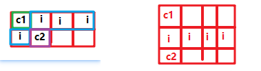

# c语言

Owner: -QVQ-

GNU C库，又称glibc是c的编译程序

# 可执行文件的生成

(以下括号内均为windows系统)

编译一次只能编译一个.cpp文件，先编译生成.o文件（.obj）。lib,dll,exe都算是最终的目标文件，是最终产物。lib和dll的命名规划都是以lib开头

**文件：**

**.o编译文（.obj）**：编译后的文件，相当于一个中间文件,.a和.so都由他生成

**.a静态库（.lib）**:将若干.o文件打包,静态库在程序编译时会被连接到目标代码中，程序运行时将不再需要该静态库。

**.ko驱动模块文件(）**：该文件的意义就是把内核的一些功能移动到内核外边， 需要的时候插入内核，不需要时卸载，在2.6版本后出现，在原本.o文件的基础上增加了一些信息，可以当成一种.o文件

**.so动态链接库(.dll）**：用于动态连接的

**生成：**

## 调用静态库得到可执行文件

```c
程序1: hello.h
#ifndef HELLO_H
#define HELLO_H
void hello(const char *name);
#endif //HELLO_H

程序2: hello.c
#include <stdio.h>
void hello(const char *name){
printf("Hello %s!\n", name);
}

程序3: main.c
#include "hello.h"
int main(){
hello("everyone");
return 0;
}
```

1.编译生成.o文件：`gcc -c hello.c`    #得到hello.o

2.由.o文件创建静态库：`ar -cr libmyhello.a hello.o`    #得到libmyhello.a

3.调用静态库得到可执行文件：`gcc main.c libmyhello.a -o hello` 或`gcc -o hello main.o libmyhello.a`  或`gcc -o hello main.c -L. -lmyhello`#得到可执行文件hello

## 调用动态库得到可执行文件

1.编译生成.o文件：`gcc -c hello.c`    #得到hello.o

2.由.o文件创建动态库：`gcc -shared -fPIC -o libmyhello.so hello.o`

3.生成可执行文件：`gcc -o hello main.c -L. -lmyhello` (如果不用-L将在/usr/lib下查找链接库)

             此时执行hello时会报错，需要将`libmyhello.so` 文件放入/usr/lib路径下

或者用`gcc -o hello main.c libmyhello.so` ,可以动态链接当前路径的.so

4.此时如果删掉.so文件 再执行hello理所应当的会报错

当静态库和动态库重名时优先用动态库

# 不需要头文件

## int main()

**`int** main(void)`

**`int** main(**int** argc)`//合法，但不常用

**`int** main(**int** argc, **char** *argv)`

**`int** main(**int** argc, **char** **argv)`

**`int** main(**int** argc, **char** *argv[],**char** *env[])`

argc:整数，为传给main()的命令行参数个数。

argv:字符串数组。

env:字符串数组。env[]的每一个元素都包含ENVVAR=value形式的字符串。其中ENVVAR为环境变量如PATH或87。value为ENVVAR的对应值如C:\DOS，C:\TURBOC(对于PATH)或YES(对于87)。

//一旦想说明这些参数，则必须按argc，argv， env的顺序

# 关键字

## **__attribute__**

1. 取消结构体对齐
2. **函数属性**
[__attribute__ 用法_wiggens的博客-CSDN博客](https://blog.csdn.net/swj9099/article/details/96713277)

## #**define** 宏名（形参表）字符串

## extern

如果全局变量不在文件的开头定义，有效的作用范围将只限于其定义处到文件结束。

关键字 extern 对该变量作“外部变量声明”，表示该变量是一个已经定义的外部变量。

- 例子
  
    ```c
    #include <stdio.h>
    int max(int x,int y);
    int main(void)
    {
        int result;
        /*外部变量声明*/
        extern int g_X;
        extern int g_Y;
        result = max(g_X,g_Y);
        printf("the max value is %d\n",result);
        return 0;
    }
    /*定义两个全局变量*/
    int g_X = 10;
    int g_Y = 20;
    int max(int x, int y)
    {
        return (x>y ? x : y);
    }
    ```
    
    在多项目的情况下可以避免重复定义
    
    ```c
    /****max.c****/
    #include <stdio.h>
    /*外部变量声明*/
    extern int g_X ;
    extern int g_Y ;
    int max()
    {
        return (g_X > g_Y ? g_X : g_Y);
    }
    
    /***main.c****/
    #include <stdio.h>
    /*定义两个全局变量*/
    int g_X=10;
    int g_Y=20;
    int max();
    int main(void)
    {
        int result;
        result = max();
        printf("the max value is %d\n",result);
        return 0;
    }
    ```
    

## inline

定义内敛函数，必须在声明的函数定义前面加上inline

目的：代替宏定义，函数的代码被放入[符号表](https://baike.baidu.com/item/%E7%AC%A6%E5%8F%B7%E8%A1%A8?fromModule=lemma_inlink)中，在使用时直接进行替换（像宏一样展开），减少函数调用的开销，效率也很高。

注意这是对编译器的请求，最后由编译器自行决定是否真的进行扩展

1. 使用宏定义在实现一些函数功能，使用[预处理器](https://baike.baidu.com/item/%E9%A2%84%E5%A4%84%E7%90%86%E5%99%A8?fromModule=lemma_inlink)实现，没有了参数压栈**，[代码生成](https://baike.baidu.com/item/%E4%BB%A3%E7%A0%81%E7%94%9F%E6%88%90?fromModule=lemma_inlink)**等一系列的操作，效率很高，
2. 但在使用它时，仅仅只是做预处理器[符号表](https://baike.baidu.com/item/%E7%AC%A6%E5%8F%B7%E8%A1%A8?fromModule=lemma_inlink)中的简单替换，因此它不**能进行参数有效性的检测**，也就**不能享受C++[编译器](https://baike.baidu.com/item/%E7%BC%96%E8%AF%91%E5%99%A8?fromModule=lemma_inlink)严格类型检查**的好处，另外它的**返回值也不能被强制转换**为可转换的**合适的类型**。这样，它的使用就存在着一系列的隐患和局限性。
3. 如果一个操作涉及到类的保护成员或私有成员，你就不可能使用这种宏定义来实现

## volatile

类型修饰符,直接存取原始内存地址

volatile提醒编译器它后面所定义的变量随时都有可能改变，因此编译后的程序每次需要存储或读取这个变量的时候，告诉编译器对该变量不做优化，都会直接从变量内存地址中读取数据而不是寄存器中读取数据

- 例子，**并行设备的硬件寄存器**
  
    ```cpp
    int *output = (unsigned int *)0xff800000;//定义一个IO端口；
    int  init(void)
    {
          int i;
          for(i=0;i< 10;i++){
            *output = i;
    }
    }
    ```
    
    经过编译器优化后，
    
    ```cpp
    int init(void)
    {
    *output =9;
    }
    ```
    
    如果你对此外部设备进行初始化的过程是必须是像上面代码一样顺序的对其赋值，显然优化过程并不能达到目的。
    
- 例子，**中断服务程序中修改的供其它程序检测的变量**
  
    当变量在触发某中断程序中修改，而编译器判断主函数里面没有修改该变量，因此可能只执行一次从内存到某寄存器的读操作，而后每次只会从该寄存器中读取变量副本，使得中断程序的操作被短路。
    

**多任务环境下各任务间共享的标志，应该加volatile；**

**存储器映射的硬件寄存器通常也要加volatile说明，因为每次对它的读写都可能由不同意义；**

**一个参数既可以是const还可以是volatile吗？**

可以的，例如只读的状态寄存器。它是volatile因为它可能被意想不到地改变。它是const因为程序不应该试图去修改它。

**一个指针可以是volatile 吗？**

可以，当一个中服务子程序修改一个指向buffer的指针时。

- **下面的函数有什么错误**
  
    ```cpp
    int  square(volatile int*ptr)
    {
        return*ptr * *ptr;//返回ptr指向内容的平方
    }
    ```
    
    多线程下，ptr可能改变，ptr可能在两次取值时取到不同的数值，正确如下
    
    ```cpp
    long square(volatile int*ptr){
        int a;
        a = *ptr;
        return a * a;
    }
    ```
    
    频繁地使用volatile很可能会增加代码尺寸和降低性能
    

# 宏

- __**LINE__**
  
    输出当前代码的行号
    
- **__func__**
  
    输出当前函数的名称
    

# 语法

- cr4 |= (1 << 21);
  
    这句话的意思是将`cr4`变量中第21位的值设为1。具体来说，`cr4`是一个32位的无符号整数，每一位代表了CR4寄存器中的一个属性。通过左移21位，可以将数字1移动到第21位，然后通过与操作符将其与`cr4`中的原值合并，即可将第21位的值设为1
    
- void *a = acb;//？
  
    ```c
    int acb *=* (int*)malloc（sizeof(int));
    void *a = acb;
    //这样的语法不是在所有编译器里都能通过的
    //linux内核开发中，实测不行
    ```
    
- 数组的初始化
  
    ```c
    int a[10]={
    	[1]=1,
    	[2]=2,
    	[9]=9
    }
    ```
    
- 结构体的初始化
  
    ```c
    typedef struct{
    	int bandrate;
    	int databits;
    	int stopbits;
    	int parity;
    	int dtr;
    }serial_hard_config_def;
    //顺序初始化
    serial_hard_config_def serial ={
    	115200,
    	8,
    	1,
    	0,
    	0
    };
    //指定初始化
    serial_hard_config_def seria2 = {
    	.bandrate = 115200,
    	.databits = 8,
    	.stopbits = 1,
    	.parity = 0,
    	.dtr = 0
    };//乱序在一些编译器里不支持
    ```
    
- int& b = a;
  
    int& b =  这里必须跟上一个int型的变量名字，且int&b必须初始化
    
    功能相当于给变量a起了个别名，他们都是共用同一个地址，存放同一个值
    
    示例：
    
    `int a = 10;`
    
    `int &b = a;`
    
    此时，a和b都是int型，并且修改其中一个，另一个值也会发生变化
    
    ```c
    int a = 1024;
    int& b = a;
    cout << &a<<' ' << &b;
    //输出同样的地址
    ```
    
- 逗号表达式
  
    两个及其以上的式子联接起来，从左往右逐个计算表达式，整个表达式的值为最后一个表达式的值。
    
    `a=(a=3**5,a**4)`//a==60
    

# 枚举

`enum season {spring, summer=3, autumn, winter};`

对应0，3，4，5

`enum season sea;` //定义枚举变量

```cpp
enum DAY
{
      MON=1, TUE, WED, THU, FRI, SAT, SUN
} day;//定义枚举的同时定义枚举变量
```

```cpp
enum 
{
      MON=1, TUE, WED, THU, FRI, SAT, SUN
} day;//直接定义枚举变量
```

枚举是连续时可以支持遍历

```cpp
enum DAY{
      MON=1, TUE, WED, THU, FRI, SAT, SUN
} day;
int main(){
    for (day = MON; day <= SUN; day++) {
        printf("枚举元素：%d \n", day);
    }
}
```

# 理论

- 结构体对⻬规则
    - 为什么要对齐
      
        1. 平台原因(移植原因)： 不是所有的硬件平台都能访问任意地址上的任意数据的；某些硬件平台只能 在某些地址处取某些特定类型的数据，否则抛出硬件异常。
        
        2.性能原因
        
        32位cpu，32位/8位=4字节，所以cpu一次工作可以取到4个字节的数据，对于如下这个数据

        
        图左：如果不对齐，需要读取到完整的i需要读取两次（或者说两行）然后拼接再一起，I/O操作是很耗时的，这是很浪费时间的。
        
        图右：如果需要更快读到数据，那一个数据最好是存在一整行，像上面第三张图那样。
        
    
    从起始地址为0开始，之后每一个数组成员都从自己成员大小的整数倍的地方开始，
    
    整个结构体的大小又以内部最大成员的大小的倍数补齐
    
    如果A结构体嵌套B结构体，B的地址以B结构体最大成员的倍数的地方开始
    
    数组的话起始地址只按数组的一个值来算
    
    ```c
    struct X
    {
        char a;   //1
        double b; //8
        int c;    //4
    }//24
    struct X
    {
        char a;   //1
        int c;    //4
        double b; //8
    }//16
    ```
    
    ```c
    struct X
    {
        char a;   //1
        int b;    //4
        double c; //8
    };
    
    struct Y
    {
        char a; //8
        X b;// 16
    };//8+16=24,a的大小应为X中元素最宽元素double c的倍数而不是16的倍数
    ```
    
    ```c
    struct tag0
    {
        int a;               //4
        char b;              //1
    } _attribute_ ((packed)); //编译器选项，不填充
    ```
    
    ```c
    typedef union {
    	 long i;//4
    	 int k[5];
    	 char c; 
    } DATE; //20
    
    struct data {
    	int cat;//4
    	DATE cow;//20，这里里面的元素是4，所以计算补齐时这里不按20来算，而是按4来算
    	double dog;//8
    	//int a;//加上后变40（最大宽度为8，补齐8的倍数）
    };//32（最大宽度为8，所以8的倍数）
    ```
    
- 位域
  
    结构体位域大小计算原则
    
    1.如果相邻位域字段的类型相同，且其位宽之和小于类型的sizeof大小，则后面的字段将紧邻前一个字段存储，直到不能容纳为止；
    
    2.如果相邻位域字段的类型相同，但其位宽之和大于类型的sizeof大小，则后面的字段将从新的存储单元开始，其偏移量为其类型大小的整数倍；
    
    3.如果相邻的位域字段的类型不同，则各编译器的具体实现有差异，VC6采取不压缩方式，Dev-C++采取压缩方式；
    
    4.如果位域字段之间穿插着非位域字段，则不进行压缩；
    
    1. 整个结构体的总大小为最宽基本类型成员大小的整数倍。
    
    //1.char占1个字节8位，由于b1只占用前5位，但是后三位不够存放b2（则需要用新的存储单元来放b2）
    
    //2.所以b2存放在新的存储空间,以此类推，
    
    8+8+8+8+8=5个字节 typedef struct AA {undefined
    
    unsigned char b1 : 5; //位域，char占1个字节8位，5代表b1占用前5位，后3位不用
    
    unsigned char b2 : 5;
    
    unsigned char b3 : 5;
    
    unsigned char b4 : 5;
    
    unsigned char b5 : 5; } AA;
    
    //1.int占4个字节32位，b1占用1位（0），空出两位（12），b3占用3位（35），b4占用2位（56），b5占用3位（79）
    
    //2.b5遇到类型不同的short b6,b6需要存在新的存储单元，补齐之后b1和b3b5占4个字节，b6占用4位（03），
    
    //3.b6遇到类型不同的int b7，b7需要存在新的存储单元,补齐之后b6占4个字节（short占4个字节32位）
    
    //4.b7占用1位（0），补齐之后b7占用4个字节，所以结构体大小为4+4+4=12个字节
    
    typedef struct CC
    
    {
    
    int b1 : 1;
    
    int : 2;    //空出2位，啥也没存
    
    int b3 : 3; //b1~b5为同类型的变量，所以可以存储在连续的空间中，总共占4个字节
    
    int b4 : 2;
    
    int b5 : 3;
    
    short b6 : 4; //b6和上面的类型不同，所以需要存储在新的单元中，总共占4个字节
    
    int b7 : 1;   //b7和上面的b6类型不同，所以需要存储在新的单元中，总共占4个字节
    
    } CC;
    
    //1.int占4个字节32位,a占用29位，剩余的3位不够放b的29位，所以b存放在新的单元中，剩余的3位不够放c的4位
    
    //2.所以c存放在新的单元中，所以结构体大小4+4+4=12
    
    struct test3
    
    {
    
    int a : 29;
    
    int b : 29;
    
    int c : 4;
    
    };
    

## itoa 函数

`itoa` 函数是将整数转化为字符串的函数。它的函数原型为：

```c
char* itoa(int value, char* str, int base);

```

其中，`value` 为要转化的整数，`str` 为转化后的字符串，`base` 为进制数（如十进制、八进制、十六进制等）。

`itoa` 函数的功能主要有以下两个：

- 将整数转化为指定进制的字符串；
- 将字符串反转。

atoi