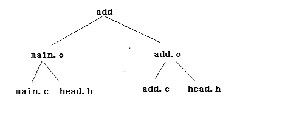
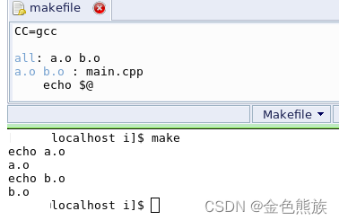

# Makefile

Owner: -QVQ-

- 基础编写形式
  
    `target ... （参数）: prerequisites ...`
    
    `（tab）command`
    
    解释为：
    
    目标：依赖文件（即目标文件由哪些文件生成）
    
    （制表符）执行指令 ...（即通过执行指令，从而使依赖文件生成目标文件）
    
    make并不管命令是怎么工作的，他只管执行所定义的命令。make会比较目标文件和依赖文件的修改日期，即时间戳如果依赖文件的日期要比目标文件的日期要新，或者目标不存在的话，那么，make就会执行后续定义的命令
    
    例：对于如下结构的makefile编写

    
    ```makefile
    #整个文件的第一个目标：依赖文件，将是默认目标，也就是最终生成的文件
    #可以通过**关键字all**:目标文件，来指定最终生成的文件
    add:main.o add.o                    #目标文件add将由main.o、add.o生成
    	gcc -o add main.o add.o -l m			#具体生成的指令
    	
    main.o:main.c 					#main.o将由main.c 生成
    	gcc -c main.c					#具体生成的指令
     
    add.o:add.c 
    	gcc -c test.c
     
    clean:							    #这是通用的命名规范，清理中间文件
    	rm main.o add.o add
    #clean没有被第一个目标add直接或间接依赖，那么它后面的命令就不会被自动执行
    #写在这里是为了让make可以调用，方便的作清除
    #可以在make 命令后面跟clean目标作为参数来执行其后所定义的命令，如make clean
    ```
    
    当.c文件过多时，就可以用中间变量来记录
    
    ```makefile
    SRC = $(wildcard *.c)
    #wildcard  实现匹配目录下所有.c 文件，并将其赋值给SRC变量。
    OBJ = $(patsubst %.c, %.o, $(SRC))
    #patsubst  实现取出SRC中的所有值，然后将.c 替换为.o 最后赋值给OBJ变量
     
    ALL: hello.out #这是通用的命名规范，ALL:来指定要生成的文件，调用的命令需要make all
     
    hello.out: $(OBJ)
            gcc $(OBJ) -o hello.out
     
    $(OBJ): $(SRC)
            gcc -c $(SRC) -o $(OBJ)
    clean: 			    
    	……
    ```
    
    `@语句`表示这个语句不输出在命令行上
    
- 对目标的参数
  
    `-objs` ：表示这个目标是由多个依赖文件生成
    
    例：`PrintModule-objs := DriverMain.o DriverFileOperations.o`
    
    表示 `PrintModule`是由`DriverMain.o`和`DriverFileOperations.o`组成的
    
    `-m`:表示该文件作为模块编译
    
    `-y`：把由.c 或者 .s 文件编译得到.o 并连接进内核.
    
- 特殊目标（）
  
    在 Makefile 中,有一些名字,当它们作为规则的目标时,具有特殊含义。它们是一些特殊的目标
    
    - 伪目标（PHONY）
      
        clean和all关键字都是我们约定的通用的命名规范，
        
        有时当前目录包含了同名文件，需要用PHONY关键字来指定后面的参数是伪目标，
        
        程序一般都要这么写才严谨，all写在前面，clean写在文件最后
        
        ```makefile
        PHONY: clean ALL
        ALL: ……
        clean:
        		……
        
        #**clean**和**all**都是伪目标没有依赖文件，只有用make来调用时才会执行
        #**PHONY: 参数1，……**  当前目录里如果有同名的文件，用.PHONY将后面的参数设置为伪目标
        ```
        
        当用命令make clean时，才会执行clean后面的命令行
        
        如果想要开始编译时就清理一些东西，可以将clean写进依赖项，这是一个好的习惯
        
        ```makefile
        .PHONY: clean ALL
        clean:
        		……
        ALL: ……，clean
        #此时程序调用时就会先执行一次clean做一次清理
        ```
        
    - DEFAULT
      
        通常make会视第一个目标为最终目标
        
        但有可能出现整文没有一个目标存在，则会执行DEFAULT后的语句
        
        ```makefile
        all:gao
            @echo "final"
        #此时若gao这个依赖文件并不存在，此时没有目标，则会执行DEFAULT后的语句
        DEFAULT:
        @echo "In default"
        ```
        
    - SUFFIXES:
    - PRECIOUS
    - INTERMEDIATE
    - SECONDARY
    - DELETE_ON_ERROR
    - IGNORE
- 添加调试信息
    - 直接在ifneq中使用echo会报错，不确定是否我写的有问题
      
        
    
    info：`$(info “here add the debug info”)`
    
    注,info信息,不打印信息所在行号
    
    warning：`$(warning “here add the debug info”)`
    
    error:`$(error “error: this will stop the compile”)`
    
    这个参数可以停止当前makefile的编译
    
- 嵌套Makefile执行
  
    用关键字subsystem，通常在外部总Makefile里可以这样写：
    
    ```makefile
    subsystem:
                cd subdir && $(MAKE)
    其等价于：
    subsystem:
                $(MAKE) -C subdir
    #表示目录subdir下也需要编译，MAKE为自己定义的变量，代表编译时要传入的参数
    ```
    
    如果需要向下级的Makefile**传递变量**、用**export**关键字指定要传递的变量，**unexport关键字**指定不传递的变量，单独的export表示传递所有变量
    
    ```makefile
    export variable := value
    等价于
    variable := value
    export variable
    ```
    
- 常见的环境变量
  
    **${MAKE}** 就是预设的 make 这个命令的名称
    
    **$(MAKECMDGOALS)**存放你所指定的终极目标的列表
    
    ```makefile
    sources = foo.c bar.c    
    ifneq ( $(MAKECMDGOALS),clean)    
    include $(sources:.c=.d)    
    endif
    #只要我们输入的命令不是“make clean”，那么 makefile 会自动包含“foo.d”和“bar.d”这两个 makefile。
    ```
    
    **$(shell 命令)** 得到shell命令执行的结果
    
- 常见的预定义变量
  
  
    | 预定义变量 | 名称或选项 | 默认值 |
    | --- | --- | --- |
    | AR | 库文件维护程序的名称 | ar |
    | AS | 汇编程序名称的 | as |
    | CC | C编译器的名称 | cc |
    | CPP | C预编译器的名称 | $(CC) –E |
    | FC | C++编译器的名称 | f77 |
    | RM | FORTRAN编译器的名称 | rm  -f |
    | ARFLAGS | 文件删除程序的名称 | 无 |
    | CPPFLAGS | C编译器的选项
    （预处理） | 无 |
    | CFLAGS | C[编译器](https://so.csdn.net/so/search?q=%E7%BC%96%E8%AF%91%E5%99%A8&spm=1001.2101.3001.7020)的选项 | 无 |
    | LDFLAGS | 链接库使用的选项 
    –L -l (大写L指定动态库的路径，小写L指定动态库的名称) |  |
    | ASFLAGS | 库文件维护程序的选项 | 无 |
    | CXXFLAGS | C++编译器的选项 | 无 |
    | FFLAGS | FORTRAN编译器的选项 | 无 |
    
    CC是make程序自带的变量（内建变量，隐含变量），默认指向cc
    
    cc是一个符号链接，linux系统中指向gcc。unix系统是cc编译器
    
- 常见的自动变量
  
  
    | 自动变量 | 含义 |  |  |
    | --- | --- | --- | --- |
    | $* | **不包含扩展名**的目标文件名称 |  |  |
    | $+ | **所有的依赖文件**，以空格分开，并以出现的先后为顺序，可能包含重复的依赖文件 |  |  |
    | $< | **第一个依赖文件的名称** |  |  |
    | $? | 所有**时间戳**比目标文件完**晚**的**依赖文件**，并以空格分开 |  |  |
    | $@ | **目标文件的完整名称** | （目标就是冒号":"左边的文件名），左边有多个目标时，$@一次只会对应一个目标。 |  |
    | $^ | 所有**不重复的依赖文件**，以空格分开 |  |  |
    | $% | 如果目标是归档成员，则改变量表示目标的**归档成员**名称 |  |  |

    
- 变量赋值(= 与 :=与?=)
  
    变量赋值：
    
    = 将整个makefile展开后，再决定变量的值，变量的值将会是整个makefile中最后被指定的值
    
    := 变量的值取决于它在makefile中的位置
    
    ?= 如果变量已经赋值了则跳过这一句，其他和=一样
    
    ```makefile
    x = foo
    y = $(x) bar
    x = xyz
    # y = xyz bar
    ```
    
    ```makefile
    x := foo
    y := $(x) bar
    x := xyz
    # y = foo bar
    ```
    
    变量的读取：$(变量名)
    
- 适应不同硬件平台的程序（ifeq、fineq）
  
    用于：同一个打包环境打包出适应不同硬件平台的程序。判断本次打包的程序将要在什么平台上运行，从而选择不同的交叉工具编译链去编译程序。
    
    ifeq、fineq：等价于if
    
    ```makefile
    ifeq(参数1，参数2)：
    	#如果两者相等，执行,ifneq为两者不相等执行
    else
    	……
    endif
    #没有与或非的语法，所以多条件判断的执行如下
    ifeq ($(findstring MAJRS,$(SupportDevices))$(findstring CUSTOM,$(Specialities)), MAJRSCUSTOM)
    	#查找SupportDevices里有没有字符串MAJRS，并查找Specialities字符串里有没有CUSTOM，
    	#两者拼接起来和MAJRSCUSTOM比较
    	……
    endif
    ```
    
    如果当前路径存在则删除
    
    ```makefile
    ifeq ($(wildcard build),)
        @echo "no build"
    else
        rm -r build
    endif
    ```
    
- 对部分内容编译（ifeq、ifneq）
  
    对程序代码优化的考虑。希望只对其中一部分内容进行编译，即条件编译
    
    ```makefile
    #makefile中
    ifeq ($(type), 1)
    	CFLAGS += -DTYPE //#-D 是gcc用来添加宏定义的
    endif
    
    #生成可执行程序
    gcc %.c CFLAGS
    ```
    
    ```c
    /*********.c文件里的代码********/
    #ifdef TYPE
    	i = 1;
    #else
    	i = 2;
    #endif
    ```
    
    编译时make type=1, ifeq语句成立, 定义"TYPE", .c文件编译时#ifdef成立，此时“i=1”
    
    编译时make , ifeq语句不成立，此时不会定义"TYPE"，c文件编译时#ifdef不成立，则“i=2”
    
- 模块构造
  
    ```makefile
    #这是一个完整的makefile文件
    ifneq ($(KERNELRELEASE),)
            obj-m := PrintModule.o 
    				#obj在linux顶层的makefile中定义了
    				#-m表示后面为一个模块，需要从目标文件PrintModule.o中构造，该模块名为PrintModule.ko
            PrintModule-objs := DriverMain.o DriverFileOperations.o
    				#-objs说明PrintModule由多个目标文件构成；这里有两个编译单元
    				#一个编译单元（是指一个.cpp文件以及它所#include的所有.h文件）对应一个目标文件(.o文件)
    				$(info "ifneq branch")
    EXTRA_CFLAGS := -DTEST_DEBUG -ggdb -O0 #这部分在下面讲
    else
    				KERNELDIR ?= /lib/modules/$(shell uname -r)/build
            PWD := $(shell pwd)
    				$(info "else branch")
    default:
    #刚开始还没有和内核关联到一起，KERNELRELEASE没有定义，一定走else分支，执行default
            $(info "else branch")
    				$(MAKE) -C $(KERNELDIR) M=$(PWD) modules
    				#M:表示在构造模块之前，回到目录PWD,再次执行当前目录下的Makefile，也就是这个makefile再执行一次
    				#这里的意思是前面发现KERNELRELEASE这个参数没有定义，所以去内核重新编译以下，让他定义出来，再执行这里的makefile
            rm *.order *.symvers *.mod.c *.o .*.o.cmd .*.cmd .tmp_versions -rf
    endif
    ```
    
    ```bash
    #在自己写的编译模块的地址执行make后，上诉会生成如下信息
    "else branch"
    default
    make -C /lib/modules/5.19.0-38-generic/build M=/home/用户名/file/linux-kernel-1/2.1/PrintingDriver modules
    make[1]: Entering directory '/usr/src/linux-headers-5.19.0-38-generic'
    "ifneq branch"
      CC [M]  /home/liangzisong/file/linux-kernel-1/2.1/PrintingDriver/DriverMain.o
      CC [M]  /home/liangzisong/file/linux-kernel-1/2.1/PrintingDriver/DriverFileOperations.o
      LD [M]  /home/liangzisong/file/linux-kernel-1/2.1/PrintingDriver/PrintModule.o
    "ifneq branch"
      MODPOST /home/user/file/linux-kernel-1/2.1/PrintingDriver/Module.symvers
      CC [M]  /home/user/file/linux-kernel-1/2.1/PrintingDriver/PrintModule.mod.o
      LD [M]  /home/user/file/linux-kernel-1/2.1/PrintingDriver/PrintModule.ko
    make[1]: Leaving directory '/usr/src/linux-headers-5.19.0-38-generic'
    ```
    
    从而得到上诉代码的执行流程：
    
    刚开始还没有和内核关联到一起，KERNELRELEASE没有定义，一定走else分支，执行default，在default中`$(MAKE) -C $(KERNELDIR) M=$(PWD) modules`命令会到内核中开始编译，内核在编译模块前，`M=$(PWD)`选项会使得再次执行当前的makefile，（如下是顶层makefile关于KERNELRELEASE的代码，可以看到export修饰了KERNELRELEASE），此时KERNELRELEASE从顶层的makefile中定义了传递过来，这里的ifneq成立。执行了这里的makefile后回到内核进行模块编译
    
    ```makefile
    # Read KERNELRELEASE from include/config/kernel.release (if it exists)
    KERNELRELEASE = $(shell cat include/config/kernel.release 2> /dev/null)
    KERNELVERSION = $(VERSION)$(if $(PATCHLEVEL),.$(PATCHLEVEL)$(if $(SUBLEVEL),.$(SUBLEVEL)))$(EXTRAVERSION)
    export VERSION PATCHLEVEL SUBLEVEL KERNELRELEASE KERNELVERSION
    ```
    
- 编译器参数赋值（CFLAGS、……）
  
    有两种使用，**一是 -I(大写i)路径**    指定头文件（.h）的路径。
    
    二**是用-D作定义，**需要配合如下参数(linux开发中，以下参数都在总makefile已经定义，通常我们都是对他们写，并不直接对CFLAGS这一类写入)
    
    EXTRA_CFLAGS：是使用$（CC）/gcc编译C文件的编译参数选项。
    
    $(EXTRA_AFLAGS) 是每个目录编译汇编语言源文件的选项。
    
    $(EXTRA_LDFLAGS) 和 $(EXTRA_ARFLAGS) 用于每个目录的 $(LD) 和 $(AR) 选项。
    
    对于他的使用，以下以EXTRA_CFLAGS举例
    
    **参数1：TEST_DEBUG**
    
    ```c
    //.c文件中
    #ifdef TEST_DEBUG
    	#define DEBUG_PRINT_LINE(...) do{printk(KERN_ALERT "ErrLine : %s::%d\nErrorInfo : ", __FILE__, __LINE__); printk(KERN_ALERT __VA_ARGS__);}while(0)
    	#define DEBUG_PRINT(...) printk(KERN_ALERT __VA_ARGS__)
    #else
    	#define DEBUG_PRINT_LINE(...)
    	#define DEBUG_PRINT(...)
    #endif
    //如果定义了TEST_DEBUG就 定义debug函数，否则为空
    ```
    
    ```makefile
    #makefile文件中
    EXTRA_CFLAGS := -DTEST_DEBUG -ggdb -O0
    #-DTEST_DEBUG -ggdb -O0表示定义TEST_DEBUG -ggdb -O0这几个宏
    #TEST_DEBUG是在如上.c文件中定义的，加入这个参数，就能输出debug信息用于调试。
    	#当生成用户使用的版本时，则取消这个参数，可以不打出debug信息
    CFLAGS += $(EXTRA_CFLAGS)
    #这个语句通常在别的文件，放在这里只是想说明EXTRA_CFLAGS参数的作用，仅作为中间参数
    #CFLAGS是makefile中预定义的变量
    #依照这种规则，如果不同makefile里作了不同的EXTRA_CFLAGS，最终他们都会被执行？
    ```
    
    使用EXTRA_CFLAGS的理由：在外部传入CFLAGS会将makefile中的变量CFLAGS中的值覆盖掉，而采用EXTRA_FLAGS则能将相应的值追加上去。
    
    **参数2：-ggdb**
    
    加入调试信息
    
    - **-g2** 默认选项 生成操作相同的原生格式（native format）GDB可直接使用
    - **g0** 不包含任何调试信息，等于不使用-g选项
    - **g1** 不包含局部变量和与行号有关的调试信息，因此只能够用于**回溯跟踪和堆栈转储**之用。
    - **g3** 包含级别2中的所有调试信息，以及源代码中定义的**宏**
    - **-ggdb** 专门为GDB生成的GDB专用的更丰富的调试信息
    - **-ggdb0、-ggdb1、-ggdb2、-ggdb3**解释同-g0、-g1、92、-g3
    
    (回溯跟踪指的是监视程序在运行过程中的函数调用历史)
    
    (堆栈转储则是一种以原始的十六进制格式保存程序执行环境的方法）
    
    **参数3：-O0**
    
    表示优化级别
    
    - -O0:表示不优化，默认选项
    - -O1:基本优化级别
    - -O2:主要是优化时间效率，不考虑生成的目标文件大小
    - -O3:最高优化级别，通常生成太多用不到的东西
    - -Os:优化生成的目标文件大小，并且激活-O2中的不增加代码大小的优化选项（对于嵌入式，以及网络上的程序比较重要）
    - -Og:gcc4.8中引入的优化级别。针对快速编译和超强的调试体验，并同时提供合理的运行效率。该级别比使用-O0整体效果好
    
    如：`CFLAGS=-I/usr/include -I/path/include` 
    
- 指令
    - `$(foreach v,1,text)`
      
        v是变量名，1是字符串，text是makefile代码
        
        foreach循环将V值取出，带入text中
        
        ```makefile
        list:=one two three
        result =$(foreach v,$(list),$(echo $(v))).
        ```
        
        等同于 `echo one two three`
        
    - `$(if $(KBUILD_SRC),$(KBUILD_SRC),$(CURDIR))`
      
        如果 `$(KBUILD_SRC)` 为真（存在），就返回 `$(KBUILD_SRC)`，否则就返回 `$(CURDIR)`
        
    - `$(patsubst <pattern>,<replacement>,<text>)`
      
        函数说明：函数功能是查找 text 中的单词是否符合模式 pattern，如果匹配的话，则用 replacement 替换。返回值为替换后的新字符串
        
        ```makefile
        OBJ=$(patsubst %.c,%.o,1.c 2.c 3.c)
        all:
        @echo $(OBJ)
        ```
        
    - `$(subst <from>,<to>,<text>)`
      
        函数说明：函数的功能是把字符串中的 form 替换成 to，返回值为替换后的新字符串。实例：
    
- linux下的make命令
  
  
    | `make menuconfig` | 配置 |
    | --- | --- |
    | `make modules_install` | 将模块文件拷贝到根文件目录，/lib/modules/$(uname -r)/ |
    | `make modules` | 编译模块 |
    | `make install` | 安装内核 |
    | `make zImage` | zImage适用于小内核 |
    | `make bzImage` | **bzImage是压缩的内核映像** |
    |  |  |
- make参数
  
    -j4 ：表示用4线程编译
    
    `M=$(PWD)`选项会使得再次执行当前的makefile，
    
    `-C 路径`: 在路径下做make
    
    `CFLAGS`是一个makefile中的预定义变量，用于传递编译器的选项。可以通过设置`CFLAGS`变量来控制编译器的行为，例如指定包含目录、编译选项等。